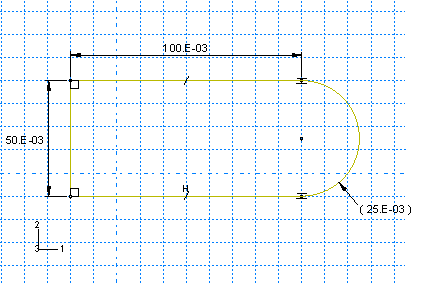
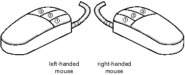
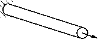
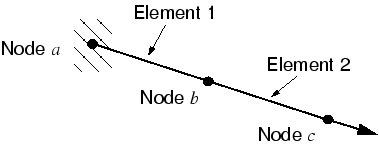
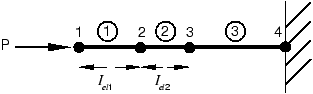

1 Introduction
## 1. Introduction

Abaqus is a suite of powerful engineering simulation programs, based on the finite element method, that can solve problems ranging from relatively simple linear analyses to the most challenging nonlinear simulations. Abaqus contains an extensive library of elements that can model virtually any geometry. It has an equally extensive list of material models that can simulate the behavior of most typical engineering materials including metals, rubber, polymers, composites, reinforced concrete, crushable and resilient foams, and geotechnical materials such as soils and rock. Designed as a general-purpose simulation tool, Abaqus can be used to study more than just structural (stress/displacement) problems. It can simulate problems in such diverse areas as heat transfer, mass diffusion, thermal management of electrical components (coupled thermal-electrical analyses), acoustics, soil mechanics (coupled pore fluid-stress analyses), piezoelectric analysis, electromagnetic analysis, and fluid dynamics.

Abaqus offers a wide range of capabilities for simulation of linear and nonlinear applications. Problems with multiple components are modeled by associating the geometry defining each component with the appropriate material models and specifying component interactions. In a nonlinear analysis Abaqus automatically chooses appropriate load increments and convergence tolerances and continually adjusts them during the analysis to ensure that an accurate solution is obtained efficiently.

### Getting started with Abaqus

This guide is an introductory text designed to give new users guidance in creating solid, shell, beam, and truss models with Abaqus/CAE, analyzing these models with Abaqus/Standard and Abaqus/Explicit, and viewing the results in the *Visualization module. A brief introduction to using Abaqus/CFD is included as an appendix. You do not need any previous knowledge of Abaqus to benefit from this guide, although some previous exposure to the finite element method is recommended. If you are already familiar with the Abaqus solver products (Abaqus/Standard or Abaqus/Explicit) but would like an introduction to the Abaqus/CAE interface, three tutorials are provided in the appendices of this guide to lead you through the modeling process in Abaqus/CAE.

This document covers primarily stress/displacement simulations, concentrating on both linear and nonlinear static analyses as well as dynamic analyses. An introduction to CFD analysis and modeling fluid-structure interaction is also included. Other types of simulations, such as heat transfer and mass diffusion, are not covered.

*### 1.2.1 How to use this guide

The different sections of this guide are addressed to different types of users.**Tutorials for new Abaqus users**If you are completely new to Abaqus, we recommend that you follow each of the self-paced tutorials in this guide. Each of the chapters and appendices in this guide introduces one or more topics relevant to using Abaqus/Standard, Abaqus/Explicit or Abaqus/CFD. Throughout the guide the term Abaqus is used to refer collectively to all three analysis products; the individual product names are used when information applies to only one product. Most chapters contain a short discussion of the topic or topics being considered and one or two tutorial examples. You should work through the examples carefully since they contain a great deal of practical advice on using Abaqus.

The capabilities of Abaqus/CAE are introduced gradually in these examples. It is assumed that you will use Abaqus/CAE to create the models used in the examples. You can also generate the model for any example using a script that replicates the complete analysis model for the problem. A model created from a script may differ slightly from that created by following the steps in this guide. These differences, such as material names or node numbers, are minor and can be ignored. Scripts are available in two locations:- A Python script is provided for each example in Appendix A, "Example Files." The same section also provides instructions on how to fetch the script and run it within Abaqus/CAE.
- Abaqus/CAE plug-in scripts are provided for each example in the **Getting Started Examples** dialog box of the Abaqus/CAE Plug-in toolset. For more information about running these scripts, see "Running the Getting Started with Abaqus examples,"  Section 82.1 of the Abaqus/CAE User's Guide.

If you do not have access to Abaqus/CAE or another preprocessor, you can use the companion guide, Getting Started with Abaqus: Keywords Edition, to create the input files needed for most of the examples manually.

This chapter is a short introduction to Abaqus and this guide. [Chapter 2, "Abaqus Basics](ch02.md)," which is centered around a simple example, covers the basics of using Abaqus. By the end of [Chapter 2, "Abaqus Basics](ch02.md)," you will know the fundamentals of how to prepare a model for an Abaqus simulation, check the data, run the analysis job, and view the results.

[Chapter 3, "Finite Elements and Rigid Bodies](ch03.md)," presents an overview of the main element families available in Abaqus. The use of continuum (solid) elements, shell elements, and beam elements is discussed in [Chapter 4, "Using Continuum Elements](ch04.md)"; [Chapter 5, "Using Shell Elements](ch05.md)"; and [Chapter 6, "Using Beam Elements](ch06.md)"; respectively.Linear dynamic analyses are discussed in [Chapter 7, "Linear Dynamics](ch07.md)." [Chapter 8, "Nonlinearity](ch08.md)," introduces the concept of nonlinearity in general, and geometric nonlinearity in particular, and contains the first nonlinear Abaqus simulation. Nonlinear dynamic analyses are discussed in [Chapter 9, "Nonlinear Explicit Dynamics](ch09.md)," and material nonlinearity is introduced in [Chapter 10, "Materials](ch10.md)." [Chapter 11, "Multiple Step Analysis](ch11.md)," introduces the concept of multistep simulations, and [Chapter 12, "Contact](ch12.md)," discusses the many issues that arise in contact analyses. Using Abaqus/Explicit to solve quasi-static problems is presented in [Chapter 13, "Quasi-Static Analysis with Abaqus/Explicit](ch13.md)." The illustrative example is a sheet metal forming simulation, which requires importing between Abaqus/Explicit and Abaqus/Standard to perform the forming and springback analyses efficiently.

You may find it easier to follow these tutorial examples in the PDF version of this guide. This approach reduces clutter on the screen and allow you to focus on the task at hand. If you do follow the tutorials in HTML, you should resize and move the Abaqus/CAE window and your web browser so both are visible while you work through a tutorial.

**Abaqus/CAE tutorials for experienced Abaqus users**Four appendices are provided to introduce users familiar with the Abaqus analysis products to the Abaqus/CAE interface. In [Appendix B, "Creating and Analyzing a Simple Model in Abaqus/CAE](ap02.md)," you create a simple model, analyze it, and then view the results. The second tutorial, [Appendix C, "Using Additional Techniques to Create and Analyze a Model in Abaqus/CAE](ap03.md)," is more complex and illustrates how parts, sketches, datum geometry, and partitions work together and how you assemble part instances. [Appendix D, "Viewing the Output from Your Analysis](ap04.md)," demonstrates how you can use the *Visualization* module (also licensed separately as Abaqus/Viewer) to display your results in a variety of formats and how you can customize the display. [Appendix E, "Flow through a bent tube](ap05.md)," illustrates how you can use Abaqus/CFD to model fluid flow through a bent tube and use Abaqus/Standard to model structural deformation in the tube.

### 1.2.2 Conventions used in this guide

This guide adheres to the following conventions:**Typographical conventions**Different text styles are used in the tutorial examples to indicate specific actions or identify items.

- Input in `COURIER FONT` should be typed into Abaqus/CAE or your computer exactly as shown. For example,```
abaqus cae
```would be typed on your computer to run Abaqus/CAE.
- Menu selections, tabs within dialog boxes, and labels of items on the screen in Abaqus/CAE are indicated in bold:```
**View*****Graphics Options**
**Contour Plot Options**
```
**Sketcher figures**Sketches are two-dimensional profiles that form the geometry of features defining an Abaqus/CAE native part. You use the Sketcher to create these sketches, as shown in [Figure 1-2](ch01s02.html#gsa-intro-sketcher). The Sketcher displays major gridlines in a solid line style and the X*- and *Y*-axes of the sketch and minor gridlines in a dashed line style. In order to visually distinguish the part sketch from the Sketcher grid, the gridlines in most of the Sketcher figures in this guide are dashed.



**View orientation triad**By default, Abaqus/CAE uses the alphabetical option, *x-y-z*, for labeling the view orientation triad. In general, this guide adopts the numerical option, 1-2-3, to permit direct correspondence with degree of freedom and output labeling. The view orientation triad is shown in the lower left corner of [Figure 1-2](ch01s02.html#gsa-intro-sketcher).

### 1.2.3 Basic mouse actions

[Figure 1-3](ch01s02.html#gst-mouse) shows the mouse button orientation for a left-handed and a right-handed 3-button mouse.


The following terms describe actions you perform using the mouse:**Click**Press and quickly release the mouse button. Unless otherwise specified, the instruction "click" means that you should click mouse button 1.**Drag**Press and hold down mouse button 1 while moving the mouse.

**Point**Move the mouse until the cursor is over the desired item.

**Select**Point to an item and then click mouse button 1.

**[Shift]****+Click**Press and hold the **[Shift]** key, click mouse button 1, and then release the **[Shift]** key.

**[Ctrl]****+Click**Press and hold the **[Ctrl]** key, click mouse button 1, and then release the **[Ctrl]** key.

Abaqus/CAE is designed for use with a 3-button mouse. Accordingly, this guide refers to mouse buttons 1, 2, and 3 as shown in [Figure 1-3](ch01s02.html#gst-mouse). However, you can use Abaqus/CAE with a 2-button mouse as follows:- The two mouse buttons are equivalent to mouse buttons 1 and 3 on a 3-button mouse.
- Pressing both mouse buttons simultaneously is equivalent to pressing mouse button 2 on a 3-button mouse.
**Tip:
**You are instructed to click mouse button 2 in procedures throughout this guide. Make sure that you configure mouse button 2 (or the wheel button) to act as a middle button click.

### Abaqus documentation

The documentation for Abaqus is extensive and complete. The following documentation and publications are available from SIMULIA through the Abaqus HTML documentation and in PDF format. For more information on accessing the HTML guides, refer to the discussion of execution procedures in the Abaqus Analysis User's Guide. For more information on printing the guides, refer to "Printing from a PDF book,"  Section 5.3 of Using Abaqus Online Documentation.

**Abaqus Analysis User's Guide**This guide contains a complete description of the elements, material models, procedures, input specifications, etc. It is the basic guide for Abaqus/Standard, Abaqus/Explicit, and Abaqus/CFD; and it provides both input file usage and Abaqus/CAE usage information. This guide regularly refers to the Abaqus Analysis User's Guide, so you should have it available as you work through the examples.

**Abaqus/CAE User's Guide**This guide includes detailed descriptions of how to use Abaqus/CAE for model generation, analysis, and results evaluation and visualization. Abaqus/Viewer users should refer to the information on the *Visualization* module in this guide.

**Using Abaqus Online Documentation**This guide contains instructions for navigating, viewing, and searching the Abaqus HTML and PDF documentation. In addition, this guide explains how to use the PDF documentation to produce a high quality printed copy and how to use the  icon in all PDF books except the Abaqus Scripting Reference Guide and the Abaqus GUI Toolkit Reference Guide to print a selected section of a book.

**Other Abaqus documentation:**

**Abaqus Example Problems Guide**This guide contains detailed examples designed to illustrate the approaches and decisions needed to perform meaningful linear and nonlinear analysis. Many of the examples are worked with several different element types, mesh densities, and other variations. Typical cases are large motion of an elastic-plastic pipe hitting a rigid wall; inelastic buckling collapse of a thin-walled elbow; explosive loading of an elastic, viscoplastic thin ring; consolidation under a footing; buckling of a composite shell with a hole; and deep drawing of a metal sheet. It is generally useful to look for relevant examples in this guide and to review them when embarking on a new class of problem.

When you want to use a feature that you have not used before, you should look up one or more examples that use that feature. Then, use the example to familiarize yourself with the correct usage of the capability. To find an example that uses a certain feature, search the online documentation or use the **abaqus findkeyword** utility (see "Querying the keyword/problem database,"  Section 3.2.15 of the Abaqus Analysis User's Guide, for more information).

All the input files associated with the examples are provided as part of the Abaqus installation. The **abaqus fetch** utility is used to extract sample Abaqus input files from the compressed archive files provided with the release (see "Fetching sample input files,"  Section 3.2.16 of the Abaqus Analysis User's Guide, for more information). You can fetch any of the example files so that you can run the simulations yourself and review the results. You can also access the input files through the hyperlinks in the Abaqus Example Problems Guide.

**Abaqus Benchmarks Guide**This guide contains benchmark problems and analyses used to evaluate the performance of Abaqus; the tests are multiple element tests of simple geometries or simplified versions of real problems. The NAFEMS benchmark problems are included in this guide.

**Abaqus Verification Guide**This guide contains basic test cases, providing verification of each individual program feature (procedures, output options, MPCs, etc.) against exact calculations and other published results. It may be useful to run these problems when learning to use a new capability. In addition, the supplied input data files provide good starting points to check the behavior of elements, materials, etc.

**Abaqus Theory Guide**This guide contains detailed, precise discussions of all theoretical aspects of Abaqus. It is written to be understood by users with an engineering background.

**Abaqus Keywords Reference Guide**This guide contains a complete description of all the input options that are available in Abaqus/Standard, Abaqus/Explicit, and Abaqus/CFD.

**Abaqus User Subroutines Reference Guide**This guide contains a complete description of all the user subroutines available for use in Abaqus analyses. It also discusses the utility routines that can be used when writing user subroutines.

**Abaqus Glossary**This guide defines technical terms as they apply to the Abaqus Unified FEA Product Suite.

**Abaqus Release Notes**This guide contains brief descriptions of the new features available in the latest release of the Abaqus product line.

**Abaqus Installation and Licensing Guide**This guide describes how to install Abaqus and how to configure the installation for particular circumstances. Some of this information, of most relevance to users, is also provided in the Abaqus Analysis User's Guide.

In addition to the documentation listed above, the following guides are available for Abaqus interfaces and custom programming techniques not discussed in this guide:- Abaqus Scripting User's Guide
- Abaqus Scripting Reference Guide
- Abaqus GUI Toolkit User's Guide
- Abaqus GUI Toolkit Reference Guide
SIMULIA also provides documentation for all of the geometry translators described in ["The Abaqus products,"  Section 1.1](ch01s01.md).

**Additional publications available from SIMULIA:**

**Quality Assurance Plan**This document describes the QA procedures followed by SIMULIA. It is a controlled document, provided to customers who subscribe to either the Nuclear QA Program or the Quality Monitoring Service.

**Abaqus online resources**SIMULIA has a home page on the World Wide Web ([www.3ds.com/simulia](http://www.3ds.com/simulia)), containing a variety of useful information about the Abaqus suite of programs, including:- Frequently asked questions
- Abaqus systems information and machine requirements
- Benchmark timing documents
- Error status reports
- Training course schedule
- Newsletters

### Getting help

You may want to read additional information about Abaqus/CAE features at various points during the tutorials. The context-sensitive help system allows you to locate relevant information quickly and easily. Context-sensitive help is available for every item in the main window and in all dialog boxes.

**Note:
**- On Windows platforms, the help system uses your default web browser to display the online documentation.
- On UNIX and Linux platforms, the help system searches the system path for Firefox. If the help system cannot find Firefox, an error is displayed.The **browser_type** and **browser_path** variables can be set in the environment file to modify this behavior. For more information, see "System customization parameters,"  Section 4.1.4 of the Abaqus Installation and Licensing Guide.

**To obtain context-sensitive help:**

From the main menu bar, select **Help****On Context**.**Tip:
**You can also click the help tool  to access context-sensitive help.

The cursor changes to a question mark.

Click any part of the main window except its frame.

A help window appears in your browser window. The help window displays information about the item you selected.

Scroll to the bottom of the help window.

At the bottom of the window, a list of blue, underlined items appears. These items are links to the Abaqus/CAE User's Guide.

Click any one of the items.

A book window appears in your default web browser. The window is arranged into four frames as follows:- The Abaqus/CAE User's Guide appears in a text frame on the right side of the window. The guide is turned to the item that you selected.
- An expandable table of contents is available on the lower left side of the window for easy navigation throughout the book.
- The table of contents control tools in the upper left frame allow you to vary the level of detail displayed in the table of contents frame or to change the size of the frame. Click  to expand several levels in the table of contents of an online book. Click  to collapse all expanded sections in the table of contents. Click  and , respectively, to widen or narrow the table of contents frame.
- The navigation frame at the top of the book window allows you to select another book from the entire Abaqus documentation collection. The navigation frame also allows you to search the entire guide.

Click any item in the table of contents.

The text frame changes to reflect the item you selected.

Click the  icon to the left of a topic heading to expand it.

The headings of the subtopics appear under the topic heading, and the sign changes to , indicating that the section is expanded. If  appears beside a subsection, there are no further levels within that section to expand. To collapse an expanded section of the table of contents, click  next to the topic heading.

In the search panel in the navigation frame, type any word that appears in the text frame on the right and click **Search**.

When the search is complete, the table of contents frame displays the number of hits next to each topic heading and all hits become highlighted in the text frame. Click **Next Match** or **Previous Match** in the navigation frame to move through the document from one hit to the next.

You can enter a single word or a phrase in the search panel, and you can use the [*] character as a wildcard. For detailed instructions on using the search capabilities of the online documentation, see Using Abaqus Online Documentation.

Close the web browser windows.

### Support

Both technical engineering support (for problems with creating a model or performing an analysis) and systems support (for installation, licensing, and hardware-related problems) for Abaqus are offered through a network of support offices. Regional contact information is accessible from the **Locations** page at [www.3ds.com/simulia](http://www.3ds.com/simulia). Support is also available from the **Support** page at [www.3ds.com/simulia](http://www.3ds.com/simulia). When contacting your support office, please specify whether you would like technical support (you have encountered problems performing an Abaqus analysis) or systems support (Abaqus will not install correctly, licensing does not work correctly, or other hardware-related issues have arisen).

We welcome any suggestions for improvements to Abaqus software, the support program, or documentation. We will ensure that any enhancement requests you make are considered for future releases. If you wish to make a suggestion about the service or products provided by SIMULIA, refer to [www.3ds.com/simulia](http://www.3ds.com/simulia). Complaints should be addressed by contacting your support office or by visiting the **Quality Assurance** page at [www.3ds.com/simulia](http://www.3ds.com/simulia).

### 1.5.1 Technical support

SIMULIA technical support engineers can assist in clarifying Abaqus features and checking errors by giving both general information on using Abaqus and information on its application to specific analyses. If you have concerns about an analysis, we suggest that you contact us at an early stage, since it is usually easier to solve problems at the beginning of a project rather than trying to correct an analysis at the end.

Please have the following information ready before calling the technical support hotline, and include it in any written contacts:- The release of Abaqus that are you using.The release numbers for Abaqus/Standard, Abaqus/Explicit, and Abaqus/CFD are given at the top of the data (.dat) file.
- The release numbers for Abaqus/CAE and Abaqus/Viewer can be found by selecting **Help****About Abaqus** from the main menu bar.

The type of computer on which you are running Abaqus.

The symptoms of any problems, including the exact error messages, if any.

Workarounds or tests that you have already tried.

For support about a specific problem, any available Abaqus output files may be helpful in answering questions that the support engineer may ask you.The support engineer will try to diagnose your problem from the model description and a description of the difficulties you are having. Frequently, the support engineer will need model sketches, which can be e-mailed, faxed, or sent in the mail. Plots of the final results or the results near the point that the analysis terminated may also be needed to understand what may have caused the problem.

If the support engineer cannot diagnose your problem from this information, you may be asked to supply the input data. The data can be attached to a support request in the online system. It can also be sent by means of e-mail, ftp, CD, or DVD.

All support requests are tracked. This tracking enables you (as well as the support engineer) to monitor the progress of a particular problem and to check that we are resolving support issues efficiently. You must register with the system to check on a support issue. If you contact us by means outside the system to discuss an existing support problem and you know the support request number, please mention it so that we can consult the database to see what the latest action has been.

### 1.5.2 Systems support

Abaqus systems support engineers can help you resolve issues related to the installation and running of Abaqus, including licensing difficulties, that are not covered by technical support.

You should install Abaqus by carefully following the instructions in the Abaqus Installation and Licensing Guide. If you encounter problems with the installation or licensing, first review the instructions in the Abaqus Installation and Licensing Guide to ensure that they have been followed correctly. If this method does not resolve the problems, search for known installation problems in the Dassault Systèmes Knowledge Base at [www.3ds.com/support/knowledge-base](http://www.3ds.com/support/knowledge-base). If this method does not address your situation, please create a support request in the online system. Send whatever information is available to define the problem: error messages from an aborted analysis or a detailed explanation of the problems encountered. Whenever possible, please send the output from the **abaqus info**=**support** command.

### 1.5.3 Support for academic institutions

Under the terms of the Academic License Agreement, we do not provide support to users at academic institutions unless the institution has also purchased technical support. Please contact us for more information.

### A quick review of the finite element method

This section reviews the basics of the finite element method. The first step of any finite element simulation is to *discretize* the actual geometry of the structure using a collection of *finite elements*. Each finite element represents a discrete portion of the physical structure. The finite elements are joined by shared *nodes*. The collection of nodes and finite elements is called the *mesh*. The number of elements per unit of length, area, or  in a mesh is referred to as the *mesh density*. In a stress analysis the displacements of the nodes are the fundamental variables that Abaqus calculates. Once the nodal displacements are known, the stresses and strains in each finite element can be determined easily.

### 1.6.1 Obtaining nodal displacements using implicit methods

A simple example of a truss, constrained at one end and loaded at the other end as shown in [Figure 1-4](ch01s06.html#gsa-truss), is used to introduce some terms and conventions used in this document.


The objective of the analysis is to find the displacement of the free end of the truss, the stress in the truss, and the reaction force at the constrained end of the truss.

In this case the rod shown in [Figure 1-4](ch01s06.html#gsa-truss) will be modeled with two truss elements. In Abaqus truss elements can carry axial loads only. The discretized model is shown in [Figure 1-5](ch01s06.html#gsa-discretized) together with the node and element labels.


Free-body diagrams for each node in the model are shown in [Figure 1-6](ch01s06.html#gsa-free-body). In general each node will carry an external load applied to the model, *P*, and internal loads, *I*, caused by stresses in the elements attached to that node. For a model to be in static equilibrium, the net force acting on each node must be zero; i.e., the internal and external loads at each node must balance each other. For node *a* this equilibrium equation can be obtained as follows.


Assuming that the change in length of the rod is small, the strain in element 1 is given by*

where  and  are the displacements at nodes a* and *b*, respectively, and *L* is the original length of the element.Assuming that the material is elastic, the stress in the rod is given by the strain multiplied by the Young's modulus, *E*:*

The axial force acting on the end node is equivalent to the stress in the rod multiplied by its cross-sectional area, A*. Thus, a relationship between internal force, material properties, and displacements is obtained:*

Equilibrium at node a* can, therefore, be written as*

Equilibrium at node b* must take into account the internal forces acting from both elements joined at that node. The internal force from element 1 is now acting in the opposite direction and so becomes negative. The resulting equation is*

For node c* the equilibrium equation is*

For implicit methods, the equilibrium equations need to be solved simultaneously to obtain the displacements of all the nodes. This requirement is best achieved by matrix techniques; therefore, write the internal and external force contributions as matrices. If the properties and dimensions of the two elements are the same, the equilibrium equations can be simplified as follows:

In general, it may be that the element stiffnesses, the  terms, are different from element to element; therefore, write the element stiffnesses as  and  for the two elements in the model. We are interested in obtaining the solution to the equilibrium equation in which the externally applied forces, P*, are in equilibrium with the internally generated forces, *I*. When discussing this equation with reference to convergence and nonlinearity, we write it as

For the complete two-element, three-node structure we, therefore, modify the signs and rewrite the equilibrium equation as

In an implicit method, such as that used in Abaqus/Standard, this system of equations can then be solved to obtain values for the three unknown variables: , , and  ( is specified in the problem as 0.0). Once the displacements are known, we can go back and use them to calculate the stresses in the truss elements. Implicit finite element methods require that a system of equations is solved at the end of each solution increment.In contrast to implicit methods, an explicit method, such as that used in Abaqus/Explicit, does not require the solving of a simultaneous system of equations or the calculation of a global stiffness matrix. Instead, the solution is advanced kinematically from one increment to the next. The extension of the finite element method to explicit dynamics is covered in the following section.

### 1.6.2 Stress wave propagation illustrated

This section attempts to provide some conceptual understanding of how forces propagate through a model when using the explicit dynamics method. In this illustrative example we consider the propagation of a stress wave along a rod modeled with three elements, as shown in [Figure 1-7](ch01s06.html#gxi-initrodconfig). We will study the state of the rod as we increment through time.


In the first time increment node 1 has an acceleration, , as a result of the concentrated force, , applied to it. The acceleration causes node 1 to have a velocity, , which, in turn, causes a strain rate, , in element 1. The increment of strain, , in element 1 is obtained by integrating the strain rate through the time of increment 1. The total strain, , is the sum of the initial strain, , and the increment in strain. In this case the initial strain is zero. Once the element strain has been calculated, the element stress, , is obtained by applying the material constitutive model. For a linear elastic material the stress is simply the elastic modulus times the total strain. This process is shown in [Figure 1-8](ch01s06.html#gxi-inc1-rod-config). Nodes 2 and 3 do not move in the first increment since no force is applied to them.


In the second increment the stresses in element 1 apply internal, element forces to the nodes associated with element 1, as shown in [Figure 1-9](ch01s06.html#gxi-inc2-rod-config). These element stresses are then used to calculate dynamic equilibrium at nodes 1 and 2.


The process continues so that at the start of the third increment there are stresses in both elements 1 and 2, and there are forces at nodes 1, 2, and 3, as shown in [Figure 1-10](ch01s06.html#gxi-inc3-rod-config). The process continues until the analysis reaches the desired total time.
