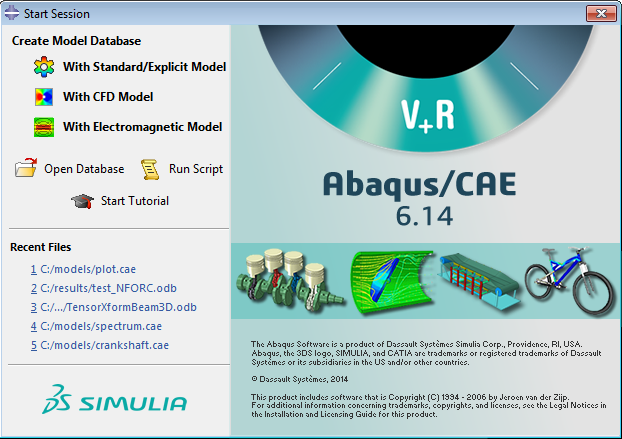
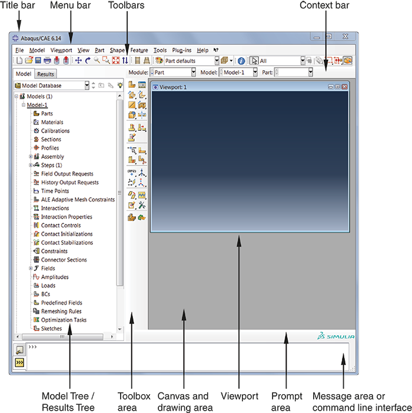
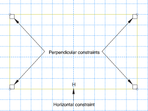
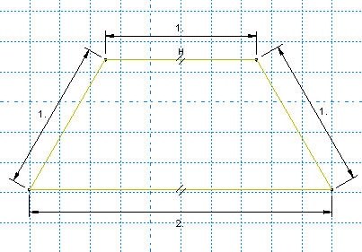
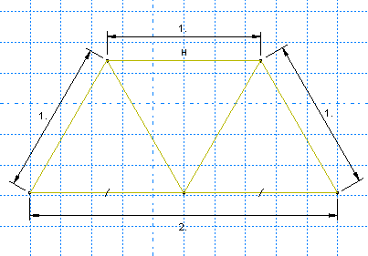
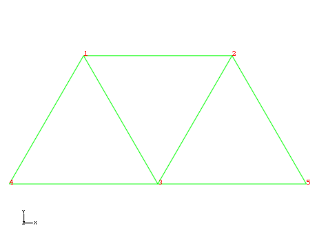
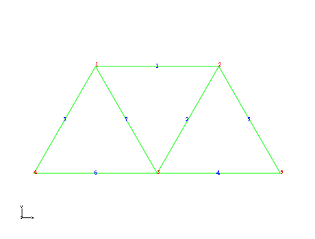
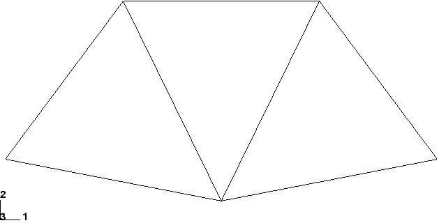
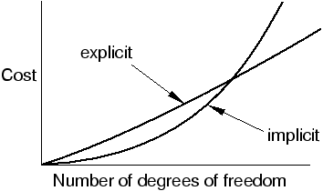

2 Abaqus Basics***## 2. Abaqus Basics

A complete Abaqus analysis usually consists of three distinct stages: preprocessing, simulation, and postprocessing. These three stages are linked together by files as shown below:

Preprocessing (Abaqus/CAE)**In this stage you must define the model of the physical problem and create an Abaqus input file. The model is usually created graphically using Abaqus/CAE or another preprocessor, although the Abaqus input file for a simple analysis can be created directly using a text editor.**Simulation (Abaqus/Standard or Abaqus/Explicit)**The simulation, which normally is run as a background process, is the stage in which Abaqus/Standard or Abaqus/Explicit solves the numerical problem defined in the model. Examples of output from a stress analysis include displacements and stresses that are stored in binary files ready for postprocessing. Depending on the complexity of the problem being analyzed and the power of the computer being used, it may take anywhere from seconds to days to complete an analysis run.

**Postprocessing (Abaqus/CAE)**You can evaluate the results once the simulation has been completed and the displacements, stresses, or other fundamental variables have been calculated. The evaluation is generally done interactively using the *Visualization module of Abaqus/CAE or another postprocessor. The Visualization module, which reads the neutral binary output database file, has a variety of options for displaying the results, including color contour plots, animations, deformed shape plots, and X-Y* plots.

*

### Components of an Abaqus analysis model

An Abaqus model is composed of several different components that together describe the physical problem to be analyzed and the results to be obtained. At a minimum the analysis model consists of the following information: discretized geometry, element section properties, material data, loads and boundary conditions, analysis type, and output requests. The discussion in this chapter focuses on structural applications. Similar concepts apply for fluid dynamics.

**Discretized geometry**Finite elements and nodes define the basic geometry of the physical structure being modeled in Abaqus. Each element in the model represents a discrete portion of the physical structure, which is, in turn, represented by many interconnected elements. Elements are connected to one another by shared nodes. The coordinates of the nodes and the connectivity of the elements--that is, which nodes belong to which elements--comprise the model geometry. The collection of all the elements and nodes in a model is called the *mesh*. Generally, the mesh will be only an approximation of the actual geometry of the structure.

The element type, shape, and location, as well as the overall number of elements used in the mesh, affect the results obtained from a simulation. The greater the mesh density (i.e., the greater the number of elements in the mesh), the more accurate the results. As the mesh density increases, the analysis results converge to a unique solution, and the computer time required for the analysis increases. The solution obtained from the numerical model is generally an approximation to the solution of the physical problem being simulated. The extent of the approximations made in the model's geometry, material behavior, boundary conditions, and loading determines how well the numerical simulation matches the physical problem.

**Element section properties**Abaqus has a wide range of elements, many of which have geometry not defined completely by the coordinates of their nodes. For example, the layers of a composite shell or the dimensions of an I-beam section are not defined by the nodes of the element. Such additional geometric data are defined as physical properties of the element and are necessary to define the model geometry completely (see [Chapter 3, "Finite Elements and Rigid Bodies](ch03.md)").

**Material data**Material properties for all elements must be specified. While high-quality material data are often difficult to obtain, particularly for the more complex material models, the validity of the Abaqus results is limited by the accuracy and extent of the material data.

**Loads and boundary conditions**Loads distort the physical structure and, thus, create stress in it. The most common forms of loading include:- point loads;
- pressure loads on surfaces;
- distributed tractions on surfaces;
- distributed edge loads and moments on shell edges;
- body forces, such as the force of gravity; and
- thermal loads.

Boundary conditions are used to constrain portions of the model to remain fixed (zero displacements) or to move by a prescribed amount (nonzero displacements).

In a static analysis enough boundary conditions must be used to prevent the model from moving as a rigid body in any direction; otherwise, unrestrained rigid body motion causes the stiffness matrix to be singular. A solver problem will occur during the solution stage and may cause the simulation to stop prematurely. Abaqus/Standard will issue a warning message if it detects a solver problem during a simulation. It is important that you learn to interpret such error messages. If you see a "numerical singularity" or "zero pivot" warning message during a static stress analysis, you should check whether all or part of your model lacks constraints against rigid body translations or rotations.  Rigid body motions can consist of both translations and rotations of the components. The potential rigid body motions depend on the dimensionality of the model.**DimensionalityPossible Rigid Body MotionThree-dimensionalTranslation in the 1-, 2-, and 3-directions. Rotation about the 1-, 2-, and 3-axes.AxisymmetricTranslation in the 2-direction. Rotation about the 3-axis (axisymmetric rigid bodies only).Plane stressTranslation in the 1- and 2-directions.Plane strainRotation about the 3-axis.By default, the 1-, 2-, and 3-directions are aligned with the axes of a global Cartesian coordinate system (discussed later).

In a dynamic analysis inertia forces prevent the model from undergoing infinite motion instantaneously as long as all separate parts in the model have some mass; therefore, solver problem warnings in a dynamic analysis usually indicate some other modeling problem, such as excessive plasticity.

Analysis type**Abaqus can carry out many different types of simulations, but this guide only covers the two most common: static and dynamic stress analyses.In a static analysis the long-term response of the structure to the applied loads is obtained. In other cases the dynamic response of a structure to the loads may be of interest: for example, the effect of a sudden load on a component, such as occurs during an impact, or the response of a building in an earthquake.

**Output requests**An Abaqus simulation can generate a large amount of output. To avoid using excessive disk space, you can limit the output to that required for interpreting the results.

Generally a preprocessor such as Abaqus/CAE is used to define the necessary components of the model.

### Introduction to Abaqus/CAE

Abaqus/CAE is the Complete Abaqus Environment that provides a simple, consistent interface for creating Abaqus models, interactively submitting and monitoring Abaqus jobs, and evaluating results from Abaqus simulations. Abaqus/CAE is divided into modules, where each module defines a logical aspect of the modeling process; for example, defining the geometry, defining material properties, and generating a mesh. As you move from module to module, you build up the model. When the model is complete, Abaqus/CAE generates an input file that you submit to the Abaqus analysis product. Abaqus/Standard or Abaqus/Explicit reads the input file generated by Abaqus/CAE, performs the analysis, sends information to Abaqus/CAE to allow you to monitor the progress of the job, and generates an output database. Finally, you use the *Visualization module to read the output database and view the results of your analysis.

*### 2.2.1 Starting Abaqus/CAE

To start Abaqus/CAE, you enter the command ```
*abaqus* cae
```  at your operating system prompt, where *abaqus* is the command used to run Abaqus. This command may be different on your system.

When Abaqus/CAE begins, the **Start Session** dialog box appears as shown in [Figure 2-1](ch02s02.html#gsa-start-cae). The following session startup options are available:- **Create Model Database: With Standard/Explicit Model** allows you to begin a new Abaqus/Standard or Abaqus/Explicit analysis.
- **Create Model Database: With CFD Model** allows you to begin a new Abaqus/CFD analysis.
- **Create Model Database: With Electromagnetic Model** allows you to begin a new electromagnetic analysis.
- **Open Database** allows you to open a previously saved model or output database file.
- **Run Script** allows you to run a file containing Abaqus/CAE commands.
- **Start Tutorial** allows you to begin an introductory tutorial from the online documentation.
- **Recent Files** allows you to open one of the five model database files or output database files that were most recently opened in Abaqus/CAE.



### 2.2.2 Components of the main window

You interact with Abaqus/CAE through the main window. [Figure 2-2](ch02s02.html#gst-main-window) shows the components that appear in the main window.


The components are: **Title bar**The title bar indicates the release of Abaqus/CAE you are running and the name of the current model database.

**Menu bar**The menu bar contains all the available menus; the menus give access to all the functionality in the product. Different menus appear in the menu bar depending on which module you selected from the context bar. For more information, see "Components of the main menu bar,"  Section 2.2.2 of the Abaqus/CAE User's Guide.

**Toolbars**The toolbars provide quick access to items that are also available in the menus. For more information, see "Components of the toolbars,"  Section 2.2.3 of the Abaqus/CAE User's Guide.

**Context bar**Abaqus/CAE is divided into a set of modules, where each module allows you to work on one aspect of your model; the **Module** list in the context bar allows you to move between these modules. Other items in the context bar are a function of the module in which you are working; for example, the context bar allows you to retrieve an existing part while creating the geometry of the model. For more information, see "The context bar,"  Section 2.2.4 of the Abaqus/CAE User's Guide.

**Model Tree**The Model Tree provides you with a graphical overview of your model and the objects that it contains, such as parts, materials, steps, loads, and output requests. In addition, the Model Tree provides a convenient, centralized tool for moving between modules and for managing objects. If your model database contains more than one model, you can use the Model Tree to move between models. When you become familiar with the Model Tree, you will find that you can quickly perform most of the actions that are found in the main menu bar, the module toolboxes, and the various managers. For more information, see "Working with the Model Tree and the Results Tree,"  Section 3.5 of the Abaqus/CAE User's Guide.

**Results Tree**The Results Tree provides you with a graphical overview of your output databases and other session-specific data such as *X-Y* plots. If you have more than one output database open in your session, you can use the Results Tree to move between output databases. When you become familiar with the Results Tree, you will find that you can quickly perform most of the actions in the *Visualization* module that are found in the main menu bar and the toolbox. For more information, see "An overview of the Results Tree,"  Section 3.5.2 of the Abaqus/CAE User's Guide.

**Toolbox area**When you enter a module, the toolbox area displays tools in the toolbox that are appropriate for that module. The toolbox allows quick access to many of the module functions that are also available from the menu bar. For more information, see "Understanding and using toolboxes and toolbars,"  Section 3.3 of the Abaqus/CAE User's Guide.

**Canvas and drawing area**The canvas can be thought of as an infinite screen or bulletin board on which you post viewports; for more information, see Chapter 4, "Managing viewports on the canvas," of the Abaqus/CAE User's Guide. The drawing area is the visible portion of the canvas.

**Viewport**Viewports are windows on the canvas in which Abaqus/CAE displays your model. For more information, see Chapter 4, "Managing viewports on the canvas," of the Abaqus/CAE User's Guide.

**Prompt area**The prompt area displays instructions for you to follow during a procedure; for example, it asks you to select the geometry as you create a set. For more information, see "Using the prompt area during procedures,"  Section 3.1 of the Abaqus/CAE User's Guide.

**Message area**Abaqus/CAE prints status information and warnings in the message area. To resize the message area, drag the top edge; to see information that has scrolled out of the message area, use the scroll bar on the right side. The message area is displayed by default, but it uses the same space occupied by the command line interface. If you have recently used the command line interface, you must click the  tab in the bottom left corner of the main window to activate the message area.**Note:
**If new messages are added while the command line interface is active, Abaqus/CAE changes the background color surrounding the message area icon to red. When you display the message area, the background reverts to its normal color.

**Command line interface**You can use the command line interface to type Python commands and evaluate mathematical expressions using the Python interpreter that is built into Abaqus/CAE. The interface includes primary (`>>>`) and secondary (`...`) prompts to indicate when you must indent commands to comply with Python syntax.

The command line interface is hidden by default, but it uses the same space occupied by the message area. Click the  tab in the bottom left corner of the main window to switch from the message area to the command line interface. Click the  tab to return to the message area.

### 2.2.3 What is a module?

As mentioned earlier, Abaqus/CAE is divided into functional units called modules. Each module contains only those tools that are relevant to a specific portion of the modeling task. For example, the *Mesh* module contains only the tools needed to create finite element meshes, while the *Job* module contains only the tools used to create, edit, submit, and monitor analysis jobs.

You select a module from the **Module** list in the context bar, as shown in [Figure 2-3](ch02s02.html#gst-module-list).


The order of the modules in the menu corresponds to a logical sequence you may follow to create a model. In many circumstances you must follow this natural progression to complete a modeling task; for example, you must create parts before you create an assembly. Although the order of the modules follows a logical sequence, Abaqus/CAE allows you to select any module at any time, regardless of the state of your model. However, certain obvious restrictions apply; for example, you cannot assign section properties, such as cross-sectional dimensions of an I-beam, to geometry that has not yet been created.

A completed model contains everything that Abaqus needs to start the analysis. Abaqus/CAE uses a model database to store your models. When you start Abaqus/CAE, the **Start Session** dialog box allows you to create a new, empty model database in memory. After you start Abaqus/CAE, you can save your model database to a disk by selecting **File****Save** from the main menu bar; to retrieve a model database from a disk, select **File****Open**.

The following list of the modules available within Abaqus/CAE briefly describes the modeling tasks you can perform in each module. The order of the modules in the list corresponds to the order of the modules in the context bar's **Module** list (see [Figure 2-3](ch02s02.html#gst-module-list)):**Part**The *Part* module allows you to create individual parts by sketching their geometry directly in Abaqus/CAE or by importing their geometry from other geometric modeling programs. For more information, see Chapter 11, "The *Part* module," of the Abaqus/CAE User's Guide.

**Property**A section definition contains information about the properties of a part or a region of a part, such as a region's associated material definition and cross-sectional geometry. In the Property module you create section and material definitions and assign them to regions of parts. For more information, see Chapter 12, "The *Property* module," of the Abaqus/CAE User's Guide.

**Assembly**When you create a part, it exists in its own coordinate system, independent of other parts in the model. You use the *Assembly* module to create instances of your parts as well as instances of other models and to position the instances relative to each other in a global coordinate system, thus creating an assembly. An Abaqus model contains only one assembly. For more information, see Chapter 13, "The *Assembly* module," of the Abaqus/CAE User's Guide.

**Step**You use the *Step* module to create and configure analysis steps and associated output requests. The step sequence provides a convenient way to capture changes in a model (such as loading and boundary condition changes); output requests can vary as necessary between steps. For more information, see Chapter 14, "The *Step* module," of the Abaqus/CAE User's Guide.

**Interaction**In the Interaction module you specify mechanical and thermal interactions between regions of a model or between a region of a model and its surroundings. An example of an interaction is contact between two surfaces. Other interactions that may be defined include constraints, such as tie, equation, and rigid body constraints. Abaqus/CAE does not recognize mechanical contact between part instances or regions of an assembly unless that contact is specified in the *Interaction* module; the mere physical proximity of two surfaces in an assembly is not sufficient to indicate any type of interaction between the surfaces. Interactions are step-dependent objects, which means that you must specify the analysis steps in which they are active. For more information, see Chapter 15, "The *Interaction* module," of the Abaqus/CAE User's Guide.

**Load**The Load module allows you to specify loads, boundary conditions, and predefined fields. Loads and boundary conditions are step-dependent objects, which means that you must specify the analysis steps in which they are active; some predefined fields are step-dependent, while others are applied only at the beginning of the analysis. For more information, see Chapter 16, "The *Load* module," of the Abaqus/CAE User's Guide.

**Mesh**The *Mesh* module contains tools that allow you to generate a finite element mesh on an assembly created within Abaqus/CAE. Various levels of automation and control are available so that you can create a mesh that meets the needs of your analysis. For more information, see Chapter 17, "The *Mesh* module," of the Abaqus/CAE User's Guide.

**Optimization**The *Optimization* module allows you to create an optimization task that can be used to optimize the topology of your model given a set of objectives and constraints. For more information, see Chapter 18, "The *Optimization* module," of the Abaqus/CAE User's Guide.

**Job**Once you have finished all of the tasks involved in defining a model, you use the *Job* module to analyze your model. The *Job* module allows you to interactively submit a job for analysis and monitor its progress. Multiple models and runs may be submitted and monitored simultaneously. For more information, see Chapter 19, "The *Job* module," of the Abaqus/CAE User's Guide.

**Visualization**The *Visualization* module provides graphical display of finite element models and results. It obtains model and result information from the output database; you can control what information is written to the output database by modifying output requests in the *Step* module. For more information, see Part V, "Viewing results," of the Abaqus/CAE User's Guide.

**Sketch**Sketches are two-dimensional profiles that are used to help form the geometry defining an Abaqus/CAE native part. You use the *Sketch* module to create a sketch that defines a planar part, a beam, or a partition or to create a sketch that might be extruded, swept, or revolved to form a three-dimensional part. For more information, see Chapter 20, "The *Sketch* module," of the Abaqus/CAE User's Guide.

The contents of the main window change as you move between modules. Selecting a module from the **Module** list on the context bar causes the context bar, module toolbox, and menu bar to change to reflect the functionality of the current module.

Each module is discussed in more detail in the tutorial examples presented in this guide.

### 2.2.4 What is the Model Tree?

The Model Tree provides a visual description of the hierarchy of items in a model. It is located in the left side of the main window underneath the **Model** tab. [Figure 2-4](ch02s02.html#gsa-modeltree) shows a typical Model Tree.


Items in the Model Tree are represented by small icons; for example, the **Steps** icon,. In addition, parentheses next to an item indicate that the item is a container, and the number in the parentheses indicates the number of items in the container. You can click on the  "" and "–" signs in the Model Tree to expand and collapse a container. The right and left arrow keys perform the same operation.

The arrangement of the containers and items in the Model Tree reflects the order in which you are expected to create your model. As noted earlier, a similar logic governs the order of modules in the module menu--you create parts before you create the assembly, and you create steps before you create loads. This arrangement is fixed--you cannot move items in the Model Tree.

The Model Tree provides most of the functionality of the main menu bar and the module managers. For example, if you double-click on the **Parts** container, you can create a new part (the equivalent of selecting **Part****Create** from the main menu bar).

The instructions for the examples discussed in this guide will focus on using the Model Tree to access the functionality of Abaqus/CAE. Menu bar actions will be considered only when necessary (e.g., when creating a finite element mesh or postprocessing results).

The Results Tree uses the same space occupied by the Model Tree. Click the **Results** tab in the left side of the main window to switch from the Model Tree to the Results Tree. The Results Tree provides access to session-specific features (i.e., functionality available in only the *Visualization* module). The Results Tree will be introduced during the course of the postprocessing exercises contained in this guide.

### Example: creating a model of an overhead hoist

This example of an overhead hoist, shown in [Figure 2-5](ch02s03.html#gsa-schematic-hoist), leads you through the Abaqus/CAE modeling process by using the Model Tree and showing you the basic steps used to create and analyze a simple model. The hoist is a simple, pin-jointed truss model that is constrained at the left end and mounted on rollers at the right end. The members can rotate freely at the joints. The frame is prevented from moving out of plane. A simulation is first performed in Abaqus/Standard to determine the structure's static deflection and the peak stress in its members when a 10 kN load is applied as shown in [Figure 2-5](ch02s03.html#gsa-schematic-hoist). The simulation is performed a second time in Abaqus/Explicit under the assumption that the load is applied suddenly to study the dynamic response of the frame.


For the overhead hoist example, you will perform the following tasks:- Sketch the two-dimensional geometry and create a part representing the frame.
- Define the material properties and section properties of the frame.
- Assemble the model.
- Configure the analysis procedure and output requests.
- Apply loads and boundary conditions to the frame.
- Mesh the frame.
- Create a job and submit it for analysis.
- View the results of the analysis.

Abaqus provides scripts that replicate the complete analysis model for this problem. Run one of these scripts if you encounter difficulties following the instructions given below or if you wish to check your work. Scripts are available in the following locations:- A Python script for this example is provided in "Overhead hoist frame,"  Section A.1. Instructions on how to fetch the script and run it within Abaqus/CAE are given in Appendix A, "Example Files."
- A plug-in script for this example is available in the Abaqus/CAE Plug-in toolset. To run the script from Abaqus/CAE, select **Plug-ins*****Abaqus****Getting Started**; highlight **Overhead hoist frame**; and click **Run**. For more information about the Getting Started plug-ins, see "Running the Getting Started with Abaqus examples,"  Section 82.1 of the Abaqus/CAE User's Guide.

As noted earlier, it is assumed that you will be using Abaqus/CAE to generate the model. However, if you do not have access to Abaqus/CAE or another preprocessor, the input file that defines this problem can be created manually, as discussed in "Example: creating a model of an overhead hoist,"  Section 2.3 of Getting Started with Abaqus: Keywords Edition.

### 2.3.1 Units

Before starting to define this or any model, you need to decide which system of units you will use. Abaqus has no built-in system of units. Do not include unit names or labels when entering data in Abaqus. All input data must be specified in consistent units. Some common systems of consistent units are shown in [Table 2-1](ch02s03.html#gsa-abasics-table-units). **Table 2-1** Consistent units.

QuantitySISI (mm)US Unit (ft)US Unit (inch)LengthmmmftinForceNNlbflbfMasskgtonne (103 kg)sluglbf s2/inTimessssStressPa (N/m2)MPa (N/mm2)lbf/ft2psi (lbf/in2)EnergyJmJ (10–3 J)ft lbfin lbfDensitykg/m3tonne/mm3slug/ft3lbf s2/in4The SI system of units is used throughout this guide. Users working in the systems labeled "US Unit" should be careful with the units of density; often the densities given in handbooks of material properties are multiplied by the acceleration due to gravity.

### 2.3.2 Creating a part

Parts define the geometry of the individual components of your model and, therefore, are the building blocks of an Abaqus/CAE model. You can create parts that are native to Abaqus/CAE, or you can import parts created by other applications either as a geometric representation or as a finite element mesh.

You will start the overhead hoist problem by creating a two-dimensional, deformable wire part. You do this by sketching the geometry of the frame. Abaqus/CAE automatically enters the Sketcher when you create a part.

Abaqus/CAE often displays a short message in the prompt area indicating what you should do next, as shown in [Figure 2-6](ch02s03.html#gsa-frame-prompt).


Click the **Cancel** button to cancel the current task. Click the **Previous** button to cancel the current step in the task and return to the previous step.

**To create the overhead hoist frame:**

If you did not already start Abaqus/CAE, type abaqus* cae, where *abaqus* is the command used to run Abaqus.From the **Create Model Database** options in the **Start Session** dialog box that appears, select **With Standard/Explicit Model**.

Abaqus/CAE enters the *Part* module. The Model Tree appears in the left side of the main window (underneath the **Model** tab). Between the Model Tree and the canvas is the *Part* module toolbox. A toolbox contains a set of icons that allow expert users to bypass the menus in the main menu bar. For many tools, as you select an item from the main menu bar or the Model Tree, the corresponding tool is highlighted in the module toolbox so you can learn its location.

In the Model Tree, double-click the **Parts** container to create a new part.

The **Create Part** dialog box appears. Abaqus/CAE also displays text in the prompt area near the bottom of the window to guide you through the procedure.

You use the **Create Part** dialog box to name the part; to choose its modeling space, type, and base feature; and to set the approximate size. You can edit and rename a part after you create it; you can also change its modeling space and type but not its base feature.

Name the part Frame. Choose a two-dimensional planar deformable body and a wire base feature.

In the **Approximate size** text field, type 4.0.

The value entered in the **Approximate size** text field at the bottom of the dialog box sets the approximate size of the new part. The size that you enter is used by Abaqus/CAE to calculate the size of the Sketcher sheet and the spacing of its grid. You should choose this value to be on the order of the largest dimension of your finished part. Recall that Abaqus/CAE does not use specific units, but the units must be consistent throughout the model. In this model SI units will be used.

Click **Continue** to exit the **Create Part** dialog box.

Abaqus/CAE automatically enters the Sketcher. The Sketcher toolbox appears in the left side of the main window, and the Sketcher grid appears in the viewport. The Sketcher contains a set of basic tools that allow you to sketch the two-dimensional profile of your part. Abaqus/CAE enters the Sketcher whenever you create or edit a part. To finish using any tool, click mouse button 2 in the viewport or select a new tool.**Tip:
**Like all tools in Abaqus/CAE, if you simply position the cursor over a tool in the Sketcher toolbox for a short time, a small window appears that gives a brief description of the tool. When you select a tool, a white background appears on it.

The following aspects of the Sketcher help you sketch the desired geometry:- The Sketcher grid helps you position the cursor and align objects in the viewport.
- Dashed lines indicate the *X*- and *Y*-axes of the sketch and intersect at the origin of the sketch.
- A triad in the lower-left corner of the viewport indicates the relationship between the sketch plane and the orientation of the part.
- When you select a sketching tool, Abaqus/CAE displays the *X*- and *Y*-coordinates of the cursor in the upper-left corner of the viewport.

You will first sketch a rough approximation of the frame and later use constraints and dimensions to refine the sketch. Begin by using the **Create Lines: Rectangle** tool * located in the upper-right region of the Sketcher toolbox to sketch an arbitrary rectangle. Select any two points as the opposite corners of the rectangle.

Click mouse button 2 anywhere in the viewport to exit the rectangle tool.

**Note:
**If you make a mistake while using the Sketcher, you can undo your last action using the **Undo** tool  or delete individual entities of your sketch using the **Delete** tool .

The Sketcher automatically adds constraints to the sketch as indicated in [Figure 2-7](ch02s03.html#gst-sketcher-constraints) (in this case, the four corners of the rectangle are assigned perpendicular constraints and one edge is designated as horizontal).


To proceed, the perpendicular constraints must be deleted. In the Sketcher toolbox, select the **Delete** tool  and then do the following:

In the prompt area, select **Constraints** as the scope of the operation.

Using **[Shift]****+Click**, select the four perpendicular constraints.

Click **Done** in the prompt area.

You will now add additional constraints and dimensions to refine the sketch. Constraints and dimensions allow you to control your sketch geometry and add precision. For more information on constraints and dimensions, see "Controlling sketch geometry,"  Section 20.7 of the Abaqus/CAE User's Guide.

Use the **Add Constraint** tool  to constrain the top and bottom edges so they remain parallel to each other:

**In the Add Constraint** dialog box, select **Parallel**.

In the viewport, select the top and bottom edges of the sketch (using **[Shift]****+Click**).

Click **Done** in the prompt area.

Use the **Add Dimension** tool  to dimension the top and bottom edges of the rectangle. The top edge should have a horizontal dimension of 1 m and the bottom edge a horizontal dimension of 2 m. When dimensioning each edge, simply select the line, click mouse button 1 to position the dimension text, and then enter the new dimension in the prompt area. Selecting the line rather than its endpoints constrains the length of the line regardless of its orientation in space (in effect, defining an oblique dimension).

Reset the view as needed using the **Auto-Fit View** tool  in the **View Manipulation** toolbar to see the updated sketch.

Dimension the left and right edges so they each have an oblique dimension of 1 m.

The sketch in its current state is shown in [Figure 2-8](ch02s03.html#gsa-frame-constlines). In this figure the default grid spacing has been doubled. For information on using the **Sketcher Options** tool  to modify the Sketcher display, see "Customizing the Sketcher,"  Section 20.9 of the Abaqus/CAE User's Guide.



Now sketch the interior edges of the frame.

Using the **Create Lines: Connected** tool  located in the upper-right corner of the Sketcher toolbox, create two lines as follows:

**Start the first line at the upper-left corner of the sketch and extend it to any point that snaps onto the bottom edge (its horizontal location is arbitrary).

Continue the second line to the upper-right corner of the sketch.

Click mouse button 2 anywhere in the viewport to exit the connected lines tool.

Using the Split** tool , split the bottom edge at the point where it intersects the two lines created above:

**Note the small black triangles at the base of some of the toolbox icons. These triangles indicate the presence of hidden icons that can be revealed. Click and hold the Auto-Trim** tool  located on the middle-right of the Sketcher toolbox until additional icons appear.

From the set of additional icons, click the **Split** tool .

The split tool appears in the Sketcher toolbox with a white background indicating that you selected it.

Select the bottom edge as the first entity to define the split point.

Select either of the two interior lines as the second entity (a red circle will appear around the split point).

Click mouse button 2 to indicate that you have finished using the split tool.

Use the **Add Constraint** tool  to constrain the two segments of the bottom edge so they are of equal length:

**In the Add Constraint** dialog box, select **Equal length**.

In the viewport, select the two segments of the bottom edge.

Click **Done** in the prompt area.

The final sketch is shown in [Figure 2-9](ch02s03.html#gsa-frame-part).



From the prompt area (near the bottom of the main window), click **Done** to exit the Sketcher.**Note:
**If you don't see the **Done** button in the prompt area, continue to click mouse button 2 in the viewport until it appears.

Before you continue, save your model in a model database file.

From the main menu bar, select **File****Save**. The **Save Model Database As** dialog box appears.

Type a name for the new model database in the **File Name** field, and click **OK**. You do not need to include the file extension; Abaqus/CAE automatically appends .cae to the file name.

Abaqus/CAE stores the model database in a new file and returns to the *Part* module. The path and name of your model database appear in the main window title bar.

You should always save your model database at regular intervals (for example, each time you switch modules); Abaqus/CAE does not save your model database automatically.

### 2.3.3 Creating a material

In this problem all the members of the frame are made of steel and assumed to be linear elastic with Young's modulus of 200 GPa and Poisson's ratio of 0.3. Thus, you will create a single linear elastic material with these properties.

**To define a material:**

In the Model Tree, double-click the **Materials** container to create a new material.Abaqus/CAE switches to the *Property* module, and the **Edit Material** dialog box appears.

Name the material Steel.

Use the menu bar under the browser area of the material editor to reveal menus containing all the available material options. Some of the menu items contain submenus; for example, [Figure 2-10](ch02s03.html#gst-prp-buttons) shows the options available under the **Mechanical****Elasticity** menu item. When you select a material option, the appropriate data entry form appears below the menu.


From the material editor's menu bar, select **Mechanical****Elasticity****Elastic**.

Abaqus/CAE displays the **Elastic** data form.

Type a value of 200.0E9 for Young's modulus and a value of 0.3 for Poisson's ratio in the respective fields. Use **[Tab]** or move the cursor to a new cell and click to move between cells.

Click **OK** to exit the material editor.

### 2.3.4 Defining and assigning section properties

You define the properties of a part through sections. After you create a section, you can use one of the following two methods to assign the section to the part in the current viewport:- You can simply select the region from the part and assign the section to the selected region.
- You can use the Set toolset to create a homogeneous set containing the region and assign the section to the set.
For the frame model you will create a single truss section that you will assign to the frame by selecting the frame from the viewport. The section will refer to the material `Steel` that you just created as well as define the cross-sectional area of the frame members.

**Defining a truss section**A truss section definition requires only a material reference and the cross-sectional area. Remember that the frame members are circular bars that are 0.005 m in diameter. Thus, their cross-sectional area is 1.963 × 10–5 m2.

**Tip:
**You can use the command line interface (CLI) in Abaqus/CAE as a simple calculator. For example, to compute the cross-sectional area of the frame members, click the  tab in the bottom left corner of the Abaqus/CAE window to activate the CLI, type pi*0.005**2/4.0 after the command prompt, and press **[Enter]**. The value of the cross-sectional area is printed in the CLI.

**To define a truss section:**

In the Model Tree, double-click the **Sections** container to create a section.The **Create Section** dialog box appears.

In the **Create Section** dialog box:

Name the section FrameSection.

In the **Category** list, select **Beam**.

In the **Type** list, select **Truss**.

Click **Continue**.

The **Edit Section** dialog box appears.

In the **Edit Section** dialog box:

Accept the default selection of `Steel` for the **Material** associated with the section. If you had defined other materials, you could click the arrow next to the **Material** text box to see a list of available materials and to select the material of your choice.

In the **Cross-sectional area** field, enter `pi*0.005**2/4.0`.

**Tip:
**If a field in a dialog box is expecting a floating point number, you can enter an arithmetic expression instead. The expression is evaluated by the Python interpreter that is built into Abaqus/CAE. The arithmetic expression will be replaced by its value.

Click **OK**.

**Assigning the section to the frame**The section FrameSection must be assigned to the frame.

**To assign the section to the frame:**

In the Model Tree, expand the branch for the part named **Frame** by clicking the "" symbol to expand the **Parts** container and then clicking the "" symbol to expand the **Frame** item.Double-click **Section Assignments** in the list of part attributes that appears.

Abaqus/CAE displays prompts in the prompt area to guide you through the procedure.

Select the entire part as the region to which the section will be applied.

Click and hold mouse button 1 at the upper left-hand corner of the viewport.

Drag the mouse to create a box around the truss.

Release mouse button 1.

Abaqus/CAE highlights the entire frame.

In the prompt area, enter `all` as the name of the set that will be created.

This set will contain the selected regions. The advantage of creating a set is that it can be used for other purposes. If you prefer to not create a set, toggle off **Create set** in the prompt area.

Click mouse button 2 in the viewport or click **Done** in the prompt area to accept the selected geometry.

The **Edit Section Assignment** dialog box appears containing a list of existing sections.

Accept the default selection of `FrameSection`, and click **OK**.

Abaqus/CAE assigns the truss section to the frame, colors the entire frame aqua to indicate that the region has a section assignment, and closes the **Edit Section Assignment** dialog box.

### 2.3.5 Defining the assembly

Each part that you create is oriented in its own coordinate system and is independent of the other parts in the model. Although a model may contain many parts, it contains only one assembly. You define the geometry of the assembly by creating instances of a part and then positioning the instances relative to each other in a global coordinate system. An instance can be classified as either independent or dependent. Independent part instances are meshed individually, while the mesh of a dependent part instance is associated with the mesh of the original part. For further details, see "Working with part instances,"  Section 13.3 of the Abaqus/CAE User's Guide. By default, part instances are dependent.

For this problem you will create a single instance of your overhead hoist. Abaqus/CAE positions the instance so that the origin of the sketch that defined the frame overlays the origin of the assembly's default coordinate system.

**To define the assembly:**

In the Model Tree, expand the **Assembly** container and double-click **Instances** in the list that appears.Abaqus/CAE switches to the *Assembly* module, and the **Create Instance** dialog box appears.

In the dialog box, select **Parts** to choose parts from the current model.

Select **Frame** and click **OK**.

Abaqus/CAE creates an instance of the overhead hoist. In this example the single instance of the frame defines the assembly. The frame is displayed in the 1-2 plane of the global coordinate system (a right-handed, rectangular Cartesian system). A triad in the lower-left corner of the viewport indicates the orientation of the model with respect to the view. A second triad in the viewport indicates the origin and orientation of the global coordinate system (X*-, *Y*-, and *Z*-axes). The global 1-axis is the horizontal axis of the hoist, the global 2-axis is the vertical axis, and the global 3-axis is normal to the plane of the framework. For two-dimensional problems such as this one Abaqus requires that the model lie in a plane parallel to the global 1-2 plane.

### 2.3.6 Configuring your analysis

Now that you have created your assembly, you can configure your analysis. In this simulation we are interested in the static response of the overhead hoist to a 10 kN load applied at the midspan, with the left-hand end fully constrained and a roller constraint on the right-hand end (see [Figure 2-5](ch02s03.html#gsa-schematic-hoist)). This is a single event, so only a single analysis step is needed for the simulation. Thus, the model will consist of two steps overall:- An initial step, in which you will apply boundary conditions that constrain the ends of the frame.
- An analysis step, in which you will apply a concentrated load at the midspan of the frame.
Abaqus/CAE generates the initial step automatically, but you must create the analysis step yourself. You may also request output for any steps in the analysis.

There are two kinds of analysis steps in Abaqus: general analysis steps, which can be used to analyze linear or nonlinear response, and linear perturbation steps, which can be used only to analyze linear problems. Only general analysis steps are available in Abaqus/Explicit. For this simulation you will define a static linear perturbation step. Perturbation procedures are discussed further in [Chapter 11, "Multiple Step Analysis](ch11.md)."

**Creating an analysis step**Create a static, linear perturbation step that follows the initial step of the analysis.

**To create a static linear perturbation analysis step:**

In the Model Tree, double-click the **Steps** container to create a step.Abaqus/CAE switches to the *Step* module, and the  **Create Step** dialog box appears. A list of all the general procedures and a default step name of Step-1 is provided.

Change the step name to Apply load.

Select **Linear perturbation** as the **Procedure type**.

From the list of available linear perturbation procedures in the **Create Step** dialog box, select **Static, Linear perturbation** and click **Continue**.

The **Edit Step** dialog box appears with the default settings for a static linear perturbation step.

The **Basic** tab is selected by default. In the **Description** field, type 10 kN central load.

Click the **Other** tab to see its contents; you can accept the default values provided for the step.

Click **OK** to create the step and to exit the **Edit Step** dialog box.

**Requesting data output**Finite element analyses can create very large amounts of output. Abaqus allows you to control and manage this output so that only data required to interpret the results of your simulation are produced. Four types of output are available from an Abaqus analysis:- Results stored in a neutral binary file used by Abaqus/CAE for postprocessing. This file is called the Abaqus output database file and has the extension .odb.
- Printed tables of results, written to the Abaqus data (.dat) file. Output to the data file is available only in Abaqus/Standard.
- Restart data used to continue the analysis, written to the Abaqus restart (.res) file.
- Results stored in binary files for subsequent postprocessing with third-party software, written to the Abaqus results (.fil) file.
You will use only the first of these in the overhead hoist simulation.

By default, Abaqus/CAE writes the results of the analysis to the output database (.odb) file. When you create a step, Abaqus/CAE generates a default output request for the step. A list of the preselected variables written by default to the output database is given in the Abaqus Analysis User's Guide. You do not need to do anything to accept these defaults. You use the **Field Output Requests Manager** to request output of variables that should be written at relatively low frequencies to the output database from the entire model or from a large portion of the model. You use the **History Output Requests Manager** to request output of variables that should be written to the output database at a high frequency from a small portion of the model; for example, the displacement of a single node.

For this example you will examine the output requests to the .odb file and accept the default configuration.

**To examine your output requests to the .odb file:**

In the Model Tree, click mouse button 3 on the **Field Output Requests** container and select **Manager** from the menu that appears.Abaqus/CAE displays the **Field Output Requests Manager**. This manager displays the status of field output requests in a table format. The left side of the table has an alphabetical list of existing output requests. The top of the table lists the names of all the steps in the analysis in the order of execution. Each cell of the table displays the status of each output request in each step.

You can use the **Field Output Requests Manager** to do the following:- Select the variables that Abaqus will write to the output database.
- Select the section points for which Abaqus will generate output data.
- Select the region of the model for which Abaqus will generate output data.
- Change the frequency at which Abaqus will write data to the output database.

Review the default output request that Abaqus/CAE generates for the **Static, Linear perturbation** step you created and named Apply load.

Select the cell in the table labeled `Created` if it is not already selected. The following information related to the cell is shown in the legend at the bottom of the manager: - The type of analysis procedure carried out in the step in that column.
- The list of output request variables.
- The output request status.

On the right side of the **Field Output Requests Manager**, click **Edit** to view more detailed information about the output request.

The field output editor appears. In the **Output Variables** region of this dialog box, there is a text box that lists all variables that will be output. If you change an output request, you can always return to the default settings by choosing **Preselected defaults** above the text box.

Click the arrows next to each output variable category to see exactly which variables will be output. The boxes next to each category title allow you to see at a glance whether all variables in that category will be output. A black check mark indicates that all variables are output, while a gray check mark indicates that only some variables will be output.

Based on the selections shown at the bottom of the dialog box, data will be generated at every default section point in the model and will be written to the output database after every increment during the analysis.

Click **Cancel** to close the field output editor, since you do not wish to make any changes to the default output requests.

Click **Dismiss** to close the **Field Output Requests Manager**.

**Note:
**What is the difference between the **Dismiss** and **Cancel** buttons? Dismiss buttons appear in dialog boxes that contain data that you cannot modify. For example, the **Field Output Requests Manager** allows you to view output requests, but you must use the field output editor to modify those requests. Clicking the **Dismiss** button simply closes the **Field Output Requests Manager**. Conversely, **Cancel** buttons appear in dialog boxes that allow you to make changes. Clicking **Cancel** closes the dialog box without saving your changes.Review the history output requests in a similar manner by right-clicking the **History Output Requests** container in the Model Tree and opening the history output editor.

### 2.3.7 Applying boundary conditions and loads to the model

Prescribed conditions, such as loads and boundary conditions, are step dependent, which means that you must specify the step or steps in which they become active. Now that you have defined the steps in the analysis, you can define prescribed conditions.

**Applying boundary conditions to the frame**In structural analyses, boundary conditions are applied to those regions of the model where the displacements and/or rotations are known. Such regions may be constrained to remain fixed (have zero displacement and/or rotation) during the simulation or may have specified, nonzero displacements and/or rotations.

In this model the bottom-left portion of the frame is constrained completely and, thus, cannot move in any direction. The bottom-right portion of the frame, however, is fixed in the vertical direction but is free to move in the horizontal direction. The directions in which motion is possible are called *degrees of freedom (dof)*.

The labeling convention used for the displacement and rotational degrees of freedom in Abaqus is shown in [Figure 2-11](ch02s03.html#gsa-dof).


**To apply boundary conditions to the frame:**

In the Model Tree, double-click the **BCs** container.Abaqus/CAE switches to the *Load* module, and the  **Create Boundary Condition** dialog box appears.

In the **Create Boundary Condition** dialog box:

Name the boundary condition Fixed.

From the list of steps, select `Initial` as the step in which the boundary condition will be activated. All the mechanical boundary conditions specified in the `Initial` step must have zero magnitudes. This condition is enforced automatically by Abaqus/CAE.

In the **Category** list, accept **Mechanical** as the default category selection.

In the **Types for Selected Step** list, select **Displacement/Rotation**, and click **Continue**.

Abaqus/CAE displays prompts in the prompt area to guide you through the procedure. For example, you are asked to select the region to which the boundary condition will be applied.

To apply a prescribed condition to a region, you can either select the region directly in the viewport or apply the condition to an existing set (a set is a named region of a model). Sets are a convenient tool that can be used to manage large complicated models. In this simple model you will not make use of sets.

In the viewport, select the vertex at the bottom-left corner of the frame as the region to which the boundary condition will be applied. Name the associated set `left`.

Click mouse button 2 in the viewport or click **Done** in the prompt area to indicate that you have finished selecting regions.

The **Edit Boundary Condition** dialog box appears. When you are defining a boundary condition in the initial step, all available degrees of freedom are unconstrained by default.

In the dialog box:

Toggle on **U1** and **U2** since all translational degrees of freedom need to be constrained.

Click **OK** to create the boundary condition and to close the dialog box.

Abaqus/CAE displays two arrowheads at the vertex to indicate the constrained degrees of freedom.

Repeat the above procedure to constrain degree of freedom **U2** at the vertex at the bottom-right corner of the frame. Name this boundary condition `Roller` and the associated set `right`.

In the Model Tree, click mouse button 3 on the **BCs** container and select **Manager** from the menu that appears.

Abaqus/CAE displays the **Boundary Condition Manager**. The manager indicates that the boundary conditions are `Created` (activated) in the initial step and are `Propagated from base state` (continue to be active) in the analysis step `Apply load`.**Tip:
** To view the title of a column in its entirety, expand its width by dragging the dividing line between the column headings.

Click **Dismiss** to close the **Boundary Condition Manager**.

In this example all the constraints are in the global 1- or 2-directions. In many cases constraints are required in directions that are not aligned with the global directions. In such cases you can define a local coordinate system for boundary condition application. The skew plate example in [Chapter 5, "Using Shell Elements](ch05.md)," demonstrates how to do this.

**Applying a load to the frame**Now that you have constrained the frame, you can apply a load to the bottom of the frame. In Abaqus the term *load* (as in the *Load* module in Abaqus/CAE) generally refers to anything that induces a change in the response of a structure from its initial state, including:- concentrated forces,
- pressures,
- nonzero boundary conditions,
- body loads, and
- temperature (with thermal expansion of the material defined).
Sometimes the term load is used to refer specifically to force-type quantities (as in the **Load Manager** of the *Load* module); for example, concentrated forces, pressures, and body loads but not boundary conditions or temperature. The intended meaning of the term should be clear from the context of the discussion.

In this simulation a concentrated force of 10 kN is applied in the negative 2-direction to the midspan of the frame; the load is applied during the linear perturbation step you created earlier. In reality there is no such thing as a concentrated, or point, load; the load will always be applied over some finite area. However, if the area being loaded is small, it is an appropriate idealization to treat the load as a concentrated load.

**To apply a concentrated force to the frame:**

In the Model Tree, click mouse button 3 on the **Loads** container and select **Manager** from the menu that appears.The **Load** **Manager ** appears.

At the bottom of the **Load** **Manager**, click **Create**.

The **Create Load** dialog box appears.

In the **Create Load** dialog box:

Name the load Force.

From the list of steps, select `Apply load` as the step in which the load will be applied.

In the **Category** list, accept **Mechanical** as the default category selection.

In the **Types for Selected Step** list, accept the default selection of **Concentrated force**.

Click **Continue**.

Abaqus/CAE displays prompts in the prompt area to guide you through the procedure. You are asked to select a region to which the load will be applied.

As with boundary conditions, the region to which the load will be applied can be selected either directly in the viewport or from a list of existing sets. As before, you will select the region directly in the viewport.

In the viewport, select the vertex at the bottom center of the frame as the region where the load will be applied. Name the associated set `center`.

Click mouse button 2 in the viewport or click **Done** in the prompt area to indicate that you have finished selecting regions.

The **Edit Load** dialog box appears.

In the dialog box:

Enter a magnitude of -10000.0 for **CF2**.

Click **OK** to create the load and to close the dialog box.

Abaqus/CAE displays a downward-pointing arrow at the vertex to indicate that the load is applied in the negative 2-direction.

Examine the **Load Manager** and note that the new load is `Created` (activated) in the analysis step `Apply load`.

Click **Dismiss** to close the **Load Manager**.

### 2.3.8 Meshing the model

You will now generate the finite element mesh. You can choose the meshing technique that Abaqus/CAE will use to create the mesh, the element shape, and the element type. The meshing technique for one-dimensional regions (such as the ones in this example) cannot be changed, however. Abaqus/CAE uses a number of different meshing techniques. The default meshing technique assigned to the model is indicated by the color of the model that is displayed when you enter the *Mesh module; if Abaqus/CAE displays the model in orange, it cannot be meshed without assistance from you.

**Assigning an Abaqus element type**In this section you will assign a particular Abaqus element type to the model. Although you will assign the element type now, you could also wait until after the mesh has been created.

Two-dimensional truss elements will be used to model the frame. These elements are chosen because truss elements, which carry only tensile and compressive axial loads, are ideal for modeling pin-jointed frameworks such as this overhead hoist.

**To assign an Abaqus element type:**

In the Model Tree,  expand the **Frame*** item underneath the **Parts** container if it is not already expanded. Then double-click **Mesh** in the list that appears.Abaqus/CAE switches to the *Mesh* module. The *Mesh* module functionality is available only through menu bar items or toolbox icons.

From the main menu bar, select **Mesh*****Element Type**.

If you created the set named **all** while assigning section properties, click **Sets** in the right side of the prompt area and select **all** from the **Region Selection** dialog box. Otherwise, drag the mouse to create a box that selects the entire frame as the region to be assigned an element type and click **Done** in the prompt area when you are finished.

The **Element Type** dialog box appears.

In the dialog box, select the following:- **Standard** as the **Element Library** selection (the default).
- **Linear** as the **Geometric Order** (the default).
- **Truss** as the **Family** of elements.

In the lower portion of the dialog box, examine the element shape options. A brief description of the default element selection is available at the bottom of each tabbed page.

Since the model is a two-dimensional truss, only two-dimensional truss element types are shown on the **Line** tabbed page. A description of the element type T2D2 appears at the bottom of the dialog box. Abaqus/CAE will now associate T2D2 elements with the elements in the mesh.

Click **OK** to assign the element type and to close the dialog box.

In the prompt area, click **Done** to end the procedure.

**Creating the mesh**Basic meshing is a two-stage operation: first you seed the edges of the part instance, and then you mesh the part instance. You select the number of seeds based on the desired element size or on the number of elements that you want along an edge, and Abaqus/CAE places the nodes of the mesh at the seeds whenever possible. For this problem you will create one element on each bar of the hoist.

**To seed and mesh the model:**

From the main menu bar, select **Seed****Part** to seed the part instance.**Note:
**You can gain more control of the resulting mesh by seeding each edge of the part instance individually, but it is not necessary for this example.

The **Global Seeds** dialog box appears. The dialog box displays the default element size that Abaqus/CAE will use to seed the part instance. This default element size is based on the size of the part instance. A relatively large seed value will be used so that only one element will be created per region.

In the **Global Seeds** dialog box, specify an approximate global element size of 1.0, and click **OK** to create the seeds and to close the dialog box.

From the main menu bar, select **Mesh****Part** to mesh the part instance.

From the buttons in the prompt area, click **Yes** to confirm that you want to mesh the part instance.

**Tip:
**You can display the node and element numbers within the *Mesh* module by selecting **View****Part Display Options** from the main menu bar. Toggle on **Show node labels** and **Show element labels** in the **Mesh** tabbed page of the **Part Display Options** dialog box that appears.

### 2.3.9 Creating an analysis job

Now that you have configured your analysis, you will create a job that is associated with your model.

**To create an analysis job:**

In the Model Tree, double-click the **Jobs** container to create a job.Abaqus/CAE switches to the *Job* module, and the **Create Job** dialog box appears with a list of the models in the model database. When you are finished defining your job, the **Jobs** container will display a list of your jobs.

Name the job Frame, and click **Continue**.

The **Edit Job** dialog box appears.

In the **Description** field, type Two-dimensional overhead hoist frame.

Click **OK** to accept all other default job settings in the job editor and to close the dialog box.

### 2.3.10 Checking the model

Having generated the model for this simulation, you are ready to run the analysis. Unfortunately, it is possible to have errors in the model because of incorrect or missing data. You should perform a data check analysis first before running the simulation.

**To run a data check analysis:**

In the Model Tree, expand the **Jobs** container. Click mouse button 3 on the job named **Frame**, and select **Data Check** from the menu that appears to submit your job for a data check analysis.After you submit your job, information appears next to the job name indicating the job's status. The status of the overhead hoist problem indicates one of the following conditions:- **Check Submitted** while the model is being submitted for a data check.
- **Check Running** while Abaqus performs a data check on the model.
- **Check Completed** when the data check has completed successfully.
- **Submitted** while the job is being submitted for a full analysis.
- **Running** while Abaqus analyzes the model.
- **Completed** when the full analysis is complete, and the output has been written to the output database.
- **Aborted** if Abaqus/CAE finds a problem with the input file or the analysis and aborts the analysis. In addition, Abaqus/CAE reports the problem in the message area (see Figure 2-2).

During the analysis, Abaqus/Standard sends information to Abaqus/CAE to allow you to monitor the progress of the job. Information from the status, data, log, and message files appears in the **Job Monitor** dialog box. You can browse these files in the tabbed windows in the bottom half of the **Job Monitor** dialog box, and you can search their contents. Select the desired file tab, enter a search string in the **Text to find** field, and click **Next** or **Previous** to step through the file from one hit to the next. Toggle on **Match case** to perform a case-sensitive search.

**To monitor the status of a job:**

In the Model Tree, click mouse button 3 on the job named **Frame** and select **Monitor** from the menu that appears to open the **Job Monitor** dialog box.The **Job Monitor** dialog box appears.

The top half of the dialog box displays the information available in the status (.sta) file that Abaqus creates for the analysis. This file contains a brief summary of the progress of an analysis and is described in "Output,"  Section 4.1.1 of the Abaqus Analysis User's Guide. The bottom half of the dialog box allows you to view information about the analysis.- Click the **Log** tab to display the start and end times for the analysis that appear in the log (.log) file.
- Click the **Errors** and **Warnings** tabs to display the errors or the warnings that appear in the data (.dat) and message (.msg) files. If a particular region of the model is causing the error or warning, a node or element set will be created automatically that contains that region. The name of the node or element set appears with the error or warning message, and you can view the set using display groups in the *Visualization* module.It will not be possible to perform the analysis until the causes of any error messages are corrected. In addition, you should always investigate the reason for any warning messages to determine whether corrective action is needed or whether such messages can be ignored safely.Abaqus limits the number of error and warning messages that appear in the job monitor (by default these limits are 10 error messages and 50 warning messages). If the message limits are exceeded, information regarding the additional errors and warnings can be obtained from the printed output files themselves. See "Job customization parameters,"  Section 4.1.3 of the Abaqus Installation and Licensing Guide, for details on changing the default message limits.
- Click the **Output** tab to display a record of each output data entry as it is written to the output database.
- As the analysis proceeds and Abaqus creates the data, message, and status files, Abaqus/CAE activates the **Data File**, **Message File**, and **Status File** tabs and displays the contents of each file in the corresponding tabbed page. You can click any of these tabs to browse or search the file for additional error and warning messages. **Note:
**Although Abaqus/CAE updates the contents of the **Data File**, **Message File**, and **Status File** tabbed pages periodically as the analysis runs, the data might not always be synchronized with the latest data in the files.

Click **Dismiss** to close the **Job Monitor** dialog box.

### 2.3.11 Running the analysis

Make any necessary corrections to your model. When the data check analysis completes with no error messages, run the analysis itself. To do this, click mouse button 3 on the job named **Frame** and select **Continue** from the menu that appears.**Note:
**Performing a data check analysis results in the creation of job files. When you submit a job for analysis and files of the same name already exist, Abaqus/CAE displays a dialog box asking if it is OK to overwrite the job files. Click **OK** to continue.

You should always perform a data check analysis before running a simulation to ensure that the model has been defined correctly and to check that there is enough disk space and memory available to complete the analysis. However, it is possible to combine the data check and analysis phases of the simulation by clicking mouse button 3 on the job name in the **Jobs** container and selecting **Submit** from the menu that appears.

If a simulation is expected to take a substantial amount of time, it may be convenient to run it in a batch queue by selecting **Queue** as the **Run Mode** in the **Edit Job** dialog box. (The availability of such a queue depends on the queue definition settings in your Abaqus environment file. If you have any questions, refer to "Defining analysis batch queues,"  Section 4.2 of the Abaqus Installation and Licensing Guide, or ask your system administrator about defining analysis batch queues on your system.)

### 2.3.12 Postprocessing

Graphical postprocessing is important because of the great volume of data created during a simulation. The Visualization module of Abaqus/CAE (also licensed separately as Abaqus/Viewer) allows you to view the results graphically using a variety of methods, including deformed shape plots, contour plots, vector plots, animations, and X-Y* plots. In addition, it allows you to create tabular reports of the output data. All of these methods are discussed in this guide. For more information on any of the postprocessing features discussed in this guide, consult Part V, "Viewing results," of the Abaqus/CAE User's Guide. For this example you will use the *Visualization* module to do some basic model checks and to display the deformed shape of the frame.

When the job completes successfully, you are ready to view the results of the analysis with the *Visualization* module. In the Model Tree, click mouse button 3 on the job named **Frame** and select **Results** from the menu that appears to enter the *Visualization* module. Abaqus/CAE opens the output database created by the job and displays the undeformed model shape, as shown in [Figure 2-12](ch02s03.html#gsa-undeformed).


You can also enter the *Visualization* module by selecting **Visualization** from the **Module** list located in the context bar. Select **File*****Open**, select Frame.odb from the list of available output database files, and click **OK**.

You can choose to display the title block and state block at the bottom of the viewport; these blocks are not shown in [Figure 2-12](ch02s03.html#gsa-undeformed). The title block at the bottom of the viewport indicates the following:- The description of the model (from the job description).
- The name of the output database (from the name of the analysis job).
- The product name (Abaqus/Standard or Abaqus/Explicit) and release used to generate the output database.
- The date the output database was last modified.
The state block at the bottom of the viewport indicates the following:- Which step is being displayed.
- The increment within the step.
- The step time.
The view orientation triad indicates the orientation of the model in the global coordinate system. The 3D compass located in the upper-right corner of the viewport allows you to manipulate the view directly.

You can suppress the display of and customize the title block, state block, view orientation triad, and 3D compass by selecting **Viewport****Viewport Annotation Options** from the main menu bar (for example, many of the figures in this guide do not include the title block or the compass).

**The Results Tree**You will use the Results Tree to query the components of the model. The Results Tree allows easy access to the history output contained in an output database file for the purpose of creating X-Y* plots and also to groups of elements, nodes, and surfaces based on set names, material and section assignment, etc. for the purposes of verifying the model and also controlling the viewport display.

**To query the model:**

In the left side of the main window, click the **Results** tab to switch to the Results Tree if it is not already visible.All output database files that are open in a given postprocessing session are listed underneath the **Output Databases** container. Expand this container and then expand the container for the output database named `Frame.odb`.

Expand the **Materials** container, and click the material named **STEEL**.

All elements are highlighted in the viewport because only one material assignment was used in this analysis.

The Results Tree will be used more extensively in later examples to illustrate the *X-Y* plotting capability and manipulating the display using display groups.

**Customizing an undeformed shape plot**You will now use the plot options to enable the display of node and element numbering. Plot options that are common to all plot types (undeformed, deformed, contour, symbol, and material orientation) are set in a single dialog box. The contour, symbol, and material orientation plot types have additional options, each specific to the given plot type.

**To display node numbers:**From the main menu bar, select **Options*****Common**; or use the  tool in the toolbox.The **Common Plot Options** dialog box appears.

Click the **Labels** tab.

Toggle on **Show node labels**.

Click **Apply**.

Abaqus/CAE applies the change and keeps the dialog box open.

The customized undeformed plot is shown in [Figure 2-13](ch02s03.html#gsa-node-plot) (your node numbers may be different).



**To display element numbers:**

In the **Labels** tabbed page of the **Common Plot Options** dialog box, toggle on **Show element labels**.Click **OK**.

Abaqus/CAE applies the change and closes the dialog box.

The resulting plot is shown in [Figure 2-14](ch02s03.html#gsa-node-elem) (your element numbers may be different).



Remove the node and element labels before proceeding. To disable the display of node and element numbers, repeat the above procedure and, under **Labels**, toggle off **Show node labels** and **Show element labels**.

**Displaying and customizing a deformed shape plot**You will now display the deformed model shape and use the plot options to change the deformation scale factor. You will also superimpose the undeformed model shape on the deformed model shape.

From the main menu bar, select **Plot****Deformed Shape**; or use the  tool in the toolbox. Abaqus/CAE displays the deformed model shape, as shown in [Figure 2-15](ch02s03.html#gsa-geometry).



For small-displacement analyses (the default formulation in Abaqus/Standard) the displacements are scaled automatically to ensure that they are clearly visible. The scale factor is displayed in the state block. In this case the displacements have been scaled by a factor of 42.83.**To change the deformation scale factor:**

From the main menu bar, select **Options****Common**; or use the  tool in the toolbox.From the **Common Plot Options** dialog box, click the **Basic** tab if it is not already selected.

From the **Deformation Scale Factor** area, toggle on **Uniform** and enter `10.0` in the **Value** field.

Click **Apply** to redisplay the deformed shape.

The state block displays the new scale factor.

To return to automatic scaling of the displacements, repeat the above procedure and, in the **Deformation Scale Factor** field, toggle on **Auto-compute**.

Click **OK** to close the **Common Plot Options** dialog box.

**To superimpose the undeformed model shape on the deformed model shape:**

Click the **Allow Multiple Plot States**  tool in the toolbox to allow multiple plot states in the viewport; then click the  tool or select **Plot****Undeformed Shape** to add the undeformed shape plot to the existing deformed plot in the viewport.By default, Abaqus/CAE plots the deformed model shape in green and the (superimposed) undeformed model shape in a translucent white.

The plot options for the superimposed image are controlled separately from those of the primary image. From the main menu bar, select **Options****Superimpose**; or use the  tool in the toolbox to change the edge style of the superimposed (i.e., undeformed) image.

From the **Superimpose Plot Options** dialog box, click the **Color & Style** tab.

In the **Color & Style** tabbed page, select the dashed edge style.

Click **OK** to close the **Superimpose Plot Options** dialog box and to apply the change.

The plot is shown in [Figure 2-16](ch02s03.html#gss-shapes). The undeformed model shape appears with a dashed edge style.


**Checking the model with Abaqus/CAE**You can use Abaqus/CAE to check that the model is correct before running the simulation. You have already learned how to draw plots of the model and to display the node and element numbers. These are useful tools for checking that Abaqus is using the correct mesh.

The boundary conditions applied to the overhead hoist model can also be displayed and checked in the *Visualization* module.

**To display boundary conditions on the undeformed model:**

Click the  tool in the toolbox to disable multiple plot states in the viewport.Display the undeformed model shape, if it is not displayed already.

From the main menu bar, select **View****ODB Display Options**.

In the **ODB Display Options** dialog box, click the **Entity Display** tab.

Toggle on **Show boundary conditions**.

Click **OK**.

Abaqus/CAE displays symbols to indicate the applied boundary conditions, as shown in [Figure 2-17](ch02s03.html#gsa-overhead-hoist).


**Tabular data reports**In addition to the graphical capabilities described above, Abaqus/CAE allows you to write data to a text file in a tabular format. This feature is a convenient alternative to writing tabular output to the data (.dat) file. Output generated this way has many uses; for example, it can be used in written reports. In this problem you will generate a report containing the element stresses, nodal displacements, and reaction forces.

**To generate field data reports:**

From the main menu bar, select **Report****Field Output**.In the **Variable** tabbed page of the **Report Field Output** dialog box, accept the default position labeled **Integration Point**. Click the triangle next to **S: Stress components** to expand the list of available variables. From this list, toggle on **S11**.

In the **Setup** tabbed page, name the report `Frame.rpt`. In the **Data** region at the bottom of the page, toggle off **Column totals**.

Click **Apply**.

The element stresses are written to the report file.

In the **Variable** tabbed page of the **Report Field Output** dialog box, change the position to **Unique Nodal**. Toggle off **S: Stress components**, and select **U1** and **U2** from the list of available **U: Spatial displacement** variables.

Click **Apply**.

The nodal displacements are appended to the report file.

In the **Variable** tabbed page of the **Report Field Output** dialog box, toggle off **U: Spatial displacement**, and select **RF1** and **RF2** from the list of available **RF: Reaction force** variables.

In the **Data** region at the bottom of the **Setup** tabbed page, toggle on **Column totals**.

Click **OK**.

The reaction forces are appended to the report file, and the **Report Field Output** dialog box closes.

Open the file Frame.rpt in a text editor. The contents of this file are shown below. Your node and element numbering may be different. Very small values may also be calculated differently, depending on your system.

**Stress output:**Field Output Report

Source 1
---------

ODB: Frame.odb
Step: Apply load
Frame: Increment      1: Step Time =   2.2200E-16

Loc 1 : Integration point values from source 1

Output sorted by column "Element Label".

Field Output reported at integration points for part: FRAME-1

Element             Int           S.S11
Label              Pt          @Loc 1
-------------------------------------------------
1               1    -294.116E+06
2               1     294.116E+06
3               1    -294.116E+06
4               1     147.058E+06
5               1    -294.116E+06
6               1     147.058E+06
7               1     294.116E+06

Minimum                           -294.116E+06
At Element                               5

Int Pt                               1
Maximum                            294.116E+06
At Element                               7

Int Pt                               1

**Displacement output:**Field Output Report

Source 1
---------

ODB: Frame.odb
Step: Apply load
Frame: Increment      1: Step Time =   2.2200E-16

Loc 1 : Nodal values from source 1

Output sorted by column "Node Label".

Field Output reported at nodes for part: FRAME-1

Node            U.U1            U.U2
Label          @Loc 1          @Loc 1
-------------------------------------------------
1     1.47058E-03    -2.54712E-03
2    -46.3233E-12    -2.54712E-03
3     735.291E-06    -4.66972E-03
4             -0.         -5.E-33
5     1.47058E-03         -5.E-33

Minimum           -46.3233E-12    -4.66972E-03

At Node               2               3
Maximum            1.47058E-03         -5.E-33

At Node               5               5

**Reaction force output:**Field Output Report

Source 1
---------

ODB: Frame.odb
Step: Apply load
Frame: Increment      1: Step Time =   2.2200E-16

Loc 1 : Nodal values from source 1

Output sorted by column "Node Label".

Field Output reported at nodes for part: FRAME-1

Node          RF.RF1          RF.RF2
Label          @Loc 1          @Loc 1
-------------------------------------------------
1              0.              0.
2              0.              0.
3              0.              0.
4     454.747E-15          5.E+03
5              0.          5.E+03

Minimum                     0.              0.
At Node               5               3

Maximum            454.747E-15          5.E+03
At Node               4               5

Total     454.747E-15         10.E+03

Are the nodal displacements and peak stresses in the individual members reasonable for this hoist and these applied loads?

It is always a good idea to check that the results of the simulation satisfy basic physical principles. In this case check that the external forces applied to the hoist and the reaction forces sum to zero in both the vertical and horizontal directions.

What nodes have vertical forces applied to them? What nodes have horizontal forces? Do the results from your simulation match those shown here?

### 2.3.13 Rerunning the analysis using Abaqus/Explicit

We will rerun the same analysis in Abaqus/Explicit for comparison. This time we are interested in the dynamic response of the hoist to the same load applied suddenly at the midspan. Before continuing, click the **Model** tab in the left side of the main window to switch to the Model Tree. Click mouse button 3 on **Model-1** in the Model Tree and select **Copy Model** from the menu that appears to copy the existing model to a new model named Explicit. Make all subsequent changes to the Explicit model (you may want to collapse the original model to avoid confusion). You will need to replace the static step with an explicit dynamic step, modify the output requests and the material definition, and change the element library before you can resubmit the job.

**Replacing the analysis step**The step definition must change to reflect a dynamic, explicit analysis.

**To replace the static step with an explicit dynamic step:**

In the Model Tree, expand the **Steps** container. Click mouse button 3 on the step named **Apply load**, and select **Replace** from the menu that appears.In the **Replace Step** dialog box, select **Dynamic, Explicit** from the list of available **General** procedures. Click **Continue**.

Model attributes such as boundary conditions, loads, and contact interactions are retained when replacing a step. Model attributes that cannot be converted will be deleted. In this simulation all necessary model attributes will be retained.

In the **Basic** tabbed page of the **Edit Step** dialog box, enter the step description 10 kN central load, suddenly applied and set the time period of the step to 0.01 s.

**Modifying the output requests**Because this is a dynamic analysis in which the transient response of the frame is of interest, it is helpful to have the displacements of the center point written as history output. Displacement history output can be requested only for a preselected set. You will use the set named **center**, which was created earlier while assigning the load. If you did not create this set previously, the following instructions are provided for your convenience.

**To create a set (if necessary):**

In the Model Tree, expand the **Assembly** container and double-click the **Sets** item.The **Create Set** dialog box appears.

Name the set center, accept the default selection of **Geometry**, and click **Continue**.

**Note:
**For meshed parts you can define sets that are based on either the geometry or the mesh. If you modify the mesh, you must redefine a mesh-based set. However, a geometry-based set will update automatically. For unmeshed parts only geometry-based sets are available.

In the viewport, select the point at the center of the bottom edge of the truss. In the prompt area, click **Done** when you are finished.

**To add displacements to the history output request:**

In the Model Tree, click mouse button 3 on the **History Output Requests** container and select **Manager** from the menu that appears.In the **History Output Requests Manager** dialog box that appears, click **Edit**.

The history output editor appears.

Under the **Domain** field, select **Set**. Abaqus automatically provides a list of all the sets created for a given model. Choose the set named **center**.

Under the **Frequency** field, select **Every n time increments** and set the value of **n** to 1 to write the output at every increment.

In the **Output Variables** region, toggle off the **Energy** output and click the arrow to the left of the **Displacement/Velocity/Acceleration** category to reveal history output options for translations and rotations.

Toggle on **UT, Translations** to have the displacements for the selected set be written as history output to the output database file.

Click **OK** to save your changes and to close the dialog box. Dismiss the **History Output Requests Manager**.

**Modifying the material definition**Since Abaqus/Explicit performs a dynamic analysis, a complete material definition requires that you specify the material density. For this problem assume the density is equal to 7800 kg/m3.

**To add density to the material definition:**

In the Model Tree, expand the **Materials** container and double-click **Steel**.In the material editor, select **General****Density** and type a value of 7800 for the density.

Click **OK** to close the **Edit Material** dialog box.

**Changing the element library and submitting the job for analysis**As will be discussed in [Chapter 3, "Finite Elements and Rigid Bodies](ch03.md)," the elements available in Abaqus/Explicit are a subset of those available in Abaqus/Standard. Thus, to ensure that you are using a valid element type in your analysis, you must change the element library from which the elements are selected to the explicit element library. Abaqus/CAE automatically filters the available element types according to the selected element library. After changing the element library, you will create and run a new job for the Abaqus/Explicit analysis.

**To change the element library:**

In the Model Tree, expand the **Frame** item underneath the **Parts** container. Then double-click **Mesh** in the list that appears.Abaqus/CAE switches to the *Mesh* module.

From the main menu bar, select **Mesh****Element Type**, select the set **all** (or pick the entire frame in the viewport), and change the **Element Library** selection to **Explicit**.

Click **OK** to accept the new element type.

**To create and run the new job:**

In the Model Tree, double-click the **Jobs** container.Name the new job expFrame, and select **Explicit** as the source model.

Submit the job.

### 2.3.14 Postprocessing the dynamic analysis results

For the static linear perturbation analysis done in Abaqus/Standard you examined the deformed shape as well as stress, displacement, and reaction force output. For the Abaqus/Explicit analysis you can similarly examine the deformed shape and generate field data reports. Because this is a dynamic analysis, you should also examine the transient response resulting from the loading. You will do this by animating the time history of the deformed model shape and plotting the displacement history of the bottom center node in the truss.

Plot the deformed shape of the model. For large-displacement analyses (the default formulation in Abaqus/Explicit) the displaced shape scale factor has a default value of 1. Change the **Deformation Scale Factor** to 20 so that you can more easily see the deformation of the truss.

**To create a time-history animation of the deformed model shape:**

From the main menu bar, select **Animate****Time History**; or use the  tool in the toolbox.The time history animation begins in a continuous loop at its fastest speed. Abaqus/CAE displays the movie player controls in the right side of the context bar (immediately above the viewport).

From the main menu bar, select **Options****Animation**; or use the animation options  tool in the toolbox (located directly underneath the  tool).

The **Animation Options** dialog box appears.

Change the **Mode** to **Play Once**, and slow the animation down by moving the **Frame Rate** slider.

You can use the animation controls to start, pause, and step through the animation. From left to right of [Figure 2-18](ch02s03.html#usv-anm-moviecontrols-nls), these controls perform the following functions: **play/pause**, **first**, **previous**, **next**, and **last**.


The truss responds dynamically to the load. You can confirm this by plotting the vertical displacement history of the node set Center.

You can create X-Y curves from either history or field data stored in the output database (.odb) file. X-Y curves can also be read from an external file or they can be typed into the Visualization module interactively. Once curves have been created, their data can be further manipulated and plotted to the screen in graphical form. In this example you will create and plot the curve using history data.

**To create an X-Y plot of the vertical displacement for a node:**

In the Results Tree, expand the **History Output** container underneath the output database named `expFrame.odb`.From the list of available history output, double-click `Spatial displacement: U2 at Node x* in NSET CENTER`.

Abaqus/CAE plots the vertical displacement at the center node along the bottom of the truss, as shown in [Figure 2-19](ch02s03.html#gsa-hoist-displacement).


**Note:
**The chart legend has been suppressed and the axis labels modified in this figure. Many *X-Y* plot options are directly accessible by double-clicking the appropriate regions of the viewport. To enable direct object actions, however, you must first click  in the prompt area to cancel the current procedure (if necessary). To suppress the legend, double-click it in the viewport to open the **Chart Legend Options** dialog box. In the **Contents** tabbed page of this dialog box, toggle off **Show legend**. To modify the axis labels, double-click either axis to open the **Axis Options** dialog box, and edit the axis titles as indicated in [Figure 2-19](ch02s03.html#gsa-hoist-displacement).

**Exiting Abaqus/CAE**Save your model database file; then select **File****Exit** from the main menu bar to exit Abaqus/CAE.

### Comparison of implicit and explicit procedures

Abaqus/Standard and Abaqus/Explicit are capable of solving a wide variety of problems. The characteristics of implicit and explicit procedures determine which method is appropriate for a given problem. For those problems that can be solved with either method, the efficiency with which the problem can be solved can determine which product to use. Understanding the characteristics of implicit and explicit procedures will help you answer this question. [Table 2-2](ch02s04.html#gsa-abasics-comparison) lists the key differences between the analysis products, which are discussed in detail in the relevant chapters in this guide.**Table 2-2** Key differences between Abaqus/Standard and Abaqus/Explicit.

QuantityAbaqus/StandardAbaqus/ExplicitElement libraryOffers an extensive element library.Offers an extensive library of elements well suited for explicit analyses. The elements available are a subset of those available in Abaqus/Standard.Analysis proceduresGeneral  and linear perturbation procedures are available.General procedures are available.Material modelsOffers a wide range of material models.Similar to those available in Abaqus/Standard; a notable difference is that  failure material models are allowed.Contact formulationHas a robust capability for solving contact problems.Has a robust contact functionality that readily solves even the most complex contact simulations.Solution techniqueUses a stiffness-based solution technique that is unconditionally stable.Uses an explicit integration solution technique that is conditionally stable.Disk space and memoryDue to the large numbers of iterations possible in an increment, disk space and memory usage can be large.Disk space and memory usage is typically much smaller than that for Abaqus/Standard.
### 2.4.1 Choosing between implicit and explicit analysis

For many analyses it is clear whether Abaqus/Standard or Abaqus/Explicit should be used. For example, as demonstrated in [Chapter 8, "Nonlinearity](ch08.md)," Abaqus/Standard is more efficient for solving smooth nonlinear problems; on the other hand, Abaqus/Explicit is the clear choice for a wave propagation analysis. There are, however, certain static or quasi-static problems that can be simulated well with either program. Typically, these are problems that usually would be solved with Abaqus/Standard but may have difficulty converging because of contact or material complexities, resulting in a large number of iterations. Such analyses are expensive in Abaqus/Standard because each iteration requires a large set of linear equations to be solved.

Whereas Abaqus/Standard must iterate to determine the solution to a nonlinear problem, Abaqus/Explicit determines the solution without iterating by *explicitly* advancing the kinematic state from the end of the previous increment. Even though a given analysis may require a large number of time increments using the explicit method, the analysis can be more efficient in Abaqus/Explicit if the same analysis in Abaqus/Standard requires many iterations.

Another advantage of Abaqus/Explicit is that it requires much less disk space and memory than Abaqus/Standard for the same simulation. For problems in which the computational cost of the two programs may be comparable, the substantial disk space and memory savings of Abaqus/Explicit make it attractive.

### 2.4.2 Cost of mesh refinement in implicit and explicit analyses

Using the explicit method, the computational cost is proportional to the number of elements and roughly inversely proportional to the smallest element dimension. Mesh refinement, therefore, increases the computational cost by increasing the number of elements and reducing the smallest element dimension. As an example, consider a three-dimensional model with uniform, square elements. If the mesh is refined by a factor of two in all three directions, the computational cost increases by a factor of 2 × 2 × 2 as a result of the increase in the number of elements and by a factor of 2 as a result of the decrease in the smallest element dimension. The total computational cost of the analysis increases by a factor of 24, or 16, by refining the mesh. Disk space and memory requirements are proportional to the number of elements with no dependence on element dimensions; thus, these requirements increase by a factor of 8.

Whereas predicting the cost increase with mesh refinement for the explicit method is rather straightforward, cost is more difficult to predict when using the implicit method. The difficulty arises from the problem-dependent relationship between element connectivity and solution cost, a relationship that does not exist in the explicit method. Using the implicit method, experience shows that for many problems the computational cost is roughly proportional to the square of the number of degrees of freedom. Consider the same example of a three-dimensional model with uniform, square elements. Refining the mesh by a factor of two in all three directions increases the number of degrees of freedom by approximately 23, causing the computational cost to increase by a factor of roughly (23)2, or 64. The disk space and memory requirements increase in the same manner, although the actual increase is difficult to predict.

The explicit method shows great cost savings over the implicit method as the model size increases, as long as the mesh is relatively uniform. [Figure 2-20](ch02s04.html#gsa-costmodsize) illustrates the comparison of cost versus model size using the explicit and implicit methods. For this problem the number of degrees of freedom scales with the number of elements.


### Summary

- Abaqus/CAE can be used to create a complete Abaqus analysis model. The analysis product (Abaqus/Standard or Abaqus/Explicit) reads the input file generated by Abaqus/CAE, performs the analysis, sends information to Abaqus/CAE to allow you to monitor the progress of the job, and generates an output database. You use the *Visualization* module to read the output database and view the results of your analysis.
- You can perform a data check analysis once you have created a model. Error and warning messages are printed to the **Job Monitor** dialog box.
- Use the *Visualization* module in Abaqus/CAE to verify the model geometry and boundary conditions graphically, using the output database file generated during the data check phase.
- Always check that the results satisfy basic engineering principles, such as equilibrium.
- The Visualization module of Abaqus/CAE allows you to visualize analysis results graphically in a variety of ways and also allows you to write tabular data reports.
- The choice between using implicit or explicit methods depends largely on the nature of the problem.