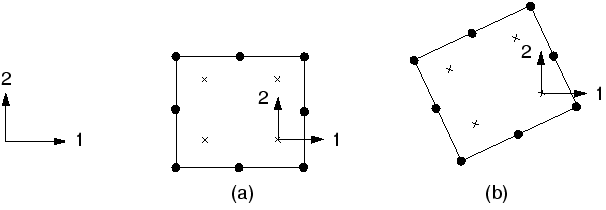
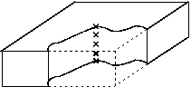
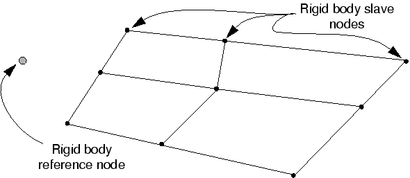

3 Finite Elements and Rigid Bodies
## 3. Finite Elements and Rigid Bodies

Finite elements and rigid bodies are the fundamental components of an Abaqus model. Finite elements are deformable, whereas rigid bodies move through space without changing shape. While users of finite element analysis programs tend to have some understanding of what finite elements are, the general concept of rigid bodies within a finite element program may be somewhat new.

For computational efficiency Abaqus has a general rigid body capability. Any body or part of a body can be defined as a rigid body; most element types can be used in a rigid body definition (the exceptions are listed in "Rigid body definition,"  Section 2.4.1 of the Abaqus Analysis User's Guide). The advantage of rigid bodies over deformable bodies is that the motion of a rigid body is described completely by no more than six degrees of freedom at a reference node. In contrast, deformable elements have many degrees of freedom and require expensive element calculations to determine the deformations. When such deformations are negligible or not of interest, modeling a component as a rigid body produces significant computational savings without affecting the overall results.

### Finite elements

A wide range of elements is available in Abaqus. This extensive element library provides you with a powerful set of tools for solving many different problems. The elements available in Abaqus/Explicit are (with a few exceptions) a subset of those available in Abaqus/Standard. This section introduces you to the five aspects of an element that influence how it behaves.

### 3.1.1 Characterizing elements

Each element is characterized by the following:- Family
- Degrees of freedom (directly related to the element family)
- Number of nodes
- Formulation
- Integration
Each element in Abaqus has a unique name, such as T2D2, S4R, or C3D8I. The element name identifies each of the five aspects of an element. The naming convention is explained in this chapter.

**Family**[Figure 3-1](ch03s01.html#gsa-elem-families) shows the element families most commonly used in a stress analysis. One of the major distinctions between different element families is the geometry type that each family assumes.

The element families that you will use in this guide--continuum, shell, beam, truss, and rigid elements--are discussed in detail in other chapters. The other element families are not covered in this guide; if you are interested in using them in your models, read about them in Part VI, "Elements," of the Abaqus Analysis User's Guide.

The first letter or letters of an element's name indicate to which family the element belongs. For example, the S in S4R indicates this is a shell element, while the C in C3D8I indicates this is a continuum element.

**Degrees of freedom**The degrees of freedom (dof) are the fundamental variables calculated during the analysis. For a stress/displacement simulation the degrees of freedom are the translations at each node. Some element families, such as the beam and shell families, have rotational degrees of freedom as well. For a heat transfer simulation the degrees of freedom are the temperatures at each node; a heat transfer analysis, therefore, requires the use of different elements than a stress analysis, since the degrees of freedom are not the same.

The following numbering convention is used for the degrees of freedom in Abaqus:**1Translation in direction 12Translation in direction 23Translation in direction 34Rotation about the 1-axis5Rotation about the 2-axis6Rotation about the 3-axis7Warping in open-section beam elements8Acoustic pressure, pore pressure, or hydrostatic fluid pressure9Electric potential10Connector material flow (units of length)11Temperature (or normalized concentration in mass diffusion analysis) for continuum elements or temperature at the first point through the thickness of beams and shells12+Temperature at other points through the thickness of beams and shellsDirections 1, 2, and 3 correspond to the global 1-, 2-, and 3-directions, respectively, unless a local coordinate system has been defined at the nodes.

Axisymmetric elements are the exception, with the displacement and rotation degrees of freedom referred to as follows:1Translation in the *r*-direction2Translation in the *z*-direction6Rotation in the *r*-*z* planeDirections *r* (radial) and *z* (axial) correspond to the global 1- and 2-directions, respectively, unless a local coordinate system has been defined at the nodes. See [Chapter 5, "Using Shell Elements](ch05.md)," for a discussion of defining a local coordinate system at the nodes.

In this guide our attention is restricted to structural applications. Therefore, only elements with translational and rotational degrees of freedom are discussed. For information on other types of elements (for example, heat transfer elements), consult the Abaqus Analysis User's Guide.

By default, Abaqus/CAE uses the alphabetical option, *x-y-z*, for labeling the view orientation triad. In general, this guide adopts the numerical option, 1-2-3, to permit direct correspondence with degree of freedom and output labeling. For more information on labeling of axes, see "Customizing the view triad,"  Section 5.4 of the Abaqus/CAE User's Guide.

Number of nodes--order of interpolation**Displacements, rotations, temperatures, and the other degrees of freedom mentioned in the previous section are calculated only at the nodes of the element. At any other point in the element, the displacements are obtained by interpolating from the nodal displacements. Usually the interpolation order is determined by the number of nodes used in the element, as illustrated in the examples in [Figure 3-2](ch03s01.html#gsa-brickelem).

- Elements that have nodes only at their corners, such as the 8-node brick shown in Figure 3-2(a), use linear interpolation in each direction and are often called linear elements or first-order elements.
- Elements with midside nodes, such as the 20-node brick shown in Figure 3-2(b), use quadratic interpolation and are often called quadratic elements or second-order elements.
- Modified triangular or tetrahedral elements with midside nodes, such as the 10-node tetrahedron shown in Figure 3-2(c), use a modified second-order interpolation and are often called modified elements or modified second-order elements.
Abaqus/Standard offers a wide selection of both linear and quadratic elements. Abaqus/Explicit offers only linear elements, with the exception of the quadratic beam and modified tetrahedron and triangle elements.Typically, the number of nodes in an element is clearly identified in its name. The 8-node brick element, as you have seen, is called C3D8; and the 8-node general shell element is called S8R. The beam element family uses a slightly different convention: the order of interpolation is identified in the name. Thus, a first-order, three-dimensional beam element is called B31, whereas a second-order, three-dimensional beam element is called B32. A similar convention is used for axisymmetric shell and membrane elements.

**Formulation**An element's formulation refers to the mathematical theory used to define the element's behavior. In the absence of adaptive meshing all of the stress/displacement elements in Abaqus are based on the *Lagrangian* or *material* description of behavior: the material associated with an element remains associated with the element throughout the analysis, and material cannot flow across element boundaries. In the alternative *Eulerian* or *spatial* description, elements are fixed in space as the material flows through them. Eulerian methods are used commonly in fluid mechanics simulations. Abaqus/Standard uses Eulerian elements to model convective heat transfer. Adaptive meshing combines the features of pure Lagrangian and Eulerian analyses and allows the motion of the element to be independent of the material. Eulerian elements and adaptive meshing are not discussed in this guide.

To accommodate different types of behavior, some element families in Abaqus include elements with several different formulations. For example, the shell element family has three classes: one suitable for general-purpose shell analysis, another for thin shells, and yet another for thick shells. (These shell element formulations are explained in [Chapter 5, "Using Shell Elements](ch05.md).")

Some Abaqus/Standard element families have a standard formulation as well as some alternative formulations. Elements with alternative formulations are identified by an additional character at the end of the element name. For example, the continuum, beam, and truss element families include members with a hybrid formulation in which the pressure (continuum elements) or axial force (beam and truss elements) is treated as an additional unknown; these elements are identified by the letter "H" at the end of the name (C3D8H or B31H).

Some element formulations allow coupled field problems to be solved. For example, elements whose names begin with the letter C and end with the letter T (such as C3D8T) possess both mechanical and thermal degrees of freedom and are intended for coupled thermal-mechanical simulations.

Several of the most commonly used element formulations are discussed later in this guide.

**Integration**Abaqus uses numerical techniques to integrate various quantities over the volume of each element. Using Gaussian quadrature for most elements, Abaqus evaluates the material response at each integration point in each element. Some elements in Abaqus can use full or reduced integration, a choice that can have a significant effect on the accuracy of the element for a given problem, as discussed in detail in ["Element formulation and integration,"  Section 4.1](ch04s01.md).

Abaqus uses the letter "R" at the end of the element name to distinguish reduced-integration elements (unless they are also hybrid elements, in which case the element name ends with the letters "RH"). For example, CAX4 is the 4-node, fully integrated, linear, axisymmetric solid element; and CAX4R is the reduced-integration version of the same element.

Abaqus/Standard offers both full and reduced-integration elements; Abaqus/Explicit offers only reduced-integration elements with the exception of the modified tetrahedron and triangle elements and the fully integrated first-order shell, membrane, and brick elements.

### 3.1.2 Continuum elements

Among the different element families, continuum or solid elements can be used to model the widest variety of components. Conceptually, continuum elements simply model small blocks of material in a component. Since they may be connected to other elements on any of their faces, continuum elements, like bricks in a building or tiles in a mosaic, can be used to build models of nearly any shape, subjected to nearly any loading. Abaqus has stress/displacement, nonstructural, and coupled field continuum elements; this guide will discuss only stress/displacement elements.

Continuum stress/displacement elements in Abaqus have names that begin with the letter "C." The next two letters indicate the dimensionality and usually, but not always, the active degrees of freedom in the element. The letters "3D" indicate a three-dimensional element; "AX," an axisymmetric element; "PE," a plane strain element; and "PS," a plane stress element.

The use of continuum elements is discussed further in [Chapter 4, "Using Continuum Elements](ch04.md)."

**Three-dimensional continuum element library**Three-dimensional continuum elements can be hexahedra (bricks), wedges, or tetrahedra. The full inventory of three-dimensional continuum elements and the nodal connectivity for each type can be found in "Three-dimensional solid element library,"  Section 28.1.4 of the Abaqus Analysis User's Guide.

Whenever possible, hexahedral elements or second-order tetrahedral elements should be used in Abaqus. First-order tetrahedra (C3D4) have a simple, constant-strain formulation, and very fine meshes are required for an accurate solution.

**Two-dimensional continuum element library**Abaqus has several classes of two-dimensional continuum elements that differ from each other in their out-of-plane behavior. Two-dimensional elements can be quadrilateral or triangular. [Figure 3-3](ch03s01.html#gsa-plane-axielem) shows the three classes that are used most commonly.

Plane strain elements assume that the out-of-plane strain, *, is zero; they can be used to model thick structures.

Plane stress elements assume that the out-of-plane stress, , is zero; they are suitable for modeling thin structures.

Axisymmetric elements without twist, the "CAX" class of elements, model a 360° ring; they are suitable for analyzing structures with axisymmetric geometry subjected to axisymmetric loading.

Abaqus/Standard also provides generalized plane strain elements, axisymmetric elements with twist, and axisymmetric elements with asymmetric deformation.- Generalized plane strain elements include the additional generalization that the out-of-plane strain may vary linearly with position in the plane of the model. This formulation is particularly suited for the thermal-stress analysis of thick sections.
- Axisymmetric elements with twist model an initially axisymmetric geometry that can twist about the axis of symmetry. These elements are useful for modeling the torsion of cylindrical structures, such as axisymmetric rubber bushings.
- Axisymmetric elements with asymmetric deformation model an initially axisymmetric geometry that can deform asymmetrically (typically as a result of bending). They are useful for simulating problems such as an axisymmetric rubber mount that is subjected to shear loads.
The latter three classes of two-dimensional continuum elements are not discussed in this guide.

Two-dimensional solid elements must be defined in the 1-2 plane so that the node order is counterclockwise around the element perimeter, as shown in [Figure 3-4](ch03s01.html#gsa-two-dimensional).

When using a preprocessor to generate the mesh, ensure that the element normals all point in the same direction as the positive, global 3-axis. Failure to provide the correct element connectivity will cause Abaqus to issue an error message stating that elements have negative area.

**Degrees of freedom**All of the stress/displacement continuum elements have translational degrees of freedom at each node. Correspondingly, degrees of freedom 1, 2, and 3 are active in three-dimensional elements, while only degrees of freedom 1 and 2 are active in plane strain elements, plane stress elements, and axisymmetric elements without twist. To find the active degrees of freedom in the other classes of two-dimensional solid elements, see "Two-dimensional solid element library,"  Section 28.1.3 of the Abaqus Analysis User's Guide.

**Element properties**All solid elements must refer to a solid section property that defines the material and any additional geometric data associated with the element. For three-dimensional and axisymmetric elements no additional geometric information is required: the nodal coordinates completely define the element geometry. For plane stress and plane strain elements the thickness of the elements may be specified or a default value of 1 will be used.

**Formulation and integration**Alternative formulations available for the continuum family of elements in Abaqus/Standard include an incompatible mode* formulation (the last or second-to-last letter in the element name is I) and a *hybrid* element formulation (the last letter in the element name is H), both of which are discussed in detail later in this guide.

In Abaqus/Standard you can choose between full and reduced integration for quadrilateral and hexahedral (brick) elements. In Abaqus/Explicit you can choose between full and reduced integration for hexahedral (brick) elements; however, only reduced integration is available for quadrilateral first-order elements. Both the formulation and type of integration can have a significant effect on the accuracy of solid elements, as discussed in ["Element formulation and integration,"  Section 4.1](ch04s01.md).

**Element output variables**By default, element output variables such as stress and strain refer to the global Cartesian coordinate system. Thus, the *-component of stress at the integration point shown in [Figure 3-5](ch03s01.html#gsa-continuum-elem)(a) acts in the global 1-direction. Even if the element rotates during a large-displacement simulation, as shown in [Figure 3-5](ch03s01.html#gsa-continuum-elem)(b), the default is still to use the global Cartesian system as the basis for defining the element variables.

However, Abaqus allows you to define a local coordinate system for element variables (see ["Example: skew plate,"  Section 5.5](ch05s05.md)). This local coordinate system rotates with the motion of the element in large-displacement simulations. A local coordinate system can be very useful if the object being modeled has some natural material orientation, such as the fiber directions in a composite material.

### 3.1.3 Shell elements

Shell elements are used to model structures in which one dimension (the thickness) is significantly smaller than the other dimensions and the stresses in the thickness direction are negligible.

Shell element names in Abaqus begin with the letter "S." Axisymmetric shells all begin with the letters "SAX." Abaqus/Standard also provides axisymmetric shells with asymmetric deformations, which begin with the letters "SAXA." The first number in a shell element name indicates the number of nodes in the element, except for the case of axisymmetric shells, for which the first number indicates the order of interpolation.

Two types of shell elements are available in Abaqus: conventional shell elements and continuum shell elements. Conventional shell elements discretize a reference surface by defining the element's planar dimensions, its surface normal, and its initial curvature. Continuum shell elements, on the other hand, resemble three-dimensional solid elements in that they discretize an entire three-dimensional body yet are formulated so that their kinematic and constitutive behavior is similar to conventional shell elements. In this guide only conventional shell elements are discussed. Henceforth, we will refer to them simply as "shell elements." For more information on continuum shell elements, see "Shell elements: overview,"  Section 29.6.1 of the Abaqus Analysis User's Guide.

The use of shell elements is discussed in detail in [Chapter 5, "Using Shell Elements](ch05.md)."

**Shell element library**In Abaqus/Standard general three-dimensional shell elements are available with three different formulations: general-purpose, thin-only, and thick-only. The general-purpose shells and the axisymmetric shells with asymmetric deformation account for finite membrane strains and arbitrarily large rotations. The three-dimensional "thick" and "thin" element types provide for arbitrarily large rotations but only small strains. The general-purpose shells allow the shell thickness to change with the element deformation. All of the other shell elements assume small strains and no change in shell thickness, even though the element's nodes may undergo finite rotations. Triangular and quadrilateral elements with linear and quadratic interpolation are available. Both linear and quadratic axisymmetric shell elements are available. All of the quadrilateral shell elements (except for S4) and the triangular shell element S3/S3R use reduced integration. The S4 element and the other triangular shell elements use full integration. [Table 3-1](ch03s01.html#gsa-elementintro-table1) summarizes the shell elements available in Abaqus/Standard.

**Table 3-1** Three classes of shell elements in Abaqus/Standard.General-Purpose ShellsThin-Only ShellsThick-Only Shells S4, S4R, S3/S3R, SAX1, SAX2, SAX2T, SC6R, SC8RSTRI3, STRI65, S4R5, S8R5, S9R5, SAXA S8R, S8RTAll the shell elements in Abaqus/Explicit are general-purpose. Finite membrane strain and small membrane strain formulations are available. Triangular and quadrilateral elements are available with linear interpolation. A linear axisymmetric shell element is also available. [Table 3-2](ch03s01.html#gsa-elementintro-table2) summarizes the shell elements available in Abaqus/Explicit.

**Table 3-2** Two classes of shell elements in Abaqus/Explicit.Finite-Strain ShellsSmall-Strain ShellsS4, S4R, S3/S3R, SAX1S4RS, S4RSW, S3RSFor most explicit analyses the large-strain shell elements are appropriate. If, however, the analysis involves small membrane strains and arbitrarily large rotations, the small-strain shell elements are more computationally efficient. The S4RS and S3RS elements do not consider warping, while the S4RSW element does.

The shell formulations available in Abaqus are discussed in detail in [Chapter 5, "Using Shell Elements](ch05.md)."

**Degrees of freedom**The three-dimensional elements in Abaqus/Standard whose names end in the number "5" (e.g., S4R5, STRI65) have 5 degrees of freedom at each node: three translations and two in-plane rotations (i.e., no rotations about the shell normal). However, all six degrees of freedom are activated at a node if required; for example, if rotational boundary conditions are applied or if the node is on a fold line of the shell.

The remaining three-dimensional shell elements have six degrees of freedom at each node (three translations and three rotations).

The axisymmetric shells have three degrees of freedom associated with each node:1Translation in the r*-direction.2Translation in the *z*-direction.6Rotation in the *r*-*z* plane.**

Element properties**All shell elements must refer to a shell section property that defines the thickness and material properties associated with the element.The stiffness of the shell cross-section can be calculated either during the analysis or once at the beginning of the analysis.

If you choose to have the stiffness calculated during the analysis, Abaqus uses numerical integration to calculate the behavior at selected points through the thickness of the shell. These points are called section points, as shown in [Figure 3-6](ch03s01.html#gsa-shell-sect-pts). The associated material property definition may be linear or nonlinear. You can specify any odd number of section points through the shell thickness.

If you choose to have the stiffness calculated once at the beginning of the analysis, you can define the cross-section behavior to model linear or nonlinear behavior. In this case Abaqus models the shell's cross-section behavior directly in terms of section engineering quantities (area, moments of inertia, etc.), so there is no need for Abaqus to integrate any quantities over the element cross-section. Therefore, this option is less expensive computationally. The response is calculated in terms of force and moment resultants; the stresses and strains are calculated only when they are requested for output. This approach is recommended when the response of the shell is linear elastic.

**Element output variables**The element output variables for shells are defined in terms of local material directions that lie on the surface of each shell element. In all large-displacement simulations these axes rotate with the element's deformation. You can also define a local material coordinate system that rotates with the element's deformation in a large-displacement analysis.

### 3.1.4 Beam elements

Beam elements are used to model components in which one dimension (the length) is significantly greater than the other two dimensions and only the stress in the direction along the axis of the beam is significant.

Beam element names in Abaqus begin with the letter "B." The next character indicates the dimensionality of the element: "2" for two-dimensional beams and "3" for three-dimensional beams. The third character indicates the interpolation used: "1" for linear interpolation, "2" for quadratic interpolation, and "3" for cubic interpolation.

The use of beam elements is discussed in [Chapter 6, "Using Beam Elements](ch06.md)."

**Beam element library**Linear, quadratic, and cubic beams are available in two and three dimensions. Cubic beams are not available in Abaqus/Explicit.

**Degrees of freedom**Three-dimensional beams have six degrees of freedom at each node: three translational degrees of freedom (1-3) and three rotational degrees of freedom (4-6). "Open-section"-type beams (such as B31OS) are available in Abaqus/Standard and have an additional degree of freedom (7) that represents the warping of the beam cross-section.

Two-dimensional beams have three degrees of freedom at each node: two translational degrees of freedom (1 and 2) and one rotational degree of freedom (6) about the normal to the plane of the model.

**Element properties**All beam elements must refer to a beam section property that defines the material associated with the element as well as the beam section profile (i.e., the element's cross-sectional geometry); the nodal coordinates define only the length. You can define the beam section profile geometrically by specifying the shape and dimensions of the section. Alternatively, you can define a generalized beam section profile by specifying the section engineering properties, such as area and moment of inertia.

If you define the beam section profile geometrically, Abaqus calculates the cross-section behavior of the beam by numerical integration over the cross-section, allowing both linear and nonlinear material behavior.

If you provide the section engineering properties (area, moments of inertia, and torsional constants) instead of the cross-section dimensions, there is no need for Abaqus to integrate any quantities over the element cross-section. Therefore, this option is less expensive computationally. With this approach, the material behavior may be either linear or nonlinear. The response is calculated in terms of the force and moment resultants; the stresses and strains are calculated only when they are requested for output.

In Abaqus/Standard you can also define beams with linearly tapered cross-sections. General beam sections with linear response and standard library sections are supported.

**Formulation and integration**The linear beams (B21 and B31) and the quadratic beams (B22 and B32) are shear deformable and account for finite axial strains; therefore, they are suitable for modeling both slender and stout beams. The cubic beam elements in Abaqus/Standard (B23 and B33) do not account for shear flexibility and assume small axial strain, although large displacements and rotations of the beams are valid. They are, therefore, suitable for modeling slender beams.

Abaqus/Standard provides variants of linear and quadratic beam elements that are suitable for modeling thin-walled, open-section beams (B31OS and B32OS). These elements model the effects of torsion and warping in open cross-sections, such as I-beams or U-section channels. Open-section beams are not covered in this guide.

Abaqus/Standard also has hybrid beam elements that are used for modeling very slender members, such as flexible risers on offshore oil installations, or for modeling very stiff links. Hybrid beams are not covered in this guide.

**Element output variables**The stress components in three-dimensional, shear-deformable beam elements are the axial stress () and the shear stress due to torsion (). The shear stress acts about the section wall in a thin-walled section. Corresponding strain measures are also available. The shear-deformable beams also provide estimates of transverse shear forces on the section. The slender (cubic) beams in Abaqus/Standard have only the axial variables as output. Open-section beams in space also have only the axial variables as output, since the torsional shear stresses are negligible in this case.

All two-dimensional beams use only axial stress and strain.

The axial force, bending moments, and curvatures about the local beam axes can also be requested for output. For details of what components are available with which elements, see "Beam modeling: overview,"  Section 29.3.1 of the Abaqus Analysis User's Guide. Details of how the local beam axes are defined are given in [Chapter 6, "Using Beam Elements](ch06.md)."

### 3.1.5 Truss elements

Truss elements are rods that can carry only tensile or compressive loads. They have no resistance to bending; therefore, they are useful for modeling pin-jointed frames. Moreover, truss elements can be used as an approximation for cables or strings (for example, in a tennis racket). Trusses are also sometimes used to represent reinforcement within other elements. The overhead hoist model in [Chapter 2, "Abaqus Basics](ch02.md)," uses truss elements.

All truss element names begin with the letter "T." The next two characters indicate the dimensionality of the element--"2D" for two-dimensional trusses and "3D" for three-dimensional trusses. The final character represents the number of nodes in the element.

**Truss element library**Linear and quadratic trusses are available in two and three dimensions. Quadratic trusses are not available in Abaqus/Explicit.

**Degrees of freedom**Truss elements have only translational degrees of freedom at each node. Three-dimensional truss elements have degrees of freedom 1, 2, and 3, while two-dimensional truss elements have degrees of freedom 1 and 2.

**Element properties**All truss elements must refer to a truss section property that associates a material property definition with the element and specifies its cross-sectional area.

**Formulation and integration**In addition to the standard formulation, a hybrid truss element formulation is available in Abaqus/Standard. It is useful for modeling very stiff links whose stiffness is much greater than that of the overall structure.

**Element output variables**Axial stress and strain are available as output for truss elements.

### Rigid bodies

In Abaqus a rigid body is a collection of nodes and elements whose motion is governed by the motion of a single node, known as the *rigid body reference node*, as shown in [Figure 3-7](ch03s02.html#gsa-rigidelem).

The shape of the rigid body is defined either as an analytical surface obtained by revolving or extruding a two-dimensional geometric profile or as a discrete rigid body obtained by meshing the body with nodes and elements. The shape of the rigid body does not change during a simulation but can undergo large rigid body motions. The mass and inertia of a discrete rigid body can be calculated based on the contributions from its elements, or they can be assigned directly.

The motion of a rigid body can be prescribed by applying boundary conditions at the rigid body reference node. Loads on a rigid body are generated from concentrated loads applied to nodes and distributed loads applied to elements that are part of the rigid body or from loads applied to the rigid body reference node. Rigid bodies interact with the rest of the model through nodal connections to deformable elements and through contact with deformable elements.

The use of rigid bodies is illustrated in [Chapter 12, "Contact](ch12.md)."

### 3.2.1 Determining when to use a rigid body

Rigid bodies can be used to model very stiff components that are either fixed or undergoing large rigid body motions. They can also be used to model constraints between deformable components, and they provide a convenient method of specifying certain contact interactions. When Abaqus is used for quasi-static forming analyses, rigid bodies are ideally suited for modeling tooling (such as a punch, die, drawbead, blank holder, roller, etc.) and may also be effective as a method of constraint.

It may be useful to make parts of a model rigid for verification purposes. For example, in complex models elements far away from the particular region of interest could be included as part of a rigid body, resulting in faster run times at the model development stage. When you are satisfied with the model, you can remove the rigid body definitions and incorporate an accurate deformable finite element representation throughout.

The principal advantage to representing portions of a model with rigid bodies rather than deformable finite elements is computational efficiency. Element-level calculations are not performed for elements that are part of a rigid body. Although some computational effort is required to update the motion of the nodes of the rigid body and to assemble concentrated and distributed loads, the motion of the rigid body is determined completely by a maximum of six degrees of freedom at the rigid body reference node.

In Abaqus/Explicit rigid bodies are particularly effective for modeling relatively stiff parts of a structure for which tracking stress waves and distributions is not important. Element stable time increment estimates in the stiff region can result in a very small global time increment. Since rigid bodies and elements that are part of a rigid body do not affect the global time increment, using a rigid body instead of a deformable finite element representation in a stiff region can result in a much larger global time increment, without significantly affecting the overall accuracy of the solution.

Rigid bodies defined with analytical rigid surfaces in Abaqus are slightly cheaper in terms of computational cost than discrete rigid bodies and may yield smoother results. In Abaqus/Explicit, for example, contact with analytical rigid surfaces tends to be less noisy than contact with discrete rigid bodies because analytical rigid surfaces can be smooth, whereas discrete rigid bodies are inherently faceted. However, the shapes that can be defined with analytical rigid surfaces are limited.

### 3.2.2 Components of a rigid body

The motion of a rigid body is controlled by the motion of a single node: the rigid body reference node. A rigid body reference node has both translational and rotational degrees of freedom and must be defined uniquely for every rigid body.

The position of the rigid body reference node is not important unless rotations are applied to the body or reaction moments about a certain axis through the body are desired. In either of these situations the node should be placed such that it lies on the desired axis through the body.

In addition to the rigid body reference node, discrete rigid bodies consist of a collection of nodes that are generated by assigning elements and nodes to the rigid body. These nodes, known as the *rigid body slave nodes* (see [Figure 3-7](ch03s02.html#gsa-rigidelem)), provide a connection to other elements. Nodes that are part of a rigid body are one of two types:- Pin nodes, which have only translational degrees of freedom.
- Tie nodes, which have both translational and rotational degrees of freedom.

The rigid body node type is determined by the type of elements on the rigid body to which the node is attached. The node type also can be specified or modified when assigning nodes directly to a rigid body. For pin nodes only the translational degrees of freedom are part of the rigid body, and the motion of these degrees of freedom is constrained by the motion of the rigid body reference node. For tie nodes both the translational and rotational degrees of freedom are part of the rigid body and are constrained by the motion of the rigid body reference node.

The nodes defining the rigid body cannot have any boundary conditions, multi-point constraints, or constraint equations applied to them. Boundary conditions, multi-point constraints, constraint equations, and loads can be applied, however, to the rigid body reference node.

### 3.2.3 Rigid elements

The rigid body capability in Abaqus allows most element types to be part of a rigid body. In addition, there exists an element type specifically designated as a "rigid element." The rules governing rigid bodies, such as how loads and boundary conditions are applied, pertain to all element types that form the rigid body, including rigid elements.

The names of all rigid elements begin with the letter "R." The next characters indicate the dimensionality of the element. For example, "2D" indicates that the element is planar; and "AX," that the element is axisymmetric. The final character represents the number of nodes in the element.

**Rigid element library**The three-dimensional quadrilateral (R3D4) and triangular (R3D3) rigid elements are used to model the two-dimensional surfaces of a three-dimensional rigid body. Another element--a two-node, rigid beam element (RB3D2)--is provided in Abaqus/Standard mainly to model components of offshore structures to which fluid drag and buoyancy loads must be applied.

Two-node, rigid elements are available for plane strain, plane stress, and axisymmetric models. A planar, two-node rigid beam element is also available in Abaqus/Standard and is used mainly to model offshore structures in two dimensions.

**Degrees of freedom**Only the rigid body reference node has independent degrees of freedom. For three-dimensional elements the reference node has three translational and three rotational degrees of freedom; for planar and axisymmetric elements the reference node has degrees of freedom 1, 2, and 6 (rotation about the 3-axis).

The nodes attached to rigid elements have only slave degrees of freedom. The motion of these nodes is determined entirely by the motion of the rigid body reference node. For planar and three-dimensional rigid elements the only slave degrees of freedom are translations. The rigid beam elements in Abaqus/Standard have the same slave degrees of freedom as the corresponding deformable beam elements: 1-6 for the three-dimensional rigid beam and 1, 2, and 6 for the planar rigid beam.

**Physical properties**All rigid elements must refer to a section property. For the planar and rigid beam elements the cross-sectional area can be defined. For the axisymmetric and three-dimensional elements the thickness can be defined. The default thickness is zero. These data are required only if you apply body forces to the rigid elements or when the thickness is needed for the contact definition.

**Formulation and integration**Since the rigid elements are not deformable, they do not use numerical integration points, and there are no optional formulations.

**Element output variables**There are no element output variables. The only output from rigid elements is the motion of the nodes. In addition, reaction forces and reaction moments are available at the rigid body reference node.

### Summary

- Abaqus has an extensive library of elements that can be used for a wide range of structural applications. Your choice of element type has important consequences regarding the accuracy and efficiency of your simulation. The elements available in Abaqus/Explicit are (in general) a subset of those available in Abaqus/Standard.
- The degrees of freedom active at a node depend on the element types attached to the node.
- The element name completely identifies the element's family, formulation, number of nodes, and type of integration.
- All elements must refer to a section property definition. The section property provides any additional data required to define the geometry of the element and also identifies the associated material property definition.
- For continuum elements Abaqus defines the element output variables, such as stress and strain, with respect to the global Cartesian coordinate system. You can change to a local material coordinate system.
- For three-dimensional shell elements Abaqus defines the element output variables with respect to a coordinate system based on the surface of the shell. You can define a local material coordinate system.
- For computational efficiency any part of a model can be defined as a rigid body, which has degrees of freedom only at its reference node.
- As a method of constraint in an Abaqus/Explicit analysis, rigid bodies are computationally more efficient than multi-point constraints.