# 12.&nbsp;Contact

12 Contact

Many engineering problems involve contact between two or more components. In these problems a force normal to the contacting surfaces acts on the two bodies when they touch each other. If there is friction between the surfaces, shear forces may be created that resist the tangential motion (sliding) of the bodies. The general aim of contact simulations is to identify the areas on the surfaces that are in contact and to calculate the contact pressures generated.In a finite element analysis contact conditions are a special class of discontinuous constraint, allowing forces to be transmitted from one part of the model to another. The constraint is discontinuous because it is applied only when the two surfaces are in contact. When the two surfaces separate, no constraint is applied. The analysis has to be able to detect when two surfaces are in contact and apply the contact constraints accordingly. Similarly, the analysis must be able to detect when two surfaces separate and remove the contact constraints.

## 12.1&nbsp;Overview of contact capabilities in Abaqus

12.1 Overview of contact capabilities in Abaqus

Contact simulations in Abaqus/Standard can either be surface based or contact element based. Contact simulations in Abaqus/Explicit are surface based only. In this guide, surface-based contact is discussed.Surface-based contact can utilize either the general ("automatic") contact algorithm or the contact pair algorithm. The general contact algorithm allows for a highly automated contact definition, where contact is based on an automatically generated all-inclusive surface definition. Conversely, the contact pair algorithm requires you to explicitly pair surfaces that may potentially come into contact. Both algorithms require specification of contact properties between surfaces (for example, friction).The discussion of contact in this guide addresses the contact pair approach and general contact in Abaqus/Standard and general contact in Abaqus/Explicit.

## 12.2&nbsp;Defining surfaces

12.2 Defining surfaces

Surfaces are created from the element faces of the underlying material. The discussion that follows assumes that the surfaces will be defined in Abaqus/CAE. Restrictions on the types of surfaces that can be created in Abaqus are discussed in "Surface definition," Section 2.3 of the Abaqus Analysis User's Guide; please read them before beginning a contact simulation.Surfaces on continuum elementsFor two- and three-dimensional solid continuum elements you specify which regions of a part form the contact surface by selecting the regions of a part instance in the viewport.Surfaces on structural, surface, and rigid elementsThere are four ways to define surfaces on structural, surface, and rigid elements: using single-sided surfaces, double-sided surfaces, edge-based surfaces, and node-based surfaces.Using single-sided surfaces, you specify which side of the element forms the contact surface. The side in the direction of the positive element normal is called SPOS, while the side in the direction of the negative element normal is called SNEG, as shown in [Figure 12-1](ch12s02.html#gss-surface). The connectivity of an element defines the positive element normal, as discussed in Chapter 5, "Using Shell Elements." The positive element normals can be viewed in Abaqus/CAE.Figure 12-1 Surfaces on a two-dimensional shell or rigid element.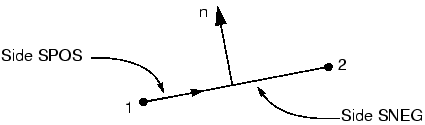Double-sided contact surfaces are more general because both the SPOS and SNEG faces and all free edges are included automatically as part of the contact surface. Contact can occur on either face or on the edges of the elements forming the double-sided surface. For example, a slave node can start on one side of a double-sided surface and then travel around the perimeter to the other side during the course of an analysis. Currently, double-sided surfaces can be defined only on three-dimensional shell, membrane, surface, and rigid elements. In Abaqus/Explicit the general contact algorithm and self-contact in the contact pair algorithm enforce contact on both sides of all shell, membrane, surface, and rigid surface facets, even if they are defined as single-sided. Double-sided contact surfaces cannot be used with the default contact formulation in Abaqus/Standard, but they can be used with certain optional contact formulations; see "Defining contact pairs in Abaqus/Standard," Section 36.3.1 of the Abaqus Analysis User's Guide, for more information.Edge-based surfaces consider contact on the perimeter edges of the model. They can be used to model contact on a shell edge, for example. Alternatively, node-based surfaces, which define contact between a set of nodes and a surface, can be used to achieve the same effect, as shown in [Figure 12-2](ch12s02.html#gxi-cont-shell-edge).Figure 12-2 Node-based region for contact on a shell edge.Rigid surfacesRigid surfaces are the surfaces of rigid bodies. They can be defined as an analytical shape, or they can be based on the underlying surfaces of elements associated with the rigid body.Analytical rigid surfaces have three basic forms. In two dimensions the specific form of an analytical rigid surface is a two-dimensional, segmented rigid surface. The cross-section of the surface is defined in the two-dimensional plane of the model using straight lines, circular arcs, and parabolic arcs. The cross-section of a three-dimensional rigid surface is defined in a user-specified plane in the same manner used for two-dimensional surfaces. Then, this cross-section is swept around an axis to form a surface of revolution or extruded along a vector to form a long three-dimensional surface as shown in [Figure 12-3](ch12s02.html#gsi-analrigidsurf).Figure 12-3 Analytical rigid surfaces.The benefit of analytical rigid surfaces is that they are defined by only a small number of geometric points and are computationally efficient. However, in three dimensions the range of shapes that can be created with them is limited.Discretized rigid surfaces are based on the underlying elements that make up a rigid body; thus, they can be more geometrically complex than analytical rigid surfaces. Discretized rigid surfaces are defined in exactly the same manner as surfaces on deformable bodies.

## 12.3&nbsp;Interaction between surfaces

12.3 Interaction between surfaces

The interaction between contacting surfaces consists of two components: one normal to the surfaces and one tangential to the surfaces. The tangential component consists of the relative motion (sliding) of the surfaces and, possibly, frictional shear stresses. Each contact interaction can refer to a contact property that specifies a model for the interaction between the contacting surfaces. There are several contact interaction models available in Abaqus; the default model is frictionless contact with no bonding.The distance separating two surfaces is called the clearance. The contact constraint is applied in Abaqus when the clearance between two surfaces becomes zero. There is no limit in the contact formulation on the magnitude of contact pressure that can be transmitted between the surfaces. The surfaces separate when the contact pressure between them becomes zero or negative, and the constraint is removed. This behavior, referred to as "hard" contact, is the default contact behavior in Abaqus and is summarized in the contact pressure-clearance relationship shown in [Figure 12-4](ch12s03.html#gss-contactpress). Figure 12-4 Contact pressure-clearance relationship for "hard" contact.By default, "hard" contact is directly enforced when using contact pairs in Abaqus/Standard. The dramatic change in contact pressure that occurs when a contact condition changes from "open" (a positive clearance) to "closed" (clearance equal to zero) sometimes makes it difficult to complete contact simulations in Abaqus/Standard; the same is not true for Abaqus/Explicit since iteration is not required for explicit methods. Alternative enforcement methods (e.g., penalty) are available for contact pairs, as discussed in "Contact constraint enforcement methods in Abaqus/Standard," Section 38.1.2 of the Abaqus Analysis User's Guide. Penalty enforcement of the contact constraints is the only option available for general contact. Other sources of information include "Common difficulties associated with contact modeling in Abaqus/Standard," Section 39.1.2 of the Abaqus Analysis User's Guide; "Common difficulties associated with contact modeling using contact pairs in Abaqus/Explicit," Section 39.2.2 of the Abaqus Analysis User's Guide; the "Modeling Contact with Abaqus/Standard" lecture notes; and the "Advanced Topics: Abaqus/Explicit" lecture notes.In addition to determining whether contact has occurred at a particular point, an Abaqus analysis also must calculate the relative sliding of the two surfaces. This can be a very complex calculation; therefore, Abaqus makes a distinction between analyses where the magnitude of sliding is small and those where the magnitude of sliding may be finite. It is much less expensive computationally to model problems where the sliding between the surfaces is small. What constitutes "small sliding" is often difficult to define, but a general guideline to follow is that problems can use the "small-sliding" approximation if a point contacting a surface does not slide more than a small fraction of a typical element dimension.Small sliding is not available for general contact.When surfaces are in contact, they usually transmit shear as well as normal forces across their interface. Thus, the analysis may need to take frictional forces, which resist the relative sliding of the surfaces, into account. Coulomb friction is a common friction model used to describe the interaction of contacting surfaces. The model characterizes the frictional behavior between the surfaces using a coefficient of friction, . The default friction coefficient is zero. The tangential motion is zero until the surface traction reaches a critical shear stress value, which depends on the normal contact pressure, according to the following equation: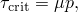where  is the coefficient of friction and  is the contact pressure between the two surfaces. This equation gives the limiting frictional shear stress for the contacting surfaces. The contacting surfaces will not slip (slide relative to each other) until the shear stress across their interface equals the limiting frictional shear stress, 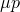. For most surfaces  is normally less than unity. Coulomb friction can be defined with  or 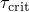. The solid line in [Figure 12-5](ch12s03.html#gss-friction) summarizes the behavior of the Coulomb friction model: there is zero relative motion (slip) of the surfaces when they are sticking (the shear stresses are below ). Optionally, a friction stress limit can be specified if both contacting surfaces are element-based surfaces. Figure 12-5 Frictional behavior.In Abaqus/Standard the discontinuity between the two states--sticking or slipping--can result in convergence problems during the simulation. You should include friction in your Abaqus/Standard simulations only when it has a significant influence on the response of the model. If your contact simulation with friction encounters convergence problems, one of the first modifications you should try in diagnosing the difficulty is to rerun the analysis without friction. In general, friction presents no additional computational difficulties for Abaqus/Explicit.Simulating ideal friction behavior can be very difficult; therefore, by default in most cases, Abaqus uses a penalty friction formulation with an allowable "elastic slip," shown by the dotted line in [Figure 12-5](ch12s03.html#gss-friction). The "elastic slip" is the small amount of relative motion between the surfaces that occurs when the surfaces should be sticking. Abaqus automatically chooses the penalty stiffness (the slope of the dotted line) so that this allowable "elastic slip" is a very small fraction of the characteristic element length. The penalty friction formulation works well for most problems, including most metal forming applications. In those problems where the ideal stick-slip frictional behavior must be included, the "Lagrange" friction formulation can be used in Abaqus/Standard and the kinematic friction formulation can be used in Abaqus/Explicit. The "Lagrange" friction formulation is more expensive in terms of the computer resources used because Abaqus/Standard uses additional variables for each surface node with frictional contact. In addition, the solution converges more slowly so that additional iterations are usually required. This friction formulation is not discussed in this guide.Often the friction coefficient at the initiation of slipping from a sticking condition is different from the friction coefficient during established sliding. The former is typically referred to as the static friction coefficient, and the latter is referred to as the kinetic friction coefficient. In Abaqus an exponential decay law is available to model the transition between static and kinetic friction (see [Figure 12-6](ch12s03.html#afriction-exponential-decay)). This friction formulation is not discussed in this guide.Figure 12-6 Exponential decay friction model.In Abaqus/Standard the inclusion of friction in a model adds unsymmetric terms to the system of equations being solved. If  is less than about 0.2, the magnitude and influence of these terms are quite small and the regular, symmetric solver works well (unless the contact surface has high curvature). For higher coefficients of friction, the unsymmetric solver is invoked automatically because it will improve the convergence rate. The unsymmetric solver requires twice as much computer memory and scratch disk space as the symmetric solver. Large values of  generally do not cause any difficulties in Abaqus/Explicit.The other contact interaction models available in Abaqus depend on the analysis product and the algorithm used and may include adhesive contact behavior, softened contact behavior, fasteners (for example, spot welds), and viscous contact damping. These options are not discussed in this guide. Details about them can be found in the [Abaqus Analysis User's Guide](../usb/usb-link.htm#usb).Tie constraints are used to tie together two surfaces for the duration of a simulation. Each node on the slave surface is constrained to have the same motion as the point on the master surface to which it is closest. For a structural analysis this means the translational (and, optionally, the rotational) degrees of freedom are constrained.Abaqus uses the undeformed configuration of the model to determine which slave nodes are tied to the master surface. By default, all slave nodes that lie within a given distance of the master surface are tied. The default distance is based on the typical element size of the master surface. This default can be overridden in one of two ways: by specifying the distance within which slave nodes must lie from the master surface to be constrained or by specifying the name of a set containing the nodes that will be constrained.Slave nodes can also be adjusted so that they lie exactly on the master surface. If slave nodes have to be adjusted by distances that are a large fraction of the length of the side of the element (to which the slave node is attached), the element can become severely distorted; avoid large adjustments if possible.Tie constraints are particularly useful for rapid mesh refinement between dissimilar meshes.

## 12.4&nbsp;Defining contact in Abaqus/Standard

12.4 Defining contact in Abaqus/Standard

The first step in defining contact pairs (and optionally general contact) in Abaqus/Standard is to define the surfaces of the bodies that could potentially come into contact. The next step is to specify the surfaces that interact with each other; these are the contact interactions. The final step is to define the mechanical property models that govern the behavior of the surfaces when they are in contact.The definition of surfaces is optional for general contact since an all-inclusive element-based surface is automatically created when general contact is used. You can use specific surface pairings to include regions not included in the default surface, to preclude interactions between different regions of a model, or to override global contact property assignments. For example, if you want to apply a certain friction coefficient to all but a few surfaces in your model, you can assign the primary friction coefficient globally and then override this property for a given pair of user-defined surfaces.In an Abaqus/Standard simulation possible contact is defined by assigning the surface names to a contact interaction (contact pair approach) or by invoking an automatically-defined all-inclusive element-based surface as the contact domain (general contact approach). For both contact approaches, each contact interaction must refer to a contact property, in much the same way that each element must refer to an element property. Constitutive behavior, such as the contact pressure-clearance relationship and friction, can be included in the contact property. When you define a contact interaction, you must decide whether the magnitude of the relative sliding will be small or finite. The default is the more general finite-sliding formulation. The small-sliding formulation (available only for contact pairs) is appropriate if the relative motion of the two surfaces is less than a small proportion of the characteristic length of an element face. Using the small-sliding formulation when applicable results in a more efficient analysis.By default, contact pairs in Abaqus/Standard use a pure master-slave contact algorithm: nodes on one surface (the slave) cannot penetrate the segments that make up the other surface (the master), as shown in [Figure 12-7](ch12s04.html#gss-master-surf). The algorithm places no restrictions on the master surface; it can penetrate the slave surface between slave nodes, as shown in [Figure 12-7](ch12s04.html#gss-master-surf). Figure 12-7 The master surface can penetrate the slave surface.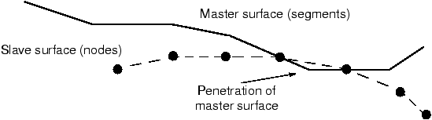Due to the strict master-slave formulation, you must be careful to select the slave and master surfaces correctly in order to achieve the best possible contact simulation. Some simple rules to follow are:the slave surface should be the more finely meshed surface; andif the mesh densities are similar, the slave surface should be the surface with the softer underlying material.The general contact algorithm in Abaqus/Standard enforces contact in an average sense between interacting surfaces; Abaqus/Standard automatically assigns master and slave roles.Abaqus/Standard offers two contact discretization methods: a traditional node-to-surface method and a surface-to-surface method. The node-to-surface discretization method defines contact conditions between each slave node and the master surface. The surface-to-surface discretization method considers the shape of both the master and slave surfaces when defining the contact constraints. The contact pair algorithm can use either discretization method; general contact uses only the surface-to-surface approach.When using the small-sliding formulation, Abaqus/Standard establishes the relationship between the slave nodes and the master surface at the beginning of the simulation. Abaqus/Standard determines which segment on the master surface will interact with each node on the slave surface. It maintains these relationships throughout the analysis, never changing which master surface segments interact with which slave nodes. If geometric nonlinearity is included in the model, the small-sliding algorithm accounts for any rotation and deformation of the master surface and updates the load path through which the contact forces are transmitted. If geometric nonlinearity is not included in the model, any rotation or deformation of the master surface is ignored and the load path remains fixed.The finite-sliding contact formulation requires that Abaqus/Standard continually track which part of the master surface is in contact with each slave node. This is a very complex calculation, especially if both the contacting bodies are deformable. The structures in such simulations can be either two- or three-dimensional. Abaqus/Standard can also model the finite-sliding self-contact of a deformable body. Such a situation occurs when a structure folds over onto itself.The finite-sliding formulation for contact between a deformable body and a rigid surface is not as complex as the finite-sliding formulation for two deformable bodies. Finite-sliding simulations where the master surface is rigid can be performed for both two- and three-dimensional models.The contact pair algorithm can consider either small or finite sliding effects; general contact only considers finite sliding effects.Selection of elements for contact depends heavily on the contact enforcement used. For example, for traditional contact formulations (i.e., the node-to-surface discretization) it is generally better to use first-order elements for those parts of a model that will form a slave surface. Second-order elements can sometimes cause problems in this case because of the way these elements calculate consistent nodal loads for a constant pressure. The consistent nodal loads for a constant pressure, P, on a second-order, two-dimensional element with area A are shown in [Figure 12-8](ch12s04.html#gss-nodloadconstpress).Figure 12-8 Equivalent nodal loads for a constant pressure on a two-dimensional, second-order element.The node-to-surface contact formulation bases important decisions on the forces acting on the slave nodes. It is difficult for the algorithm to tell if the force distribution shown in [Figure 12-8](ch12s04.html#gss-nodloadconstpress) represents a constant contact pressure or an actual variation across the element. The equivalent nodal forces for a three-dimensional, second-order brick element are even more confusing because they do not even have the same sign for a constant pressure, making it very difficult for the algorithm to work correctly, especially for nonuniform contact. Therefore, to avoid such problems, Abaqus/Standard automatically adds a midface node to any face of a second-order, three-dimensional brick or wedge element that defines a slave surface when it is used with the node-to-surface formulation. The equivalent nodal forces for a second-order element face with a midface node have the same sign for a constant pressure, although they still differ considerably in magnitude.The equivalent nodal forces for applied pressures on first-order elements always have a consistent sign and magnitude; therefore, there is no ambiguity about the contact state that a given distribution of nodal forces represents.If you are using the node-to-surface formulation and your geometry is complicated and requires the use of an automatic mesh generator, the modified second-order tetrahedral elements (C3D10M) in Abaqus/Standard should be used. These elements are designed to be used in complex contact simulations; regular second-order tetrahedral elements (C3D10) have zero contact force at their corner nodes, leading to poor predictions of the contact pressures. The modified second-order tetrahedral elements can calculate the contact pressures accurately. Regular second-order elements can generally be used without difficulty with the surface-to-surface formulation.Understanding the algorithm Abaqus/Standard uses to solve contact problems will help you understand the diagnostic output in the message file and carry out contact simulations successfully.The contact algorithm in Abaqus/Standard, which is shown in [Figure 12-9](ch12s04.html#gss-contact-alg-nls), is built around the Newton-Raphson technique discussed in Chapter 8, "Nonlinearity." Figure 12-9 Contact algorithm in Abaqus/Standard.Abaqus/Standard examines the state of all contact interactions at the start of each increment to establish whether slave nodes are open or closed. If a node is closed, Abaqus/Standard determines whether it is sliding or sticking. Abaqus/Standard applies a constraint for each closed node and removes constraints from any node where the contact state changes from closed to open. Abaqus/Standard then carries out an iteration and updates the configuration of the model using the calculated corrections.In the updated configuration Abaqus/Standard checks for changes in the contact conditions at the slave nodes. Any node where the clearance after the iteration becomes negative or zero has changed status from open to closed. Any node where the contact pressure becomes negative has changed status from closed to open. If any contact changes are detected in the current iteration, Abaqus/Standard labels it a severe discontinuity iteration.Abaqus/Standard continues to iterate until the severe discontinuities are sufficiently small (or no severe discontinuities occur) and the equilibrium (flux) tolerances are satisfied. Alternatively, you can choose a different approach in which Abaqus/Standard will continue to iterate until no severe discontinuities occur before checking for equilibrium. The summary for each completed increment in the message and status files shows how many iterations were severe discontinuity iterations and how many were equilibrium iterations (an equilibrium iteration is one in which no severe discontinuities occur). The total number of iterations for an increment is the sum of these two. For some increments, you may find that all iterations are labeled severe discontinuity iterations (this occurs when small contact changes are detected in each iteration and equilibrium is ultimately satisfied).Abaqus/Standard applies sophisticated criteria involving changes in penetration, changes in the residual force, and the number of severe discontinuities from one iteration to the next to determine whether iteration should be continued or terminated. Hence, it is in principle not necessary to limit the number of severe discontinuity iterations. This makes it possible to run contact problems that require large numbers of contact changes without having to change the control parameters. The default limit for the maximum number of severe discontinuity iterations is 50, which in practice should always be more than the actual number of iterations in an increment.

## 12.5&nbsp;Modeling issues for rigid surfaces in Abaqus/Standard

12.5 Modeling issues for rigid surfaces in Abaqus/Standard

There are a number of issues that you should consider when modeling contact problems in Abaqus/Standard that involve rigid surfaces. These issues are discussed in detail in "Common difficulties associated with contact modeling in Abaqus/Standard," Section 39.1.2 of the Abaqus Analysis User's Guide; but some of the more important issues are described here.The rigid surface is always the master surface in a contact interaction.The rigid surface should be large enough to ensure that slave nodes do not slide off and "fall behind" the surface. If this happens, the solution usually will fail to converge. Extending the rigid surface or including corners along the perimeter (see [Figure 12-10](ch12s05.html#gss-rigidsurf)) will prevent slave nodes from falling behind the master surface.Figure 12-10 Extending rigid surfaces to prevent convergence problems.The deformable mesh must be refined enough to interact with any feature on the rigid surface. There is no point in having a 10 mm wide feature on the rigid surface if the deformable elements that will contact it are 20 mm across: the rigid feature will just penetrate into the deformable surface as shown in [Figure 12-11](ch12s05.html#gss-modelrigidsurf). Figure 12-11 Modeling small features on the rigid surface.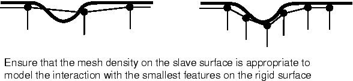With a sufficiently refined mesh on the deformable surface, Abaqus/Standard will prevent the rigid surface from penetrating the slave surface.The contact algorithm in Abaqus/Standard requires the master surface of a contact interaction to be smooth. Rigid surfaces are always the master surface and so should always be smoothed. Abaqus/Standard does not smooth discrete rigid surfaces. The level of refinement controls the smoothness of a discrete rigid surface. Analytical rigid surfaces can be smoothed by defining a fillet radius that is used to smooth any sharp corners in the rigid surface definition (see [Figure 12-12](ch12s05.html#gss-smoothingsurf).)Figure 12-12 Smoothing an analytical rigid surface.The rigid surface normal must always point toward the deformable surface with which it will interact. If it does not, Abaqus/Standard will detect severe overclosures at all of the nodes on the deformable surface; the simulation will probably terminate due to convergence difficulties.The normals for an analytical rigid surface are defined as the directions obtained by the 90° counterclockwise rotation of the vectors from the beginning to the end of each line and circular segment forming the surface (see [Figure 12-13](ch12s05.html#gss-normals-analrigsurf)). Figure 12-13 Normals for an analytical rigid surface.The normals for a rigid surface created from rigid elements are defined by the faces specified when creating the surface.

## 12.6&nbsp;Abaqus/Standard 2D example: forming a channel

12.6 Abaqus/Standard 2D example: forming a channel

This simulation of the forming of a channel in a long metal sheet illustrates the use of rigid surfaces and some of the more complex techniques often required for a successful contact analysis in Abaqus/Standard.The problem consists of a strip of deformable material, called the blank, and the tools--the punch, die, and blank holder--that contact the blank. The tools are modeled as (analytical) rigid surfaces because they are much stiffer than the blank. [Figure 12-14](ch12s06.html#gss-forminganal) shows the basic arrangement of the components. Figure 12-14 Forming analysis.The blank is 1 mm thick and is squeezed between the blank holder and the die. The blank holder force is 440 kN. This force, in conjunction with the friction between the blank and blank holder and the blank and die, controls how the blank material is drawn into the die during the forming process. You have been asked to determine the forces acting on the punch during the forming process. You also must assess how well the channel is formed with these particular settings for the blank holder force and the coefficient of friction between the tools and blank.A two-dimensional, plane strain model will be used. The assumption that there is no strain in the out-of-plane direction of the model is valid if the structure is long in this direction. Only half of the channel needs to be modeled because the forming process is symmetric about a plane along the center of the channel.The model will use contact pairs rather than general contact, since general contact is not available for analytical rigid surfaces in Abaqus/Standard.The dimensions of the various components are shown in [Figure 12-15](ch12s06.html#gss-components).Figure 12-15 Dimensions, in m, of the components in the forming simulation.Use Abaqus/CAE to create the model. Abaqus provides scripts that replicate the complete analysis model for this problem. Run one of these scripts if you encounter difficulties following the instructions given below or if you wish to check your work. Scripts are available in the following locations:A Python script for this example is provided in "Forming a channel," Section A.12. Instructions on how to fetch the script and run it within Abaqus/CAE are given in Appendix A, "Example Files."A plug-in script for this example is available in the Abaqus/CAE Plug-in toolset. To run the script from Abaqus/CAE, select Plug-insAbaqusGetting Started; highlight Forming a channel; and click Run. For more information about the Getting Started plug-ins, see "Running the Getting Started with Abaqus examples," Section 82.1 of the Abaqus/CAE User's Guide.If you do not have access to Abaqus/CAE or another preprocessor, the input file required for this problem can be created manually, as discussed in "Abaqus/Standard 2D example: forming a channel," Section 12.5 of Getting Started with Abaqus: Keywords Edition.Part definitionStart Abaqus/CAE (if you are not already running it). You will have to create four parts: a deformable part representing the blank and three rigid parts representing the tools.Deformable blankCreate a two-dimensional, deformable solid part with a planar shell base feature to represent the deformable blank. Use an approximate part size of 0.25, and name the part Blank. To define the geometry, sketch a rectangle of arbitrary dimensions using the connected lines tool. Then, dimension the horizontal and vertical lengths of the rectangle, and edit the dimensions to define the part geometry precisely. The final sketch is shown in [Figure 12-16](ch12s06.html#gss-channel-blankpart).Figure 12-16 Sketch of the deformable blank (with grid spacing doubled).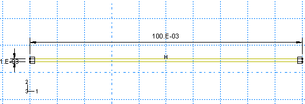Rigid toolsYou must create a separate part for each rigid tool. Each of these parts will be created using very similar techniques so it is sufficient to consider the creation of only one of them (for example, the punch) in detail. Create a two-dimensional planar, analytical rigid part with a wire base feature to represent the rigid punch. Use an approximate part size of 0.25, and name the part Punch. Using the Create Lines and Create Fillet tools, sketch the geometry of the part. Create and edit the dimensions as necessary to define the geometry precisely. The final sketch is shown in [Figure 12-17](ch12s06.html#gss-channel-punchpart).Figure 12-17 Sketch of the rigid punch (with grid spacing doubled).A rigid body reference point must be created. Exit the Sketcher when you are finished defining the part geometry to return to the Part module. From the main menu bar, select ToolsReference Point. In the viewport, select the point at the center of the arc as the rigid body reference point.Next, create two additional analytical rigid parts named Holder and Die, representing the blank holder and rigid die, respectively. Since the parts are mirror images of each other, the easiest way to define the geometry of the new parts is to rotate the sketch created for the punch. (The Copy Part tool cannot be used to mirror analytical rigid parts.) For example, edit the punch feature section sketch, and save this sketch with the name Punch. Then, create a part named Holder, and add the Punch sketch to the part definition. Mirror the sketch about the vertical edge. Finally, create a part named Die, and add the Punch sketch to the part definition. In this case mirror the sketch twice: first about the vertical edge and then about the horizontal edge. Be sure to create a reference point at the center of the arc on each part.Material and section propertiesThe blank is made from a high-strength steel (elastic modulus of 210.0 × 109 Pa,  = 0.3). Its inelastic stress-strain behavior is tabulated in [Table 12-1](ch12s06.html#gss-stressstrain-table) and shown in [Figure 12-18](ch12s06.html#gss-stressstrain). The material undergoes considerable work hardening as it deforms plastically. It is likely that plastic strains will be large in this analysis; therefore, hardening data are provided up to 50% plastic strain.Table 12-1 Yield stress-plastic strain data.Yield stress (Pa)Plastic strain400.0E60.0420.0E62.0E–2500.0E620.0E–2600.0E650.0E–2Figure 12-18 Yield stress vs. plastic strain.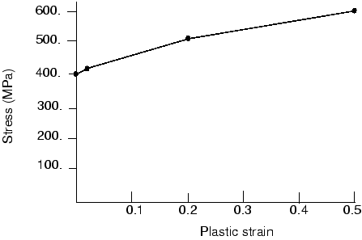Create a material named Steel with these properties. Create a homogeneous solid section named BlankSection that refers to the material Steel. Assign the section to the blank.The blank is going to undergo significant rotation as it deforms. Reporting the values of stress and strain in a coordinate system that rotates with the blank's motion will make it much easier to interpret the results. Therefore, a local material coordinate system that is aligned initially with the global coordinate system but moves with the elements as they deform should be created. To do this, create a rectangular datum coordinate system using the Create Datum CSYS: 3 Points  tool. From the main menu bar of the Property module, select AssignMaterial Orientation. Select the blank as the region to which the local material orientation will be assigned, and pick the datum coordinate system in the viewport as the CSYS (select Axis 3 and accept None for the additional rotation options).Assembling the partsYou will now create an assembly of part instances to define the analysis model. Begin by instancing the blank. Then, instance and position the rigid tools using the techniques described below.To instance and position the punch:In the Model Tree, double-click Instances underneath the Assembly container and select Punch as the part to instance.Two-dimensional plane strain models must be defined in the global 1-2 plane. Therefore, do not rotate the parts after they have been instanced. You may, however, place the origin of the model at any convenient location. The 1-direction will be normal to the symmetry plane.The bottom of the punch initially rests on top of the blank, as indicated in [Figure 12-15](ch12s06.html#gss-components). From the main menu bar, select ConstraintEdge to Edge to position the punch vertically with respect to the blank.Choose the horizontal edge of the punch as the straight edge of the movable instance and the edge on the top of the blank as the straight edge of the fixed instance.Arrows appear on both instances. The punch will be moved so that its arrow points in the same direction as the arrow on the blank.If necessary, click Flip in the prompt area to reverse the direction of the arrow on the punch so that both arrows point in the same direction; otherwise, the punch will be flipped. When both arrows point in the same direction, click OK.Enter a distance of 0.0 m to specify the separation between the instances.The punch is moved in the viewport to the specified location. Click the Auto-fit tool  so that the entire assembly is rescaled to fit in the viewport.The vertical edge of the punch is 0.05 m from the left edge of the blank, as shown in [Figure 12-15](ch12s06.html#gss-components). Define another Edge to Edge constraint to position the punch horizontally with respect to the blank.Select the vertical edge of the punch as the straight edge of the movable instance and the left edge of the blank as the straight edge of the fixed instance. Flip the arrow on the punch if necessary so that both arrows point in the same direction. Enter a distance of –0.05 m to specify the separation between the edges. (A negative distance is used since the offset is applied in the direction of the edge normal. The edge normal points away from the edge of the blank.)Now that you have positioned the punch relative to the blank, check to make sure that the left end of the punch extends beyond the left edge of the blank. This is necessary to prevent any nodes associated with the blank from "falling off" the rigid surface associated with the punch during the contact calculations. If necessary, return to the Part module and edit the part definition to satisfy this requirement.To instance and position the blank holder:The procedure for instancing and positioning the holder is very similar to that used to instance and position the punch. Referring to [Figure 12-15](ch12s06.html#gss-components), we see that the holder is initially positioned so that its horizontal edge is offset a distance of 0.0 m from the top edge of the blank and its vertical edge is offset a distance of 0.001 m from the vertical edge of the punch. Define the necessary Edge to Edge constraints to position the blank holder. Remember to flip the directions of the arrows as necessary, and make sure the right end of the holder extends beyond the right edge of the blank. If necessary, return to the Part module and edit the part definition.To instance and position the die:The procedure for instancing and positioning the die is very similar to that used to instance and position the other tools. Referring to [Figure 12-15](ch12s06.html#gss-components), we see that the die is initially positioned so that its horizontal edge is offset a distance of 0.0 m from the bottom edge of the blank and its vertical edge is offset a distance of 0.0 m from the vertical edge of the holder. Define the necessary Edge to Edge constraints to position the die. Remember to flip the directions of the arrows as necessary, and make sure the right end of the die extends beyond the right edge of the blank. If necessary, return to the Part module and edit the part definition.The final assembly is shown in [Figure 12-19](ch12s06.html#gss-channel-assy).Figure 12-19 Model assembly.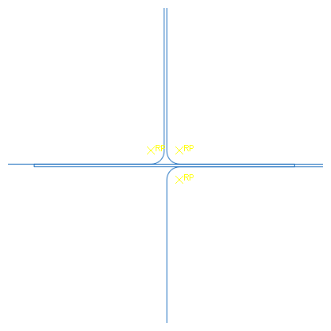Geometry setsAt this point it is convenient to create the geometry sets that will be used to specify loads and boundary conditions and to restrict data output. Four sets should be created: one at each rigid body reference point, and one at the symmetry plane of the blank.To create geometry sets:Double-click the Sets item underneath the Assembly container to create the following geometry sets:RefPunch at the punch rigid body reference point.RefHolder at the holder rigid body reference point.RefDie at the die rigid body reference point.Center at the left vertical edge (symmetry plane) of the blank.Defining steps and output requestsThere are two major sources of difficulty in Abaqus/Standard contact analyses: rigid body motion of the components before contact conditions constrain them and sudden changes in contact conditions, which lead to severe discontinuity iterations as Abaqus/Standard tries to establish the correct condition of all contact surfaces. Therefore, wherever possible, take precautions to avoid these situations.Removing rigid body motion is not particularly difficult. Simply ensure that there are enough constraints to prevent all rigid body motions of all the components in the model. This may mean using boundary conditions initially to get the components into contact, instead of applying loads directly. Using this approach may require more steps than originally anticipated, but the solution of the problem should proceed more smoothly.Alternatively, contact controls can be used to stabilize rigid body motion automatically. With this approach Abaqus/Standard applies viscous damping to the slave nodes of the contact pair. Care must be taken, however, to ensure that the viscous damping does not significantly alter the physics of the problem, as will be the case if the dissipated stabilization energy and contact damping stresses are sufficiently small.The channel-forming simulation will consist of two steps. Since the simulation involves material, geometric, and boundary nonlinearities, general steps must be used. In addition, the forming process is quasi-static; thus, we can ignore inertia effects throughout the simulation. Rather than use additional steps to establish firm contact, contact stabilization as described above will be used. A brief summary of each step (including the details of its purpose, definition, and associated output requests) is given below. However, the details concerning how the loads and boundary conditions are applied are discussed later.Step 1The magnitude of the blank holder force is a controlling factor in many forming processes; therefore, it needs to be introduced as a variable load in the analysis. In this step the blank holder force will be applied.Given the quasi-static nature of the problem and the fact that nonlinear response will be considered, create a static, general step named Holder force after the Initial step. Enter the following description for the step, Apply holder force; and include the effects of geometric nonlinearity. Set the initial time increment to 0.05 and the total time period to 1.0. Specify that the preselected field output be written every 20 increments for this step. In addition, request that the vertical reaction force and displacement (RF2 and U2) at the punch reference point (geometry set RefPunch) be written every increment as history data. In addition, write contact diagnostics to the message file (OutputDiagnostic Print).Step 2In the second and final step the punch will be moved down to complete the forming operation.Create a static, general step named Move punch, and insert it after the Holder force step. Enter the following description for the step: Apply punch stroke. Because of the frictional sliding, the changing contact conditions, and the inelastic material behavior, there is significant nonlinearity in this step; therefore, set the maximum number of increments to a large value (for example, 1000). Set the initial time increment to 0.05 and the total time period to 1.0. Your output requests from the previous step will be propagated to this step. In addition, request that the restart file be written every 200 increments for this step.Monitoring the value of a degree of freedomYou can request that Abaqus monitor the value of a degree of freedom at one selected point. The value of the degree of freedom is shown in the Job Monitor and is written at every increment to the status (.sta) file and at specific increments during the course of an analysis to the message (.msg) file. In addition, a plot of the degree of freedom value over time appears in a new viewport that is generated automatically when you submit the analysis. You can use this information to monitor the progress of the solution.In this model you will monitor the vertical displacement (degree of freedom 2) of the punch's reference node throughout each step. Before proceeding, make the first analysis step (Holder force) active by selecting it from the Step list located in the context bar. The monitor definition applied for this step will be propagated automatically to the subsequent step.To select a degree of freedom to monitor:From the main menu bar of the Step module, select OutputDOF Monitor.The DOF Monitor dialog box appears.Toggle on Monitor a degree of freedom throughout the analysis.Click  to select the region. In the prompt area, click Points. In the Region Selection dialog box that appears, select RefPunch; and click Continue.In the Degree of freedom text field, enter 2.Accept the default frequency (every increment) at which this information will be written to the message file.Click OK to exit the DOF Monitor dialog box.Defining contact interactionsContact must be defined between the top of the blank and the punch, the top of the blank and the blank holder, and the bottom of the blank and the die. The rigid surface must be the master surface in each of these contact interactions. Each contact interaction must refer to a contact interaction property that governs the interaction behavior.In this example we assume that the friction coefficient is zero between the blank and the punch. The friction coefficient between the blank and the other two tools is assumed to be 0.1. Therefore, two contact interaction properties must be defined: one with friction and one without.Define the following surfaces: BlankTop on the top edge of the blank; BlankBot on the bottom edge of the blank; DieSurf on the side of the die that faces the blank; HolderSurf on the side of the holder that faces the blank; and PunchSurf on the side of the punch that faces the blank.Tip: 
To facilitate your selections, you can selectively hide part instances using the Model Tree: expand the Instances container, highlight the part instances that you want to hide, and click mouse button 3. From the menu that appears, select Hide. To restore the visibility of the part instances, repeat the procedure, and select Show from the menu.Now define two contact interaction properties. (In the Model Tree, double-click the Interaction Properties container to create a contact property.) Name the first one NoFric; since frictionless contact is the default in Abaqus, accept the default property settings for the tangential behavior (select MechanicalTangential Behavior in the Edit Contact Property dialog box). The second property should be named Fric. For this property use the Penalty friction formulation with a friction coefficient of 0.1.To alleviate convergence difficulties that may arise due to the changing contact states (in particular for contact between the punch and the blank), create contact controls to invoke automatic contact stabilization. Scale down the default damping factor by a factor of 1,000 to minimize the effects of stabilization on the solution. The procedure is described next.To define contact controls:In the Model Tree, double-click the Contact Controls container to define the contact controls.The Create Contact Controls dialog box appears.Name the control stabilize. Select Abaqus/Standard contact controls, and click Continue.In the Stabilization tabbed page of the Edit Contact Controls dialog box, toggle on Automatic stabilization and set the Factor to 0.001.Click OK to exit the Edit Contact Controls dialog box.Finally, define the interactions between the surfaces and refer to the appropriate contact interaction property for each definition. (In the Model Tree, double-click the Interactions container to define a contact interaction.) In all cases define the interactions in the Initial step and use the Surface-to-surface contact (Standard) type. When defining the interactions, use the default finite-sliding formulation. The following interactions should be defined:Die-Blank between surfaces DieSurf (master) and BlankBot (slave) referring to the Fric contact interaction property. Accept the default contact controls.Holder-Blank between surfaces HolderSurf (master) and BlankTop (slave) referring to the Fric contact interaction property. Accept the default contact controls.Punch-Blank between surfaces PunchSurf (master) and BlankTop (slave) referring to the NoFric contact interaction property. Using the Interaction Manager, edit this interaction to assign the nondefault contact controls defined earlier (stabilize) in the second analysis step (Move punch).Boundary conditions and loading for Step 1In this step contact will be established between the blank holder and the blank while the punch and die are held fixed.Constrain the blank holder in degrees of freedom 1 and 6, where degree of freedom 6 is the rotation in the plane of the model; constrain the punch and die completely. All of the boundary conditions for the rigid surfaces are applied to their respective rigid body reference nodes. Apply symmetric boundary constraints on the region of the blank lying on the symmetry plane (geometry set Center).[Table 12-2](ch12s06.html#gss-channel-step1-table) summarizes the boundary conditions applied in this step.Table 12-2 Summary of boundary conditions applied in Step 1.BC NameGeometry SetBCsCenterBCCenterXSYMMRefDieBCRefDieU1 = U2 = UR3 = 0.0RefHolderBCRefHolderU1 = UR3 = 0.0RefPunchBCRefPunchU1 = U2 = UR3 = 0.0To apply the blank holder force, create a mechanical concentrated force named RefHolderForce. Recall that in this simulation the required blank holder force is 440 kN. Thus, apply the load to set RefHolder, and specify a magnitude of –440.E3 for CF2.Boundary conditions for Step 2In this step move the punch down to complete the forming operation. Using the Boundary Condition Manager, edit the RefPunchBC boundary condition to specify a value of –0.030 for U2, which represents the total displacement of the punch.Before continuing, change the name of your model to Standard.Mesh creation and job definitionYou should consider the type of element you will use before you design your mesh. When choosing an element type, you must consider several aspects of your model such as the model's geometry, the type of deformation that will be seen, the loads being applied, etc. The following points are important to consider in this simulation: The contact between surfaces. Whenever possible, first-order elements (with the exception of tetrahedral elements) should be used for contact simulations. When using tetrahedral elements, second-order tetrahedral elements should be used for contact simulations (use either the regular or modified form for the surface-to-surface discretization, and use the modified form for the node-to-surface discretization).Significant bending of the blank is expected under the applied loading. Fully integrated first-order elements exhibit shear locking when subjected to bending deformation. Therefore, either reduced-integration or incompatible mode elements should be used.Either incompatible mode or reduced-integration elements are suitable for this analysis. In this analysis you will use reduced-integration elements with enhanced hourglass control. Reduced-integration elements help decrease the analysis time, and enhanced hourglass control reduces the possibility of hourglassing in the model. Mesh the blank with CPE4R elements using enhanced hourglass control (see [Figure 12-20](ch12s06.html#gsa-contact-mesh)). Figure 12-20 Mesh for the channel forming analysis.Seed the edges of the blank by specifying the number of elements along each edge. Specify 100 elements along the horizontal edges of the blank and 4 elements along each vertical edge of the blank. The tools have been modeled with analytical rigid surfaces so they need not be meshed. However, if the tools had been modeled with discrete rigid elements, the mesh would have to be sufficiently refined to avoid contact convergence difficulties. For example, if the die were modeled with R2D2 elements, the curved corner should be modeled with at least 20 elements. This would create a sufficiently smooth surface that would capture the corner geometry accurately. Always use a sufficient number of elements to model such curves when using discrete rigid elements.Create a job named Channel. Give the job the following description: Analysis of the forming of a channel. Save your model to a model database file, and submit the job for analysis. Monitor the solution progress, correct any modeling errors that are detected, and investigate the cause of any warning messages.Once the analysis is underway, an X-Y plot of the values of the degree of freedom that you selected to monitor (the punch's vertical displacement) appears in a separate viewport. From the main menu bar, select ViewportJob Monitor: Channel to follow the progression of the punch's displacement in the 2-direction over time as the analysis runs.This analysis should take approximately 180 increments to complete. The top of the Job Monitor is shown in [Figure 12-21](ch12s06.html#gsi-channel-top-monitor). Figure 12-21 Top of the Job Monitor: channel forming analysis.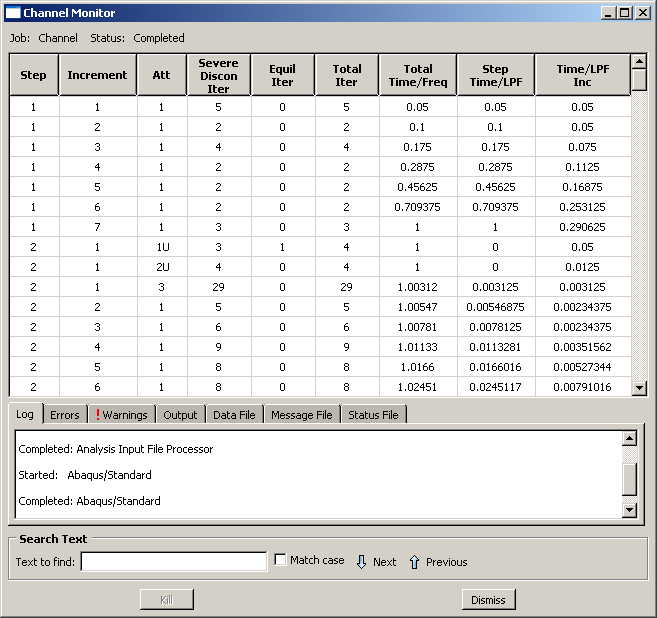The value of the punch displacement appears in the Output tabbed page. This simulation contains many severe discontinuity iterations. Abaqus/Standard has a difficult time determining the contact state in the first increment of Step 2. It needs three attempts before it finds the proper configuration of the PunchSurf and BlankTop surfaces and achieves equilibrium. After this difficult start, Abaqus/Standard quickly increases the increment size to a more reasonable value. The end of the Job Monitor is shown in [Figure 12-22](ch12s06.html#gsi-channel-bot-monitor).Figure 12-22 Bottom of the Job Monitor: channel forming analysis.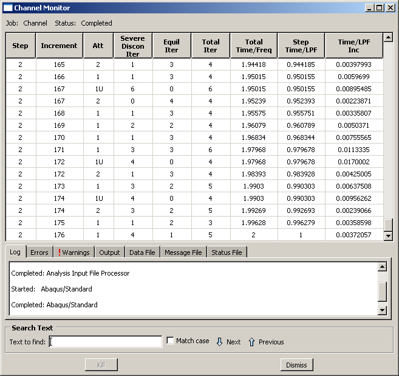Contact analyses are generally more difficult to complete than just about any other type of simulation in Abaqus/Standard. Therefore, it is important to understand all of the options available to help you with contact analyses.If a contact analysis runs into difficulty, the first thing to check is whether the contact surfaces are defined correctly. The easiest way to do this is to run a datacheck analysis and plot the surface normals in the Visualization module. You can plot all of the normals, for both surfaces and structural elements, on either the deformed or the undeformed plots. Use the Normals options in the Common Plot Options dialog box to do this, and confirm that the surface normals are in the correct directions.Abaqus/Standard may still have some problems with contact simulations, even when the contact surfaces are all defined correctly. One reason for these problems may be the default convergence tolerances and limits on the number of iterations: they are quite rigorous. In contact analyses it is sometimes better to allow Abaqus/Standard to iterate a few more times rather than abandon the increment and try again. This is why Abaqus/Standard makes the distinction between severe discontinuity iterations and equilibrium iterations during the simulation.The diagnostic contact information is essential for almost every contact analysis. This information can be vital for spotting mistakes or problems. For example, chattering can be spotted because the same slave node will be seen to be involved in all of the severe discontinuity iterations. If you see this, you will have to modify the mesh in the region around that node or add constraints to the model. Contact diagnostic information can also identify regions where only a single slave node is interacting with a surface. This is a very unstable situation and can cause convergence problems. Again, you should modify the model to increase the number of elements in such regions.Contact diagnosticsTo illustrate how to interpret the contact diagnostic information in Abaqus/CAE, consider the iterations in the seventh increment of the second step. This increment is one in which severe discontinuity iterations are required. Abaqus/Standard requires three iterations to establish the correct contact conditions in the model; i.e., whether or not the punch was contacting the blank. The fourth and fifth iterations do not produce any changes in the model's contact state but do not achieve equilibrium. One additional iteration is required to converge on static equilibrium. Thus, once Abaqus/Standard determines the correct contact state, it can easily find the equilibrium solution.To further investigate the behavior of the model in this increment, look at the visual diagnostic information available in Abaqus/CAE. The diagnostic information written to the output database file provides detailed information about the changes in the model's contact conditions. For example, the node number and location in the model of every slave node whose contact status changes in a severe discontinuity iteration, as well as the contact interaction to which it belongs, can be obtained using the visual diagnostics tool.Enter the Visualization module, and open the file Channel.odb to look at the contact diagnostics information. In the first severe discontinuity iteration of the second step (increment 7, attempt 1), four nodes on the blank experience contact openings, indicating that their assumed contact state is incompatible. This incompatibility can be seen in the Contact tabbed page of the Job Diagnostics dialog box (see [Figure 12-23](ch12s06.html#gsa-cnt-diagnostic-iter1)). To see where the nodes are located on the model, toggle on Highlight selections in viewport.Figure 12-23 Contact openings in the first severe discontinuity iteration.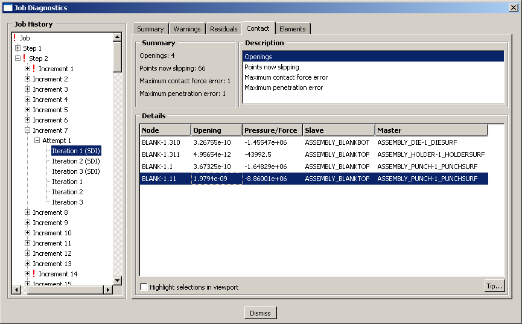Since neither the contact state nor the equilibrium checks pass in this iteration, Abaqus/Standard removes the contact constraints from these nodes and performs another iteration. After two additional iterations Abaqus/Standard detects no changes in the contact state. The solution in the fourth and fifth iterations do not satisfy the force residual tolerance check, so another iteration is performed. This time, not only is the contact state converged, but the force residual tolerance check is satisfied and the displacement correction is acceptable relative to the largest displacement increment, as shown in [Figure 12-24](ch12s06.html#gsa-cnt-diagnostic-iter4). Thus, the third equilibrium iteration produces a converged solution for this increment.Figure 12-24 Converged equilibrium iteration.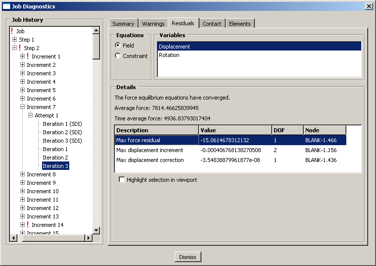In the Visualization module, examine the deformation of the blank.Deformed model shape and contour plotsThe basic result of this simulation is the deformation of the blank and the plastic strain caused by the forming process. We can plot the deformed model shape and the plastic strain, as described below.To plot the deformed model shape:Plot the deformed model shape. You can remove the die and the punch from the display and visualize just the blank.In the Results Tree, expand the Instances container underneath the output database file named Channel.odb.From the list of available part instances, select BLANK-1. Click mouse button 3, and select Replace from the menu that appears to replace the current display group with the selected elements. Click , if necessary, to fit the model in the viewport.The resulting plot is shown in [Figure 12-25](ch12s06.html#gsa-displaced-shape).Figure 12-25 Deformed shape of blank at the end of Step 2.To plot the contours of equivalent plastic strain:From the main menu bar, select PlotContoursOn Deformed Shape; or click the  tool from the toolbox to display contours of Mises stress.Open the Contour Plot Options dialog box.Drag the Contour Intervals slider to change the number of contour intervals to 7.Click OK to apply these settings.Select Primary from the list of variable types on the left side of the Field Output toolbar, and select PEEQ from the list of output variables. PEEQ is an integrated measure of plastic strain. A nonintegrated measure of plastic strain is PEMAG. PEEQ and PEMAG are equal for proportional loading.Use the  tool to zoom into any region of interest in the blank, as shown in [Figure 12-26](ch12s06.html#gsa-scalarplaststrain).Figure 12-26 Contours of the scalar plastic strain variable PEEQ in one corner of the blank.The maximum plastic strain is approximately 21%. Compare this with the failure strain of the material to determine if the material will tear during the forming process.History plots of the reaction forces on the blank and punchThe solid line in [Figure 12-27](ch12s06.html#gss-punchforce) shows the variation of the reaction force RF2 at the punch's rigid body reference node.Figure 12-27 Force on punch.To create a history plot of the reaction force:In the Results Tree, expand the History Output container. Double-click Reaction force: RF1 PI: PUNCH-1 Node xxx in NSET REFPUNCH.A history plot of the reaction force in the 1-direction appears.Open the Axis Options dialog box to label the axes.Switch to the Title tabbed page.Specify Reaction Force - RF2 as the Y-axis label, and Total Time as the X-axis label.Click Dismiss to close the dialog box.The punch force, shown in [Figure 12-27](ch12s06.html#gss-punchforce), rapidly increases to about 160 kN during Step 2, which runs from a total time of 1.0 to 2.0.History plot of the stabilization and internal energiesIt is important to verify that the presence of contact stabilization does not significantly alter the physics of the problem. One way to assess this requirement is to compare the energy dissipation due to stabilization (ALLSD) against the internal energy of the structure (ALLIE). Ideally the amount of stabilization energy should be a small fraction of the internal energy. [Figure 12-28](ch12s06.html#gss-stab-energy) shows the variation of the stabilization and internal energies. It is clear that the dissipated stabilization energy is indeed small.Figure 12-28 Stabilization and internal energies.Plotting contours on surfacesAbaqus/CAE includes a number of features designed specifically for postprocessing contact analyses. Within the Visualization module, the Display Group feature can be used to collect surfaces into display groups, similar to element and node sets.To display contact surface normal vectors:Plot the undeformed model shape.In the Results Tree, expand the Surface Sets container. Select the surfaces named BLANKTOP and PUNCH-1.PUNCHSURF. Click mouse button 3, and select Replace from the menu that appears.Using the Common Plot Options dialog box, turn on the display of the normal vectors (On surfaces) and set the length of the vector arrows to Short.Use the  tool, if necessary, to zoom into any region of interest, as shown in [Figure 12-29](ch12s06.html#gss-surfacenorm).Figure 12-29 Surface normals.To contour the contact pressure:Plot the contours of plastic strain again.From the list of variable types on the left side of the Field Output toolbar, select Primary, if it is not already selected.From the list of output variables in the center of the toolbar, select CPRESS.Remove the PUNCH-1.PUNCHSURF surface from your display group.To visualize contours of surface-based variables better in two-dimensional models, you can extrude the plane strain elements to construct the equivalent three-dimensional view. You can sweep axisymmetric elements in a similar fashion.From the main menu bar, select ViewODB Display Options.The ODB Display Options dialog box appears.Select the Sweep/Extrude tab to access the Sweep/Extrude options.In the Extrude region of the dialog box, toggle on Extrude elements; and set the Depth to 0.05 to extrude the model for the purpose of displaying contours.Click OK to apply these settings.Rotate the model using the  tool to display the model from a suitable view, such as the one shown in [Figure 12-30](ch12s06.html#gsa-conpress).Figure 12-30 Contact pressure.

## 12.7&nbsp;General contact in Abaqus/Standard

12.7 General contact in Abaqus/Standard

In the channel forming example in "Abaqus/Standard 2D example: forming a channel," Section 12.6, contact interaction is defined using the contact pairs algorithm, which requires you to explicitly define the surfaces that may potentially come into contact. As an alternative, you can specify contact in an Abaqus/Standard analysis by using the general contact algorithm. The contact interaction domain, contact properties, and surface attributes are specified independently for general contact, offering a more flexible way to add detail incrementally to a model. The simple interface for specifying general contact allows for a highly automated contact definition; however, it is also possible to define contact with the general contact interface to mimic traditional contact pairs. Conversely, specifying self-contact of a surface spanning multiple bodies with the contact pair user interface (if the surface-to-surface formulation is used) mimics the highly automated approach often used for general contact.In Abaqus/Standard, traditional pairwise specifications of contact interactions will often result in more efficient analyses as compared to an all-inclusive self-contact approach to defining contact. Therefore, there is often a trade-off between ease of defining contact and analysis performance. Abaqus/CAE provides a contact detection tool that greatly simplifies the process of creating traditional contact pairs for Abaqus/Standard (see "Understanding contact and constraint detection," Section 15.6 of the Abaqus/CAE User's Guide).

## 12.8&nbsp;Abaqus/Standard 3D example: shearing of a lap joint

12.8 Abaqus/Standard 3D example: shearing of a lap joint

This simulation of the shearing of a lap joint illustrates the use of general contact in Abaqus/Standard.The model consists of two overlapping aluminum plates that are connected with a titanium rivet. The left end of the bottom plate is fixed, and the force is applied to the right end of the top plate to shear the joint. [Figure 12-31](ch12s08.html#gsa-lap-assy) shows the basic arrangement of the components. Because of symmetry, only half of the joint is modeled to reduce computational cost. Frictional contact is assumed.Figure 12-31 Lap joint analysis.Use Abaqus/CAE to create the model. Abaqus provides scripts that replicate the complete analysis model for this problem. Run one of these scripts if you encounter difficulties following the instructions given below or if you wish to check your work. Scripts are available in the following locations:A Python script for this example is provided in "Shearing of a lap joint," Section A.13. Instructions on how to fetch the script and run it within Abaqus/CAE are given in Appendix A, "Example Files."A plug-in script for this example is available in the Abaqus/CAE Plug-in toolset. To run the script from Abaqus/CAE, select Plug-insAbaqusGetting Started, highlight Lap joint, and click Run. For more information about the Getting Started plug-ins, see "Running the Getting Started with Abaqus examples," Section 82.1 of the Abaqus/CAE User's Guide.If you do not have access to Abaqus/CAE or another preprocessor, the input file required for this problem can be created manually, as discussed in "Abaqus/Standard 3D example: shearing of a lap joint," Section 12.7 of Getting Started with Abaqus: Keywords Edition.Part definitionStart Abaqus/CAE (if you are not already running it). You will have to create two parts: one representing the plate and one representing the rivet.PlateCreate a three-dimensional, deformable solid part with an extruded base feature to represent the plate. Use an approximate part size of 100.0, and name the part plate. Begin by sketching a rectangle of arbitrary dimensions. Then, dimension it so that the horizontal length is 30 and the vertical length is 10, as shown in [Figure 12-32](ch12s08.html#gsa-lap-platepart1).Figure 12-32 Sketch of the plate.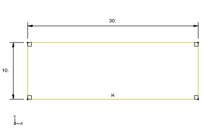 Extrude the part a distance of 1.5.Use the Create Cut: Extrude tool to cut out the circular region corresponding to the bolt hole. Select the front face of the plate as the sketch plane and the right edge of the face as the edge that will appear vertical and on the right in the sketch. Sketch the bolt hole as shown in [Figure 12-33](ch12s08.html#gsa-lap-platepart2). Figure 12-33 Sketch of the bolt hole.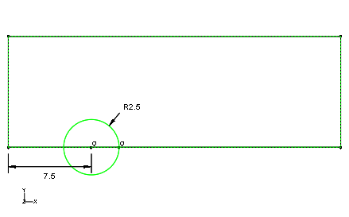 Extrude the cut through the entire part. The final shape of the plate appears as shown in [Figure 12-34](ch12s08.html#gsa-lap-platepart3).Figure 12-34 Final plate geometry.RivetCreate a three-dimensional, deformable solid part with a revolved base feature to represent the rivet. Use an approximate part size of 20.0, and name the part rivet. Using the Create Lines tool, create a rough sketch of the rivet geometry, as shown in [Figure 12-35](ch12s08.html#gsa-lap-rivetpart1). Use dimensions and equal length constraints as necessary to refine the sketch, as shown in [Figure 12-35](ch12s08.html#gsa-lap-rivetpart1). Revolve the part 180 degrees.Figure 12-35 Base sketch of the rivet.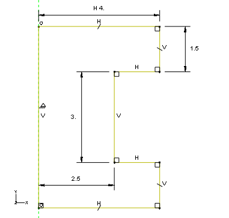Edit the base part to include a fillet at the top outer edge and a chamfer at the bottom outer edge. Use a radius of 0.75 for the fillet and a length of 0.75 for the chamfer. The final part geometry is shown in [Figure 12-36](ch12s08.html#gsa-lap-rivetpart2).Figure 12-36 Final rivet geometry.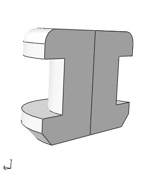Material and section propertiesThe plates are made from aluminum; the stress-strain behavior is shown in [Figure 12-37](ch12s08.html#gsa-alum). The rivet is made from titanium; the stress-strain behavior is shown in [Figure 12-38](ch12s08.html#gsa-titanium). Figure 12-37 Aluminum stress-strain curve.Figure 12-38 Titanium stress-strain curve.The stress-strain data for the aluminum and titanium materials are provided in text files named lap-joint-alum.txt and lap-joint-titanium.txt, respectively. Enter the following command at the operating system prompt to use the Abaqus fetch utility to copy these files to your local directory:abaqus fetch job=lap*.txtRather than convert the stress-strain data and define the material properties manually, you will use the material calibration capability to define the material properties.To calibrate a material:In the Model Tree, double-click Calibrations.Name the calibration aluminum, and click OK.Expand the Calibrations container and then expand the aluminum item.Double-click Data Sets.In the Create Data Set dialog box, enter Al as the name and click Import Data Set.In the Read Data From Text File dialog box, click  and choose the file named lap-joint-alum.txt. In the Properties region of this dialog box, specify that strain values will be read from field 2 and stress values from field 1.From the Data Set Form options, select True to indicate that the data you are importing are in true form.Click OK to close the Read Data From Text File dialog box.Click OK to close the Create Data Set dialog box.In the Model Tree, double-click Behaviors.Name the behavior Al-elastic-plastic, choose Elastic Plastic Isotropic as the type, and click Continue.In the Edit Behavior dialog box, choose Al as the data set for the elastic-plastic data.Enter 0.00488, 350.0 in the text field to define the yield point (alternatively, you could select the point directly in the viewport).Drag the Plastic points slider midway between Min and Max to generate plastic data points.Enter a Poisson's ratio of 0.33.At the bottom of the dialog box, click  to create an empty material named aluminum (simply click OK in the material editor after entering the name).In the Edit Behavior dialog box, choose aluminum from the Material drop-down list.Click OK to add the properties to the material named aluminum.In the Model Tree, expand the Materials container and examine the contents of the material model. You will note that both elastic and plastic properties have been defined. If you wish to change the number of plastic points or modify the yield point, simply return to the Edit Behavior dialog box, make the necessary changes, select the name of the material to which the properties will be applied, and click OK. The contents of the material model are updated automatically.Following the same procedure, create a material model named titanium. The file containing the stress-strain data is named lap-joint-titanium.txt; the yield point is 0.0081, 907.0; and Poisson's ratio is equal to 0.34.Create a homogeneous solid section named plate that refers to the material aluminum. Assign the section to the plate.Create a homogeneous solid section named rivet that refers to the material titanium. Assign the section to the rivet.Assembling the partsYou will now create an assembly of part instances to define the analysis model. The assembly consists of two dependent instances of the plate and a single dependent instance of the rivet. The first plate instance is the top plate of the assembly; the second plate instance is the bottom plate of the assembly.To instance and position the plates:In the Model Tree, double-click Instances underneath the Assembly container and select plate as the part to instance.Create a second instance of the plate. Toggle on the option to automatically offset the part instances.From the main menu bar, select ConstraintFace to Face. Select the back face of the plate on the right (the second instance) as the face on the movable instance. Select the back face of the plate on the left (the first instance) as the face on the fixed instance. If necessary, flip the arrows so that they point in opposite directions, as shown in [Figure 12-39](ch12s08.html#gsa-lap-assy1). Set the offset equal to 0.0.Figure 12-39 Face-to-face constraint.From the main menu bar, select ConstraintParallel Edge. Select the front top edge of the second plate instance as the edge on the movable instance. Select the front right edge of the first plate instance as the edge on the fixed instance. If necessary, flip the arrows so that they point in the directions shown in [Figure 12-40](ch12s08.html#gsa-lap-assy2).Figure 12-40 Parallel edge constraint.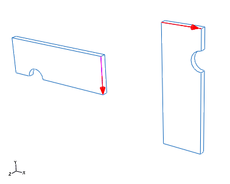From the main menu bar, select ConstraintCoaxial. Select the cylindrical face of the second plate instance as the face on the movable instance. Select the cylindrical face of the first plate instance as the face on the fixed instance. If necessary, flip the arrows so that they point in the same direction, as shown in [Figure 12-41](ch12s08.html#gsa-lap-assy3).Figure 12-41 Plate coaxial constraint.To instance and position the rivet:In the Model Tree, double-click Instances underneath the Assembly container and select rivet as the part to instance.From the main menu bar, select ConstraintCoaxial. Select the cylindrical face of the rivet body as the face on the movable instance. Select the cylindrical face of the top plate as the face on the fixed instance. Flip the arrows if necessary so that they point in the directions shown in [Figure 12-42](ch12s08.html#gsa-lap-assy4).Figure 12-42 Coaxial constraint.The final assembly is shown in [Figure 12-31](ch12s08.html#gsa-lap-assy).Geometry setsAt this point it is convenient to create the geometry sets that will be used to specify loads and boundary conditions.To create geometry sets:Double-click the Sets item underneath the Assembly container to create the following geometry sets:corner at the lower left vertex of the bottom plate ([Figure 12-43](ch12s08.html#gsa-lap-set-crn)). This set will be used to prevent rigid body motion in the 3-direction.Figure 12-43 Set corner.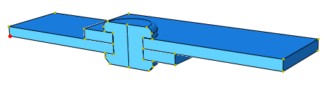fix at the left face of the bottom plate ([Figure 12-44](ch12s08.html#gsa-lap-set-fix)). This set will be used to fix the end of the plate.Figure 12-44 Set fix.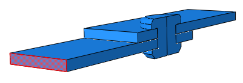pull at the right face of the top plate ([Figure 12-45](ch12s08.html#gsa-lap-set-pull)). This set will be used to pull the end of the plate.Figure 12-45 Set pull.symm to include all faces on the symmetry plane ([Figure 12-46](ch12s08.html#gsa-lap-set-symm)). This set will be used to impose symmetry conditions.Figure 12-46 Set symm.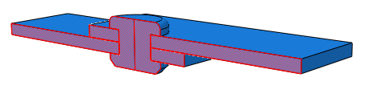Defining steps and output requestsCreate a single static, general step after the Initial step, and include the effects of geometric nonlinearity. Set the initial time increment to 0.05 and the total time to 1.0. Accept the default output requests.Defining contact interactionsContact will be used to enforce the interactions between the plates and the rivet. The friction coefficient between all parts is assumed to be 0.05.This problem could use either contact pairs or the general contact algorithm. We will use general contact in this problem to demonstrate the simplicity of the user interface.Define a contact interaction property named fric. In the Edit Contact Property dialog box, select MechanicalTangential Behavior, select Penalty as the friction formulation, and specify a friction coefficient of 0.05 in the table. Accept all other defaults.Create a General contact (Standard) interaction named All in the Initial step. In the Edit Interaction dialog box, accept the default selection of All* with self for the Contact Domain to specify self-contact for the default unnamed, all-inclusive surface defined automatically by Abaqus/Standard. This method is the simplest way to define contact in Abaqus/Standard for an entire model. Select fric as the Global property assignment, and click OK.Defining boundary conditionsThe boundary conditions are defined in the static, general step. The left end of the assembly is fixed while the right end is pulled along the length of the plates (1-direction). A single node is fixed in the vertical (3-) direction to prevent rigid body motion, while the nodes on the symmetry plane are fixed in the direction normal to the plane (2-direction). The boundary conditions are summarized in [Table 12-3](ch12s08.html#gss-lap-bcs). Define these conditions in the model.Table 12-3 Summary of boundary conditions.BC NameGeometry SetBCsFixfixU1 = 0.0PullpullU1 = 2.5SymmetrysymmU2 = 0.0RBcornerU3 = 0.0Mesh creation and job definitionThe mesh will be created at the part level rather than the assembly level, since all part instances used in this problem are dependent. The dependent instances will inherit the part mesh. Begin by expanding the container for the part named plate in the Model Tree, and double-click Mesh to switch to the Mesh module. Mesh the plate with C3D8I elements using a global seed size of 1.2 and the default sweep mesh technique. Similarly, mesh the rivet with C3D8R elements using a global seed size of 0.5 and the hex-dominated sweep mesh technique. This mesh technique will create wedge-shaped elements (C3D6) about the rivets axis of symmetry. The meshed assembly appears in [Figure 12-47](ch12s08.html#gsa-lap-mesh).Note: 
If you are using the Abaqus Student Edition, these seed sizes will result in a mesh that exceeds the model size limits of the product. For the plate specify a global seed size of 1.75, with a maximum curvature deviation factor of 0.05. For the rivet specify a global seed size of 1.Figure 12-47 Meshed assembly.You are now ready to create and run the job. Create a job named lap_joint. Save your model to a model database file, and submit the job for analysis. Monitor the solution progress, correct any modeling errors that are detected, and investigate the cause of any warning messages.In the Visualization module, examine the deformation of the assembly.Deformed model shape and contour plotsThe basic results of this simulation are the deformation of the joint and the stresses caused by the shearing process. Plot the deformed model shape and the Mises stress, as shown in [Figure 12-48](ch12s08.html#gsa-lap-def) and [Figure 12-49](ch12s08.html#gsa-lap-mises), respectively.Figure 12-48 Deformed model shape.Figure 12-49 Mises stress.Contact pressuresYou will now plot the contact pressures in the lap joint.Since it is difficult to see contact pressures when the entire model is displayed, use the Display Groups toolbar to display only the top plate in the viewport.Create a path plot to examine the variation of the contact pressure around the bolt hole of the top plate.To create a path plot:In the Results Tree, double-click Paths. In the Create Path dialog box, select Edge list as the type and click Continue.In the Edit Edge List Path dialog box, select the instance corresponding to the top plate and click Add After.In the prompt area, select by shortest distance as the selection method.In the viewport, select the edge at the left end of the bolt hole as the starting edge of the path and the node at the right end of the bolt hole as the end node of the path, as shown in [Figure 12-50](ch12s08.html#gsa-lap-path1-nls).Figure 12-50 Path definition.Click Done in the prompt area to indicate that you have finished making selections for the path. Click OK to save the path definition and to close the Edit Edge List Path dialog box.In the Results Tree, double-click XYData. Select Path in the Create XY Data dialog box, and click Continue. In the Y Values frame of the XY Data from Path dialog box, click Step/Frame. In the Step/Frame dialog box, select the last frame of the step. Click OK to close the Step/Frame dialog box. Make sure that the field output variable is set to CPRESS, and click Plot to view the path plot. Click Save As to save the plot.The path plot appears as shown in [Figure 12-51](ch12s08.html#gsa-lap-path2-nls).Figure 12-51 CPRESS distribution around the bolt hole in top plate.

## 12.9&nbsp;Defining contact in Abaqus/Explicit

12.9 Defining contact in Abaqus/Explicit

Abaqus/Explicit provides two algorithms for modeling contact interactions. The general ("automatic") contact algorithm allows very simple definitions of contact with very few restrictions on the types of surfaces involved (see "Defining general contact interactions in Abaqus/Explicit," Section 36.4.1 of the Abaqus Analysis User's Guide). The contact pair algorithm has more restrictions on the types of surfaces involved and often requires more careful definition of contact; however, it allows for some interaction behaviors that currently are not available with the general contact algorithm (see "Defining contact pairs in Abaqus/Explicit," Section 36.5.1 of the Abaqus Analysis User's Guide). General contact interactions typically are defined by specifying self-contact for a default, element-based surface defined automatically by Abaqus/Explicit that includes all bodies in the model. To refine the contact domain, you can include or exclude specific surface pairs. Contact pair interactions are defined by specifying each of the individual surface pairs that can interact with each other.The contact formulation in Abaqus/Explicit includes the constraint enforcement method, the contact surface weighting, and the sliding formulation.Constraint enforcement methodFor general contact Abaqus/Explicit enforces contact constraints using a penalty contact method, which searches for node-into-face and edge-into-edge penetrations in the current configuration. The penalty stiffness that relates the contact force to the penetration distance is chosen automatically by Abaqus/Explicit so that the effect on the time increment is minimal yet the penetration is not significant.The contact pair algorithm uses a kinematic contact formulation by default that achieves precise compliance with the contact conditions using a predictor/corrector method. The increment at first proceeds under the assumption that contact does not occur. If at the end of the increment there is an overclosure, the acceleration is modified to obtain a corrected configuration in which the contact constraints are enforced. The predictor/corrector method used for kinematic contact is discussed in more detail in "Contact constraint enforcement methods in Abaqus/Explicit," Section 38.2.3 of the Abaqus Analysis User's Guide; some limitations of this method are discussed in "Common difficulties associated with contact modeling using contact pairs in Abaqus/Explicit," Section 39.2.2 of the Abaqus Analysis User's Guide.The normal contact constraint for contact pairs can optionally be enforced with the penalty contact method, which can model some types of contact that the kinematic method cannot. For example, the penalty method allows modeling of contact between two rigid surfaces (except when both surfaces are analytical rigid surfaces). When the penalty contact formulation is used, equal and opposite contact forces with magnitudes equal to the penalty stiffness times the penetration distance are applied to the master and slave nodes at the penetration points. The penalty stiffness is chosen automatically by Abaqus/Explicit and is similar to that used by the general contact algorithm. The penalty stiffness can be overridden for surface-to-surface contact interactions by specifying a penalty scale factor or a "softened" contact relationship. Contact surface weightingIn the pure master-slave approach one of the surfaces is the master surface and the other is the slave surface. As the two bodies come into contact, the penetrations are detected and the contact constraints are applied according to the constraint enforcement method (kinematic or penalty). Pure master-slave weighting (regardless of the constraint enforcement method) will resist only penetrations of slave nodes into master facets. Penetrations of master nodes into the slave surface can go undetected, as shown in [Figure 12-52](ch12s09.html#gxi-pure-mast-slave), unless the mesh on the slave surface is adequately refined.Figure 12-52 Penetration of master nodes into slave surface with pure master-slave contact.Balanced master-slave contact simply applies the pure master-slave approach twice, reversing the surfaces on the second pass. One set of contact constraints is obtained with surface 1 as the slave, and another set of constraints is obtained with surface 2 as the slave. The acceleration corrections or forces are obtained by taking a weighted average of the two calculations. For kinematic balanced master-slave contact a second correction is made to resolve any remaining penetrations, as described in "Contact formulations for contact pairs in Abaqus/Explicit," Section 38.2.2 of the Abaqus Analysis User's Guide. The balanced master-slave contact constraint when kinematic compliance is used is illustrated in [Figure 12-53](ch12s09.html#gxi-bal-mast-slave). Figure 12-53 Balanced master-slave contact constraint with kinematic compliance.The balanced approach minimizes the penetration of the contacting bodies and, thus, provides more accurate results in most cases.The general contact algorithm uses balanced master-slave weighting whenever possible; pure master-slave weighting is used for general contact interactions involving node-based surfaces, which can act only as pure slave surfaces. For the contact pair algorithm Abaqus/Explicit will decide which type of weighting to use for a given contact pair based on the nature of the two surfaces involved and the constraint enforcement method used.Sliding formulationWhen you define a surface-to-surface contact interaction, you must decide whether the magnitude of the relative sliding will be small or finite. The default (and only option for general contact interactions) is the more general finite-sliding formulation. The small-sliding formulation is appropriate if the relative motion of the two surfaces is less than a small proportion of the characteristic length of an element face. Using the small-sliding formulation when applicable results in a more efficient analysis.

## 12.10&nbsp;Modeling considerations in Abaqus/Explicit

12.10 Modeling considerations in Abaqus/Explicit

We now discuss the following modeling considerations: correct definition of surfaces, overconstraints, mesh refinement, and initial overclosures.Certain rules must be followed when defining surfaces for use with each of the contact algorithms. The general contact algorithm has fewer restrictions on the types of surfaces that can be involved in contact; however, two-dimensional and node-based surfaces can be used only with the contact pair algorithm.Continuous surfacesSurfaces used with the general contact algorithm can span multiple unattached bodies. More than two surface facets can share a common edge. In contrast, all surfaces used with the contact pair algorithm must be continuous and simply connected. The continuity requirement has the following implications for what constitutes a valid or invalid surface definition for the contact pair algorithm:In two dimensions the surface must be either a simple, nonintersecting curve with two terminal ends or a closed loop. [Figure 12-54](ch12s10.html#gxi-val-inval-2d) shows examples of valid and invalid two-dimensional surfaces. Figure 12-54 Valid and invalid two-dimensional surfaces for the contact pair algorithm.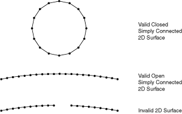In three dimensions an edge of an element face belonging to a valid surface may be either on the perimeter of the surface or shared by one other face. Two element faces forming a contact surface cannot be joined just at a shared node; they must be joined across a common element edge. An element edge cannot be shared by more than two surface facets. [Figure 12-55](ch12s10.html#gxi-val-inval-3d) illustrates valid and invalid three-dimensional surfaces.Figure 12-55 Valid and invalid three-dimensional surfaces for the contact pair algorithm.In addition, it is possible to define three-dimensional, double-sided surfaces. In this case both sides of a shell, membrane, or rigid element are included in the same surface definition, as shown in [Figure 12-56](ch12s10.html#gxi-double-side).Figure 12-56 Valid double-sided surface.Extending surfacesAbaqus/Explicit does not extend surfaces automatically beyond the perimeter of the surface defined by the user. If a node from one surface is in contact with another surface and it slides along the surface until it reaches an edge, it may "fall off the edge." Such behavior can be particularly troublesome because the node may later reenter from the back side of the surface, thereby violating the kinematic constraint and causing large jumps in acceleration at that node. Consequently, it is good modeling practice to extend surfaces somewhat beyond the regions that will actually contact. In general, we recommend covering each contacting body entirely with surfaces; the additional computational expense is minimal.[Figure 12-57](ch12s10.html#gxi-surf-perim) shows two simple box-like bodies constructed of brick elements. Figure 12-57 Surface perimeters.The upper box has a contact surface defined only on the top face of the box. While it is a permissible surface definition in Abaqus/Explicit, the lack of extensions beyond the "raw edge" could be problematic. In the lower box the surface wraps some distance around the side walls, thereby extending beyond the flat, upper surface. If contact is to occur only at the top face of the box, this extended surface definition minimizes contact problems by keeping any contacting nodes from going behind the contact surface.Mesh seamsTwo nodes with the same coordinates (double nodes) can generate a seam or crack in a valid surface that appears to be continuous, as shown in [Figure 12-58](ch12s10.html#gxi-double-node-mesh). A node sliding along the surface can fall through this crack and slide behind the contact surface. A large, nonphysical acceleration correction may be caused once penetration is detected. Surfaces defined in Abaqus/CAE will never have two nodes located at the same coordinates; however, imported meshes can have double nodes. Mesh seams can be detected in the Visualization module by drawing the free edges of the model. Any seams that are not part of the desired perimeter can be double-noded regions.Figure 12-58 Example of a double-noded mesh.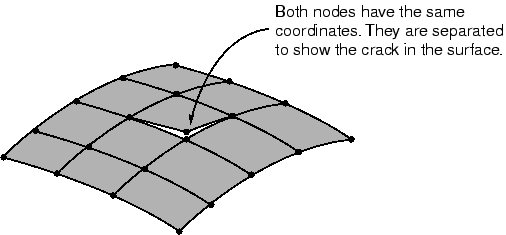Complete surface definition[Figure 12-59](ch12s10.html#gxi-incorsurfdef) illustrates a two-dimensional model of a simple connection between two parts. The contact definition shown in the figure is not adequate for modeling this connection because the surfaces do not represent a complete description of the geometry of the bodies. At the beginning of the analysis some of the nodes on surface 3 find that they are "behind" surfaces 1 and 2. [Figure 12-60](ch12s10.html#gxi-corr-surf-def) shows an adequate surface definition for this connection. The surfaces are continuous and describe the entire geometry of the contacting bodies.Figure 12-59 Example of an incorrect surface definition.Figure 12-60 Correct surface definition.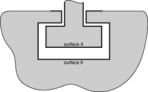Highly warped surfacesNo special treatment of warped surfaces is required for the general contact algorithm. However, when a surface used with the contact pair algorithm contains highly warped facets, a more expensive tracking approach must be used than the approach required when the surface does not contain highly warped facets. To keep the solution as efficient as possible, Abaqus monitors the warpage of the surfaces and issues a warning if surfaces become too warped; if the normal directions of adjacent facets differ by more than 20°, Abaqus issues a warning message. Once a surface is deemed to be highly warped, Abaqus switches from the more efficient contact search approach to a more accurate search approach to account for the difficulties posed by the highly warped surface.For purposes of efficiency Abaqus does not check for highly warped surfaces every increment. Rigid surfaces are checked for high warpage only at the start of the step, since rigid surfaces do not change shape during the analysis. Deformable surfaces are checked for high warpage every 20 increments by default; however, some analyses may have surfaces with rapidly increasing warpage, making the default 20 increment frequency check inadequate. The frequency of warping checks can be changed to the desired number of increments. Some analyses in which the surface warping is less than 20° may also require the more accurate contact search approach associated with highly warped surfaces. The angle that defines high warpage can be redefined.Rigid element discretizationComplex rigid surface geometries can be modeled using rigid elements. Rigid elements in Abaqus/Explicit are not smoothed; they remain faceted exactly as defined by the user. The advantage of unsmoothed surfaces is that the surface defined by the user is exactly the same as the surface used by Abaqus; the disadvantage is that faceted surfaces require much higher mesh refinement to define smooth bodies accurately. In general, using a large number of rigid elements to define a rigid surface does not increase the CPU costs significantly. However, a large number of rigid elements does increase the memory overhead significantly.The user must ensure that the discretization of any curved geometry on rigid bodies is adequate. If the rigid body discretization is too coarse, contacting nodes on the deformable body may "snag," leading to erroneous results, as illustrated in [Figure 12-61](ch12s10.html#gxi-potential-effect). Figure 12-61 Potential effect of coarse rigid body discretization.A node that is snagged on a sharp corner may be trapped from further sliding along the rigid surface for some time. Once enough energy is released to slide beyond the sharp corner, the node will snap dynamically before contacting the adjacent facet. Such motions cause noisy solutions. The more refined the rigid surface, the smoother the motion of the contacting slave nodes. The general contact algorithm includes some numerical rounding of features that prevents snagging of nodes from becoming a concern for discrete rigid surfaces. In addition, penalty enforcement of the contact constraints reduces the tendency for snagging to occur. Analytical rigid surfaces should normally be used with the contact pair algorithm for rigid bodies whose shape is an extruded profile or a surface of revolution.Just as multiple conflicting boundary conditions should not be defined at a given node, multi-point constraints and contact conditions enforced with the kinematic method generally should not be defined at the same node because they may generate conflicting kinematic constraints. Unless the constraints are entirely orthogonal to one another, the model will be overconstrained; the resulting solution will be quite noisy, as Abaqus/Explicit tries to satisfy the conflicting constraints. Penalty contact constraints and multi-point constraints acting on the same nodes will not generate conflicts because the penalty constraints are not enforced as strictly as the multi-point constraints.For contact as well as all other types of analyses, the solution improves as the mesh is refined. For contact analyses using a pure master-slave approach, it is especially important that the slave surface is refined adequately so that the master surface facets do not overly penetrate the slave surface. The balanced master-slave approach does not require high mesh refinement on the slave surface to have adequate contact compliance. Mesh refinement is generally most important with pure master-slave contact between deformable and rigid bodies; in this case the deformable body is always the pure slave surface and, thus, must be refined enough to interact with any feature on the rigid body. [Figure 12-62](ch12s10.html#gxi-inadeq-surf) shows an example of the penetration that can occur if the discretization of the slave surface is poor compared to the dimensions of the features on the master surface. If the deformable surface were more refined, the penetrations of the rigid surface would be much less severe.Figure 12-62 Example of inadequate slave surface discretization.Tie constraintsThe tie constraint prevents surfaces initially in contact from penetrating, separating, or sliding relative to one another. It is, therefore, an easy means of mesh refinement. Since any gaps that exist between the two surfaces, however small, will result in nodes that are not tied to the opposite boundary, you must adjust the nodes to ensure that the two surfaces are exactly in contact at the start of the analysis.The tie constraint formulation constrains translational and, optionally, rotational degrees of freedom. When using tied contact with structural elements, you must ensure that any unconstrained rotations will not cause problems.Abaqus/Explicit will automatically adjust the undeformed coordinates of nodes on contact surfaces to remove any initial overclosures. When using the balanced master-slave approach, both surfaces are adjusted; when using the pure master-slave approach, only the slave surface is adjusted. Displacements associated with adjusting the surface to remove overclosures do not cause any initial strain or stress for contact defined in the first step of the analysis. When conflicting constraints exist, initial overclosures may not be completely resolved by repositioning nodes. In this case severe mesh distortions can result near the beginning of an analysis when the contact pair algorithm is used. The general contact algorithm stores any unresolved initial penetrations as offsets to avoid large initial accelerations.In subsequent steps any nodal adjustments to remove initial overclosures cause strains that often cause severe mesh distortions because the entire nodal adjustments occur in a single, very brief increment. This is especially true when the kinematic constraint method is used. For example, if a node is overclosed by 1.0 × 10–3 m and the increment time is 1.0 × 10–7 s, the acceleration applied to the node to correct the overclosure is 2.0 × 1011 m/s2. Such a large acceleration applied to a single node typically will cause warnings about deformation speed exceeding the wave speed of the material and warnings about severe mesh distortions a few increments later, once the large acceleration has deformed the associated elements significantly. Even a very slight initial overclosure can induce extremely large accelerations for kinematic contact. In general, it is important that in the second step and beyond any new contact surfaces that you define are not overclosed.[Figure 12-63](ch12s10.html#gxi-orig-overclose) shows a common case of initial overclosure of two contact surfaces. All of the nodes on the contact surfaces lie exactly on the same arc of a circle; but since the mesh of the inner surface is finer than that of the outer surface and since the element edges are linear, some nodes on the finer, inner surface initially penetrate the outer surface. Figure 12-63 Original overclosure of two contact surfaces.Assuming that the pure master-slave approach is used, [Figure 12-64](ch12s10.html#gxi-corrected-surf) shows the initial, strain-free displacements applied to the slave-surface nodes by Abaqus/Explicit. In the absence of external loads this geometry is stress free. If the default, balanced master-slave approach is used, a different initial set of displacements is obtained, and the resulting mesh is not entirely stress free.Figure 12-64 Corrected contact surfaces.

## 12.11&nbsp;Abaqus/Explicit example: circuit board drop test

12.11 Abaqus/Explicit example: circuit board drop test

In this example you will investigate the behavior of a circuit board in protective crushable foam packaging dropped at an angle onto a rigid surface. Your goal is to assess whether the foam packaging is adequate to prevent circuit board damage when the board is dropped from a height of 1 meter. You will use the general contact capability in Abaqus/Explicit to model the interactions between the different components. [Figure 12-65](ch12s11.html#gxi-dimen-milmat) shows the dimensions of the circuit board and foam packaging in millimeters and the material properties.Figure 12-65 Dimensions in millimeters and material properties.Create the model for this simulation with Abaqus/CAE. Abaqus provides scripts that replicate the complete analysis model for this problem. Run one of these scripts if you encounter difficulties following the instructions given below or if you wish to check your work. Scripts are available in the following locations:A Python script for this example is provided in "Circuit board drop test," Section A.14. Instructions on how to fetch the script and run it within Abaqus/CAE are given in Appendix A, "Example Files."A plug-in script for this example is available in the Abaqus/CAE Plug-in toolset. To run the script from Abaqus/CAE, select Plug-insAbaqusGetting Started; highlight Circuit board drop test; and click Run. For more information about the Getting Started plug-ins, see "Running the Getting Started with Abaqus examples," Section 82.1 of the Abaqus/CAE User's Guide.If you do not have access to Abaqus/CAE or another preprocessor, the input file required for this problem can be created manually, as discussed in "Abaqus/Explicit example: circuit board drop test," Section 12.10 of Getting Started with Abaqus: Keywords Edition.Defining the model geometryYou will create three parts representing the packaging, the circuit board, and the floor. The chips will be represented using discrete point masses. You will also create a number of datum points to aid in positioning the part instances and the point masses.To define the packaging geometry:The packaging is a three-dimensional solid structure. Create a three-dimensional, deformable part with an extruded solid base feature to represent the packaging; name the part Packaging. Use an approximate part size of 0.1, and sketch a 0.02 m × 0.024 m rectangle as the profile. Specify 0.11 m as the extrusion depth. From the main menu bar, select ShapeCutExtrude to create the cut in the packaging in which the circuit board will rest.Select the left end of the packaging as the plane for the extruded cut. Select a vertical line on the packaging profile to be vertical and on the right in the sketching plane.In the Sketcher, use the vertical construction line tool  to create a vertical construction line through the center of the packaging. Apply a fixed constraint to the construction line.Sketch the profile of the cut shown in [Figure 12-66](ch12s11.html#gxi-package-cut). Use a Symmetry constraint to center the cut about the construction line and edit the dimensions of the cut profile so that it is 0.002 m wide and extends a distance of 0.012 m into the packaging. Figure 12-66 Profile of cut in packaging (with grid spacing doubled).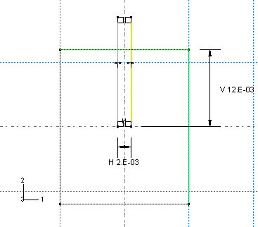In the Edit Cut Extrusion dialog box that appears upon completion of the sketch, select Through All as the end condition and select the arrow direction representing a cut into the packaging.Create a datum point centered on the bottom face of the cut, as shown in [Figure 12-67](ch12s11.html#gxi-package-datum). This point will be used to position the board relative to the packaging.Figure 12-67 Datum point at center of cut in packaging.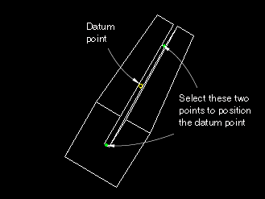From the main menu bar, select ToolsDatum.The Create Datum dialog box appears.Accept the default selection of Point as the datum type and select Midway between 2 points as the method.Select the two points centered on the bottom face at either end of the cut to be the two points between which the datum point will be created.Abaqus/CAE creates the datum point shown in [Figure 12-67](ch12s11.html#gxi-package-datum).To define the circuit board geometry:The circuit board can be modeled as a thin, flat plate with chips attached to it. Create a three-dimensional, deformable planar shell to represent the circuit board; name the part Board. Use an approximate part size of 0.5, and sketch a 0.100 m × 0.150 m rectangle for the profile.Create the three datum points shown in [Figure 12-68](ch12s11.html#gxi-board-datum). These points will be used to position the chips on the board.Figure 12-68 Datum points used to position the chips relative to the board. Numbers in parentheses are (x, y) coordinates in meters based on a local origin at the bottom left corner of the circuit board.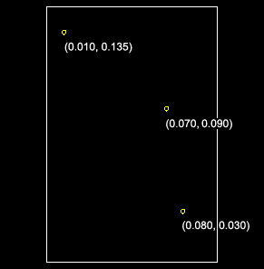From the main menu bar, select ToolsDatum.The Create Datum dialog box appears.Accept the default selection of Point as the datum type, and select Offset from point as the method.Select the bottom left corner of the board as the point from which to offset, and enter the coordinates for one of the points shown in [Figure 12-68](ch12s11.html#gxi-board-datum).Repeat Step c to create the other two datum points.To define the floor:The surface that the circuit board will impact is effectively rigid. Create a three-dimensional, discrete rigid planar shell to represent the floor; name the part Floor. Use an approximate part size of 0.5. The rigid surface should be large enough to keep any deformable bodies from falling off the edges. Sketch a 0.2 m × 0.2 m square as the profile. To simplify the positioning of parts in the assembly of the model, ensure that the center of the surface corresponds to point (0, 0) in the sketcher. This also corresponds to the origin of the global coordinate system.Assign a reference point at the center of the part.Defining the material and section propertiesThe circuit board is assumed to be made of a PCB elastic material with a Young's modulus of 45 × 109 Pa and a Poisson's ratio of 0.3. The mass density of the board is 500 kg/m3. Define a material named PCB with these properties.The foam packaging material will be modeled using the crushable foam plasticity model. The elastic properties of the packaging include a Young's modulus of 3 × 106 Pa and a Poisson's ratio of 0.0. The material density of the packaging is 100 kg/m3. Define a material named Foam with these properties; do not close the material editor.The yield surface of a crushable foam in the p-q (pressure stress-Mises equivalent stress) plane is illustrated in [Figure 12-69](ch12s11.html#gsx-crushfoam-mod). Figure 12-69 Crushable foam model: yield surface in the p-q plane. The initial yield behavior is governed by the ratio of initial yield stress in uniaxial compression to initial yield stress in hydrostatic compression, , and the ratio of yield stress in hydrostatic tension to initial yield stress in hydrostatic compression, 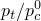. In this problem we have chosen the first data item to be 1.1 and the second data item (which is given as a positive value) to be 0.1.Hardening effects are also included in the material model definition. [Table 12-4](ch12s11.html#gxi-crushfoam-data) summarizes the yield stress-plastic strain data. Table 12-4 Yield stress-plastic strain data for the crushable foam model.Yield stress in uniaxial compression (Pa)Plastic strain0.22000E60.00.24651E60.10.27294E60.20.29902E60.30.32455E60.40.34935E60.50.37326E60.60.39617E60.70.41801E60.80.43872E60.90.45827E61.00.49384E61.20.52484E61.40.55153E61.60.57431E61.80.59359E62.00.62936E62.50.65199E63.00.68334E65.00.68833E610.0The crushable foam hardening model follows the curve shown in [Figure 12-70](ch12s11.html#gsx-foam-hardening-v). Figure 12-70 Foam hardening material data.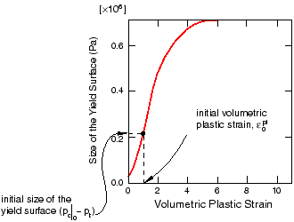For your convenience, the hardening data are available in a text file named drop-test-foam.txt. Enter the following command at the operating system prompt to use the Abaqus fetch utility to copy the file to your local directory:abaqus fetch job=drop*.txtIn the material editor, select MechanicalPlasticityCrushable Foam. Enter the yield stress ratios given above. Click Suboptions, and select Foam Hardening. Select the first cell in the suboption editor, and click mouse button 3. From the menu that appears, select Read from File. Select the file named drop-test-foam.txt to read the hardening data shown in [Table 12-4](ch12s11.html#gxi-crushfoam-data).Define a homogeneous shell section named BoardSection that refers to the material PCB. Specify a thickness of 0.002 m, and assign this section definition to the part Board. Define a homogeneous solid section named FoamSection that refers to the material Foam. Assign this section definition to the part Packaging. For the circuit board it is most meaningful to output stress results in the longitudinal and lateral directions, aligned with the edges of the board. Therefore, you need to specify a local material orientation for the circuit board mesh.To specify a material orientation for the board:Double-click Board underneath the Parts container in the Model Tree.To define a datum coordinate system for the orientation:From the main menu bar, select ToolsDatum.Select CSYS as the type and 2 lines as the method.In the Create Datum CSYS dialog box that appears, select a rectangular coordinate system and click Continue.In the viewport, select the bottom horizontal edge of the board to be the local x-axis and the right vertical edge of the board to lie in the X-Y plane.The datum coordinate system appears in yellow in the viewport.From the main menu bar of the Property module, select AssignMaterial Orientation. In the viewport select the circuit board. Select the datum coordinate system as the coordinate system. In the material orientation editor select Axis 3 as the shell surface normal and None as the additional rotation about that axis.The material orientation appears on the board in the viewport.Creating the assemblyIn the Model Tree, double-click Instances underneath the Assembly container and create a dependent instance of the floor.The circuit board will be dropped at an angle; the final model assembly is shown in [Figure 12-71](ch12s11.html#gxi-circuit-assem). Figure 12-71 Complete circuit board assembly.You will use the positioning tools in the Assembly module to position the packaging first; then you will position the board relative to the packaging. Finally, you will create a reference point at each datum point location of the board to represent the chips.To position the packaging:From the main menu bar of the Assembly module, select ToolsDatum to create additional datum points that will help you position the packaging.Select Point as the type, and select Enter coordinates as the method. Create two datum points at (0, 0, 0) and (0.5, 0.707, 0.25).Click the auto-fit tool to see both points in the viewport.In the Create Datum dialog box, select Axis as the type and 2 points as the method. Create a datum axis defined by the two datum points created in the previous step, selecting the point at (0.5, 0.707, 0.25) as the first point in the datum axis definition.Tip: 
Use the Selection toolbar to restrict your selection to Datums.Instance the packaging.Constrain the packaging so that the bottom edge aligns with the datum axis.From the main menu bar, select ConstraintEdge to Edge.Select the edge of the packaging shown in [Figure 12-72](ch12s11.html#gxi-package-edgeconst) as a straight edge of the movable instance.Tip: 
To obtain a better view of the model, select ViewSpecify from the main menu bar and select Viewpoint as the method; enter (–1, –1, 1) for the viewpoint vector and (0, 0, 1) for the up vector.Figure 12-72 Select a straight edge on the movable instance.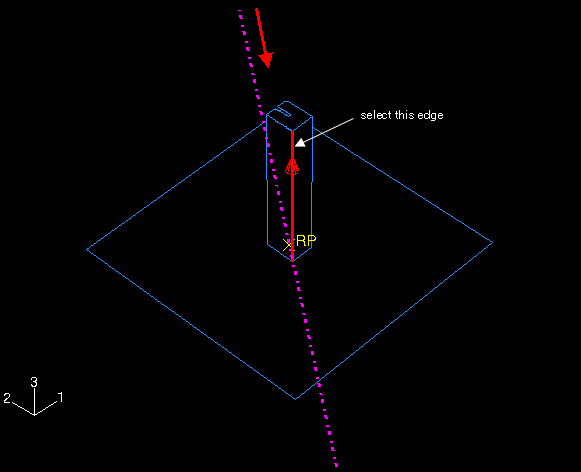Select the datum axis as the fixed instance.If necessary, click Flip in the prompt area to reverse the direction of the arrow on the packaging; click OK when the arrows point in opposite directions as shown in [Figure 12-72](ch12s11.html#gxi-package-edgeconst).Tip: 
You may need to zoom out and rotate the model to see the arrow on the datum axis. The direction of this arrow depends on how you defined the axis initially; if the arrow on your axis points in the reverse direction of the one shown in the figure, the arrow on your packaging should also be opposite to the figure.Abaqus/CAE positions the packaging as shown in [Figure 12-73](ch12s11.html#gxi-package-constrain).Figure 12-73 Position 1: Constrain the bottom edge of the packaging to lie along the datum axis.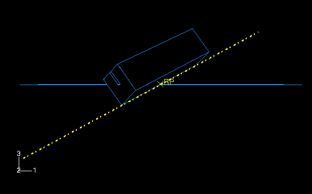Note: 
Abaqus/CAE stores position constraints as features of the assembly; if you make a mistake while positioning the assembly, you can delete the position constraints. Simply click mouse button 3 on the constraint you wish to delete in the list of Position Constraints items found underneath the Assembly container in the Model Tree, and select Delete from the menu that appears.Create a third datum point at (–0.5, 0.707, –0.5), and click the auto-fit tool again.In the Create Datum dialog box, select Plane as the type and Line and point as the method. Create a datum plane defined by the datum axis created earlier and the datum point created in the previous step.Constrain the packaging so that the bottom face lies on the datum plane.From the main menu bar, select ConstraintFace to Face.Select the face of the packaging shown in [Figure 12-74](ch12s11.html#gxi-package-faceconst) as a face of the movable instance.Figure 12-74 Select a face on the movable instance.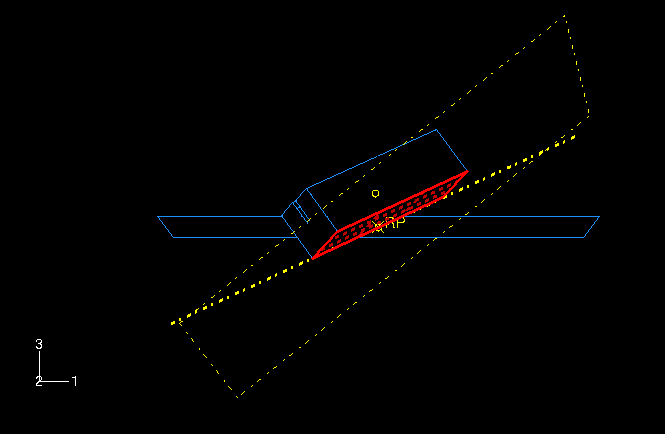Select the datum plane as the fixed instance.If necessary, click Flip in the prompt area; click OK when both arrows point in the same direction.Accept the default distance of 0.0 from the fixed plane.Finally, constrain the packaging to contact the floor at its center.From the main menu bar, select ConstraintCoincident Point. Select the lowest vertex of the packaging as a point on the movable instance, and select the reference point on the floor as a point on the fixed instance.Abaqus/CAE positions the packaging as shown in [Figure 12-75](ch12s11.html#gxi-package-assem).Figure 12-75 Final position of the packaging relative to the floor.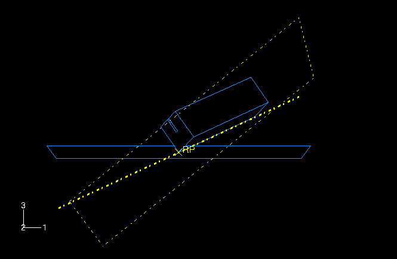Now, translate the floor slightly downward to ensure that there is no initial overclosure between the packaging and the floor.Convert the relative position constraints to absolute constraints to avoid conflicts. From the main menu bar, select InstanceConvert Constraints. Select the packaging in the viewport, and click Done in the prompt area.From the main menu bar, select InstanceTranslate.Select the floor in the viewport.Enter (0.0, 0.0, 0.0) as the start point for the translation vector and (0.0, 0.0, –0.0001) as the end point for the translation vector.Click OK to accept the new position.To position the circuit board:Instance the circuit board. In the Create Instance dialog box, toggle on Auto-offset from other instances.From the main menu bar, select ConstraintParallel Face. Select the face of the board as a face on the movable instance; select a face on the long side of the packaging as a face on the fixed instance. If necessary, click Flip in the prompt area to ensure that the arrows on both faces point in the directions shown in [Figure 12-76](ch12s11.html#gxi-board-faceconst); click OK to complete the constraint.Figure 12-76 Parallel face constraint for the circuit board.From the main menu bar, select ConstraintParallel Edge. Select the top edge of the board as an edge on the movable instance. Select an edge along the length of the packaging as an edge on the fixed instance. If necessary, click Flip in the prompt area to ensure that the arrows on both edges point in the same direction, as shown in [Figure 12-77](ch12s11.html#gxi-board-edgeconst); click OK to complete the constraint.Figure 12-77 Parallel edge constraint for the circuit board.From the main menu bar, select ConstraintCoincident Point. Select the midpoint of the bottom of the board as a point on the movable instance. Select the datum point at the center of the cut in the packaging as a point on the fixed instance.Tip: 
Use the Selection toolbar to restrict your selection to Datums.[Figure 12-78](ch12s11.html#gxi-board-assem) shows the final position of the circuit board. The circuit board and the slot in the packaging are the same thickness (2 mm) so there is a snug fit between the two bodies.Figure 12-78 Final position of the circuit board.To create the chips:Create a reference point at each of the three datum point locations on the board to represent each chip. Each of these reference points will later be assigned mass properties. To create a reference point, select ToolsReference Point from the main menu bar of the Assembly module.Once you have created the reference points, the assembly is complete.Before continuing, create the following geometry sets that you will use to specify output requests and mass properties:TopChip for the reference point of the top chipMidChip for the reference point of the middle chipBotChip for the reference point of the bottom chipBotBoard for the bottom edge of the boardDefining the step and requesting outputCreate a single dynamic, explicit step named Drop; set the time period to 0.02 s. Accept the default history and field output requests. In addition, request vertical displacement (U3), velocity (V3), and acceleration (A3) history output every 7 × 10–5 s for each of the three chips. Tip: 
Define the history output request for the first chip; using the History Output Requests Manager, copy the request and edit the domain to define the requests for the other chips.Request history output every 7 × 10–5 s for the logarithmic strain components (LE11, LE22, and LE12) and the principal logarithmic strains (LEP) at the top face (section point 5) of the set BotBoard.Defining contactEither contact algorithm in Abaqus/Explicit could be used for this problem. However, the definition of contact using the contact pair algorithm would be more cumbersome since, unlike general contact, the surfaces involved in contact pairs cannot span more than one body. We use the general contact algorithm in this example to demonstrate the simplicity of the contact definition for more complex geometries.Define a contact interaction property named Fric. In the Edit Contact Property dialog box, select MechanicalTangential Behavior, select Penalty as the friction formulation, and specify a friction coefficient of 0.3 in the table. Accept all other defaults.Create a General contact (Explicit) interaction named All in the Drop step. In the Edit Interaction dialog box, accept the default selection of All* with self for the Contact Domain to specify self-contact for the default unnamed, all-inclusive surface defined automatically by Abaqus/Explicit. This method is the simplest way to define contact in Abaqus/Explicit for an entire model. Select Fric as the Global property assignment, and click OK.Defining tie constraintsYou will use tie constraints to attach the chips to the board. Begin by defining a surface named Board for the circuit board. Select Both sides in the prompt area to specify that the surface is double-sided. In the Model Tree, double-click the Constraints container; define a tie constraint named TopChip. Select Board as the master surface and TopChip as the slave node region. Toggle off Tie rotational DOFs if applicable in the Edit Constraint dialog box since only the effects of the chip masses are of interest, and click OK. Yellow circles appear on the model to represent the constraint. Similarly, create tie constraints named MidChip and BotChip for the middle and bottom chips.Assigning mass properties to the chips:You will assign a point mass to each chip. To do this, expand Engineering Features underneath the Assembly container in the Model Tree. In the list that appears, double-click Inertias. In the Create Inertia dialog box, enter the name MassTopChip and click Continue. Select the set TopChip, and assign it a mass of 0.005 kg. Repeat this procedure for the two remaining chips.Specifying loads and boundary conditionsConstrain the reference point on the floor in all directions; for example, you could prescribe an ENCASTRE boundary condition.Two methods could be used to simulate the circuit board being dropped from a height of 1 m. You could model the circuit board and foam at a height of 1 m above the floor and allow Abaqus/Explicit to calculate the motion under the influence of gravity; however, this method is impractical because of the large number of increments required to complete the "free-fall" part of the simulation. The more efficient method is to model the circuit board and packaging in an initial position very close to the surface of the floor (as you have done in this problem) and specify an initial velocity of 4.43 m/s to simulate the 1 m drop. Create a predefined field in the initial step to specify an initial velocity of V3 = –4.43 m/s for the board, chips, and packaging.Meshing the model and defining a jobSeed the circuit board with 10 elements along its length and height. Seed the edges of the packaging as shown in [Figure 12-79](ch12s11.html#gxi-mesh-edgeseeds). Figure 12-79 Edge seeds for the packaging mesh.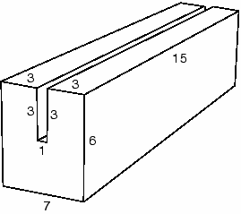The mesh for the packaging will be too coarse near the impacting corner to provide highly accurate results; however, it will be adequate for a low-cost preliminary study. Using the swept mesh technique (with the medial axis algorithm), mesh the packaging with C3D8R elements and the board with S4R elements from the Abaqus/Explicit library. Use enhanced hourglass control for the packaging mesh to control hourglassing effects. Specify a global seed of 1.0 for the floor, and mesh it with one Abaqus/Explicit R3D4 element.Note: 
The suggested mesh density exceeds the model size limits of the Abaqus Student Edition. Specify 12 elements along the length of the foam packaging if using this product.Create a job named Circuit, and give it the following description: Circuit board drop test. Double precision should be used for this analysis to minimize the noise in the solution. In the Precision tabbed page of the job editor, select Double-analysis only as the Abaqus/Explicit precision. Save your model to a model database file, and submit the job for analysis. Monitor the solution progress; correct any modeling errors that are detected, and investigate the cause of any warning messages.Enter the Visualization module, and open the output database file created by this job (Circuit.odb).Checking material directionsThe material directions obtained from the orientation definition can be checked in the Visualization module. To plot the material orientation:First, change the view to a more convenient setting. If it is not visible, display the Views toolbar by selecting ViewToolbarsViews from the main menu bar. In the Views toolbar, select the X-Z setting.From the main menu bar, select PlotMaterial OrientationsOn Deformed Shape.The orientations of the material directions for the circuit board at the end of the simulation are shown. The material directions are drawn in different colors. The material 1-direction is blue, the material 2-direction is yellow, and the 3-direction, if it is present, is red.To view the initial material orientation, select ResultStep/Frame. In the Step/Frame dialog box that appears, select Increment 0. Click Apply.Abaqus displays the initial material directions.To restore the display to the results at the end of the analysis, select the last increment available in the Step/Frame dialog box; and click OK.Animation of resultsYou will create a time-history animation of the deformation to help you visualize the motion and deformation of the circuit board and foam packaging during impact.To create a time-history animation:Plot the deformed model shape at the end of the analysis. From the main menu bar, select AnimateTime History.The animation of the deformed model shape begins.From the main menu bar, select ViewParallel to turn off perspective.In the context bar, click  to pause the animation after a full cycle has been completed.In the context bar, click  and then select a node on the foam packaging near one of the corners that impacts the floor. When you restart the animation the camera will move with the selected node. If you zoom in on the node, it will remain in view throughout the animation.Note: 
To reset the camera to follow the global coordinate system, click  in the context bar.While you view the deformation history of the drop test, take note of when the foam is in contact with the floor. You should observe that the initial impact occurs over the first 4 ms of the analysis. A second impact occurs from about 8 ms to 15 ms. The deformed state of the foam and board at approximately 4 ms after impact is shown in [Figure 12-80](ch12s11.html#gxi-def-mesh-4ms-v).Figure 12-80 Deformed mesh at 4 ms.Plotting model energy historiesPlot graphs of various energy variables versus time. Energy output can help you evaluate whether an Abaqus/Explicit simulation is predicting an appropriate response.To plot energy histories:In the Results Tree, click mouse button 3 on History Output for the output database named Circuit.odb. From the menu that appears, select Filter.In the filter field, enter *ALL* to restrict the history output to just the energy output variables.Select the ALLAE output variable, and save the data as Artificial Energy.Select the ALLIE output variable, and save the data as Internal Energy.Select the ALLKE output variable, and save the data as Kinetic Energy.Select the ALLPD output variable, and save the data as Plastic Dissipation.Select the ALLSE output variable, and save the data as Strain Energy.In the Results Tree, expand the XYData container.Select all five curves. Click mouse button 3, and select Plot from the menu that appears to view the X-Y plot. Next, you will customize the appearance of the plot; begin by changing the line styles of the curves.Open the Curve Options dialog box.In this dialog box, apply different line styles and thicknesses to each of the curves displayed in the viewport.Next, reposition the legend so that it appears inside the plot.Double-click the legend to open the Chart Legend Options dialog box.In this dialog box, switch to the Area tabbed page, and toggle on Inset.In the viewport, drag the legend over the plot.Now change the format of the X-axis labels.In the viewport, double-click the X-axis to access the X Axis options in the Axis Options dialog box.In this dialog box, switch to the Axes tabbed page, and select the Engineering label format for the X-axis.The energy histories appear as shown in [Figure 12-81](ch12s11.html#gxi-energy-vs-time-v).Figure 12-81 Energy results versus time.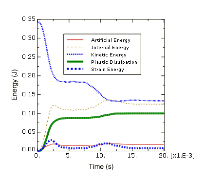First, consider the kinetic energy history. At the beginning of the simulation the components are in free fall, and the kinetic energy is large. The initial impact deforms the foam packaging, thus reducing the kinetic energy. The components then bounce and rotate about the impacted corner until the opposite side of the foam packaging impacts the floor at about 8 ms, further reducing the kinetic energy.The deformation of the foam packaging during impact causes a transfer of kinetic energy to internal energy in the foam packaging and the circuit board. From [Figure 12-81](ch12s11.html#gxi-energy-vs-time-v) we can see that the internal energy increases as the kinetic energy decreases. In fact, the internal energy is composed of elastic energy and plastically dissipated energy, both of which are also plotted in [Figure 12-81](ch12s11.html#gxi-energy-vs-time-v). Elastic energy rises to a peak and then falls as the elastic deformation recovers, but the plastically dissipated energy continues to rise as the foam is deformed permanently.Another important energy output variable is the artificial energy, which is a substantial fraction (approximately 15%) of the internal energy in this analysis. By now you should know that the quality of the solution would improve if the artificial energy could be decreased to a smaller fraction of the total internal energy.What causes high artificial strain energy in this problem?Contact at a single node--such as the corner impact in this example--can cause hourglassing, especially in a coarse mesh. Two common strategies for reducing the artificial strain energy are to refine the mesh or to round the impacting corner. For the current exercise, however, we shall continue with the original mesh, realizing that improving the mesh would lead to an improved solution.Evaluating acceleration histories at the chipsThe next result we wish to examine is the acceleration of the chips attached to the circuit board. Excessive accelerations during impact may damage the chips. Therefore, in order to assess the desirability of the foam packaging, we need to plot the acceleration histories of the three chips. Since we expect the accelerations to be greatest in the 3-direction, we will plot the variable A3.To plot acceleration histories:In the Results Tree, filter the History Output container according to *A3*, select the acceleration A3 of the nodes in sets TopChip, MidChip, and BotChip; and plot the three X-Y data objects.The X-Y plot appears in the viewport. As before, customize the plot appearance to obtain a plot similar to [Figure 12-82](ch12s11.html#gxi-acceleration-v).Figure 12-82 Acceleration of the three chips in the Z-direction.Next, we will evaluate the plausibility of the acceleration data recorded at the bottom chip. To do this, we will integrate the acceleration data to calculate the chip velocity and displacement and compare the results to the velocity and displacement data recorded directly by Abaqus/Explicit.To integrate the bottom chip acceleration history:In the Results Tree, filter the History Output container according to *BOTCHIP*, select the acceleration A3 of the node in set BotChip; and save the data as A3.In the Results Tree, double-click XYData; then select Operate on XY data in the Create XY Data dialog box. Click Continue.In the Operate on XY Data dialog box, integrate acceleration A3 to calculate velocity and subtract the initial velocity magnitude of 4.43 m/s. The expression at the top of the dialog box should appear as:integrate ( "A3" ) - 4.43Click Plot Expression to plot the calculated velocity curve.In the Results Tree, click mouse button 3 on the velocity V3 history output for the node in set BotChip; and select Add to Plot from the menu that appears.The X-Y plot appears in the viewport. As before, customize the plot appearance to obtain a plot similar to [Figure 12-83](ch12s11.html#gxi-velocity-v). The velocity curve you produced by integrating the acceleration data may be different from the one pictured here. The reason for this will be discussed later. Figure 12-83 Velocity of the bottom chip in the Z-direction.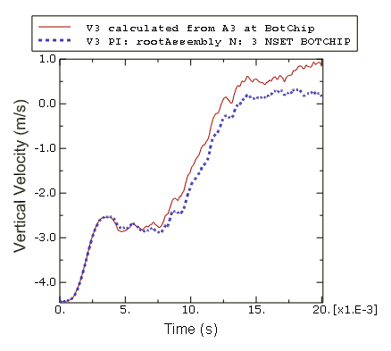In the Operate on XY Data dialog box, integrate acceleration A3 a second time to calculate chip displacement. The expression at the top of the dialog box should appear as:integrate ( integrate ( "A3" ) - 4.43 )Click Plot Expression to plot the calculated displacement curve.Notice that the Y-value type is length. In order to plot the calculated displacement with the same Y-axis as the displacement output recorded during the analysis, we must save the X-Y data and change the Y-value type to displacement.Click Save As to save the calculated displacement curve as U3-from-A3.In the XYData container of the Results Tree, click mouse button 3 on U3-from-A3; and select Edit from the menu that appears.In the Edit XY Data dialog box, choose Displacement as the Y-value type.In the Results Tree, double-click U3-from-A3 to recreate the calculated displacement plot with the displacement Y-value type.In the Results Tree, click mouse button 3 on the displacement U3 history output for the node in set BotChip; and select Add to Plot from the menu that appears.The X-Y plot appears in the viewport. As before, customize the plot appearance to obtain a plot similar to [Figure 12-84](ch12s11.html#gxi-botchip-disp-v). Again, the curve you produced by integrating the acceleration data may be different from the one pictured here. The reason for this will be discussed later. Figure 12-84 Displacement of the bottom chip in the Z-direction.Why are the velocity and displacement curves calculated by integrating the acceleration data different from the velocity and displacement recorded during the analysis? In this example the acceleration data has been corrupted by a phenomenon called aliasing. Aliasing is a form of data corruption that occurs when a signal (such as the results of an Abaqus analysis) is sampled at a series of discrete points in time, but not enough data points are saved in order to correctly describe the signal. The aliasing phenomenon can be addressed using digital signal processing (DSP) methods, a fundamental principle of which is the Nyquist Sampling Theorem (also known as the Shannon Sampling Theorem). The Sampling Theorem requires that a signal be sampled at a rate that is greater than twice the signal's highest frequency. Therefore, the maximum frequency content that can be described by a given sampling rate is half that rate (the Nyquist frequency). Sampling (storing) a signal with large-amplitude oscillations at frequencies greater than the Nyquist frequency of the sample rate may produce significantly distorted results due to aliasing. In this example the chip acceleration was sampled every 0.07 ms, which is a sampling rate of 14.3 kHz (the sample rate is the inverse of the sample size). The recorded data was aliased because the chip acceleration response has frequency content above 7.2 kHz (half the sample rate).Aliasing of a sine waveTo better understand how aliasing distorts data, consider a 1 kHz sine wave sampled using various sampling rates, as shown in [Figure 12-85](ch12s11.html#gsa-sinewave). Figure 12-85 1 kHz sine wave sampled at 1.1 kHz and 3 kHz.According to the Sampling Theorem, this signal must be sampled at a rate greater than 2 kHz to avoid alias distortions. We will evaluate what happens when the sample rate is greater than or less than this value.Consider the data recorded with a sample rate of 1.1 kHz; this rate is less than the required 2 kHz rate. The resulting curve exhibits alias distortions because it is an extremely misleading representation of the original 1 kHz sine wave.Now consider the data recorded with a sample rate of 3 kHz; this rate is greater than the required 2 kHz rate. The frequency content of the original signal is captured without aliasing. However, this sample rate is not high enough to guarantee that the peak values of the sampled signal are captured very accurately. To guarantee 95% accuracy of the recorded local peak values, the sampling rate must exceed the signal frequency by a factor of ten or more.Avoiding aliasingIn the previous two examples of aliasing (the aliased chip acceleration and the aliased sine wave), it would not have been obvious from the aliased data alone that aliasing had occurred. In addition, there is no way to uniquely reconstruct the original signal from the aliased data alone. Therefore, care should be taken to avoid aliasing your analysis results, particularly in situations when aliasing is most likely to occur.Susceptibility to aliasing depends on a number of factors, including output rate, output variable, and model characteristics. Recall that signals with large-amplitude oscillations at frequencies greater than half the sampling rate (the Nyquist frequency) may be significantly distorted due to aliasing. The two output variables that are most likely to have large-amplitude high-frequency content are accelerations and reaction forces. Therefore, these variables are the most susceptible to aliasing. Displacements, on the other hand, are lower in frequency content by nature, so they are much less susceptible to aliasing. Other result variables, such as stress and strain, fall somewhere in between these two extremes. Any model characteristic that reduces the high-frequency response of the solution will decrease the analysiss susceptibility to aliasing. For example, an elastically dominated impact problem would be even more susceptible to aliasing than this circuit board drop test which includes energy absorbing packaging.The safest way to ensure that aliasing is not a problem in your results is to request output at every increment. When you do this, the output rate is determined by the stable time increment, which is based on the highest possible frequency response of the model. However, requesting output at every increment is often not practical because it would result in very large output files. In addition, output at every increment is usually much more data than you need; there is no need to capture high-frequency solution noise when what you are really interested in is the lower-frequency structural response. An alternative method for avoiding aliasing is to request output at a lower rate and use the Abaqus/Explicit real-time filtering capabilities to remove high-frequency content from the result before writing data to the output database file. This technique uses less disk space than requesting output every increment; however, it is up to you to ensure that your output rate and filter choices are appropriate (to avoid aliasing or other distortions related to digital signal processing).Abaqus/Explicit offers filtering capabilities for both field and history data. Filtering of history data only is discussed here.In this section you will add real-time filters to the history output requests for the circuit board drop test analysis. While Abaqus/Explicit does allow you to create user-defined output filters (Butterworth, Chebyshev Type I, and Chebyshev Type II) based on criteria that you specify, in this example we will use the built-in antialiasing filter. The built-in antialiasing filter is designed to give you the best un-aliased representation of the results recorded at the output rate you specify on the output request. To do this, Abaqus/Explicit internally applies a low-pass, second-order, Butterworth filter with a cutoff frequency set to one-sixth of the sampling rate. For more information, see "Overview of filtering Abaqus history output" in the Dassault Systèmes Knowledge Base at [www.3ds.com/support/knowledge-base](http://www.3ds.com/support/knowledge-base). For more information on defining your own real-time filters, see "Filtering output and operating on output in Abaqus/Explicit" in "Output to the output database," Section 4.1.3 of the Abaqus Analysis User's Guide. Modifying the history output requestsWhen Abaqus writes nodal history output to the output database, it gives each data object a name that indicates the recorded output variable, the filter used (if any), the part instance name, the node number, and the node set. For this exercise you will be creating multiple output requests for the node in set BotChip that differ only by the output sample rate, which is not a component of the history output name. To easily distinguish between the similar output requests, create two new sets for the bottom chip reference node. Name one of the new sets BotChip-all and the other BotChip-largeInc.Next, copy the history output request for the bottom chip three times. Edit the first copy to activate the Antialiasing filter; for this request continue to record data every 7 × 10–5 s using the set BotChip. Edit the second copy to record the data at every time increment; apply this output request to the set BotChip-all. Edit the third copy to record the data at every 7 × 10–4 s; apply this output request to the set BotChip-largeInc and activate the Antialiasing filter. When you are finished, there will be four history output requests for the bottom chip (the original one and the three added here).Edit the output request for the strains in the set BotBoard in order to activate the Antialiasing filter. Although we will not be discussing the results here, you may wish to add the Antialiasing filter to the history output request for the displacement, velocity, and acceleration of the node sets MidChip and TopChip. Save your model database, and submit the job for analysis.Evaluating the filtered acceleration of the bottom chipWhen the analysis completes, test the plausibility of the acceleration history output for the bottom chip recorded every 0.07 ms using the built-in, antialiasing filter. Do this by saving and then integrating the filtered acceleration data (A3_ANTIALIASING for set BotChip) and comparing the results to recorded velocity and displacement data, just as you did earlier for the unfiltered version of these results. This time you should find that the velocity and displacement curves calculated by integrating the filtered acceleration are very similar to the velocity and displacement values written to the output database during the analysis. You may also have noticed that the velocity and displacement results are the same regardless of whether or not the built-in antialiasing filter is used. This is because the highest frequency content of the nodal velocity and displacement curves is much less than half the sampling rate. Consequently, no aliasing occurred when the data was recorded without filtering, and when the built-in antialiasing filter was applied it had no effect because there was no high frequency response to remove.Next, compare the acceleration A3 history output recorded every increment with the two acceleration A3 history curves recorded every 0.07 ms. Plot the data recorded at every increment first so that it does not obscure the other results.To plot the acceleration histories In the Results Tree, filter the History Output container according to *A3*BOTCHIP* and double-click the acceleration A3 history output for the node set BotChip-all.Select the two acceleration A3 history output objects for the node set BotChip (one filtered with the built-in antialiasing filter and the other with no filtering) using [Ctrl]+Click; click mouse button 3 and select Add to Plot from the menu that appears.The X-Y plot appears in the viewport. Zoom in to view only the first third of the results and customize the plot appearance to obtain a plot similar to [Figure 12-86](ch12s11.html#gsx-a3filter-exp-v). Figure 12-86 Comparison of acceleration output with and without filtering.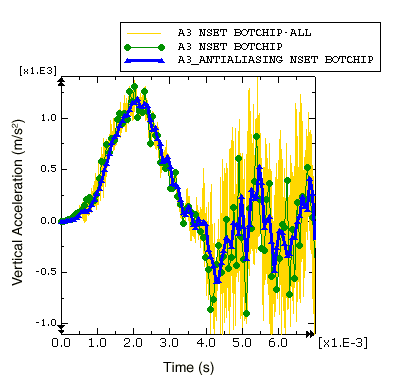First consider the acceleration history recorded every increment. This curve contains a lot of data, including high-frequency solution noise which becomes so large in magnitude that it obscures the structurally-significant lower-frequency components of the acceleration. When output is requested every increment, the output time increment is the same as the stable time increment, which (in order to ensure stability) is based on a conservative estimate of the highest possible frequency response of the model. Frequencies of structural significance are typically two to four orders of magnitude less than the highest frequency of the model. In this example the stable time increment ranges between 8.4 × 10–4 ms to 8.8 × 10–4 ms (see the status file, Circuit.sta), which corresponds to a sample rate of about 1 MHz; this sample rate has been rounded down for this discussion, even though it means that the value is not conservative. Recalling the Sampling Theorem, the highest frequency that can be described by a given sample rate is half that rate; therefore, the highest frequency of this model is about 500 kHz and typical structural frequencies could be as high as 2-3 kHz (more than 2 orders of magnitude less than the highest model frequency). While the output recorded every increment contains a lot of undesirable solution noise in the 3 to 500 kHz range, it is guaranteed to be good (not aliased) data, which can be filtered later with a postprocessing operation if necessary.Next consider the data recorded every 0.07 ms without any filtering. Recall that this is the curve we know to be corrupted by aliasing. The curve jumps from point to point by directly including whatever the raw acceleration value happens to be after each 0.07 ms interval. The variable nature of the high-frequency noise makes this aliased result very sensitive to otherwise imperceptible variations in the solution (due to differences between computer platforms, for example), hence the results you recorded every 0.07 increments may be significantly different from those shown in [Figure 12-86](ch12s11.html#gsx-a3filter-exp-v). Similarly, the velocity and displacement curves we produced by integrating the aliased acceleration ([Figure 12-83](ch12s11.html#gxi-velocity-v) and [Figure 12-84](ch12s11.html#gxi-botchip-disp-v)) data are extremely sensitive to small differences in the solution noise.When the built-in antialiasing filter is applied to the output requested every 0.07 ms, frequency content that is too high to be captured by the 14.3 kHz sample rate is filtered out before the result is written to the output database. To do this, Abaqus internally defines a low-pass, second-order, Butterworth filter. Low-pass filters attenuate the frequency content of a signal that is above a specified cutoff frequency. An ideal low-pass filter would completely eliminate all frequencies above the cutoff frequency while having no effect on the frequency content below the cutoff frequency. In reality there is a transition band of frequencies surrounding the cutoff frequency that are partially attenuated. To compensate for this, the built-in antialiasing filter has a cutoff frequency that is one-sixth of the sample rate, a value lower than the Nyquist frequency of one-half the sample rate. In most cases (including this example), this cutoff frequency is adequate to ensure that all frequency content above the Nyquist frequency has been removed before the data are written to the output database.Abaqus/Explicit does not check to ensure that the specified output time interval provides an appropriate cutoff frequency for the internal antialiasing filter; for example, Abaqus does not check that only the noise of the signal is eliminated. When the acceleration data are recorded every 0.07 ms, the internal antialiasing filter is applied with a cutoff frequency of 2.4 kHz. This cutoff frequency is nearly the same value we previously determined to be the maximum physically meaningful frequency for the model (more than two orders of magnitude less than the maximum frequency the stable time increment can capture). The 0.07 ms output interval was intentionally chosen for this example to avoid filtering frequency content that could be physically meaningful. Next, we will study the results when the antialiasing filter is applied with a sample interval that is too large.To plot the filtered acceleration historiesIn the Results Tree, double-click the acceleration A3 history output for the node set BotChip-all.Select the two filtered acceleration A3_ANTIALIASING history output objects for the bottom chip; click mouse button 3 and select Add to Plot from the menu that appears.The X-Y plot appears in the viewport. Zoom out and customize the plot appearance to obtain a plot similar to [Figure 12-87](ch12s11.html#gsx-a3filter-exp-largeinc-v). Figure 12-87 Filtered acceleration with different output sampling rates.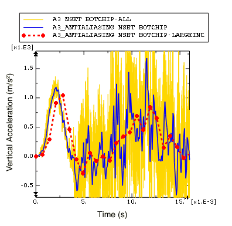[Figure 12-87](ch12s11.html#gsx-a3filter-exp-largeinc-v) clearly illustrates some of the problems that can arise when the built-in antialiasing filter is used with too large an output time increment. First, notice that many of the oscillations in the acceleration output are filtered out when the acceleration is recorded with large time increments. In this dynamic impact problem it is likely that a significant portion of the removed frequency content is physically meaningful. Previously, we estimated that the frequency of the structural response may be as large as 2-3 kHz; however, when the sample interval is 0.7 ms, filtering is performed with a low cutoff frequency of 0.24 kHz (sample interval of 0.7 ms corresponds to a sample frequency of 1.43 kHz, one-sixth of which is the 0.24 kHz cutoff frequency). Even though the results recorded every 0.7 ms may not capture all physically meaningful frequency content, it does capture the low-frequency content of the acceleration data without distortions due to aliasing. Keep in mind that filtering decreases the peak value estimations, which is desirable if only solution noise is filtered, but can be misleading when physically meaningful solution variations have been removed.Another issue to note is that there is a time delay in the acceleration results recorded every 0.7 ms. This time delay (or phase shift) affects all real-time filters. The filter must have some input in order to produce output; consequently the filtered result will include some time delay. While some time delay is introduced for all real-time filtering, the time delay becomes more pronounced as the filter cutoff frequency decreases; the filter must have input over a longer span of time in order to remove lower frequency content. Increasing the filter order (an option if you have created a user-defined filter, rather than using the second-order built-in antialiasing filter) also results in an increase in the output time delay. For more information, see "Filtering output and operating on output in Abaqus/Explicit" in "Output to the output database," Section 4.1.3 of the Abaqus Analysis User's Guide.Use the real-time filtering functionality with caution. In this example we would not have been able to identify the problems with the heavily filtered data if we did not have appropriate data for comparison. In general it is best to use a minimal amount of filtering in Abaqus/Explicit, so that the output database contains a rich, un-aliased, representation for the solution recorded at a reasonable number of time points (rather than at every increment). If additional filtering is necessary, it can be done as a postprocessing operation in Abaqus/CAE.Filtering acceleration history in Abaqus/CAEIn this section we will use the Visualization module in Abaqus/CAE to filter the acceleration history data written to the output database. Filtering as a postprocessing operation in the Visualization module has several advantages over the real-time filtering available in Abaqus/Explicit. In the Visualization module you can quickly filter X-Y data and plot the results. You can easily compare the filtered results to the unfiltered results to verify that the filter produced the desired effect. Using this technique you can quickly iterate to find appropriate filter parameters. In addition, the Visualization module filters do not suffer from the time delay that is unavoidable when filtering is applied during the analysis. Keep in mind, however, that postprocessing filters cannot compensate for poor analysis history output; if the data has been aliased or if physically meaningful frequencies have been removed, no postprocessing operation can recover the lost content.To demonstrate the differences between filtering in the Visualization module and filtering in Abaqus/Explicit, we will filter the acceleration of the bottom chip in the Visualization module and compare the results to the filtered data Abaqus/Explicit wrote to the output database.To filter acceleration history:In the Results Tree, select the acceleration A3 history output for the node set BotChip-all, and save the data as A3-all.In the Results Tree, double-click XYData; then select Operate on XY data in the Create XY Data dialog box. Click Continue.In the Operate on XY Data dialog box, filter A3-all with filter options that are equivalent to those applied by the Abaqus/Explicit built-in antialiasing filter when the output increment is 0.7 ms. Recall that the built-in antialiasing filter is a second-order Butterworth filter with a cutoff frequency that is one-sixth of the output sample rate; hence, the expression at the top of the dialog box should appear asbutterworthFilter ( xyData="A3-all", 
cutoffFrequency=1/(6*0.0007) )Click Plot Expression to plot the filtered acceleration curve.In the Results Tree, click mouse button 3 on the filtered acceleration A3_ANTIALIASING history output for node set BotChip-largeInc; and select Add to Plot from the menu that appears. If you wish, also add the filtered acceleration history for the node set BotChip.The X-Y plot appears in the viewport. As before, customize the plot appearance to obtain a plot similar to [Figure 12-88](ch12s11.html#gsx-a3filter-vis-exp-v).Figure 12-88 Comparison of acceleration filtered in Abaqus/Explicit and the Visualization module.In [Figure 12-88](ch12s11.html#gsx-a3filter-vis-exp-v) it is clear that the postprocessing filter in the Visualization module of Abaqus/CAE does not suffer from the time delay that occurs when filtering is performed while the analysis is running. This is because the Visualization module filters are bidirectional, which means that the filtering is applied first in a forward pass (which introduces some time delay) and then in a backward pass (which removes the time delay). As a consequence of the bidirectional filtering in the Visualization module, the filtering is essentially applied twice, which results in additional attenuation of the filtered signal compared to the attenuation achieved with a single-pass filter. This is why the local peaks in the acceleration curve filtered in the Visualization module are a bit lower than those in the curve filtered by Abaqus/Explicit.To develop a better understanding of the Visualization module filtering capabilities, return to the Operate on XY Data dialog box and filter the acceleration data with other filter options. For example, try different cutoff frequencies. Can you confirm that the cutoff frequency of 2.4 kHz associated with the built-in antialiasing filter with a time increment size of 0.07 was appropriate? Does increasing the cutoff frequency to 6 kHz, 7 kHz, or even 10 kHz produce significantly different results?You should find that a moderate increase in the cutoff frequency does not have a significant effect on the results, implying that we probably have not missed physically meaningful frequency content when we filtered with a cutoff frequency of 2.4 kHz.Compare the results of filtering the acceleration data with Butterworth and Chebyshev Type I filters. The Chebyshev filter requires a ripple factor parameter (rippleFactor), which indicates how much oscillation you will allow in exchange for an improved filter response; see "Filtering output and operating on output in Abaqus/Explicit" in "Output to the output database," Section 4.1.3 of the Abaqus Analysis User's Guide for more information. For the Chebyshev Type I filter a ripple factor of 0.071 will result in a very flat pass band with a ripple that is only 0.5%. You may not notice much difference between the filters when the cutoff frequency is 5 kHz, but what about when the cutoff frequency is 2 kHz? What happens when you increase the order of the Chebyshev Type I filter?Compare your results to those shown in [Figure 12-89](ch12s11.html#gsx-a3filter-vis-v).Figure 12-89 Comparison of acceleration filtered with Butterworth and Chebyshev Type I filters.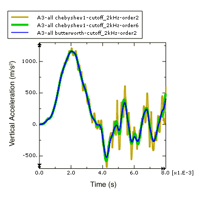Note: 
The Abaqus/CAE postprocessing filters are second-order by default. To define a higher order filter you can use the filterOrder parameter with the butterworthFilter and the chebyshev1Filter operators. For example, use the following expression in the Operate on XY Data dialog box to filter A3-all with a sixth-order Chebyshev Type I filter using a cutoff frequency of 2 kHz and a ripple factor of 0.017.chebyshev1Filter ( xyData="A3-all" , cutoffFrequency=2000,
rippleFactor= 0.017, filterOrder=6)The second-order Chebyshev Type I filter with a ripple factor of 0.071 is a relatively weak filter, so some of the frequency content above the 2 kHz cutoff frequency is not filtered out. When the filter order is increased, the filter response is improved so that the results are more like the equivalent Butterworth filter. For more information on the X-Y data filters available in Abaqus/CAE see "Operating on saved X-Y data objects," Section 47.4 of the Abaqus/CAE User's Guide.Filtering strain history in Abaqus/CAEStrain in the circuit board near the location of the chips is another result that may assist us in determining the effectiveness of the foam packaging. If the strain under the chips exceeds a limiting value, the solder securing the chips to the board will fail. We wish to identify the peak strain in any direction. Therefore, the maximum and minimum principal logarithmic strains are of interest. Principal strains are one of a number of Abaqus results that are derived from nonlinear operators; in this case a nonlinear function is used to calculate principal strains from the individual strain components. Some other common results that are derived from nonlinear operators are principal stresses, Mises stress, and equivalent plastic strains. Care must be taken when filtering results that are derived from nonlinear operators, because nonlinear operators (unlike linear ones) can modify the frequency of the original result. Filtering such a result may have undesirable consequences; for example, if you remove a portion of the frequency content that was introduced by the application of the nonlinear operator, the filtered result will be a distorted representation of the derived quantity. In general, you should either avoid filtering quantities derived from nonlinear operators or filter the underlying quantities before calculating the derived quantity using the nonlinear operator. The strain history output for this analysis was recorded every 0.07 ms using the built-in antialiasing filter. To verify that the antialiasing filter did not distort the principal strain results, we will calculate the principal logarithmic strains using the filtered strain components and compare the result to the filtered principal logarithmic strains.To calculate the principal logarithmic strains:To identify the elements in set BotBoard that are closest to the bottom chip (use the ODB display options to display the mass elements), plot the undeformed circuit board with element numbers visible.In the Results Tree, filter the History Output according to *LE*Element #*, where # is the number of one of the elements in set BotBoard that is close to the bottom chip. Select the logarithmic strain component LE11 on the SPOS surface of the element, and save the data as LE11.Similarly, save the LE12 and LE22 strain components for the same element as LE12 and LE22, respectively.In the Results Tree, double-click XYData; then select Operate on XY data in the Create XY Data dialog box. Click Continue.In the Operate on XY Data dialog box, use the saved logarithmic strain components to calculate the maximum principal logarithmic strain. The expression at the top of the dialog box should appear as:(("LE11"+"LE22")/2) + sqrt( power(("LE11"-"LE22")/2,2)
+ power("LE12"/2,2) )Click Save As to save calculated maximum principal logarithmic strain as LEP-Max.Edit the expression in the Operate on XY Data dialog box to calculate the minimum principal logarithmic strain. The modified expression should appear as:(("LE11"+"LE22")/2) - sqrt( power(("LE11"-"LE22")/2,2)
+ power("LE12"/2,2) )Click Save As to save calculated minimum principal logarithmic strain as LEP-Min.In order to plot the calculated principal logarithmic strains with the same Y-axis as the strains recorded during the analysis, change the Y-value type to strain.In the XYData container of the Results Tree, click mouse button 3 on LEP-Max; and select Edit from the menu that appears.In the Edit XY Data dialog box, choose Strain as the Y-value type.Similarly, edit LEP-Min and select Strain as the Y-value type.Using the Results Tree, plot LEP-Man and LEP-Min along with the principal strains recorded during the analysis (LEP1 and LEP2) for the same element in set BotBoard. As before, customize the plot appearance to obtain a plot similar to [Figure 12-90](ch12s11.html#gxi-prin-strain-v). The actual plot will depend on which element you selected.Figure 12-90 Principal logarithmic strain values versus time.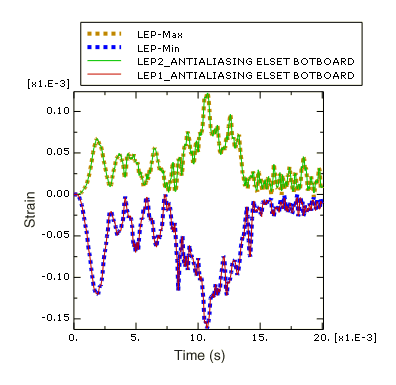In [Figure 12-90](ch12s11.html#gxi-prin-strain-v) we see that the filtered principal logarithmic strain curves recorded during the analysis are indistinguishable from the principal logarithmic strain curves calculated from the filtered strain components. Therefore the antialiasing filter (cutoff frequency 2.4 kHz) did not remove any of the frequency content introduced by the nonlinear operation to calculate principal strains form the original strain data. Next, filter the strain data with a lower cutoff frequency of 500 Hz.To filter principal logarithmic strains with a cutoff frequency of 500 Hz:In the Results Tree, double-click XYData; then select Operate on XY data in the Create XY Data dialog box. Click Continue.In the Operate on XY Data dialog box, filter the maximum principal logarithmic strain LEP-Max using a second-order Butterworth filter with a cutoff frequency of 500 Hz. The expression at the top of the dialog box should appear as:butterworthFilter(xyData="LEP-Max", cutoffFrequency=500)Click Save As to save the calculated maximum principal logarithmic strain as LEP-Max-FilterAfterCalc-bw500.Similarly, filter the logarithmic strain components LE11, LE12, and LE22 using the same second-order Butterworth filter with a cutoff frequency of 500 Hz. Save the resulting curves as LE11-bw500, LE12-bw500, and LE22-bw500, respectively. Now calculate the maximum principal logarithmic strain using the filtered logarithmic strain components. The expression at the top of the Operate on XY Data dialog box should appear as:(("LE11-bw500"+"LE22-bw500")/2) + sqrt( 
power(("LE11-bw500"-"LE22-bw500")/2,2) + 
power("LE12-bw500"/2,2) )Click Save As to save the calculated maximum principal logarithmic strain as LEP-Max-CalcAfterFilter-bw500.In the XYData container of the Results Tree, click mouse button 3 on LEP-Max-CalcAfterFilter-bw500; and select Edit from the menu that appears.In the Edit XY Data dialog box, choose Strain as the Y-value type.Plot LEP-Max-CalcAfterFilter-bw500 and LEP-Max-FilterAfterCalc-bw500 as shown in [Figure 12-91](ch12s11.html#gxi-prin-strain-filter-v). As before, the actual plot will depend on which element you selected.Figure 12-91 Principal logarithmic strain calculated before and after filtering (cutoff frequency 500 Hz).In [Figure 12-91](ch12s11.html#gxi-prin-strain-filter-v) you can see that there is a significant difference between filtering the strain data before and after the principal strain calculation. The curve that was filtered after the principal strain calculation is distorted because some of the frequency content introduced by applying the nonlinear principal-stress operator is higher than the 500 Hz filter cutoff frequency. In general, you should avoid directly filtering quantities that have been derived from nonlinear operators; whenever possible filter the underlying components and then apply the nonlinear operator to the filtered components to calculate the desired derived quantity.Strategy for recording and filtering Abaqus/Explicit history outputRecording output for every increment in Abaqus/Explicit generally produces much more data than you need. The real-time filtering capability allows you to request history output less frequently without distorting the results due to aliasing. However, you should ensure that your output rate and filtering choices have not removed physically meaningful frequency content nor distorted the results (for example, by introducing a large time delay or by removing frequency content introduced by nonlinear operators). Keep in mind that no amount of postprocessing filtering can recover frequency content filtered out during the analysis, nor can postprocessing filtering recover an original signal from aliased data. In addition, it may not be obvious when results have been over-filtered or aliased if additional data are not available for comparison. A good strategy is to choose a relatively high output rate and use the Abaqus/Explicit filters to prevent aliasing of the history output, so that valid and rich results are written to the output database. You may even wish to request output at every increment for a couple of critical locations. After the analysis completes, use the postprocessing tools in Abaqus/CAE to quickly and iteratively apply additional filtering as desired.

## 12.12&nbsp;Compatibility between Abaqus/Standard and Abaqus/Explicit

12.12 Compatibility between Abaqus/Standard and Abaqus/Explicit

There are fundamental differences in the mechanical contact algorithms in Abaqus/Standard and Abaqus/Explicit. These differences are reflected in how contact conditions are defined. The main differences are the following: For contact pairs Abaqus/Standard typically uses a pure master-slave relationship for the contact constraints by default (see "Defining contact pairs in Abaqus/Standard," Section 36.3.1 of the Abaqus Analysis User's Guide); the nodes of the slave surface are constrained not to penetrate into the master surface. The nodes of the master surface can, in principle, penetrate into the slave surface. Abaqus/Explicit includes this formulation but typically uses a balanced master-slave weighting by default (see "Contact formulations for contact pairs in Abaqus/Explicit," Section 38.2.2 of the Abaqus Analysis User's Guide).The contact formulations in Abaqus/Standard and Abaqus/Explicit differ in many respects. For example, Abaqus/Standard provides a surface-to-surface formulation, while Abaqus/Explicit provides an edge-to-edge formulation.The constraint enforcement methods in Abaqus/Standard and Abaqus/Explicit differ in some respects. For example, both Abaqus/Standard and Abaqus/Explicit provide penalty constraint methods, but the default penalty stiffnesses differ.Abaqus/Standard and Abaqus/Explicit both provide a small-sliding contact formulation (see "Contact formulations in Abaqus/Standard," Section 38.1.1 of the Abaqus Analysis User's Guide, and "Contact formulations for contact pairs in Abaqus/Explicit," Section 38.2.2 of the Abaqus Analysis User's Guide). However, the small-sliding contact formulation in Abaqus/Standard transfers the load to the master nodes according to the current position of the slave node. Abaqus/Explicit always transfers the load through the anchor point.As a result of these differences, contact definitions specified in an Abaqus/Standard analysis cannot be imported into an Abaqus/Explicit analysis and vice versa (see "Transferring results between Abaqus/Explicit and Abaqus/Standard," Section 9.2.2 of the Abaqus Analysis User's Guide).

## 12.13&nbsp;Related Abaqus examples

12.13 Related Abaqus examples

"Indentation of a crushable foam plate," Section 3.2.10 of the Abaqus Benchmarks Guide"Pressure penetration analysis of an air duct kiss seal," Section 1.1.16 of the Abaqus Example Problems Guide"Deep drawing of a cylindrical cup," Section 1.3.4 of the Abaqus Example Problems Guide

## 12.14&nbsp;Suggested reading

12.14 Suggested reading

The following references provide additional information on contact analysis with finite element methods. They allow the interested user to explore the topic in more depth.General texts on contact analysisBelytschko, T., W. K. Liu, and B. Moran, Nonlinear Finite Elements for Continua and Structures, Wiley & Sons, 2000.Crisfield, M. A., Non-linear Finite Element Analysis of Solids and Structures, Volume II: Advanced Topics, Wiley & Sons, 1997.Johnson, K. L., Contact Mechanics, Cambridge, 1985.Oden, J. T., and G. F. Carey, Finite Elements: Special Problems in Solid Mechanics, Prentice-Hall, 1984.General text on digital signal proccesingStearns, S. D., and R. A. David, Signal Processing Algorithms in MATLAB, Prentice Hall P T R, 1996.

## 12.15&nbsp;Summary

12.15 Summary

Contact analyses require a careful, logical approach. Divide the analysis into several steps if necessary, and apply the loading slowly making sure that the contact conditions are well established.In general, it is best to use a separate step for each part of the analysis in Abaqus/Standard even if it is just to change boundary conditions to loads. You will almost certainly end up with more steps than anticipated, but the model should converge much more easily. Contact analyses are much more difficult to complete if you try to apply all the loads in one step.In Abaqus/Standard achieve stable contact conditions between all components before applying the working loads to the structure. If necessary, apply temporary boundary conditions, which may be removed at a later stage. The final results should be unaffected, provided that the constraints produce no permanent deformation.Do not apply boundary conditions to nodes on contact surfaces that constrain the node in the direction of contact in Abaqus/Standard. If there is friction, do not constrain these nodes in any degree of freedom: zero pivot messages may result.Always try to use first-order elements for contact simulations in Abaqus/Standard.Both Abaqus/Standard and Abaqus/Explicit provide two distinct algorithms for modeling contact: general contact and contact pairs.General contact interactions allow you to define contact between many or all regions of a model; contact pair interactions describe contact between two surfaces or between a single surface and itself.Surfaces used with the general contact algorithm can span multiple unattached bodies. More than two surface facets can share a common edge. In contrast, all surfaces used with the contact pair algorithm must be continuous and simply connected.In Abaqus/Explicit single-sided surfaces on shell, membrane, or rigid elements must be defined so that the normal directions do not "flip" as the surface is traversed.Abaqus/Explicit does not smooth rigid surfaces; they are faceted like the underlying elements. Coarse meshing of discrete rigid surfaces can produce noisy solutions with the contact pair algorithm. The general contact algorithm does include some numerical rounding of features.Tie constraints are a useful means of mesh refinement in Abaqus.Abaqus/Explicit adjusts the nodal coordinates without strain to remove any initial overclosures prior to the first step. If the adjustments are large with respect to the element dimensions, elements can become severely distorted.In subsequent steps any nodal adjustments to remove initial overclosures in Abaqus/Explicit induce strains that can potentially cause severe mesh distortions. When you are interested in results that are likely to contain high frequency oscillations, such as accelerations in an impact problem, request Abaqus/Explicit history output with a relatively high output rate and (if the output rate is less than every increment) apply an antialiasing filter; then, use a postprocessing filter if stronger filtering is desired.The [Abaqus Analysis User's Guide](../usb/usb-link.htm#usb) contains more detailed discussions of contact modeling in Abaqus. "Contact interaction analysis: overview," Section 36.1.1 of the Abaqus Analysis User's Guide, is a good place to begin further reading on the subject.

