# 13.&nbsp;Quasi-Static Analysis with Abaqus/Explicit

13 Quasi-Static Analysis with Abaqus/Explicit

The explicit solution method is a true dynamic procedure originally developed to model high-speed impact events in which inertia plays a dominant role in the solution. Out-of-balance forces are propagated as stress waves between neighboring elements while solving for a state of dynamic equilibrium. Since the minimum stable time increment is usually quite small, most problems require a large number of increments.The explicit solution method has proven valuable in solving quasi-static problems as well--Abaqus/Explicit solves certain types of static problems more readily than Abaqus/Standard does. One advantage of the explicit procedure over the implicit procedure is the greater ease with which it resolves complicated contact problems. In addition, as models become very large, the explicit procedure requires fewer system resources than the implicit procedure. Refer to "Comparison of implicit and explicit procedures," Section 2.4, for a detailed comparison of the implicit and explicit procedures.Applying the explicit dynamic procedure to quasi-static problems requires some special considerations. Since a static solution is, by definition, a long-time solution, it is often computationally impractical to simulate an event in its natural time scale, which would require an excessive number of small time increments. To obtain an economical solution, the event must be accelerated in some way. The problem is that as the event is accelerated, the state of static equilibrium evolves into a state of dynamic equilibrium in which inertial forces become more dominant. The goal is to model the process in the shortest time period in which inertial forces remain insignificant.Quasi-static analyses can also be conducted in Abaqus/Standard. Quasi-static stress analysis in Abaqus/Standard is used to analyze linear or nonlinear problems with time-dependent material response (creep, swelling, viscoelasticity, and two-layer viscoplasticity) when inertia effects can be neglected. For more information on quasi-static analysis in Abaqus/Standard, see "Quasi-static analysis," Section 6.2.5 of the Abaqus Analysis User's Guide.

## 13.1&nbsp;Analogy for explicit dynamics

13.1 Analogy for explicit dynamics

To provide you with a more intuitive understanding of the differences between a slow, quasi-static loading case and a rapid loading case, we use the analogy illustrated in [Figure 13-1](ch13s01.html#gxi-fast-case). Figure 13-1 Analogy for slow and fast loading cases.The figure shows two cases of an elevator full of passengers. In the slow case the door opens and you walk in. To make room, the occupants adjacent to the door slowly push their neighbors, who push their neighbors, and so on. This disturbance passes through the elevator until the people next to the walls indicate that they cannot move. A series of waves pass through the elevator until everyone has reached a new equilibrium position. If you increase your speed slightly, you will shove your neighbors more forcefully than before, but in the end everyone will end up in the same position as in the slow case.In the fast case the door opens and you run into the elevator at high speed, permitting the occupants no time to rearrange themselves to accommodate you. You will injure the two people directly in front of the door, while the other occupants will be unaffected.The same thinking is true for quasi-static analyses. The speed of the analysis often can be increased substantially without severely degrading the quality of the quasi-static solution; the end result of the slow case and a somewhat accelerated case are nearly the same. However, if the analysis speed is increased to a point at which inertial effects dominate, the solution tends to localize, and the results are quite different from the quasi-static solution.

## 13.2&nbsp;Loading rates

13.2 Loading rates

The actual time taken for a physical process is called its natural time. Generally, it is safe to assume that performing an analysis in the natural time for a quasi-static process will produce accurate static results. After all, if the real-life event actually occurs in a natural time scale in which velocities are zero at the conclusion, a dynamic analysis should be able to capture the fact that the analysis has, in fact, achieved a steady state. You can increase the loading rate so that the same physical event occurs in less time as long as the solution remains nearly the same as the true static solution and dynamic effects remain insignificant.For accuracy and efficiency quasi-static analyses require the application of loading that is as smooth as possible. Sudden, jerky movements cause stress waves, which can induce noisy or inaccurate solutions. Applying the load in the smoothest possible manner requires that the acceleration changes only a small amount from one increment to the next. If the acceleration is smooth, it follows that the changes in velocity and displacement are also smooth.Abaqus has a simple, built-in smooth step amplitude curve that automatically creates a smooth loading amplitude. When you define a smooth step amplitude curve, Abaqus automatically connects each of your data pairs with curves whose first and second derivatives are smooth and whose values are zero at each of your data points. Since both of these derivatives are smooth, you can apply a displacement loading with a smooth step amplitude curve using only the initial and final data points, and the intervening motion will be smooth. Using this type of loading amplitude allows you to perform a quasi-static analysis without generating waves due to discontinuity in the rate of applied loading. An example of a smooth step amplitude curve is shown in [Figure 13-2](ch13s02.html#gxi-amplitude-def).Figure 13-2 Amplitude definition using a smooth step amplitude curve.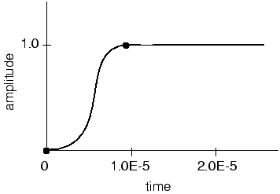In a static analysis the lowest mode of the structure usually dominates the response. Knowing the frequency and, correspondingly, the period of the lowest mode, you can estimate the time required to obtain the proper static response. To illustrate the problem of determining the proper loading rate, consider the deformation of a side intrusion beam in a car door by a rigid cylinder, as shown in [Figure 13-3](ch13s02.html#gxi-impact-beam). The actual test is quasi-static. Figure 13-3 Rigid cylinder impacting beam.The response of the beam varies greatly with the loading rate. At an extremely high impact velocity of 400 m/s, the deformation in the beam is highly localized, as shown in [Figure 13-4](ch13s02.html#gxi-impactvel-400). To obtain a better quasi-static solution, consider the lowest mode. Figure 13-4 Impact velocity of 400 m/s.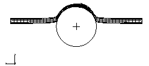The frequency of the lowest mode is approximately 250 Hz, which corresponds to a period of 4 milliseconds. The natural frequencies can be calculated easily using the eigenfrequency extraction procedure in Abaqus/Standard. To deform the beam by the desired 0.2 m in 4 milliseconds, the velocity of the cylinder is 50 m/s. While 50 m/s still seems like a high impact velocity, the inertial forces become secondary to the overall stiffness of the structure, and the deformed shape--shown in [Figure 13-5](ch13s02.html#gxi-impactvel-50)--indicates a much better quasi-static response. While the overall structural response appears to be what we expect as a quasi-static solution, it is usually desirable to increase the loading time to 10 times the period of the lowest mode to be certain that the solution is truly quasi-static. To improve the results even further, the velocity of the rigid cylinder could be ramped up gradually--for example, using a smooth step amplitude curve--thereby easing the initial impact.Figure 13-5 Impact velocity of 50 m/s.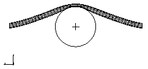Artificially increasing the speed of forming events is necessary to obtain an economical solution, but how large a speedup can we impose and still obtain an acceptable static solution? If the deformation of the sheet metal blank corresponds to the deformed shape of the lowest mode, the time period of the lowest structural mode can be used as a guideline for forming speed. However, in forming processes the rigid dies and punches can constrain the blank in such a way that its deformation may not relate to the structural modes. In such cases a general recommendation is to limit punch speeds to less than 1% of the sheet metal wave speed. For typical processes the punch speed is on the order of 1 m/s, while the wave speed of steel is approximately 5000 m/s. This recommendation, therefore, suggests a factor of 50 as an upper bound on the speedup of the punch velocity.The suggested approach to determining an acceptable punch velocity involves running a series of analyses at various punch speeds in the range of 3 to 50 m/s. Perform the analyses in the order of fastest to slowest since the solution time is inversely proportional to the punch velocity. Examine the results of the analyses, and get a feel for how the deformed shapes, stresses, and strains vary with punch speed. Some indications of excessive punch speeds are unrealistic, localized stretching and thinning as well as the suppression of wrinkling. If you begin with a punch speed of, for example, 50 m/s, and decrease it from there, at some point the solutions will become similar from one punch speed to the next--an indication that the solutions are converging on a quasi-static solution. As inertial effects become less significant, differences in simulation results also become less significant.As the loading rate is increased artificially, it becomes more and more important to apply the loads in a gradual and smooth manner. For example, the simplest way to load the punch is to impose a constant velocity throughout the forming step. Such a loading causes a sudden impact load onto the sheet metal blank at the start of the analysis, which propagates stress waves through the blank and may produce undesired results. The effect of any impact load on the results becomes more pronounced as the loading rate is increased. Ramping up the punch velocity from zero using a smooth step amplitude curve minimizes these adverse effects.SpringbackSpringback is often an important part of a forming analysis because the springback analysis determines the shape of the final, unloaded part. While Abaqus/Explicit is well-suited for forming simulations, springback poses some special difficulties. The main problem with performing springback simulations within Abaqus/Explicit is the amount of time required to obtain a steady-state solution. Typically, the loads must be removed very carefully, and damping must be introduced to make the solution time reasonable. Fortunately, the close relationship between Abaqus/Explicit and Abaqus/Standard allows a much more efficient approach.Since springback involves no contact and usually includes only mild nonlinearities, Abaqus/Standard can solve springback problems much faster than Abaqus/Explicit can. Therefore, the preferred approach to springback analyses is to import the completed forming model from Abaqus/Explicit into Abaqus/Standard.

## 13.3&nbsp;Mass scaling

13.3 Mass scaling

Mass scaling enables an analysis to be performed economically without artificially increasing the loading rate. Mass scaling is the only option for reducing the solution time in simulations involving a rate-dependent material or rate-dependent damping, such as dashpots. In such simulations increasing the loading rate is not an option because material strain rates increase by the same factor as the loading rate. When the properties of the model change with the strain rate, artificially increasing the loading rate artificially changes the process.The following equations show how the stable time increment is related to the material density. As discussed in "Definition of the stability limit," Section 9.3.2, the stability limit for the model is the minimum stable time increment of all elements. It can be expressed aswhere 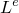 is the characteristic element length and 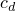 is the dilatational wave speed of the material. The dilatational wave speed for a linear elastic material with Poisson's ratio equal to zero is given by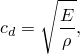where 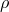 is the material density.According to the above equations, artificially increasing the material density, , by a factor of  decreases the wave speed by a factor of  and increases the stable time increment by a factor of . Remember that when the global stability limit is increased, fewer increments are required to perform the same analysis, which is the goal of mass scaling. Scaling the mass, however, has exactly the same influence on inertial effects as artificially increasing the loading rate. Therefore, excessive mass scaling, just like excessive loading rates, can lead to erroneous solutions. The suggested approach to determining an acceptable mass scaling factor, then, is similar to the approach to determining an acceptable loading rate scaling factor. The only difference to the approach is that the speedup associated with mass scaling is the square root of the mass scaling factor, whereas the speedup associated with loading rate scaling is proportional to the loading rate scaling factor. For example, a mass scaling factor of 100 corresponds exactly to a loading rate scaling factor of 10.There are several ways to implement mass scaling in your model using either fixed or variable mass scaling. The mass scaling definition can be changed from step to step, allowing great flexibility. Refer to "Mass scaling," Section 11.6.1 of the Abaqus Analysis User's Guide, for details.

## 13.4&nbsp;Energy balance

13.4 Energy balance

The most general means of evaluating whether or not a simulation is producing an appropriate quasi-static response involves studying the various model energies. The following is the energy balance equation in Abaqus/Explicit:where  is the internal energy, 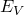 is the viscous energy dissipated, 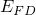 is the frictional energy dissipated, 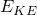 is the kinetic energy, 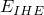 is the internal heat energy, 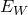 is the work done by the externally applied loads, and 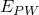, , and 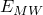 are the work done by contact penalties, by constraint penalties, and by propelling added mass, respectively.  is the external heat energy through external fluxes. The sum of these energy components is , which should be constant. In the numerical model  is only approximately constant, generally with an error of less than 1%.To illustrate energy balance with a simple example, consider the uniaxial tensile test shown in [Figure 13-6](ch13s04.html#gxi-uni-tensile-test). Figure 13-6 Uniaxial tensile test.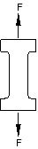The energy history for the quasi-static test would appear as shown in [Figure 13-7](ch13s04.html#gxi-hist-tensile-test). Figure 13-7 Energy history for quasi-static tensile test.If a simulation is quasi-static, the work applied by the external forces is nearly equal to the internal energy of the system. The viscously dissipated energy is generally small unless viscoelastic materials, discrete dashpots, or material damping are used. We have already established that the inertial forces are negligible in a quasi-static analysis because the velocity of the material in the model is very small. The corollary to both of these conditions is that the kinetic energy is also small. As a general rule the kinetic energy of the deforming material should not exceed a small fraction (typically 5% to 10%) of its internal energy throughout most of the process. When comparing the energies, remember that Abaqus/Explicit reports a global energy balance, which includes the kinetic energy of any rigid bodies with mass. Since only the deformable bodies are of interest when evaluating the results, the kinetic energy of the rigid bodies should be subtracted from  when evaluating the energy balance. For example, if you are simulating a transport problem with rolling rigid dies, the kinetic energy of the rigid bodies may be a significant portion of the total kinetic energy of the model. In such cases you must subtract the kinetic energy associated with rigid body motions before a meaningful comparison with internal energy can be made.

## 13.5&nbsp;Example: forming a channel in Abaqus/Explicit

13.5 Example: forming a channel in Abaqus/Explicit

In this example you will solve the channel forming problem from Chapter 12, "Contact," using Abaqus/Explicit. You will then compare the results from the Abaqus/Standard and Abaqus/Explicit analyses.You will make modifications to the model created for the Abaqus/Standard analysis so that you are able to run it in Abaqus/Explicit. These modifications include adding density to the material model, changing the element library, and changing the steps. Before running the Abaqus/Explicit analysis, you will use the frequency extraction procedure in Abaqus/Standard to determine the time period required to obtain a proper quasi-static response.Use Abaqus/CAE to modify the model for this simulation. Abaqus provides scripts that replicate the complete analysis model for this problem. Run one of these scripts if you encounter difficulties following the instructions given below or if you wish to check your work. Scripts are available in the following locations:A Python script for this example is provided in "Forming a channel," Section A.12. Instructions on how to fetch the script and run it within Abaqus/CAE are given in Appendix A, "Example Files."A plug-in script for this example is available in the Abaqus/CAE Plug-in toolset. To run the script from Abaqus/CAE, select Plug-insAbaqusGetting Started; highlight Forming a channel; and click Run. For more information about the Getting Started plug-ins, see "Running the Getting Started with Abaqus examples," Section 82.1 of the Abaqus/CAE User's Guide.Before starting, open the model database file for the channel forming example created in "Abaqus/Standard 2D example: forming a channel," Section 12.6. Determining an appropriate step time"Loading rates," Section 13.2, discusses the procedures for determining the appropriate step time for a quasi-static process. We can determine an approximate lower bound on step time duration if we know the lowest natural frequency, the fundamental frequency, of the blank. One way to obtain such information is to run a frequency analysis in Abaqus/Standard. In this forming analysis the punch deforms the blank into a shape similar to the lowest mode. Therefore, it is important that the time for the forming stage is greater than or equal to the time period for the lowest mode if you wish to model structural, as opposed to localized, deformation.To perform a natural frequency extraction:Copy the existing model to a model named Frequency. Make all of the following changes to the Frequency model. In the frequency extraction analysis you will replace all existing steps with a single frequency extraction step. In addition, you will delete all of the rigid body tools and contact interactions; they are not necessary for determining the fundamental frequency of the blank.Add a density of 7800 to the material model Steel.Delete the die, holder, and punch part instances. These rigid parts are not necessary for the frequency analysis. Tip: 
You can delete any part instance using the Model Tree by expanding Instances underneath the Assembly container, clicking mouse button 3 on the instance name, and selecting Delete from the menu that appears.Replace the existing steps with a single frequency extraction step. Delete the step Move Punch. In the Model Tree, click mouse button 3 on the step Holder force and select Replace from the menu that appears.In the Replace Step dialog box, select Frequency from the list of available Linear perturbation procedures. Enter the step description Frequency modes; select the Lanczos eigensolver option; and request five eigenvalues. Rename the step Extract Frequencies.Suppress the DOF Monitor.Note: 
Since the frequency extraction step is a linear perturbation procedure, nonlinear material properties will be ignored. In this analysis the left end of the blank is constrained in the x-direction and cannot rotate about the normal; however, it is not constrained in the y-direction. Therefore, the first mode extracted will be a rigid body mode. The frequency of the second mode will determine the appropriate time period for the quasi-static analysis in Abaqus/Explicit. Delete all contact interactions.Open the Boundary Condition Manager, and examine the boundary conditions in the Extract Frequencies step. Delete all boundary conditions except the boundary condition named CenterBC. This leaves the blank constrained with a symmetry boundary condition applied to the left end.Remesh the blank if necessary.Create a job named Forming-Frequency with the following job description: Channel forming -- frequency analysis. Submit the job for analysis, and monitor the solution progress.When the analysis is complete, enter the Visualization module and open the output database file created by this job. From the main menu bar, select PlotDeformed Shape; or use the  tool in the toolbox.The deformed model shape for the first vibration mode is plotted (it is a rigid body mode). Advance the plot to the second mode of the blank. Superimpose the undeformed model shape on the deformed model shape.The frequency analysis shows that the blank has a fundamental frequency of 140 Hz, corresponding to a period of 0.00714 s. [Figure 13-8](ch13s05.html#gxi-mode1-disp-shape) shows the displaced shape of the second mode. We now know that the shortest step time for the forming analysis is 0.00714 s.Figure 13-8 Second mode of the blank from the Abaqus/Standard frequency analysis.Creating the Abaqus/Explicit forming analysisThe goal of the forming process is to quasi-statically form a channel with a punch displacement of 0.03 m. In selecting loading rates for quasi-static analyses, it is recommended that you begin with faster loading rates and decrease the loading rates as necessary to converge on a quasi-static solution more quickly. However, if you wish to increase the likelihood of a quasi-static result in your first analysis attempt, you should consider step times that are a factor of 10 to 50 times slower than that corresponding to the fundamental frequency. In this analysis you will start with a time period of 0.007 s for the forming analysis step, which is based on the frequency analysis performed in Abaqus/Standard, which shows that the blank has a fundamental frequency of 140 Hz, corresponding to a time period of 0.00714 s. This time period corresponds to a constant punch velocity of 4.3 m/s. You will examine the kinetic and internal energy results carefully to check that the solution does not include significant dynamic effects.Copy the Standard model to a model named Explicit. Make all subsequent model changes to the Explicit model. To begin, edit the Steel material definition to include a mass density of 7800 kg/m3.A concentrated force will be applied to the blank holder. To compute the dynamic response of the holder, a point mass must be assigned to its rigid body reference point. The actual mass of the holder is not important; what is important is that the mass should be of the same order of magnitude as the mass of the blank (0.78 kg) to minimize noise in the contact calculations. Choose a point mass value of 0.1 kg. To assign the mass, expand Engineering Features underneath the Holder in the Parts container in the Model Tree. In the list that appears, double-click Inertias. In the Create Inertia dialog box that appears, enter the name PointMass and click Continue. Select the reference point of the holder, and assign it a mass of 0.1 kg.For the first attempt of this metal forming analysis, you will use tabular amplitude curves with the default smoothing parameter for both the application of the holder force and the punch stroke. Create a tabular amplitude curve for application of the holder force named Ramp1 using the data in [Table 13-1](ch13s05.html#gsa-qsi-amplitude-ramp1). Define a second tabular amplitude curve for the punch stroke named Ramp2 using the data in [Table 13-2](ch13s05.html#gsa-qsi-amplitude-ramp2).Table 13-1 Ramp amplitude data for Ramp1 and Smooth1.Time (sec)Amplitude0.00.00.00011.0Table 13-2 Ramp amplitude data for Ramp2 and Smooth2.Time (sec)Amplitude0.00.00.0071.0As with the Abaqus/Standard analysis, you will need two steps for the Abaqus/Explicit analysis. In the first step the holder force is applied; in the second step the punch stroke is applied. Delete the step named Move punch. Replace the step named Holder force with an explicit dynamics step, and specify a time period of 0.0001 s. This time period is appropriate for the application of the holder force because it is long enough to avoid dynamic effects but short enough to prevent a significant impact on the run time for the job. Enter Apply holder force as the step description. Create a second explicit dynamics step named Move punch with a time period of 0.007 s. Enter Apply punch stroke as the step description.To help determine how closely the analysis approximates the quasi-static assumption, the various energy histories will be useful. Especially useful is comparing the kinetic energy to the internal strain energy. The energy history is written to the output database file by default. Modify the history output request for the punch reference node to request output at 200 evenly spaced intervals using the built-in antialiasing filter.Open the Load Manager, and modify the concentrated force named RefHolderForce in the step named Holder force so that the amplitude definition for this load is set to Ramp1.Change the displacement boundary condition RefPunchBC in the Move punch step so that U2 is set to -0.03 m in the step. Use the amplitude curve Ramp2 for this boundary condition.Monitoring the value of a degree of freedomIn this model you will monitor the vertical displacement (degree of freedom 2) of the punch's reference node throughout the step. Because the DOF Monitor was set to monitor the vertical displacement of RefPunch in the Abaqus/Standard forming analysis, you do not need to make any changes.Mesh creation and job definitionChange the family of the elements used to mesh the blank to Explicit, and specify enhanced hourglass control.Create a job named Forming-1. Give the job the following description: Channel forming -- attempt 1.Before you run the forming analysis, you may wish to know how many increments the analysis will take and, consequently, how much computer time the analysis requires. You can use the Verify Mesh  tool to obtain an estimate of the stable time increment (the option is located in the Size Metrics tabbed page of the Verify Mesh dialog box). Knowing the stable time increment, which in this case does not change much from increment to increment, you can determine how many increments are required to complete the forming stage. Once the analysis begins, you can get an idea of how much CPU time is required per increment and, consequently, how much CPU time the analysis requires.The stable time increment for this analysis is approximately 3.5 × 10–8 s. Therefore, the forming stage requires approximately 200,000 increments for a step time of 0.007 s.Save your model to a model database file, and submit the job for analysis. Monitor the solution progress; correct any modeling errors that are detected, and investigate the cause of any warning messages.Once the analysis is underway, an X-Y plot of the values of the degree of freedom that you selected to monitor (the punch's vertical displacement) appears in a separate viewport. From the main menu bar, select ViewportJob Monitor: Forming-1 to follow the progression of the punch's displacement in the 2-direction over time as the analysis runs.Strategy for evaluating the resultsBefore looking at the results that are ultimately of interest, such as stresses and deformed shapes, we need to determine whether or not the solution is quasi-static. One good approach is to compare the kinetic energy history to the internal energy history. In a metal forming analysis most of the internal energy is due to plastic deformation. In this model the blank is the primary source of kinetic energy (the motion of the holder is negligible, and the punch and die have no mass associated with them). To determine whether an acceptable quasi-static solution has been obtained, the kinetic energy of the blank should be no greater than a few percent of its internal energy. For greater accuracy, especially when springback stresses are of interest, the kinetic energy should be lower. This approach is very useful because it applies to all types of metal forming processes and does not require any intuitive understanding of the stresses in the model; many forming processes may be too complex to permit an intuitive feel for the results.While a good primary indication of the caliber of a quasi-static analysis, the ratio of kinetic energy to internal energy alone is not adequate to confirm the quality. You should also evaluate the two energies independently to determine whether they are reasonable. This part of the evaluation takes on increased importance when accurate springback stress results are needed because an accurate springback stress solution is highly dependent on accurate plasticity results. Even if the kinetic energy is fairly small, if it contains large oscillations, the model could be experiencing significant plasticity. Generally, we expect smooth loading to produce smooth results; if the loading is smooth but the energy results are oscillatory, the results may be inadequate. Since an energy ratio is incapable of showing such behavior, you should also study the kinetic energy history itself to see whether it is smooth or noisy.If the kinetic energy does not indicate quasi-static behavior, it can be useful to look at velocity histories at some nodes to get an understanding of the model's behavior in various regions. Such velocity histories can indicate which regions of the model are oscillating and causing the high kinetic energies.Evaluating the resultsEnter the Visualization module, and open the output database created by this job (Forming-1.odb). Plot the whole model kinetic (ALLKE) and internal (ALLIE) energies.History plots of the kinetic and internal energies for the whole model appear as shown in [Figure 13-9](ch13s05.html#gsa-kinetic-energy1) and [Figure 13-10](ch13s05.html#gxi-internal-energy), respectively.Figure 13-9 Kinetic energy history for forming analysis, attempt 1.Figure 13-10 Internal energy history for forming analysis, attempt 1.The kinetic energy history shown in [Figure 13-9](ch13s05.html#gsa-kinetic-energy1) oscillates significantly. In addition, the kinetic energy history has no clear relation to the forming of the blank, which indicates the inadequacy of this analysis. In this analysis the punch velocity remains constant, while the kinetic energy--which is primarily due to the motion of the blank--is far from constant.Comparing [Figure 13-9](ch13s05.html#gsa-kinetic-energy1) and [Figure 13-10](ch13s05.html#gxi-internal-energy) shows that the kinetic energy is a small fraction (less than 1%) of the internal energy through all but the very beginning of the analysis. The criterion that kinetic energy must be small relative to internal energy has been satisfied, even for this severe loading case.Although the kinetic energy of the model is a small fraction of the internal energy, it is still quite noisy. Therefore, we should change the simulation in some way to obtain a smoother response.Even if the punch actually moves at a nearly constant velocity, the results of the first simulation attempt indicate it is desirable to use a different amplitude curve that allows the blank to accelerate more smoothly. When considering what type of loading amplitude to use, remember that smoothness is important in all aspects of a quasi-static analysis. The preferred approach is to move the punch as smoothly as possible the desired distance in the desired amount of time. We will now analyze the forming stage using a smoothly applied holder force and a smoothly applied punch displacement; we will compare the results to those obtained earlier. Refer to "Smooth amplitude curves," Section 13.2.1, for an explanation of the smooth step amplitude curve.Define a smooth step amplitude curve named Smooth1. Enter the amplitude data given in [Table 13-1](ch13s05.html#gsa-qsi-amplitude-ramp1). Create a second smooth step amplitude curve named Smooth2 using the amplitude data given in [Table 13-2](ch13s05.html#gsa-qsi-amplitude-ramp2). Modify the RefHolderForce load in the Holder force step so that it refers to the Smooth1 amplitude. Modify the displacement boundary condition RefPunchBC in the Move punch step so that it refers to the Smooth2 amplitude. By specifying an amplitude of 0.0 at the beginning of the step and an amplitude of 1.0 at the end of the step, Abaqus/Explicit creates an amplitude definition that is smooth in both its first and second derivatives. Therefore, using a smooth step amplitude curve for the displacement control also assures us that the velocity and acceleration are smooth.Create a job named Forming-2. Give the job the following description: Channel forming -- attempt 2. Save your model, and submit the job for analysis. Monitor the solution progress; correct any modeling errors that are detected, and investigate the cause of any warning messages.Evaluating the results for attempt 2The kinetic energy history is shown in [Figure 13-11](ch13s05.html#gxi-kinetic-attempt2). The response of the kinetic energy is clearly related to the forming of the blank: the value of kinetic energy peaks in the middle of the second step, corresponding to the time when the punch velocity is the greatest. Thus, the kinetic energy is appropriate and reasonable. Figure 13-11 Kinetic energy history for forming analysis, attempt 2. 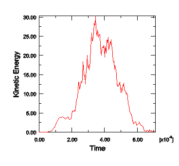The internal energy for attempt 2, shown in [Figure 13-12](ch13s05.html#gxi-internal-attempt2), shows a smooth increase from zero up to the final value. Again, the ratio of kinetic energy to internal energy is quite small and appears to be acceptable. [Figure 13-13](ch13s05.html#gsa-compare-internal) compares the internal energy in the two forming attempts.Figure 13-12 Internal energy history for forming analysis, attempt 2.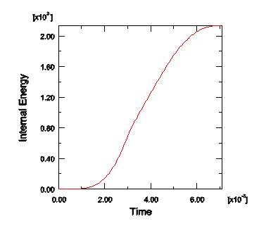Figure 13-13 Comparison of internal energies for the two attempts of the forming analysis.Our initial criteria for evaluating the acceptability of the results was that the kinetic energy should be small compared to the internal energy. What we found was that even for the most severe case, attempt 1, this condition seems to have been met adequately. The addition of a smooth step amplitude curve helped reduce the oscillations in the kinetic energy, yielding a satisfactory quasi-static response. The additional requirements--that the histories of kinetic energy and internal energy must be appropriate and reasonable--are very useful and necessary, but they also increase the subjectivity of evaluating the results. Enforcing these requirements in general for more complex forming processes may be difficult because these requirements demand some intuition regarding the behavior of the forming process.Results of the forming analysisNow that we are satisfied that the quasi-static solution for the forming analysis is adequate, we can study some of the other results of interest. [Figure 13-14](ch13s05.html#gsa-channel-compare-mises) shows a comparison of the Mises stress in the blank obtained with Abaqus/Standard and Abaqus/Explicit.Figure 13-14 Contour plot of Mises stress in Abaqus/Standard (left) and Abaqus/Explicit (right) channel forming analyses.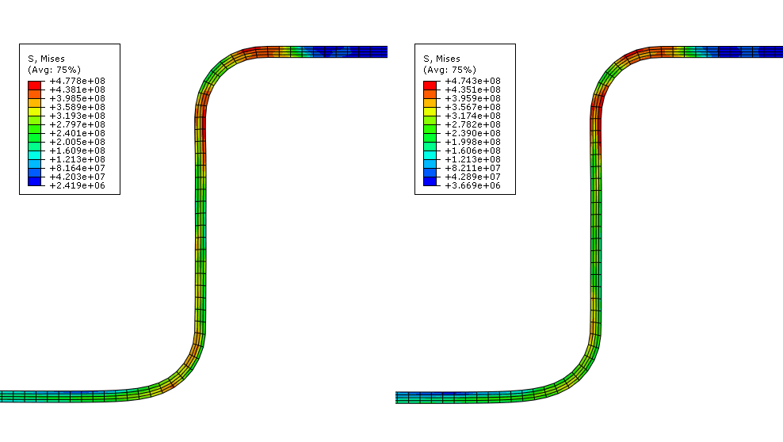The plot shows that the peak stresses in the Abaqus/Standard and Abaqus/Explicit analyses are within 1% of each other and that the overall stress contours of the blank are very similar. To further examine the validity of the quasi-static analysis results, you should compare the equivalent plastic strain results and final deformed shapes from the two analyses.[Figure 13-15](ch13s05.html#gsa-channel-compare-peeq) shows contour plots of the equivalent plastic strain in the blank, and [Figure 13-16](ch13s05.html#gsa-channel-overlay) shows an overlay plot of the final deformed shape predicted by the two analyses. Figure 13-15 Contour plot of PEEQ in Abaqus/Standard (left) and Abaqus/Explicit (right) channel forming analyses.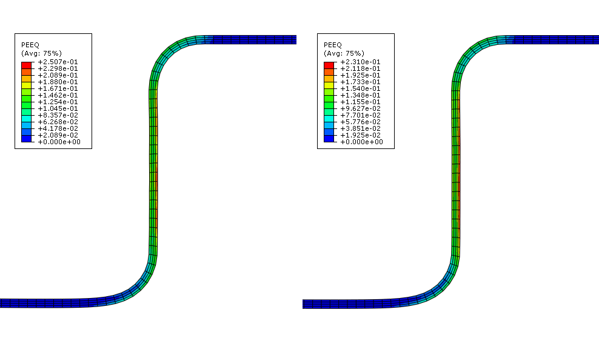Figure 13-16 Final deformed shape in Abaqus/Standard and Abaqus/Explicit forming analyses.The equivalent plastic strain results for the Abaqus/Standard and Abaqus/Explicit analyses are within 5% of each other. In addition, the final deformed shape comparison shows that the explicit quasi-static analysis results are in excellent agreement with the results from the Abaqus/Standard static analysis.You should also compare the steady punch force predicted by the Abaqus/Standard and Abaqus/Explicit analyses.To compare the punch force-displacement histories:Save the punch displacement (U2) and reaction force (RF2) history data from the Abaqus/Standard analysis as U2-std and RF2-std, respectively.Similarly, save punch displacement (U2) and reaction force (RF2) history data from the Abaqus/Explicit analysis as U2-xpl and RF2-xpl, respectively.Next, you will operate on saved X-Y data to create the force-displacement curves. In the force-displacement plot we would like the downward motion of the punch to be represented as a positive value; therefore, when you create the force-displacement curves include a negative sign before the displacement history data so that motion in the negative 2-direction will be positive.In the Results Tree, double-click XYData; then select Operate on XY data in the Create XY Data dialog box. Click Continue.In the Operate on XY Data dialog box, combine the force and displacement history data from the Abaqus/Standard analysis to create a force-displacement curve. The expression at the top of the dialog box should appear as:combine ( -"U2-std", "RF2-std" )Click Save As to save the calculated displacement curve as forceDisp-std.In the Operate on XY Data dialog box, combine the force and displacement history data from the Abaqus/Explicit analysis to create a force-displacement curve. The expression at the top of the dialog box should appear as:combine ( -"U2-xpl", "RF2-xpl" )Click Save As to save the calculated displacement curve as forceDisp-xpl.Plot forceDisp-std and forceDisp-xpl in the viewport.There is significantly more noise in the Abaqus/Explicit results compared to the Abaqus/Standard results because Abaqus/Explicit simulates a quasi-static response while Abaqus/Standard solves for true static equilibrium. Some of the noise in the Abaqus/Explicit history data was removed during the analysis by the built-in antialiasing filter specified on the output request. Now, you will use an Abaqus/CAE X-Y data filter to remove more of the solution noise from the Abaqus/Explicit force-displacement curve. The Abaqus/CAE X-Y data filters should only be applied to X-Y data whose X-value is time. This avoids confusion regarding the meaning of the filter cutoff frequency and prevents problems with the data regularization that is performed internally before the filter is applied. Consequently, you will not filter forceDisp-xpl directly, but rather you will filter U2-xpl and RF2-xpl individually before combining them to create a new force-displacement curve. It is best to apply the same filter operations (both during the analysis and during postprocessing) to any two X-Y data objects that will be combined. This will ensure that any distortions due to filtering (such as time delays) are uniformly applied to the combined data.In the Operate on XY Data dialog box, filter the force history data using a Butterworth filter with a cutoff frequency of 1100 Hz. The expression at the top of the dialog box should appear as:butterworthFilter(xyData="RF2-xpl",cutoffFrequency=1100)Note: 
Choosing an appropriate filter cutoff frequency takes engineering judgment and a good understanding of the physical system being modeled. Often an iterative approach (beginning with a relatively high cutoff frequency and then gradually reducing it) can be used to find a cutoff frequency that removes solution noise with minimal distortion of the underlying physical solution. Knowledge of the system's natural frequencies can also assist in the determination of appropriate filter cutoff frequencies. For this example, we performed a frequency extraction analysis to determine the fundamental frequency of the undeformed blank (140 Hz); however, the blank at the end of the forming step will have a fundamental frequency that is considerably higher. If you perform a natural frequency extraction analysis on the final model configuration, you will find that the fundamental frequency at the end of the forming step is approximately 1000 Hz. Hence, a cutoff frequency that is slightly larger than this value is a good choice for this model.Click Save As to save the calculated displacement curve as RF2-xpl-bw1100.Similarly, filter the displacement history data using a Butterworth filter with a cutoff frequency of 1100 Hz. The expression at the top of the Operate on XY Data dialog box should appear as:butterworthFilter(xyData="U2-xpl",cutoffFrequency=1100)Click Save As to save the calculated displacement curve as U2-xpl-bw1100.Combine the filtered Abaqus/Explicit force and displacement histories. The expression at the top of the Operate on XY Data dialog box should appear as:combine ( -"U2-xpl-bw1100", "RF2-xpl-bw1100" )Click Save As to save the calculated displacement curve as forceDisp-xpl-bw1100.Add forceDisp-xpl-bw1100 to the plot of forceDisp-std and forceDisp-xpl. Customize the plot appearance to obtain a plot similar to [Figure 13-17](ch13s05.html#gsa-channel-force-disp).Figure 13-17 Steady punch force comparison for Abaqus/Standard and Abaqus/Explicit. As seen in [Figure 13-17](ch13s05.html#gsa-channel-force-disp), the steady punch force predicted by Abaqus/Explicit is approximately 12% higher than that predicted by Abaqus/Standard. The differences between the Abaqus/Standard and Abaqus/Explicit results are primarily due to two factors. First, Abaqus/Explicit regularizes the material data. Second, friction effects are handled slightly differently in the two analysis products; Abaqus/Standard uses penalty friction, whereas Abaqus/Explicit uses kinematic friction.From these comparisons it is clear that both Abaqus/Standard and Abaqus/Explicit are capable of handling difficult contact analyses such as this one. However, there are some advantages to running this type of analysis in Abaqus/Explicit: Abaqus/Explicit is able to handle complex contact conditions more readily. However, when choosing Abaqus/Explicit for quasi-static analysis, you should be aware that you may need to iterate on an appropriate loading rate. In determining the loading rate, it is recommended that you begin with faster loading rates and decrease the loading rate as necessary. This will help optimize the run time for the analysis.Now that we have obtained an acceptable solution to the forming analysis, we can try to obtain similar acceptable results using less computer time. Most forming analyses require too much computer time to be run in their physical time scale because the actual time period of forming events is large by explicit dynamics standards; running in an acceptable amount of computer time often requires making changes to the analysis to reduce the computer cost. There are two ways to reduce the cost of the analysis:Artificially increase the punch velocity so that the same forming process occurs in a shorter step time. This method is called load rate scaling.Artificially increase the mass density of the elements so that the stability limit increases, allowing the analysis to take fewer increments. This method is called mass scaling.Unless the model has rate-dependent materials or damping, these two methods effectively do the same thing.Determining acceptable mass scaling"Loading rates," Section 13.2, and "Metal forming problems," Section 13.2.3, discuss how to determine acceptable scaling of the loading rate or mass to reduce the run time of a quasi-static analysis. The goal is to model the process in the shortest time period in which inertial forces remain insignificant. There are bounds on how much scaling can be used while still obtaining a meaningful quasi-static solution.As discussed in "Loading rates," Section 13.2, we can use the same methods to determine an appropriate mass scaling factor as we would use to determine an appropriate load rate scaling factor. The difference between the two methods is that a load rate scaling factor of  has the same effect as a mass scaling factor of . Originally, we assumed that a step time on the order of the period of the fundamental frequency of the blank would be adequate to produce quasi-static results. By studying the model energies and other results, we were satisfied that these results were acceptable. This technique produced a punch velocity of approximately 4.3 m/s. Now we will accelerate the solution time using mass scaling and compare the results against our unscaled solution to determine whether the scaled results are acceptable. We assume that scaling can only diminish, not improve, the quality of the results. The objective is to use scaling to decrease the computer time and still produce acceptable results.Our goal is to determine what scaling values still produce acceptable results and at what point the scaled results become unacceptable. To see the effects of both acceptable and unacceptable scaling factors, we investigate a range of scaling factors on the stable time increment size from 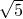 to 5; specifically, we choose , , and 5. These speedup factors translate into mass scaling factors of 5, 10, and 25, respectively.To apply a mass scaling factor:Create a set containing the blank named Blank.Edit the step Holder force.In the Edit Step dialog box, click the Mass scaling tab and toggle on Use scaling definitions below.Click Create. Accept the default selection of semi-automatic mass scaling. Select set Blank as the region of application, and enter a value of 5 as the scale factor.Create a job named Forming-3--sqrt5. Give the job the description Channel forming -- attempt 3, mass scale factor=5.Save your model, and submit the job for analysis. Monitor the solution progress; correct any modeling errors that are detected, and investigate the cause of any warning messages.When the job is finished, change the mass scaling factor to 10. Create and run a new job named Forming-4--sqrt10. When this job has completed, change the mass scaling factor again to 25; create and run a new job named Forming-5--5. For each of the last two jobs, modify the job descriptions as appropriate.First, we will look at the effect of mass scaling on the equivalent plastic strains and the displaced shape. We will then see whether the energy histories provide a general indication of the analysis quality.Evaluating the results with mass scalingOne of the results of interest in this analysis is the equivalent plastic strain, PEEQ. Since we have already seen the contour plot of PEEQ at the completion of the unscaled analysis in [Figure 13-15](ch13s05.html#gsa-channel-compare-peeq), we can compare the results from each of the scaled analyses with the unscaled analysis results. [Figure 13-18](ch13s05.html#gsa-channel-mass-scale-5) shows PEEQ for a speedup of  (mass scaling of 5), [Figure 13-19](ch13s05.html#gsa-channel-mass-scale-10) shows PEEQ for a speedup of  (mass scaling of 10), and [Figure 13-20](ch13s05.html#gsa-channel-mass-scale-25) shows PEEQ for a speedup of 5 (mass scaling of 25). [Figure 13-21](ch13s05.html#gsa-hist-kine-int-ener) compares the internal and kinetic energy histories for each case of mass scaling. The mass scaling case using a factor of 5 yields results that are not significantly affected by the increased loading rate. The case with a mass scaling factor of 10 shows a high kinetic-to-internal energy ratio, yet the results seem reasonable when compared to those obtained with slower loading rates. Thus, this is likely close to the limit on how much this analysis can be sped up. The final case, with a mass scaling factor of 25, shows evidence of strong dynamic effects: the kinetic-to-internal energy ratio is quite high, and a comparison of the final deformed shapes among the three cases demonstrates that the deformed shape is significantly affected in the last case.Figure 13-18 Equivalent plastic strain PEEQ for speedup of  (mass scaling of 5).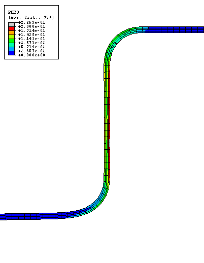Figure 13-19 Equivalent plastic strain PEEQ for speedup of  (mass scaling of 10).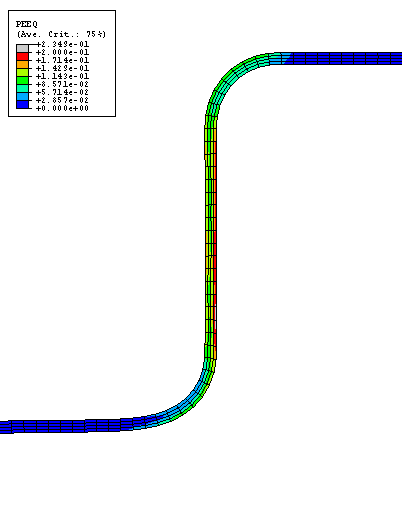Figure 13-20 Equivalent plastic strain PEEQ for speedup of 5 (mass scaling of 25).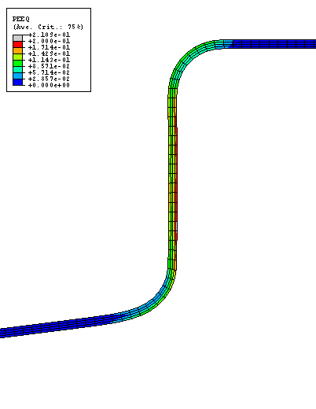Figure 13-21 Kinetic and internal energy histories for mass scaling factors of 5, 10, and 25, corresponding to speedup factors of , , and 5, respectively.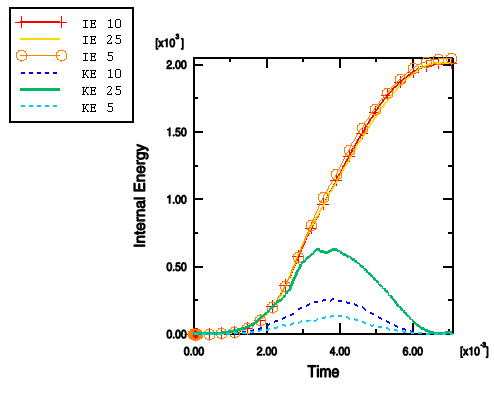Discussion of speedup methodsAs the mass scaling increases, the solution time decreases. The quality of the results also decreases because dynamic effects become more prominent, but there is usually some level of scaling that improves the solution time without sacrificing the quality of the results. Clearly, a speedup of 5 is too great to produce quasi-static results for this analysis.A smaller speedup, such as , does not alter the results significantly. These results would be adequate for most applications, including springback analyses. With a scaling factor of 10 the quality of the results begins to diminish, while the general magnitudes and trends of the results remain intact. Correspondingly, the ratio of kinetic energy to internal energy increases noticeably. The results for this case would be adequate for many applications but not for accurate springback analysis.While it is possible to perform springback analyses within Abaqus/Explicit, Abaqus/Standard is much more efficient at solving springback analyses. Since springback analyses are simply static simulations without external loading or contact, Abaqus/Standard can obtain a springback solution in just a few increments. Conversely, Abaqus/Explicit must obtain a dynamic solution over a time period that is long enough for the solution to reach a steady state. For efficiency Abaqus has the capability to transfer results back and forth between Abaqus/Explicit and Abaqus/Standard, allowing you to perform forming analyses in Abaqus/Explicit and springback analyses in Abaqus/Standard.You will create a new model that imports the results from the analysis with a speedup of  (mass scaling of 5) and perform a springback analysis. Thus, copy the Explicit model to a model named Import. Make all subsequent model changes to the Import model. Since only the blank needs to be imported, begin by deleting the following features from the Import model:Part instances Punch-1, Holder-1, and Die-1.Sets RefDie, RefHolder, and RefPunch.All surfaces.All contact interactions and properties.Both analysis steps.Next, create a general static step named springback. Set the initial time increment to 0.1, and include the effects of geometric nonlinearity (note that the Abaqus/Explicit analysis considered them; this is the default setting in Abaqus/Explicit). Springback analyses can suffer from instabilities that adversely affect convergence. Thus, include automatic stabilization to prevent this problem. Use the default value for the dissipated energy fraction. Toggle off adaptive stabilization.Next, define the initial state for the springback model based on the final state of the forming model.To define an initial state:In the Model Tree, double-click the Predefined Fields container. In the Create Predefined Field dialog box, select Initial as the step, Other as the category, and Initial state as the type. Click Continue.In the viewport, select the blank as the instance to which the initial state will be assigned and click Done in the prompt area.In the Edit Predefined Field dialog box that appears, enter the job name Forming-3--sqrt5. This corresponds to the job with a speedup of . Accept all other default settings, and click OK.This will cause the state of the model--stresses, strains, etc.--to be imported. By not updating the reference configuration, the springback displacements will be referred to the original undeformed configuration. This will allow for continuity in the displacements in the event additional forming stages are required.You must redefine the boundary conditions, which are not imported. Impose the same XSYMM-type displacement boundary conditions that were imposed in the Abaqus/Explicit model on the set Center. To remove rigid body motion, it is necessary to fix a single point in the blank, such as the node at the center of the left edge, in the 2-direction (in this way you impose no unnecessary constraints). Rather than apply a displacement boundary condition to this point, apply a zero-velocity boundary condition to fix this node at its position at the end of the forming stage (click the 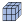 tool to display the mesh in the Load module; create a node-based set at this node and then apply the appropriate boundary condition). This will allow the model to retain continuity in the blank location through any additional forming stages that may follow.Create a new job named springback, and submit it for analysis.Results of the springback analysis[Figure 13-22](ch13s05.html#gsa-disp-springback) overlays (ViewOverlay Plot) the deformed shape of the blank after the forming and springback stages (the forming stage corresponds to the last frame of the Abaqus/Explicit output database file, while the springback stage corresponds to the final frame of the Abaqus/Standard output database file). The springback result is necessarily dependent on the accuracy of the forming stage preceding it. In fact, springback results are highly sensitive to errors in the forming stage, more sensitive than the results of the forming stage itself. Figure 13-22 Deformed model shapes following forming and springback.You should also plot the blank's internal energy ALLIE and compare it with the static stabilization energy ALLSD that is dissipated. The stabilization energy should be a small fraction of the internal energy to have confidence in the results. [Figure 13-23](ch13s05.html#gsa-stab-springback) shows a plot of these two energies; the static stabilization energy is indeed small and, thus, has not significantly affected the results. Figure 13-23 Internal and static stabilization energy histories.

## 13.6&nbsp;Summary

13.6 Summary

If a quasi-static analysis is performed in its natural time scale, the solution should be nearly the same as a truly static solution. It is often necessary to use load rate scaling or mass scaling to obtain a quasi-static solution using less CPU time.The loading rate often can be increased somewhat, as long as the solution does not localize. If the loading rate is increased too much, inertial forces adversely affect the solution.Mass scaling is an alternative to increasing the loading rate. When using rate-dependent materials, mass scaling is preferable because increasing the loading rate artificially changes the material properties.In a static analysis the lowest modes of the structure dominate the response. Knowing the lowest natural frequency and, correspondingly, the period of the lowest mode, you can estimate the time required to obtain the proper static response.It may be necessary to run a series of analyses at varying loading rates to determine an acceptable loading rate.The kinetic energy of the deforming material should not exceed a small fraction (typically 5% to 10%) of the internal energy throughout most of the simulation.Using a smooth step amplitude curve is the most efficient way to prescribe displacements in a quasi-static analysis.Import the model from Abaqus/Explicit to Abaqus/Standard to perform an efficient springback analysis.

