# Appendix D: Viewing the Output from Your Analysis

This postprocessing tutorial for the experienced Abaqus user illustrates how you can use the Visualization module (also licensed separately as Abaqus/Viewer) to display the results from your analysis in graphical form.

---

## D.1 Overview

During the tutorial you will display the output from Case 2 of the example problem, "Indentation of an elastomeric foam specimen with a hemispherical punch," Section 1.1.4 of the Abaqus Example Problems Guide. The problem studies the behavior of a heavy metal punch impacting a soft elastomeric foam block; the resulting deformation and strain are shown in Figure D-1.

**Figure D-1** Contour plot showing deformation and strain.

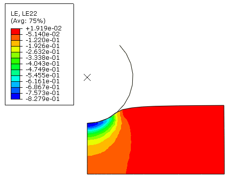

The problem is modeled in two dimensions and is divided into three steps:

1. The punch initially rests on the surface of the foam block and compresses the block under its own weight. The gravity loading is ramped up over two seconds; but the analysis continues for a total of five seconds, allowing the foam to relax fully. The analysis uses the quasi-static procedure to model the response of the foam block during the step.

2. The punch is forced down with an impulsive load that varies according to a half sine wave over a period of one second. The response of the foam block is modeled using the implicit dynamic procedure.

3. The impulsive load is removed, and the punch is allowed to move freely while the foam expands and contracts. The viscoelastic foam damps out the vibrations, and the step runs for 10 seconds while the model returns to steady state. As with the second step, the response of the foam block is modeled using the implicit dynamic procedure.

The tutorial consists of the following sections:

- "Which variables are in the output database?," Section D.2
- "Reading the output database," Section D.3
- "Customizing a model plot," Section D.4
- "Displaying the deformed model shape," Section D.5
- "Displaying and customizing a contour plot," Section D.6
- "Animating a contour plot," Section D.7
- "Displaying and customizing a symbol plot," Section D.8
- "Displaying and customizing a material orientation plot," Section D.9
- "Displaying and customizing an X-Y plot," Section D.10
- "Operating on X-Y data," Section D.11
- "Probing an X-Y plot," Section D.12
- "Displaying results along a path," Section D.13

---

## D.2 Which variables are in the output database?

In the first step of the elastomeric foam example, a set of options is included to control the data output during each step of the analysis. Abaqus/Standard writes this output to the Field Output or History Output portion of the output database, depending on the output type.

**Field Output**

The Field Output portion of the output database contains variables that should be output relatively infrequently during the analysis; in this case, after every 10 increments and after the last increment of a step. Typically, you select output for your entire model or a large region of your model, and Abaqus writes every component at the selected frequency. Only the selected variables are written to the output database.

The following input file fragment shows the options that control the field output variables in the elastomeric block example:

```
*OUTPUT, FIELD, FREQUENCY=10
*CONTACT OUTPUT, SLAVE=ASURF, MASTER=BSURF, VARIABLE=PRESELECT
*NODE OUTPUT
U,
*ELEMENT OUTPUT, ELSET=FOAM
S, E
```

Abaqus/Standard writes the following variables to the Field Output portion of the output database after every 10 increments and at the end of each step:

- the stress components of every integration point in the foam block;
- the logarithmic strain components of every integration point in the foam block (by default, the logarithmic strain is written to the output database when the user requests strain for a geometrically nonlinear analysis);
- the displacement of every node in the model; and
- the default contact output variables (clearance, pressure, shear stress, and tangential motion) resulting from the contact between the punch and the foam block.

**History Output**

The History Output portion of the output database contains variables that may be output relatively frequently during the analysis, as often as every increment. To avoid generating large amounts of data, you typically select output from a small area of your model, such as a single element or a small region. In addition, you must select the individual components of the variables that are written to the output database. History output is typically used for generating X-Y data plots.

The following input file fragment shows the options that control the history output variables in the elastomeric block example:

```
*OUTPUT, HISTORY, FREQUENCY=1
*NODE OUTPUT, NSET=N9999
U2, V2, A2
*ELEMENT OUTPUT, ELSET=CORNER
MISES, E22, S22
```

Abaqus/Standard writes the following variables from the punch's rigid body reference node (contained in node set N9999) to the history portion of the output database after every increment:

- the vertical displacement,
- the vertical velocity, and
- the vertical acceleration.

In addition, after every increment Abaqus/Standard writes the following variables from the element at the corner of the block to the history portion of the output database:

- von Mises stress,
- the logarithmic strain in the 2-direction on the 2-plane, and
- the stress in the 2-direction on the 2-plane.

The stress and strain variables are written for all the integration points in the element.

---

## D.3 Reading the output database

To start the tutorial, open the output database that Abaqus/Standard generated during the analysis of the example problem.

**To read the output database:**

1. You can use the Abaqus **fetch** utility to copy the output database to your local directory. Enter the following command at the operating system prompt:

```
abaqus fetch job=viewer_tutorial
```

2. If you have not done so already, start Abaqus/CAE or Abaqus/Viewer by typing `abaqus cae` or `abaqus viewer`, respectively, at the operating system prompt.

3. From the **Start Session** dialog box that appears, select **Open Database**. If you are already in an Abaqus/CAE or Abaqus/Viewer session, select **File -> Open** from the main menu bar.

   The **Open Database** dialog box appears.

4. From the **File Filter** list at the bottom of the **Open Database** dialog box, select **Output Database (*.odb)**.

   The remainder of the dialog box changes to reflect the fact that you are now interested in files with the extension `.odb` only.

   **Note:** If you are running Abaqus/Viewer, you do not have to select the file filter; only output database files are shown in the **Open Database** dialog box.

5. Resize your windows so that you can follow this tutorial and see the Abaqus/CAE main window. For more information, see "Starting Abaqus/CAE (or Abaqus/Viewer)," Section 2.1.1 of the Abaqus/CAE User's Guide.

6. From the **Directory** list at the top of the **Open Database** dialog box, select your local directory.

7. From the list of output database files that appears, select `viewer_tutorial.odb`.

8. Click **OK**.

   Abaqus/CAE starts the Visualization module and displays the undeformed shape of the model, as shown in Figure D-2.

   **Figure D-2** Undeformed model shape.

   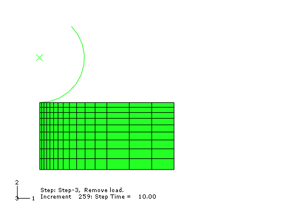

   The title block at the bottom of the viewport indicates the following:

   - The description of the model (from the first line of the `*HEADING` option in the input file).
   - The name of the output database (from the name of the analysis job).
   - The product name (Abaqus/Standard or Abaqus/Explicit) used to generate the output database.
   - The date the output database was last modified.

   The state block at the bottom of the viewport indicates the following:

   - Which step is being displayed.
   - The increment within the step.
   - The step time.

   The view orientation triad indicates the orientation of the model in the global coordinate system. The 3D compass located in the upper-right corner of the viewport allows you to manipulate the view directly.

   **Note:** For clarity, most of the figures in this tutorial do not include the title block, state block, orientation triad, and 3D compass. When the triad does appear, however, the nondefault 1-2-3 triad labels are used. In general, the figures illustrate the effect on the model of changing and customizing the plot. You can toggle off and customize the title block, state block, and orientation triad by selecting **Viewport -> Viewport Annotation Options** from the main menu bar.

---

## D.4 Customizing a model plot

You will now use the plot options to request element numbering.

### D.4.1 Customizing a model plot

A common set of plot options for all plot states - undeformed, deformed, contour, etc. - is provided to allow you to customize the appearance of a plot. Regardless of the plot state, customization options apply only to the current viewport and are not saved between sessions.

**To customize a model plot:**

1. From the main menu bar, select **Options -> Common**.

   Abaqus displays the **Common Plot Options** dialog box.

2. By default, Abaqus fills the model in green and hides element labels. You will change the color of the element labels from cyan to red and display them. From the **Common Plot Options** dialog box, click the **Labels** tab and do the following:

   a. Toggle on **Show element labels**.

   b. Click **Apply**.

      Abaqus displays the element numbering using cyan text.

   c. Click the color sample for the element labels.

      Abaqus displays the **Select Color** dialog box.

   d. Click the **RGB** tab and set the red, green, and blue values to 255, 0, and 0, respectively.

      **Tip:** You can also select red from the colors near the bottom of the dialog box or use any of the other available selection methods.

   e. Click **OK** to accept your selection.

      Abaqus closes the **Select Color** dialog box and updates the color sample to red.

   f. Click **OK**.

      The color of the element labels changes from cyan to red, and the **Common Plot Options** dialog box closes.

---

## D.5 Displaying the deformed model shape

You can display a plot of your model showing the deformed shape during each frame of the analysis. When you request a deformed shape plot of data from a force-displacement analysis, Abaqus plots the nodal displacements by default; but you can display any nodal vector field output variable that is available on the output database. You can also use the plot options to customize the appearance of a deformed plot.

### D.5.1 Displaying a deformed shape plot

Most procedures in Abaqus/Standard or Abaqus/Explicit write displacement to the output database by default and also select displacement for the nodal vector quantity to use as the default deformed variable. When Abaqus reads the output database, it uses the default deformed variable to determine the deformed model shape. In the elastomeric block example the user requested output of the displacements (`U`) for every node in the model after every 10 increments, and displacement was selected as the default deformed variable.

(Some procedures - for example, heat transfer - do not write nodal vector quantities to the output database by default and do not select a variable as the default deformed variable. Therefore, Abaqus cannot display a deformed plot, since in such cases the output database does not contain any variables that can be used to compute a deformed shape.)

**To display a deformed shape plot:**

1. From the main menu bar, select **Plot -> Deformed Shape**.

   **Tip:** You can also plot the deformed model using the tool in the Visualization module toolbox.

   Abaqus displays the deformed model in the same increment and step that it last displayed the undeformed model. The element labels also appear because the common plot options were used to display them.

2. Open the **Common Plot Options** dialog box. Click **Defaults** followed by **Apply** to restore and apply the default options.

   The state block indicates the default deformed variable being plotted (`U`) and the deformation scale factor (`1.000e+00`). Abaqus selects a default deformation scale factor of 1.0 for large-displacement analyses. (For small-displacement analyses Abaqus chooses the default scale factor to fit the viewport optimally.)

3. The buttons in the context bar allow you to move between frames of the analysis. In particular, the button on the far right of the context bar is the frame selector tool; it allows you to drag a slider to choose the frame of interest.

   You can also move directly to a selected step and increment using the following technique:

   a. From the main menu bar, select **Result -> Step/Frame**.

      Abaqus displays the **Step/Frame** dialog box.

   b. Select `Step 1`, `Increment 0`, and click **Apply**.

   c. The **Step/Frame** dialog box also displays the step time associated with an increment. Use the **Step/Frame** dialog box to display the deformed model approximately halfway through the second step.

4. Use a combination of the buttons in the context bar and the **Step/Frame** dialog box to view the deformed plot in different frames and in different steps.

5. Display the deformed model after the last increment of the third step (`Step 3` and `Step Time = 10.00`), as shown in Figure D-3.

   **Figure D-3** Deformed plot of the model after the last increment of the third step.

   

6. Click **Cancel** to close the **Step/Frame** dialog box.

### D.5.2 Superimposing the undeformed shape on the deformed shape

You can plot the undeformed and deformed model shapes simultaneously.

**To plot the undeformed and deformed model shapes:**

1. Click the tool in the toolbox to allow multiple plot states in the viewport. Then click the tool or select **Plot -> Undeformed Shape** to add the undeformed shape plot to the existing deformed plot in the viewport.

   Abaqus displays the deformed plot overlaid with the undeformed plot.

2. To customize the superimposed (i.e., undeformed) plot, select **Options -> Superimpose** from the main menu bar.

   Abaqus displays the **Superimpose Plot Options** dialog box.

3. In the **Superimpose Plot Options** dialog box, select the **Other** tab.

4. In the **Other** tabbed page, select the **Translucency** tab. Toggle off **Apply Translucency**.

5. Next select the **Offset** tab. Select **Uniform**, and enter a value of `0.001` as the offset value.

6. Click **OK** to apply the changes and to close the **Superimpose Plot Options** dialog box.

   Abaqus displays the customized deformed plot, as shown in Figure D-4. The undeformed model shape is colored white and is offset slightly from the deformed model shape to prevent the colors from overlapping.

   **Figure D-4** Customized deformed plot.

   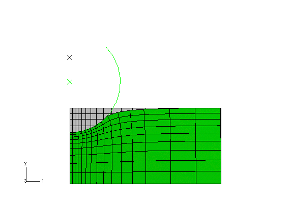

---

## D.6 Displaying and customizing a contour plot

You can display a contour plot of your model showing a variable such as stress, strain, or temperature. In all plots, including contour plots, Abaqus selects a default variable to display. The default variable selected depends on the variables available in the output database, which in turn depend on the analysis procedures and the requested output. You can choose to display any variable that is available in the field output portion of the output database. If you select a variable when you are not in a plot state that can display that variable, a dialog box appears prompting you to switch to a valid plot state.

You can use the plot options to customize the appearance of a contour plot. Abaqus applies your customized settings to every contour plot displayed in the current viewport. If you display a contour plot in a new viewport, Abaqus reverts to the default plot options.

### D.6.1 Displaying a contour plot

You will first display a contour plot of the default variable. Before continuing, toggle off the multiple plot states option.

**To display a contour plot:**

1. From the main menu bar, select **Plot -> Contours -> On Deformed Shape**.

   **Tip:** You can also display a contour plot using the tool in the Visualization module toolbox.

   The state block indicates that the variable plotted is `S, MISES`, the default variable chosen by Abaqus. Abaqus displays the results at the same step and frame that you used to display the deformed shape plot.

2. Use the buttons in the context bar or the **Step/Frame** dialog box to view the contour plot in different frames and in different steps.

   **Note:** The legend changes as you move between frames. Abaqus updates the maximum and minimum values and computes the contour intervals in every frame.

### D.6.2 Selecting the variable to plot

Abaqus selects a default variable to display in a contour plot, but you can display any variable that is available in the field output portion of the output database.

**To select the variable to plot:**

1. From the main menu bar, select **Result -> Field Output**.

   Abaqus displays the **Field Output** dialog box. You use the **Field Output** dialog box to select the variable to display.

   **Tip:** You can also select most field output variables and their components or invariants by using the lists in the **Field Output** toolbar. For more information, see "Using the field output toolbar," Section 42.5.2 of the Abaqus/CAE User's Guide.

2. Click the **Primary Variable** tab if it is not already selected.

3. To select the 22-component of strain as the primary variable, do the following:

   a. From the **Output Variable** field, select `LE` (logarithmic strain components at integration points).

   b. From the **Component** field, select the component `LE22`.

4. Click **OK** to select `LE22` as the primary variable and to close the **Field Output** dialog box.

   The contour plot in the current viewport changes to a plot of `LE22`, as shown in Figure D-5.

   **Figure D-5** Contour plot of the model after the last increment of the third step.

   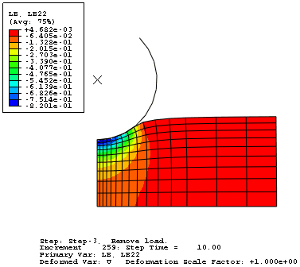

   **Tip:** You can click on the left side of the **Field Output** toolbar to make your selections from the **Field Output** dialog box instead of the toolbar. If you use the dialog box, you must click **Apply** or **OK** for Abaqus/CAE to display your selections in the viewport.

### D.6.3 Customizing a contour plot

By default, Abaqus displays a contour plot using 12 equal intervals between the maximum and minimum value of the selected variable. Abaqus updates the maximum and minimum values and computes new contour intervals for every frame. The legend indicates the calculated intervals and the color corresponding to each interval. You can change the number of intervals, and you can set the values corresponding to the maximum and minimum contour limits. When you set the contour limits, Abaqus uses the values you supply in every contour plot displayed thereafter, regardless of the frame and which variable is being contoured.

**To customize a contour plot:**

1. Display the contour plot at the end of the last increment of the second step (`Step 2` and `Step Time = 1.000`).

2. From the main menu bar, select **Options -> Contour**.

   Abaqus displays the **Contour Plot Options** dialog box.

3. Click the **Basic** tab if it is not already selected, and drag the uniform contour intervals slider to `16`.

4. Click the **Limits** tab to access the contour limits options.

   a. In the **Max** field, toggle the **Specify** button and type a maximum contour limit of `0.1`.

   b. In the **Min** field, toggle the **Specify** button and type a minimum of `-0.75`.

5. Click **Apply** to view the customized contour plot.

   The plot changes, as shown in Figure D-6.

   **Figure D-6** Customized contour plot.

   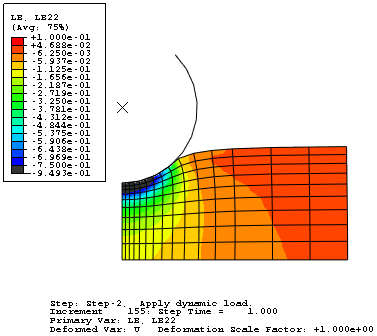

   Although you selected 16 contour intervals, the plot legend displays 17 intervals. Abaqus adds intervals to indicate any values that are greater than the maximum contour limit or less than the minimum contour limit and displays these values in light gray and dark gray, respectively. In this example, areas undergoing compressive strains greater than 0.75 are shown in dark gray. The minimum strain in the model is shown at the bottom of the contour legend. You might use either of these colors to indicate elements that fall outside the design range for the selected variable.

6. Under the **Limits** tab, examine the **Min** and **Max** **Auto-compute** options.

   The minimum and maximum values of strain for the contour plot are shown next to the two **Auto-compute** options.

7. Toggle on **Show location** for the **Min/Max** options to display the locations in the model where the extreme values occur.

8. Click **OK** to close the **Contour Plot Options** dialog box.

---

## D.7 Animating a contour plot

You can animate a deformed, contour, symbol, or material orientation (time history animation only) plot using one of the following:

**Time History Animation**

In a time history animation Abaqus displays each frame of each step from the output database in sequence, and you can see the change in the deformation or the change in a contour or symbol plot variable while the analysis progresses. In effect, Abaqus animates the results of the analysis. You can select which steps and frames to include in a time history animation.

**Scale Factor Animation**

Scale factor animation takes the results from a selected step and frame and simply scales them to form frames of the animation. You can select a scale factor that varies between zero and one or between minus one and plus one. Scale factor animation is particularly useful for animating vibration modes computed by an eigenvalue analysis.

The animation uses the plot options from the relevant mode - deformed, contour, symbol, or material orientation. In addition, you can control the following:

- The speed of the animation
- Whether the animation runs continuously or just once
- Whether to display the animation status

For the elastomeric foam example you will display a time history animation of a contour plot. The animated contour plot displays the field output variable displayed in the **Field Output** toolbar (`LE22`). In addition, it uses the same options that you selected for the contour plot; for example, the contour intervals and element edge display.

**To animate the contour plot:**

1. From the main menu bar, select **Animate -> Time History**.

   Abaqus displays the customized contour plot at the beginning of the analysis and steps through each frame; the state block indicates the current step and increment throughout the animation. After the last increment of the last step, the animation restarts at the beginning of the analysis (`Step 1`, `Increment 0`, and `Step Time = 0.00`).

   Abaqus also displays the movie player controls on the right side of the context bar.

   You use these controls to play, pause, and step through the animation.

2. In the context bar, click the **Play/Pause** button to stop the animation.

   The animation stops at the current image.

3. Click the button again to continue the animation.

   The animation resumes.

4. From the main menu bar, select **Options -> Animation** to view the animation options.

   Abaqus displays the **Animation Options** dialog box.

5. Click the **Player** tab if it is not already selected, and do the following:

   a. Choose **Swing**.

   b. Click **OK**.

   Because you chose **Swing**, when the animation reaches the end of the analysis, it steps backward through each frame instead of jumping back to the beginning of the analysis.

6. You can also customize the contour plot while the animation is running.

   a. Display the **Contour Plot Options** dialog box.

   b. Reduce the number of contour intervals to 10.

   c. Click **OK** to apply your change and to close the **Contour Plot Options** dialog box.

7. When you have finished viewing the animation, click the **Play/Pause** button to stop the animation.

---

## D.8 Displaying and customizing a symbol plot

Symbol plots allow you to visualize the magnitude and direction of vector and tensor variables in the form of symbols (arrows) superimposed on the model. Each symbol starts at the location in the model where the value was obtained; symbols representing nodal quantities appear at nodes, and symbols representing integration point quantities appear at integration points. The length of the arrow indicates the magnitude of the vector or tensor, and the direction of the arrow indicates its direction.

For example, in this section you will create a symbol plot of displacement. The symbol plot displays arrows representing the magnitude and the direction of the displacement vector at each node.

### D.8.1 Displaying a vector symbol plot

Use the **Field Output** toolbar to specify the variable you want to plot. When you select a symbol variable from the toolbar, the Visualization module automatically switches the display to plot symbols on the deformed model shape.

**To create a symbol plot of nodal displacement:**

1. From the list of variable types on the left side of the **Field Output** toolbar, select **Symbol**.

2. From the list of output variables in the center of the toolbar, select **U** (spatial displacement at nodes).

3. From the list of vector quantities and components on the right side of the toolbar, select **RESULTANT** as the vector quantity. This selection indicates that you want to plot the magnitudes of the displacement vectors.

   Abaqus displays the magnitude of the displacement vector on the deformed model shape on a symbol plot in the current viewport, as shown in Figure D-7.

   **Tip:** You can also display a symbol plot using the tool in the Visualization module toolbox or by selecting **Plot -> Symbols -> On Deformed Shape**.

   **Figure D-7** Symbol plot of displacement.

   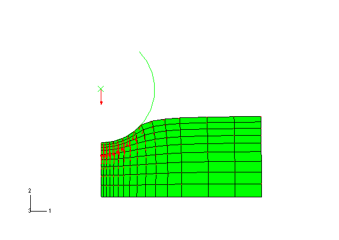

   The arrows represent the total displacement at each node. The length of the arrow represents the magnitude of the displacement, and the direction of the arrow represents the direction of the displacement. The symbol plot legend shows how each arrow color corresponds to a specific range of values.

   If your symbol plot is different from Figure D-7, you may have selected the incorrect output variable.

### D.8.2 Customizing the symbol plot

You will now customize your symbol plot by changing the visible edges and the arrow size and color.

**To customize the symbol plot:**

1. From the main menu bar, select **Options -> Common**.

   The **Common Plot Options** dialog box appears.

2. In the **Common Plot Options** dialog box, click the **Basic** tab if it is not already selected. Choose **Wireframe** for the render style and **Feature edges** for the visible edges.

3. From the main menu bar, select **Options -> Symbol**.

   The **Symbol Plot Options** dialog box appears.

4. In the **Color & Style** tabbed page, do the following:

   a. Click the **Vector** tab.

   b. Set the color type to **Uniform**.

   c. Click the color sample.

      Abaqus/CAE displays the **Select Color** dialog box.

   d. Click the **RGB** tab and set the red, green, and blue values to 0, 255 and 255, respectively.

      **Tip:** You can also select cyan from the colors near the bottom of the dialog box or use any of the other available selection methods.

   e. Click **OK** to accept your selection and to close the **Select Color** dialog box.

   f. Drag the **Size** slider to select `12` as the maximum length of the vector.

5. Click **OK** to apply your changes and to close the **Symbol Plot Options** dialog box.

   The customized symbol plot appears, as shown in Figure D-8.

   **Figure D-8** Customized symbol plot.

   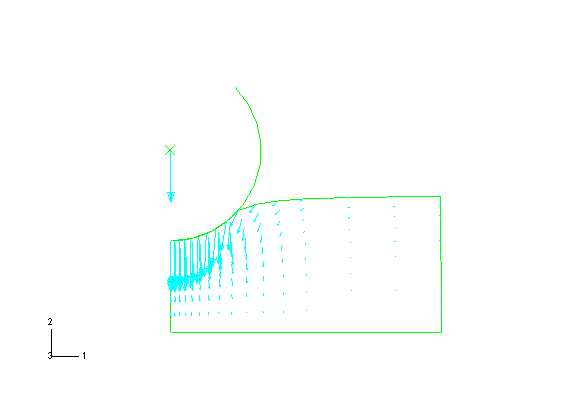

---

## D.9 Displaying and customizing a material orientation plot

Material orientation plots allow you to visualize the material directions for each element in your model at a specified step and frame. Material orientation triads that indicate the material directions are displayed at the element integration points. Material orientation plots can be drawn on either the undeformed or the deformed shape of the model.

In this section you will create a material orientation plot on the deformed model shape and customize its appearance.

### D.9.1 Displaying a material orientation plot

The material orientation plot will be created at the step and frame of the analysis you specified previously.

**To display a material orientation plot:**

- From the main menu bar, select **Plot -> Material Orientations -> On Deformed Shape**.

  **Tip:** You can also display a material orientation plot using the tool in the Visualization module toolbox.

  A material orientation plot appears, as shown in Figure D-9.

  **Figure D-9** Material orientation plot.

  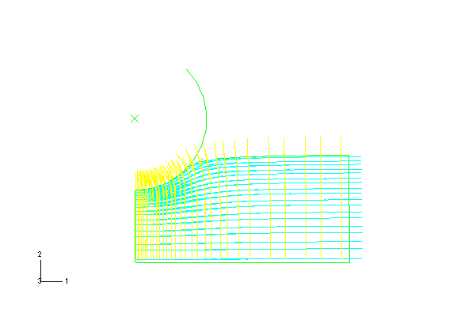

  Material orientation triads at element integration points indicate the material directions of each element in the model.

### D.9.2 Customizing a material orientation plot

You will now customize your material orientation plot by changing the color and length of the material orientation triad axes.

**To customize the material orientation plot:**

1. From the main menu bar, select **Options -> Material Orientation**.

   The **Material Orientation Plot Options** dialog box appears.

2. In this dialog box, do the following:

   a. Click the color sample for the 1-axis color.

      Abaqus/CAE displays the **Select Color** dialog box.

   b. Click the **RGB** tab; and set the red, green, and blue values to 255, 0, and 0, respectively.

      **Tip:** You can also select red from the colors near the bottom of the dialog box or use any of the other available selection methods.

   c. Click **OK** to accept your selection and to close the **Select Color** dialog box.

   d. Repeat the preceding three steps for the 2-axis color, changing it to blue (RGB 0, 0, 255).

   e. Drag the **Size** slider to reduce the length of the triad axes.

3. Click **OK** to apply your changes and to close the **Material Orientation Plot Options** dialog box.

   The customized material orientation plot appears, as shown in Figure D-10.

   **Figure D-10** Customized material orientation plot.

   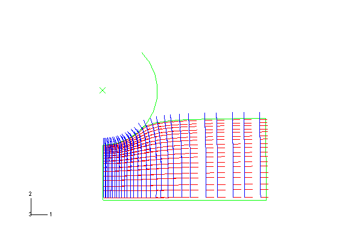

---

## D.10 Displaying and customizing an X-Y plot

You can display X-Y plots of data written to the output database. For the tutorial you will display the vertical displacement of the rigid body reference node versus time.

The Visualization module also allows you to display X-Y plots of the following:

- Data read from an ASCII file.
- Data entered at the keyboard.
- Existing data, either combined with other data or arithmetically manipulated.

### D.10.1 Displaying an X-Y plot

You will now display an X-Y plot of displacement versus time.

**To display an X-Y plot:**

1. In the Results Tree, click mouse button 3 on **History Output** for the output database named `viewer_tutorial.odb`. From the menu that appears, select **Filter**.

2. In the filter field, enter `*U2*` to restrict the history output to just the displacement components in the 2-direction.

3. Expand the **History Output** container and double-click the data object containing the history of the vertical motion of the rigid body reference node: `Spatial displacement: U2 at Node 1000 in NSET PUNCH`.

   Abaqus displays an X-Y plot of displacement versus time, as shown in Figure D-11.

   **Figure D-11** X-Y plot of displacement versus time.

   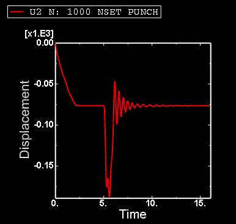

   Default options selected by Abaqus include default ranges for the X- and Y-axes, axis titles, major and minor tick marks, the color of the line, and a legend.

4. The legend labels the X-Y plot **U2 N: 1000 NSET PUNCH**. This is a default name provided by Abaqus.

### D.10.2 Customizing an X-Y plot

By default, Abaqus computes the range of the X- and Y-axes from the minimum and maximum values found in the data read from the output database. Abaqus divides each axis into intervals and displays the appropriate major and minor tick marks. The **Axis Options** allow you to set the range of each axis and to customize the appearance of the axes; the **Curve Options** allow you to customize the appearance of the individual curves; the **Chart Options** and **Chart Legend Options** allow you to position the grid and legend, respectively. X-Y plot customization options apply only to the current viewport and are not saved between sessions.

**To customize an X-Y plot:**

1. From the main menu bar, select **Options -> XY Options -> Axis** (or click in the prompt area to cancel the current procedure, if necessary, and double-click either axis in the viewport).

   Abaqus displays the **Axis Options** dialog box.

2. Switch to the **Scale** tabbed page, if it is not already selected.

3. Specify that the X-axis should extend from `0` (the X-axis minimum) to `20` (the X-axis maximum) and that the Y-axis should extend from `-200` (the Y-axis minimum) to `0` (the Y-axis maximum).

   **Tip:** Select each axis in turn in the **Axis Options** dialog box, and then edit the scale as noted above.

4. From the options in the **Axis Options** dialog box, do the following:

   - In the **Scale** tabbed page, request that major tick marks appear on the X-axis at four-second increments (select **By increment** in the **Tick Mode** region of the page).
   - Request **3** minor tick marks per increment along the X-axis (this corresponds to a minor tick mark every second) and **4** minor tick marks per increment along the Y-axis (this corresponds to a minor tick mark every 10 mm).
   - In the **Title** tabbed page, type a Y-axis title of `Displacement U2 (mm)`.
   - In the **Axes** tabbed page, request a **Decimal** format with zero decimal places for the Y-axis labels.

5. Click **Dismiss** to close the **Axis Options** dialog box.

6. From the main menu bar, select **Options -> XY Options -> Chart** (or double-click any empty spot in the plot) to modify the gridlines and position the grid.

   a. In the **Chart Options** dialog box that appears, switch to the **Grid Display** tabbed page.

   b. Toggle on **Major** in both the **X Grid Lines** and **Y Grid Lines** fields. Change the color of the major gridlines to blue; the line style should be solid.

   c. Switch to the **Grid Area** tabbed page.

   d. In the **Size** region of this page, select the **Square** option.

   e. Use the slider to set the size to **75**.

   f. In the **Position** region of this page, select the **Auto-align** option.

   g. From the available alignment options, select the fourth to last one (position the grid in the bottom-center of the viewport).

   h. Click **Dismiss**.

7. From the main menu bar, select **Options -> XY Options -> Chart Legend** (or double-click the legend) to position the legend.

   a. In the **Chart Legend Options** dialog box, switch to the **Area** tabbed page.

   b. In the **Position** region of this page, toggle on **Inset** and click **Dismiss**.

   c. Drag the legend in the viewport to reposition it.

   The customized X-Y plot appears, as shown in Figure D-12.

   **Figure D-12** Customized X-Y plot of displacement.

   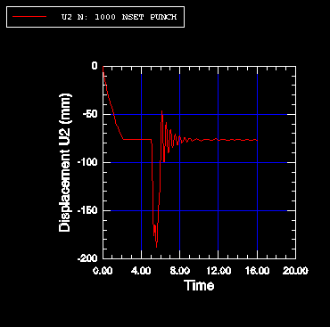

8. You will now display a second X-Y plot in a new viewport. To create a new viewport, select **Viewport -> Create** from the main menu bar.

   The new viewport appears. The same X-Y plot that you had in the first viewport appears in the new viewport.

   When multiple viewports are visible, the dark gray title bar indicates the current viewport; all work takes place in the current viewport. For more information, see "What is a viewport?," Section 4.1.1 of the Abaqus/CAE User's Guide.

9. Tile the viewports vertically by selecting **Viewport -> Tile Vertically** from the main menu bar.

10. Create a similar X-Y plot of vertical velocity (`V2`) versus time. You cannot select velocity during the first step because the first step was not a dynamic step; Abaqus/Standard computed velocity and acceleration only during the second and third steps. Use the same X-axis range as before, and use a Y-axis range from `1000` to `-1000`. Label the Y-axis `Velocity V2`. The finished plot is shown in Figure D-13.

    **Figure D-13** Customized X-Y plot of velocity.

    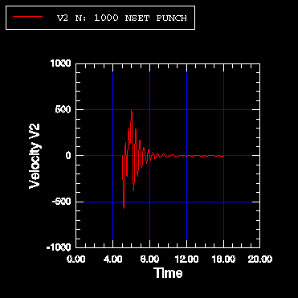

---

## D.11 Operating on X-Y data

An X-Y data object is a collection of ordered pairs that Abaqus stores in two columns - an X-column and a Y-column. The **Operate on XY Data** dialog box allows you to create new X-Y data objects by performing operations on previously saved X-Y data objects. In this tutorial you will create a stress versus strain data object by combining a stress versus time data object with a strain versus time data object. Then, you will plot the stress-strain curve.

### D.11.1 Creating the stress versus time and strain versus time data objects

The first step in creating the stress-strain curve is to create the stress versus time and the strain versus time data objects from the history output. The data objects will contain data from only the first step of the analysis, where the punch rests on the surface of the foam block and compresses the block under its own weight.

**To create the X-Y data objects:**

1. In the Results Tree, double-click the **XYData** container.

   The **Create XY Data** dialog box appears.

2. In this dialog box, select **ODB history output** if it is not already selected and click **Continue**.

   The **History Output** dialog box appears.

3. In the **History Output** dialog box, do the following:

   a. Click the **Variables** tab.

   b. Filter the data according to `*LE22*`.

   c. In the **Output Variables** field, select `Logarithmic strain components: LE22 at Element 1 Int Point 1 in ELSET CENT`.

   d. Click the **Steps/Frames** tab.

   e. Select `Step 1`.

   f. Click **Save As**.

      The **Save XY Data As** dialog box appears.

   g. Name the X-Y data `Strain`, and click **OK**.

   A data object called `Strain` containing logarithmic strain data (`LE22`) from integration point 1 of element 1 during the first step of the analysis appears in the **XYData** container.

4. Use a similar technique to create a data object containing stress data (`S22`) from integration point 1 of element 1 during the first step of the analysis. Name this data object `Stress`.

   **Tip:** Filter the variable list according to `*S22*`.

   Now you are ready to combine the two data objects to create a stress versus strain data object.

5. Dismiss the **History Output** dialog box.

### D.11.2 Combining the data objects

In this section you will create a stress versus strain data object by combining the stress versus time and strain versus time data objects.

**To combine the data objects:**

1. In the Results Tree, double-click the **XYData** container.

2. From the **Create XY Data** dialog box that appears, select **Operate on XY data** and click **Continue**.

   An **Operate on XY Data** dialog box appears. The dialog box contains the following lists:

   - The **XY Data** field on the left contains a list of existing X-Y data objects.
   - The **Operators** field on the right contains a list of all the possible operations you can perform on the data objects.

3. From the **Operators** field, click `combine(X,X)`.

   `combine( )` appears in the expression text field at the top of the dialog box.

4. In the **XY Data** field, drag the cursor across both the `Strain` and the `Stress` data objects to select both and click **Add to Expression** near the bottom of the dialog box.

   The expression `combine("Strain","Stress")` appears in the expression text field. In this expression `"Strain"` will determine the X-values and `"Stress"` will determine the Y-values in the combined plot.

5. From the buttons along the bottom of the **Operate on XY Data** dialog box, click **Save As**.

6. From the **Save XY Data As** dialog box that appears, enter the name `Stress-Strain` and click **OK**.

   The new data object `Stress-Strain` appears in the **XYData** container.

7. Cancel the **Operate on XY Data** dialog box.

### D.11.3 Plotting and customizing the stress-strain curve

You will now use the `Stress-Strain` data object that you just created to plot the stress-strain curve.

**To plot the stress-strain curve:**

1. In the **XYData** container, double-click `Stress-Strain`.

   A plot of the stress-strain curve appears in the viewport.

2. Your plot of stress versus strain inherited the customized chart settings from your previous plot. To restore the default chart options, do the following:

   a. Open the **Chart Options** dialog box.

   b. Toggle off **Major** in both the **X Grid Lines** and **Y Grid Lines** fields.

   c. Click **Dismiss**.

3. The plot of stress versus strain appears, as shown in Figure D-14. In this figure, the visibility of the plot legend has been suppressed (open the **Chart Legend Options** dialog box; in the **Contents** tabbed page, toggle off **Show legend**).

   **Figure D-14** X-Y plot of stress versus strain.

   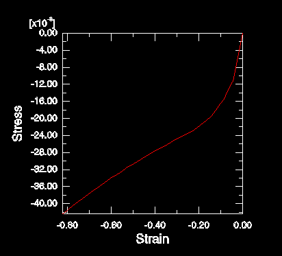

---

## D.12 Probing an X-Y plot

You can use the Query toolset in the Visualization module to probe your model and X-Y plots. You can also write the resulting probe values to a file. In this tutorial you will use the probe capability to obtain X- and Y-values from your stress/strain plot and to write these values to a file.

**To probe an X-Y plot:**

1. From the main menu bar, select **Tools -> Query**; select **Probe values** from the **Query** dialog box.

   The **Probe Values** dialog box appears. Because an X-Y plot is in the current viewport, this dialog box will display X-Y curve data.

2. At the top of the dialog box, toggle on **Interpolate between points**. This option allows you to select arbitrary points along the curve.

3. In the viewport, position the cursor over the X-Y curve.

   When the arrow at the cursor approaches the X-Y curve, the point being probed is highlighted and information about it, including the corresponding X-Y coordinates, appears in the **Probe Values** table.

4. Click at various points along the curve.

   The points are added to the table in the **Probe Values** dialog box.

5. When you have finished selecting points, click **Write to File**.

   The **Report Probe Values** dialog box appears.

   By default, the data in the table are written to a file called `abaqus.rpt` in your current directory. The options in this dialog box allow you to change the name of this file and the format of the data written to the file.

6. Click **OK** to write your data to the file.

7. From the **Probe Values** dialog box, click **Cancel** to exit probe mode.

   A dialog box appears to inform you that the **Selected Probe Values** table contains data. Click **Yes** to indicate that it is OK to continue; the data in the table will be deleted.

---

## D.13 Displaying results along a path

X-Y data can be generated for a specific path through your model. In this tutorial you will specify a node list path along the top of the foam block and plot the displacement magnitude along this path.

### D.13.1 Creating a node list path

A path is a line you define by specifying a series of points through the model. In a node list path all of the specified points are nodal locations. You create a node list path by entering node labels or node label ranges in a table. To determine the node labels of interest, it is helpful to create a model plot with the node labels visible.

**To create a node list path:**

1. Click the tool to display the undeformed model shape.

   Use the **Common Plot Options** dialog box to display the node labels. Identify the nodes on the top edge of the foam block.

2. In the Results Tree, double-click **Paths**.

   The **Create Path** dialog box appears.

3. Name the path `Displacement`. Accept the default selection of **Node list** as the path type, and click **Continue**.

   The **Edit Node List Path** dialog box appears.

4. In the **Path Definition** table, select `PART-1-1` in the **Part Instance** field, type `1:601:40` in the **Node Labels** field, and press **[Enter]**. (This input specifies a range of nodes from 1 to 601 at increments of 40.) Alternatively, you can pick the nodes for the node list directly from the viewport by clicking **Add Before...** or **Add After...** in the **Edit Node List Path** dialog box.

   The selected path is highlighted in the plot in the current viewport.

5. Click **OK** to create the path and to close the **Edit Node List Path** dialog box.

### D.13.2 Displaying results along a node list path

Abaqus obtains analysis results for each of the points on the path you have defined and generates X-Y data pairs; the X-values are the specified points in the model, and the Y-values are the analysis results at these points. You can generate an X-Y plot of the data pairs.

**To display displacement results along a node list path:**

1. In the Results Tree, double-click the **XYData** container.

2. In the **Create XY Data** dialog box that appears, select **Path**; and click **Continue**.

   The **XY Data from Path** dialog box appears with the path that you created visible in the list of available paths.

   Accept the default selections in the **X Values** portion of the dialog box.

3. The result that will be plotted is displayed in the **Y Values** portion of the dialog box. If **U** is not indicated as the field output variable, click **Field Output** to change the variable.

   In the **Field Output** dialog box:

   a. Select **U** as the variable **Name**.

   b. Select **Magnitude** from the **Invariant** field.

   c. Click **OK**.

4. Click **Plot** to generate an X-Y plot of `U` along the path, as shown in Figure D-15. You may need to reset the X-Y plot options to their default settings.

   **Figure D-15** Path plot of `U` along the top of the foam block.

   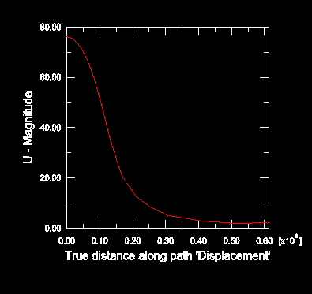

You have now finished the tutorial.

---

## D.14 Summary

- Abaqus/CAE loads the Visualization module automatically when you open an output database.
- To perform many Visualization module functions, you can use either a menu item or a tool in the toolbox.
- You can use the buttons on the right side of the context bar to display the state of the model in each frame of the analysis.
- The Visualization module has different plot types. Common plot options are available to control the appearance of the model in all plot types. Some plot types have specialized plot options as well. Customization options apply only to the current viewport and are not saved between sessions. You can use the **Defaults** button to restore the default plot options.
- You use the viewport annotation options to customize the appearance of items that appear in all plots, such as the title block, the state block, and the orientation triad. The title block displays information about the analysis that generated the output database. The state block contains information about the step and increment being displayed.
- In all plots Abaqus selects a default variable to display from the field output portion of the output database. You can use the **Field Output** toolbar or dialog box to select the variable to display.
- You can display a time history animation from the data in an output database, or you can generate a scale factor animation based on a single increment of the results. You can animate a deformed, contour, symbol, or material orientation (time history animation only) plot; the animation uses the respective plot options to control the appearance of the model. You can customize these plots while the animation is running.
- A symbol plot shows the magnitude and direction of a particular vector or tensor variable at a specified step and frame. By default, symbol plots display the magnitudes for vector variables and all principal components for tensor variables.
- A material orientation plot shows the material directions of elements in your model at a specified step and frame of your analysis. Material orientations are displayed on an element-by-element basis at the material integration points, with no averaging across elements.
- You can display an X-Y plot of any variable stored in the output database. In most cases the X-axis is assumed to be time.
- You can use the **Operate on XY Data** dialog box to create new X-Y data objects based on operations on existing data objects.
- You can use the Query toolset to probe a model or X-Y plot. You can write the values you obtain to a file.

---

*This document is auto-generated from ABAQUS Getting Started with Abaqus: Interactive Edition (6.14)*
