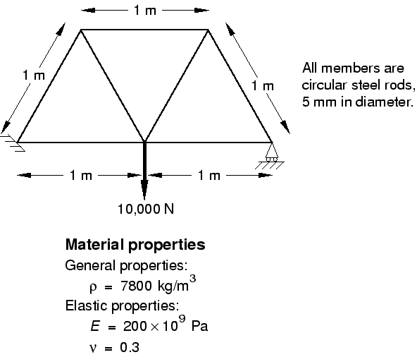

# 2.2 输入文件的格式

输入文件是前处理器（通常为 Abaqus/CAE）与分析产品（Abaqus/Standard 或 Abaqus/Explicit）之间的通信工具。它包含数值模型的完整描述。输入文件是一种基于关键字的文本格式，直观易懂，因此在必要时易于使用文本编辑器进行修改；如果使用 Abaqus/CAE 等前处理器，则应使用前处理器进行修改。实际上，小型分析可以直接通过输入文件轻松指定。

本节以吊装起重机的示例来说明 Abaqus 输入文件的基本格式，如*图 2–1*所示。起重机是一个简单的销接桁架模型，左端受约束，右端安装在滚轮上。构件在连接处可自由旋转。框架被防止出平面移动。进行模拟以确定结构的挠度及其构件在施加 10 kN 载荷时的峰值应力，如*图 2–1*所示。

**图 2–1** 吊装起重机示意图



由于此问题非常简单，Abaqus 输入文件紧凑且易于理解。此示例的完整 Abaqus 输入文件如*图 2–2*所示（亦见"吊装起重机框架"，《A.1 节》），可分为两个不同的部分。第一部分包含**模型数据**，包含定义被分析结构所需的所有信息。第二部分包含**历史数据**，定义模型发生的情况：需要结构响应的加载或事件的序列。此历史被划分为一系列**步骤**，每个步骤定义模拟的单独部分。例如，第一步可定义静态加载，而第二步可定义动态加载，等等。

**图 2–2** 吊装起重机模型输入


输入文件由多个**选项块**组成，每个选项块包含描述模型某一部分的数据。每个选项块以**关键字行**开头，通常后跟一个或多个**数据行**。这些行不能超过 256 个字符。

## 2.2.1 关键字行

关键字（或选项）始终以星号或 asterisk（*）开头。例如，`*NODE` 是指定节点坐标的关键字，`*ELEMENT` 是指定单元连接的关键字。关键字通常后跟参数，其中一些可能是必需的。`TYPE` 参数与 `*ELEMENT` 选项一起使用是必需的，因为在定义单元时必须始终给出单元类型。例如，以下语句表示我们正在定义 T2D2 单元（二维两节点桁架单元）的连接：

```
*ELEMENT, TYPE=T2D2
```

许多参数是可选的，仅在特定情况下定义。例如，以下语句表示此选项块中定义的所有节点将被放入一个名为 `PART1` 的集合中：

```
*NODE, NSET=PART1
```

将节点放入集合并非必需，但在许多情况下很方便。

关键字和参数不区分大小写，必须使用足够的字符以使其唯一。参数用逗号分隔。如果参数有值，则使用等号（=）将值与参数关联。

偶尔需要太多参数以致无法放在单行 256 字符的行中。在这种情况下，在行尾放置一个逗号，表示下一行是续行。例如，以下关键字和参数是一个有效的关键字行：

```
*ELEMENT, TYPE = T2D2,
ELSET = FRAME
```

关键字的详细信息记录在《Abaqus 关键字参考指南》中。

## 2.2.2 数据行

关键字行通常后跟数据行，数据行提供比关键字行上的参数更容易以列表形式指定的数据。此类数据的示例包括节点坐标；单元连接；或材料特性表，如应力-应变曲线。特定选项块所需的数据在《Abaqus 关键字参考指南》中指定。例如，定义吊装起重机模型的节点的选项块为：

```
*NODE
101, 0., 0., 0.
102, 1., 0., 0.
103, 2., 0., 0.
104, 0.5, 0.866, 0.
105, 1.5, 0.866, 0.
```

每个数据行的第一个数据项是定义节点号的整数。第二个、第三个和第四个条目是浮点数，指定节点的 、、 坐标。

数据可以由整数、浮点数或字母数字值的混合组成。浮点值可以以多种方式输入；例如，Abaqus 将以下所有内容解释为数字四：

| 4.0 | 4. | 4 |
| --- | --- | --- |
| 4.0E+0 | .4E+1 | 40.E-1 |

数据项用逗号分隔，如*图 2–2*所示，这允许在数据行上相当任意地设置输入值的间距。如果数据行上只有一个项目，则必须在其后跟一个逗号。