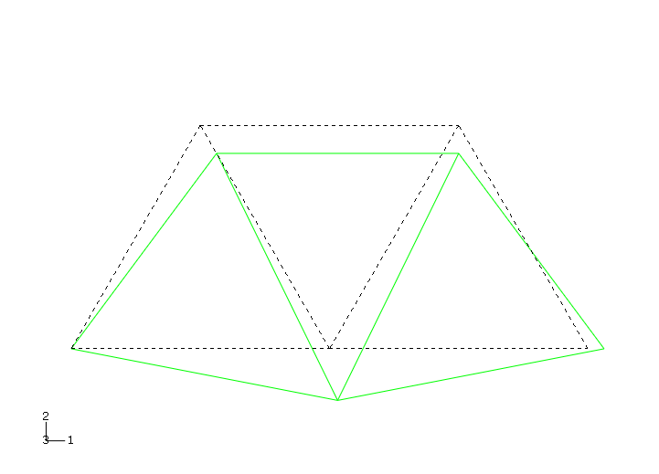
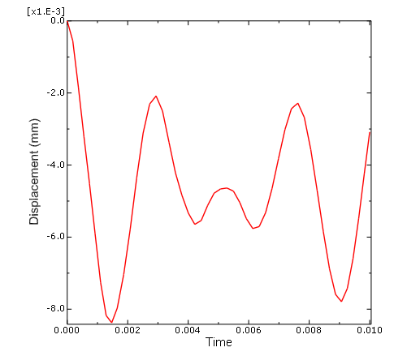

# 2.3 示例：创建架空起重机的模型

图2-1中的销接架空起重机的模拟用于说明使用编辑器创建Abaqus输入文件的方法。在阅读本节时，您应该使用计算机上可用的编辑器之一将数据输入到文件中。Abaqus输入文件必须具有 `.inp` 文件扩展名。为方便起见，请将输入文件命名为 `frame.inp`。文件标识符（可选择用于标识分析）称为 *jobname*（作业名）。在这种情况下，请使用作业名"frame"以便与名为 `frame.inp` 的输入文件轻松关联。

本指南中的所有其他示例都假定如果您要从头开始创建模型，您将使用预处理程序（如Abaqus/CAE）来生成网格。所有示例的输入文件均可用。请参阅"附录A，'示例文件'"，获取有关如何检索这些输入文件的说明。但是，由于本示例的目的是帮助您理解Abaqus输入文件的结构和格式，因此您应该直接输入此输入文件，而不是使用预处理程序或复制提供的输入文件。如果您希望使用Abaqus/CAE创建整个模型，请参阅《Abaqus入门：交互版》第2.3节"示例：创建架空起重机的模型"。

## 2.3.1 单位

在开始定义此模型或任何模型之前，您需要决定将使用哪种单位制。Abaqus没有内置的单位制。在Abaqus中输入数据时不要包含单位名称或标签。所有输入数据必须以一致的单位指定。一些常见的一致单位制如表2-1所示。

**表2-1** 一致单位。

| 物理量 | SI | SI（毫米） | US单位（英尺） | US单位（英寸） |
|--------|-----|------------|---------------|---------------|
| 长度 | m | mm | ft | in |
| 力 | N | N | lbf | lbf |
| 质量 | kg | 吨（10³ kg） | slug | lbf s²/in |
| 时间 | s | s | s | s |
| 应力 | Pa（N/m²） | MPa（N/mm²） | lbf/ft² | psi（lbf/in²） |
| 能量 | J | mJ（10⁻³ J） | ft lbf | in lbf |
| 密度 | kg/m³ | 吨/mm³ | slug/ft³ | lbf s²/in⁴ |

本指南全程使用SI单位制。使用标注为"US单位"的单位制的用户应注意密度单位；材料属性手册中给出的密度通常乘以重力加速度。

## 2.3.2 坐标系

您还需要决定使用哪个坐标系。Abaqus中的全局坐标系是一个右手直角（笛卡尔）坐标系。对于此示例，定义全局1轴为起重机的水平轴，全局2轴为垂直轴（图2-3）。全局3轴垂直于框架平面。原点（X₁=0，X₂=0，X₃=0）是框架的左下角。

**图2-3** 模型的坐标系和原点。


对于二维问题（如本例），Abaqus要求模型位于平行于全局1-2平面的平面内。

## 2.3.3 网格

您必须选择单元类型并设计网格。为给定问题创建适当的网格需要经验。对于此示例，您将使用单个桁架单元来模拟框架的每个构件，如图2-4所示。

**图2-4** 有限元网格。


桁架单元只能承受拉压轴向载荷，非常适合模拟销接框架（如架空起重机）。桁架单元在3.1.5节"桁架单元"以及《Abaqus分析用户指南》中有描述，后者描述了Abaqus中可用的每个单元。单元类型索引（《Abaqus分析用户指南》第EI.1节"abaqus/Standard单元索引"）使定位特定单元变得容易。当您首次使用单元时，应该阅读其描述，其中包括单元连接性和定义单元几何形状所需的任何单元截面属性。

架空起重机模型中使用的桁架单元的连接性如图2-5所示。

**图2-5** 2节点桁架单元（T2D2）的连接性。


节点和单元编号仅是识别标签。它们通常由Abaqus/CAE或其他预处理程序自动生成。节点和单元编号的唯一要求是它们必须是正整数。编号中允许有间隙，定义节点和单元的顺序无关紧要。任何已定义但未与单元关联的节点都会被自动移除，不会包含在模拟中。

在本例中，我们使用图2-6所示的节点和单元编号。

**图2-6** 起重机模型的节点和单元编号。


## 2.3.4 模型数据

输入文件的第一部分必须包含所有模型数据。这些数据定义要分析的结构。在架空起重机示例中，模型数据包括：

- **几何**：节点坐标、单元连接性、单元截面属性
- **材料属性**

### 标题

任何Abaqus输入文件中的第一个选项必须是 `*HEADING`。跟随 `*HEADING` 选项的数据行是描述正在模拟的问题的文本行。您应该提供准确的描述，以便稍后可以识别输入文件。此外，指定单位制、全局坐标系方向等通常很有帮助。例如，起重机问题的 `*HEADING` 选项块包含：

```
*HEADING
Two-dimensional overhead hoist frame
SI units (kg, m, s, N)
1-axis horizontal, 2-axis vertical
```

### 数据文件打印选项

默认情况下，Abaqus不会将输入文件或模型和历史定义数据的回显打印到打印输出（`.dat`）文件。但是，建议您在运行分析之前在 **datacheck** 运行中检查模型和历史定义。**datacheck** 运行将在本章后面讨论。

要请求打印输入文件以及模型和历史定义数据，请在输入文件中添加以下语句：

```
*PREPRINT, ECHO=YES, MODEL=YES, HISTORY=YES
```

### 节点坐标

选择网格设计和节点编号方案后，可以定义每个节点的坐标。对于此问题，请使用图2-6所示的编号。节点坐标使用 `*NODE` 选项定义。此选项块的每个数据行格式为：

```
<节点编号>, <X₁坐标>, <X₂坐标>, <X₃坐标>
```

起重机模型的节点定义如下：

```
*NODE
101, 0.,  0.,    0.
102, 1.,  0.,    0.
103, 2.,  0.,    0.
104, 0.5, 0.866, 0.
105, 1.5, 0.866, 0.
```

### 单元连接性

架空起重机的构件用桁架单元建模。桁架单元每个数据行的格式为：

```
<单元编号>, <节点1>, <节点2>
```

其中节点1和节点2在单元的两端（见图2-5）。例如，单元16连接节点103和105（见图2-6），因此定义此单元的数据行为：

```
16, 103, 105
```

`@*ELEMENT@` 选项上的 `TYPE` 参数必须用于指定正在定义的单元类型。在这种情况下，您将使用T2D2桁架单元。

Abaqus中最有用的功能之一是可按名称引用的节点和单元**集合**。通过在 `*ELEMENT` 选项上使用 `ELSET` 参数，选项块中定义的所有单元都被添加到一个名为 `FRAME` 的单元集合中。集合名称最多可以包含80个字符，且必须以字母开头。由于单元截面属性通过单元集合名称分配，模型中的所有单元必须至少属于一个单元集合。

架空起重机模型的完整 `*ELEMENT` 选项块（见图2-6）如下所示：

```
*ELEMENT, TYPE=T2D2, ELSET=FRAME
11, 101, 102
12, 102, 103
13, 101, 104
14, 102, 104
15, 102, 105
16, 103, 105
17, 104, 105
```

### 单元截面属性

每个单元必须引用一个单元截面属性。每个单元的适当单元截面选项以及每个单元所需的任何额外几何数据（如有）在《Abaqus分析用户指南》中有描述。

对于T2D2单元，您必须使用 `*SOLID SECTION` 选项并提供一行数据，其中包含单元的横截面积。如果您将数据行留空，则假定横截面积为1.0。

在这种情况下，所有构件都是直径为5mm的圆棒。它们的横截面积为1.963×10⁻⁵ m²。

`MATERIAL` 参数（大多数单元截面选项都需要此参数）引用要与单元一起使用的材料属性定义的名称。该名称最多可包含80个字符，且必须以字母开头。

在本例中，所有单元具有相同的截面属性并由相同的材料制成。通常，分析中会有几种不同的单元截面属性；例如，模型中的不同组件可能由不同的材料制成。单元通过单元集合与材料属性相关联。对于架空起重机模型，单元被添加到一个名为 `FRAME` 的单元集合中。然后，单元集合 `FRAME` 用作单元截面选项上 `ELSET` 参数的值。将以下选项块添加到您的输入文件中：


### 材料

使Abaqus成为真正通用有限元程序的特性之一是几乎任何材料模型都可以与任何单元一起使用。创建网格后，可以将材料模型与网格中的单元适当地关联。

Abaqus有大量材料模型，其中许多包括非线性行为。在本架空起重机示例中，我们使用最简单的材料行为形式：线弹性。在第10章"材料"中，考虑了两种最常见的非线性材料行为形式：金属塑性和橡胶弹性。《Abaqus分析用户指南》中可以找到有关Abaqus中所有可用材料模型的讨论。

线弹性适用于许多材料在小应变情况下，特别是金属在其屈服点之前。它以应力和应变之间的线性关系（胡克定律）为特征，如图2-7所示。

**图2-7** 线弹性材料。


材料行为由两个常数表征：杨氏模量 *E* 和泊松比 *ν*。

Abaqus输入文件中的材料定义从 `*MATERIAL` 选项开始。`NAME` 参数用于将材料与单元截面属性关联。例如：

```
*SOLID SECTION, ELSET=FRAME, MATERIAL=STEEL
1.963E-5
*MATERIAL, NAME=STEEL
```

材料子选项直接跟随其关联的 `*MATERIAL` 选项。可能需要多个子选项才能完成材料定义。所有材料子选项都与最新 `*MATERIAL` 选项上列出的材料相关联，直到给出另一个 `*MATERIAL` 选项或非材料选项块。

在不考虑热膨胀效应的情况下（使用 `*EXPANSION` 材料子选项定义），需要一个材料子选项 `*ELASTIC` 来定义线弹性材料。此选项块的格式为：

```
*ELASTIC
<E>, <ν>
```

因此，起重机构件（由钢制成）的完整各向同性线弹性材料定义应输入到您的输入文件中，如下所示：

```
*MATERIAL, NAME=STEEL
*ELASTIC
200.E9, 0.3
```

现在问题定义部分完成，因为描述结构的所有组件都已指定。

## 2.3.5 历史数据

历史数据定义模拟的事件序列。此加载历史被划分为一系列**步骤**，每个步骤定义结构加载的不同部分。每个步骤包含以下信息：

- 模拟类型（静力、动力等）；
- 载荷和约束；
- 所需的输出。

在本例中，我们感兴趣的是架空起重机对施加在跨中的10 kN载荷的静态响应，左端完全约束，右端有滚子约束（见图2-1）。这是一个单一事件，因此只需要一个步骤进行模拟。

`@*STEP@` 选项用于标记步骤的开始。与 `*HEADING` 选项一样，此选项后面可以跟包含步骤标题的数据行。在您的起重机模型中，使用以下 `*STEP` 选项块：

```
*STEP, PERTURBATION
10kN central load
```

`PERTURBATION` 参数表示这是一个线性分析。如果省略此参数，分析可以是线性的或非线性的。`PERTURBATION` 参数的用法在第11章"多步骤分析"中有进一步讨论。

### 分析过程

**分析过程**（模拟类型）必须紧跟在 `*STEP` 选项块之后定义。在这种情况下，我们需要结构的长期静态响应。静态模拟的选项是 `*STATIC`。对于线性分析，此选项没有参数或数据行，因此将以下行添加到您的输入文件中：

```
*STATIC
```

步骤中的其余输入数据定义边界条件（约束）、载荷和所需输出，可以按任何方便的顺序给出。

### 边界条件

边界条件应用于模型中位移已知的位置。这些部分可能在模拟期间被约束保持固定（位移为零）或可能具有指定的非零位移。在任何一种情况下，约束都直接施加到模型的节点上。

在某些情况下，节点可能完全受约束，因此不能沿任何方向移动（例如我们的情况下的节点101）。在其他情况下，节点在某些方向上受到约束，但在其他方向上可以自由移动。例如，节点103在垂直方向上被固定，但可以沿水平方向移动。节点能够移动的方向称为**自由度（dof）**。在我们的二维起重机情况下，每个节点可以在全局1和2方向上移动；因此，每个节点有两个自由度。如果起重机可以面外移动，问题将是三维的，每个节点将有三个自由度。连接到梁和壳单元的节点具有表示旋转分量的额外自由度，因此最多可有六个自由度。

Abaqus中自由度的标签约定如下：


节点处的活动自由度取决于附加到该节点的单元类型。第3章"有限元和刚体"描述了Abaqus中一些可用单元的活动自由度。二维桁架单元T2D2在每个节点有两个活动自由度——分别为1和2方向上的平移（dof 1和dof 2）。

使用 `*BOUNDARY` 选项并指定约束的自由度来定义节点上的约束。每个数据行格式为：

```
<节点编号>, <第一个自由度>, <最后一个自由度>, <位移大小>
```

第一个自由度和最后一个自由度用于给出将被约束的自由度范围。例如，以下语句约束节点101的自由度1、2和3，使其位移为零（节点不能在全局1、2或3方向上移动）：

```
101, 1, 3, 0.0
```

如果在数据行上未指定位移大小，则假定为零。如果节点仅在一个方向上受约束，第三个字段应留空或等于第二个字段。例如，要仅约束节点103在2方向上（自由度2），可以使用以下任何数据行格式：

```
103, 2,2, 0.0
```

或

```
103, 2,2
```

或

```
103, 2
```

节点上的边界条件是累积的。因此，以下输入约束节点101在1和2两个方向上：

```
101, 1
101, 2
```

除了指定每个受约束的自由度外，一些更常见的约束可以直接使用以下命名约束给出：

| 自由度 | 描述 |
|--------|------|
| ENCASTRE | 约束节点上的所有位移和旋转。 |
| PINNED | 约束所有平动自由度。 |
| XSYMM | 关于常数X₁平面的对称约束。 |
| YSYMM | 关于常数X₂平面的对称约束。 |
| ZSYMM | 关于常数X₃平面的对称约束。 |
| XASYMM | 关于常数X₁平面的反对称约束。 |
| YASYMM | 关于常数X₂平面的反对称约束。 |
| ZASYMM | 关于常数X₃平面的反对称约束。 |

因此，约束起重机模型中节点101的所有活动自由度的另一种方法是：

```
101, ENCASTRE
```

我们起重机问题的完整 `*BOUNDARY` 选项块为：

```
*BOUNDARY
101, ENCASTRE
103, 2
```

在本例中，所有约束都在全局1或2方向上。在许多情况下，约束需要在与全局方向不对齐的方向上。在这种情况下，可以使用 `*TRANSFORM` 选项来定义用于边界条件应用的局部坐标系。第5章"使用壳单元"中的斜板示例演示了如何在这种情况下使用此选项。

### 载荷

载荷是导致结构位移或变形的任何东西，包括：

- 集中载荷，
- 压力载荷，
- 分布牵引载荷，
- 分布边缘载荷和壳上的弯矩，
- 非零边界条件，
- 体载荷，和
- 温度（材料有热膨胀定义）。

实际上，不存在集中载荷或点载荷这样的东西；载荷总是施加在某个有限的面积上。但是，如果加载面积与该区域中的单元相似或更小，则将载荷视为施加到节点上的集中载荷是一种适当的理想化。

集中载荷使用 `*CLOAD` 选项指定。此选项的数据行格式为：

```
<节点编号>, <自由度>, <载荷大小>
```

在本模拟中，在节点102的2方向上施加-10 kN的载荷。选项块为：

```
*CLOAD
102, 2, -10.E3
```

### 输出请求

有限元分析会产生大量输出。Abaqus允许您控制和管理此输出，以便仅生成解释模拟结果所需的数据。四种类型的输出可用：

- 存储在Abaqus/Viewer后处理使用的二进制中性文件中的结果。此文件称为Abaqus输出数据库文件，扩展名为 `.odb`。
- 写入Abaqus数据（`.dat`）文件的打印结果表。
- 用于继续分析的重新启动数据，写入Abaqus重新启动（`.res`）文件。
- 存储在第三方软件后处理使用的二进制文件中的结果，写入Abaqus结果（`.fil`）文件。

您将在架空起重机模拟中使用前两种。

默认情况下，会创建输出数据库文件，其中包括为给定分析类型预选的常用输出变量集合。《Abaqus分析用户指南》中给出了默认输出数据库输出的预选变量列表。您不需要添加任何输出请求来接受这些默认值。对于此示例，默认输出数据库输出包括变形构型和施加的节点载荷。

选定结果也可以表格形式写入Abaqus数据文件。默认情况下，不写入Abaqus数据文件的打印输出。`*NODE PRINT` 选项控制节点结果（如位移和反作用力）的打印，而 `*EL PRINT` 选项控制单元结果的打印。《Abaqus分析用户指南》中给出了可用输出变量的完整列表。

这些选项的任何一个的数据行列出要出现在表列中的输出。每个数据行创建一个单独的数据表，最多可有九列。

对于此分析，我们感兴趣的是节点的位移（输出变量 U）、受约束节点的支反力（输出变量 RF）以及构件中的应力（输出变量 S）。在输入文件中使用以下内容：

```
*NODE PRINT
U,
RF,
*EL PRINT
S,
```

请求Abaqus在数据文件中生成三个输出数据表。

由于您现在已经完成了步骤所需的所有数据定义，请使用 `*END STEP` 选项标记步骤的结束：

```
*END STEP
```

输入文件现已完成。将您生成的输入文件与图2-2中给出的完整输入文件进行比较。将数据保存为 `frame.inp`，然后退出编辑器。

## 2.3.6 检查模型

生成了此模拟的输入文件后，您就可以运行分析了。不幸的是，由于输入错误或数据不正确或缺失，输入文件中可能存在错误。您应该首先执行 **datacheck** 分析，然后再运行模拟。要运行 **datacheck** 分析，请确保您在输入文件 `frame.inp`所在的目录中，然后键入以下命令：

```
abaqus job=frame datacheck interactive
```

如果此命令导致错误消息，则您的计算机上的Abaqus安装已自定义。您应该联系系统管理员以了解运行Abaqus的适当命令。`job=frame` 参数指定此分析的 *jobname*（作业名）为 `frame`。与此分析关联的所有文件都将以此 *jobname* 作为标识符，以便轻松识别。

分析将交互运行，类似于以下的消息将出现在您的屏幕上：

```
Abaqus JOB frame
Abaqus 6.14-1
Begin Analysis Input File Processor
9/23/2010 9:26:43 AM
Run pre.exe
Abaqus License Manager checked out the following licenses:
Abaqus/Foundation checked out 3 tokens.
9/23/2010 9:26:45 AM
End Analysis Input File Processor
Begin Abaqus/Standard Datacheck
Begin Abaqus/Standard Analysis
9/23/2010 9:26:45 AM
Run standard.exe
Abaqus License Manager checked out the following licenses:
Abaqus/Foundation checked out 3 tokens.
2/23/2010 9:26:45 AM
End Abaqus/Standard Analysis
Abaqus JOB frame COMPLETED
```

当 **datacheck** 分析完成时，您会发现Abaqus创建了多个其他文件。如果在 **datacheck** 分析期间遇到任何错误，消息将写入数据文件 `frame.dat`。此数据文件是一个文本文件，可以在编辑器中查看或打印。尝试在文本编辑器中查看数据文件。该文件可以包含最多256个字符的行，因此编辑器应该能够容纳那么多字符。

### 首页

数据文件以首页开始，其中包含用于运行分析的Abaqus版本的信息。首页还包含可提供技术支持和建议的当地办公室或代表的电话号码、地址和联系信息。

### 输入文件回显

在首页之后，数据文件包括输入文件的回显。输入数据回显是通过在输入文件中添加选项 `*PREPRINT`, `ECHO`=`YES` 生成的。默认情况下，`ECHO` 参数设置为 `NO`。

```
                                         A B A Q U S   I N P U T   E C H O


                   5   10   15   20   25   30   35   40   45   50   55   60   65   70   75   80
               --------------------------------------------------------------------------------
               *HEADING
               Two-dimensional overhead hoist frame    
               SI units (kg, m, s, N)  
               1-axis horizontal, 2-axis vertical      
LINE     5     *PREPRINT, ECHO=YES, MODEL=YES, HISTORY=YES     
               **      
               ** Model definition     
               **      
               *NODE, NSET=NALL
LINE    10     101, 0.,  0.,    0.     
               102, 1.,  0.,    0.     
               103, 2.,  0.,    0.     
               104, 0.5, 0.866, 0.     
               105, 1.5, 0.866, 0.     
LINE    15     *ELEMENT, TYPE=T2D2, ELSET=FRAME
               11, 101, 102    
               12, 102, 103    
               13, 101, 104    
               14, 102, 104    
LINE    20     15, 102, 105    
               16, 103, 105    
               17, 104, 105    
               *SOLID SECTION, ELSET=FRAME, MATERIAL=STEEL     
               ** diameter = 5mm --> area = 1.963E-5 m^2       
LINE    25     1.963E-5,       
               *MATERIAL, NAME=STEEL   
               *ELASTIC
               200.E9, 0.3     
               **      
LINE    30     ** History data 
               **      
               *STEP, PERTURBATION     
               10kN central load       
               *STATIC 
LINE    35     *BOUNDARY       
               101, ENCASTRE   
               103, 2  
               *CLOAD  
               102, 2, -10.E3  
LINE    40     *NODE PRINT     
               U,      
               RF,     
               *EL PRINT       
               S,      
LINE    45     *END STEP       
               --------------------------------------------------------------------------------
                   5   10   15   20   25   30   35   40   45   50   55   60   65   70   75   80
               --------------------------------------------------------------------------------
```

### Abaqus处理的选项

输入数据回显之后是Abacus处理的选项列表。这是错误和警告消息出现的第一个点。所有错误消息都以 `***ERROR` 为前缀，而警告以 `***WARNING` 开头。由于这些消息总是以相同的方式开头，搜索数据文件中的警告和错误消息很简单。当错误是语法问题（即Abaqus无法理解输入）时，错误消息后面跟着导致错误的输入文件中的行。

```
OPTIONS BEING PROCESSED
***************************


*HEADING
        Two-dimensional overhead hoist frame
*NODE, NSET=NALL
*ELEMENT, TYPE=T2D2, ELSET=FRAME
*MATERIAL, NAME=STEEL
*ELASTIC
*SOLID SECTION, ELSET=FRAME, MATERIAL=STEEL
*BOUNDARY
*SOLID SECTION, ELSET=FRAME, MATERIAL=STEEL
*STEP, PERTURBATION
*STEP, PERTURBATION
*STEP, PERTURBATION
10kN central load
*STATIC
*BOUNDARY
*EL PRINT
*EL FILE
*END STEP
*STEP, PERTURBATION
*STATIC
*BOUNDARY
*CLOAD
*NODE PRINT
*NODE FILE
*END STEP
```

### 模型数据

数据文件的其余部分是包含所有模型数据和历史数据的系列表，应检查这些表是否有任何明显的错误或遗漏。这些表是通过在输入文件中包含选项 `*PREPRINT`, `MODEL`=`YES`, `HISTORY`=`YES` 生成的。但是，对于大型模型，这些表可能占用大量磁盘空间。默认情况下，`MODEL` 和 `HISTORY` 参数设置为 `NO`。

模型数据部分以单元定义开始，单元定义汇总了所有模型数据。模型数据还包括材料描述。最好总是检查Abaqus是否正确解释了您在输入文件中给出的材料属性。材料属性中的错误有时会导致难以从结果中检测到的微妙错误。在此检查数据更容易。

```
      E L E M E N T   D E F I N I T I O N S

NUMBER   TYPE    PROPERTY    NODES FORMING ELEMENT
                 REFERENCE

  11     T2D2        1        101       102
  12     T2D2        1        102       103
  13     T2D2        1        101       104
  14     T2D2        1        102       104
  15     T2D2        1        102       105
  16     T2D2        1        103       105
  17     T2D2        1        104       105


                              S O L I D   S E C T I O N (S)


PROPERTY NUMBER         1

   MATERIAL NAME                     STEEL
   ATTRIBUTES                         1.96300E-05   0.0000       0.0000    

   HOURGLASS CONTROL STIFFNESS    3.84615E+08

   (USED WITH LOWER ORDER REDUCED INTEGRATED SOLID ELEMENTS LIKE CPS4R,CPE4RH,C3D8R)


                       M A T E R I A L   D E S C R I P T I O N


MATERIAL NAME: STEEL


   ELASTIC         YOUNG'S    POISSON'S
                   MODULUS      RATIO
                  2.00000E+11 0.30000    


                               E L E M E N T   S E T S


SET    FRAME
MEMBERS                  11       12       13       14       15       16       17


                                  N O D E   S E T S


SET    NALL
MEMBERS                  101       102       103       104       105


                               N O D E   D E F I N I T I O N S

     NODE           COORDINATES                       SINGLE POINT CONSTRAINTS 
    NUMBER                                              TYPE    PLUS    DOF

      101     0.0000       0.0000       0.0000       ENCASTRE
      102     1.0000       0.0000       0.0000
      103     2.0000       0.0000       0.0000                    2
      104    0.50000      0.86600       0.0000
      105     1.5000      0.86600       0.0000
```

### 历史数据：载荷和数据库输出

历史数据在下面两节中呈现。上半部分历史数据的第一行是10kN central load，即 `*STEP` 选项块中给出的第一个数据行。此行提醒您此步骤中施加的载荷。

```
     10kN central load

     FIXED TIME INCREMENTS
     TIME INCREMENT IS                                    2.220E-16
     TIME PERIOD IS                                       2.220E-16
GLOBAL STABILIZATION CONTROL IS NOT USED

THIS IS A LINEAR PERTURBATION STEP.
ALL LOADS ARE DEFINED AS CHANGE IN LOAD TO THE REFERENCE STATE

EXTRAPOLATION WILL NOT BE USED

CHARACTERISTIC ELEMENT LENGTH      1.00    

DETAILS REGARDING ACTUAL SOLUTION WAVEFRONT REQUESTED

DETAILED OUTPUT OF DIAGNOSTICS TO DATABASE REQUESTED

PRINT OF INCREMENT NUMBER, TIME, ETC., TO THE MESSAGE FILE EVERY     1  INCREMENTS


                            D A T A B A S E   O U T P U T   G R O U P       1

THE FOLLOWING  FIELD   OUTPUT WILL BE WRITTEN EVERY        1 INCREMENT(S)


THE FOLLOWING OUTPUT WILL BE WRITTEN FOR ALL ELEMENTS OF TYPE T2D2.  OUTPUT IS AT THE
INTEGRATION POINTS.

          S         E       


 THE FOLLOWING OUTPUT WILL BE WRITTEN FOR ALL NODES

          U         RF        CF      


END OF DATABASE OUTPUT GROUP    1


                            D A T A B A S E   O U T P U T   G R O U P       2


THE FOLLOWING HISTORY  OUTPUT WILL BE WRITTEN EVERY        1 INCREMENT(S)


THE FOLLOWING ENERGY OUTPUT QUANTITIES WILL BE WRITTEN FOR THE WHOLE MODEL

         ALLKE    ALLSE    ALLWK    ALLPD    ALLCD    ALLVD    ALLKL    ALLAE    ALLQB

         ALLEE    ALLIE    ETOTAL   ALLFD    ALLJD    ALLSD    ALLDMD

END OF DATABASE OUTPUT GROUP    2

```

### 历史数据：摘要

历史数据的下半部分如下所示。本节总结了单元和节点输出请求、边界条件和集中载荷。

```
                                  E L E M E N T   P R I N T

THE FOLLOWING TABLE IS PRINTED AT EVERY 1 INCREMENT FOR ALL ELEMENTS OF TYPE T2D2.  OUTPUT IS AT
THE INTEGRATION POINTS.

  SUMMARIES WILL BE PRINTED WHERE APPLICABLE

       TABLE     1  S11     


                               E L E M E N T   F I L E   O U T P U T

 THE FOLLOWING TABLE IS OUTPUT AT EVERY 1 INCREMENT FOR ALL ELEMENTS OF TYPE T2D2.  OUTPUT IS AT
 THE INTEGRATION POINTS.

          S       


                                    N O D E   P R I N T

 THE FOLLOWING TABLE IS PRINTED FOR ALL NODES AT EVERY 1 INCREMENT

   SUMMARIES WILL BE PRINTED

        TABLE  1  U1        U2      

 THE FOLLOWING TABLE IS PRINTED FOR ALL NODES AT EVERY 1 INCREMENT

   SUMMARIES WILL BE PRINTED

        TABLE  2  RF1       RF2     


                              N O D E   F I L E   O U T P U T

THE FOLLOWING TABLE IS OUTPUT FOR ALL NODES AT EVERY 1 INCREMENT

                  U         RF      


                       B O U N D A R Y   C O N D I T I O N S


NODE      DOF     AMP.    MAGNITUDE                 NODE      DOF     AMP.    MAGNITUDE
                  REF.                                                REF.

103        2     (RAMP)     0.0000               

- (RAMP) OR (STEP) - INDICATE USE OF DEFAULT AMPLITUDES ASSOCIATED WITH THE STEP


                     B O U N D A R Y   C O N D I T I O N S


NODE   TYPE        NODE    TYPE        NODE    TYPE        NODE    TYPE        NODE    TYPE

101   ENCASTRE   


                   C O N C E N T R A T E D   L O A D S

NODE  DOF   AMP.  AMPLITUDE     NODE  DOF   AMP.  AMPLITUDE    NODE  DOF   AMP.  AMPLITUDE
            REF.                            REF.                           REF.

102     2          -10000.

```

### 数据文件中的其余项目

如果在 **datacheck** 分析期间产生任何错误消息，则在此类消息的数量之后列出。如果只有警告消息，则在请求的输出底部之后，在数据文件底部列出这些消息的数量。

如果在 **datacheck** 分析期间生成错误消息，则在纠正错误消息的原因之前无法执行分析。应始终调查警告消息的原因。有时，警告消息是指示输入数据中的错误；其他时候，它们是无害的，可以安全地忽略。

数据文件的最后部分（本指南中未显示）包括数值模型大小的摘要和模拟所需文件大小的估计。在分析大型模型时，使用此输出确保您有足够的磁盘空间来执行分析。

## 2.3.7 运行分析

对输入文件进行任何必要的更正。当 **datacheck** 分析完成且没有错误消息时，使用以下命令运行分析本身：

```
abaqus job=frame continue interactive
```

类似以下的消息将出现在屏幕上：

```
Abaqus JOB frame
Abaqus 6.14-1
Begin Abaqus/Standard Analysis
9/23/2010 9:30:19 AM
Run standard.exe
Abaqus License Manager checked out the following licenses:
Abaqus/Foundation checked out 3 tokens.
9/23/2010 9:30:20 AM
End Abaqus/Standard Analysis
Abaqus JOB frame COMPLETED
```

您应该始终在运行模拟之前执行 **datacheck** 分析，以确保输入数据正确并检查是否有足够的磁盘空间和内存来完成分析。但是，可以通过使用以下命令将 **datacheck** 和分析阶段合并：

```
abaqus job=frame interactive
```

如果模拟预计需要相当长的时间，可以通过省略 **interactive** 参数在后台运行它会很方便：

```
abaqus job=frame
```

（上述命令适用于工作站上的标准Abaqus安装。但是，在某些计算机上可能需要在批处理队列中运行Abaqus作业。如果您有任何问题，请询问系统管理员如何在您的系统上运行Abaqus。）

## 2.3.8 结果

分析完成后，数据文件 `frame.dat` 将包含使用 `*NODE PRINT` 和 `*EL PRINT` 选项请求的结果表。结果表跟在 **datacheck** 分析的输出之后。架空起重机模拟的结果如下。

### 单元输出

```
Two-dimensional overhead hoist frame                                STEP    1  INCREMENT    1
10kN central load                                          TIME COMPLETED IN THIS STEP   0.00


                   S T E P       1     S T A T I C   A N A L Y S I S


          10kN central load

          FIXED TIME INCREMENTS
          TIME INCREMENT IS                                    2.220E-16
          TIME PERIOD IS                                       2.220E-16

     LINEAR EQUATION SOLVER TYPE         DIRECT SPARSE

     THIS IS A LINEAR PERTURBATION STEP.
     ALL LOADS ARE DEFINED AS CHANGE IN LOAD TO THE REFERENCE STATE
  
                   M E M O R Y   E S T I M A T E
  
PROCESS      FLOATING PT       MINIMUM MEMORY        MEMORY TO
             OPERATIONS           REQUIRED          MINIMIZE I/O
            PER ITERATION         (MBYTES)           (MBYTES)
 
    1         2.65E+002               13                 20
NOTE:
     (1) THE ESTIMATE PRINTED IS THE MAXIMUM ESTIMATE FROM THE CURRENT STEP TO THE LAST STEP 
         OF THE ANALYSIS, WITH THE UNSYMMETRIC MATRIX AND SOLVER TAKEN INTO ACCOUNT IF 
         APPLICABLE. SINCE THE ESTIMATE IS BASED ON THE ACTIVE DEGREES OF FREEDOM IN THE 
         FIRST ITERATION OF THE CURRENT STEP, FOR PROBLEMS WITH SUBSTANTIAL CHANGES IN ACTIVE 
         DEGREES OF FREEDOM BETWEEN STEPS (OR EVEN WITHIN THE SAME STEP), THE MEMORY ESTIMATE 
         MIGHT BE NOTICEABLY DIFFERENT THAN THE ACTUAL USAGE. A FEW EXAMPLES ARE: PROBLEMS 
         WITH SIGNIFICANT CONTACT CHANGES, PROBLEMS WITH MODEL CHANGE, PROBLEMS WITH BOTH 
         STATIC STEP AND STEADY STATE DYNAMIC PROCEDURES, WHERE THE ACOUSTIC ELEMENTS WILL
         ONLY BE ACTIVATED IN THE STEADY STATE DYNAMIC STEPS.
     (2) THE ESTIMATE FOR THE FLOATING POINT OPERATIONS ON EACH PROCESS IS BASED 
         ON THE INITIAL LOAD SCHEDULING AND THIS MIGHT NOT REFLECT THE ACTUAL FLOATING 
         POINT OPERATIONS COMPLETED ON EACH PROCESS. DUE TO THE DYNAMIC LOAD BALANCING SCHEME, 
         THE ACTUAL LOAD BALANCE IS EXPECTED TO BE BETTER THAN THE ESTIMATE PRINTED HERE.
     (3) DEPENDING ON THE SETTING OF THE memory PARAMETER, THE DISK USAGE BY SCRATCH DATA CAN
         VARY FROM CLOSE TO ZERO TO THE ESTIMATED MEMORY TO MINIMIZE I/O.
     (4) USING RESTART, WRITE CAN GENERATE A LARGE AMOUNT OF DATA.

                                INCREMENT     1 SUMMARY


 TIME INCREMENT COMPLETED  2.220E-16,  FRACTION OF STEP COMPLETED   1.00
 STEP TIME COMPLETED       2.220E-16,  TOTAL TIME COMPLETED         0.00


                             E L E M E N T   O U T P U T


THE FOLLOWING TABLE IS PRINTED FOR ALL ELEMENTS WITH TYPE T2D2 AT THE INTEGRATION POINTS

    ELEMENT  PT FOOT-       S11     
                NOTE 

          11   1         1.4706E+08
          12   1         1.4706E+08
          13   1        -2.9412E+08
          14   1         2.9412E+08
          15   1         2.9412E+08
          16   1        -2.9412E+08
          17   1        -2.9412E+08

 MAXIMUM                2.9412E+08
 ELEMENT                    14

 MINIMUM               -2.9412E+08
 ELEMENT                    17
```

### 节点输出

```
             N O D E   O U T P U T

  
   THE FOLLOWING TABLE IS PRINTED FOR ALL NODES
  
       NODE FOOT-   U1          U2       
            NOTE
  
        102      7.3531E-04 -4.6698E-03 
        103      1.4706E-03   0.000     
        104      1.4706E-03 -2.5472E-03 
        105       0.000     -2.5472E-03 

 MAXIMUM         1.4706E-03   0.000    
 AT NODE               104         101

 MINIMUM          0.000     -4.6698E-03
 AT NODE               101         102
  
  
  
   THE FOLLOWING TABLE IS PRINTED FOR ALL NODES
  
       NODE FOOT-   RF1         RF2      
            NOTE
  
        101     -9.0949E-13   5000.     
        103       0.000       5000.     

 MAXIMUM          0.000       5000.    
 AT NODE               102         103

 MINIMUM        -9.0949E-13   0.000    
 AT NODE               101         102
```

这些单独的构件中的节点位移和峰值应力对于此起重机和这些施加的载荷是否合理？

始终最好检查模拟结果是否满足基本的物理原理。在这种情况下，请检查施加到起重机上的外力在垂直和水平方向上的总和是否为零。

哪些节点有垂直力施加？哪些节点有水平力？您的模拟结果是否与此处显示的结果匹配？

Abaqus在模拟期间还会创建其他几个文件。其中一个文件——输出数据库文件 `frame.odb`——可用于使用Abaqus/Viewer以图形方式可视化结果。

## 2.3.9 后处理

由于模拟期间创建的数据量很大，图形后处理非常重要。对于任何现实模型，您试图以数据文件的表格形式解释结果是不切实际的。Abaqus/Viewer允许您使用各种方法以图形方式查看结果，包括变形形状图、云图、矢量图、动画和X-Y图。所有这些方法都在本指南中讨论。有关本指南中讨论的任何后处理功能的更多信息，请参阅《Abaqus/CAE用户指南》中关于**可视化**模块的部分。对于此示例，您将使用Abaqus/Viewer进行一些基本模型检查并显示框架的变形形状。

通过在操作系统提示符下键入以下命令来启动Abaqus/Viewer：

```
abaqus viewer
```

Abaqus/Viewer窗口出现。

首先，打开Abaqus/Standard在问题分析期间生成的输出数据库文件。

**打开输出数据库文件：**

1. 从主菜单栏中，选择**文件 → 打开**；或使用**文件**工具栏中的打开工具。

   将出现**打开数据库**对话框。

2. 从可用输出数据库文件列表中，选择 `frame.odb`。

3. 点击**确定**。

   **提示：**您还可以通过在操作系统提示符下键入以下命令来打开输出数据库 `frame.odb`：

   ```
   abaqus viewer odb=frame
   ```

Abaqus/Viewer打开由作业创建的输出数据库并显示未变形模型形状，如图2-8所示。

**图2-8** 未变形模型形状。


您可以选择在视口底部显示标题块和状态块；这些块在图2-8中未显示。视口底部的标题块指示以下内容：

- 模型的描述（来自作业描述）。
- 输出数据库的名称（来自分析作业的名称）。
- 生成输出数据库所用产品名称（Abaqus/Standard或Abaqus/Explicit）和版本。
- 输出数据库上次修改的日期。

视口底部的状态块指示以下内容：

- 当前显示的是哪个步骤。
- 步骤中的增量。
- 步骤时间。

视图方向 triad 指示模型在全局坐标系中的方向。位于视口右上角的3D指南针允许您直接操作视图。

您可以通过从主菜单栏中选择**视口 → 视口注释选项**来抑制和自定义标题块、状态块、视图方向 triad 和3D指南针的显示（例如，本指南中的许多图不包括标题块或指南针）。

### 结果树

您将使用结果树来查询模型的组件。结果树允许轻松访问输出数据库文件中包含的历史输出，以便创建X-Y图，还可以基于集合名称、材料和截面分配等为验证模型以及控制视口显示的目的创建元素、节点和表面组。

**查询模型：**

1. 所有在给定后处理会话中打开的输出数据库文件都列在**输出数据库**容器下方。展开此容器，然后展开名为 `frame.odb` 的输出数据库的容器。

2. 展开**材料**容器，然后单击名为 **STEEL** 的材料。

   所有元素在视口中高亮显示，因为此分析中只使用了一种材料分配。

结果树将在后面的示例中更广泛地用于说明X-Y绘图功能和使用显示组操作显示。

### 自定义未变形形状图

您现在将使用绘图选项来启用节点和单元编号的显示。所有绘图类型（未变形、变形、云图、符号和材料方向）共有的绘图选项在单个对话框中设置。云图、符号和材料方向绘图类型有额外的选项，每个选项都特定于给定的绘图类型。

**显示节点编号：**

1. 从主菜单栏中，选择**选项 → 通用**；或使用工具箱中的通用绘图选项工具。

   将出现**通用绘图选项**对话框。

2. 点击**标签**选项卡。

3. 开启**显示节点标签**。

4. 点击**应用**。

   Abaqus/Viewer应用更改并保持对话框打开。

自定义的未变形图如图2-9所示。

**图2-9** 节点编号图。


**显示单元编号：**

1. 在**通用绘图选项**对话框的**标签**选项卡页面中，开启**显示单元标签**。

2. 点击**确定**。

   Abaqus/Viewer应用更改并关闭对话框。

结果图如图2-10所示。

**图2-10** 节点和单元编号图。


在继续之前，请删除节点和单元标签。要禁用节点和单元编号的显示，请重复上述过程，并在**标签**下关闭**显示节点标签**和**显示单元标签**。

### 显示和自定义变形形状图

您现在将显示变形模型形状并使用绘图选项更改变形比例因子。您还将在变形模型形状上叠加未变形模型形状。

从主菜单栏中，选择**绘图 → 变形形状**；或使用工具箱中的变形形状工具。Abaqus/Viewer显示变形模型形状，如图2-11所示。

**图2-11** 变形模型形状。


对于小位移分析（Abaqus/Standard中的默认公式），位移会自动缩放以确保清晰可见。比例因子显示在状态块中。在这种情况下，位移已按42.83的比例因子缩放。

**更改变形比例因子：**

1. 从主菜单栏中，选择**选项 → 通用**；或使用工具箱中的通用绘图选项工具。

2. 如果**通用绘图选项**对话框中的**基本**选项卡尚未选中，则点击它。

3. 在**变形比例因子**区域中，开启**统一**并在**值**字段中输入 `10.0`。

4. 点击**应用**以重新显示变形形状。

   状态块显示新的比例因子。

5. 要返回到自动缩放位移，请重复上述过程，并在**变形比例因子**字段中开启**自动计算**。

6. 点击**确定**关闭**通用绘图选项**对话框。

**在变形模型形状上叠加未变形模型形状：**

1. 点击工具箱中的**允许多个绘图状态**工具以允许视口中存在多个绘图状态；然后点击未变形形状工具或选择**绘图 → 未变形形状**以将未变形形状图添加到视口中现有的变形图中。

   默认情况下，Abaqus/Viewer将变形模型形状绘制为绿色，将（叠加的）未变形模型形状绘制为半透明白色。

2. 叠加图像的绘图选项与主图像的绘图选项分开控制。从主菜单栏中，选择**选项 → 叠加**；或使用工具箱中的叠加绘图选项工具来更改叠加（即未变形）图像的边缘样式。

3. 在**叠加绘图选项**对话框中，点击**颜色和样式**选项卡。

4. 在**颜色和样式**选项卡页面中，选择虚线边缘样式。

5. 点击**确定**关闭**叠加绘图选项**对话框并应用更改。

该图如图2-12所示。未变形模型形状以虚线边缘样式显示。

**图2-12** 未变形和变形模型形状。



### 使用Abaqus/Viewer检查模型

您可以使用Abaqus/Viewer在运行模拟之前检查模型是否正确。您已经学习了如何绘制模型图以及显示节点和单元编号。这些是检查Abaqus是否使用正确网格的有用工具。

也可以显示和检查施加到架空起重机模型上的边界条件。

**在未变形模型上显示边界条件：**

1. 点击工具箱中的工具以禁用视口中的多个绘图状态。

2. 如果未显示未变形模型形状，请显示它。

3. 从主菜单栏中，选择**视图 → ODB显示选项**。

4. 在**ODB显示选项**对话框中，点击**实体显示**选项卡。

5. 开启**显示边界条件**。

6. 点击**确定**。

   Abaqus/Viewer显示符号以指示施加的边界条件，如图2-13所示。

**图2-13** 架空起重机上的施加边界条件。


### 表格数据报告

除了上述图形功能外，Abaqus/Viewer还允许您以表格格式将数据写入文本文件。这是写入打印数据到数据（`.dat`）文件的便捷替代方案，特别适用于复杂模型。这样生成的输出有许多用途；例如，可用于书面报告中。在本问题中，您将生成包含单元应力、节点位移和反力的报告。

**生成场数据报告：**

1. 从主菜单栏中，选择**报告 → 场输出**。

2. 在**报告场输出**对话框的**变量**选项卡页面中，接受标注为**积分点**的默认位置。点击**S: 应力分量**旁边的三角形以展开可用变量列表。从此列表中，开启**S11**。

3. 在**设置**选项卡页面中，将报告命名为 `Frame.rpt`。在页面底部的**数据**区域中，关闭**列总计**。

4. 点击**应用**。

   单元应力被写入报告文件。

5. 在**报告场输出**对话框的**变量**选项卡页面中，将位置更改为**唯一节点**。关闭**S: 应力分量**，并从**U: 空间位移**变量的可用列表中选择**U1**和**U2**。

6. 点击**应用**。

   节点位移被追加到报告文件。

7. 在**报告场输出**对话框的**变量**选项卡页面中，关闭**U: 空间位移**，并从**RF: 反作用力**变量的可用列表中选择**RF1**和**RF2**。

8. 在**设置**选项卡页面底部的**数据**区域中，开启**列总计**。

9. 点击**确定**。

   反作用力被追加到报告文件，并且**报告场输出**对话框关闭。

在文本编辑器中打开文件 `Frame.rpt`。此文件的内容如下所示。您的节点和单元编号可能不同。非常小的值也可能计算不同，取决于您的系统。

**应力输出：**

```
Field Output Report

Source 1
---------

   ODB: frame.odb
   Step: Step-1
   Frame: Increment      1: Step Time =   2.2200E-16

Loc 1 : Integration point values from source 1

Output sorted by column "Element Label".

Field Output reported at integration points for part: PART-1-1

         Element             Int           S.S11
           Label              Pt          @Loc 1
-------------------------------------------------
              11               1     147.062E+06
              12               1     147.062E+06
              13               1    -294.118E+06
              14               1     294.118E+06
              15               1     294.118E+06
              16               1    -294.118E+06
              17               1    -294.125E+06


  Minimum                           -294.125E+06
      At Element                              17

          Int Pt                               1
  Maximum                            294.118E+06
      At Element                              15

          Int Pt                               1
```

**位移输出：**

```
Field Output Report

Source 1
---------

   ODB: frame.odb
   Step: Step-1
   Frame: Increment      1: Step Time =   2.2200E-16

Loc 1 : Nodal values from source 1

Output sorted by column "Node Label".

Field Output reported at nodes for part: PART-1-1

            Node            U.U1            U.U2
           Label          @Loc 1          @Loc 1
-------------------------------------------------
             101              0.         -5.E-33
             102     735.312E-06    -4.66977E-03
             103     1.47062E-03         -5.E-33
             104     1.47062E-03    -2.54716E-03
             105     433.681E-21    -2.54716E-03


  Minimum                     0.    -4.66977E-03

         At Node             101             102
  Maximum            1.47062E-03         -5.E-33

         At Node             104             103
```

**反作用力输出：**

```
Field Output Report

Source 1
---------

   ODB: frame.odb
   Step: Step-1
   Frame: Increment      1: Step Time =   2.2200E-16

Loc 1 : Nodal values from source 1

Output sorted by column "Node Label".

Field Output reported at nodes for part: PART-1-1

            Node          RF.RF1          RF.RF2
           Label          @Loc 1          @Loc 1
-------------------------------------------------
             101    -909.495E-15          5.E+03
             102              0.              0.
             103              0.          5.E+03
             104              0.              0.
             105              0.              0.


  Minimum           -909.495E-15              0.
         At Node             101             105

  Maximum                     0.          5.E+03
         At Node             105             103

           Total    -909.495E-15         10.E+03
```

这些表中获得的信息与前面查看数据（`.dat`）文件中的打印结果时检查的信息相同。使用Abaqus/Viewer生成表格数据的优势在于您可以作为后处理操作来创建它，而将其写入数据（`.dat`）文件则需要您在输入文件中包含适当的选项（这是预处理操作）。因此，Abaqus/Viewer提供了更大的灵活性来生成表格输出。

## 2.3.10 使用Abaqus/Explicit重新运行分析

我们将在Abaqus/Explicit中重新运行相同的分析以进行比较。这次我们对起重机对施加在跨中的相同载荷的动态响应感兴趣。在继续之前，将 `frame.inp` 的副本保存为 `frame_xpl.inp`。对 `frame_xpl.inp` 输入文件进行所有后续更改。您需要用显式动态步骤替换静态步骤、修改输出请求和材料定义，并更改单元库，然后才能重新提交作业。

### 修改材料定义

由于Abaqus/Explicit执行动态分析，完整的材料定义要求您指定材料密度。对于此问题，假设密度等于7800 kg/m³。

您可以通过将 `*DENSITY` 选项添加到材料选项块来修改材料定义。此选项的格式如下：

```
*DENSITY
<密度>,
```

因此，起重机构件的完整材料定义为：

```
*MATERIAL, NAME=STEEL
*ELASTIC
200.E9, 0.3
*DENSITY
7800.,
```

### 替换分析步骤

步骤定义必须更改以反映动态显式分析。找到现有的 `*STEP` 选项块，如下所示：

```
*STEP, PERTURBATION
10kN central load
```

将此选项块替换为：

```
*STEP
10kN central load, suddenly applied
```

**分析过程**（模拟类型）必须紧跟在 `*STEP` 选项块之后定义。在Abaqus/Explicit中，三个分析选项是 `*DYNAMIC`, `EXPLICIT`；`*DYNAMIC TEMPERATURE-DISPLACEMENT`, `EXPLICIT`；和 `*ANNEAL`。`*DYNAMIC TEMPERATURE-DISPLACEMENT` 过程模拟身体的完全耦合热机械响应，而 `*ANNEAL` 过程模拟金属加热到高温时发生的应力和塑性应变的松弛。在本模拟中，我们希望确定结构在0.01秒期间的动态响应。因此，我们将使用 `*DYNAMIC`, `EXPLICIT`。将 `*STATIC` 选项块替换为：

```
*DYNAMIC, EXPLICIT
, 0.01
```

### 修改输出请求

因为这是动态分析，我们对框架的瞬态响应感兴趣，所以将中心点的位移写为历史输出会很有帮助。位移历史输出只能为节点集合请求。因此，您将创建一个包含桁架底部中心节点的节点集合。然后，您将把位移添加到历史输出请求中。

使用 `*NSET` 选项创建一个名为 `CENTER` 的集合，如下所示：

```
*NSET, NSET=CENTER
102,
```

将此选项块放在输入文件的模型数据部分（例如，在节点定义之后）。

将现有的输出请求替换为：

```
*OUTPUT, FIELD, VARIABLE=PRESELECT
*OUTPUT, HISTORY, VARIABLE=PRESELECT, FREQUENCY=1
*NODE OUTPUT, NSET=CENTER
U,
```

### 提交新输入文件进行分析

对 `frame_xpl` 输入文件中的输入数据进行交互式 **datacheck** 分析：

```
abaqus job=frame_xpl datacheck interactive
```

对输入文件进行任何必要的更正。当 **datacheck** 分析完成且没有错误消息时，使用以下命令运行分析本身：

```
abaqus job=frame_xpl continue interactive
```

## 2.3.11 动态分析结果的后处理

对于在Abaqus/Standard中完成的静态线性扰动分析，您检查了变形形状以及应力、位移和反作用力输出。对于Abaqus/Explicit分析，您同样可以检查变形形状并生成场数据报告。因为这是动态分析，您还应该检查由载荷产生的瞬态响应。您将通过为变形模型形状制作时间历史动画以及绘制桁架底部中心节点的位移历史来做到这一点。

首先，按照第2.3.9节"后处理"中的说明打开 `frame_xpl` 输出数据库，然后绘制模型的变形形状。对于大位移分析（Abaqus/Explicit中的默认公式），位移形状比例因子默认值为1。将**变形比例因子**更改为20，以便更清楚地看到桁架的变形。

**创建变形模型形状的时间历史动画：**

1. 从主菜单栏中，选择**动画 → 时间历史**；或使用工具箱中的时间历史动画工具。

   时间历史动画以其最快速度开始连续循环播放。Abaqus/Viewer在上下文栏的右侧（紧接在视口上方）显示电影播放器控件。

2. 从主菜单栏中，选择**选项 → 动画**；或使用工具箱中动画选项工具（位于时间历史动画工具正下方）。

   将出现**动画选项**对话框。

3. 将**模式**更改为**播放一次**，并通过移动**帧速率**滑块来减慢动画速度。

4. 您可以使用动画控件来开始、暂停和逐步播放动画。从左到右如图2-14所示，这些控件执行以下功能：**播放/暂停**、**首页**、**上一页**、**下一页**和**末页**。

**图2-14** 后处理动画控件。


桁架对载荷动态响应。您可以通过绘制节点集合 `CENTER` 的垂直位移历史来确认这一点。

您可以从存储在输出数据库（`.odb`）文件中的历史或场数据创建X-Y曲线。X-Y曲线也可以从外部文件读取，或者可以在Abaqus/Viewer中交互式地输入。创建曲线后，可以进一步操作其数据并以图形形式绘制到屏幕上。在本例中，您将使用历史数据创建和绘制曲线。

**创建节点垂直位移的X-Y图：**

1. 在结果树中，展开名为 `frame_xpl.odb` 的输出数据库下方的**历史输出**容器。

2. 从可用历史输出列表中，双击**空间位移：NSET CENTER中节点102在2方向的位移U2**。

   Abaqus/Viewer绘制桁架底部中心节点沿垂直方向的位移，如图2-15所示。

**图2-15** 桁架跨中的垂直位移。



**注意：** 在此图中已抑制图表图例并修改了轴标签。许多X-Y绘图选项可直接通过双击视口的适当区域来访问。但是，要启用直接对象操作，您必须首先在提示区域点击取消当前过程（如果需要）。要抑制图例，请在视口中双击它以打开**图表图例选项**对话框。在此对话框的**内容**选项卡页面中，关闭**显示图例**。要修改轴标签，双击任一轴以打开**轴选项**对话框，并按图2-15所示编辑轴标题。

### 退出Abaqus/Viewer

保存您的模型数据库文件；然后从主菜单栏中选择**文件 → 退出**以退出Abaqus/Viewer。
