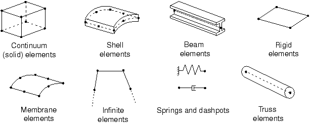
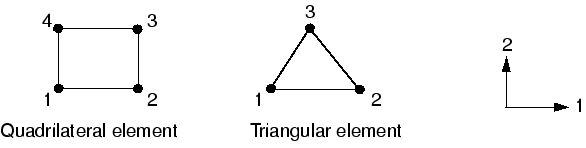

# 3.1 有限元

*Abaqus* 提供了广泛的单元库。这个丰富的单元库为您提供了一套强大的工具，可用于解决许多不同的问题。Abaqus/Explicit 中的单元（除了少数例外）是 Abaqus/Standard 中可用单元的子集。本节将向您介绍影响单元行为的五个方面。

## 3.1.1 单元特性

每个单元都具有以下特征：

- 单元族
- 自由度（与单元族直接相关）
- 节点数
- 公式
- 积分

Abaqus 中的每个单元都有唯一的名称，例如 T2D2、S4R 或 C3D8I。正如您在第 2 章"Abaqus 基础"中的架空起重机示例中所看到的，单元名称用作输入文件中 `*ELEMENT` 选项上 `TYPE` 参数的值。单元名称标识单元的五个方面。本章将解释命名约定。

**单元族**

图 3-1 显示了应力分析中最常用的单元族。不同单元族之间的主要区别之一是每个单元族所假定的几何类型。

**图 3-1** 常用单元族。



本指南中将使用的单元族——连续体单元、壳单元、梁单元、桁架单元和刚体单元——将在其他章节中详细讨论。本指南不涉及其他单元族；如果您有兴趣在模型中使用它们，请阅读《Abaqus 分析用户指南》第六部分"单元"。

单元名称的首字母或前几个字母表示该单元属于哪个族。例如，S4R 中的 S 表示这是壳单元，而 C3D8I 中的 C 表示这是连续体单元。

**自由度**

自由度（dof）是分析期间计算的基本变量。对于应力/位移模拟，自由度是每个节点处的平移。一些单元族（如梁族和壳族）也具有旋转自由度。对于热传递模拟，自由度是每个节点处的温度；因此，热传递分析需要使用与应力分析不同的单元，因为自由度不同。

Abaqus 中自由度的编号约定如下：

| 编号 | 含义 |
|------|------|
| 1 | 1 方向的平移 |
| 2 | 2 方向的平移 |
| 3 | 3 方向的平移 |
| 4 | 绕 1 轴的旋转 |
| 5 | 绕 2 轴的旋转 |
| 6 | 绕 3 轴的旋转 |
| 7 | 开截面梁单元的翘曲 |
| 8 | 声压、孔隙压力或静水压力 |
| 9 | 电势 |
| 10 | 连接器材料流量（长度单位）|
| 11 | 连续体单元的温度（或质量扩散分析中的归一化浓度），或梁和壳厚度假第一个点处的温度 |
| 12+ | 梁和壳厚度方向上其他点处的温度 |

方向 1、2 和 3 分别对应全局 1、2 和 3 方向，除非在节点处定义了局部坐标系。

轴对称单元是例外，其位移和旋转自由度称为：

| 编号 | 含义 |
|------|------|
| 1 | *r* 方向的平移 |
| 2 | *z* 方向的平移 |
| 6 | *r*-*z* 平面内的旋转 |

方向 *r*（径向）和 *z*（轴向）分别对应全局 1 和 2 方向，除非在节点处定义了局部坐标系。关于在节点处定义局部坐标系的讨论，请参阅第 5 章"使用壳单元"。

在本指南中，我们的关注点仅限于结构应用。因此，只讨论具有平移和旋转自由度的单元。有关其他类型单元（例如热传递单元）的信息，请参阅《Abaqus 分析用户指南》。

默认情况下，Abaqus/CAE 使用字母选项 *x-y-z* 来标记视图方向三轴。通常，本指南采用数字选项 1-2-3，以允许与自由度和输出标记直接对应。有关轴标记的更多信息，请参阅《Abaqus/CAE 用户指南》第 5.4 节"自定义视图三轴"。

**节点数——插值阶数**

在上一节中提到的位移、旋转、温度和其他自由度仅在单元的节点处计算。在单元中的任何其他点，位移通过从节点位移插值获得。通常，插值阶数由单元使用的节点数决定，如图 3-2 中的示例所示。

**图 3-2** 线性六面体、二次六面体和改进的四面体单元。


- 只有角节点处的单元（如 图 3-2(a) 所示的 8 节点六面体），在每个方向上使用线性插值，通常称为线性单元或一阶单元。
- 具有边中节点的单元（如 图 3-2(b) 所示的 20 节点六面体），使用二次插值，通常称为二次单元或二阶单元。
- 具有边中节点的改进三角形或四面体单元（如 图 3-2(c) 所示的 10 节点四面体），使用改进的二阶插值，通常称为改进单元或改进二阶单元。

Abaqus/Standard 提供了广泛的线性和二次单元选择。Abaqus/Explicit 仅提供线性单元，二次梁和改进的四面体和三角形单元除外。

通常，单元名称中清楚标明了单元中的节点数。如您所见，8 节点六面体单元称为 C3D8；8 节点通用壳单元称为 S8R。梁单元族使用略有不同的约定：插值阶数在名称中标识。因此，一阶三维梁单元称为 B31，二阶三维梁单元称为 B32。轴对称壳单元和膜单元使用类似的约定。

**公式**

单元公式是指用于定义单元行为的数学理论。在没有自适应网格划分的情况下，Abaqus 中的所有应力/位移单元都基于 *Lagrangian* 或 *material* 描述：与单元关联的材料在整个分析过程中保持与该单元关联，材料不能流过单元边界。在另一种 *Eulerian* 或 *spatial* 描述中，单元固定在空间中，材料流过它们。Eulerian 方法通常用于流体力学模拟。Abaqus/Standard 使用 Eulerian 单元来模拟对流热传递。自适应网格划分结合了纯 Lagrangian 和 Eulerian 分析的特征，并允许单元的运动独立于材料。本指南不讨论 Eulerian 单元和自适应网格划分。

为了适应不同类型的行为，Abaqus 中的一些单元族包含具有多种不同公式的单元。例如，壳单元族有三类：一类适用于通用壳分析，另一类适用于薄壳，还有一类适用于厚壳。（这些壳单元公式在第 5 章"使用壳单元"中有详细解释。）

一些 Abaqus/Standard 单元族具有标准公式以及一些替代公式。具有替代公式的单元通过单元名称末尾的附加字符标识。例如，连续体、梁和桁架单元族包括具有混合公式的成员，其中压力（连续体单元）或轴向力（梁和桁架单元）被视为附加未知量；这些单元通过名称末尾的字母"H"标识（如 C3D8H 或 B31H）。

一些单元公式允许求解耦合场问题。例如，名称以字母 C 开头并以字母 T 结尾的单元（如 C3D8T）同时具有机械和热自由度，适用于耦合热力模拟。

本指南稍后将讨论一些最常用的单元公式。

**积分**

Abaqus 使用数值技术在整个单元体积上积分各种量。对于大多数单元使用高斯积分，Abaqus 在每个单元的每个积分点评估材料响应。Abaqus 中的一些单元可以使用完全积分或减缩积分，这种选择对给定问题的单元精度可能有重大影响，详见第 4.1 节"单元公式和积分"。

Abaqus 使用单元名称末尾的字母"R"来区分减缩积分单元（除非它们也是混合单元，在这种情况下单元名称以"RH"结尾）。例如，CAX4 是 4 节点、完全积分、线性、轴对称实体单元；CAX4R 是同一单元的减缩积分版本。

Abaqus/Standard 提供完全积分和减缩积分单元；Abaqus/Explicit 仅提供减缩积分单元，改进的四面体和三角形单元以及完全积分的一阶壳、膜和六面体单元除外。

## 3.1.2 连续体单元

在不同单元族中，连续体或实体单元可用于对最多种类的组件进行建模。从概念上讲，连续体单元只是对组件中的一小块材料进行建模。由于它们可以在任何面上与其他单元连接，连续体单元，就像建筑中的砖块或马赛克中的瓷砖一样，可用于构建几乎任何形状、受几乎任何载荷的模型。Abaqus 具有应力/位移、非结构和耦合场连续体单元；本指南将仅讨论应力/位移单元。

Abaqus 中的连续体应力/位移单元的名称以字母"C"开头。接下来的两个字母表示维数，通常（但并非总是）表示单元中活跃的自由度。"3D"表示三维单元；"AX"表示轴对称单元；"PE"表示平面应变单元；"PS"表示平面应力单元。

连续体单元的详细使用在第 4 章"使用连续体单元"中进一步讨论。

**三维连续体单元库**

三维连续体单元可以是六面体（砖块）、楔形或四面体。三维连续体单元的完整清单和每种类型的节点连通性可在《Abaqus 分析用户指南》第 28.1.4 节"三维实体单元库"中找到。

在 Abaqus 中，应尽可能使用六面体单元或二阶四面体单元。一阶四面体（C3D4）具有简单的常应变公式，需要非常细的网格才能获得精确的解。

**二维连续体单元库**

Abaqus 有几类二维连续体单元，它们在面外行为上有所不同。二维单元可以是四边形或三角形。图 3-3 显示了最常用的三类。

**图 3-3** 无扭曲的平面应变、平面应力和轴对称单元。


平面应变单元假设面外应变为零；它们可用于模拟厚结构。

平面应力单元假设面外应力为零；它们适用于模拟薄结构。

无扭曲的轴对称单元，即"CAX"类单元，模拟 360° 圆环；它们适用于分析具有轴对称几何形状且承受轴对称载荷的结构。

Abaqus/Standard 还提供广义平面应变单元、带扭曲的轴对称单元和带非对称变形的轴对称单元。

- 广义平面应变单元增加了额外的广义化，即面外应变可能在模型平面内的位置上线性变化。这种公式特别适用于厚截面的热应力分析。
- 带扭曲的轴对称单元模拟初始轴对称几何形状，可以绕对称轴扭转。这些单元可用于模拟圆柱结构的扭转，如轴对称橡胶衬套。
- 带非对称变形的轴对称单元模拟初始轴对称几何形状，可以非对称变形（通常是弯曲的结果）。它们适用于模拟问题，例如承受剪切载荷的轴对称橡胶支架。

后三类二维连续体单元不在本指南中讨论。

二维实体单元必须定义在 1-2 平面中，以便节点顺序围绕单元周边逆时针排列，如图 3-4 所示。

**图 3-4** 二维单元的正确节点连通性。



使用前处理器生成网格时，确保所有单元法线指向与正的全局 3 轴相同的方向。如果未提供正确的单元连通性，Abaqus 将发出错误消息，指出单元面积为负。

**自由度**

所有应力/位移连续体单元在每个节点处都具有平移自由度。因此，三维单元中激活自由度 1、2 和 3，而平面应变单元、平面应力单元和无扭曲的轴对称单元中仅激活自由度 1 和 2。要查找其他二维实体单元类中的活跃自由度，请参阅《Abaqus 分析用户指南》第 28.1.3 节"二维实体单元库"。

**单元属性**

`*SOLID SECTION` 选项定义与一组连续体单元关联的材料和任何附加几何数据。对于三维和轴对称单元，不需要附加几何信息：节点坐标完全定义单元几何。对于平面应力和平面应变单元，必须在数据行上指定单元的厚度。例如，如果单元厚度为 0.2 m，则单元属性定义如下：

```abaqus
*SOLID SECTION, ELSET=<element set name>, MATERIAL=<material name>
0.2,
```

**公式和积分**

Abaqus/Standard 中连续体单元族可用的替代公式包括不兼容模式公式（元素名称中最后一个或倒数第二个字母是 I）和混合单元公式（元素名称中最后一个字母是 H），两者将在本指南后面详细讨论。

在 Abaqus/Standard 中，您可以为四边形和六面体（砖块）单元选择完全积分和减缩积分。在 Abaqus/Explicit 中，您可以为六面体（砖块）单元选择完全积分和减缩积分；但是，四边形一阶单元仅提供减缩积分。公式和积分类型的选择都可能对实体单元的精度产生重大影响，如第 4.1 节"单元公式和积分"中所讨论的。

**单元输出变量**

默认情况下，元素输出变量（如应力和应变）指的是全局笛卡尔坐标系。因此，图 3-5(a) 中积分点处的应力分量在该积分点沿全局 1 方向起作用。即使在大位移模拟期间单元旋转，如图 3-5(b) 所示，默认情况下仍使用全局笛卡尔系统作为定义单元变量的基础。

**图 3-5** 连续体单元的默认材料方向。


但是，Abaqus 允许您为单元变量定义局部坐标系（参见第 5.5 节"示例：斜板"）。在大位移模拟中，这个局部坐标系随单元的运动旋转。如果被建模的对象具有一些天然的材料方向（如复合材料中的纤维方向），局部坐标系非常有用。

## 3.1.3 壳单元

壳单元用于模拟一个维度（厚度）显著小于其他维度且厚度方向应力可忽略不计的结构。

Abaqus 中壳单元的名称以字母"S"开头。所有轴对称壳都以"SAX"开头。Abaqus/Standard 还提供以"SAXA"开头的带非对称变形的轴对称壳。壳单元名称中的第一个数字表示单元中的节点数，但轴对称壳除外，其第一个数字表示插值阶数。

Abaqus 中有两种类型的壳单元：常规壳单元和连续体壳单元。常规壳单元通过定义单元的平面尺寸、表面法线和初始曲率来离散化参考表面。另一方面，连续体壳单元类似于三维实体单元，因为它们离散化整个三维体，但公式化的运动学和本构行为与常规壳单元相似。本指南中只讨论常规壳单元。因此，今后我们将它们简称为"壳单元"。有关连续体壳单元的更多信息，请参阅《Abaqus 分析用户指南》第 29.6.1 节"壳单元：概述"。

壳单元的详细使用在第 5 章"使用壳单元"中讨论。

**壳单元库**

在 Abaqus/Standard 中，通用三维壳单元有三种不同的公式：通用、薄壳和厚壳。通用壳和带非对称变形的轴对称壳考虑了有限膜应变和任意大的旋转。三维"厚"和"薄"单元类型提供任意大的旋转，但仅限小应变。通用壳允许壳厚度随单元变形而变化。所有其他壳单元都假定小应变且壳厚度不变，即使单元节点可能经历有限旋转。提供线性和二次插值的三角形和四边形单元。提供线性和二次轴对称壳单元。所有四边形壳单元（S4 除外）和三角形壳单元 S3/S3R 使用减缩积分。S4 单元和其他三角形壳单元使用完全积分。表 3-1 总结了 Abaqus/Standard 中可用的壳单元。

**表 3-1** Abaqus/Standard 中的三类壳单元。

| 通用壳 | 薄壳 | 厚壳 |
|--------|------|------|
| S4, S4R, S3/S3R, SAX1, SAX2, SAX2T, SC6R, SC8R | STRI3, STRI65, S4R5, S8R5, S9R5, SAXA | S8R, S8RT |

Abaqus/Explicit 中的所有壳单元都是通用型的。提供有限膜应变和小膜应变公式。提供线性和二次插值的三角形和四边形单元。还提供线性轴对称壳单元。表 3-2 总结了 Abaqus/Explicit 中可用的壳单元。

**表 3-2** Abaqus/Explicit 中的两类壳单元。

| 有限应变壳 | 小应变壳 |
|------------|----------|
| S4, S4R, S3/S3R, SAX1 | S4RS, S4RSW, S3RS |

对于大多数显式分析，大应变壳单元是合适的。但是，如果分析涉及小膜应变和任意大的旋转，则小应变壳单元在计算上更高效。S4RS 和 S3RS 单元不考虑翘曲，而 S4RSW 单元则考虑。

Abaqus 中可用的壳公式在第 5 章"使用壳单元"中有详细讨论。

**自由度**

Abaqus/Standard 中名称以数字"5"结尾的三维单元（如 S4R5、STRI65）在每个节点处有 5 个自由度：三个平移和两个面内旋转（即绕壳法线无旋转）。但是，如果需要，节点处会激活所有六个自由度；例如，如果施加旋转边界条件，或者节点位于壳的折线处。

其余的三维壳单元在每个节点处有六个自由度（三个平移和三个旋转）。

轴对称壳在每个节点处有三个自由度关联：

| 编号 | 含义 |
|------|------|
| 1 | *r* 方向的平移 |
| 2 | *z* 方向的平移 |
| 6 | *r*-*z* 平面内的旋转 |

**单元属性**

使用 `*SHELL GENERAL SECTION` 或 `*SHELL SECTION` 选项为一组壳单元定义厚度和材料属性。这两个选项具有相似的格式：

```abaqus
*SHELL SECTION, ELSET=<element set name>, MATERIAL=<material name>
<thickness>,<number of section points>
```

或

```abaqus
*SHELL GENERAL SECTION, ELSET=<element set name>,
MATERIAL=<material name>
<thickness>
```

如果指定 `*SHELL SECTION` 选项，Abaqus 使用数值积分来计算壳厚度上选定点的行为。这些点称为截面点，如图 3-6 所示。`MATERIAL` 参数引用材料属性定义，可以是线性或非线性的。您可以指定通过壳厚度的任意奇数个截面点。

**图 3-6** 壳单元厚度方向的截面点。


`*SHELL GENERAL SECTION` 选项允许您以多种通用方式定义横截面行为，以模拟线性或非线性行为。由于 Abaqus 使用此选项直接以截面工程量（面积、惯性矩等）的形式对壳的横截面行为进行建模，因此 Abaqus 不需要在元素横截面上积分任何量。因此，`*SHELL GENERAL SECTION` 在计算上比 `*SHELL SECTION` 便宜。响应以力和弯矩合力的形式计算；只有当请求输出时才会计算应力和应变。

**参考表面偏移**

壳的参考表面由壳单元的节点和法线定义。在使用壳单元建模时，参考表面通常与壳的中面重合。但是，在许多情况下，更方便的是将参考表面定义为偏离壳的中面。例如，CAD 包中创建的曲面通常代表壳体的顶面或底面。在这种情况下，更容易将参考表面定义为与 CAD 曲面重合，因此偏离壳的中面。

壳偏移也可用于为接触问题定义更精确的表面几何，其中壳厚度很重要。默认情况下，Abaqus/Explicit 中的接触约束考虑了壳偏移和厚度。如果需要，可以抑制接触中偏移和厚度的影响。

当模拟具有连续变化厚度的壳时，壳偏移也很有用。在这种情况下，在壳的中平面定义节点可能很困难。如果一个表面光滑而另一个表面粗糙（如某些飞机结构中），最简单的方法是使用壳偏移在光滑表面上定义节点。

可以通过在 `*SHELL SECTION` 和 `*SHELL GENERAL SECTION` 选项上使用 `OFFSET` 参数引入偏移。偏移值定义为从壳的中面到壳的参考表面的壳厚度的分数。

壳的自由度与参考表面关联。单元的面积和所有运动学量都在那里计算。对于弯曲壳，大的偏移值可能导致表面积分误差，影响壳截面的刚度、质量和转动惯量。为了稳定性目的，Abaqus/Explicit 还会自动增加壳单元使用的转动惯量，约为偏移量的平方，这可能导致大偏移的动力学误差。当需要偏离壳中面的大偏移时，请改用多点约束或刚体约束。

**单元输出变量**

壳的单元输出变量根据位于每个壳单元表面上的局部材料方向定义。在所有大位移模拟中，这些轴随单元的变形而旋转。您还可以定义一个局部材料坐标系，在大位移分析中随单元的变形而旋转。

## 3.1.4 梁单元

梁单元用于模拟一个维度（长度）显著大于其他两个维度且仅沿梁轴方向的应力才重要的组件。

Abaqus 中梁单元的名称以字母"B"开头。下一个字符表示单元的维数："2"表示二维梁，"3"表示三维梁。第三个字符表示所使用的插值："1"表示线性插值，"2"表示二次插值，"3"表示三次插值。

梁单元的使用在第 6 章"使用梁单元"中讨论。

**梁单元库**

线性、二次和三次梁在二维和三维中都可用。Abaqus/Explicit 中没有三次梁。

**自由度**

三维梁在每个节点处有六个自由度：三个平移自由度（1-3）和三个旋转自由度（4-6）。"开截面"型梁（如 B31OS）在 Abaqus/Standard 中可用，具有额外的自由度（7），代表梁横截面的翘曲。

二维梁在每个节点处有三个自由度：两个平移自由度（1 和 2）以及绕模型平面法线的一个旋转自由度（6）。

**单元属性**

使用 `*BEAM SECTION` 或 `*BEAM GENERAL SECTION` 选项定义梁横截面的几何形状；节点坐标仅定义长度。

如果指定 `*BEAM SECTION` 选项，梁横截面在几何上定义，`MATERIAL` 参数引用材料属性定义。Abaqus 通过对横截面进行数值积分来计算梁的横截面行为，允许线性和非线性材料行为。

`*BEAM GENERAL SECTION` 选项允许您以多种通用方式定义横截面行为，以模拟线性或非线性行为。由于 Abaqus 使用此选项直接以截面工程量（面积、惯性矩等）的形式对梁的横截面行为进行建模，因此 Abaqus 不需要在元素横截面上积分任何量。因此，`*BEAM GENERAL SECTION` 在计算上比 `*BEAM SECTION` 便宜。响应以力和弯矩合力的形式计算；只有当请求输出时才会计算应力和应变。

在 Abaqus/Standard 中，您还可以定义具有线性锥形横截面的梁。支持具有线性响应的通用梁截面和标准库截面。

**公式和积分**

线性梁（B21 和 B31）和二次梁（B22 和 B32）是剪切变形的，并考虑有限的轴向应变；因此，它们适用于模拟细长和粗短梁。Abaqus/Standard 中的三次梁单元（B23 和 B33）不考虑剪切柔度，假定小轴向应变，尽管梁的大位移和旋转是有效的。因此，它们适用于模拟细长梁。

Abaqus/Standard 提供了适用于模拟薄壁开截面梁（ B31OS 和 B32OS）的线性和二次梁单元变体。这些单元模拟扭转和翘曲在开截面（如工字梁或 U 形通道）中的影响。本指南不涉及开截面梁。

Abaqus/Standard 还具有混合梁单元，用于模拟非常细长的构件（如海上石油设施的柔性立管）或非常硬的连杆。本指南不涉及混合梁。

**单元输出变量**

三维剪切变形梁单元中的应力分量是轴向应力（）和扭转产生的剪切应力（）。剪切应力作用在薄壁截面的截面壁上。还提供相应的应变度量。剪切变形梁还提供横截面上横向剪切力的估计。Abaqus/Standard 中的细长（三次）梁仅将轴向变量作为输出。空间中的开截面梁也仅将轴向变量作为输出，因为扭转剪切应力在这种情况下可以忽略不计。

所有二维梁仅使用轴向应力和应变。

轴向力、弯矩和关于局部梁轴的曲率也可以请求输出。有关哪些单元可用哪些组件的详细信息，请参阅《Abaqus 分析用户指南》第 29.3.1 节"梁建模：概述"。局部梁轴的定义详见第 6 章"使用梁单元"。

## 3.1.5 桁架单元

桁架单元是只能承受拉伸或压缩载荷的杆。它们对弯曲没有抵抗力；因此，它们可用于模拟销接头框架。此外，桁架单元可用作电缆或弦的近似（例如网球拍中）。桁架有时也用于表示其他单元内的加固。第 2 章"Abaqus 基础"中的架空起重机模型使用了桁架单元。

所有桁架单元名称都以字母"T"开头。接下来的两个字符表示单元的维数——"2D"表示二维桁架，"3D"表示三维桁架。最后一个字符表示单元中的节点数。

**桁架单元库**

线性桁架和二次桁架在二维和三维中都可用。Abaqus/Explicit 中没有二次桁架。

**自由度**

桁架单元在每个节点处只有平移自由度。三维桁架单元具有自由度 1、2 和 3，而二维桁架单元具有自由度 1 和 2。

**单元属性**

`*SOLID SECTION` 选项用于指定与给定桁架单元集关联的材料属性定义的名称。横截面积在数据行上给出：

```abaqus
*SOLID SECTION, ELSET=<element set name>, MATERIAL=<material>
<cross-sectional area>
```

**公式和积分**

除了标准公式外，Abaqus/Standard 中还提供了混合桁架单元公式。它可用于模拟刚度远大于整体结构的非常硬的连杆。

**单元输出变量**

轴向应力和应变可作为桁架单元的输出。
