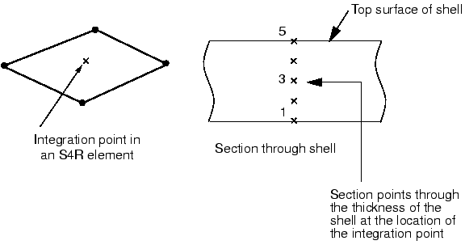
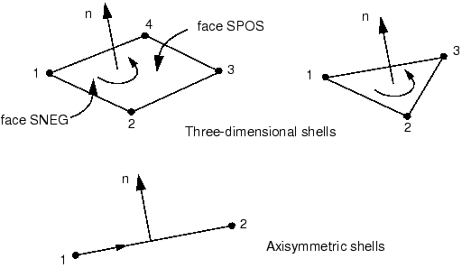

# 5.1 单元几何

Abaqus 中有两种壳单元可供选择：常规壳单元和连续壳单元。常规壳单元通过定义单元的平面尺寸、表面法向和初始曲率来离散参考表面。然而，常规壳单元的节点不定义壳的厚度；厚度通过截面属性定义。另一方面，连续壳单元类似于三维实体单元，因为它们离散整个三维实体，但公式化使其运动学和本构行为与常规壳单元相似。连续壳单元在接触建模中更精确，因为它们采用双侧接触并考虑厚度的变化。然而，对于薄壳应用，常规壳单元提供更好的性能。

本指南仅讨论常规壳单元。此后，我们将其简称为"壳单元"。有关连续壳单元的更多信息，请参阅《Abaqus Analysis User's Guide》第29.6.1节"壳单元：概述"。

## 5.1.1 壳厚度和截面点

壳厚度用于描述壳横截面，必须指定。除了指定壳厚度，您还可以选择在分析过程中计算截面刚度，或在分析开始时仅计算一次。您可以使用 `*SHELL SECTION` 或 `*SHELL GENERAL SECTION` 选项定义壳厚度。

如果您使用 `*SHELL SECTION` 选项，Abaqus 使用数值积分来独立计算壳厚度方向上每个截面点（积分点）的应力和应变，从而允许非线性材料行为。例如，弹塑性壳可能在外部截面点屈服，而在内部截面点保持弹性。S4R（4节点、减缩积分）单元中单个积分点的位置以及壳厚度方向上截面点的配置如图5-1所示。

**图5-1** 数值积分壳中截面点的配置。

您可以使用 `*SHELL SECTION` 选项指定壳厚度方向上的任意奇数个截面点。默认情况下，Abaqus 在均质壳的厚度方向上使用五个截面点，这对于大多数非线性设计问题已足够。然而，在某些复杂模拟中应使用更多截面点，特别是当您预期出现反向塑性弯曲时（这种情况下通常九个就足够）。对于线性问题，三个截面点可提供精确的厚度方向积分。然而，`*SHELL GENERAL SECTION` 选项对于线弹性壳更高效。

如果您使用 `*SHELL GENERAL SECTION` 选项，材料行为必须是线弹性的，因为横截面刚度仅在模拟开始时计算一次。在这种情况下，所有计算都以整个横截面上的合成力和力矩进行。如果您请求应力或应变输出，Abaqus 提供底面、中面和顶面的默认输出。

## 5.1.2 壳法向和壳表面

壳单元的连接性定义了正法向的方向，如图5-2所示。

**图5-2** 壳的正法向。

对于轴对称壳单元，正法向方向定义为从节点1到节点2方向逆时针旋转90度的方向。对于三维壳单元，正法向由按照单元定义中节点出现顺序绕节点应用的右手定则给出。

壳的"顶"表面是沿正法向方向的表面，在接触定义中称为 SPOS 面。"底"表面是沿法向负方向的表面，在接触定义中称为 SNEG 面。相邻壳单元的法向应保持一致。

正法向方向定义了单元基压力载荷施加和通过壳厚度变化的量的输出的约定。施加到壳单元上的正单元基压力载荷产生沿正法向方向作用的载荷。（壳单元的单元基压力载荷约定与连续单元相反；壳和连续单元的表面基压力载荷约定相同。有关单元基和表面基分布式载荷之间的差异的更多信息，请参阅《Abaqus Analysis User's Guide》第34.4.3节"分布式载荷"。）

## 5.1.3 初始壳曲率

Abaqus 中的壳（元素类型 S3/S3R、S3RS、S4R、S4RS、S4RSW 和 STRI3 除外）被公式化为真正的曲壳单元；真正的曲壳单元需要在精确计算初始表面曲率方面特别注意。Abaqus 自动计算每个壳单元节点处的表面法向来估计壳的初始曲率。每个节点处的表面法向使用相当复杂的算法确定，这在《Abaqus Analysis User's Guide》第29.6.3节"定义常规壳单元的初始几何"中有详细讨论。

对于如图5-3所示的粗网格，Abaqus 可能在同一节点处为相邻单元确定多个独立的表面法向。物理上，单个节点处的多个法向意味着共享该节点的单元之间存在折叠线。虽然您可能有意建模这样的结构，但更可能您打算建模一个光滑曲壳；Abaqus 将尝试通过在节点处创建平均法向来平滑壳。

**图5-3** 网格细化对节点表面法向的影响。

使用的基本平滑算法如下：如果节点处每个壳单元的法向彼此在20度以内，则对这些法向进行平均。该平均法向将用于该节点处所有共享该节点的单元。如果 Abaqus 无法平滑壳，则会在数据（.dat）文件中发出警告消息。

您可以覆盖默认算法。要将折叠线引入曲壳或用粗网格建模曲壳，请使用 `*NODE` 和 `*NORMAL` 选项手动定义法向。使用 `*NODE` 选项，您可以在数据行中节点坐标之后将表面法向指定为第4、第5和第6个值。使用 `*NODE` 定义的法向是共享该节点的所有单元使用的法向，除非也使用了 `*NORMAL`。使用 `*NORMAL` 选项为所选单元指定节点处的法向。使用 `*NORMAL` 定义的法向覆盖使用 `*NODE` 定义的法向。有关更多详细信息，请参阅《Abaqus Analysis User's Guide》第29.6.3节"定义常规壳单元的初始几何"。

## 5.1.4 参考表面偏移

壳的参考表面由壳单元的节点和法向定义定义。使用壳单元建模时，参考表面通常与壳的中面重合。然而，在许多情况下，将参考表面定义为与壳的中面偏移更为方便。例如，CAD 包中创建的表面通常代表壳体的顶面或底面。在这种情况下，将参考表面定义为与 CAD 表面重合（因此与壳的中面偏移）可能更容易。

壳偏移也可用于为接触问题定义更精确的表面几何，其中壳厚度很重要。另一个需要中面偏移的情况是对厚度连续变化的壳进行建模。在这种情况下，在壳的中平面定义节点可能很困难。如果一个表面光滑而另一个表面粗糙（如某些飞机结构中），最简单的方法是使用壳偏移在光滑表面上定义节点。

偏移可以通过指定偏移值来引入，偏移值定义为从壳的中面到包含单元节点的参考表面的距离（以壳厚度的分数表示）。偏移的正值在正法向方向。当偏移设置为0.5或 SPOS 时，壳的顶面是参考表面。当偏移设置为-0.5或 SNEG 时，底面是参考表面。默认偏移为0，表示壳的中面是参考表面。这三种参考表面偏移设置如图5-4所示，其中调整节点位置以保持中面的位置不变。

**图5-4** 偏移值为0、-0.5和+0.5时壳偏移的示意图。

壳的自由度与参考表面相关。单元的面积和所有运动学量都在那里计算。对于曲壳，大的偏移值可能导致表面积分误差，影响壳截面的刚度、质量和转动惯量。出于稳定性目的，Abaqus/Explicit 还会自动增加用于壳单元的转动惯量，其数量级为偏移的平方，这可能导致大偏移时动力学方面的误差。当需要大的中面偏移时，请改用多点约束或刚体约束。
