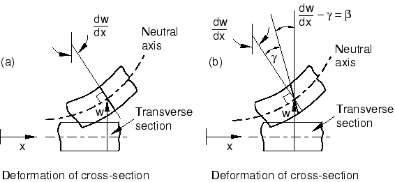

# 5.2 壳单元公式 – 厚壳或薄壳

壳问题通常分为两类：薄壳问题和厚壳问题。厚壳问题假设横向剪切变形效应对求解结果有重要影响。另一方面，薄壳问题则假设横向剪切变形很小，可以忽略不计。[图5-5](ch05s02.html#gss-transhellsect-shell)（a）说明了薄壳的横向剪切行为：最初垂直于壳面的物质线在整个变形过程中保持直线且垂直。因此，横向剪切应变被假设为零（）。[图5-5](ch05s02.html#gss-transhellsect-shell)（b）说明了厚壳的横向剪切行为：最初垂直于壳面的物质线在变形过程中不一定保持垂直于壳面，从而增加了横向剪切柔度（）。

**图5-5** 横向壳截面的行为：（a）薄壳和（b）厚壳。

Abaqus提供多种类型的壳单元，以单元对薄壳和厚壳问题的适用性进行区分。通用壳单元适用于厚壳和薄壳问题。在某些特定应用中，通过使用Abaqus/Standard中的专用壳单元可以获得更好的性能。

专用壳单元分为两类：仅适用于薄壳的单元和仅适用于厚壳的单元。所有专用壳单元都允许任意大的旋转，但只适用于小应变。仅适用于薄壳的单元强制执行Kirchhoff约束；即，垂直于壳中面的平面截面保持垂直于中面。Kirchhoff约束可以在单元公式中解析执行（STRI3），也可以通过惩罚约束数值执行。仅适用于厚壳的单元是二阶四边形单元，在小应变应用中，当载荷使得解决方案在壳跨度上平滑变化时，可能比通用壳单元产生更准确的结果。

为了确定给定应用是薄壳问题还是厚壳问题，我们可以提供一些指导原则。对于厚壳，横向剪切柔度很重要，而对于薄壳，横向剪切柔度可以忽略不计。壳中横向剪切的重要性可以通过其厚度与跨度的比值来估计。由单一各向同性材料制成的壳，如果比值大于1/15，则被认为是"厚壳"；如果比值小于1/15，则被认为是"薄壳"。这些估计是近似的，您应该始终检查模型中的横向剪切效应，以验证所假设的壳行为。由于横向剪切柔度在层压复合壳结构中可能很重要，因此对于"薄壳"理论适用的复合壳，此比值应该小得多。具有非常柔软内层（所谓的" sandwich "复合材料的复合壳具有非常低的横向剪切刚度，几乎始终应该用"厚壳"建模；如果平面截面保持平面的假设被违反，则应使用连续体单元。有关检查壳理论适用性的详细信息，请参阅《Abaqus Analysis User's Guide》第29.6.4节"Shell section behavior"。

横向剪切力和应变适用于通用壳单元和仅适用于厚壳的单元。对于三维单元，提供横向剪切应力的估计。这些应力的计算忽略了弯曲和扭转变形之间的耦合，并假设材料性能和弯矩的空间梯度很小。
