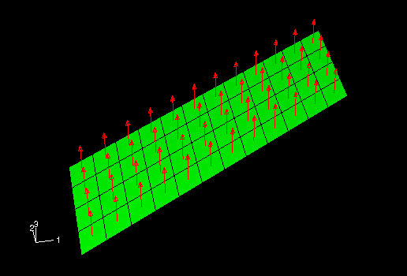
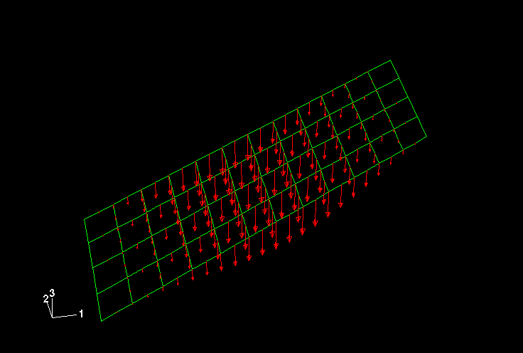
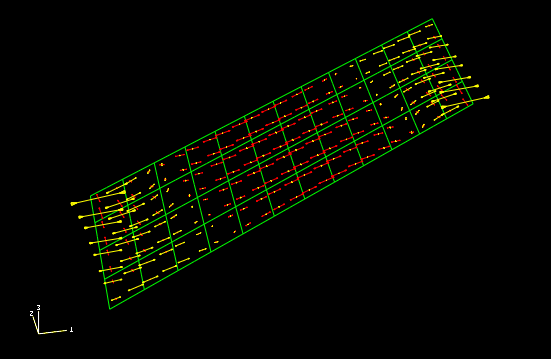

# 5.5 示例：斜板

您需要建立如图5-10所示板模型。该板相对于全局1轴倾斜30度，一端固定，另一端约束在平行于板轴线的轨道上只能沿轴向移动。您需要确定板在均匀压力作用下的跨中挠度，同时评估线性分析是否适用于此问题。您将使用Abaqus/Standard进行分析。

**图5-10** 斜板示意图


## 5.5.1 坐标系

结构相对于全局坐标系的方向以及建议的坐标原点如图5-10所示。板位于全局1-2平面内。如果在此模型中使用壳单元的默认材料方向，您能容易地解释模拟结果吗？

## 5.5.2 网格设计

图5-11所示为建议的网格划分方案。

**图5-11** 斜板模拟的建议网格设计


在选择单元类型之前，您必须回答以下问题：板是薄板还是厚板？应变是小应变还是大应变？板相当薄，厚跨比为0.02（厚度为0.8 cm，最小跨度为40 cm）。虽然我们无法直接预测结构中的应变大小，但认为应变较小。基于这些信息，您选择二次壳单元（S8R5），因为它们在薄壳小应变模拟中能提供准确结果。关于壳单元选择的更多详细信息，请参阅《Abaqus分析用户手册》第29.6.2节"选择壳单元"。

## 5.5.3 预处理——创建模型

斜板示例的输入文件为`skew.inp`，可在"斜板"（A.3节）中找到。此示例使用图5-11所示的网格，通过创建图5-12所示的节点集，并将所有单元存储在名为`PLATE`的单元集中。

**图5-12** 斜板模拟所需的节点集


以下步骤描述了如何在输入文件中定义材料和历史信息。通过此练习，您将更好地理解各种选项块如何组合来定义Abaqus模型。如果您希望使用Abaqus/CAE创建完整模型，请参阅《Abaqus交互版入门》第5.5节"示例：斜板"。

在开始建立模型之前，请先确定单位制。尺寸以cm给出，但载荷和材料性质以MPa和GPa给出。由于这些单位不一致，您必须选择一致的单位制用于模型，并转换必要的输入数据。

## 5.5.4 审查输入文件——模型数据

此时，我们假设您已使用前处理器创建了基本网格。在本节中，您将审查并修正输入文件，以及包含其他信息（如材料数据）。

**模型描述**

以下内容适合作为此模拟的`HEADING`选项的描述：

```
HEADING
44  Linear Elastic Skew Plate. 20 kPa Load.
45  S.I. Units (meters, newtons, sec, kilograms)
```

它清楚地说明了您要建模的内容以及所使用的单位。

**单元连通性**

检查以确保您使用的是正确的单元类型（S8R5）。有可能您在前处理器中指定了错误的单元类型，或者翻译器在生成输入文件时出错。模型中的`ELEMENT`选项块应以下列内容开头：

```
ELEMENT, TYPE=S8R5, ELSET=PLATE
```

在某些示例中，`ELSET`参数的名称可能不是像`PLATE`这样的描述性名称。如果需要，您可以更改这些值，因为节点和单元集的有意义名称使输入文件易于理解。

**节点集**

图5-12所示的三个节点集在完成板模型时非常有用。这些节点集使用`NSET`选项块在输入文件中描述。

**定义替代材料方向**

如果您使用默认的材料方向，材料1方向的正应力（由板的弯曲产生的轴向应力和垂直于板轴线的横向应力合成）将包含两种贡献。如果材料方向与板的轴线和横向方向对齐，则更容易解释结果。因此，需要一个局部直角坐标系，其中局部1方向沿板轴线（即相对于全局1轴倾斜30度），局部2方向也在板的平面内。

正如您在5.3节"壳材料方向"中所学，`ORIENTATION`选项定义了这样一个局部坐标系。选择点a（参见图5-8）坐标为(10.0E-2, 5.77E-2, 0.)——使得tanθ = tan 30°——选择点b坐标为(-5.77E-2, 10.E-2, 0.)。您还必须指定哪个轴不投影到壳表面上（在本模型中为3方向）以及附加旋转角（使用此方法时为零）。以下`ORIENTATION`选项块创建了名为`SKEW`的正确的局部坐标系：

```
ORIENTATION, NAME=SKEW, SYSTEM=RECTANGULAR
46  10.0E-2,5.77E-2,0.0, -5.77E-2,10.0E-2,0.0
47  3, 0.0
```

或者，您可以通过选择点a和点b位于全局坐标1轴和2轴上，并指定30度的附加旋转来定义完全相同的局部坐标系：

```
ORIENTATION, NAME=SKEW, SYSTEM=RECTANGULAR
48  1., 0., 0., 0., 1., 0.
49  3, 30.
```

**截面属性**

由于结构由单一材料和恒定厚度组成，因此所有元素的截面属性相同。因此，您可以使用单元集`PLATE`（包含所有单元）来为元素分配物理和材料属性。由于您假设板为线弹性，使用`SHELL GENERAL SECTION`选项比使用`SHELL SECTION`选项更有效。以下元素属性选项块定义此示例的截面属性：

```
SHELL GENERAL SECTION, ELSET=PLATE, MATERIAL=MAT1,
51  0.8E-2,
```

`ORIENTATION`参数告诉Abaqus使用名为`SKEW`的局部坐标系来定义`PLATE`单元集中壳的材料方向。所有单元变量将在`SKEW`坐标系中定义。

**材料属性**

板由各向同性线弹性材料制成，弹性模量为30.0 GPa，泊松比为0.3。以下材料选项块指定此材料数据：

```
MATERIAL, NAME=MAT1
52  *ELASTIC
53  30.0E9, 0.3
```

**节点处的局部方向**

虽然`ORIENTATION`选项为单元定义了局部坐标系，但您必须使用`TRANSFORM`选项为节点定义局部坐标系。这两个选项完全独立。如果节点引用使用`TRANSFORM`定义的局部坐标系，则与该节点相关的所有数据（如边界条件、集中载荷或节点输出变量（位移、速度、反作用力等））都在变换后的坐标系中定义。

`TRANSFORM`选项具有以下格式：

```
TRANSFORM, NSET=<节点集名称>, TYPE=<轴类型>
54  <x1>, <y1>, <z1>, <x2>, <y2>, <z2>
```

数据行以与`ORIENTATION`选项非常相似的方式指定两个点a和b的坐标。使用`TRANSFORM`定义的坐标系不会随物体变形而旋转；它在模拟开始时定义的方向上是固定的。可以指定直角（`TYPE`=`R`）、圆柱（`TYPE`=`C`）和球形（`TYPE`=`S`）坐标系。使用`NSET`参数指定使用此局部坐标系的节点集。

如图5-10所示，板的一端被约束在平行于板轴线的轨道上运动。由于此边界条件与全局轴不一致，您必须将此端的节点变换到一个与板轴线对齐的局部坐标系中。以下`TRANSFORM`选项实现此变换：

```
TRANSFORM, NSET=ENDB, TYPE=R
55  10.0E-2,5.77E-2,0.0, -5.77E-2,10.0E-2,0.0
```

此选项块在局部坐标系中定义节点集`ENDB`的自由度，其中1轴与板的长轴对齐（即局部系统相对于全局3轴旋转30度）。

## 5.5.5 审查输入文件——历史数据

现在我们审查输入文件的历史定义部分。此模拟需要一个单步骤。

**步骤定义**

`STEP`定义指定线性静态模拟：

```
STEP, PERTURBATION
56  Uniform pressure (20.0 kPa) load
57  *STATIC
```

`STEP`后面的行包含此步骤施加的载荷的清晰描述。

**边界条件**

板左端（节点集`ENDA`）的节点需要通过以下边界条件完全约束：

```
BOUNDARY
58  ENDA, ENCASTRE
```

板右端的节点需要被约束以模拟其"轨道"边界条件。由于您已使用`TRANSFORM`变换了此端的节点，因此必须在局部坐标系中施加边界条件。为了允许这些节点仅沿局部1方向（沿板轴线）移动，所有其他自由度必须按如下方式约束：

```
ENDB, 2,6
```

如果您没有定义节点集`ENDA`和`ENDB`，您就必须为每个节点创建一个数据行。

**载荷**

在此模拟中，板承受20.0 kPa的分布压力载荷。如图5-10所示，压力作用于负全局3方向。压力载荷使用`DLOAD`选项施加到单元的面（`DLOAD`在第4章"使用连续体单元"的销钉模型示例中有描述）。壳单元只有一个面；因此，压力载荷标识符就是"P"。壳上的正压力沿正单元法线方向作用。来自A.3节"斜板"的输入文件中的壳单元法线与正全局3轴对齐。因此，以下输入在该模型中定义了正确的压力载荷：

```
DLOAD
59  PLATE, P, -20000.0
```

由于单元集`PLATE`包含模型中的所有单元，此选项块将压力载荷施加到模型中的所有单元。

**输出请求**

如果前处理器生成了默认输出请求选项，您应该删除它们。要创建用于Abaqus/Viewer的输出数据库（.odb）文件以及单元应力、节点反作用力和力矩以及板跨中位移的打印表，输入文件中包含以下输出请求：

```
OUTPUT, FIELD, OP=NEW
60  *NODE OUTPUT
61  U, RF
62  *ELEMENT OUTPUT
63  S, E
64  *OUTPUT, HISTORY, OP=NEW
65  *NODE OUTPUT, NSET=MIDSPAN
66  U,
67  *EL PRINT
68  S,
69  E,
70  *NODE PRINT, SUMMARY=NO, TOTALS=YES, GLOBAL=YES
71  RF,
72  *NODE PRINT, NSET=MIDSPAN
73  U,
```

指定`OUTPUT`选项会覆盖前几章中提到的默认输出选择。此选项与`FIELD`和`HISTORY`参数一起使用，用于请求输出数据库文件的场输出和历史输出。通常，场输出用于生成等值线图、符号图和变形形状图；历史输出用于X-Y绘图。结合`OUTPUT`选项，`NODE OUTPUT`选项用于请求节点变量的输出，`ELEMENT OUTPUT`选项用于单元变量的输出。

## 5.5.6 运行分析

将输入保存到名为`skew.inp`的文件后，交互式运行分析。如果您不记得如何运行分析，请参见4.3.6节"运行分析"。如果您的分析未完成，请检查数据文件`skew.dat`中的错误消息。修改输入文件以消除错误；如果您仍然无法运行模型，请将您的输入文件与A.3节"斜板"中给出的文件进行比较。

## 5.5.7 结果

成功运行模拟后，查看数据文件`skew.dat`中的应力表。表的部分内容如下所示。

```
   THE FOLLOWING TABLE IS PRINTED FOR ALL ELEMENTS WITH TYPE S8R5 AT THE INTEGRATION POINTS

    ELEMENT  PT SEC FOOT-   S11         S22         S12
                 PT NOTE

           1   1  1  OR -4.2759E+07 -9.3051E+06  6.7584E+06
           1   1  3  OR  4.2759E+07  9.3051E+06 -6.7584E+06
           1   2  1  OR -7.4724E+07 -2.7832E+06  1.0599E+07
           1   2  3  OR  7.4724E+07  2.7832E+06 -1.0599E+07
           1   3  1  OR -7.3273E+07 -2.8832E+07  2.1403E+07
           1   3  3  OR  7.3273E+07  2.8832E+07 -2.1403E+07
           1   4  1  OR -8.2885E+07 -1.8951E+07  1.4786E+07
           1   4  3  OR  8.2885E+07  1.8951E+07 -1.4786E+07
           :
           :
         114   1  1  OR -8.2885E+07 -1.8951E+07  1.4786E+07
         114   1  3  OR  8.2885E+07  1.8951E+07 -1.4786E+07
         114   2  1  OR -7.3273E+07 -2.8832E+07  2.1403E+07
         114   2  3  OR  7.3273E+07  2.8832E+07 -2.1403E+07
         114   3  1  OR -7.4724E+07 -2.7832E+06  1.0599E+07
         114   3  3  OR  7.4724E+07  2.7832E+06 -1.0599E+07
         114   4  1  OR -4.2759E+07 -9.3051E+06  6.7584E+06
         114   4  3  OR  4.2759E+07  9.3051E+06 -6.7584E+06

 MAXIMUM                2.3826E+08  1.0326E+08  7.0025E+07
 ELEMENT                        4           4           4

 MINIMUM               -2.3826E+08 -1.0326E+08 -7.0025E+07
 ELEMENT                        4           4           4

 OR: *ORIENTATION USED FOR THIS ELEMENT
```

第二列（SEC PT——截面点）标识计算应力在单元中的位置。截面点1位于壳的SNEG表面，截面点3位于SPOS表面。FOOTNOTE列中出现字母OR，表示该单元使用了`ORIENTATION`选项：应力参照局部坐标系。

检查小应变假设是否对此模拟有效。与峰值应力对应的轴向应变为0.008。由于应变通常被认为小于4%或5%时属于小应变，0.8%的应变完全在适合用S8R5单元建模的范围内。

查看以下表中的反作用力和力矩：

```
   THE FOLLOWING TABLE IS PRINTED FOR ALL NODES

       NODE FOOT-   RF1         RF2         RF3         RM1         RM2         RM3
            NOTE

          1       0.000       0.000      -109.9       1.775     -0.3283       0.000
          2       0.000       0.000       6.448       7.597      -36.46       0.000
          3       0.000       0.000       239.9       6.568      -35.46       0.000
          4       0.000       0.000       455.4       6.806      -88.26       0.000
          5       0.000       0.000       260.5       6.948      -51.13       0.000
          6       0.000       0.000       750.8       8.305      -126.5       0.000
          7       0.000       0.000       73.90       8.749      -62.23       0.000
          8       0.000       0.000       2286.       31.06      -205.8       0.000
          9       0.000       0.000       37.19      -1.610      -76.45       0.000
       1201       0.000       0.000       37.19       1.610       76.45       0.000
       1202       0.000       0.000       2286.      -31.06       205.8       0.000
       1203       0.000       0.000       73.90      -8.749       62.23       0.000
       1204       0.000       0.000       750.8      -8.305       126.5       0.000
       1205       0.000       0.000       260.5      -6.948       51.13       0.000
       1206       0.000       0.000       455.4      -6.806       88.26       0.000
       1207       0.000       0.000       239.9      -6.568       35.46       0.000
       1208       0.000       0.000       6.448      -7.597       36.46       0.000
       1209       0.000       0.000      -109.9      -1.775      0.3283       0.000

 TOTAL          0.000       0.000       8000.      3.7096E-11 -1.8769E-09   0.000
```

由于我们请求反作用力输出时使用了`GLOBAL`=`YES`（在`NODE PRINT`选项上），反作用力以全局坐标系写出。否则，节点的反作用力将以局部坐标系写出。检查反作用力和反作用力矩的总和与相应施加的载荷是否为零。3方向上的非零反作用力平衡了压力载荷的垂直力（20 kPa × 1.0 m × 0.4 m）。除了反作用力外，压力载荷还会在约束的旋转自由度上引起自平衡的反作用力矩。

位移表（此处未显示）表明板跨中的挠度为5.3 cm，约为板长的5%。通过将此作为线性分析，我们假设位移很小。这些位移是否相对于结构尺寸真正属于小位移是值得怀疑的；非线性效应可能很重要，需要进一步研究。在这种情况下，我们需要执行几何非线性分析，这将在第8章"非线性"中讨论。

## 5.5.8 后处理

本节讨论使用Abaqus/Viewer进行后处理。等值线图和符号图都可用于可视化壳分析结果。由于等值线绘图已在第4章"使用连续体单元"中详细讨论过，因此我们在此使用符号图。

通过在操作系统提示符下键入以下命令启动Abaqus/Viewer：

```
abaqus viewer odb=skew
```

默认情况下，Abaqus/Viewer绘制模型的未变形形状。

**单元法线**

使用未变形形状图检查模型定义。检查斜板模型的单元法线是否正确定义并指向正3方向。

**显示单元法线的步骤：**

1. 从主菜单栏，选择**选项 → 通用**；或使用工具箱中的绘图通用选项工具。

    出现"通用绘图选项"对话框。

2. 点击**法线**选项卡。

3. 开启**显示法线**，并接受**在单元上**的默认设置。

4. 点击**确定**应用设置并关闭对话框。

默认视图为等轴测视图。您可以使用视图菜单中的选项或"视图操作"工具栏中的视图工具来更改视图。

**更改视图的步骤：**

1. 从主菜单栏，选择**视图 → 指定**。

    出现"指定视图"对话框。

2. 从可用方法列表中，选择**视点**。

3. 将视点向量的坐标输入为(-0.2, -1, 0.8)，向上向量的坐标输入为(0, 0, 1)。

4. 点击**确定**。

    Abaqus/Viewer以指定视图显示模型，如图5-13所示。

**图5-13** 斜板模型中的壳单元法线



**符号图**

符号图将指定变量显示为从节点或单元积分点发出的向量。您可以生成大多数张量值和向量值变量的符号图。主要例外是非机械输出变量和存储在节点上的单元结果（如节点力）。箭头的相对大小表示结果的相对大小，向量沿结果的方向定向。符号图图例显示每种箭头颜色如何对应于特定范围的值。您可以绘制位移（U）、反作用力（RF）等变量的合量结果；或者可以绘制这些变量的各个分量。

在继续之前，抑制单元法线的可见性。

**生成位移符号图的步骤：**

1. 从"场输出"工具栏左侧的变量类型列表中，选择**符号**。

2. 从工具栏中心的输出变量列表中，选择**U**。

3. 从向量量和选定分量列表中，选择**U3**。

    Abaqus/Viewer在变形模型形状上显示位移向量的符号图。

4. 默认的着色渲染样式遮挡了箭头。可以通过将渲染样式更改为**线框**来获得箭头的无遮挡视图，使用"通用绘图选项"对话框。如果单元法线仍可见，此时应将其关闭。

5. 符号图也可以基于未变形模型形状。从主菜单栏，选择**绘图 → 符号 → 在未变形形状上**。

    在未变形模型形状上出现符号图，如图5-14所示。

**图5-14** 位移符号图



您可以使用符号图绘制张量变量（如应力）的主值。应力主值的符号图在每个积分点产生三个向量，每个向量对应一个主值并沿相应主方向定向。压缩值用指向积分点的箭头表示，拉伸值用远离积分点的箭头表示。您也可以绘制单个主值。

**生成主应力符号图的步骤：**

1. 从"场输出"工具栏左侧的变量类型列表中，选择**符号**。

2. 从工具栏中心的输出变量列表中，选择**S**。

3. 从张量量和分量列表中，选择**ALL_PRINCIPAL_COMPONENTS**作为张量量。

    Abaqus/Viewer显示主应力的符号图。

4. 从主菜单栏，选择**选项 → 符号**；或使用工具箱中的符号选项工具更改箭头长度。

    出现"符号图选项"对话框。

5. 在"颜色和样式"页面中，点击**张量**选项卡。

6. 拖动**大小**滑块选择2作为箭头长度。

7. 点击**确定**应用设置并关闭对话框。

    出现如图5-15所示的符号图。

**图5-15** 板底面上的主应力符号图



8. 默认情况下，主应力显示在截面点1。要在非默认截面点绘制应力，从主菜单栏选择**结果 → 截面点**打开"截面点"对话框。

9. 选择所需非默认截面点进行绘图。

10. 在复杂模型中，单元边缘会遮挡符号图。要抑制单元边缘的显示，在"通用绘图选项"对话框的"基本"选项卡页面中选择**特征边缘**。

    图5-16显示了默认截面点处仅显示特征边缘的主应力符号图。

**图5-16** 使用特征边缘的主应力符号图


**材料方向**

Abaqus/Viewer还允许您可视化单元材料方向。如果您想验证材料方向是否在模拟中正确分配，此功能特别有用。

**绘制材料方向的步骤：**

1. 从主菜单栏，选择**绘图 → 材料取向 → 在未变形形状上**；或使用工具箱中的工具。

    材料取向方向绘制在未变形形状上。默认情况下，表示材料取向方向的三面体绘制时没有箭头。

2. 从主菜单栏，选择**选项 → 材料取向**；或使用工具箱中的材料取向选项工具显示带箭头三面体。

    出现"材料取向绘图选项"对话框。

3. 将**箭头**选项设置为使用填充箭头。

4. 点击**确定**应用设置并关闭对话框。

5. 使用"视图"工具栏中的预定义视图显示板，如图5-17所示。在此图中，透视已关闭。要关闭透视，点击"视图选项"工具栏中的工具。

> **提示：** 如果"视图"工具栏不可见，从主菜单栏选择**视图 → 工具栏 → 视图**。

默认情况下，材料1方向为蓝色，材料2方向为黄色，如果存在的话，材料3方向为红色。

**图5-17** 板中材料取向方向的绘图


**基于表格数据评估结果**

如前所述，将打印数据写入数据（.dat）文件的便捷替代方法是使用Abaqus/Viewer生成表格报告。利用显示组，创建整个模型单元应力（分量S11、S22和S12）、支撑节点（集合ENDA和ENDB）的反作用力和力矩以及跨中节点（集合MIDSPAN）位移的表格数据报告。应力数据如下所示。

```
Field Output Report

Source 1
---------

   ODB: skew.odb
   Step: Step-1
   Frame: Increment      1: Step Time =   2.2200E-16

Loc 1 : Integration point values at shell general ... : SNEG, (fraction = -1.0)
Loc 2 : Integration point values at shell general ... : SPOS, (fraction =  1.0)

Output sorted by column "Element Label".

Field Output reported at integration points for part: PLATE-1

  Element    Int          S.S11         S.S11         S.S22         S.S22         S.S12         S.S12
    Label     Pt         @Loc 1        @Loc 2        @Loc 1        @Loc 2        @Loc 1        @Loc 2
-----------------------------------------------------------------------------------------------------
        1      1  -42.7593E+06   42.7593E+06  -9.30515E+06   9.30515E+06   6.75836E+06  -6.75836E+06
        1      2  -74.7242E+06   74.7242E+06  -2.78322E+06   2.78322E+06   10.5987E+06  -10.5987E+06
        1      3  -73.2731E+06   73.2731E+06   -28.832E+06    28.832E+06   21.4032E+06  -21.4032E+06
        1      4  -82.8849E+06   82.8849E+06  -18.9513E+06   18.9513E+06   14.7861E+06  -14.7861E+06
       .
       .
      114      1  -82.8849E+06   82.8849E+06  -18.9513E+06   18.9513E+06   14.7861E+06  -14.7861E+06
      114      2  -73.2731E+06   73.2731E+06   -28.832E+06    28.832E+06   21.4032E+06  -21.4032E+06
      114      3  -74.7242E+06   74.7242E+06  -2.78322E+06   2.78322E+06   10.5987E+06  -10.5987E+06
      114      4  -42.7593E+06   42.7593E+06  -9.30515E+06   9.30515E+06   6.75836E+06  -6.75836E+06


  Minimum         -238.256E+06  -90.2214E+06   -103.26E+06  -10.5215E+06  -18.8595E+06  -70.0247E+06
      At Element             4            54             4            63            81           111
          Int Pt             3             3             1             1             2             2

  Maximum          90.2214E+06   238.256E+06   10.5215E+06    103.26E+06   70.0247E+06   18.8595E+06
      At Element            54             4            63             4           111            81
          Int Pt             3             3             1             1             2             2
```

反作用力和力矩列于下表中：

```
Field Output Report

Source 1
---------

   ODB: skew.odb
   Step: Step-1
   Frame: Increment      1: Step Time =   2.2200E-16

Loc 1 : Nodal values from source 1

Output sorted by column "Node Label".

Field Output reported at nodes for part: PART-1-1

   Node       RF.RF1       RF.RF2       RF.RF3       RM.RM1       RM.RM2       RM.RM3
  Label       @Loc 1       @Loc 1       @Loc 1       @Loc 1       @Loc 1       @Loc 1
-------------------------------------------------------------------------------------
      1           0.           0.     -109.912      1.77484 -328.266E-03           0.
      2           0.           0.      6.44824      7.59742     -36.4615           0.
      3           0.           0.      239.923       6.5683     -35.4597           0.
      4           0.           0.      455.379      6.80581     -88.2614           0.
      5           0.           0.      260.543      6.94783     -51.1276           0.
      6           0.           0.      750.833      8.30465     -126.458           0.
      7           0.           0.       73.904      8.74902     -62.2273           0.
      8           0.           0.  2.28569E+03      31.0634     -205.759           0.
      9           0.           0.      37.1932      -1.6098     -76.4492           0.
   1201           0.           0.      37.1932       1.6098      76.4492           0.
   1202           0.           0.  2.28569E+03     -31.0634      205.759           0.
   1203           0.           0.       73.904     -8.74902      62.2273           0.
   1204           0.           0.      750.833     -8.30465      126.458           0.
   1205           0.           0.      260.543     -6.94783      51.1276           0.
   1206           0.           0.      455.379     -6.80581      88.2614           0.
   1207           0.           0.      239.923      -6.5683      35.4597           0.
   1208           0.           0.      6.44824     -7.59742      36.4615           0.
   1209           0.           0.     -109.912     -1.77484  328.266E-03           0.

  Minimum         0.           0.     -109.912     -31.0634     -205.759           0.
      At Node   1209         1209            1         1202            8         1209

  Maximum         0.           0.  2.28569E+03      31.0634      205.759           0.
      At Node   1209         1209            8            8         1202         1209

        Total     0.           0.  8.00000E+03           0.           0.           0.
```
