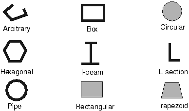
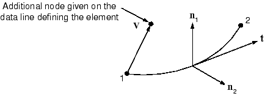
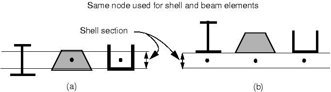

# 6.1 梁截面几何

您可以使用 **BEAM SECTION** 选项或 **BEAM GENERAL SECTION** 选项来定义梁截面。使用这两个选项中的任何一个，您都可以通过指定截面的形状和尺寸来几何地定义梁截面。**BEAM GENERAL SECTION** 选项还可用于通过截面工程特性（如面积和惯性矩）来定义梁截面。或者，截面可以基于特殊二维单元的网格，在此网格上数值计算几何量。

Abaqus 提供了多种常见截面形状，如图 6-1 所示，如果您决定几何地定义梁轮廓。您还可以使用任意截面定义来定义几乎任何薄壁截面。关于 Abaqus 中可用的梁截面的详细讨论，请参阅《Abaqus 分析用户指南》第 29.3.9 节"梁截面库"。

**图 6-1** 梁截面。



**BEAM SECTION** 选项的基本格式为：

```
*BEAM SECTION, ELSET=<元素集名称>, SECTION=<截面类型>,
MATERIAL=<材料名称>
<横截面尺寸>
<方向余弦1>,<方向余弦2>,<方向余弦3>
```

将 **SECTION** 参数设置为图 6-1 中所示的截面之一。提供所需的横截面尺寸，不同类型的截面有不同的要求，如《Abaqus 分析用户指南》第 29.3.9 节"梁截面库"中所规定。第二行上的向量定义了近法向，**n**，具体内容将在本节后面说明。

**BEAM GENERAL SECTION** 选项的基本格式为：

```
*BEAM GENERAL SECTION, ELSET=<元素集名称>, SECTION=<截面类型>
<横截面尺寸> 或 <截面工程特性>
<方向余弦1>,<方向余弦2>,<方向余弦3>
<杨氏模量 (E)>,<剪切模量 (G)>
```

要几何地定义截面特性，将 **SECTION** 参数设置为图 6-1 中所示的截面之一。在这种情况下，您提供所需的横截面尺寸的方式与使用 **BEAM SECTION** 时相同。第二行上的向量同样定义了近法向，**n**。在第三行上输入弹性材料常数，因为 **BEAM GENERAL SECTION** 不引用任何材料选项块。如果您使用此选项几何地定义截面特性，材料行为必须是线弹性的。

另一种方法是，将 **SECTION** 参数设置为 **GENERAL** 或 **NONLINEAR GENERAL**，在这种情况下，您提供截面工程特性（面积、惯性矩和扭转常数）而不是横截面尺寸。这些参数允许您将梁的几何形状和材料行为结合来定义其对载荷的响应。此响应可以是线性的或非线性的。更多详细信息，请参阅《Abaqus 分析用户指南》第 29.3.7 节"使用通用梁截面定义截面行为"。

在 Abaqus/Standard 中，您还可以定义具有线性锥形截面的梁。支持具有线性响应的通用截面和标准库截面。

网格化梁截面允许描述包含多种材料和复杂几何形状的梁截面。这种梁轮廓将在《Abaqus 分析用户指南》第 10.6.1 节"网格化梁截面"中进一步讨论。

## 6.1.1 截面点

当您指定 **BEAM SECTION** 时，Abaqus 在整个梁截面中的一系列截面点上计算梁单元的响应。截面点的数量以及截面点位置如《Abaqus 分析用户指南》第 29.3.9 节"梁截面库"所示。单元输出变量（如应力和应变）在任何截面点都可获取；但是，默认情况下，只在部分截面点提供输出，如《Abaqus 分析用户指南》第 29.3.9 节"梁截面库"中所列。矩形截面（**SECTION**=**RECT**）的所有截面点如图 6-2 所示。

**图 6-2** B32 矩形梁单元中的积分和默认截面点。


对于此截面，默认情况下在点 1、5、21 和 25 提供输出。如图 6-2 所示的梁单元使用总共 50 个截面点（在两个积分点各 25 个）来计算其刚度。

当您指定 **BEAM GENERAL SECTION** 时，Abaqus 不在截面点上计算梁的响应。相反，它使用截面工程特性来确定截面响应。因此，Abaqus 仅将截面点用作输出位置，您需要指定所需的输出截面点。使用 **SECTION POINTS** 选项（必须跟在 **BEAM GENERAL SECTION** 选项之后）来指定截面点的位置：

```
*SECTION POINTS
<坐标1>,<坐标2>
```

1 方向和 2 方向的坐标在梁截面的局部 1-2 坐标系中给出。例如，如果我们需要在具有矩形梁截面的单元角落处获得应力（如图 6-3 所示），我们将使用以下选项块：

```
*SECTION POINTS
-0.01, -0.005
 0.01, -0.005
 0.01,  0.005
-0.01,  0.005
```

**图 6-3** 矩形梁角落处的截面点。


您指定的点根据其给出顺序分配识别编号；即第一个点是截面点 1，第二个是截面点 2，依此类推。

## 6.1.2 截面方向

您必须在全局笛卡尔空间中定义梁截面的方向。沿梁单元的局部切线，**t**，定义为从单元的第一个节点指向下一个节点的单元轴线向量。梁截面垂直于此局部切线。局部（1-2）梁截面轴由向量 **n1** 和 **n2** 表示。三个向量 **t**、**n1** 和 **n2** 形成一个局部的右手坐标系（见图 6-4）。

**图 6-4** 梁单元切线 **t** 和梁截面轴 **n1** 和 **n2** 的方向。



对于二维梁单元，**n1** 方向始终为 (0.0, 0.0, -1.0)。

对于三维梁单元，有几种方法可以定义局部梁截面轴的方向。最简单的方法是在 **ELEMENT** 选项的数据行上指定一个额外的节点。从梁单元中的第一个节点到此附加节点（见图 6-4）的向量 **v** 最初用作近似的 **n1** 方向。然后 Abaqus 将梁的 **n2** 方向定义为 **n2 = t × v**。在确定 **n2** 之后，Abaqus 将实际的 **n1** 方向定义为 **n1 = n2 × t**。此过程确保局部切线和局部梁截面轴形成一个正交系统。

或者，您可以在单元截面选项（**BEAM SECTION** 或 **BEAM GENERAL SECTION**）上给出近似的 **n1** 方向。然后 Abaqus 使用上述过程计算实际的梁截面轴。如果您同时指定了一个额外节点和一个近似的 **n1** 方向，则附加节点方法优先。如果您没有提供近似的 **n1** 方向，Abaqus 使用从原点到点 (0.0, 0.0, -1.0) 的向量作为默认的 **n1** 方向。

有两种方法可以用于覆盖 Abaqus 定义的 **n2** 方向。一种方法是将 **n2** 的分量作为 **NODE** 选项数据行上节点坐标之后的第 4、第 5 和第 6 个数据值给出。另一种方法是使用 **NORMAL** 选项。如果同时使用两种方法，**NORMAL** 选项优先。Abaqus 再次将 **n1** 方向定义为 **n1 = n2 × t**。

您提供的 **n2** 方向不必与梁单元切线 **t** 正交。当您提供 **n2** 方向时，局部梁单元切线被重新定义为叉积 **t = n2 × t** 的值。在这种情况下，重新定义的局部梁切线 **t** 可能无法与梁轴线对齐（即从第一个节点到第二个节点的向量定义）。如果 **n2** 方向与垂直于单元轴线的平面所成的角度大于 20°，Abaqus 会在数据文件中发出警告消息。

第 6.4 节"示例：货运起重机"中给出的示例解释了如何在模型中分配梁截面方向。

## 6.1.3 梁单元曲率

梁单元的曲率基于梁的 **n2** 方向相对于梁轴线的方向。如果 **n2** 方向与梁轴线不正交（即梁轴线与切线 **t** 不重合），则梁单元在初始状态下被视为曲梁。由于曲梁的行为与直梁不同，您应始终检查模型以确保使用了正确的法向，从而获得正确的曲率。对于梁和壳，Abaqus 使用相同的算法来确定由多个单元共享的节点处的法向。第 29.3.4 节"梁单元截面方向"中给出 了相关描述。

如果您打算建模曲梁结构，您应该使用前面描述的两种方法之一来直接定义 **n2** 方向，从而使您能够更好地控制曲率建模。即使您打算建模由直梁组成的结构，由于在共享节点处平均法向，也可能引入曲率。您可以通过如前所述直接定义梁法向来纠正此问题。

## 6.1.4 梁截面中的节点偏移

当梁单元用作壳模型的加劲肋时，使梁和壳单元共享相同的节点是很方便的。默认情况下，壳单元节点位于壳的中间平面，而梁单元节点位于梁截面的某个位置。因此，如果壳和梁单元共享相同的节点，则壳和梁加劲肋将重叠，除非梁截面从节点位置偏移（见图 6-5）。

**图 6-5** 使用梁作为壳模型的加劲肋：(a) 无梁截面偏移；(b) 有梁截面偏移。



对于截面类型 **I**、**TRAPEZOID** 和 **ARBITRARY**，可以指定截面几何位于截面局部坐标系原点（位于单元节点处）一定距离处。由于这种截面的梁很容易从其节点偏移，它们可以随时用作加劲肋，如图 6-5(b) 所示。（如果加劲肋的翼缘或腹板屈曲很重要，则应使用壳来建模加劲肋。）

如图 6-6 所示的 I 梁连接到厚度为 1.2 的壳上。以下输入用于按图所示方向定位梁截面：

```
*BEAM SECTION, SECTION=I, ELSET=<元素集名称>, MATERIAL=<材料>
-0.6, 2.4, 3.0, 2.0, 0.2, 0.2, 0.2
<方向余弦1>, <方向余弦2>,<方向余弦3>
```

**图 6-6** 用作壳单元加劲肋的 I 梁。


第一数据行上的第一项定义了梁节点从 I 截面底部的偏移。偏移量是壳厚度的一半或 0.6。其余数据项是梁深度、底部和顶部翼缘的宽度、底部和顶部翼缘的厚度，以及腹板的厚度。

如果指定 **BEAM GENERAL SECTION** 选项且参数 **SECTION**=**GENERAL**，则可以给出质心和剪切中心的位置。**SHEAR CENTER** 和 **CENTROID** 选项允许这些位置从节点偏移，从而使您能够轻松地建模加劲肋。例如，连接到壳上的 I 梁的输入（如图 6-6 所示）为：


也可以分别定义梁节点和壳节点，并使用刚性梁约束连接两个节点。请参阅《Abaqus 分析用户指南》第 35.2.1 节"线性约束方程"了解更多详细信息。
