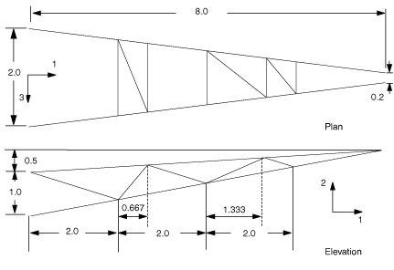
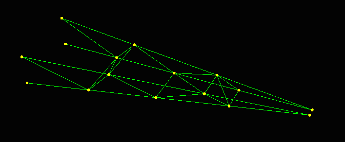
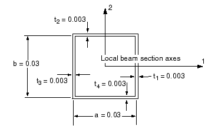

# 6.4 示例：货运吊车

轻型货运吊车如图 6-11 所示。您需要确定吊车在承载 10 kN 载荷时的静态挠度。您还应识别结构中应力最大和载荷最大的关键构件和节点：由于这是静态分析，您将使用 Abaqus/Standard 分析货运吊车。

**图 6-11** 轻型货运吊车示意图


吊车由两个桁架结构组成，它们通过交叉支撑连接在一起。每个桁架结构中的两个主要构件是钢制箱形梁（箱形截面）。每个桁架结构由内部支撑加强，内部支撑焊接在主构件上。连接两个桁架结构的交叉支撑通过螺栓固定在桁架结构上。这些连接几乎不能传递弯矩，因此被视为铰接节点。内部支撑和交叉支撑都使用钢制箱形梁，其截面尺寸小于桁架结构主构件的截面尺寸。两个桁架结构在其端部（E 点）连接，允许在 3 方向上的独立位移和所有旋转，同时约束 1 和 2 方向上的位移相同。吊车通过 A、B、C 和 D 点牢固地焊接在大型结构上。吊车的尺寸如图 6-12 所示。在以下各图中，桁架 A 是由构件 AE、BE 及其内部支撑组成的结构；桁架 B 由构件 CE、DE 及其内部支撑组成。

**图 6-12** 货运吊车的尺寸（单位：m）



吊车主构件的典型截面尺寸与全局轴向长度之比远小于 1/15。用于内部支撑的最短构件的该比例约为 1/15。因此，可以使用梁单元对吊车进行建模。

## 6.4.1 坐标系

您应使用图 6-11 和图 6-12 中所示的默认全局直角笛卡尔坐标系。将坐标原点放置在 A 点和 D 点的中间。如果您使用不同的原点或坐标系方向构建模型，请确保模型中的输入数据反映您的坐标系，而不是此处所示的坐标系。

## 6.4.2 网格设计

货运吊车将使用三维细长三次梁单元（B33）进行建模。这些单元的三次插值允许我们对每个构件使用单个单元，并在施加弯曲载荷时仍能获得准确结果。模拟中使用的网格如图 6-13 所示。

**图 6-13** 货运吊车网格



吊车中的焊接节点在从一个单元到下一个单元时提供了平移和旋转的完全连续性。因此，您只需要在每个焊接节点处设置一个节点。连接交叉支撑与桁架结构的螺栓节点以及桁架结构尖端的连接是不同的。由于这些节点不能为所有节点自由度提供完全连续性，因此需要在每个单元的连接处设置单独的节点。然后必须通过使用 `*MPC`、`*BOUNDARY` 或 `*EQUATION` 选项在这些分离的节点之间给出适当的约束。`*MPC` 和 `*EQUATION` 选项将在后面详细讨论。

货运吊车模型中各个构件的节点编号如图 6-14 所示。

**图 6-14** 吊车模型中的节点编号


这些节点编号来自附录 A.4"货运吊车"一节中给出的输入文件。已在交叉支撑单元和它们所连接的桁架结构上定义了单独的节点。在每个桁架结构的末端（如图 6-11 中的 E 点）也需要单独的节点。模型中的节点编号可能与此处显示的不同。

货运吊车模型中各个构件的单元编号如图 6-15 所示。

**图 6-15** 吊车模型中的单元编号


这些单元编号来自附录 A.4"货运吊车"一节中给出的输入文件。模型中的单元编号可能与此处显示的不同。

## 6.4.3 预处理——创建模型

本示例的完整输入文件为 `crane.inp`，可在附录 A.4"货运吊车"一节中找到。用于创建前面各页所示节点和单元的 Abaqus 输入选项可在附录 A.4"货运吊车"一节中找到。如果您希望使用 Abaqus/CAE 创建整个模型，请参阅《Abaqus 入门：交互版》第 6.4 节"示例：货运吊车"。

## 6.4.4 检查输入文件——模型数据

本节描述如何在输入文件中描述本示例的模型数据。这些数据包括输入文件标题、节点和单元、梁截面和方向、约束以及边界条件的描述。

**标题**

本示例使用的标题提供了模型和所用单位的简短描述：

```abaqus
*HEADING
44  3-D model of light-service cargo crane
45  S.I. Units (m, kg, N, sec)
```

**节点坐标和单元连接**

在 `*NODE` 选项块中定义节点坐标。如果您决定使用编辑器来完成此操作，您可能需要使用附录 A.4"货运吊车"一节中的网格生成命令。在本示例中，创建了一个名为 `ATTACH` 的节点集；该节点集包含 A、B、C 和 D 点的节点，即吊车连接到母结构的点。

```abaqus
*NSET, NSET=ATTACH
46  100, 107, 200, 207
```

创建模型中与图 6-15 所示单元对应的单元，但请记住您的编号可能不同。（然而，拥有相同的编号会使某些建模特征的设置更加容易。）在本模拟中您需要几个单元集。在定义单元时，它们被分组到以下单元集中：

```abaqus
OUTA      100, 101, 102, 103, 104, 105, 106
BRACEA    110, 111, 112, 113, 114
OUTB      200, 201, 202, 203, 204, 205, 206
BRACEB    210, 211, 212, 213, 214
CROSSEL   300, 301, 302, 303, 304, 305, 306, 307
```

其中这些单元编号指的是图 6-15 中所示的那些单元。单元集 `OUTA` 和 `OUTB` 包含两个桁架结构的主外构件。单元集 `BRACEA` 和 `BRACEB` 包含每个桁架结构内部支撑的建模单元。单元集 `CROSSEL` 包含连接两个桁架结构的交叉支撑。

**梁单元属性**

由于本模拟中的材料行为假定为线性弹性，使用 `*BEAM GENERAL SECTION` 选项定义截面属性。该结构中所有梁都具有箱形截面。

箱形截面使用参数 `SECTION=BOX` 指定。第一行数据包含截面尺寸，即图 6-16 中所示箱形截面的尺寸 *a*、*b*、*t*1、*t*2、*t*3 和 *t*4。图 6-16 中所示的尺寸适用于吊车中两个桁架的主构件。

**图 6-16** 主构件的截面几何形状和尺寸（单位：m）


主构件的梁截面轴方向应使得梁 1 轴垂直于俯视图（如图 6-12 所示）中所示的桁架结构平面，而梁 2 轴垂直于该平面中的单元。通过在 `*BEAM GENERAL SECTION` 选项的第二行数据上给出梁 1 轴的大致方向（**n**-向量）来指定此方向。为了获得正确的法向向量 **n**，在这种情况下，您需要提供一个非常精确的 **n**。提供一个大致的方向会更容易一些，那就是负 3 方向。然而，考虑到 Abaqus 使用给定 **e**1 和 **n** 确定 **n** 的逻辑，如果我们使用这个近似的 **n**，法向向量 **n** 会从其正确的方向略微旋转。您可以为两个桁架结构中的所有单元指定相同的 **n** 方向。第三行数据包含弹性模量和剪切模量，假定为中等强度钢，*E* = 200.0 GPa，ν = 0.25，*G* = 80.0 GPa。这些建模数据包含在以下选项块中：

```abaqus
*BEAM GENERAL SECTION, SECTION=BOX, ELSET=OUTA
51  0.10,0.05,0.005,0.005,0.005,0.005
52  -0.1118, 0.0, -0.9936
53  200.E9,80.E9
*BEAM GENERAL SECTION, SECTION=BOX, ELSET=OUTB
54  0.10,0.05,0.005,0.005,0.005,0.005
56  -0.1118, 0.0, 0.9936
57  200.E9,80.E9
```

支撑构件的梁截面尺寸如图 6-17 所示。交叉支撑和每个桁架结构内部的支撑具有相同的梁截面几何形状，但它们的梁截面轴方向不同。因此，必须使用单独的 `*BEAM GENERAL SECTION` 选项。支撑由与主构件相同的钢制成。

**图 6-17** 支撑构件的截面几何形状和尺寸（单位：m）



内部桁架支撑的大致 **n** 向量与相应桁架结构主构件的 **n** 向量相同。以下输入定义了此支撑的单元属性：

```abaqus
*BEAM GENERAL SECTION, SECTION=BOX, ELSET=BRACEA
58  0.03,0.03,0.003,0.003,0.003,0.003
59  -0.1118, 0.0, -0.9936
60  200.E9,80.E9
*BEAM GENERAL SECTION, SECTION=BOX, ELSET=BRACEB
62  0.03,0.03,0.003,0.003,0.003,0.003
63  -0.1118, 0.0, 0.9936
64  200.E9,80.E9
```

我们做出一些假设，使交叉支撑的方向指定稍微容易一些。所有梁法向向量（**n** 向量）应大致位于货运吊车平面视图（参见图 6-12）的平面内。该平面与全局 1-3 平面略有偏斜。同样，定义这种方向的一种简单方法是在单元属性选项上提供一个大致垂直于此平面的近似 **n** 向量。该向量应几乎平行于全局 2 方向。由于从一个单元到下一个单元的法向量之间的角度始终大于 20°，因此法向量在节点处不进行平均。

根据交叉支撑构件的具体方向，我们可能需要为每个交叉支撑单元单独定义法向量。这样的练习将与您已经为两个桁架结构定义法向量所做的非常相似。由于方形交叉支撑构件主要承受轴向载荷，其变形对截面方向不敏感。因此，我们接受 Abaqus 计算的默认法向量为正确的。交叉支撑的大致 **n** 向量与 *y* 轴对齐。以下选项块指定交叉支撑：

```abaqus
*BEAM GENERAL SECTION, SECTION=BOX, ELSET=CROSSEL
65  0.03,0.03,0.003,0.003,0.003,0.003
66  0.0,1.0,0.0
67  200.E9,80.E9
```

**梁截面方向**

在此模型中，如果您仅提供定义近似 **n** 向量方向的数据，则会出现建模误差。节点处梁法向量的平均化（参见 6.1.3 节"梁单元曲率"）导致 Abaqus 使用了错误的货运吊车模型几何形状。要查看此问题，您可以使用 Abaqus/Viewer 显示梁截面轴和梁切向量（参见 6.4.7 节"后处理"）。然而，吊车模型中的法向量在 Abaqus/Viewer 中看起来是正确的；但实际上它们略有错误。您还可以通过检查打印在数据（`.dat`）文件中的平均节点法向量来发现此类建模错误。货运吊车错误模型中的一些法向量如下所示：


问题在于节点 102 的法向量，它与定义桁架 A 下部主构件的其他节点（100、101、103）的法向量不匹配（参见图 6-14）。四个单元（101、102、112 和 113）包含节点 102。当节点处梁法向量的平均化产生多个独立法向量时，节点处的附加法向量也会打印在数据文件中（详见 6.1.3 节"梁单元曲率"）。吊车模型的正确几何形状要求节点 102 处有三个独立的梁法向量：一个用于支撑单元 112，一个用于支撑单元 113，一个用于单元 101 和 102。上表中节点 102 显示的法向量不是单元 101 和 102 所需的法向量。如果它是的话，它应该与节点 100、101 或 103 显示的法向量相匹配。它也不是其他两个单元中任何一个的正确法向量，它们的法向量如下所示打印在数据文件中。

```
                          N O R M A L   D E F I N I T I O N S

  ELEMENT NODE           NORMAL               ELEMENT  NODE              NORMAL

     100  101  -0.1820  0.9831  2.0481E-02       101   101  -0.1820      0.9831  2.0481E-02
     101  102  -0.1820  0.9831  2.0481E-02       102   102  -0.1820      0.9831  2.0481E-02
     102  103  -0.1820  0.9831  2.0481E-02       103   103  -0.1820      0.9831  2.0481E-02
     103  104  -0.1820  0.9831  2.0504E-02       104   105   6.1600E-02 -0.9981 -6.9312E-03
```

在该表中，单元 113 的两个节点（节点 102 和节点 105）都没有显示法向量。因此，上面 NODE DEFINITIONS 表中节点 102 显示的法向量是单元 101、102 和 113 法向量的平均值。使用 Abaqus 平均法向量的逻辑，我们可以预测单元 113 节点处的法向量将与相邻单元的法向量进行平均。对于这个问题，平均化逻辑的重要部分是：与参考法向量夹角小于 20° 的法向量将与参考法向量平均以定义新的参考法向量。在节点 102 处的法向量情况下，原始参考法向量是单元 101 和 102 的法向量。由于单元 113 在节点 102 处的法向量与原始参考法向量夹角小于 20°，因此它与单元 101 和 102 在节点 102 处的法向量进行平均，以定义该节点处的新参考法向量。另一方面，由于单元 112 的法向量与原始参考法向量夹角约为 30°，它在节点 102 处有一个独立的法向量，如数据文件中所示。

这个错误的平均法向量意味着单元 101、102 和 113 具有从单元一端到另一端关于梁轴呈现曲率的截面几何形状，这不是预期的几何形状。您必须使用 `*NORMAL` 选项显式定义单元 113 在节点 102 处的法向量。显式指定法向量方向可防止 Abaqus 应用其平均化算法。对于吊车另一侧对应的单元（桁架 B 的单元 213，节点 202），您也必须使用 `*NORMAL`。

在每个桁架结构尖端（节点 104 和 204）的法向量也存在同样的问题，同样是因为单元 103 和 104 之间的角度小于 20°。由于我们建模的是直梁单元，因此每个单元在两个节点处的法向量都是恒定的。因此，您应该放在输入文件中的 `*NORMAL` 选项块有六行数据。如果您使用图 6-14 和图 6-15 中所示的编号方案，则应将以下选项块添加到您的输入文件中：


**多-point 约束**

与内部桁架支撑不同，交叉支撑通过螺栓连接到桁架构件。您可以假定这些螺栓连接无法传递旋转或扭矩。在这些位置定义的重复节点需要定义此约束。在 Abaqus 中，可以使用多 point 约束（MPC）或约束方程来定义这些节点之间的约束。

多 point 约束允许在模型的不同自由度之间施加约束。Abaqus 中提供了大量 MPC 库。（有关完整列表和每个约束的说明，请参阅《Abaqus 分析用户手册》第 35.2.1 节"线性约束方程"。）`*MPC` 选项的格式为：

```abaqus
*MPC
75  <MPC类型>,<节点1或节点集1>,<节点2或节点集2>, ......
```

通过使用节点集，您可以用单个数据行定义多个相同类型的约束。模拟螺栓连接所需的 MPC 类型为 `PIN`。由此 MPC 创建的铰接节点约束两个节点处的位移相等，但如果节点处存在旋转自由度，则旋转保持独立。

吊车模型中有许多螺栓连接。以下是附录 A.4"货运吊车"一节中模型的完整 `*MPC` 选项块：

```abaqus
*MPC
76  PIN,101,301
77  PIN,102,302
78  PIN,103,303
79  PIN,105,305
80  PIN,106,306
81  PIN,201,401
82  PIN,202,402
83  PIN,203,403
84  PIN,205,405
85  PIN,206,406
```

将类似的选项块添加到您的模型中，更改节点编号以对应您的模型中的编号。如果两个桁架结构上的所有节点都被分组到一个名为 `TRUSNODE` 的节点集中，而交叉支撑上的所有节点都被分组到一个名为 `CROSNODE` 的节点集中，则可以将选项块简化为：

```abaqus
*NSET, NSET=TRUSNODE, UNSORTED
86  101,102,103,105,106,201,202,203,205,206
*NSET, NSET=CROSNODE, UNSORTED
87  301,302,303,305,306,401,402,403,405,406
*MPC
90  PIN, TRUSNODE, CROSNODE
```

如果节点集作为 MPC 类型后的第一项提供，则第二项可以是另一个节点集或单个节点。当 `*MPC` 选项的数据行包含一个节点集然后是一个单独的节点时（如上所示），Abaqus 会在该集合中的每个节点与指定的单独节点之间创建一个 MPC 约束。例如，以下选项块将在节点集 `TRUSNODE` 中的每个节点与节点 301 之间创建一个铰接节点。

```abaqus
*MPC
91  PIN, TRUSNODE, 301
```

**约束方程**

节点自由度之间的约束也可以通过使用 `*EQUATION` 选项用线性方程指定。每个方程的形式为：


其中 *c*i 是与自由度 *d*i 关联的系数。每个线性约束方程至少需要两行数据。方程中涉及的项数 *n* 在 `*EQUATION` 选项下方的第一行数据上给出。在后续数据行上格式为：

```
<系数>,<自由度>,<节点>,<系数>,<自由度>,<节点>, ...
```

每个数据行必须恰好给出四个项，最后一行可以有较少的项。

在吊车模型中，两个桁架的尖端连接在一起，使得每个尖端节点的 1 和 2 自由度（1 和 2 方向的平移）相等，而节点处的其他自由度（3-6）则独立。我们需要两个线性约束，一个使节点 104 的 1自由度等于节点 204 的 1自由度：


另一个使节点 104 的 2自由度等于节点 204 的 2自由度：


如果您使用预处理器创建此模型，则可能需要更改节点编号。以下选项块定义了吊车模型中 E 点（参见图 6-11）处的适当约束：

```abaqus
*EQUATION
92  2
93  104,1,1.0, 204,1,-1.0
94  2
95  104,2,1.0, 204,2,-1.0
```

在 `*MPC` 或 `*EQUATION` 中定义的第一个节点处的自由度从刚度矩阵中消除。因此，这些节点不应出现在其他 MPC 或约束方程中。也不应将边界条件应用于已消除的自由度。

**边界条件**

吊车牢固地连接到母结构。以下 `*BOUNDARY` 选项块约束附着点处的所有节点，这些节点应该已被分组到节点集 `ATTACH` 中：

```abaqus
*BOUNDARY
96  ATTACH, ENCASTRE
```

## 6.4.5 检查输入文件——历史数据

以下选项指定静态线性扰动模拟：

```abaqus
*STEP, PERTURBATION
97  Static tip load on crane
*STATIC
```

**载荷**

在节点 104 沿负 *y* 方向施加 10 kN 的集中载荷。由于存在连接节点 104 和 204 *y* 位移的约束方程，载荷由两个节点平均分担。以下 `*CLOAD` 选项块在两个节点上提供相等的载荷：

```abaqus
*CLOAD
99  104,2,-1.0E4
```

**输出请求**

将节点处的位移（U）和反力反力矩（RF）以及单元截面处的力和力矩（SF）写入输出数据库以进行 Abaqus/Viewer 后处理，如以下选项块所示：

```abaqus
*OUTPUT, FIELD
100  *NODE OUTPUT
101  U, RF
102  *ELEMENT OUTPUT
103  SF,
104  *END STEP
```

## 6.4.6 运行分析

将输入保存到名为 `crane.inp` 的文件中。使用以下命令运行分析：

```abaqus
abaqus job=crane
```

## 6.4.7 后处理

在操作系统提示符下键入以下命令启动 Abaqus/Viewer：

```abaqus
abaqus viewer odb=crane
```

Abaqus/Viewer 绘制吊车模型的未变形形状。

**绘制变形后的模型形状**

要开始本练习，请绘制变形后的模型形状，并将未变形模型形状叠加在其上。使用（0, 0, 1）作为视点向量的 *X*、*Y* 和 *Z* 坐标，以及（0, 1, 0）作为向上向量的 *X*、*Y* 和 *Z* 坐标来指定非默认视图。

> **提示：**
> 您还可以通过从"视图"工具栏点击  从正面视图显示模型。

吊车叠加在变形形状上的未变形形状如图 6-18 所示。

**图 6-18** 货运吊车的变形形状


**使用显示组绘制单元集和节点集**

您可以使用显示组来绘制现有的节点集和单元集；您也可以直接从视口选择节点或单元来创建显示组。您将创建一个仅包含桁架结构 A 主构件相关单元的显示组。

**创建和绘制显示组的步骤：**

1. 在结果树中，展开输出数据库文件 `crane.odb` 下的"分区"容器。
2. 为方便选择，使用视图工具栏中的  工具将视图更改回默认等轴测视图。
   > **提示：**
   > 如果"视图"工具栏不可见，请从主菜单栏选择 **视图 → 工具栏 → 视图**。
3. 依次点击容器中的项目，直到视口中突出显示与桁架 A 中主构件相关的单元。在此项目上点击鼠标按钮 3，并从出现的菜单中选择"替换"。
   > Abaqus/Viewer 现在仅显示该组单元。
4. 要保存此组，请在结果树中双击"显示组"；或使用显示组工具栏中的  工具。
   > 出现"创建显示组"对话框。
5. 在"创建显示组"对话框中，点击"另存为"并输入 `MainA` 作为显示组的名称。
6. 点击"关闭"关闭"创建显示组"对话框。
   > 此显示组现在出现在结果树中"显示组"容器下方。

**梁截面方向**

现在您将在未变形模型形状上绘制截面轴和梁切线。

**绘制梁截面轴的步骤：**

1. 从主菜单栏，选择 **绘图 → 未变形形状**；或使用工具箱中的  工具仅显示未变形模型形状。
2. 从主菜单栏，选择 **选项 → 常规**；然后在出现的对话框中点击"法向量"选项卡。
3. 开启"显示法向量"，并接受"在单元上"的默认设置。
4. 在"法向量"页面底部的"样式"区域中，将"长度"指定为"长"。
5. 点击"确定"。
   > 截面轴和梁切线显示在未变形形状上。

结果图如图 6-19 所示。图 6-19 中的文本注释标识截面轴和梁切线，不会出现在您的图像中。显示局部梁 1 轴（**e**1）的向量为蓝色；显示梁 2 轴（**n**）的向量为红色；显示梁切线（**t**）的向量为白色。

**图 6-19** 显示组 `MainA` 中单元的梁截面轴和切线图


**渲染梁轮廓**

现在您将显示梁轮廓的理想化表示，并对应力结果进行云图显示。

**渲染梁轮廓的步骤：**

1. 从主菜单栏，选择 **视图 → ODB 显示选项**。
   > 出现"ODB 显示选项"对话框。
2. 在"常规"选项卡页面上，开启"渲染梁轮廓"并接受默认比例因子 1。
3. 点击"确定"。
   > Abaqus/Viewer 以适当的尺寸和正确的方向显示梁轮廓。图 6-20 显示了整个模型上的梁轮廓。您的更改在会话期间保持保存。
4. 点击  对渲染轮廓上的 Mises 应力进行云图显示。

**图 6-20** 显示梁轮廓的货运吊车


**创建硬拷贝**

您可以将当前图像保存到文件以进行硬拷贝输出。

**创建当前图像的 PostScript 文件的步骤：**

1. 从主菜单栏，选择 **文件 → 打印**。
   > 出现"打印"对话框。
2. 在"打印"对话框的"设置"区域中，选择"黑白"作为"呈现"类型；并开启"文件"作为"目标"。
3. 选择"PS"作为"格式"，并输入 `beam.ps` 作为"文件名"。
4. 点击 。
   > 出现"PostScript 选项"对话框。
5. 从"PostScript 选项"对话框中，选择"600 dpi"作为"分辨率"；并关闭"打印日期"。
6. 点击"确定"应用您的选择并关闭对话框。
7. 在"打印"对话框中，点击"确定"。
   > Abaqus/Viewer 创建当前图像的 PostScript 文件并将其作为 `beam.ps` 保存在您的工作目录中。您可以使用系统的 PostScript 文件打印命令来打印此文件。

**位移摘要**

将显示组 `MainA` 中所有节点的位移摘要写入名为 `crane.rpt` 的文件。吊车尖端在 2 方向上的峰值位移为 0.0188 m。

**截面力和力矩**

Abaqus 可以以作用在给定截面点上的力和力矩的形式提供结构单元的输出。这些截面力和力矩在局部梁坐标系中定义。关闭梁轮廓渲染，然后对显示组 `MainA` 中单元关于梁 1 轴的截面力矩进行云图显示。为清晰起见，重置视图，使单元显示在 1-2 平面中。

**创建"弯矩图"类型云图显示的步骤：**

1. 从"字段输出"工具栏左侧的变量类型列表中，选择"主要"。
2. 从工具栏中央的输出变量列表中，选择 **SM**。
   > Abaqus/Viewer 自动选择 **SM1**（字段输出工具栏右侧列表中的第一个分量名称），并在变形模型形状上显示关于梁 1 轴的弯矩云图。由于分析中未考虑几何非线性，因此自动选择变形比例因子。
3. 打开"常规绘图选项"对话框，并选择"统一"变形比例因子为 `1.0`。
   > 这种类型的彩色云图显示对于梁等一维单元通常不太有用。更有用的图是一种"弯矩图"类型显示，您可以使用云图选项来生成。
4. 从主菜单栏，选择 **选项 → 云图**；或使用工具箱中的"云图选项"  工具。
   > 出现"云图绘图选项"对话框；默认情况下选择"基本"选项卡。
5. 在"云图类型"字段中，开启"为线单元显示刻度线"。
6. 点击"确定"。
   > 出现图 6-21 所示的图。现在通过在垂直于单元绘制的"刻度线"相交的位置来指示每个节点处变量的大小。这种"弯矩图"类型显示可用于任何变量（不仅仅是弯矩），用于任何一维单元，包括桁架和轴对称壳以及梁。

**图 6-21** 显示组 `MainA` 中单元的弯矩图（关于梁 1 轴的力矩）。指示了应力最高的位置（由单元弯曲产生）。


