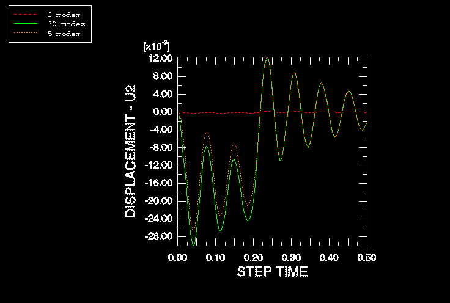

# 7.6 模态数量的影响

对于此仿真，使用30个模态来表示结构的动力学行为。所有这些模态的总模态有效质量占可在 _y_ 和 _z_ 方向上运动的结构质量的90%以上，表明动力学表示是充分的。

[图7-10](#gss-numb-modes-v) 显示了节点104在自由度2方向上的位移随时间的变化，并说明了使用较少模态对结果质量的影响。如果查看有效质量表，您会发现 _y_ 方向上的第一个显著模态是第3模态，这解释了为什么仅使用两个模态时没有响应。在使用五个模态和30个模态的分析中，该节点在自由度2方向上的位移在0.2秒后是相似的；然而，早期响应不同，表明在5至30范围内存在与早期响应相关的显著模态。当使用五个模态时，_y_ 方向上的总模态有效质量仅占可移动质量的57%。

**图7-10** 不同模态数量对结果的影响。

