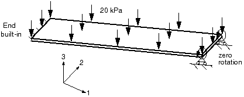
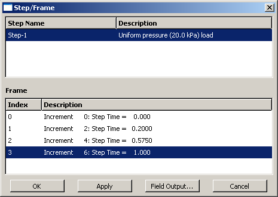

# 8.4 示例：非线性斜板

本示例是[第5章"使用壳单元"](/book/05)中描述的线性斜板模拟的延续，如图8-11所示。



斜板。

现在您将在Abaqus/Standard中重新分析该板，以考虑几何非线性的影响。通过此分析获得的结果，您可以确定几何非线性效应的重要性，从而判断线性分析的有效性。

您只需要修改历史数据，即可将此模型从线性模拟转换为非线性模拟。

如果愿意，您可以遵循本示例末尾的指南，扩展模拟以使用Abaqus/Explicit执行动态分析。

接下来的步骤假设您可以访问此示例的完整输入文件。该输入文件`skew_nl.inp`可在["非线性斜板"，附录A.6节](ap01s06.html)中找到。获取和运行脚本的说明请参阅[附录A，"示例文件"](ap01.html)。如果您希望使用Abaqus/CAE创建整个模型，请参阅[Getting Started with Abaqus: Interactive Edition第8.4节"示例：非线性斜板"](../gsa/gsa-link.htm#gsa-nln-skewplate)。

## 8.4.1 输入文件的修改——历史数据

本示例不更改原始斜板示例中的任何模型数据；仅包含历史数据的修改。

**在步骤中应用NLGEOM**

在[*STEP*](../key/key-link.htm#usb-kws-hstep)选项上将`NLGEOM`参数设置为`YES`，并移除`PERTURBATION`参数。这表明分析现在包含非线性几何效应。默认的最大增量次数为100；Abaqus可能使用的增量次数少于这个上限，但如果需要更多增量，它将停止分析。

修改后的[*STEP*](../key/key-link.htm#usb-kws-hstep)选项如下：

```
*STEP, NLGEOM=YES
```

您可能还想修改步骤的描述，以反映现在进行的是非线性分析。

**定义步骤时间**

此分析需要在[*STATIC*](../key/key-link.htm#usb-kws-hstatic)选项上添加一行数据，用于指定初始时间增量的大小`ΔT`和分析的总步骤时间。使用的总步骤时间为1.0，并指定`ΔT`使得Abaqus在第一个增量中施加10%的荷载。因此，完整的[*STATIC*](../key/key/link.htm#usb-kws-hstatic)选项块为：

```
*STATIC
0.1, 1.0
```

**输出控制**

在线性分析中，Abaqus求解一次平衡方程并计算此单一解的结果。非线性分析可以产生更多输出，因为可以在每个收敛增量结束时请求结果。如果您不仔细选择输出请求，输出文件会变得非常大，可能会填满计算机上的磁盘空间。

如前所述，输出可用于四个不同的文件：

* 输出数据库（`.odb`）文件，包含以中性二进制格式存储的数据，用于使用Abaqus/Viewer后处理结果；
* 数据（`.dat`）文件，包含所选结果的打印表格；
* 重启动（`.res`）文件，用于继续分析；
* 结果（`.fil`）文件，用于与第三方后处理器配合使用。

此处仅讨论输出数据库（`.odb`）和打印输出（`.dat`）文件的选项。如果仔细选择，可以在模拟过程中频繁保存数据而不会使用过多磁盘空间。

从输入文件中移除现有的输出请求；并添加以下输出选项，确保在非线性分析期间仅保存选定的输出。

为减小输出数据库文件的大小，在[*OUTPUT*](../key/key-link.htm#usb-kws-houtput), `FIELD`选项上使用`FREQUENCY`参数；在此模拟中，场输出每两个增量写入一次。因此，在[*OUTPUT*](../key/key-link.htm#usb-kws-houtput)选项上将`FREQUENCY`参数设置为2：

```
*OUTPUT, FIELD, FREQUENCY=2, VARIABLE=PRESELECT
```

`VARIABLE`=`PRESELECT`参数表示将为给定类型的分析写入最常用的预选场变量集到输出数据库（`.odb`）文件。如果您只对最终结果感兴趣，请将`FREQUENCY`参数设置为一个较大的数字。结果始终在每个步骤结束时保存，无论`FREQUENCY`参数的值如何；因此，使用较大的值只会保存最终结果。

请求将中点处节点的位移保存到输出数据库文件。这些结果稍后将用于演示Abaqus/Viewer中的X-Y绘图功能。对于输出数据库文件的历史输出请求，使用默认的`FREQUENCY`值（`FREQUENCY`=1）。此处[*NODE OUTPUT*](../key/key-link.htm#usb-kws-hnodeoutput)选项必须紧跟在历史输出请求之后。请记住，在请求输出限定为模型的子集时使用`NSET`或`ELSET`参数；否则，将使用整个模型作为默认子集。

最后，请求打印模型中所有节点的支反力（`RF`），以及中点处节点（节点集`MIDSPAN`）的位移（U）。由于您正在请求两个不同模型子集的结果，因此需要两个[*NODE PRINT*](../key/key-link.htm#usb-kws-hnodeprint)选项。同样，使用`FREQUENCY`参数来减少输出量；每两个增量打印一次数据。

新的输出请求选项块列表如下：

```
*OUTPUT, FIELD, FREQUENCY=2, VARIABLE=PRESELECT
*OUTPUT, HISTORY, FREQUENCY=1
*NODE OUTPUT, NSET=MIDSPAN
U,
*NODE PRINT, NSET=MIDSPAN, FREQUENCY=2
U,
*NODE PRINT, SUMMARY=NO, TOTALS=YES, FREQUENCY=2
RF,
```

最后，使用[*END STEP*](../key/key-link.htm#usb-kws-hendstep)选项完成步骤定义。

```
*END STEP
```

## 8.4.2 运行分析

将修改后的输入存储在名为`skew_nl.inp`的文件中（示例输入文件列在["非线性斜板"，附录A.6节](ap01s06.html)中）。使用以下命令运行分析：

```
abaqus job=skew_nl interactive
```

## 8.4.3 结果

在非线性分析期间，两个额外的输出文件变得非常重要。它们是状态文件（`skew_nl.sta`）和消息文件（`skew_nl.msg`）。随着分析的进行，Abaqus会向这两个文件写入数据。您可以在Abaqus继续分析时查看这些数据。您需要学习如何使用这些文件中的数据来评估Abaqus在模拟过程中的进度。在某些情况下，您可能需要根据这些文件中的信息决定提前终止分析。更可能的情况是，您可能需要使用这些文件来了解导致Abaqus过早终止分析的原因；即是什么导致了收敛问题。

**状态文件**

状态文件对于在作业运行时监控非线性模拟的进度特别有用。下面的输出显示了这个非线性斜板示例的状态文件。

```
 SUMMARY OF JOB INFORMATION:
 STEP  INC ATT SEVERE EQUIL TOTAL  TOTAL      STEP       INC OF       DOF    IF
               DISCON ITERS ITERS  TIME/    TIME/LPF    TIME/LPF    MONITOR RIKS
               ITERS               FREQ
   1     1   1     0     4     4  0.100      0.100      0.1000
   1     2   1     0     2     2  0.200      0.200      0.1000
   1     3   1     0     2     2  0.350      0.350      0.1500
   1     4   1     0     2     2  0.575      0.575      0.2250
   1     5   1     0     3     3  0.913      0.913      0.3375
   1     6   1     0     2     2  1.00       1.00       0.08750
```

状态文件为模拟中的每个收敛增量包含单独的一行。第一列显示步骤编号——在这种情况下只有一个步骤。第二列给出增量编号。第六列显示Abaqus在每个增量中获得收敛解所需的迭代次数；例如，Abaqus在第一个增量中需要4次迭代。第八列显示已完成的总步骤时间，第九列显示增量大小（`Δt`）。

此示例展示了Abaqus如何自动控制增量大小，从而控制每个增量中施加的荷载比例。在此分析中，Abaqus在第一个增量中施加了总荷载的10%：您指定`ΔT`为0.1，步骤时间为1.0。Abaqus在第一个增量中需要4次迭代才能收敛到解。Abaqus在第二个增量中只需要2次迭代，因此它自动将下一个增量的大小增加50%至`Δt`=0.15。Abaqus还在第四和第五增量中增加了`Δt`。它调整了最终增量大小以足以完成分析；在这种情况下，最终增量大小为0.0875。

**消息文件**

消息文件包含比状态文件更详细的分析进度信息。Abaqus在消息文件中每个步骤的开头列出所有容差和控制参数，如下所示。这是为每个步骤完成的，因为这些控制可以从步骤到步骤修改。这些控制的默认值适用于大多数分析，因此通常您不需要修改它们。控制和容差参数的修改超出了本指南的范围（讨论见[Abaqus Analysis User's Guide第7.2.2节"常用控制参数"](../usb/usb-link.htm#usb-anl-aconvergecontrol)）。

```
                        S T E P       1     S T A T I C   A N A L Y S I S


          Uniform pressure (20.0 kPa) load

     AUTOMATIC TIME CONTROL WITH -
          A SUGGESTED INITIAL TIME INCREMENT OF                0.100
          AND A TOTAL TIME PERIOD OF                            1.00
          THE MINIMUM TIME INCREMENT ALLOWED IS                1.000E-05
          THE MAXIMUM TIME INCREMENT ALLOWED IS                 1.00

     LINEAR EQUATION SOLVER TYPE         DIRECT SPARSE

 CONVERGENCE TOLERANCE PARAMETERS FOR FORCE
     CRITERION FOR RESIDUAL FORCE     FOR A NONLINEAR PROBLEM          5.000E-03
     CRITERION FOR DISP.    CORRECTION IN A NONLINEAR PROBLEM          1.000E-02
     INITIAL VALUE OF TIME AVERAGE FORCE                               1.000E-02
     AVERAGE FORCE     IS TIME AVERAGE FORCE
     ALTERNATE CRIT. FOR RESIDUAL FORCE     FOR A NONLINEAR PROBLEM    2.000E-02
     CRITERION FOR ZERO FORCE     RELATIVE TO TIME AVRG. FORCE         1.000E-05
     CRITERION FOR RESIDUAL FORCE     WHEN THERE IS ZERO FLUX          1.000E-05
     CRITERION FOR DISP.    CORRECTION WHEN THERE IS ZERO FLUX         1.000E-03
     CRITERION FOR RESIDUAL FORCE     FOR A LINEAR INCREMENT           1.000E-08
     FIELD CONVERSION RATIO                                             1.00
     CRITERION FOR ZERO FORCE     REL. TO TIME AVRG. MAX. FORCE        1.000E-05
     CRITERION FOR ZERO DISP.    RELATIVE TO CHARACTERISTIC LENGTH     1.000E-08

 CONVERGENCE TOLERANCE PARAMETERS FOR MOMENT
     CRITERION FOR RESIDUAL MOMENT    FOR A NONLINEAR PROBLEM          5.000E-03
     CRITERION FOR ROTATION CORRECTION IN A NONLINEAR PROBLEM          1.000E-02
     INITIAL VALUE OF TIME AVERAGE MOMENT                              1.000E-02
     AVERAGE MOMENT    IS TIME AVERAGE MOMENT
     ALTERNATE CRIT. FOR RESIDUAL MOMENT    FOR A NONLINEAR PROBLEM    2.000E-02
     CRITERION FOR ZERO MOMENT    RELATIVE TO TIME AVRG. MOMENT        1.000E-05
     CRITERION FOR RESIDUAL MOMENT    WHEN THERE IS ZERO FLUX          1.000E-05
     CRITERION FOR ROTATION CORRECTION WHEN THERE IS ZERO FLUX         1.000E-03
     CRITERION FOR RESIDUAL MOMENT    FOR A LINEAR INCREMENT           1.000E-08
     FIELD CONVERSION RATIO                                             1.00
     CRITERION FOR ZERO MOMENT    REL. TO TIME AVRG. MAX. MOMENT       1.000E-05

 VOLUMETRIC STRAIN COMPATIBILITY TOLERANCE FOR HYBRID SOLIDS       1.000E-05
 AXIAL STRAIN COMPATIBILITY TOLERANCE FOR HYBRID BEAMS             1.000E-05
 TRANS. SHEAR STRAIN COMPATIBILITY TOLERANCE FOR HYBRID BEAMS      1.000E-05
 SOFT CONTACT CONSTRAINT COMPATIBILITY TOLERANCE FOR P>P0          5.000E-03
 SOFT CONTACT CONSTRAINT COMPATIBILITY TOLERANCE FOR P=0.0         0.100
 DISPLACEMENT COMPATIBILITY TOLERANCE FOR DCOUP ELEMENTS           1.000E-05
 ROTATION COMPATIBILITY TOLERANCE FOR DCOUP ELEMENTS               1.000E-05

 EQUILIBRIUM WILL BE CHECKED FOR SEVERE DISCONTINUITY ITERATIONS

 TIME INCREMENTATION CONTROL PARAMETERS:
     FIRST EQUILIBRIUM ITERATION FOR CONSECUTIVE DIVERGENCE CHECK              4
     EQUILIBRIUM ITERATION AT WHICH LOG. CONVERGENCE RATE CHECK BEGINS         8
     EQUILIBRIUM ITERATION AFTER WHICH ALTERNATE RESIDUAL IS USED              9
     MAXIMUM EQUILIBRIUM ITERATIONS ALLOWED                                   16
     EQUILIBRIUM ITERATION COUNT FOR CUT-BACK IN NEXT INCREMENT               10
     MAXIMUM EQUILIB. ITERS IN TWO INCREMENTS FOR TIME INCREMENT INCREASE      4
     MAXIMUM ITERATIONS FOR SEVERE DISCONTINUITIES                            50
     MAXIMUM CUT-BACKS ALLOWED IN AN INCREMENT                                 5
     MAXIMUM DISCON. ITERS IN TWO INCREMENTS FOR TIME INCREMENT INCREASE      50
     MAXIMUM CONTACT AUGMENTATIONS FOR *SURFACE BEHAVIOR,AUGMENTED LAGRANGE    6
     CUT-BACK FACTOR AFTER DIVERGENCE                                 0.2500
     CUT-BACK FACTOR FOR TOO SLOW CONVERGENCE                         0.5000
     CUT-BACK FACTOR AFTER TOO MANY EQUILIBRIUM ITERATIONS            0.7500
     CUT-BACK FACTOR AFTER TOO MANY SEVERE DISCONTINUITY ITERATIONS   0.2500
     CUT-BACK FACTOR AFTER PROBLEMS IN ELEMENT ASSEMBLY               0.2500
     INCREASE FACTOR AFTER TWO INCREMENTS THAT CONVERGE QUICKLY        1.500
     MAX. TIME INCREMENT INCREASE FACTOR ALLOWED                       1.500
     MAX. TIME INCREMENT INCREASE FACTOR ALLOWED (DYNAMICS)            1.250
     MAX. TIME INCREMENT INCREASE FACTOR ALLOWED (DIFFUSION)           2.000
     MINIMUM TIME INCREMENT RATIO FOR EXTRAPOLATION TO OCCUR          0.1000
     MAX. RATIO OF TIME INCREMENT TO STABILITY LIMIT                   1.000
     FRACTION OF STABILITY LIMIT FOR NEW TIME INCREMENT               0.9500
     TIME INCREMENT INCREASE FACTOR BEFORE A TIME POINT                1.000
     GLOBAL STABILIZATION CONTROL IS NOT USED

          PRINT OF INCREMENT NUMBER, TIME, ETC., EVERY    1  INCREMENTS
```

Abaqus在容差和控制列表之后在消息文件中列出每个迭代的摘要。它打印最大残余力`R`、最大位移增量`Δu`、对位移的最大修正`c`以及时间平均力`F̅`的值。它还打印发生`R`、`Δu`和`c`的节点和自由度（DOF）。对于旋转自由度也会打印类似的摘要。

```
  INCREMENT     1 STARTS. ATTEMPT NUMBER  1, TIME INCREMENT  0.100

               CONVERGENCE CHECKS FOR EQUILIBRIUM ITERATION     1


 AVERAGE FORCE                       12.2       TIME AVG. FORCE        12.2
 LARGEST RESIDUAL FORCE             -749.       AT NODE       1051   DOF  1
 LARGEST INCREMENT OF DISP.        -5.576E-03   AT NODE        559   DOF  3
 LARGEST CORRECTION TO DISP.       -5.576E-03   AT NODE        559   DOF  3
          FORCE     EQUILIBRIUM NOT ACHIEVED WITHIN TOLERANCE.

 AVERAGE MOMENT                      1.12       TIME AVG. MOMENT       1.12
 LARGEST RESIDUAL MOMENT           -3.273E-03   AT NODE       1104   DOF  5
 LARGEST INCREMENT OF ROTATION      1.598E-02   AT NODE        159   DOF  5
 LARGEST CORRECTION TO ROTATION     1.598E-02   AT NODE        159   DOF  5
          ROTATION CORRECTION TOO LARGE COMPARED TO ROTATION INCREMENT
```

在此示例中，初始时间增量为0.1，如输入文件中指定的。该增量的平均力为12.2 N，由于这是第一个增量，`F̅`具有相同的值。模型中的最大残余力`R`为-749 N，显然大于0.005 × `F̅`。`R`发生在自由度1的节点1051。由于此模型包含壳单元，Abaqus还必须检查模型中力矩的平衡。力矩/旋转场也无法满足平衡检查。

虽然无法满足平衡检查足以导致Abaqus尝试另一次迭代，但您还应该检查位移修正。在第一步的第一增量的第一次迭代中，最大位移增量`Δu`和最大位移修正`c`均为-5.576 × 10⁻³ m，最大旋转增量和旋转修正均为1.598 × 10⁻²弧度。由于增量值和修正值在第一步的第一增量的第一次迭代中始终相等，因此最大节点变量修正小于最大增量值1%的检查将始终失败。但是，如果Abaqus判断解是线性的（判断基于残余量级，`R` < 10⁻⁸ × `F̅`），它将忽略此标准。

由于Abaqus在第一次迭代中未找到平衡解，它会尝试第二次迭代，如下所示。

```
                CONVERGENCE CHECKS FOR EQUILIBRIUM ITERATION     2


 AVERAGE FORCE                       1.00       TIME AVG. FORCE        1.00
 LARGEST RESIDUAL FORCE            -0.173       AT NODE       1051   DOF  1
 LARGEST INCREMENT OF DISP.        -5.582E-03   AT NODE        651   DOF  3
 LARGEST CORRECTION TO DISP.       -7.050E-05   AT NODE       1201   DOF  1
          FORCE     EQUILIBRIUM NOT ACHIEVED WITHIN TOLERANCE.

 AVERAGE MOMENT                      1.12       TIME AVG. MOMENT       1.12
 LARGEST RESIDUAL MOMENT           -8.698E-04   AT NODE        208   DOF  5
 LARGEST INCREMENT OF ROTATION     -1.597E-02   AT NODE       1051   DOF  5
 LARGEST CORRECTION TO ROTATION     1.305E-04   AT NODE        409   DOF  4
          THE MOMENT    EQUILIBRIUM EQUATIONS HAVE CONVERGED
```

在第二次迭代中，`R`已降至自由度1的节点1051处的-0.173 N。但是，由于0.005 × `F̅`（其中`F̅` = 1.00 N）仍然小于`R`，因此此次迭代未满足平衡。位移修正标准也再次失败，因为发生在自由度1的节点1201处的`c` = -7.050 × 10⁻⁵，大于最大位移增量`Δu` = -5.582 × 10⁻³的1%。

力矩残余检查和最大旋转修正检查都在第二次迭代中满足；但是，由于解未通过力残余检查（或最大位移修正标准），Abaqus必须再执行两次迭代。获得第一增量解所需的额外迭代的消息文件摘要如下所示。

```
                CONVERGENCE CHECKS FOR EQUILIBRIUM ITERATION     3


 AVERAGE FORCE                      0.997       TIME AVG. FORCE       0.997
 LARGEST RESIDUAL FORCE            -5.838E-03   AT NODE        459   DOF  2
 LARGEST INCREMENT OF DISP.        -5.582E-03   AT NODE        651   DOF  3
 LARGEST CORRECTION TO DISP.        9.150E-06   AT NODE        559   DOF  3
          FORCE     EQUILIBRIUM NOT ACHIEVED WITHIN TOLERANCE.

 AVERAGE MOMENT                      1.12       TIME AVG. MOMENT       1.12
 LARGEST RESIDUAL MOMENT           -1.338E-06   AT NODE        908   DOF  5
 LARGEST INCREMENT OF ROTATION     -1.597E-02   AT NODE       1051   DOF  5
 LARGEST CORRECTION TO ROTATION     3.233E-05   AT NODE        809   DOF  5
          THE MOMENT    EQUILIBRIUM EQUATIONS HAVE CONVERGED


                CONVERGENCE CHECKS FOR EQUILIBRIUM ITERATION     4


 AVERAGE FORCE                      0.997       TIME AVG. FORCE       0.997
 LARGEST RESIDUAL FORCE            -1.581E-07   AT NODE       1002   DOF  1
 LARGEST INCREMENT OF DISP.        -5.582E-03   AT NODE        651   DOF  3
 LARGEST CORRECTION TO DISP.        1.945E-09   AT NODE        559   DOF  3
          THE FORCE     EQUILIBRIUM EQUATIONS HAVE CONVERGED

 AVERAGE MOMENT                      1.12       TIME AVG. MOMENT       1.12
 LARGEST RESIDUAL MOMENT            3.691E-10   AT NODE        259   DOF  5
 LARGEST INCREMENT OF ROTATION     -1.597E-02   AT NODE       1051   DOF  5
 LARGEST CORRECTION TO ROTATION     6.461E-09   AT NODE        809   DOF  5
          THE MOMENT    EQUILIBRIUM EQUATIONS HAVE CONVERGED

 ITERATION SUMMARY FOR THE INCREMENT:   4 TOTAL ITERATIONS, OF WHICH
   0 ARE SEVERE DISCONTINUITY ITERATIONS AND  4 ARE EQUILIBRIUM ITERATIONS.

 TIME INCREMENT COMPLETED  0.100    ,  FRACTION OF STEP COMPLETED  0.100
 STEP TIME COMPLETED       0.100    ,  TOTAL TIME COMPLETED        0.100
```

经过四次迭代后，`F̅` = 0.997 N且`R` = -1.581 × 10⁻⁷ N，发生在自由度1的节点1002。这些值满足`R` < 0.005 × `F̅`，因此力残余检查已满足。将`c`与最大位移增量进行比较表明位移修正低于要求的容差。因此，力和位移的解已收敛。力矩残余和旋转修正的检查继续满足，正如自第二次迭代以来所要求的。有了满足所有变量（此例中的位移和旋转）平衡的解，第一个荷载增量完成。增量摘要显示此增量所需的迭代次数、增量的大小以及已完成步骤的比例。

第二个增量需要两次迭代才能收敛，如下所示。

```
  INCREMENT     2 STARTS. ATTEMPT NUMBER  1, TIME INCREMENT  0.100

               CONVERGENCE CHECKS FOR EQUILIBRIUM ITERATION     1

 AVERAGE FORCE                       10.2       TIME AVG. FORCE        6.33
 LARGEST RESIDUAL FORCE             -4.11       AT NODE        459   DOF  2
 LARGEST INCREMENT OF DISP.        -5.585E-03   AT NODE        651   DOF  3
 LARGEST CORRECTION TO DISP.        1.846E-04   AT NODE        509   DOF  3
          FORCE     EQUILIBRIUM NOT ACHIEVED WITHIN TOLERANCE.

 AVERAGE MOMENT                      2.27       TIME AVG. MOMENT       1.70
 LARGEST RESIDUAL MOMENT           -1.226E-02   AT NODE        208   DOF  4
 LARGEST INCREMENT OF ROTATION     -1.586E-02   AT NODE       1051   DOF  4
 LARGEST CORRECTION TO ROTATION    -7.332E-04   AT NODE        409   DOF  5
          MOMENT    EQUILIBRIUM NOT ACHIEVED WITHIN TOLERANCE.

               CONVERGENCE CHECKS FOR EQUILIBRIUM ITERATION     2

 AVERAGE FORCE                       10.2       TIME AVG. FORCE        6.33
 LARGEST RESIDUAL FORCE            -5.316E-04   AT NODE        359   DOF  2
 LARGEST INCREMENT OF DISP.        -5.587E-03   AT NODE        651   DOF  3
 LARGEST CORRECTION TO DISP.       -2.954E-06   AT NODE        459   DOF  3
          THE FORCE     EQUILIBRIUM EQUATIONS HAVE CONVERGED

 AVERAGE MOMENT                      2.67       TIME AVG. MOMENT       1.90
 LARGEST RESIDUAL MOMENT            4.569E-07   AT NODE        208   DOF  4
 LARGEST INCREMENT OF ROTATION     -1.586E-02   AT NODE       1051   DOF  4
 LARGEST CORRECTION TO ROTATION     1.028E-05   AT NODE        209   DOF  4
          THE MOMENT    EQUILIBRIUM EQUATIONS HAVE CONVERGED
          TIME INCREMENT MAY NOW INCREASE TO    0.150

 ITERATION SUMMARY FOR THE INCREMENT:   2 TOTAL ITERATIONS, OF WHICH
   0 ARE SEVERE DISCONTINUITY ITERATIONS AND  2 ARE EQUILIBRIUM ITERATIONS.

 TIME INCREMENT COMPLETED  0.100    ,  FRACTION OF STEP COMPLETED  0.200
 STEP TIME COMPLETED       0.200    ,  TOTAL TIME COMPLETED        0.200
```

Abaqus继续此过程：施加一个增量荷载，然后迭代找到解，直到完成整个分析（或达到指定为`INC`参数值的增量）。在此分析中，它需要四个更多的增量。Abaqus在消息文件的末尾给出分析如何进行以及发出了多少错误和警告消息的摘要。此分析的摘要如下所示。要检查的一个重要项目是Abaqus使用了多少次迭代。在此分析中，它在六个增量中执行了15次迭代：模型的方程组被求解了15次（即15次矩阵分解），说明了非线性分析相比线性模拟的计算费用增加。

```
          THE ANALYSIS HAS BEEN COMPLETED


     ANALYSIS SUMMARY:
     TOTAL OF          6  INCREMENTS
                       0  CUTBACKS IN AUTOMATIC INCREMENTATION
                      15  ITERATIONS INCLUDING CONTACT ITERATIONS IF PRESENT
                      15  PASSES THROUGH THE EQUATION SOLVER OF WHICH
                      15  INVOLVE MATRIX DECOMPOSITION, INCLUDING
                       0  DECOMPOSITION(S) OF THE MASS MATRIX
                       1  REORDERING OF EQUATIONS TO MINIMIZE WAVEFRONT
                       0  ADDITIONAL RESIDUAL EVALUATIONS FOR LINE SEARCHES
                       0  ADDITIONAL OPERATOR EVALUATIONS FOR LINE SEARCHES
                       1  WARNING MESSAGES DURING USER INPUT PROCESSING
                       0  WARNING MESSAGES DURING ANALYSIS
                       0  ANALYSIS WARNINGS ARE NUMERICAL PROBLEM MESSAGES
                       0  ANALYSIS WARNINGS ARE NEGATIVE EIGENVALUE MESSAGES
                       0  ERROR MESSAGES


     JOB TIME SUMMARY
       USER TIME (SEC)      =  0.50000
       SYSTEM TIME (SEC)    =   0.0000
       TOTAL CPU TIME (SEC) =  0.50000
       WALLCLOCK TIME (SEC) =          2
```

您应该始终检查每个Abaqus模拟末尾的此摘要。它告诉您分析作业是否运行完成（即是否在没有FORTRAN错误的情况下终止），并给出Abaqus在模拟期间发出的错误和警告消息的数量。始终调查任何错误或警告。分析期间生成的所有警告和错误都在消息（`.msg`）文件中找到。"在用户输入处理期间"发出的警告可以在数据（`.dat`）文件中找到。

**数据文件**

您请求的位移和支反力表格在数据（`.dat`）文件中。步骤结束时的中点挠度可以在文件末尾附近找到。

```
   THE FOLLOWING TABLE IS PRINTED FOR NODES BELONGING TO NODE SET MIDSPAN

       NODE FOOT-   U1          U2          U3          UR1         UR2         UR3
            NOTE

        601     -1.2795E-04 -4.4921E-05 -1.0831E-02
        602     -1.2457E-04 -4.5147E-05 -1.0749E-02
        603     -1.2218E-04 -4.5645E-05 -1.0679E-02
        604     -1.2070E-04 -4.5966E-05 -1.0625E-02
        605     -1.1891E-04 -4.6602E-05 -1.0581E-02
        606     -1.1749E-04 -4.6822E-05 -1.0553E-02
        607     -1.1489E-04 -4.7487E-05 -1.0537E-02
        608     -1.1213E-04 -4.7541E-05 -1.0541E-02
        609     -1.0685E-04 -4.8026E-05 -1.0561E-02

 MAXIMUM        -1.0685E-04 -4.4921E-05 -1.0537E-02   0.000       0.000       0.000
 AT NODE               609         601         607           0           0           0

 MINIMUM        -1.2795E-04 -4.8026E-05 -1.0831E-02   0.000       0.000       0.000
 AT NODE               601         609         601           0           0           0
```

将这些与[第5章"使用壳单元"](/book/05)中线性分析的位移进行比较。在此模拟中，中点的最大位移比线性分析预测的值小约9%。在模拟中包含几何非线性效应会减少板中点的垂直挠度（U3）。

两种分析之间的另一个区别是，在非线性模拟中，1和2方向存在非零挠度。什么原因使面内位移U1和U2在非线性分析中非零？为什么非线性分析中板的垂直挠度较小？

板变形为曲线形状：这是非线性模拟中考虑的几何变化。因此，膜效应导致部分荷载通过膜作用承受，而不是仅由弯曲承受。这使板更刚。此外，随着板的变形，始终垂直于板面的压力荷载开始在1和2方向上产生分量。非线性分析包含了这种刚化效应和压力方向变化的影响。线性模拟中都不包含这些效应。

线性和非线性模拟之间的差异足够大，表明对于这种特定荷载条件下的板，线性模拟是不够的。

对于五自由度壳单元（如本分析中使用的S8R5单元），Abaqus不在节点处输出总旋转。

## 8.4.4 后处理

当您在包含输出数据库文件`skew_nl.odb`的目录中时，在操作系统提示符下键入以下命令：

```
abaqus viewer odb=skew_nl
```

**显示可用的帧**

要开始此练习，请确定可用的输出帧（结果写入输出数据库的增量间隔）。

**显示可用帧的步骤：**

1. 从主菜单栏，选择**Result** → **Step/Frame**。

   此时会出现"Step/Frame"对话框。

   在分析过程中，Abaqus/Standard每两个增量向输出数据库文件写入一次场输出结果（如所请求的）。Abaqus/Viewer显示可用帧的列表，如图8-12所示。

   

   可用的帧。

   该列表列出了存储场变量的步骤和增量。此分析由一个包含六个增量的单一步骤组成。增量0（步骤的初始状态）的结果默认保存，您保存了增量2、4和6的数据。默认情况下，Abaqus/Viewer始终使用输出数据库文件中保存的最后一个可用增量的数据。

2. 点击"OK"关闭"Step/Frame"对话框。

**显示变形和未变形的模型形状**

使用"Allow Multiple Plot States"工具显示叠加有未变形模型形状的变形模型形状。将两个图像的渲染样式设置为线框，并从"Superimpose Plot Options"对话框中切换关闭叠加的半透明度。旋转视图以获得类似于图8-13所示的图。默认情况下，会绘制最后增量的变形形状。（为清晰起见，未变形形状的边缘使用虚线样式绘制。）


斜板的变形和未变形模型形状。

**使用其他帧的结果**

您可以通过选择相应的帧来评估保存到输出数据库文件中的其他增量的结果。

**选择新帧的步骤：**

1. 从主菜单栏，选择**Result** → **Step/Frame**。

   此时会出现"Step/Frame"对话框。

2. 从"Frame"菜单中选择`Increment 4`。

3. 点击"OK"应用您的更改并关闭"Step/Frame"对话框。

现在请求的任何绘图都将使用增量4的结果。重复此过程，替换您感兴趣的增量号，以浏览输出数据库文件。

> **注意：**
> 或者，您可以使用"Frame Selector"对话框选择结果帧。

**X–Y绘图**

您在中点的节点（节点集`MIDSPAN`）的位移保存在输出数据库文件`skew_nl.odb`的历史部分中，每个模拟增量都有。您可以使用这些结果创建X–Y图。特别是，您将绘制位于板中点边缘处节点的垂直位移历史。

**创建中点位移的X–Y图的步骤：**

1. 首先，仅显示名为`PART-1–1.MIDSPAN`的节点集中的节点：在Results Tree中，展开名为`skew_nl.odb`的输出数据库文件下的"Node Sets"容器。右键点击名为"PART-1-1.MIDSPAN"的集合，从出现的菜单中选择"Replace"。

2. 使用"Common Plot Options"对话框显示节点标签（即编号），以确定哪些节点位于板中点的边缘。

3. 在Results Tree中，展开名为`skew_nl.odb`的输出数据库的"History Output"容器。

4. 找到以下标记的输出：`Spatial displacement: U3 at Node xxx in NSET MIDSPAN`。每条曲线代表一个中点节点的垂直运动。

   > **提示：**
   > 按`U3*过滤容器以方便选择。

5. 使用Ctrl+Click选择两个中点边缘节点的垂直运动。使用节点标签确定需要选择的曲线。

6. 右键点击并从出现的菜单中选择"Plot"。

   Abaqus从输出数据库文件读取两条曲线的数据并绘制类似于图8-14所示的图。（为清晰起见，第二条曲线已更改为虚线，并更改了默认网格和图例位置。）

   

   斜板边缘的中点位移历史。

   这些曲线清楚地显示了此模拟的非线性特性：随着分析的进行，板变刚。在此模拟中，板刚度随变形的增加是由于膜效应。因此，得到的峰值位移小于线性分析预测的值，线性分析未包含此效应。

您可以从输出数据库（`.odb`）文件中存储的历史或场数据创建X–Y曲线。X–Y曲线也可以从外部文件读取，或者可以在Visualization模块中交互式输入。创建曲线后，可以进一步操作其数据并以图形形式绘制到屏幕。

Abaqus/Viewer的X–Y绘图功能在[第10章"材料"](/book/10)中进一步讨论。

**表格数据**

创建中点位移的表格数据报告。使用节点集`PART-1–1.MIDSPAN`创建适当的显示组，并使用帧选择器选择最后一帧。报告的内容如下所示。

```
Source 1
---------

   ODB: skew_nl.odb
   Step: Step-1
   Frame: Increment      6: Step Time =    1.000

Loc 1 : Nodal values from source 1

Output sorted by column "Node Label".

Field Output reported at nodes for part: PART-1-1

            Node            U.U1            U.U2            U.U3
           Label          @Loc 1          @Loc 1          @Loc 1
-----------------------------------------------------------------
             601    -2.68589E-03    -746.369E-06    -49.4577E-03
             602    -2.62498E-03    -749.228E-06    -48.9958E-03
             603    -2.57304E-03    -758.277E-06    -48.5853E-03
             604    -2.53788E-03    -761.475E-06    -48.1742E-03
             605    -2.48991E-03     -774.13E-06    -47.6904E-03
             606    -2.45666E-03    -777.171E-06    -47.1307E-03
             607    -2.40294E-03      -792.3E-06      -46.52E-03
             608    -2.36145E-03    -793.014E-06    -45.9489E-03
             609    -2.27792E-03    -805.258E-06    -45.4701E-03

  Minimum           -2.68589E-03    -805.258E-06    -49.4577E-03

         At Node             601             609             601
  Maximum           -2.27792E-03    -746.369E-06    -45.4701E-03

         At Node             609             601             609
```

## 8.4.5 在Abaqus/Explicit中运行分析

作为可选练习，您可以修改模型并在Abaqus/Explicit中运行斜板的动态分析。为此，您必须在材料定义中添加密度7800 kg/m³，并将单元类型更改为S4R（并对单元连接列表进行适当的修改）。进行适当的模型更改后，您可以创建并运行新作业，以检查板在突然施加荷载下的瞬态动力效应。
