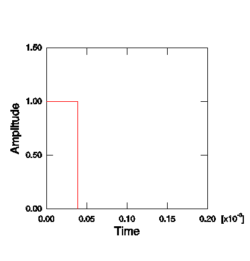
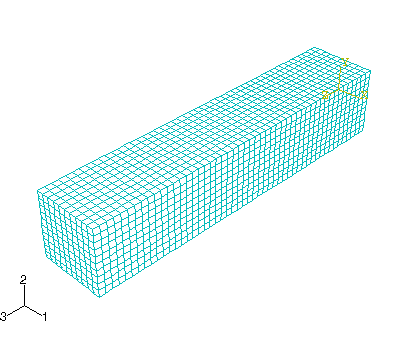
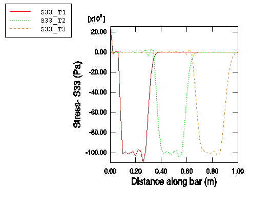

# 9.4 示例：杆中的应力波传播

本示例演示了前面在第2章"Abaqus基础"中描述的显式动力学的一些基本概念。它还说明了稳定性极限以及网格细化 和材料特性对求解时间的影响。

杆的尺寸如图9-1所示。如图所示，为了将问题简化为一维应变问题，四个侧面都设置在滚子上；因此，三维模型模拟了一维问题。材料为钢，特性如图9-1所示。杆的自由端承受爆炸载荷，幅值为1.0×10⁵ Pa，持续时间为3.88×10⁻⁵ s。归一化载荷与时间的关系如图9-2所示。

**图9-1** 杆中波传播示意图


**图9-2** 爆炸幅值与时间的关系



利用材料特性（忽略泊松比），我们可以用前面章节介绍的公式计算材料的波速。


在这个速度下，波在1.94×10⁻⁴ s内传到杆的固定端。由于我们关注的是应力波沿杆长方向随时间的传播，我们需要足够细化的网格来准确捕捉应力波。我们假设爆炸载荷将发生在10个单元的跨度上。为了确定这10个单元的长度，将爆炸持续时间乘以波速：


10个单元的长度为0.2 m。由于杆的总长度为1.0 m，沿长度方向将有50个单元。为了保持网格均匀，我们将在每个横向方向上也设置10个单元，使网格成为50×10×10。该网格如图9-3所示。

**图9-3** 50×10×10网格



在预处理器中创建此网格。使用图9-3中所示的坐标系。

## 9.4.1 节点和单元集合

本示例定义了节点和单元集合，用于施加载荷和边界条件以及可视化输出。节点集定义在相应的面上，如图9-4所示。

**图9-4** 节点集合


单元集合的定义如图9-5所示。

**图9-5** 建模用的单元集合


此外，本示例还定义了一个包含杆中心三个单元的单元集合。您可以手动定义此单元集合，选择这些单元，使其靠近自由端的面距离自由端分别为0.25 m、0.5 m和0.75 m，如图9-6所示。这些单元将用于后处理。

**图9-6** 后处理用的单元集合


## 9.4.2 检查输入文件——模型数据

在本节中，您将检查输入文件并添加其他信息。

**模型描述**

以下是该模拟的`*HEADING`选项的一个合适描述：

```
*HEADING
Stress wave propagation in a bar -- 50x10x10 elements
SI units (kg, m, s, N)
```

**单元连通性**

如果您使用预处理器创建输入文件，请检查以确保您使用的是正确的单元类型（C3D8R）。预处理器可能错误地指定了单元类型。本模型中的`*ELEMENT`选项块以下列内容开头：

```
*ELEMENT, TYPE=C3D8R, ELSET=BAR
```

如果您使用预处理器创建此输入文件，则模型中`*ELSET`参数的名称可能不是`BAR`。如有必要，将名称更改为`BAR`。

**截面属性**

所有单元的截面属性相同。在以下选项语句中，使用单元集合`BAR`为单元分配材料属性。

```
*SOLID SECTION, ELSET=BAR, MATERIAL=STEEL
```

**材料属性**

杆由钢制成，我们假设其为线弹性材料，弹性模量为207×10⁹ Pa，泊松比为0.3，密度为7800 kg/m³。以下材料选项块指定了这些值：

```
*MATERIAL, NAME=STEEL
*ELASTIC
207.0E9, 0.3
*DENSITY
7800.0,
```

**固定边界条件**

在本模型中，我们固定杆固定端（右侧）的所有平移，然后约束杆的前、后、顶、底面，使这些面位于滚子上，应变为单轴应变。使用先前定义的节点集，本模型使用以下边界条件：

```
*BOUNDARY
NFIX, 1, 3
NFRONT, 1, 1
NBACK, 1, 1
NTOP, 2, 2
NBOT, 2, 2
```

**幅值定义**

爆炸载荷瞬时施加到最大值，并保持恒定3.88×10⁻⁵ s。然后载荷突然移除并保持为零。使用`*AMPLITUDE`选项定义载荷和边界条件随时间的变化。在`*AMPLITUDE`选项后面的数据行上，以以下形式给出数据对：

```
<time>, <amplitude>, <time>, <amplitude>, etc.
```

每条数据行最多可输入四对数据。Abaqus认为幅值在最后给出的幅值之后保持恒定。以下`*AMPLITUDE`选项块定义了爆炸载荷的幅值：

```
*AMPLITUDE, NAME=BLAST
0., 1., 3.88E-5, 1., 3.89E-5, 0, 3.90E-5, 0.
```

## 9.4.3 检查输入文件——历史数据

我们现在来检查与此问题相关的历史数据，包括步骤定义、载荷、体积粘度和输出请求。

**步骤定义**

步骤定义表明这是一个显式动力学分析，持续时间为2.0×10⁻⁴ s。您也可以为步骤包含描述性标题。

```
*STEP
Blast loading
*DYNAMIC, EXPLICIT
, 2.0E-4
```

**载荷**

将值为1.0×10⁵ Pa的压力载荷施加到杆的自由面，您之前已将其定义为名为`ELOAD`的单元集合。任意给定时刻的压力载荷是`*DLOAD`选项下指定的幅值乘以从幅值曲线插值的值。为了正确施加载荷，您需要确定自由单元面的面标识符标签。对于"应力波在杆中的传播"（A.7节）中定义的模型，自由面是3号面，对应压力标识符`P3`。面标识符取决于`*ELEMENT`选项中定义节点的顺序，如图9-7所示。施加压力载荷时使用名为`BLAST`的幅值。

```
*DLOAD, AMPLITUDE=BLAST
ELOAD, <P1, P2, P3, P4, P5, or P6>, 1.0E5
```

如果您在预处理器中定义压力载荷，正确的面标识符应该会自动确定。

**图9-7** C3D8R单元的面标签标识符


**体积粘度**

为了保持应力波尽可能尖锐，二次体积粘度（如9.5.1节"体积粘度"中所讨论的）设置为零。

```
*BULK VISCOSITY
0.06, 0.0
```

**输出请求**

默认情况下，许多预处理器创建的Abaqus输入文件包含大量输出请求选项。如果您使用预处理器创建输入文件并发现创建了这些默认输出选项，请删除它们，因为它们通常会产生过多的输出。

您希望分析过程中创建输出数据库文件，以便使用Abaqus/Viewer对结果进行后处理。四个输出数据库帧（将数据写入输出数据库的间隔）足以显示应力波在网格中传播。本示例在`*OUTPUT`、`FIELD`选项上设置参数`VARIABLE=PRESELECT`，将`*DYNAMIC`、`EXPLICIT`程序的默认场数据写入输出数据库文件。此外，还请求在单元集合`EOUT`中每一步增量的应力（`S`）历史输出。

```
*OUTPUT, FIELD, VARIABLE=PRESELECT, NUMBER INTERVAL=4
*OUTPUT, HISTORY, FREQUENCY=1
*ELEMENT OUTPUT, ELSET=EOUT
S,
*END STEP
```

## 9.4.4 运行分析

将输入文件保存为`wave_50x10x10.inp`后，使用以下命令运行分析：

```
abaqus job=wave_50x10x10
```

如果分析未完成，请检查数据文件`wave_50x10x10.dat`和状态文件`wave_50x10x10.sta`中的错误消息。修改输入文件以消除错误。如果您仍然无法运行分析，请将您的输入文件与A.7节"应力波在杆中的传播"中给出的文件进行比较。

**状态文件**

状态文件`wave_50x10x10.sta`包含有关转动惯量的信息，然后是有关初始稳定性极限的信息。稳定性时间极限最低的10个单元按等级顺序列出。

```
   Most critical elements:
    Element number   Rank    Time increment   Increment ratio
   ----------------------------------------------------------
           1          1        2.237266E-06      1.000000E+00
          19          2        2.237266E-06      1.000000E+00
         201          3        2.237266E-06      1.000000E+00
         219          4        2.237266E-06      1.000000E+00
         301          5        2.237266E-06      1.000000E+00
         319          6        2.237266E-06      1.000000E+00
         501          7        2.237266E-06      1.000000E+00
         519          8        2.237266E-06      1.000000E+00
         601          9        2.237266E-06      1.000000E+00
         619         10        2.237266E-06      1.000000E+00
```

状态文件继续包含有关求解进度 information。

```
 STEP 1  ORIGIN 0.0000

  Total memory used for step 1 is approximately 7.1 megabytes.
  Global time estimation algorithm will be used.
  Scaling factor:  1.0000
  Variable mass scaling factor at zero increment:  1.0000

              STEP     TOTAL       CPU      STABLE    CRITICAL    KINETIC      TOTAL
INCREMENT     TIME      TIME      TIME   INCREMENT     ELEMENT     ENERGY     ENERGY
        0  0.000E+00 0.000E+00  00:00:00 1.819E-06           1  0.000E+00  0.000E+00
Results number 0 at increment zero.
ODB Field Frame Number      0 of      4 requested intervals at increment zero.
ODB Field Frame Number      0 of      2 requested intervals at increment zero.
        5  1.119E-05 1.119E-05  00:00:00 2.237E-06         619  4.504E-05 -1.963E-06
       10  2.237E-05 2.237E-05  00:00:00 2.237E-06       20015  9.189E-05 -2.218E-06
       15  3.401E-05 3.401E-05  00:00:00 2.907E-06       20311  1.406E-04 -2.252E-06
       19  4.560E-05 4.560E-05  00:00:00 2.888E-06       20311  1.577E-04  1.009E-06
       21  5.137E-05 5.137E-05  00:00:00 2.882E-06       20911  1.556E-04  2.239E-06
ODB Field Frame Number      1 of      4 requested intervals at  5.137395E-05
       25  6.289E-05 6.289E-05  00:00:00 2.873E-06       20803  1.539E-04  1.713E-07.
.
.
```

## 9.4.5 后处理

在操作系统提示符下输入以下命令启动Abaqus/Viewer：

```
abaqus viewer odb=wave_50x10x10
```

**沿路径绘制应力**

我们感兴趣的是观察沿杆长度的应力分布如何随时间变化。为此，我们将查看分析过程中三个不同时间的应力分布。

创建输出数据库文件前三个帧中沿杆轴线的3方向应力（`S33`）变化曲线。要创建这些图表，首先需要沿杆轴线定义一条直线路径。

**沿杆中心创建点列表路径的操作步骤：**

1. 在"结果树"中，双击"路径"。
   
   出现"创建路径"对话框。

2. 将路径命名为`Center`，选择"点列表"作为路径类型，然后点击"继续"。
   
   出现"编辑点列表路径"对话框。

3. 在"点坐标"表中，输入杆两端中心的坐标。输入指定从第一个点到第二个点的路径，如模型全局坐标系中所定义。
   
   **注意：** 如果您使用前面描述的过程生成几何和网格，表中条目为`0, 0, 1`和`0, 0, 0`。如果您使用替代过程生成杆几何，可以使用"查询"工具栏中的"图标"工具来确定杆每端中心的坐标。

4. 完成后，点击"确定"关闭"编辑点列表路径"对话框。

**保存沿路径在三个不同时间的应力X-Y图表的操作步骤：**

1. 在"结果树"中，双击"XY数据"。
   
   出现"创建XY数据"对话框。

2. 选择"路径"作为X-Y数据源，然后点击"继续"。
   
   出现"XY数据来自路径"对话框，您创建的路径显示在可用路径列表中。如果当前显示的是未变形模型形状，您选择的路径会在图表中高亮显示。

3. 在"点位置"下勾选"包含交点"。

4. 接受"真实距离"作为"X值"区域中的选择。

5. 在"Y值"区域中点击"场输出"打开"场输出"对话框。

6. 选择`S33`应力分量，然后点击"确定"。
   
   "XY数据来自路径"对话框中的场输出变量会发生变化，表明将创建3方向（`S33`）的应力数据。
   
   **注意：** Abaqus/Viewer可能会警告您场输出变量不会影响当前图像。将绘图状态保留为"保持不变"，然后点击"确定"继续。

7. 在"XY数据来自路径"对话框的"Y值"区域中点击"步骤/帧"。

8. 在出现的"步骤/帧"对话框中，选择帧1，这是五个记录帧中的第二个。（列出的第一个帧——帧0——是步骤开始时模型的基态。）点击"确定"。
   
   "XY数据来自路径"对话框的"Y值"区域会发生变化，表明将创建步骤1、帧1的数据。

9. 要保存X-Y数据，点击"另存为"。
   
   出现"将XY数据另存为"对话框。

10. 将X-Y数据命名为`S33_T1`，然后点击"确定"。
    
    `S33_T1`出现在结果树的"XY数据"容器中。

11. 重复步骤7到9，为帧2和帧3创建X-Y数据。分别将数据集命名为`S33_T2`和`S33_T3`。

12. 要关闭"XY数据来自路径"对话框，点击"取消"。

**绘制应力曲线的操作步骤：**

1. 在"XY数据"容器中，拖动光标选择所有三个X-Y数据集。

2. 点击鼠标右键，从出现的菜单中选择"绘制"。
   
   Abaqus/Viewer绘制帧1、2和3中沿杆中心的3方向应力，分别对应于约5×10⁻⁵ s、1×10⁻⁴ s和1.5×10⁻⁴ s的模拟时间。

3. 点击提示区的"取消"图标以取消当前过程。

**自定义X-Y图表的操作步骤：**

1. 双击Y轴。
   
   出现"轴选项"对话框。已选择"Y轴"。

2. 在"刻度"选项卡的"刻度模式"区域中，选择"按增量"，并指定Y轴主刻度线位于`20E3` Pa增量处。
   
   您也可以自定义轴标题。

3. 切换到"标题"选项卡。

4. 输入`Stress - S33 (Pa)`作为Y轴标题。

5. 要编辑X轴，在对话框的"X轴"字段中选择轴标签。在对话框的"标题"选项卡中，输入`Distance along bar (m)`作为X轴标题。

6. 点击"关闭"关闭"轴选项"对话框。

**自定义X-Y图表中曲线外观的操作步骤：**

1. 在可视化工具箱中，点击打开"曲线选项"对话框。

2. 在"曲线"字段中，选择`S33_T2`。

3. 为`S33_T2`曲线选择点线样式。
   
   `S33_T2`曲线变为点线。

4. 重复步骤2和3，使`S33_T3`曲线为虚线。

5. 关闭"曲线选项"对话框。
   
   自定义图表如图9-8所示。（为清晰起见，已更改默认网格和图例位置。）

**图9-8** 三个不同时间点沿杆的应力（`S33`）



我们可以看到，三个曲线中受应力波影响的杆长度约为0.2 m。这个距离应该对应于爆炸波在其施加时间内传播的距离，可以通过简单计算来验证。如果波前长度为0.2 m，波速为5.15×10³ m/s，则波传播0.2 m所需的时间为3.88×10⁻⁵ s。正如预期，这正是我们施加的爆炸载荷的持续时间。应力波在沿杆传播时并不完全是方形的。特别是，在应力突变后面有"振铃"或振荡。本章后面讨论的线性体积粘度会阻尼振铃，使其不会对结果产生不利影响。

**创建历史图**

另一种研究结果的方法是观察杆内三个不同点处应力随时间的变化。

**绘制应力历史的操作步骤：**

1. 在结果树中，右键点击"历史输出"并从出现的菜单中取消选择"分组子项"。

2. 选择三个单元的数据。使用`[Ctrl]+点击`选择多个X-Y数据集。

3. 点击鼠标右键，从出现的菜单中选择"绘制"。
   
   Abaqus/Viewer显示每个单元中沿纵向应力与时间的关系X-Y图。

4. 点击提示区的"取消"图标以取消当前过程。

与之前一样，您可以自定义图表的外观。

**自定义X-Y图表的操作步骤：**

1. 双击X轴。
   
   出现"轴选项"对话框。

2. 切换到"标题"选项卡。

3. 指定`Total time (s)`作为X轴标题。

4. 点击"关闭"关闭对话框。

**自定义X-Y图表中曲线外观的操作步骤：**

1. 在可视化工具箱中，点击打开"曲线选项"对话框。

2. 在"曲线"字段中，选择对应于最靠近杆自由端的单元的临时X-Y数据标签。（在这个集合中，这个单元首先受到应力波的影响。）

3. 输入`S33-0.25`作为曲线图例文本。

4. 在"曲线"字段中，选择对应于杆中心的单元的临时X-Y数据标签。（这是下一个受到应力波影响的单元。）

5. 指定`S33-0.5`作为曲线图例文本，并将曲线样式更改为点线。

6. 在"曲线"字段中，选择对应于最靠近杆固定端的单元的临时X-Y数据标签。（这是最后一个受到应力波影响的单元。）

7. 指定`S33-0.75`作为曲线图例文本，并将曲线样式更改为虚线。

8. 点击"关闭"关闭对话框。
   
   自定义图表如图9-9所示。（为清晰起见，已更改默认网格和图例位置。）

**图9-9** 沿杆长度三个点（0.25 m、0.5 m和0.75 m）处应力（`S33`）的时间历史


在历史图中，我们可以看到给定点的应力随着应力波通过该点而增加。一旦应力波完全通过该点，该点的应力就会在零附近振荡。

## 9.4.6 网格如何影响稳定时间增量和CPU时间

在9.3节"自动时间增量和稳定性"中，我们讨论了网格细化如何影响稳定性极限和CPU时间。在这里，我们将用波传播问题来说明这种影响。我们从沿长度方向有50个单元、每个横向方向有10个单元的合理细化方形单元网格开始。为了说明目的，我们现在使用25×5×5单元的粗网格，并观察沿各个方向细化网格如何改变CPU时间。四种网格如图9-10所示。

**图9-10** 从最粗到最细的网格


表9-1显示了对于这个问题，CPU时间（相对于粗网格模型结果归一化）如何随网格细化而变化。表的前半部分提供了基于本指南中给出的简化稳定性方程的预期结果；后半部分提供了在台式工作站上使用Abaqus/Explicit运行分析获得的结果。

**表9-1** 网格细化与求解时间

| 网格 | 简化理论 | | | 实际 | | |
|------|----------|----------|----------|----------|----------|----------|
| | Δt (s) | 单元数 | CPU时间 (s) | 最大Δt (s) | 单元数 | 归一化CPU时间 |
| 25×5×5 | A | B | C | 5.754E-06 | 625 | 1 |
| 50×5×5 | A/2 | 2B | 4C | 2.954E-06 | 1250 | 4 |
| 50×10×5 | A/2 | 4B | 8C | 2.933E-06 | 2500 | 8.33 |
| 50×10×10 | A/2 | 8B | 16C | 2.907E-06 | 5000 | 16.67 |

对于理论结果，我们选择最粗的网格25×5×5作为基态，我们将稳定时间增量、单元数和CPU时间分别定义为变量A、B和C。随着网格细化，两件事发生：最小单元尺寸减小，网格中的单元数增加。每个效果都会增加CPU时间。在第一级细化中，50×5×5网格，最小单元尺寸减半，单元数加倍，使CPU时间比上一个网格增加四倍。然而，进一步加倍网格到50×10×5不会改变最小单元尺寸；它只是使单元数加倍。因此，CPU时间只比50×5×5网格增加一倍。进一步细化网格使单元在50×10×10网格中均匀且为方形，再次使单元数和CPU时间加倍。

这个简化计算很好地预测了网格细化如何影响稳定时间增量和CPU时间的趋势。然而，我们没有比较预测和实际的稳定时间增量值，原因如下。首先，回想一下我们近似地认为稳定时间增量为：


然后我们假设特征单元长度$L^c$是最小单元尺寸，而Abaqus/Explicit实际上是根据单元的整体大小和形状来确定特征单元长度的。另一个复杂因素是Abaqus/Explicit采用全局稳定性估计器，这允许使用更大的稳定时间增量。这些因素使得在运行分析之前难以准确预测稳定时间增量。然而，由于趋势很好地遵循了简化理论，因此可以直接预测稳定时间增量如何随网格细化而变化。

## 9.4.7 材料如何影响稳定时间增量和CPU时间

对不同材料执行相同的波传播分析将需要不同的CPU时间，这取决于材料的波速。例如，如果我们将材料从钢改为铝，波速将从5.15×10³ m/s变为：


从铝到钢的变化对稳定时间增量的影响很小，因为刚度和密度相差几乎相同。对于铅来说，差异更为显著，波速降低到：


这大约是钢波速的五分之一。铅杆的稳定时间增量将是我们钢杆稳定时间增量的五倍。
