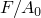
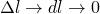
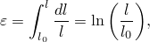
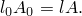
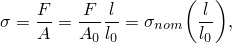
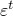

# 10.2 延性金属的塑性

许多金属在小应变范围内具有近似线性的弹性行为（参见图10-1），材料的刚度（即杨氏模量或弹性模量）是恒定的。

)

**图 10-1** 小应变条件下线弹性材料（如钢）的应力-应变行为。

在更高的应力（和应变）水平下，金属开始表现出非线性的非弹性行为（参见图10-2），这被称为塑性。

)

**图 10-2** 拉伸试验中弹塑性材料的公称应力-应变行为。

## 10.2.1 延性金属塑性的特征

材料的塑性行为由其屈服点和屈服后硬化来描述。从弹性到塑性行为的转变发生在材料应力-应变曲线的某个点，即弹性极限或屈服点（参见图10-2）。屈服点的应力称为屈服应力。在大多数金属中，初始屈服应力是材料弹性模量的0.05%到0.1%。

金属在达到屈服点之前的变形只会产生弹性应变，如果移除施加的载荷，这些应变会完全恢复。然而，一旦金属中的应力超过屈服应力，永久（非弹性）变形就开始发生。与这种永久变形相关的应变称为塑性应变。在屈服后区域，随着金属变形，弹性应变和塑性应变都会累积。

一旦材料屈服，金属的刚度通常会显著降低（参见图10-2）。已经屈服的延性金属在移除施加的载荷时会恢复其初始弹性刚度（参见图10-2）。材料的塑性变形通常会提高其后续加载时的屈服应力：这种行为称为加工硬化。

金属塑性的另一个重要特征是，非弹性变形与近乎不可压缩的材料行为相关。模拟这种效应对弹塑性模拟中可使用的单元类型施加了一些严格的限制。

在拉伸载荷下发生塑性变形的金属在材料失效时可能会经历高度局部化的延伸和变薄，称为**颈缩**（参见图10-2）。金属中的工程应力（单位未变形面积的力）称为**公称应力**，其共轭量是**公称应变**（单位未变形长度的长度变化）。金属在颈缩时的公称应力远低于材料的极限强度。这种材料行为是由试验标本的几何形状、试验本身的性质以及所使用的应力和应变度量引起的。例如，在压缩条件下测试相同材料会产生没有颈缩区域的应力-应变图，因为在压缩载荷下变形时标本不会变薄。描述金属塑性行为的数学模型应该能够独立于结构的几何形状或施加载荷的性质来考虑压缩和拉伸行为之间的差异。如果将公称应力和公称应变的传统定义（其中下标0表示材料未变形状态的数值）替换为考虑有限变形过程中面积变化的新应力和应变度量，就可以实现这一目标。

## 10.2.2 有限变形的应力和应变度量

只有在的极限情况下，压缩和拉伸应变才是相同的；即：

和

其中*l*是当前长度，是原始长度，是**真应变**或**对数应变**。

与真应变共轭的应力度量称为**真应力**，定义为：

其中*F*是材料中的力，*A*是当前面积。承受有限变形的延性金属如果在真应力对真应变图上显示，则在拉伸和压缩中具有相同的应力-应变行为。

## 10.2.3 在Abaqus中定义塑性

在Abaqus中定义塑性数据时，必须使用**真应力**和**真应变**。Abaqus需要这些值来正确解释数据。

通常，材料试验数据是以公称应力和应变的数值提供的。在这种情况下，您必须使用下面给出的表达式将塑性材料数据从公称应力-应变值转换为真应力-应变值。

真应变与公称应变之间的关系可以通过将公称应变表示为：

对该表达式的两边加一并取自然对数，可得真应变与公称应变之间的关系：

真应力与公称应力之间的关系是通过考虑塑性变形的不可压缩性并假设弹性也是不可压缩的而建立的，所以：

当前面积与原始面积的关系为：

将*A*的这个定义代入真应力的定义，可得：

其中

也可以写成：

进行最后的代换后，可得真应力与公称应力和应变之间的关系：

这些关系仅在颈缩之前有效。

Abaqus中的经典金属塑性模型定义了大多数金属的屈服后行为。Abaqus用连接给定数据点的一系列直线来近似材料的平滑应力-应变行为。可以使用任意数量的点来近似实际材料行为；因此，可以非常接近地近似实际材料行为。塑性数据定义了材料真屈服应力作为真塑性应变函数的关系。给出的第一个数据定义了材料的初始屈服应力，因此应具有为零的塑性应变。

用于定义塑性行为的材料试验数据中提供的应变不一定是材料中的塑性应变。相反，它们可能是材料中的总应变。您必须将这些总应变值分解为弹性和塑性应变分量。塑性应变通过从总应变值中减去弹性应变来获得，弹性应变定义为真应力除以杨氏模量（参见图10-3）。

)

**图 10-3** 总应变分解为弹性和塑性分量。

这个关系写为：

其中

是真塑性应变，

是真总应变，

是真弹性应变，

是真应力，且

*E*是杨氏模量。

**将材料试验数据转换为Abaqus输入的示例**

图10-4中的公称应力-应变曲线将作为如何将定义材料塑性行为的试验数据转换为Abaqus适当输入格式的示例。图10-4中显示的六个点将用于确定塑性数据。

)

**图 10-4** 弹塑性材料行为。

第一步是使用前面所示的真应力与公称应力和应变之间的关系以及真应变与公称应变之间的关系，将公称应力和公称应变转换为真应力和真应变。一旦这些值已知，就可以使用前面所示的塑性应变与总应变和弹性应变之间的关系来确定与每个屈服应力值相关的塑性应变。转换后的数据如表10-1所示。

**表 10-1** 应力和应变转换。

| 公称应力 (Pa) | 公称应变 | 真应力 (Pa) | 真应变 | 塑性应变 |
|:---:|:---:|:---:|:---:|:---:|
| 200E6 | 0.00095 | 200.2E6 | 0.00095 | 0.0 |
| 240E6 | 0.025 | 246E6 | 0.0247 | 0.0235 |
| 280E6 | 0.050 | 294E6 | 0.0488 | 0.0474 |
| 340E6 | 0.100 | 374E6 | 0.0953 | 0.0935 |
| 380E6 | 0.150 | 437E6 | 0.1398 | 0.1377 |
| 400E6 | 0.200 | 480E6 | 0.1823 | 0.1800 |

虽然在小应变时公称值和真值之间几乎没有差异，但在较大应变值时存在非常显著的差异；因此，如果模拟中的应变较大，向Abaqus提供正确的应力-应变数据就极为重要。

**Abaqus/Explicit中的数据正则化**

执行分析时，Abaqus/Explicit可能不会完全按照用户定义的方式使用材料数据；为了提高效率，所有以表格形式定义的材料数据都会自动**正则化**。材料数据可以是温度、外部场和内状态变量（如塑性应变）的函数。对于每个材料点计算，必须通过插值确定材料的状态，并且为了提高效率，Abaqus/Explicit用由等间距点组成的曲线来拟合用户定义的曲线。这些正则化材料曲线是分析中使用的材料数据。了解分析中使用的正则化材料曲线与您指定的曲线之间可能存在的差异是很重要的。

为了说明使用正则化材料数据的影响，考虑以下两种情况。图10-5显示了一个用户定义了未正则化数据的案例。

)

**图 10-5** 可以精确正则化的用户数据示例。

在这个例子中，Abaqus/Explicit生成了显示的六个正则数据点，用户的数据被精确重现。图10-6显示了一个用户定义的数据难以精确正则化的案例。在这个例子中，假设Abaqus/Explicit通过将范围划分为10个区间来正则化数据，这些区间不会精确重现用户的数据点。

)

**图 10-6** 难以正则化的用户数据示例。

Abaqus/Explicit尝试使用足够数量的区间，使得正则化数据与用户定义数据之间的最大误差小于3%；但是，您可以更改此误差容限。如果需要超过200个区间来获得可接受的正则化曲线，分析会在数据检查期间停止并显示错误消息。一般来说，如果用户定义的最小区间相对于自变量范围较小，则正则化会更困难。在图10-6中，应变为1.0的数据点使得应变值范围相对于低应变水平定义的较小区间较大。移除最后这个数据点可以使数据更容易被正则化。

**数据点之间的插值**

Abaqus在提供的数据点之间（或在Abaqus/Explicit中是正则化数据）进行线性插值以获得材料的响应，并假设响应在输入数据定义的范围之外是恒定的，如图10-7所示。因此，这种材料的应力永远不会超过480 MPa；当材料中的应力达到480 MPa时，材料将持续变形，直到应力降至该值以下。

)

**图 10-7** Abaqus使用的材料曲线。

**Abaqus/CAE中的材料校准**

Abaqus/CAE允许您从试验数据校准材料模型。利用此功能，您可以将材料试验数据导入Abaqus/CAE，处理数据，并从数据中导出弹性和塑性各向同性材料行为。此功能的详细讨论见《Abaqus/CAE用户手册》第12.17节"创建材料校准"。
