# 10.4 示例：带塑性的连接耳片

您需要研究如果第4章"使用连续体单元"中介绍的钢制连接耳片受到极端载荷（60 kN）会发生什么情况。线性分析的结果表明耳片会发生屈服。您需要确定耳片中塑性变形的程度和塑性应变的大小，以便评估耳片是否会失效。本分析不需要考虑惯性效应；因此，您将使用Abaqus/Standard来检查耳片的静态响应。

可用的钢制材料唯一下述非弹性数据：屈服应力（380 MPa）和断裂应变（0.15）。您假定钢为完全塑性材料：材料不会硬化，且应力永远不超过380 MPa（见图10-8）。

**图10-8** 钢的应力-应变行为。

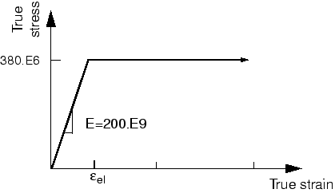

实际上，可能会发生一定程度的硬化，但这种假定是保守的；如果材料发生硬化，塑性应变将小于模拟预测的值。

Abaqus提供了复制此问题完整分析模型的脚本。如果您难以按照以下说明进行操作，或希望检查您的工作，可以运行这些脚本。脚本位于以下位置：

- 本示例的Python脚本在"带塑性的连接耳片"（第A.8节）中提供。如何获取脚本并在Abaqus/CAE中运行的说明在附录A"示例文件"中给出。
- 本示例的插件脚本可在Abaqus/CAE插件工具集中找到。要从Abaqus/CAE运行脚本，请选择**Plug-ins（插件）**→**Abaqus**→**Getting Started（入门）**；高亮显示**Connecting lug with plasticity（带塑性的连接耳片）**；然后单击**Run（运行）**。有关入门插件的更多信息，请参阅Abaqus/CAE用户指南第82.1节"运行Abaqus入门示例"。

如果您无法访问Abaqus/CAE或其他前处理器，可以手动创建本问题所需的输入文件，详见《Abaqus入门：关键词版》第10.4节"示例：带塑性的连接耳片"。

## 10.4.1 模型的修改

打开模型数据库文件 `Lug.cae`，并将 `Elastic` 模型复制到名为 `Plastic` 的模型中。

**材料定义**

对于 `Plastic` 模型，您将使用Abaqus中的经典金属塑性模型来指定材料的后屈服行为。零塑性应变时的初始屈服应力为380 MPa。由于您将钢建模为完全塑性材料，不需要其他屈服应力。您将执行一般的非线性模拟，因为模型中存在非线性材料行为。

**向材料模型添加塑性数据：**

1. 在模型树中，展开**Materials（材料）**容器，双击**Steel（钢）**。
2. 在材料编辑器中，选择**Mechanical（机械）**→**Plasticity（塑性）**→**Plastic（塑性）**来调用经典金属塑性模型。输入初始屈服应力 `380.E6`，对应的初始塑性应变为 `0.0`。

**步骤定义和输出请求**

编辑步骤定义和输出请求。在**Edit Step（编辑步骤）**对话框的**Basic（基本）**选项卡页面中，接受总时间周期 `1.0`，并假定几何非线性的影响在本模拟中不重要。在**Incrementation（增量）**选项卡页面中，指定初始增量大小为总步骤时间的20%（`0.2`）。本模拟是耳片在极端载荷下的静态分析；您预先不知道此模拟可能需要多少个增量。然而，默认的最大值100个增量是相当大的，应该足以完成本分析。

打开**Field Output Requests Manager（场输出请求管理器）**。编辑当前输出请求以在每个增量请求预选默认值。

**载荷**

本模拟中施加的载荷是线性弹性耳片模拟中施加载荷的两倍（60 kN vs. 30 kN）。因此，在模型树中，双击**Loads（载荷）**容器下的**Pressure load（压力载荷）**，并将施加在耳片上的压力大小加倍（即，将大小改为 `10.0E7`）。

**作业定义**

在模型树中，创建名为 `PlasticLugNoHard` 的作业，并输入以下作业描述：`Elastic-Plastic Steel Connecting Lug（弹塑性钢制连接耳片）`。请记住保存您的模型数据库文件。

提交作业进行分析，并监控求解进度。纠正任何建模错误，并调查任何警告信息的来源。本分析应该会提前终止；原因将在下一节讨论。

## 10.4.2 作业监控和诊断

您可以通过查看**Job Monitor（作业监控器）**来监控分析运行时的进度。

**作业监控器**

当Abaqus/Standard完成模拟后，**Job Monitor（作业监控器）**将包含类似于图10-9所示的信息。

**图10-9** **Job Monitor（作业监控器）**：完全塑性连接耳片。

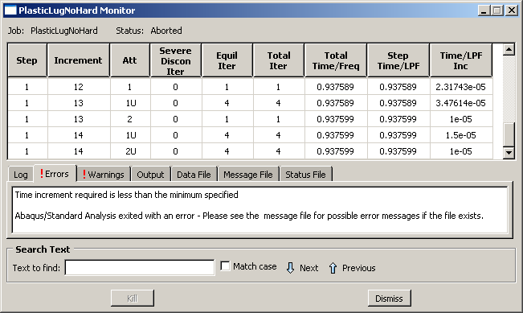

Abaqus/Standard只能将94%的规定载荷施加到模型上。**Job Monitor（作业监控器）**显示Abaqus/Standard在模拟过程中多次减小了时间增量的大小（显示在最后一列），并在第14个增量时停止了分析。**Errors（错误）**选项卡页面上的信息（见图10-9）表明分析已终止。单击**Message File（消息文件）**选项卡查看消息文件中的错误详细信息，如图10-10所示。错误表明分析终止是因为时间增量的大小小于本分析允许的值。这是收敛困难的典型症状，是时间增量大小持续减小直接导致的结果。要开始诊断问题，请在**Job Monitor（作业监控器）**对话框中单击**Warnings（警告）**选项卡。如图10-11所示，这里会发现许多关于大应变增量和塑性计算问题的警告消息。这些警告是相关的，因为塑性计算问题通常是大应变增量的结果，往往导致发散。因此，我们怀疑塑性计算的数值问题导致Abaqus/Standard提前终止分析。

**图10-10** **Message File（消息文件）**：错误描述。

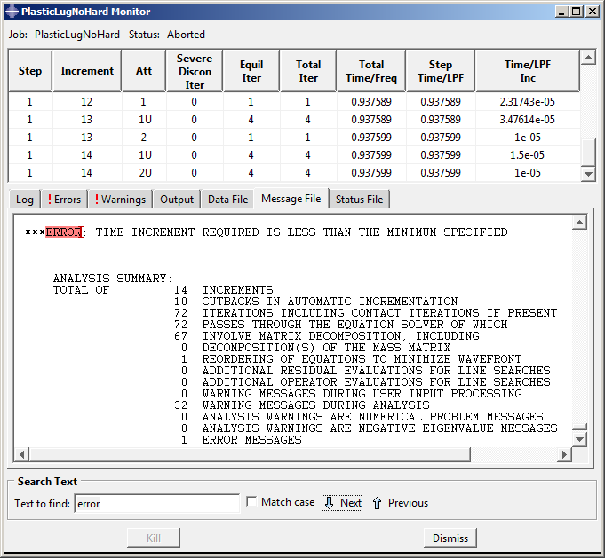

**图10-11** **Warnings（警告）**：完全塑性连接耳片。

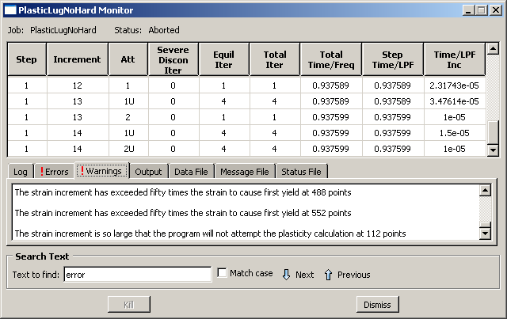

**作业诊断**

进入**Visualization（可视化）**模块，打开文件 `PlasticLugNoHard.odb`。打开**Job Diagnostics（作业诊断）**对话框检查作业的收敛历史。查看分析第一个增量的信息（见图10-12），您会发现模型的初始行为被确定为线性。

**图10-12** **Increment 1（增量1）**的收敛历史。

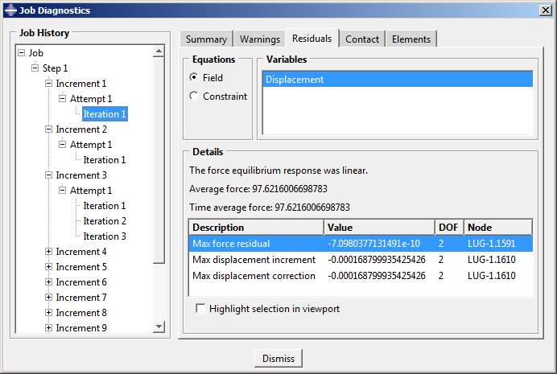

此判断基于残差的大小  小于10^-8 （时间平均力）；位移校正准则在这种情况下被忽略。模型在第二个增量中的行为也是线性的（见图10-13）。

**图10-13** **Increment 2（增量2）**的收敛历史。

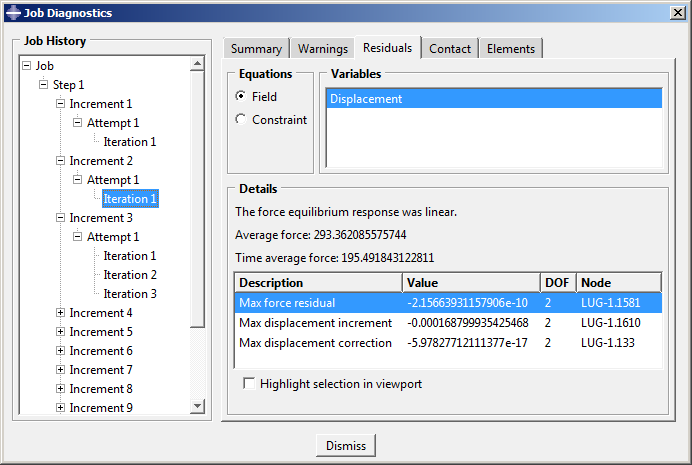

Abaqus/Standard在第三个增量中获得收敛解需要多次迭代，这表明非线性行为在此增量期间发生在模型中。模型中唯一的非线性是塑性材料行为，因此钢必定在此施加载荷大小下开始在耳片的某个位置发生屈服。第三个增量的最终（收敛）迭代摘要如图10-14所示。

**图10-14** **Increment 3（增量3）**的收敛历史。

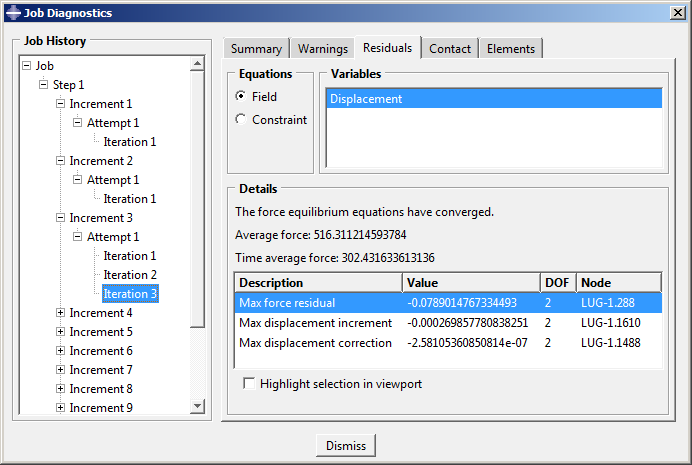

Abaqus/Standard在第四个增量中尝试使用0.3的增量大小来寻找解决方案，这意味着它在此增量期间施加了总载荷的30%，即18 kN。经过多次迭代后，Abaqus/Standard放弃尝试并将时间增量大小减小到第一次尝试所用值的25%。这种增量大小的减小称为**cutback（回退）**。使用较小的增量大小，Abaqus/Standard仅用几次迭代就找到了收敛解。

更仔细地查看第四个增量第一次尝试的信息（这是收敛困难首次出现的地方）。对于此尝试，Abaqus/Standard检测到多个单元的积分点处存在大应变增量，如图10-15所示。

**图10-15** **Increment 4（增量4）**的收敛历史。

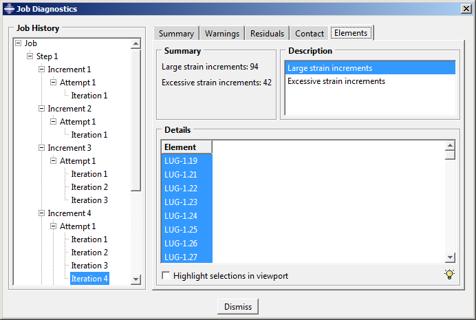

"大"应变增量是指超过初始屈服应变50倍的增量；其中一些增量也被认为是"过度的"，这意味着在这些受影响的积分点甚至不会尝试塑性计算。因此，我们看到收敛困难的发生与大和过度的应变增量以及塑性计算问题直接相关。

Abaqus/Standard在后续增量中遇到重新出现的收敛困难，直到最终终止作业。在许多这些增量中，Abaqus/Standard会减小时间增量大小，因为应变增量太大，以至于甚至不执行塑性计算。因此，我们得出结论，整体收敛困难确实是塑性计算数值问题的结果。

对总应变增量大小的这种检查是Abaqus/Standard为确保您的模拟获得的解既准确又高效而使用的许多自动求解控制示例之一。自动求解控制适用于几乎所有模拟。因此，您不必担心为求解算法提供参数：您只需要关心模型的输入数据。

使用**Job Diagnostics（作业诊断）**对话框可以发现一个有趣的观察：在几乎所有遇到收敛问题的地方，具有大或过度应变增量的单元位于耳片固定端附近（屈服开始的地方），而位移校正最大的节点位于耳片加载端附近。这意味着加载端想要变形的程度超过了固定端所能支撑的程度。变形模型形状图可以帮助您进一步研究此观察。

## 10.4.3 后处理结果

在**Visualization（可视化）**模块中查看结果，以了解导致过度塑性的原因。

**绘制变形模型形状**

创建模型变形形状图，并检查此形状是否合理。

默认视图是等轴测视图。您可以使用**View（视图）**菜单中的选项或**View Manipulation（视图操作）**工具栏中的工具来设置图10-16中所示的视图；在此图中透视也被关闭了。

**图10-16** 使用无硬化模拟结果时的变形模型形状。

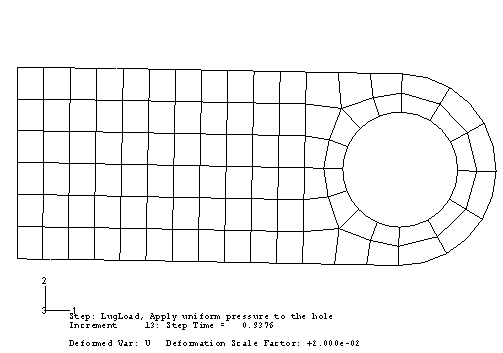

图中显示的耳片的位移和旋转（特别是旋转）很大，但似乎还不足以引起模拟中看到的所有数值问题。仔细查看图标题中的信息以获取解释。此图中使用的变形比例因子为0.02；即，位移被缩放为其实际值的2%。（您的变形比例因子可能不同。）

在几何线性模拟中，Abaqus/CAE总是对位移进行缩放，使模型的变形形状适合视口。（这与几何非线性模拟形成对比，在几何非线性模拟中，Abaqus/CAE不会缩放位移，而是通过放大或缩小来调整视图以使变形形状适合图。）要绘制实际位移，请将变形比例因子设置为1.0。这将生成耳片变形到几乎与垂直全局*Y*轴平行的模型图。

60 kN的施加载荷超过了耳片的极限载荷，当材料在其整个厚度上的所有积分点发生屈服时，耳片会发生坍塌。由于钢的完全塑性后屈服行为，耳片没有刚度来抵抗进一步的变形。这与之前关于大应变增量位置和最大位移校正位置的观察一致。

## 10.4.4 向材料模型添加硬化

使用完全塑性材料行为进行的连接耳片模拟预测耳片将因结构坍塌而发生灾难性失效。我们已经提到钢在屈服后可能会表现出一些硬化。您怀疑包含硬化行为将允许耳片承受此60 kN载荷，因为它会提供额外的刚度。因此，您决定向钢的材料属性定义添加一些硬化。假定屈服应力在塑性应变0.35时增加到580 MPa，这代表了此类钢的典型硬化。修改后材料模型的应力-应变曲线如图10-17所示。

**图10-17** 钢的修改后应力-应变行为。

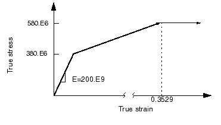

修改您的塑性材料数据以包含硬化数据。编辑材料定义以向塑性数据表单添加第二行数据。输入屈服应力 `580.E6`，对应的塑性应变为 `0.35`。

## 10.4.5 运行带塑性硬化的分析

创建名为 `PlasticLugHard` 的作业。提交作业进行分析，并监控求解进度。纠正任何建模错误，并调查任何警告信息的来源。

**作业监控器**

**Job Monitor（作业监控器）**中的分析摘要（见图10-18）表明Abaqus/Standard在施加完整60 kN载荷时找到了收敛解。添加的硬化数据为耳片提供了足够的刚度以防止其在60 kN载荷下坍塌。

分析过程中没有发出与收敛相关的警告，因此您可以直接进入后处理结果。

**图10-18** **Job Monitor（作业监控器）**：带塑性硬化的连接耳片。

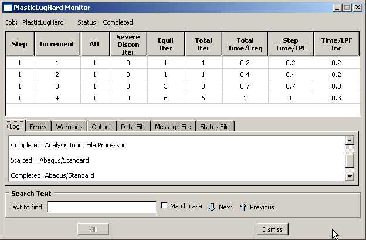

## 10.4.6 后处理结果

进入**Visualization（可视化）**模块，打开文件 `PlasticLugHard.odb`。

**变形模型形状和峰值位移**

使用这些新结果绘制变形模型形状，并将变形比例因子更改为2，以获得类似于图10-19的图。显示的变形是实际变形的两倍。

**图10-19** 带塑性硬化模拟的变形模型形状。

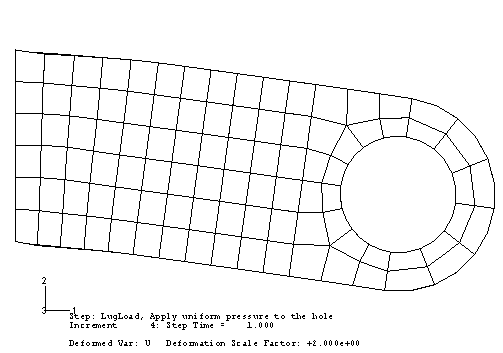

**Mises应力等值线图**

对模型中的Mises应力进行等值线处理。使用十个等值线间隔在耳片的实际变形形状上创建填充等值线图（即，将变形比例因子设置为1.0），并抑制图标题和状态块。使用视图操作工具定位和调整模型大小，以获得类似于图10-20所示的图。

**图10-20** Mises应力等值线。

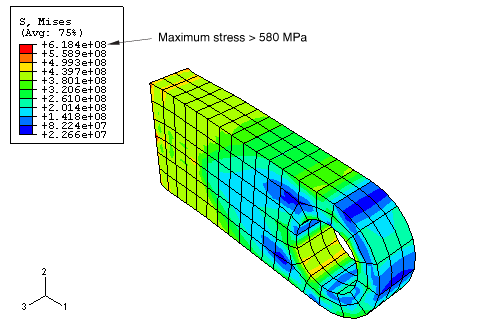

等值线图例中列出的值是否令您惊讶？最大应力大于580 MPa，这本不应该发生，因为假定材料在此应力大小下是完全塑性的。这种误导性结果是由于Abaqus/CAE用于创建单元变量（如应力）等值线图的算法导致的。等值线算法需要节点处的数据；然而，Abaqus/Standard在积分点计算单元变量。Abaqus/CAE通过从积分点外推数据到节点来计算单元变量的节点值。外推顺序取决于单元类型；对于二阶减缩积分单元，Abaqus/CAE使用线性外推来计算单元变量的节点值。为了显示Mises应力等值线图，Abaqus/CAE从每个单元内的积分点外推应力分量到节点位置，并计算Mises应力。如果Mises应力值的差异在指定的平均阈值内，则从每个周围单元的不变应力值计算节点平均Mises应力。外推过程可能产生超过弹性极限的不变值。

尝试绘制应力张量每个分量的等值线（变量 `S11`、`S22`、`S33`、`S12`、`S23` 和 `S13`）。您将看到在固定端的这些应力存在显著变化。这导致外推的节点应力高于积分点处的值。因此，由这些值计算的Mises应力也会更高。

> **注意：**
> 单元类型C3D10I不受此的外推问题影响。此单元类型的积分点位于节点处，从而改善了表面应力可视化。

积分点处的Mises应力永远不会超过单元材料的当前屈服应力；然而，等值线图中报告的外推节点值可能会超过。此外，各应力分量可能具有超过当前屈服应力值的幅度；只有Mises应力被要求具有小于或等于当前屈服应力值的幅度。

您可以使用**Visualization（可视化）**模块中的查询工具来检查积分点处的Mises应力。

**查询Mises应力：**

1. 从主菜单栏中选择**Tools（工具）**→**Query（查询）**；或使用**Query（查询）**工具栏中的  工具。
   此时将出现**Query（查询）**对话框。
2. 在**Visualization Module Queries（可视化模块查询）**字段中，选择**Probe values（探测值）**。
   此时将出现**Probe Values（探测值）**对话框。
3. 确保选择了**Elements（单元）**和输出位置**Integration Pt（积分点）**。
4. 使用光标选择耳片约束端附近的单元。
   Abaqus/CAE默认报告单元ID和类型，以及从第一个积分点开始的每个积分点处Mises应力的值。积分点处的Mises应力值都低于等值线图例中报告的值，也低于580 MPa的屈服应力。您可以单击鼠标按钮1存储探测值。
5. 探测完结果后单击**Cancel（取消）**。

外推值与积分点值差异如此之大这一事实表明，应力在单元之间存在快速变化，并且网格对于精确应力计算而言太粗了。如果网格被细化，这种外推误差会减小，但始终会在一定程度上存在。因此，始终要谨慎使用单元变量的节点值。

**等效塑性应变等值线图**

材料中的等效塑性应变（`PEEQ`）是用于表示材料非弹性变形的标量变量。如果此变量大于零，则材料已屈服。可以通过选择`PEEQ`来识别耳片中发生屈服的区域：在**Field Output（场输出）**工具栏左侧的变量类型列表中选择**Primary（主）**，然后从输出变量列表中选择**PEEQ**。在Abaqus/CAE中以深色显示的区域仍然具有弹性材料行为（见图10-21）。

**图10-21** 等效塑性应变（`PEEQ`）等值线。

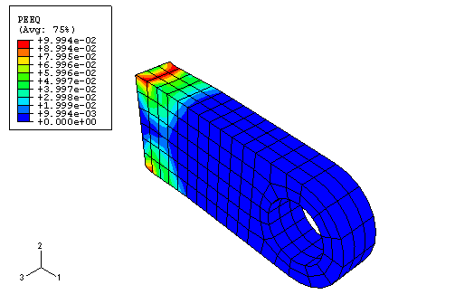

从图中可以明显看出，耳片与母结构连接处发生了整体屈服。等值线图例中报告的最大塑性应变约为10%。但是，此值可能包含来自外推过程的误差。使用查询工具  检查具有最大塑性应变单元中`PEEQ`的积分点值。您会发现模型中最大的等效塑性应变在积分点处约为0.087。这并不一定表示大的外推误差，因为在峰值塑性变形附近存在应变梯度。

**创建变量-变量（应力-应变）图**

Abaqus/CAE中的*X–Y*绘图功能在本指南的前面已经介绍过。在本节中，您将学习如何创建显示一个变量作为另一个变量函数的*X–Y*图。您将使用保存到输出数据库（`.odb`）文件的应力和应变数据（以场输出而非历史输出的形式）来创建耳片约束端附近单元中一个积分点的应力-应变图。

考虑图10-22中所示的阴影单元。

**图10-22** 将研究应力和应变历史的单元。

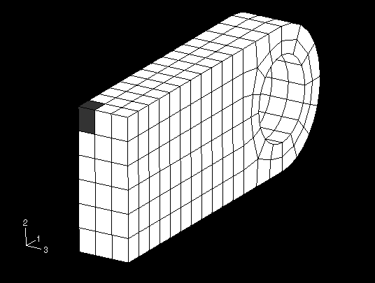

我们将在此单元的一个积分点绘制应力和应变历史。所选积分点应尽可能靠近耳片的上表面，但不与约束节点相邻。积分点的编号取决于单元的节点连通性。因此，您需要确定单元的标签及其节点连通性，以确定要使用的积分点。

**确定积分点编号：**

1. 在**Display Group（显示组）**工具栏中，选择**Replace Selected（替换所选）**  工具，然后单击图10-22中所示的阴影单元。
2. 使用可见的节点标签绘制此单元的未变形形状。单击自动拟合工具  以获得类似于图10-23的图。

**图10-23** 靠近上表面的积分点位置。

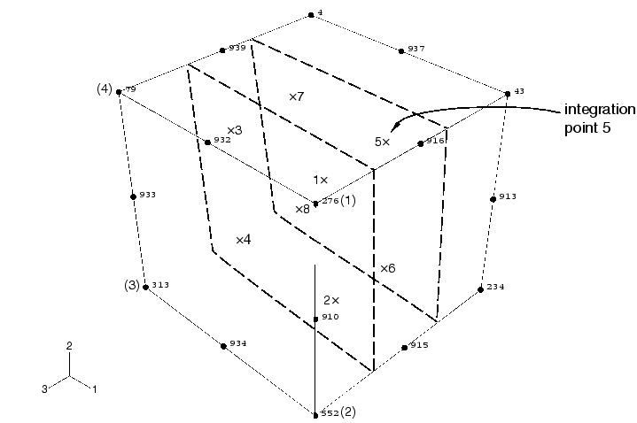

3. 使用**Query（查询）**工具获取此角单元的节点连通性（选择**Element（单元）**，然后在视口中单击单元）。节点连通性将打印到消息区域；您只对前四个节点感兴趣。
4. 将节点连通性列表与未变形模型形状图进行比较，以确定您的C3D20R单元上的哪个面对应于1–2–3–4面。例如，在图10-23中，276–552–313–79面对应于1–2–3–4面。因此，积分点的编号如图所示。我们对对应于积分点5的点感兴趣。

在以下讨论中，假定单元标签为41，此单元的积分点5满足上述要求。您的单元和/或积分点编号可能不同。

**创建沿耳片的应力和直接应变历史曲线：**

1. 在Results Tree中，双击**XYData**。
   此时将出现**Create XY Data（创建XY数据）**对话框。
2. 在此对话框中，选择**ODB field output（ODB场输出）**作为源，然后单击**Continue（继续）**。
   此时将出现**XY Data from ODB Field Output（来自ODB场输出的XY数据）**对话框；默认情况下**Variables（变量）**选项卡页面是打开的。
3. 在此对话框中，展开以下列表：**S: Stress components（应力分量）**和**E: Strain components（应变分量）**。
4. 从可用的应力和应变分量列表中，分别选择**Mises**和**E11**。
   使用Mises应力而不是真实应力张量的分量，因为塑性模型以Mises应力定义塑性屈服。E11应变分量被使用是因为它是此处总应变张量中最大的分量；使用它可以清楚地显示此积分点处材料的弹性和塑性行为。
5. 单击**Elements/Nodes（单元/节点）**选项卡。
6. 接受**Pick from viewport（从视口拾取）**作为选择方法，然后单击**Edit Selection（编辑选择）**。
7. 在视口中单击图10-22中所示的阴影单元；然后在提示区域单击**Done（完成）**。
8. 单击**Save（保存）**保存数据，然后单击**Dismiss（关闭）**关闭对话框。

创建了16条曲线（每个积分点每个变量一条），并为曲线指定了默认名称。曲线出现在**XYData**容器中。每条曲线都是历史（变量vs.时间）图。您必须组合感兴趣积分点的图，消除时间依赖性，以生成所需的应力-应变图。

**组合历史曲线以生成应力-应变图：**

1. 在Results Tree中，双击**XYData**。
   此时将出现**Create XY Data（创建XY数据）**对话框。
2. 选择**Operate on XY data（对XY数据操作）**，然后单击**Continue（继续）**。
   此时将出现**Operate on XY Data（对XY数据操作）**对话框。展开**Name（名称）**字段以查看每条曲线的完整名称。
3. 从列出的**Operators（运算符）**中，选择**combine(X,X)**。
   `combine( )` 出现在对话框顶部的文本字段中。
4. 在**XY Data（XY数据）**字段中，选择感兴趣积分点的应力和应变曲线。
5. 单击**Add to Expression（添加到表达式）**。表达式 `combine("E:E11 ...", "S:MISES ...")` 出现在文本字段中。在此表达式中，`"E:E11 ..."` 将决定组合图中*X*的值，`"S:MISES ..."` 将决定*Y*的值。
6. 通过单击对话框底部的**Save As（另存为）**保存组合数据对象。
   此时将出现**Save XY Data As（另存XY数据为）**对话框。在**Name（名称）**文本字段中，键入 `SVE11`；然后单击**OK**关闭对话框。
7. 要查看组合的应力-应变图，请单击对话框底部的**Plot Expression（绘制表达式）**。
8. 单击**Cancel（取消）**关闭对话框。
9. 单击提示区域中的  取消当前过程。

如果*X*和*Y*轴的限值被更改，此*X–Y*图会更清晰。

**自定义应力-应变曲线：**

1. 双击任一轴以打开**Axis Options（轴选项）**对话框。
2. 将*X*轴（`E11`应变）的最大值设置为 `0.09`，将*Y*轴（`MISES`应力）的最大值设置为 `500` MPa，最小值设置为 `0.0` MPa。
3. 切换到**Title（标题）**选项卡页面，并按图10-24所示自定义*X*和*Y*轴标签。

**图10-24** 角单元中沿耳片的Mises应力vs.直接应变（`E11`）。

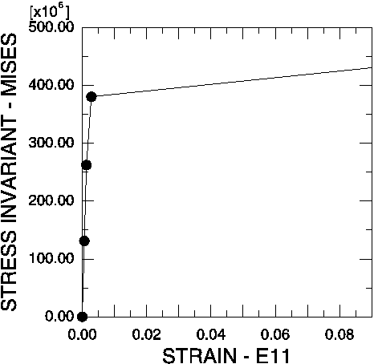

4. 单击**Dismiss（关闭）**关闭**Axis Options（轴选项）**对话框。
5. 在曲线的每个数据点显示一个符号也会有所帮助。打开**Curve Options（曲线选项）**对话框。
6. 从**Curves（曲线）**字段中，选择应力-应变曲线（`SVE11`）。
   `SVE11`数据对象被高亮显示。
7. 切换打开**Show symbol（显示符号）**。接受默认值，然后单击对话框底部的**Dismiss（关闭）**。
   应力-应变图出现在曲线每个数据点处带有符号的位置。

您现在应该有一个类似于图10-24所示的图。应力-应变曲线表明，在模拟的前两个增量中，此积分点的材料行为是线性弹性的。在此图中，材料在第三个增量期间似乎保持线性；然而，它确实在此增量期间发生了屈服。这种错觉是由图中显示的应变范围造成的。如果您将显示的最大应变限制为0.01并将最小值设置为0.0，则可以更清楚地看到第三个增量中的非线性材料行为（见图10-25）。

**图10-25** 角单元中沿耳片的Mises应力vs.直接应变（`E11`）。最大应变0.01。

此应力-应变曲线包含另一个明显的错误。材料似乎在250 MPa时发生屈服，这远低于初始屈服应力。然而，此错误是由于Abaqus/CAE用直线连接曲线上的数据点造成的。如果您限制增量大小，图形上的其他数据点将更好地显示材料响应，并显示屈服恰好发生在380 MPa。

第二次模拟的结果表明，如果钢在屈服后发生硬化，耳片将承受得住此60 kN载荷。两次模拟的结果共同表明，确定钢的实际后屈服硬化行为非常重要。如果钢几乎没有硬化，耳片可能在60 kN载荷下坍塌。而如果它具有中等硬化，耳片可能会承受住载荷，尽管会有广泛的塑性屈服（见图10-21）。然而，即使有塑性硬化，此载荷的安全系数也可能非常小。
