# 10.5 示例：加筋板上的爆炸载荷

> 原文：10.5 Example: blast loading on a stiffened plate

前面的示例说明了在使用隐式方法求解涉及非线性材料响应的问题时可能遇到的收敛困难。我们现在将重点讨论使用显式动力学方法求解涉及塑性问题的方法。正如稍后将清楚的那样，收敛困难在这种情况下不是问题，因为显式方法不需要迭代。

在这个示例中，您将评估加筋方形板在Abaqus/Explicit中的爆炸载荷响应。板的所有四边都被牢牢夹紧，并且有三个等间距的加筋板焊接在其上。板由25毫米厚的钢制成，尺寸为2米见方。加筋板由12.5毫米厚的板制成，深度为100毫米。[图10-26](#gxi-blast-load)更详细地显示了板的几何形状和材料特性。由于板厚度显著小于任何其他整体尺寸，因此可以使用壳单元来对板进行建模。

<div class="figure">
<p><a name="gxi-blast-load"></a><b><span class="gentxt_dkgry">图10-26</span></b> 加筋板爆炸载荷问题描述。</p>
<div class="graphic" id="d0">
<p></p>
</div>
</div>

本示例的目的是确定板的响应，并观察随着材料模型复杂程度的增加，响应如何变化。最初，我们使用标准弹塑性材料模型分析行为。随后，我们研究包含材料阻尼和率相关材料特性的效果。

---

## 10.5.1 预处理——使用Abaqus/CAE创建模型

使用Abaqus/CAE创建加筋板的三维模型。Abaqus提供了复制此问题完整分析模型的脚本。如果您遇到困难无法按照以下说明进行操作，或者您想检查您的工作，请运行这些脚本之一。脚本位于以下位置：

- 此示例的Python脚本在<a href="ap01s09.html"><span class="gentxt_times">"加筋板上的爆炸载荷"</span>，附录A.9</a>中提供。有关如何在Abaqus/CAE中获取脚本并运行的说明，请参阅<a href="ap01.html">附录A，<span class="gentxt_times">"示例文件"</span>。</a>
- 此示例的插件脚本可在Abaqus/CAE插件工具集中找到。要从Abaqus/CAE运行脚本，请选择<b><span class="guitext"><b class="guimenu">插件</b></span><span class="guitext"><b class="guisubmenu">Abaqus</b></span><span class="guitext"><b class="guimenuitem">入门</b></span></b>；高亮显示<span class="guitext"><b class="guilabel">加筋板上的爆炸载荷</b></span>；然后点击<span class="guitext"><b class="guibutton">运行</b></span>。有关"入门"插件的更多信息，请参阅<a rel="xbook" href="../usi/usi-link.htm#usi-plg-example-gst"><span class="gentxt_times">"运行Abaqus入门示例"</span>，Abaqus/CAE用户手册第82.1节</a>。

如果您无法访问Abaqus/CAE或其他预处理器，则可以手动创建此问题所需的输入文件，如<a rel="xbook" href="../gsk/gsk-link.htm#gsk-gen-mat-exablastload"><span class="gentxt_times">"示例：加筋板上的爆炸载荷"</span>，Abaqus入门：关键词版第10.5节</a>中所讨论。

### 定义模型几何

创建一个三维可变形部件，其具有挤出壳基础特征来表示板。使用约`5.0`的部件近似尺寸，并将部件命名为`Plate`。创建[图10-27](#gxi-blast-plate)所示部件几何的建议方法总结如下：

<div class="figure">
<p><a name="gxi-blast-plate"></a><b><span class="gentxt_dkgry">图10-27</span></b> 加筋板草图（网格间距加倍）。</p>
<div class="graphic" id="d0">
<p>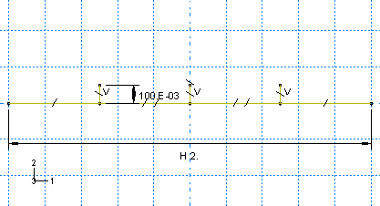</p>
</div>
</div>

**创建加筋板几何的步骤：**

1. 要定义板几何，请使用<span class="guitext"><b class="guiicon">创建线：连接</b></span>工具绘制一条任意水平线。
2. 要定义加筋几何，请添加三条从板向上延伸的垂直线。这些线的水平位置在此阶段是任意的，但它们的端点必须捕捉到水平线。
3. 约束三条垂直线使它们长度相等，并标注其中一个使其长度为0.1米。
4. 在板与加筋相交的点处分割板。
5. 标注板端点之间的水平距离，并将值设置为2.0米。
6. 对线的四个水平段应用相等长度约束。
   最终部件草图如图[图10-27](#gxi-blast-plate)所示。
7. 将草图挤出到2.0米的深度以创建板。

### 定义材料属性

为板和加筋板定义材料和截面属性。

创建一个名为`Steel`的材料，其质量密度为`7800`千克/立方米，弹性模量为`210.0E9`帕泊松比为`0.3`。在现阶段我们不知道是否会有塑性变形，但我们知道该钢的屈服应力值和屈服后行为的详细信息。我们将在材料定义中包含此信息。初始屈服应力为300 MPa，塑性应变达到35%时屈服应力增加到400 MPa。要定义塑性材料属性，请输入[图10-26](#gxi-blast-load)中所示的屈服应力和塑性应变数据。塑性应力-应变曲线如图[图10-28](#gxi-yield)所示。

<div class="figure">
<p><a name="gxi-yield"></a><b><span class="gentxt_dkgry">图10-28</span></b> 屈服应力与塑性应变的关系。</p>
<div class="graphic" id="d0">
<p>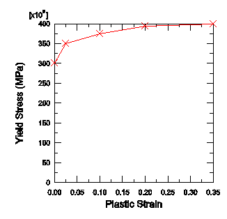</p>
</div>
</div>

在分析过程中，Abaqus根据塑性应变的当前值计算屈服应力值。如前所述，当应力-应变数据处于等间距的塑性应变值时，查找和插值过程最有效。为了避免用户输入规则数据，Abaqus/Explicit会自动对数据进行正则化。在这种情况下，数据通过扩展到15个等间距点（增量0.025）由Abaqus/Explicit进行正则化。

为了说明当Abaqus/Explicit无法正则化材料数据时产生的错误消息，您可以将正则化容差设置为0.001（在<span class="guitext"><b class="guititle">编辑材料</b></span>对话框中，选择<b><span class="guitext"><b class="guimenu">常规</b></span><span class="guitext"><b class="guimenuitem">正则化</b></span></b>），并包含一组额外的数据对，如[表10-2](#gxi-blast-plastic-mod)所示。您可以通过在表格中点击鼠标按钮3并从出现的菜单中选择<span class="guitext"><b class="guilabel">插入行</b></span>来添加行。

<div class="table">
<p><a name="gxi-blast-plastic-mod"></a><b><span class="gentxt_dkgry">表10-2</span></b> 修改后的塑性数据。</p>
<table border="1">
<colgroup><col></col><col></col></colgroup>
<thead>
<tr><th valign="top" align="center">屈服应力（Pa）</th><th valign="top" align="center">塑性应变</th></tr>
</thead>
<tbody>
<tr><td valign="top" align="center">300.0E6</td><td valign="top" align="center">0.000</td></tr>
<tr><td valign="top" align="center">349.0E6</td><td valign="top" align="center">0.001</td></tr>
<tr><td valign="top" align="center">350.0E6</td><td valign="top" align="center">0.025</td></tr>
<tr><td valign="top" align="center">375.0E6</td><td valign="top" align="center">0.100</td></tr>
<tr><td valign="top" align="center">394.0E6</td><td valign="top" align="center">0.200</td></tr>
<tr><td valign="top" align="center">400.0E6</td><td valign="top" align="center">0.350</td></tr>
</tbody>
</table>
</div>

低容差值和用户定义数据中间隔小相结合将导致此材料定义正则化的困难。以下错误消息将被写入状态（`.sta`）文件并显示在<span class="abqmodule">Job</span>模块的<span class="guitext"><b class="guilabel">Job Monitor</b></span>对话框中：

```
***ERROR: Failed to regularize material data for material STEEL. Please check
your input data to see if they meet both criteria as explained in
"MATERIAL DATA DEFINITION" section of the
Abaqus Analysis User's Guide. In general, regularization is more difficult if the 
smallest interval defined by the user is small compared to the 
range of the independent variable.
```

在继续之前，将正则化容差设置回默认值（0.03）并删除额外的数据点对。

### 创建和分配截面属性

创建两个均匀壳截面属性，每个都引用钢材料定义，但指定不同的壳厚度。命名第一个壳截面属性为`PlateSection`，选择`Steel`作为材料，并指定`0.025`米作为<span class="guitext"><b class="guilabel">壳厚度</b></span>的值。命名第二个壳截面属性为`StiffSection`，选择`Steel`作为材料，并指定`0.0125`米作为<span class="guitext"><b class="guilabel">壳厚度</b></span>的值。

将`StiffSection`定义分配给加筋板（使用**Shift+Click**在视口中选择多个区域）。

在将`PlateSection`定义分配给板之前，请考虑以下因素。如果板和加筋板直接在其中性面处连接（这是默认行为），则会发生材料重叠区域，如[图10-29](#gxi-overlap-mat)所示。

<div class="figure">
<p><a name="gxi-overlap-mat"></a><b><span class="gentxt_dkgry">图10-29</span></b> 重叠材料。</p>
<div class="graphic" id="d0">
<p></p>
</div>
</div>

尽管板和加筋板的厚度与结构整体尺寸相比很小（因此这种重叠材料及其产生的额外刚度对分析结果影响很小），但可以通过将板的参考面从中性面偏移来创建更精确的模型。这种技术允许加筋板与板对接而不与板重叠任何材料，如[图10-30](#gxi-midsurf-joint)所示。

<div class="figure">
<p><a name="gxi-midsurf-joint"></a><b><span class="gentxt_dkgry">图10-30</span></b> 板的参考面从中性面偏移的加筋板连接。</p>
<div class="graphic" id="d0">
<p></p>
</div>
</div>

要确定是将板参考面偏移到其正面（SPOS）还是负面（SNEG），请查询壳法线（<b><span class="guitext"><b class="guimenu">工具</b></span><span class="guitext"><b class="guimenuitem">查询</b></span></b>）并注意板面向加筋板一侧的颜色（棕色为正面；紫色为负面）。如果需要，翻转板法线（<b><span class="guitext"><b class="guimenu">分配</b></span><span class="guitext"><b class="guimenuitem">单元法线</b></span></b>），使其段具有一致的法线。然后将`PlateSection`定义分配给板的区域。在<span class="guitext"><b class="guititle">编辑截面分配</b></span>对话框中，如果板的棕色（正面）面向加筋板，则将壳偏移设置为<span class="guitext"><b class="guilabel">顶面</b></span>；如果紫色（负面）面向加筋板，则设置为<span class="guitext"><b class="guilabel">底面</b></span>。

要验证偏移，请选择<b><span class="guitext"><b class="guimenu">视图</b></span><span class="guitext"><b class="guimenuitem">部件显示选项</b></span></b>。在出现的<span class="guitext"><b class="guilabel">部件显示选项</b></span>对话框中，切换<span class="guitext"><b class="guilabel">渲染壳厚度</b></span>。如果需要，修改偏移以消除任何重叠。

可以根据截面分配对模型进行颜色编码以验证属性是否正确分配（从<span class="guitext"><b class="guilabel">颜色编码</b></span>工具栏中选择<span class="guitext"><b class="guilabel">截面</b></span>）。

### 创建装配

创建板的一个独立实例。使用默认的矩形坐标系，板位于1-3平面中。

此时，方便起见创建将用于指定边界条件和平输出请求的几何集。创建一个名为`Edge`的集用于板边缘，创建一个名为`Center`的集于板和中间加筋板的交叉中心处，如[图10-31](#gxi-blast-sets)所示。要创建`Center`集，您需要首先使用<span class="guitext"><b class="guilabel">分割边缘：输入参数</b></span>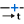工具将原始部件的边缘分割成两半。

<div class="figure">
<p><a name="gxi-blast-sets"></a><b><span class="gentxt_dkgry">图10-31</span></b> 几何集。</p>
<div class="graphic" id="d0">
<p>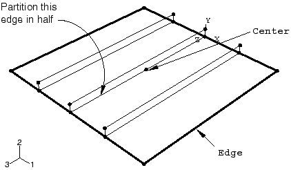</p>
</div>
</div>

### 定义步骤和输出请求

创建一个动态显式步骤。将步骤命名为`Blast`，并指定以下步骤描述：`Apply blast loading`。输入步骤时间周期为`50E-3`秒。

通常，您应该尝试限制分析过程中写入的帧数，以保持输出数据库文件的合理大小。在此分析中，每2毫秒保存一次信息应该足以研究结构的响应。编辑默认输出请求`F-Output-1`，并将保存预选场数据的步骤间隔数设置为25。这确保了所选数据每2毫秒写入一次，因为步骤的总时间为50毫秒。

可以为模型的所选区域保存更详细的输出作为历史输出。为步骤`Blast`创建名为`Center-U2`的历史输出请求。选择`Center`作为输出域，并选择<span class="guitext"><b class="guilabel">U2</b></span>作为平移输出变量。输入`500`作为分析过程中保存输出的间隔数。

### 指定边界条件和载荷

接下来，定义此分析中使用的边界条件。在步骤`Blast`中，创建一个名为`Fix edges`的<span class="guitext"><b class="guilabel">对称/</b></span><span class="guitext"><b class="guilabel">反对称/夹紧</b></span>机械边界条件。使用几何集`Edge`将边界条件应用于板的边缘，并指定<span class="guitext"><b class="guilabel">ENCASTRE (U1 = U2 = U3 = UR1 = UR2 = UR3 = 0)</b></span>以完全约束该集。

板将承受随时间变化的载荷：压力在分析开始时从零快速增加到1毫秒时的最大值7.0×10^5帕，然后在9毫秒内保持恒定后再在另10毫秒内降回零。此后在分析的剩余时间内保持为零。有关详细信息，请参见[图10-32](#gxi-pressure-load)。

<div class="figure">
<p><a name="gxi-pressure-load"></a><b><span class="gentxt_dkgry">图10-32</span></b> 压力载荷随时间变化的关系。</p>
<div class="graphic" id="d0">
<p>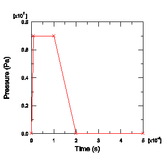</p>
</div>
</div>

定义一个名为`Blast`的表格幅值曲线。输入[表10-3](#gxi-blast-amp)中给出的幅值数据，并指定0.0的平滑参数。

<div class="table">
<p><a name="gxi-blast-amp"></a><b><span class="gentxt_dkgry">表10-3</span></b> 爆炸载荷幅值。</p>
<table border="1">
<colgroup><col charoff="50"></col><col charoff="50"></col></colgroup>
<thead>
<tr><th valign="top" align="center">时间</th><th valign="top" align="center">幅值</th></tr>
</thead>
<tbody>
<tr><td valign="top" align="center">0.0</td><td valign="top" align="center">0.0</td></tr>
<tr><td valign="top" align="center">1.0E-3</td><td valign="top" align="center">7.0E5</td></tr>
<tr><td valign="top" align="center">10.0E-3</td><td valign="top" align="center">7.0E5</td></tr>
<tr><td valign="top" align="center">20.0E-3</td><td valign="top" align="center">0.0</td></tr>
<tr><td valign="top" align="center">50.0E-3</td><td valign="top" align="center">0.0</td></tr>
</tbody>
</table>
</div>

接下来，定义压力载荷。由于载荷的大小将由幅值定义，您只需要向板施加单位压力。施加压力使其推向板的顶部（加筋板在板的底部）。这种压力载荷将使加筋板的外纤维处于拉伸状态。

**定义压力载荷的步骤：**

1. 在模型树中，双击<span class="guitext"><b class="guititle">载荷</b></span>容器。在出现的<span class="guitext"><b class="guititle">创建载荷</b></span>对话框中，将载荷命名为`Pressure load`，并选择`Blast`作为应用该载荷的步骤。选择<span class="guitext"><b class="guilabel">Mechanical</b></span>作为载荷类别，<span class="guitext"><b class="guilabel">Pressure</b></span>作为载荷类型。点击<span class="guitext"><b class="guibutton">继续</b></span>。
2. 选择与板关联的所有曲面。选择了适当的曲面后，点击<span class="guitext"><b class="guibutton">完成</b></span>。
   Abaqus/CAE使用两种不同的颜色来表示壳曲面的两侧。要完成载荷定义，每侧的颜色必须一致。
3. 如果需要，在提示区域选择<span class="guitext"><b class="guibutton">翻转曲面</b></span>以翻转板的某一区域的颜色。重复此过程，直到板顶部的所有面都是相同的颜色。
4. 在提示区域，选择代表板没有加筋板一侧的颜色。
5. 在出现的<span class="guitext"><b class="guititle">编辑载荷</b></span>对话框中，指定`1.0` Pa的均匀压力，并选择幅值定义`Blast`。点击<span class="guitext"><b class="guibutton">确定</b></span>完成载荷定义。

板的载荷和边界条件如图[图10-33](#gxi-blast-bc-load)所示。

<div class="figure">
<p><a name="gxi-blast-bc-load"></a><b><span class="gentxt_dkgry">图10-33</span></b> 压力载荷和边界条件。</p>
<div class="graphic" id="d0">
<p>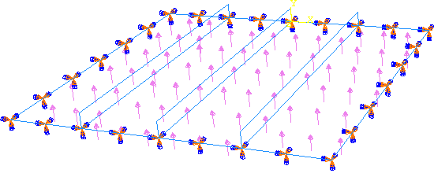</p>
</div>
</div>

### 创建网格并定义作业

使用`0.1`的全局单元尺寸为部件实例设置种子。另外，选择<b><span class="guitext"><b class="guimenu">种子</b></span><span class="guitext"><b class="guimenuitem">边缘</b></span></b>，并指定沿每个加筋板的高度创建两个单元（在<span class="guitext"><b class="guilabel">本地种子</b></span>对话框中，选择<span class="guitext"><b class="guilabel">按数量</b></span>作为方法并将单元数设置为`2`；切换选项以创建包含所选边缘的集合）。使用来自<span class="guitext"><b class="guilabel">Explicit</b></span>单元库的 quadrilateral shell elements (S4R) 为板和加筋板划分网格。结果网格如图[图10-34](#gxi-stiff-plate-mesh-c)所示。这个相对粗糙的网格在将求解时间保持在最小的同时提供了适度的准确性。

<div class="figure">
<p><a name="gxi-stiff-plate-mesh-c"></a><b><span class="gentxt_dkgry">图10-34</span></b> 划分网格后的板。</p>
<div class="graphic" id="d0">
<p>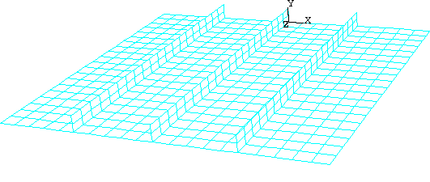</p>
</div>
</div>

创建一个名为`BlastLoad`的作业。指定以下作业描述：`Blast load on a flat plate with stiffeners: S4R elements (20x20 mesh) Normal stiffeners (20x2)`。

将模型保存在模型数据库文件中，并提交作业进行分析。监控求解进度；纠正检测到的任何建模错误，并调查任何警告消息的原因。

---

## 10.5.2 后处理

作业完成后，进入<span class="abqmodule">可视化</span>模块，并打开此作业创建的`.odb`文件（`BlastLoad.odb`）。默认情况下，Abaqus绘制带有阴影渲染样式的未变形模型形状。

### 改变视图

默认视图是等轴测的，这不能提供板的特别清晰的视图。要改善视点，请使用<span class="guitext"><b class="guimenu">视图</b></span>菜单中的选项或<span class="guitext"><b class="guititle">视图操作</b></span>工具栏中的工具旋转视图。指定视图并选择旋转视图的视点方法。将视点向量的X、Y和Z坐标输入为`1,0.5,1`，将向上向量的坐标输入为`0,1,0`。

### 验证壳截面分配

您还可以在后处理结果时可视化截面分配和壳厚度。例如，可以对具有共同截面分配的区域进行颜色编码，以验证属性是否正确分配（从<span class="guitext"><b class="guilabel">颜色编码</b></span>工具栏中选择<span class="guitext"><b class="guilabel">截面</b></span>以根据截面分配对网格进行颜色编码）。要渲染壳厚度，请从主菜单栏选择<b><span class="guitext"><b class="guimenu">视图</b></span><span class="guitext"><b class="guimenuitem">ODB显示选项</b></span></b>。在<span class="guitext"><b class="guititle">ODB显示选项</b></span>对话框中，切换<span class="guitext"><b class="guilabel">渲染壳厚度</b></span>并点击<span class="guitext"><b class="guibutton">应用</b></span>。如果模型看起来正确，如[图10-35](#gsx-blast-shell-thick)所示，请在继续其余后处理说明之前切换关闭此选项并点击<span class="guitext"><b class="guibutton">确定</b></span>。否则，纠正截面分配并重新运行作业。

<div class="figure">
<p><a name="gsx-blast-shell-thick"></a><b><span class="gentxt_dkgry">图10-35</span></b> 显示壳厚度的板。</p>
<div class="graphic" id="d0">
<p>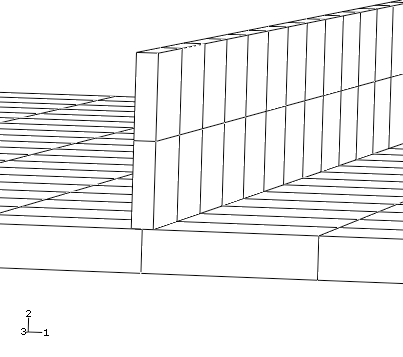</p>
</div>
</div>

### 结果动画

如前几示例所述，为结果添加动画将提供板在爆炸载荷下动态响应的一般理解。首先，绘制变形模型形状。然后，创建变形形状的时间历史动画。使用<span class="guitext"><b class="guititle">动画选项</b></span>对话框将模式更改为<span class="guitext"><b class="guititle">播放一次</b></span>。

从动画中您将看到，随着爆炸载荷的施加，板开始偏转。在载荷持续期间，板开始振动，即使爆炸载荷已降至零后仍继续振动。最大位移发生在约8毫秒时，[图10-36](#gxi-disp-shape-1ms)显示了该状态的变形图。

<div class="figure">
<p><a name="gxi-disp-shape-1ms"></a><b><span class="gentxt_dkgry">图10-36</span></b> 8毫秒时的变形形状。</p>
<div class="graphic" id="d0">
<p></p>
</div>
</div>

动画图像可以保存到文件以供稍后回放。

**保存动画的步骤：**

1. 从主菜单栏中，选择<b><span class="guitext"><b class="guimenu">动画</b></span><span class="guitext"><b class="guimenuitem">另存为</b></span></b>。
   出现<span class="guitext"><b class="guititle">保存图像动画</b></span>对话框。
2. 在<span class="guitext"><b class="guilabel">设置</b></span>字段中，输入文件名`blast_base`。
   动画格式可以指定为AVI、QuickTime、VRML或压缩VRML。
3. 选择<span class="guitext"><b class="guilabel">QuickTime</b></span>格式，然后点击<span class="guitext"><b class="guibutton">确定</b></span>。
   动画保存为`blast_base.mov`在您的当前目录中。保存后，可以使用行业标准动画软件在Abaqus/CAE外部播放动画。

### 历史输出

由于从变形图中不容易看出板的变形，因此以图形形式查看中心节点的偏转响应是可取的。板中心节点的位移尤其令人关注，因为最大偏转发生在此节点处。

显示中心节点的位移历史，如图[图10-37](#gxi-central-disp)所示（位移以毫米为单位）。

<div class="figure">
<p><a name="gxi-central-disp"></a><b><span class="gentxt_dkgry">图10-37</span></b> 中心节点位移随时间变化的关系。</p>
<div class="graphic" id="d0">
<p>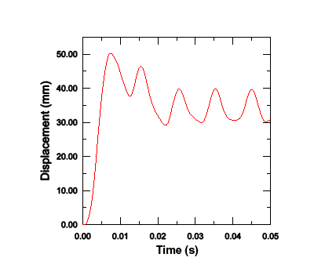</p>
</div>
</div>

**生成中心节点位移的历史图的步骤：**

1. 在结果树中，双击板中心节点（集`Center`）处名为`空间位移：U2`的历史输出数据。
2. 保存当前的X-Y数据：在结果树中，在数据名称上点击鼠标按钮3并从出现的菜单中选择<span class="guitext"><b class="guilabel">另存为</b></span>。将数据命名为`DISP`。
   此图中位移的单位是米。通过创建新的数据对象来修改数据，以创建位移（毫米）与时间的关系图。
3. 在结果树中，展开<span class="guitext"><b class="guititle">XYData</b></span>容器。
   `DISP`数据列在其下方。
4. 在结果树中，双击<span class="guitext"><b class="guititle">XYData</b></span>；然后在<span class="guitext"><b class="guititle">创建XY数据</b></span>对话框中选择<span class="guitext"><b class="guibutton">对XY数据进行运算</b></span>。点击<span class="guitext"><b class="guibutton">继续</b></span>。
5. 在<span class="guitext"><b class="guititle">对XY数据进行运算</b></span>对话框中，将`DISP`乘以1000，以毫米而不是米为单位创建图表。对话框顶部的表达式应显示为：
   `"DISP" * 1000`
6. 点击<span class="guitext"><b class="guibutton">绘制表达式</b></span>查看修改后的X-Y数据。将数据保存为`U2_BASE`。
7. 关闭<span class="guitext"><b class="guititle">对XY数据进行运算</b></span>对话框。
8. 点击工具箱中的<span class="guitext"><b class="guititle">轴选项</b></span>工具。在<span class="guitext"><b class="guititle">轴选项</b></span>对话框中，将X轴标题更改为`时间（秒）`，将Y轴标题更改为`位移（毫米）`。点击<span class="guitext"><b class="guibutton">确定</b></span>关闭对话框。结果图如图[图10-37](#gxi-central-disp)所示。
   图中显示位移在7.7毫秒时达到最大值50.2毫米，然后在爆炸载荷移除后振荡。

输出数据库中保存为历史输出的其他量是模型的总能量。能量历史可以帮助识别模型的潜在缺点以及突出重要的物理效应。显示五个不同能量输出变量——<span class="abqoutputvar">ALLAE</span>、<span class="abqoutputvar">ALLIE</span>、<span class="abqoutputvar">ALLKE</span>、<span class="abqoutputvar">ALLPD</span>和<span class="abqoutputvar">ALLSE</span>的历史。

**生成模型能量的历史图的步骤：**

1. 将<span class="abqoutputvar">ALLAE</span>、<span class="abqoutputvar">ALLIE</span>、<span class="abqoutputvar">ALLKE</span>、<span class="abqoutputvar">ALLPD</span>和<span class="abqoutputvar">ALLSE</span>输出变量的历史结果保存为X-Y数据。为每条曲线提供默认名称；根据其输出变量名称重命名：`ALLAE`、`ALLKE`等。
2. 在结果树中，展开<span class="guitext"><b class="guititle">XYData</b></span>容器。
   `ALLAE`、`ALLIE`、`ALLKE`、`ALLPD`和`ALLSE` X-Y数据对象列在其下方。
3. 使用**Ctrl+Click**选择`ALLAE`、`ALLIE`、`ALLKE`、`ALLPD`和`ALLSE`；点击鼠标按钮3，并从出现的菜单中选择<span class="guitext"><b class="guibutton">绘制</b></span>来绘制能量曲线。
4. 要更清晰地区分图中不同的曲线，请打开<span class="guitext"><b class="guititle">曲线选项</b></span>对话框并更改它们的线型。
   - 对于曲线`ALLSE`，选择虚线线型。
   - 对于曲线`ALLPD`，选择点线线型。
   - 对于曲线`ALLAE`，选择链虚线线型。
   - 对于曲线`ALLIE`，选择第二细线型。
5. 要更改图例的位置，请打开<span class="guitext"><b class="guititle">图表图例选项</b></span>对话框并切换到<span class="guitext"><b class="guilabel">区域</b></span>标签页。
6. 在此页的<span class="guitext"><b class="guilabel">位置</b></span>区域中，切换<span class="guitext"><b class="guilabel">嵌入</b></span>并点击<span class="guitext"><b class="guilabel">关闭</b></span>。在视口中拖动图例，使其适合网格内，如图[图10-38](#gxi-energy-terms)所示。

<div class="figure">
<p><a name="gxi-energy-terms"></a><b><span class="gentxt_dkgry">图10-38</span></b> 能量量随时间变化的关系。</p>
<div class="graphic" id="d0">
<p>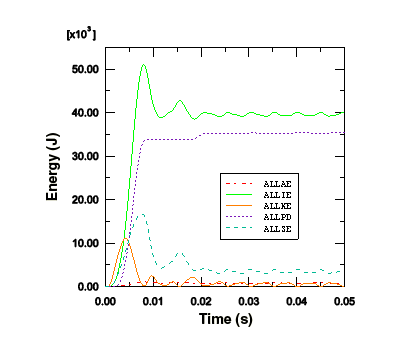</p>
</div>
</div>

我们可以看到，一旦载荷被移除且板自由振动时，动能增加而应变能减少。当板处于最大偏转因此具有最大应变能时，它几乎完全静止，导致动能处于最小值。

塑性应变能上升到平台期，然后再次上升。从动能图中我们可以看到，塑性应变能的第二次上升发生在板从最大位移回弹并向相反方向移动时。因此，我们在爆炸脉冲后看到了回弹时的塑性变形。

尽管没有迹象表明沙漏是此分析中的问题，但还是要研究人工应变能以确保。正如第4章"使用连续体单元"中所讨论的，人工应变能或"沙漏刚度"是用于控制沙漏变形的能量，输出变量<span class="abqoutputvar">ALLAE</span>是累积的人工应变能。关于沙漏控制的讨论同样适用于壳单元。由于能量在板变形时作为塑性变形而耗散，因此总内能远大于单独的弹性应变能。因此，在此分析中，将人工应变能与包含耗散能量以及弹性应变能的能量量进行比较是最有意义的。这样的变量是总内能<span class="abqoutputvar">ALLIE</span>，它是所有内能量的总和。人工应变能约为总内能的2%，表明沙漏不是问题。

从变形形状我们可以注意到，中心加筋板几乎承受纯面内弯曲。仅使用两个一阶减缩积分单元穿过加筋板的深度不足以模拟面内弯曲行为。虽然由于几乎没有沙漏，这个粗糙网格的解决方案看起来足够，但为了完整起见，我们将研究网格细化时解决方案如何变化。细化网格时要小心，因为网格细化会增加单元数量并减小单元尺寸，从而增加求解时间。

编辑网格并重新指定网格密度。使用先前保存的边缘集，指定每个加筋板的高度有四个单元，并重新为部件实例划分网格。创建一个名为`BlastLoadRefined`的新作业。提交此作业进行分析，并在作业完成运行后研究结果。

单元数量的增加使求解时间增加约20%。此外，由于加筋板中最小单元尺寸的减小， stable时间增量减小了约一半。由于求解时间的总增加是两个因素组合的结果，细化网格的求解时间比原始网格增加约1.2×2或2.4倍。

[图10-39](#gxi-art-energy)显示了原始网格和细化加筋板网格的人工能量历史。细化网格中的人工能量略低。因此，我们预计结果从原始到细化不会有显著变化。

<div class="figure">
<p><a name="gxi-art-energy"></a><b><span class="gentxt_dkgry">图10-39</span></b> 原始网格和细化网格中的人工能量。</p>
<div class="graphic" id="d0">
<p></p>
</div>
</div>

[图10-40](#gxi-cent-disp-meshes)显示板中心节点的位移在两种情况下几乎相同，表明原始网格充分捕获了整体响应。然而，细化网格的一个优点是它更好地捕获了加筋板中应力和塑性应变的变化。

<div class="figure">
<p><a name="gxi-cent-disp-meshes"></a><b><span class="gentxt_dkgry">图10-40</span></b> 原始网格和细化网格的中心节点位移历史。</p>
<div class="graphic" id="d0">
<p></p>
</div>
</div>

### 等值线图

在本节中，您将使用<span class="abqmodule">可视化</span>模块的等值线绘图功能来显示板中的von Mises应力和等效塑性应变分布。使用细化加筋板网格的模型创建图表；从主菜单栏中选择<b><span class="guitext"><b class="guimenu">文件</b></span><span class="guitext"><b class="guimenuitem">打开</b></span></b>并选择文件`BlastLoadRefined.odb`。

**生成von Mises应力和等效塑性应变的等值线图的步骤：**

1. 从<span class="guitext"><b class="guilabel">场输出</b></span>工具栏左侧的变量类型列表中，选择<span class="guitext"><b class="guilabel">主变量</b></span>。
2. 从工具栏中心的输出变量列表中，选择<span class="guitext"><b class="guilabel">S</b></span>。应力不变量和分量在右侧下一个列表中可用。选择<span class="guitext"><b class="guilabel">Mises</b></span>应力不变量。
3. 从主菜单栏中，选择<b><span class="guitext"><b class="guimenu">结果</b></span><span class="guitext"><b class="guimenuitem">截面点</b></span></b>。
4. 在出现的<span class="guitext"><b class="guititle">截面点</b></span>对话框中，选择<span class="guitext"><b class="guilabel">顶面和底面</b></span>作为活动位置，然后点击<span class="guitext"><b class="guibutton">确定</b></span>。
5. 选择<b><span class="guitext"><b class="guimenu">绘制</b></span><span class="guitext"><b class="guisubmenu">等值线</b></span><span class="guitext"><b class="guimenuitem">在变形形状上</b></span></b>，或使用工具箱中的工具。
   Abaqus在每个壳单元的顶面和底面上绘制von Mises等值线。要更清楚地看到这一点，请在视口中旋转模型。
   您之前为动画练习设置的视图应该更改，以使应力分布更清晰。
6. 使用<span class="guitext"><b class="guititle">视图</b></span>工具栏中的工具将视图更改回默认等轴测视图。

> **提示：** 如果<span class="guitext"><b class="guititle">视图</b></span>工具栏不可见，请从主菜单栏中选择<b><span class="guitext"><b class="guimenu">视图</b></span><span class="guitext"><b class="guisubmenu">工具栏</b></span><span class="guitext"><b class="guimenuitem">视图</b></span></b>。

[图10-41](#gxi-cont-plot-mises)显示了分析结束时von Mises应力的等值线图。

<div class="figure">
<p><a name="gxi-cont-plot-mises"></a><b><span class="gentxt_dkgry">图10-41</span></b> 50毫秒时von Mises应力的等值线图。</p>
<div class="graphic" id="d0">
<p>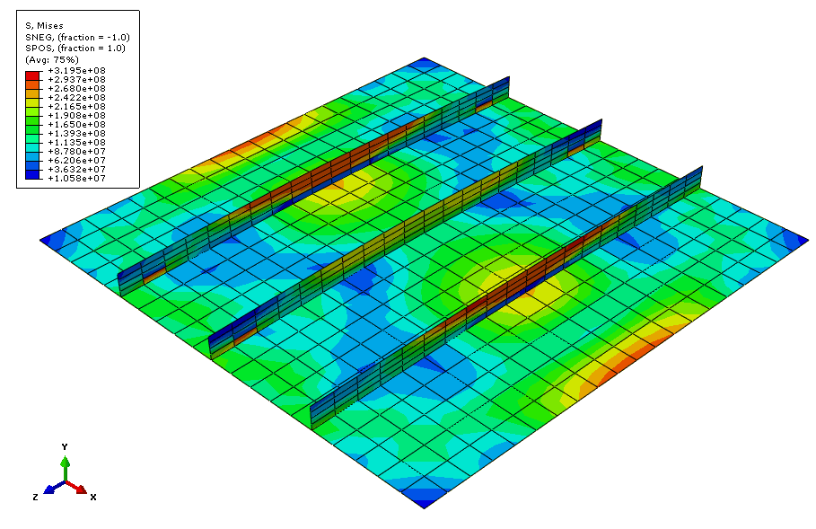</p>
</div>
</div>

7. 类似地，绘制等效塑性应变的等值线。从<span class="guitext"><b class="guilabel">场输出</b></span>工具栏左侧的变量类型列表中选择<span class="guitext"><b class="guilabel">主变量</b></span>，并从其旁边的输出变量列表中选择<span class="guitext"><b class="guilabel">PEEQ</b></span>。
   [图10-42](#gxi-equivaplast)显示了分析结束时等效塑性应变的等值线图。

<div class="figure">
<p><a name="gxi-equivaplast"></a><b><span class="gentxt_dkgry">图10-42</span></b> 50毫秒时等效塑性应变的等值线图。</p>
<div class="graphic" id="d0">
<p>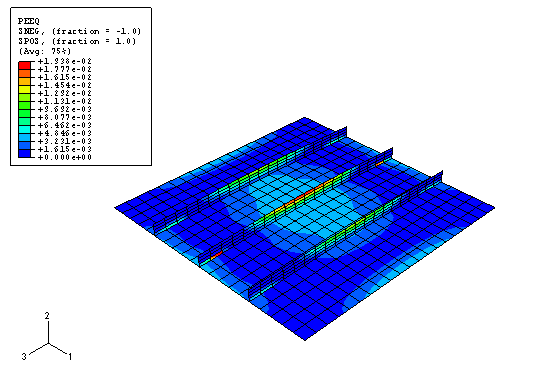</p>
</div>
</div>

---

## 10.5.3 审查分析

此分析的目的是研究板在承受爆炸载荷时的变形以及结构各部分的应力。为了判断分析的准确性，您需要考虑所做的假设和近似，并识别模型的某些局限性。

### 阻尼

无阻尼结构以恒定振幅继续振动。在50毫秒的模拟中，振荡频率约为100赫兹。恒定振幅振动不是实践中预期的响应，因为这种结构的振动会随着时间的推移而消失，并在5-10次振荡后实际消失。能量损失通常通过各种机制发生，包括支撑处的摩擦效应和空气阻尼。

因此，我们需要考虑分析中阻尼的存在来模拟这种能量损失。由粘性效应耗散的能量<span class="abqoutputvar">ALLVD</span>在分析中为非零，表明已经存在一些阻尼。默认情况下，始终存在*体积粘性*阻尼（在第9章"非线性显式动力学"中讨论），其目的是改善高速事件的建模。

在此壳模型中仅存在线性阻尼。使用默认值，振荡最终会消失，但需要很长时间，因为体积粘性阻尼非常小。应使用材料阻尼来引入更真实的结构响应。因此，修改材料定义。

**向材料添加阻尼的步骤：**

1. 在模型树中，双击<span class="guitext"><b class="guititle">材料</b></span>容器下的<span class="guitext"><b class="guititle">Steel</b></span>。
2. 在<span class="guitext"><b class="guititle">编辑材料</b></span>对话框中，选择<b><span class="guitext"><b class="guimenu">机械</b></span><span class="guitext"><b class="guimenuitem">阻尼</b></span></b>，并指定`50`作为质量比例阻尼因子<span class="guitext"><b class="guilabel">Alpha</b></span>的值。<span class="guitext"><b class="guilabel">Beta</b></span>是控制刚度比例阻尼的参数；在此阶段，将其保留为零。
3. 点击<span class="guitext"><b class="guibutton">确定</b></span>。

板的振荡持续时间约为30毫秒，因此我们需要增加分析周期以允许足够的时间让振动阻尼消失。编辑步骤定义，并将步骤`Blast`的时间周期增加到`150E-3`秒。

阻尼分析的结果清楚显示了质量比例阻尼的效果。[图10-43](#gxi-damp-disp-hist)显示了有阻尼和无阻尼分析的中心节点位移历史。（我们已将无阻尼模型的分析时间延长至150毫秒，以更有效地比较数据。）由于阻尼，峰值响应也降低了。在阻尼分析结束时，振荡已衰减到接近静态条件。

<div class="figure">
<p><a name="gxi-damp-disp-hist"></a><b><span class="gentxt_dkgry">图10-43</span></b> 有阻尼和无阻尼的位移历史。</p>
<div class="graphic" id="d0">
<p></p>
</div>
</div>

### 率相关性

某些材料（如软钢）表现出屈服应力随应变率增加而增加的特性。在此示例中加载率很高，因此应变率相关性可能很重要。

将率相关性添加到您的材料定义中。

**向金属塑性材料模型添加率相关性的步骤：**

1. 在模型树中，双击<span class="guitext"><b class="guititle">材料</b></span>容器下的<span class="guitext"><b class="guititle">Steel</b></span>。
2. 在<span class="guitext"><b class="guititle">编辑材料</b></span>对话框中，从材料行为列表中选择<span class="guitext"><b class="guititle">塑性</b></span>。
3. 选择<b><span class="guitext"><b class="guimenu">子选项</b></span><span class="guitext"><b class="guimenuitem">率相关性</b></span></b>。
4. 在出现的<span class="guitext"><b class="guititle">子选项编辑器</b></span>中，输入`40`作为<span class="guitext"><b class="guilabel">乘数</b></span>的值，输入`5`作为<span class="guitext"><b class="guilabel">指数</b></span>的值，然后点击<span class="guitext"><b class="guibutton">确定</b></span>。

利用此率相关行为定义，动态屈服应力与静态屈服应力的比值根据等效塑性应变率给出的方程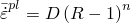计算，其中和是材料常数（本例中分别为40和5）。

将步骤`Blast`的时间周期更改回原始值50毫秒。创建一个名为`BlastLoadRateDep`的作业，并提交作业进行分析。分析完成后，打开输出数据库文件`BlastLoadRateDep.odb`，并对结果进行后处理。

当包含率相关性时，屈服应力随应变率增加而有效增加。因此，由于弹性模量高于塑性模量，我们预计率相关分析的响应更刚硬。[图10-44](#gxi-disp-central-node)所示板中心部分的位移历史和[图10-45](#gxi-plas-strain-energy)所示的塑性应变能历史都证实，当包含率相关性时，响应确实更刚硬。当然，结果对材料数据敏感。在这种情况下，和的值是软钢的典型值，但详细设计分析需要更精确的数据。

<div class="figure">
<p><a name="gxi-disp-central-node"></a><b><span class="gentxt_dkgry">图10-44</span></b> 有无率相关性的中心节点位移（无阻尼）。</p>
<div class="graphic" id="d0">
<p>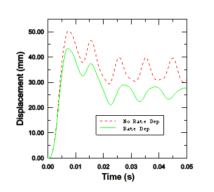</p>
</div>
</div>

<div class="figure">
<p><a name="gxi-plas-strain-energy"></a><b><span class="gentxt_dkgry">图10-45</span></b> 有无率相关性的塑性应变能（无阻尼）。</p>
<div class="graphic" id="d0">
<p>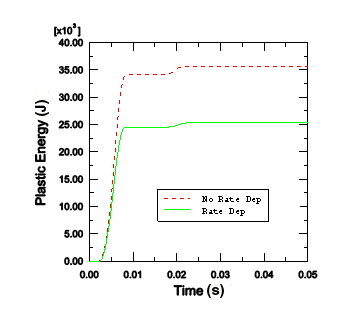</p>
</div>
</div>
