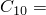
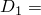
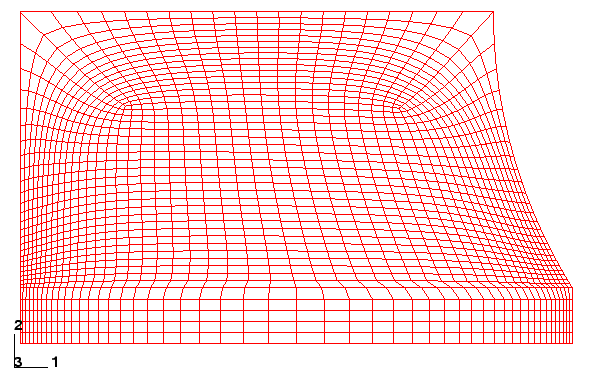

# 10.9 减少体积锁定的技术

为了缓解体积锁定问题，需要在橡胶材料模型中引入少量可压缩性。只要可压缩性较小，几乎不可压缩材料获得的结果将与完全不可压缩材料获得的结果非常相似。

可压缩性通过将材料常数设置为非零值来引入。该值的选择应使初始泊松比接近0.5。<a href="../usb/usb-link.htm#usb-mat-chyperelastic">"橡胶类材料的超弹性行为，" Abaqus分析用户指南第22.5.1节</a>中给出的方程可用于将和用和（分别为初始剪切模量和体积模量）表示，用于应变能势的多项式形式。例如，之前从测试数据获得的超弹性材料系数（见<a href="ch10s07.html#gsa-mat-preprocessing">"预处理——使用Abaqus/CAE创建模型，" 10.7.2节</a>中的"超弹性材料参数"）给出为 176051和 4332.63；因此，设置 5.E−7可得到 0.46。

图10-70显示了一个包含可压缩性和额外网格细化（以减少网格畸变）的模型（通过在Abaqus/CAE或其他前处理器中更改边缘种子可以轻松生成此网格）。

**图10-70** 两个角点都进行细化的改进网格。

该模型的变形形状如图10-71所示。

**图10-71** 改进网格的变形形状。

从该图可以明显看出，橡胶模型关键区域的网格畸变已显著减少。检查压力等值线图（不跨单元平均）显示，压力应力在单元之间变化平稳。因此，体积锁定已被消除。
