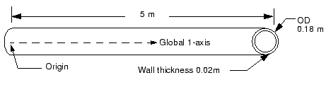
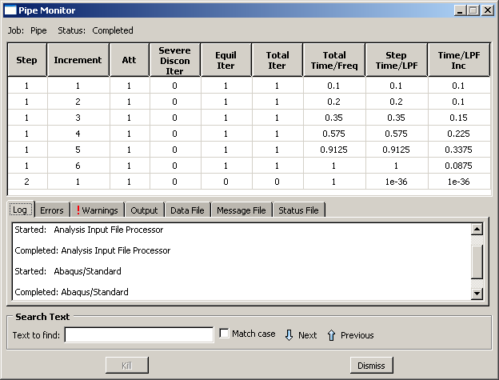
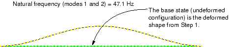

# 11.3 示例：管道系统的振动

在本示例中，您将研究管道系统 5 米长部分的振动频率。该管道由钢制成，外径为 18 厘米，壁厚为 2 厘米（参见图 11-5）。

**图 11-5** 被分析的管道系统的部分。

管道一端固定夹紧，另一端只能沿轴向移动。这段 5 米长的管道系统可能承受高达 50 Hz 的谐波载荷。未加载结构的最低振动模态为 40.1 Hz，但该值未考虑施加在管道结构上的载荷如何影响其响应。为确保该部分不发生共振，要求您确定在役载荷的大小，使其最低振动模态高于 50 Hz。已知该管段在服役时将承受轴向拉力。首先考虑 4 MN 的载荷大小。

管道的最低振动模态将是在垂直于管道轴线的任意方向上的正弦波变形，这是由于结构横截面的对称性造成的。您将使用三维梁单元来模拟该管道部分。

该分析需要提取自然频率。因此，您将使用 Abaqus/Standard 作为分析产品。

## 11.3.1 预处理——使用 Abaqus/CAE 创建模型

使用 Abaqus/CAE 为本示例创建模型。Abaqus 提供了复制此问题完整分析模型的脚本。如果您按照以下说明遇到困难或希望检查您的工作，请运行这些脚本。脚本位于以下位置：

* 本示例的 Python 脚本位于《"管道系统振动"，附录 A.11》中。有关如何在 Abaqus/CAE 中获取脚本并运行的说明，请参见附录 A，"示例文件"。
* 本示例的插件脚本可在 Abaqus/CAE 插件工具集中获得。要从 Abaqus/CAE 运行脚本，请选择 **Plug-ins → Abaqus → Getting Started**；高亮显示 **Vibration of a piping system**；然后点击 **Run**。有关 Getting Started 插件的更多信息，请参阅《Abaqus/CAE User's Guide》第 82.1 节"Running the Getting Started with Abaqus examples"。

如果您无法访问 Abaqus/CAE 或其他预处理器，可以手动创建此问题所需的输入文件，详见《Getting Started with Abaqus: Keywords Edition》第 11.3 节"示例：管道系统的振动"。

**零件几何**

创建三维、可变形、平面线框零件。（请记住，使用略大于模型中最大尺寸的近似零件尺寸。）将零件命名为 `Pipe`，并使用 **Create Lines: Connected** 工具绘制一条长度为 5.0 米的水平线。根据需要标注草图尺寸以确保长度精确指定。

**材料和截面属性**

管道由钢制成，弹性模量为 200 × 10^9 Pa，泊松比为 0.3。创建名为 `Steel` 的线性弹性材料，具有这些属性。您还必须定义钢材的密度（7800 kg/m^3），因为在此模拟中需要提取特征模态和特征频率，并且此类过程需要质量矩阵。

接下来，创建 **Pipe** 截面。将截面命名为 `PipeProfile`，选择 **Thin-walled** 作为公式，并指定管道的外半径为 0.09 m，壁厚为 0.02 m。

创建名为 `PipeSection` 的 **Beam** 截面。在 **Edit Beam Section** 对话框中，指定在分析过程中进行截面积分，并将材料 `Steel` 和截面 `PipeProfile` 分配给截面定义。

最后，将截面 `PipeSection` 分配给管道。此外，使用近似 1 方向作为向量 (0.0, 0.0, -1.0)（默认值）来定义梁截面方向。在此模型中，实际 1 向量将与此近似向量重合。

**装配和集合**

创建名为 `Pipe` 的零件的依赖实例。为方便起见，创建包含管道左右两端顶点的几何集合，并分别将它们命名为 `Left` 和 `Right`。这些区域将在后面用于为模型分配载荷和边界条件。

**步骤**

在此模拟中，您需要研究施加 4 MN 拉力时钢管道部分的特征模态和特征频率。因此，分析将分为两个步骤：

| 步骤 1. 一般步骤： | 施加 4 MN 的拉力。 |
| --- | --- |
| 步骤 2. 线性摄动步骤： | 计算模态和频率。 |

创建名为 `Pull I` 的一般静态步骤，步骤描述为：`Apply axial tensile load of 4.0 MN`（施加 4.0 MN 的轴向拉力）。此步骤中实际的时间大小不会影响结果；除非模型包含阻尼或率相关材料属性，否则"时间"在静态分析过程中没有物理意义。因此，使用 1.0 的时间周期。包含几何非线性的影响，并指定初始增量大小为总步骤时间的 1/10。这导致 Abaqus/Standard 在第一个增量中施加 10% 的载荷。接受默认的允许增量数。

您需要计算管道在加载状态下的特征模态和特征频率。因此，使用线性摄动频率提取过程创建第二个分析步骤。将步骤命名为 `Frequency I`，并给出以下描述：`Extract modes and frequencies`（提取模态和频率）。虽然只关心第一个（最低）特征模态，但为模型提取前八个特征模态。

**输出请求**

Abaqus/CAE 为每个步骤创建的默认输出数据库输出请求就足够了；您不需要创建任何其他输出数据库输出请求。

要请求输出到重启文件，请从 **Step** 模块的主菜单栏中选择 **Output → Restart Requests**。对于标记为 `Pull I` 的步骤，每 10 个增量向重启文件写入数据；对于标记为 `Frequency I` 的步骤，每个增量向重启文件写入数据。

**载荷和边界条件**

在第一个步骤中创建名为 `Force` 的载荷，该载荷在管道部分的右端施加 4 × 10^6 N 的拉力，使其在正轴向（全局 1）方向上变形。默认情况下，载荷施加在全局坐标系中。

管道部分在其左端夹紧。另一端也夹紧；但是，必须在此端施加轴向力，因此仅约束自由度 2 至 6（U2、U3、UR1、UR2 和 UR3）。在第一个步骤中为 `Left` 和 `Right` 集合施加适当的边界条件。

在第二个步骤中，您需要扩展管道部分的自然频率。这不涉及任何摄动载荷的应用，固定边界条件从前一个一般步骤延续。因此，您不需要在此步骤中指定任何其他载荷或边界条件。

**网格和作业定义**

使用 30 个均匀分布的二阶管道单元（PIPE32）为管道部分布种并划分网格。

在继续之前，将模型重命名为 `Original`。此模型将成为第 11.5 节"示例：重启管道振动分析"中讨论的模型的基础。

创建名为 `Pipe` 的作业，描述为：`Analysis of a 5 meter long pipe under tensile load`（分析 5 米长管道在拉力下的分析）。

将模型保存在模型数据库文件中，并提交作业进行分析。监控求解进度；纠正任何建模错误并调查任何警告消息的来源，采取必要的纠正措施。

## 11.3.2 监控作业

当作业运行时检查 **Job Monitor**。当分析完成时，其内容将类似于图 11-6。

**图 11-6** Job Monitor：原始管道振动分析。

两个步骤都显示出来，与线性摄动步骤（步骤 2）相关的时间非常小：频率提取过程或任何线性摄动过程不会对模型的总体加载历史做出贡献。

## 11.3.3 后处理

进入 **Visualization** 模块，并打开此作业创建的输出数据库文件 `Pipe.odb`。

**来自线性摄动步骤的变形形状**

Visualization 模块自动使用输出数据库文件上的最后一个可用帧。此模拟第二步的结果是管道的自然模态形状和相应的自然频率。绘制第一模态形状。

**绘制第一模态形状的步骤：**

1. 从主菜单栏中，选择 **Result → Step/Frame**。
   将出现 **Step/Frame** 对话框。
2. 选择步骤 `Frequency I` 和帧 `Mode 1`。
3. 点击 **OK**。
4. 从主菜单栏中，选择 **Plot → Deformed Shape**。
5. 点击工具箱中的  工具以允许视口中显示多个绘图状态；然后点击  工具或选择 **Plot → Undeformed Shape**，将未变形形状绘图添加到视口中的现有变形绘图中。
6. 在两个绘图上包含节点符号（叠加选项控制显示多个绘图状态时未变形形状的外观）。将节点符号的颜色更改为绿色，符号形状更改为实心圆。
7. 点击自动适应工具 ，以便重新调整整个绘图以适应视口。

默认视图是等轴测的。尝试旋转模型以找到第一特征模态的更好视图，类似于图 11-7 中所示。

**图 11-7** 管道部分在拉力下的第一和第二特征模态形状（模态位于彼此正交的平面中）。

由于这是一个线性摄动步骤，未变形形状是基础状态下结构的形状。这使得相对于基础状态观察运动变得容易。使用 **Frame Selector** 绘制其他模态形状。您会发现此模型有许多重复的特征模态。这是管道横截面对称性质的结果，每个自然频率产生两个特征模态，对应于 1-2 和 1-3 平面。第二特征模态形状如图 11-7 所示。一些较高的振动模态形状如图 11-8 所示。

**图 11-8** 特征模态 3 至 6 的形状；相应的模态形状位于彼此正交的平面中。

与每个特征模态相关的自然频率报告在绘图标题中。当施加 4 MN 拉力载荷时，管道部分的最低自然频率为 47.1 Hz。拉力载荷增加了管道的刚度，从而增加了管道部分的振动频率。此最低自然频率在谐波载荷的频率范围内；因此，当管道与此载荷一起使用时，可能会出现共振问题。

因此，您需要继续模拟并向管道部分施加额外的拉力，直到找到将管道部分自然频率提高到可接受水平的载荷大小。您可以使用 Abaqus 中的重启功能在新的分析中继续先前模拟的加载历史，而不是重复分析并增加施加的轴向载荷。
