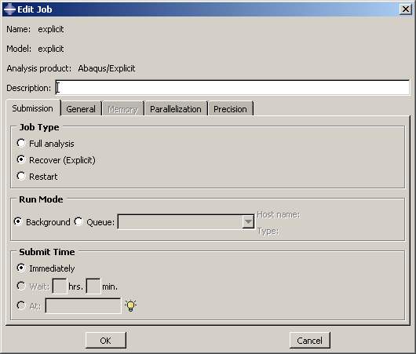

# 11.4 重启动分析

多步骤模拟不需要在单个作业中定义。实际上，通常希望分阶段运行复杂模拟。这样，您可以检查结果并确认分析是否按预期执行，然后再继续下一阶段。Abaqus 重启动分析功能允许重新启动模拟并计算模型对额外载荷历史的响应。

重启动分析功能的详细讨论请参见《Abaqus 分析用户手册》第 9.1.1 节"重启动分析"。

## 11.4.1 重启动文件和状态文件

Abaqus/Standard 重启动（`.res`）文件和 Abaqus/Explicit 状态（`.abq`）文件包含继续先前分析所需的信息。在 Abaqus/Explicit 中，包（`.pac`）文件和所选结果（`.sel`）文件也用于重启动分析，必须在第一个作业完成时保存。此外，两个产品都需要输出数据库（`.odb`）文件。对于大型模型，重启动文件可能会变得非常大；当请求重启动数据时，默认情况下会为每个增量或间隔写入重启动数据。因此，控制写入重启动数据的频率非常重要。有时允许在步骤中覆盖重启动文件上的数据。这意味着在分析结束时，每个步骤只有一组重启动数据，对应于每个步骤结束时模型的状态。但是，如果分析因某些原因中断（例如计算机故障），则可以从上次写入重启动数据的点继续分析。

## 11.4.2 重启动分析

使用先前分析的结果重新启动模拟时，您需要指定模拟载荷历史中要从中重新启动分析的特定点。但是，重启动分析中使用的模型必须与原始分析中直到重启动位置使用的模型相同。具体来说：

- 重启动分析模型不得修改或添加任何几何体、网格、材料、截面、梁截面轮廓、材料方向、梁截面方向、相互作用属性或原始分析模型中已定义的约束；并且
- 同样，不得修改重启动位置或之前的任何步骤、载荷、边界条件、预定义场或相互作用。

但是，您可以在重启动分析模型中定义新的集合和幅值曲线。

### 继续中断的运行

重启动分析从前一个分析的指定步骤和增量继续。如果给定的步骤和增量不对应于前一个分析的结束（例如，如果分析因计算机故障而中断），Abaqus 将尝试完成原始步骤，然后再尝试模拟任何新步骤。

在 Abaqus/Explicit 中，如果重启动只是为了继续一个长步骤（可能因为超过作业时间限制而终止），您可以使用如图 11-9 所示的**恢复**作业类型重新启动运行。

**图 11-9** **恢复**作业类型。

### 继续添加额外步骤

如果前一个分析成功完成，并且查看了结果后，您想要向载荷历史添加额外的步骤，则指定的步骤和增量应该是前一个分析的最后步骤和最后增量。

### 更改分析

有时，在查看了前一个分析的结果后，您可能希望从中间点重新启动分析并以某种方式更改剩余的载荷历史——例如，添加更多输出请求、更改载荷或调整分析控制。例如，当步骤超出其最大增量数时，这可能是必要的。如果因为超出最大增量数而重新启动分析，Abaqus/Standard 会认为分析正处于某个步骤的中间，尝试完成该步骤，然后立即再次超出最大增量数。

在这种情况下，您应该指示当前步骤应在指定的步骤和增量处终止。然后模拟可以继续新步骤。例如，如果一个步骤只允许最多 20 个增量，但少于完成该步骤所需的增量数，则应在新的步骤中定义与原始运行中指定的完全相同的步骤定义（包括施加的载荷和边界条件），但有以下例外：

- 应增加增量数。
- 新步骤的总时间应该是原始步骤的总时间减去第一次运行中完成的时间。例如，如果步骤最初指定的时间为 100 秒，而分析在步骤时间为 20 秒时耗尽增量，则重启动分析中该步骤的持续时间应为 80 秒。
- 需要根据步骤的新时间范围重新指定以步骤时间表示的任何幅值定义。以总时间表示的幅值定义不需要更改，前提是使用上述修改。

由于在一般分析步骤中载荷或规定边界条件的幅值始终是总值，因此它们保持不变。