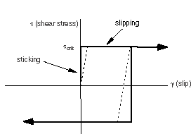

# 12.3 表面之间的相互作用

接触表面之间的相互作用由两个分量组成：一个垂直于表面，另一个切向于表面。切向分量包括表面的相对运动（滑动）以及可能的摩擦剪切应力。每次接触相互作用都可以引用一个接触属性，该属性指定了接触表面之间相互作用的模型。Abaqus中提供了多种接触相互作用模型；默认模型是无摩擦接触且无粘结。

## 12.3.1 表面法向行为

分离两个表面的距离称为间隙。当两个表面之间的间隙变为零时，Abaqus中会施加接触约束。接触公式对表面之间可以传递的接触压力大小没有限制。当表面之间的接触压力变为零或负值时，表面将分离，约束将被移除。这种行为称为"硬"接触，是Abaqus中的默认接触行为，其总结如图12-4所示的接触压力-间隙关系。

**图12-4** "硬"接触的接触压力-间隙关系。

默认情况下，在使用Abaqus/Standard中的接触对时，"硬"接触是直接强制的。当接触条件从"张开"（正间隙）变为"闭合"（间隙为零）时，接触压力的剧烈变化有时使得难以完成Abaqus/Standard中的接触模拟；对于Abaqus/Explicit则不存在这个问题，因为显式方法不需要迭代。如"Abaqus/Standard中的接触约束施加方法"中所讨论的，接触对可以使用替代的施加方法（例如，罚函数）。对于通用接触，接触约束的罚函数施加是唯一可用的选项。其他信息来源包括"Abaqus/Standard中与接触建模相关的常见困难"、"使用接触对的Abaqus/Explicit中与接触建模相关的常见困难"；"使用Abaqus/Standard进行接触建模"讲座笔记；以及"高级主题：Abaqus/Explicit"讲座笔记。

## 12.3.2 表面滑动

除了确定在特定点是否发生了接触之外，Abaqus分析还必须计算两个表面的相对滑动。这可能是一个非常复杂的计算；因此，Abaqus将滑动量较小的问题与滑动量可能为有限值的问题区分开来。建模表面之间滑动较小的问题在计算上要便宜得多。"小滑动"的定义通常很难确定，但一个可以遵循的一般准则是：如果接触表面上的某点滑动的距离不超过典型单元尺寸的一小部分，则问题可以使用"小滑动"近似。

通用接触不提供小滑动选项。

## 12.3.3 摩擦模型

当表面处于接触状态时，它们通常会在界面处传递剪切力以及法向力。因此，分析可能需要考虑摩擦力，即抵抗表面相对滑动的力。*库仑摩擦*是用于描述接触表面相互作用的常用摩擦模型。该模型使用摩擦系数来表征表面之间的摩擦行为。

默认摩擦系数为零。在表面牵引力达到临界剪切应力值之前，切向运动为零。临界剪切应力值取决于法向接触压力，根据以下方程计算：

其中是摩擦系数，是两个表面之间的接触压力。该方程给出了接触表面的极限摩擦剪切应力。接触表面在界面上的剪切应力等于极限摩擦剪切应力之前不会发生滑移（相对于彼此滑动）。对于大多数表面，通常小于1。库仑摩擦可以用或来定义。图12-5中的实线总结了库仑摩擦模型的行为：当表面处于粘着状态时（剪切应力低于），表面相对运动（滑移）为零。可选地，如果两个接触表面都是基于单元的表面，则可以指定摩擦应力极限。

**图12-5** 摩擦行为。

在Abaqus/Standard中，两种状态（粘着或滑移）之间的不连续性可能在模拟过程中导致收敛问题。只有当摩擦对模型响应有重大影响时，才应在Abaqus/Standard模拟中包含摩擦。如果包含摩擦的接触模拟遇到收敛问题，在诊断困难时首先应该尝试的修改之一是重新运行不带摩擦的分析。通常，摩擦对Abaqus/Explicit不会造成额外的计算困难。

模拟理想摩擦行为可能非常困难；因此，在大多数情况下，Abaqus默认使用带有允许"弹性滑移"的罚摩擦公式，如图12-5中虚线所示。"弹性滑移"是当表面应该粘着时发生在表面之间的少量相对运动。Abaqus自动选择罚刚度（虚线的斜率），使得该允许的"弹性滑移"是特征单元长度的一小部分。罚摩擦公式适用于大多数问题，包括大多数金属成形应用。

在那些必须包含理想粘滑摩擦行为的问题中，可以在Abaqus/Standard中使用"拉格朗日"摩擦公式，在Abaqus/Explicit中使用运动摩擦公式。"拉格朗日"摩擦公式在计算机资源方面更昂贵，因为Abaqus/Standard为每个具有摩擦接触的表面节点使用额外的变量。此外，解决方案收敛较慢，因此通常需要额外的迭代。本指南不讨论这种摩擦公式。

通常，从粘着状态开始滑动的摩擦系数与已建立滑动期间的摩擦系数不同。前者通常称为静摩擦系数，后者称为动摩擦系数。在Abaqus中提供了指数衰减定律来模拟静摩擦和动摩擦之间的过渡（见图12-6）。本指南不讨论这种摩擦公式。

**图12-6** 指数衰减摩擦模型。

在Abaqus/Standard中，在模型中包含摩擦会向正在求解的方程组添加不对称项。如果小于约0.2，这些项的大小和影响非常小，常规对称求解器效果很好（除非接触表面具有高曲率）。对于较高的摩擦系数，不对称求解器会自动被调用，因为它将提高收敛速度。不对称求解器需要比对称求解器多一倍的计算机内存和临时磁盘空间。较大的值通常不会在Abaqus/Explicit中造成任何困难。

## 12.3.4 其他接触相互作用选项

Abaqus中可用的其他接触相互作用模型取决于分析产品和所使用的算法，可能包括粘附接触行为、软化接触行为、紧固件（例如，点焊）以及粘性接触阻尼。本指南不讨论这些选项。有关它们的详细信息可以在Abaqus分析用户指南中找到。

## 12.3.5 基于表面的约束

约束用于在模拟整个过程中将两个表面绑定在一起。从属表面上的每个节点被约束为与距其最近的主表面点具有相同的运动。对于结构分析，这意味着平移（以及可选的旋转）自由度受到约束。

Abaqus使用模型的未变形配置来确定哪些从属节点被绑定到主表面。默认情况下，所有位于主表面给定距离内的从属节点都被绑定。默认距离基于主表面的典型单元尺寸。可以通过以下两种方式之一覆盖此默认值：指定从属节点必须位于主表面内的距离才能被约束，或指定将包含将被约束的节点的集合的名称。

从属节点也可以被调整，使其恰好位于主表面上。如果从属节点必须被调整的距离占与从属节点所附着的单元边长的较大比例，则单元可能会变得严重扭曲；应尽可能避免大的调整。

约束对于快速网格细化特别有用，适用于不同网格的情况。
