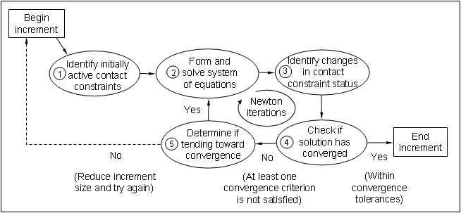

# 12.4 在 Abaqus/Standard 中定义接触

在 Abaqus/Standard 中定义接触对（以及可选的一般接触）的第一步是定义可能发生接触的物体的表面。第二步是指定相互作用的表面，即接触相互作用。最后一步是定义表面在接触状态下的力学行为模型。

表面的定义对于一般接触是可选的，因为当使用一般接触时，会自动创建一个包含所有单元的表面。您可以使用特定的表面配对来包含默认表面中未包含的区域，排除模型不同区域之间的相互作用，或覆盖全局接触属性分配。例如，如果您想将某个摩擦系数应用于模型中的所有表面但少数几个表面，您可以全局分配主要摩擦系数，然后为给定的用户定义表面对覆盖此属性。

## 12.4.1 接触相互作用

在 Abaqus/Standard 模拟中，可能的接触通过将表面名称分配给接触相互作用（接触对方法）或调用自动定义的全包含单元表面作为接触域（一般接触方法）来定义。对于两种接触方法，每个接触相互作用都必须引用一个接触属性，这与每个单元必须引用单元属性的方式非常相似。力学行为（如接触压力-间隙关系和摩擦）可以包含在接触属性中。

定义接触相互作用时，必须确定相对滑动的大小是小还是有限。默认值是更通用的有限滑动公式。小滑动公式（仅适用于接触对）适用于两个表面的相对运动小于单元面特征长度一小部分的情况。在适用时使用小滑动公式可以提高分析效率。

## 12.4.2 从表面和主表面

默认情况下，Abaqus/Standard 中的接触对使用纯主从接触算法：一个表面上的节点（从表面）不能穿透另一个表面（主表面）上的段，如图 12-7 所示。该算法对主表面没有任何限制；它可以在从节点之间穿透从表面，如图 12-7 所示。

**图 12-7** 主表面可以穿透从表面。

由于严格的主从公式，您必须小心正确选择从表面和主表面，以获得最佳可能的接触模拟。需要遵循的一些简单规则是：

- 从表面应该是网格更细密的表面
- 如果网格密度相似，从表面应该是具有更软底层材料的表面

Abaqus/Standard 中的一般接触算法在相互作用的表面之间以平均意义强制接触；Abaqus/Standard 自动分配主从角色。

## 12.4.3 接触离散化

Abaqus/Standard 提供两种接触离散化方法：传统的节点-表面方法和表面-表面方法。节点-表面离散化方法定义每个从节点与主表面之间的接触条件。表面-表面离散化方法在定义接触约束时考虑主表面和从表面的形状。接触对算法可以使用任一离散化方法；一般接触仅使用表面-表面方法。

## 12.4.4 小滑动和有限滑动

当使用小滑动公式时，Abaqus/Standard 在模拟开始时建立从节点与主表面之间的关系。Abaqus/Standard 确定主表面上的哪个段将与从表面上的每个节点相互作用。它在整个分析过程中维持这些关系，从不改变哪个主表面段与哪个从节点相互作用。如果模型中包含几何非线性，小滑动算法会考虑主表面的任何旋转和变形，并更新传递接触力的载荷路径。如果模型中不包含几何非线性，则忽略主表面的任何旋转或变形，载荷路径保持不变。

有限滑动接触公式要求 Abaqus/Standard 持续跟踪主表面的哪部分与每个从节点接触。这是一个非常复杂的计算，特别是当两个接触体都是可变形体时。此类模拟中的结构可以是二维或三维的。Abaqus/Standard 还可以模拟可变形体的有限滑动自接触。当结构折叠到自身上时就会发生这种情况。

可变形体与刚性表面之间的有限滑动公式的复杂程度不如两个可变形体之间的有限滑动公式。主表面为刚性的有限滑动模拟可以对二维和三维模型进行。

接触对算法可以考虑小滑动或有限滑动效应；一般接触仅考虑有限滑动效应。

## 12.4.5 单元选择

接触单元的选择很大程度上取决于所使用的接触强制。例如，对于传统接触公式（即节点-表面离散化），对于将形成从表面的模型部分，通常最好使用一阶单元。二阶单元有时可能会导致问题，因为这些单元计算恒定压力的协调节点载荷的方式。在面积 *A* 的二维二阶单元上，恒定压力 *P* 的协调节点载荷如图 12-8 所示。

**图 12-8** 二维二阶单元上恒定压力的等效节点载荷。

节点-表面接触公式从作用于从节点的力做出重要决策。算法很难判断图 12-8 中所示的力分布是代表恒定接触压力还是单元上的实际变化。三维二阶块单元的等效节点力更加令人困惑，因为对于恒定压力，它们的符号甚至不相同，使得算法很难正确工作，特别是对于非均匀接触。因此，为避免此类问题，当与节点-表面公式一起使用时，Abaqus/Standard 自动向定义从表面的二阶三维块或楔形单元的任何面添加面中节点。具有面中节点的二阶单元面的等效节点力对于恒定压力具有相同的符号，尽管它们在大小上仍然存在相当大的差异。

作用在一阶单元上的施加压力的等效节点力始终具有一致的符号和大小；因此，关于给定节点力分布所代表的接触状态不存在歧义。

如果您使用的是节点-表面公式，并且您的几何形状复杂，需要使用自动网格生成器，则应使用 Abaqus/Standard 中的改进型二阶四面体单元（C3D10M）。这些单元设计用于复杂接触模拟；规则二阶四面体单元（C3D10）在其角节点处的接触力为零，导致接触压力预测较差。改进型二阶四面体单元可以准确地计算接触压力。

规则二阶单元通常可以毫无困难地与表面-表面公式一起使用。

## 12.4.6 接触算法

理解 Abaqus/Standard 用于求解接触问题的算法将帮助您理解消息文件中的诊断输出并成功进行接触模拟。

Abaqus/Standard 中的接触算法（如图 12-9 所示）建立在第 8 章"非线性"中讨论的 Newton-Raphson 技术之上。

**图 12-9** Abaqus/Standard 中的接触算法。

Abaqus/Standard 在每个增量开始时检查所有接触相互作用的状态，以确定从节点是开放还是闭合。如果一个节点闭合，Abaqus/Standard 确定它是滑动还是粘结。Abaqus/Standard 为每个闭合节点施加约束，并从任何接触状态从闭合变为开放的节点移除约束。然后 Abaqus/Standard 执行一次迭代，并使用计算出的修正更新模型的构型。

在更新的构型中，Abaqus/Standard 检查从节点处接触条件的变化。任何在迭代后间隙变为负或零的节点都已从开放变为闭合。任何接触压力变为负的节点都已从闭合变为开放。如果在任何迭代中检测到任何接触变化，Abaqus/Standard 将其标记为**严重不连续迭代**。

Abaqus/Standard 继续迭代，直到严重不连续足够小（或者不发生严重不连续）并且满足平衡（通量）容差。或者，您可以选择不同的方法，在检查平衡之前，Abaqus/Standard 将继续迭代，直到不发生严重不连续。

消息和状态文件中每个完成的增量的摘要显示了有多少迭代是严重不连续迭代，有多少是平衡迭代（平衡迭代是不发生严重不连续的那种迭代）。增量的迭代总数是这两者的和。对于某些增量，您可能会发现所有迭代都标记为严重不连续迭代（当在每次迭代中检测到小的接触变化并最终满足平衡时会发生这种情况）。

Abaqus/Standard 应用涉及渗透变化、残余力变化以及从一次迭代到下一次迭代的严重不连续数量的复杂标准，以确定是继续还是终止迭代。因此，原则上不需要限制严重不连续迭代的次数。这使得可以运行需要大量接触变化的接触问题，而无需更改控制参数。严重不连续迭代的最大次数默认限制为 50，这在实践中应该始终大于增量中的实际迭代次数。
