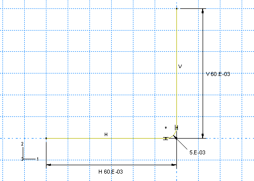
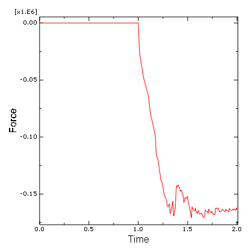
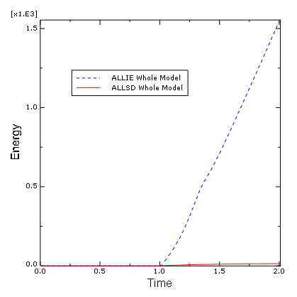

# 12.6 Abaqus/Standard 二维示例：成形通道

本模拟演示了在长金属板上成形通道的过程，展示了刚性表面的使用方法以及在 Abaqus/Standard 中进行成功接触分析所需的一些更复杂的技术。

该问题包括一块称为毛坯的可变形材料条，以及与毛坯接触的工具——冲头、模具和压料板。工具被建模为（解析）刚性表面，因为它们比毛坯 stiff得多。图 12-14 显示了组件的基本布置。

**图 12-14** 成形分析。

毛坯厚度为 1 mm，在压料板和模具之间被挤压。压料板力为 440 kN。这个力与毛坯和压料板之间以及毛坯和模具之间的摩擦一起，控制着材料在成形过程中被拉入模具的方式。您需要确定成形过程中作用在冲头上的力。您还必须评估使用这些特定的压料板力设置和工具与毛坯之间摩擦系数时通道的成形效果。

将使用二维平面应变模型。如果结构在这个方向上很长，则模型平面外方向没有应变这一假设是有效的。由于成形过程关于通道中心平面对称，因此只需要对通道的一半进行建模。

该模型将使用接触对而不是通用接触，因为通用接触在 Abaqus/Standard 中不适用于解析刚性表面。

各个组件的尺寸如图 12-15 所示。

**图 12-15** 成形模拟中组件的尺寸，单位为 m。

## 12.6.1 前处理——使用 Abaqus/CAE 创建模型

使用 Abaqus/CAE 创建模型。Abaqus 提供了复制此问题完整分析模型的脚本。如果您遇到跟随下面说明的困难，或者您想检查您的工作，请运行这些脚本。脚本位于以下位置：

* Python 脚本位于"成形通道"示例的附录 A.12 中（第 A.12 节）。有关如何在 Abaqus/CAE 中获取脚本并运行的说明，请参阅附录 A"示例文件"。
* Abaqus/CAE 插件脚本可在 Abaqus/CAE 插件工具集中找到。要从 Abaqus/CAE 运行脚本，请选择**插件 → Abaqus → 入门**；高亮显示**成形通道**；然后点击**运行**。有关入门插件的更多信息，请参阅 Abaqus/CAE 用户指南的第 82.1 节"运行 Abaqus 入门示例"。

如果您无法访问 Abaqus/CAE 或其他预处理器，可以手动创建此问题所需的文件，如 Abaqus/Standard 二维示例：成形通道的 12.5 节所述。

**零件定义**

启动 Abaqus/CAE（如果您尚未运行它）。您需要创建四个零件：一个表示毛坯的可变形零件和三个表示工具的刚性零件。

**可变形毛坯**

创建一个二维可变形实体零件，具有平面壳基础特征来表示可变形毛坯。使用大约为 `0.25` 的零件近似尺寸，并将零件命名为 `Blank`。要定义几何形状，请使用连接线工具绘制任意尺寸的矩形。然后，对矩形的水平和垂直长度进行尺寸标注，并编辑尺寸以精确确定零件几何形状。最终草图如图 12-16 所示。

**图 12-16** 可变形毛坯的草图（网格间距加倍）。

**刚性工具**

您必须为每个刚性工具创建一个单独的零件。这些零件的创建使用非常相似的技术，因此只需详细考虑其中一个（例如冲头）的创建。创建一个具有线基础特征的二维平面解析刚性零件来表示刚性冲头。使用大约为 `0.25` 的零件近似尺寸，并将零件命名为 `Punch`。使用**创建线**和**创建圆角**工具，绘制零件的几何形状。根据需要创建和编辑尺寸以精确定义几何形状。最终草图如图 12-17 所示。

**图 12-17** 刚性冲头的草图（网格间距加倍）。

必须创建一个刚体参考点。完成零件几何定义后，退出草图器返回**零件**模块。从主菜单栏中，选择**工具 → 参考点**。在视口中，选择弧中心处的点作为刚体参考点。

接下来，创建两个额外的解析刚性零件，分别命名为 `Holder` 和 `Die`，分别表示压料板和刚性模具。由于零件互为镜像，定义新零件几何形状的最简单方法是旋转为冲头创建的草图。（**复制零件**工具不能用于镜像解析刚性零件。）例如，编辑冲头特征截面草图，并将此草图保存为名称 `Punch`。然后，创建一个名为 `Holder` 的零件，并将 `Punch` 草图添加到零件定义中。关于垂直边缘镜像草图。最后，创建一个名为 `Die` 的零件，并将 `Punch` 草图添加到零件定义中。在这种情况下，先关于垂直边缘镜像，然后再关于水平边缘镜像。确保在每个零件的弧中心创建一个参考点。

**材料和截面属性**

毛坯由高强度钢制成（弹性模量为 210.0 × 10⁹ Pa，ν = 0.3）。其非弹性应力-应变行为如表 12-1 和图 12-18 所示。材料在塑性变形时经历相当大的加工硬化。在此分析中可能出现大的塑性应变；因此，提供了高达 50% 塑性应变的硬化数据。

**表 12-1** 屈服应力-塑性应变数据。

| 屈服应力 (Pa) | 塑性应变 |
|-------------|---------|
| 400.0E6 | 0.0 |
| 420.0E6 | 2.0E-2 |
| 500.0E6 | 20.0E-2 |
| 600.0E6 | 50.0E-2 |

**图 12-18** 屈服应力与塑性应变的关系。

创建一个名为 `Steel` 的材料，具有这些属性。创建一个名为 `BlankSection` 的均匀实体截面，该截面引用 `Steel` 材料。将截面分配给毛坯。

毛坯在变形过程中将发生显著旋转。在随毛坯运动旋转的坐标系中报告应力和应变值，将使解释结果变得更加容易。因此，应该创建一个局部材料坐标系，该坐标系最初与全局坐标系对齐，但随着元素的变形而移动。要做到这一点，使用**创建基准坐标系：3 点**工具创建一个矩形基准坐标系。从**属性**模块的主菜单栏中，选择**分配 → 材料方向**。选择将分配局部材料方向的区域作为毛坯，并在视口中选择基准坐标系作为 **CSYS**（选择**轴 3** 并为附加旋转选项接受**无**）。

**组装零件**

现在您将创建零件实例的装配来定义分析模型。首先实例化毛坯。然后，使用下面描述的技术实例化并定位刚性工具。

**实例化并定位冲头的步骤：**

1. 在模型树中，双击 **Assembly** 容器下的 **Instances**，并选择 `Punch` 作为要实例化的零件。

   二维平面应变模型必须定义在全局 1-2 平面中。因此，实例化后不要旋转零件。但是，您可以将模型原点放置在任何方便的位置。1 方向将垂直于对称平面。

2. 冲头的底部最初位于毛坯顶部上方，如图 12-15 所示。从主菜单栏中，选择**约束 → 边缘到边缘**，以相对于毛坯垂直定位冲头。

3. 选择冲头的水平边缘作为可移动实例的直线边缘，选择毛坯顶部的边缘作为固定实例的直线边缘。

   箭头出现在两个实例上。冲头将被移动，使其箭头指向与毛坯上箭头相同的方向。

4. 如果需要，点击提示区域的**翻转**，以反转冲头上箭头的方向；否则，冲头将被翻转。当两个箭头指向相同方向时，点击**确定**。

5. 输入距离 `0.0` m 以指定实例之间的分离。

   冲头在视口中移动到指定位置。点击**自动拟合**工具，使整个装配重新调整大小以适应视口。

6. 冲头的垂直边缘距毛坯左边缘 0.05 m，如图 12-15 所示。定义另一个**边缘到边缘**约束，以相对于毛坯水平定位冲头。

   选择冲头的垂直边缘作为可移动实例的直线边缘，选择毛坯的左边缘作为固定实例的直线边缘。如有必要，翻转冲头上的箭头，使两个箭头指向相同方向。输入 -0.05 m 的距离以指定边缘之间的分离。（使用负距离，因为偏移是沿边缘法线方向应用的。边缘法线指向远离毛坯边缘的方向。）

   现在您已经相对于毛坯定位了冲头，检查冲头的左端是否超出毛坯的左边缘。这是必要的，以防止与毛坯关联的任何节点在接触计算期间"脱离"与冲头关联的刚性表面。如有必要，返回**零件**模块并编辑零件定义以满足此要求。

**实例化并定位压料板的步骤：**

压料板的实例化和定位过程与用于实例化和定位冲头的过程非常相似。参考图 12-15，我们看到压料板最初定位为其水平边缘距毛坯顶边缘 0.0 m，垂直边缘距冲头垂直边缘 0.001 m。定义必要的**边缘到边缘**约束以定位压料板。记住根据需要翻转箭头方向，并确保压料板的右端超出毛坯的右边缘。如有必要，返回**零件**模块并编辑零件定义。

**实例化并定位模具的步骤：**

模具的实例化和定位过程与其他工具非常相似。参考图 12-15，我们看到模具最初定位为其水平边缘距毛坯底边缘 0.0 m，垂直边缘距压料板垂直边缘 0.0 m。定义必要的**边缘到边缘**约束以定位模具。记住根据需要翻转箭头方向，并确保模具的右端超出毛坯的右边缘。如有必要，返回**零件**模块并编辑零件定义。

最终装配如图 12-19 所示。

**图 12-19** 模型装配。

**几何集合**

此时创建将用于指定载荷和边界条件以及限制数据输出的几何集合会很方便。应该创建四个集合：每个刚体参考点一个，毛坯对称平面一个。

**创建几何集合的步骤：**

1. 双击 **Assembly** 容器下的 **Sets** 项，创建以下几何集合：
   * 在冲头刚体参考点处的 `RefPunch`。
   * 在压料板刚体参考点处的 `RefHolder`。
   * 在模具刚体参考点处的 `RefDie`。
   * 在毛坯左垂直边缘（对称平面）处的 `Center`。

**定义步骤和输出请求**

Abaqus/Standard 接触分析中有两个主要困难来源：刚性部件在接触条件约束之前的刚体运动，以及接触条件的突然变化，这导致在 Abaqus/Standard 尝试建立所有接触表面正确状态时产生严重的间断迭代。因此，尽可能采取预防措施以避免这些情况。

消除刚体运动并不特别困难。只需确保有足够的约束来防止模型中所有部件的所有刚体运动。这可能意味着使用边界条件最初使部件进入接触，而不是直接施加载荷。使用这种方法可能需要比最初预期更多的步骤，但问题的解决应该更顺利。

或者，可以使用接触控制来自动稳定刚体运动。使用这种方法，Abaqus/Standard 将粘性阻尼应用到接触对的从节点。但是，必须注意确保粘性阻尼不会显著改变问题的物理特性，如果消散的稳定能量和接触阻尼应力足够小的话。

通道成形模拟将包括两个步骤。由于模拟涉及材料、几何和边界非线性，必须使用通用步骤。此外，成形过程是准静态的；因此，我们可以在整个模拟中忽略惯性效应。而不是使用额外的步骤来建立牢固的接触，将使用上述接触稳定。下面给出每个步骤的简要总结（包括其目的、定义和相关输出请求的详细信息）。但是，有关如何施加载荷和边界条件的详细信息将在后面讨论。

**步骤 1**

压料板力的大小是许多成形过程中的一个控制因素；因此，需要作为可变载荷引入分析。在此步骤中将施加压料板力。

考虑到问题的准静态性质和非线性响应将受到考虑，在 `Initial` 步骤之后创建一个名为 `Holder force` 的静态通用步骤。输入以下步骤描述 `Apply holder force`；并包括几何非线性的影响。将初始时间增量设置为 `0.05`，总时间段设置为 `1.0`。指定为此步骤每 20 个增量写入预选场输出。此外，请求在冲头参考点（几何集合 `RefPunch`）处将垂直反力和位移（**RF2** 和 **U2**）每个增量都作为历史数据写入。此外，将接触诊断写入消息文件（**输出 → 诊断打印**）。

**步骤 2**

在第二个也是最后一个步骤中，冲头将向下移动以完成成形操作。

创建一个名为 `Move punch` 的静态通用步骤，并将其插入到 `Holder force` 步骤之后。输入以下步骤描述：`Apply punch stroke`。由于摩擦滑动、变化的接触条件和非弹性材料行为，此步骤中存在显著的非线性；因此，将最大增量数设置为一个较大的值（例如 `1000`）。将初始时间增量设置为 `0.05`，总时间段设置为 `1.0`。您之前的输出请求将被传播到此步骤。此外，请求每 `200` 个增量写入一次重启文件。

**监测自由度值**

您可以请求 Abaqus 监测一个选定点的自由度值。自由度值显示在**作业监视器**中，并在分析过程中每个增量写入状态（`.sta`）文件，并在分析过程中特定增量写入消息（`.msg`）文件。此外，当您提交分析时，会自动生成一个新视口，显示自由度值随时间变化的曲线。您可以使用此信息来监测解决方案的进度。

在此模型中，您将在每个步骤中监测冲头参考节点的垂直位移（自由度 2）。在继续之前，通过从上下文栏中的**步骤**列表中选择它，使第一个分析步骤（`Holder force`）处于活动状态。为此步骤应用的监视器定义将自动传播到后续步骤。

**选择要监测的自由度的步骤：**

1. 从**步骤**模块的主菜单栏中，选择**输出 → DOF 监视器**。

   **DOF 监视器**对话框出现。

2. 切换**监测整个分析过程中的自由度**。

3. 点击选择区域。在提示区域中，点击**点**。在出现的**区域选择**对话框中，选择 **RefPunch**；然后点击**继续**。

4. 在**自由度**文本字段中输入 `2`。

5. 接受写入消息文件的默认频率（每个增量）。

6. 点击**确定**退出**DOF 监视器**对话框。

**定义接触相互作用**

必须在毛坯顶部和冲头之间、毛坯顶部和压料板之间以及毛坯底部和模具之间定义接触。刚性表面必须是每个接触相互作用中的主表面。每个接触相互作用必须引用控制相互作用行为的接触相互作用属性。

在本例中，我们假设毛坯和冲头之间的摩擦系数为 0。毛坯与其他两个工具之间的摩擦系数假定为 0.1。因此，必须定义两个接触相互作用属性：一个有摩擦，一个无摩擦。

定义以下表面：在毛坯顶部边缘上的 `BlankTop`；在毛坯底部边缘上的 `BlankBot`；在模具朝向毛坯一侧上的 `DieSurf`；在压料板朝向毛坯一侧上的 `HolderSurf`；以及在冲头朝向毛坯一侧上的 `PunchSurf`。

> **提示：** 为了方便选择，您可以使用模型树有选择地隐藏零件实例：展开 **Instances** 容器，高亮显示您想要隐藏的零件实例，然后点击鼠标按钮 3。从出现的菜单中，选择**隐藏**。要恢复零件实例的可见性，重复此过程，并从菜单中选择**显示**。

现在定义两个接触相互作用属性。（在模型树中，双击 **Interaction Properties** 容器以创建接触属性。）将第一个命名为 `NoFric`；由于无摩擦接触是 Abaqus 中的默认设置，接受切向行为的默认属性设置（在**编辑接触属性**对话框中选择**机械 → 切向行为**）。第二个属性应命名为 `Fric`。对于此属性，使用摩擦系数为 `0.1` 的**罚**摩擦公式。

为了缓解可能由于变化的接触状态（特别是冲头和毛坯之间的接触）而引起的收敛困难，创建接触控制以调用自动接触稳定。将默认阻尼因子缩小 1000 倍，以最小化稳定对解决方案的影响。过程如下所述。

**定义接触控制的步骤：**

1. 在模型树中，双击 **Contact Controls** 容器定义接触控制。

   **创建接触控制**对话框出现。

2. 将控件命名为 `stabilize`。选择 **Abaqus/Standard 接触控制**，然后点击**继续**。

3. 在**编辑接触控制**对话框的**稳定**标签页中，切换**自动稳定**，并将**因子**设置为 `0.001`。

4. 点击**确定**退出**编辑接触控制**对话框。

最后，定义表面之间的相互作用，并在每个定义中引用适当的接触相互作用属性。（在模型树中，双击 **Interactions** 容器定义接触相互作用。）在所有情况下，在 `Initial` 步骤中定义相互作用，并使用**表面到表面接触（Standard）**类型。定义相互作用时，使用默认的有限滑动公式。应定义以下相互作用：

* `Die-Blank`：在表面 `DieSurf`（主）和 `BlankBot`（从）之间，引用 `Fric` 接触相互作用属性。接受默认接触控制。
* `Holder-Blank`：在表面 `HolderSurf`（主）和 `BlankTop`（从）之间，引用 `Fric` 接触相互作用属性。接受默认接触控制。
* `Punch-Blank`：在表面 `PunchSurf`（主）和 `BlankTop`（从）之间，引用 `NoFric` 接触相互作用属性。使用**相互作用管理器**，编辑此相互作用以在第二个分析步骤（`Move punch`）中分配之前定义的非默认接触控制（`stabilize`）。

**步骤 1 的边界条件和载荷**

在此步骤中，将在压料板和毛坯之间建立接触，而冲头和模具保持固定。

约束压料板的 1 和 6 自由度，其中自由度 6 是平面内的旋转；完全约束冲头和模具。所有刚性表面的边界条件都应用于它们各自的刚体参考节点。在毛坯位于对称平面的区域（几何集合 `Center`）上施加对称边界约束。

表 12-2 总结了在步骤 1 中应用的边界条件。

**表 12-2** 步骤 1 中应用的边界条件摘要。

| BC 名称 | 几何集合 | 边界条件 |
|--------|---------|---------|
| CenterBC | Center | XSYMM |
| RefDieBC | RefDie | U1 = U2 = UR3 = 0.0 |
| RefHolderBC | RefHolder | U1 = UR3 = 0.0 |
| RefPunchBC | RefPunch | U1 = U2 = UR3 = 0.0 |

要施加压料板力，请创建一个名为 `RefHolderForce` 的机械集中力。请记住，在此模拟中所需的压料板力为 440 kN。因此，将载荷施加到集合 `RefHolder`，并为 **CF2** 指定大小 `-440.E3`。

**步骤 2 的边界条件**

在此步骤中，向下移动冲头以完成成形操作。使用**边界条件管理器**，编辑 `RefPunchBC` 边界条件以为 **U2** 指定值 `-0.030`，这表示冲头的总位移。

在继续之前，将模型的名称更改为 `Standard`。

**网格创建和作业定义**

在设计网格之前，您应该考虑将要使用的单元类型。在选择单元类型时，必须考虑模型的几个方面，例如模型的几何形状、将看到的变形类型、施加的载荷等。以下几点在此模拟中很重要：

* 表面之间的接触。尽可能，应使用一阶单元（四面体单元除外）进行接触模拟。使用四面体单元时，应使用二阶四面体单元进行接触模拟（对于表面到表面离散化，使用常规形式或修正形式，对于节点到表面离散化，使用修正形式）。
* 在施加的载荷下预期毛坯会发生显著弯曲。完全积分的一阶单元在弯曲变形时会出现剪切锁定。因此，应使用减缩积分或不兼容模式单元。

不兼容模式或减缩积分单元都适用于此分析。在此分析中，您将使用具有增强沙漏控制的减缩积分单元。减缩积分单元有助于减少分析时间，增强沙漏控制减少了模型中沙漏的可能性。使用具有增强沙漏控制的 CPE4R 单元为毛坯划分网格（见图 12-20）。

**图 12-20** 通道成形分析的网格。

通过指定沿每条边的单元数来为毛坯的边缘设置种子。指定沿毛坯水平边缘 `100` 个单元，沿毛坯每条垂直边缘 `4` 个单元。工具已使用解析刚性表面建模，因此不需要划分网格。但是，如果工具已使用离散刚性单元建模，则网格必须足够细化以避免接触收敛困难。例如，如果模具已使用 R2D2 单元建模，则弯曲角应使用至少 20 个单元建模。这将创建一个足够光滑的表面，能够准确捕获角落几何形状。使用离散刚性单元时，始终使用足够数量的单元来建模此类曲线。

创建一个名为 `Channel` 的作业。为作业提供以下描述：`Analysis of the forming of a channel`。将模型保存到模型数据库文件，并提交作业进行分析。监测解决方案进度，纠正检测到的任何建模错误，并调查任何警告消息的原因。

一旦分析开始，您选择监测的自由度值（冲头的垂直位移）的 X-Y 曲线将出现在一个单独的视口中。从主菜单栏中，选择**视口 → 作业监视器：Channel** 以在分析运行时跟踪冲头在 2 方向上随时间变化的位移。

## 12.6.2 作业监测

此分析大约需要 180 个增量完成。**作业监视器**的顶部如图 12-21 所示。

**图 12-21** **作业监视器**顶部：通道成形分析。

冲头位移的值出现在**输出**标签页中。此模拟包含许多严重的间断迭代。Abaqus/Standard 在步骤 2 的第一个增量中难以确定接触状态。它需要三次尝试才能找到 `PunchSurf` 和 `BlankTop` 表面的正确配置并获得平衡。在这个困难的开端之后，Abaqus/Standard 迅速将增量大小增加到更合理的值。**作业监视器**的底部如图 12-22 所示。

**图 12-22** **作业监视器**底部：通道成形分析。

## 12.6.3 故障排除 Abaqus/Standard 接触分析

接触分析通常比 Abaqus/Standard 中几乎任何其他类型的模拟都更难完成。因此，了解所有可用于帮助您进行接触分析的选项非常重要。

如果接触分析遇到困难，首先要检查的是接触表面是否正确定义。最简单的方法是运行 **datacheck** 分析并在**可视化**模块中绘制表面法线。您可以绘制所有法线，对于两个表面和结构单元，在变形或未变形的图上。使用**通用绘图选项**对话框中的**法线**选项来执行此操作，并确认表面法线方向正确。

即使所有接触表面都正确定义，Abaqus/Standard 仍可能遇到接触模拟的一些问题。这些问题的原因之一可能是默认的收敛容差和迭代次数限制：它们相当严格。在接触分析中，有时最好允许 Abaqus/Standard 多迭代几次，而不是放弃增量并重试。这就是为什么 Abaqus/Standard 在模拟过程中区分严重间断迭代和平衡迭代的原因。

诊断接触信息对于几乎每个接触分析都是必不可少的。此信息对于发现错误或问题可能至关重要。例如，chattering 可以被发现，因为相同的从节点将涉及所有严重的间断迭代。如果您看到这一点，您将不得不修改该节点周围区域中的网格或向模型添加约束。接触诊断信息还可以识别仅单个从节点与表面相互作用的区域。这是一个非常不稳定的情况，可能导致收敛问题。同样，您应该修改模型以增加此类区域中的单元数量。

**接触诊断**

为了说明如何解释 Abaqus/CAE 中的接触诊断信息，让我们考虑第二个步骤第七个增量中的迭代。这是一个需要严重间断迭代的增量。Abaqus/Standard 需要三次迭代来建立模型中的正确接触条件；即冲头是否与毛坯接触。第四次和第五次迭代不会对模型的接触状态产生任何变化，但无法达到平衡。需要一次额外的迭代来收敛于静态平衡。因此，一旦 Abaqus/Standard 确定了正确的接触状态，它就可以轻松找到平衡解决方案。

为了进一步研究此增量中模型的行为，请查看 Abaqus/CAE 中可用的视觉诊断信息。写入输出数据库文件的诊断信息提供了关于模型接触条件变化的详细信息。例如，可以使用视觉诊断工具获取在严重间断迭代中接触状态发生变化的每个从节点的节点号和模型位置，以及它所属的接触相互作用。

进入**可视化**模块，打开文件 `Channel.odb` 查看接触诊断信息。在第二个步骤（增量 7，第一次尝试）的第一个严重间断迭代中，毛坯上的四个节点经历接触开口，表明它们的假定接触状态不兼容。这种不兼容性可以在**作业诊断**对话框的**接触**标签页中看到（见图 12-23）。要查看节点在模型中的位置，请切换**在视口中高亮显示选择**。

**图 12-23** 第一个严重间断迭代中的接触开口。

由于在此迭代中接触状态和平衡检查均未通过，Abaqus/Standard 从这些节点移除接触约束并执行另一次迭代。经过两次额外的迭代后，Abaqus/Standard 未检测到接触状态的变化。第四次和第五次迭代不满足力残差容差检查，因此执行另一次迭代。这次，不仅接触状态收敛，力残差容差检查也满足，并且位移校正相对于最大位移增量是可接受的，如图 12-24 所示。因此，第三次平衡迭代为此增量产生了收敛的解决方案。

**图 12-24** 收敛的平衡迭代。

## 12.6.4 后处理

在**可视化**模块中，检查毛坯的变形。

**变形模型形状和轮廓图**

此模拟的基本结果是毛坯的变形和由成形过程引起的塑性应变。我们可以绘制变形模型形状和塑性应变，如下所述。

**绘制变形模型形状的步骤：**

1. 绘制变形模型形状。您可以从显示中移除模具和冲头，仅可视化毛坯。

2. 在结果树中，展开输出数据库文件 `Channel.odb` 下的 **Instances** 容器。

3. 从可用零件实例列表中，选择 **BLANK-1**。点击鼠标按钮 3，并从出现的菜单中选择**替换**，以使用选定的元素替换当前显示组。如有必要，点击自动拟合工具以使模型适应视口。

   结果图如图 12-25 所示。

**图 12-25** 步骤 2 结束时毛坯的变形形状。

**绘制等效塑性应变轮廓的步骤：**

1. 从主菜单栏中，选择**绘图 → 轮廓 → 在变形形状上**；或从工具箱中点击轮廓工具以显示 Mises 应力轮廓。

2. 打开**轮廓图选项**对话框。

3. 拖动**轮廓间隔**滑块将轮廓间隔数更改为 **7**。

4. 点击**确定**应用这些设置。

5. 从左侧变量类型列表中选择**主要**，然后从输出变量列表中选择 **PEEQ**。

   PEEQ 是塑性应变的积分度量。塑性应变的非积分度量是 PEMAG。对于比例加载，PEEQ 和 PEMAG 相等。

6. 如有必要，使用缩放矩形工具放大毛坯中任何感兴趣的区域，如图 12-26 所示。

**图 12-26** 毛坯角落中等效塑性应变标量 PEEQ 的轮廓。

最大塑性应变约为 21%。将此与材料的破坏应变进行比较，以确定材料是否会在成形过程中撕裂。

**毛坯和冲头上反力的历史图**

图 12-27 中的实线显示了冲头刚体参考点处反力 **RF2** 的变化。

**图 12-27** 冲头上的力。

**创建反力历史图的步骤：**

1. 在结果树中，展开 **History Output** 容器。双击 `Reaction force: RF1 PI: PUNCH-1 Node xxx in NSET REFPUNCH`。

   反力在 1 方向上的历史图出现。

2. 打开**轴选项**对话框以标记轴。

3. 切换到**标题**标签页。

4. 指定 **Reaction Force - RF2** 作为 Y 轴标签，**Total Time** 作为 X 轴标签。

5. 点击**关闭**关闭对话框。

冲头力，如图 12-27 所示，在步骤 2 中迅速增加到约 160 kN，步骤 2 的总时间从 1.0 到 2.0。

**稳定能和内能的历史图**

验证接触稳定的存在不会显著改变问题的物理特性是很重要的。评估此要求的一种方法是将稳定耗散的能量（**ALLSD**）与结构内能（**ALLIE**）进行比较。理想情况下，稳定能量应该是内能的一小部分。图 12-28 显示了稳定能和内能的变化。很明显，消散的稳定能量确实很小。

**图 12-28** 稳定能和内能。

**在表面上绘制轮廓**

Abaqus/CAE 包含多个专门为后处理接触分析而设计的功能。在**可视化**模块中，**显示组**功能可用于将表面收集到显示组中，类似于单元和节点集。

**显示接触表面法线向量的步骤：**

1. 绘制未变形模型形状。

2. 在结果树中，展开**表面集**容器。选择名为 `BLANKTOP` 和 `PUNCH-1.PUNCHSURF` 的表面。点击鼠标按钮 3，并从出现的菜单中选择**替换**。

3. 使用**通用绘图选项**对话框，打开法线向量（**在表面上**）的显示，并将向量箭头长度设置为**短**。

4. 如有必要，使用缩放矩形工具放大任何感兴趣的区域，如图 12-29 所示。

**图 12-29** 表面法线。

**对接触压力绘制轮廓的步骤：**

1. 再次绘制塑性应变轮廓。

2. 从**场输出**工具栏左侧的变量类型列表中，如果尚未选择，则选择**主要**。

3. 从工具栏中心的输出变量列表中，选择 `CPRESS`。

4. 从显示组中移除 `PUNCH-1.PUNCHSURF` 表面。

   为了在二维模型中更好地可视化表面变量的轮廓，您可以通过拉伸平面应变单元来构建等效的三维视图。您可以以类似的方式 sweep轴对称单元。

5. 从主菜单栏中，选择**视图 → ODB 显示选项**。

   **ODB 显示选项**对话框出现。

6. 选择**扫描/拉伸**标签页以访问**扫描/拉伸**选项。

7. 在对话框的**拉伸**区域中，切换**拉伸单元**；并将**深度**设置为 `0.05` 以拉伸模型用于显示轮廓的目的。

8. 点击**确定**应用这些设置。

   使用旋转工具旋转模型，以从合适的视图显示模型，例如图 12-30 所示的视图。

**图 12-30** 接触压力。

