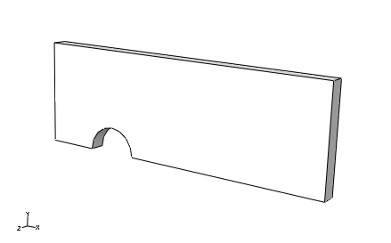
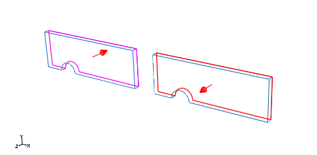
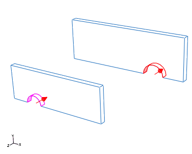
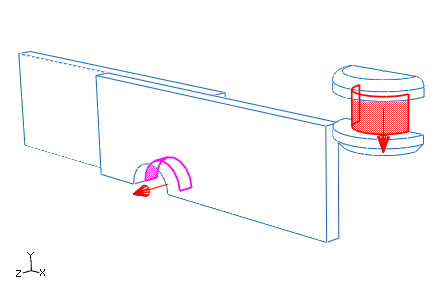
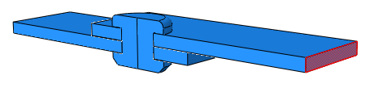
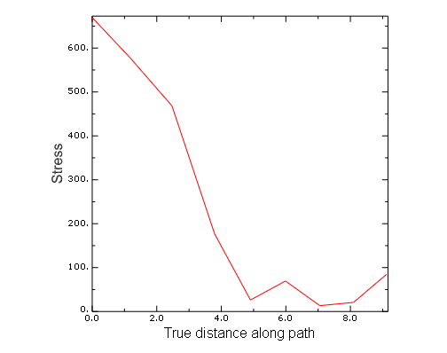

# 12.8 Abaqus/Standard 三维实例：搭接接头的剪切

本仿真模拟搭接接头的剪切，展示了在Abaqus/Standard中使用通用接触的方法。

该模型由两个用钛铆钉连接的铝合金板组成。底板的左端固定，顶部板右端施加力以剪切接头。图12-31显示了组件的基本排列。由于对称性，只对一半接头进行建模以降低计算成本。假设存在摩擦接触。


**图 12-31** 搭接接头分析。

## 12.8.1 预处理——使用Abaqus/CAE创建模型

使用Abaqus/CAE创建模型。Abaqus提供了复制此问题完整分析模型的脚本。如果您在使用下面给出的说明时遇到困难，或希望检查您的工作，请运行这些脚本之一。脚本位于以下位置：

* Python脚本位于"搭接接头的剪切，A.13节"中。关于如何在Abaqus/CAE中获取脚本并运行的说明，请参阅附录A"示例文件"。
* 此实例的插件脚本可在Abaqus/CAE插件工具集中找到。要从Abaqus/CAE运行脚本，请选择**插件** → **Abaqus** → **Getting Started**，高亮显示**Lap joint**，然后点击**运行**。有关Getting Started插件的更多信息，请参阅Abaqus/CAE User's Guide的82.1节"Running the Getting Started with Abaqus examples"。

如果您无法访问Abaqus/CAE或其他预处理器，可以手动创建此问题所需的输入文件，如《Getting Started with Abaqus: Keywords Edition》第12.7节"Abaqus/Standard三维实例：搭接接头的剪切"中所讨论。

### 零件定义

启动Abaqus/CAE（如果尚未运行）。您需要创建两个零件：一个表示板，一个表示铆钉。

#### 板

创建一个三维可变形实体零件，带有挤出基特征来表示板。使用约`100.0`的零件近似尺寸，并将零件命名为`plate`。首先绘制一个任意尺寸的矩形。然后进行标注，使水平长度为`30`，垂直长度为`10`，如图12-32所示。


**图 12-32** 板的草图。

将零件挤出`1.5`的距离。

使用**Create Cut: Extrude**工具切割出与螺栓孔对应的圆形区域。选择板的前表面作为草图平面，选择面的右边缘作为在草图中显示为垂直且在右侧的边缘。绘制螺栓孔草图，如图12-33所示。


**图 12-33** 螺栓孔草图。

将切口穿过整个零件挤出。

板的最终形状如图12-34所示。



**图 12-34** 最终板几何形状。

#### 铆钉

创建一个三维可变形实体零件，带有旋转基特征来表示铆钉。使用约`20.0`的零件近似尺寸，并将零件命名为`rivet`。使用**Create Lines**工具创建铆钉几何形状的粗略草图，如图12-35所示。根据需要使用尺寸和等长约束来细化草图。将零件旋转`180`度。


**图 12-35** 铆钉基草图。

编辑基零件，在顶部外边缘添加圆角，在底部外边缘添加倒角。圆角半径为`0.75`，倒角长度为`0.75`。最终零件几何形状如图12-36所示。


**图 12-36** 最终铆钉几何形状。

### 材料和截面属性

板由铝合金制成；应力-应变行为如图12-37所示。铆钉由钛制成；应力-应变行为如图12-38所示。


**图 12-37** 铝合金应力-应变曲线。


**图 12-38** 钛应力-应变曲线。

铝合金和钛材料的应力-应变数据分别提供在名为`lap-joint-alum.txt`和`lap-joint-titanium.txt`的文本文件中。在操作系统提示符下输入以下命令，使用Abaqus的`fetch`实用程序将这些文件复制到本地目录：

```
abaqus fetch job=lap*.txt
```

您将使用材料校准功能来定义材料属性，而不是手动转换应力-应变数据和定义材料属性。

**校准材料的步骤：**

1. 在模型树中，双击**Calibrations**。
2. 将校准命名为`aluminum`，然后点击**OK**。
3. 展开**Calibrations**容器，然后展开**aluminum**项。
4. 双击**Data Sets**。
5. 在**Create Data Set**对话框中，输入`Al`作为名称，然后点击**Import Data Set**。
6. 在**Read Data From Text File**对话框中，点击图标并选择名为`lap-joint-alum.txt`的文件。
7. 在此对话框的**Properties**区域中，指定从字段2读取应变值，从字段1读取应力值。
8. 从**Data Set Form**选项中，选择**True**以指示您正在导入的数据是真形式。
9. 点击**OK**关闭**Read Data From Text File**对话框。
10. 点击**OK**关闭**Create Data Set**对话框。
11. 在模型树中，双击**Behaviors**。
12. 将行为命名为`Al-elastic-plastic`，选择**Elastic Plastic Isotropic**作为类型，然后点击**Continue**。
13. 在**Edit Behavior**对话框中，选择**Al**作为弹塑性数据的数据集。
14. 在文本字段中输入`0.00488, 350.0`来定义屈服点（或者，您可以直接在视口中选择该点）。
15. 将**Plastic points**滑块拖到**Min**和**Max**之间的中间位置以生成塑性数据点。
16. 输入泊松比为`0.33`。
17. 在对话框底部，点击图标创建一个名为`aluminum`的空材料（在材料编辑器中输入名称后只需点击**OK**）。
18. 在**Edit Behavior**对话框中，从**Material**下拉列表中选择**aluminum**。
19. 点击**OK**将属性添加到名为**aluminum**的材料中。
20. 在模型树中，展开**Materials**容器并检查材料模型的内容。您会注意到弹性属性和塑性属性都已定义。如果您希望更改塑性点的数量或修改屈服点，只需返回**Edit Behavior**对话框，进行必要的更改，选择属性将应用到的材料名称，然后点击**OK**。材料模型的内容会自动更新。
21. 按照相同的程序，创建一个名为`titanium`的材料模型。包含应力-应变数据的文件名为`lap-joint-titanium.txt`；屈服点为`0.0081, 907.0`；泊松比等于`0.34`。

创建一个名为`plate`的均质实体截面，引用`aluminum`材料。将截面分配给板。

创建一个名为`rivet`的均质实体截面，引用`titanium`材料。将截面分配给铆钉。

### 装配零件

您现在将创建零件实例的装配来定义分析模型。装配由两个板的可依赖实例和一个铆钉的可依赖实例组成。第一个板实例是装配的顶板；第二个板实例是装配的底板。

**实例化和定位板的步骤：**

1. 在模型树中，双击**Assembly**容器下的**Instances**，然后选择`plate`作为要实例化的零件。
2. 创建板的第二个实例。切换选项以自动偏移零件实例。
3. 从主菜单栏，选择**Constraint** → **Face to Face**。选择右侧板（第二个实例）的背面作为可移动实例上的面。选择左侧板（第一个实例）的背面作为固定实例上的面。如有必要，翻转箭头使它们指向相反的方向，如图12-39所示。将偏移量设置为`0.0`。



**图 12-39** 面-面约束。

4. 从主菜单栏，选择**Constraint** → **Parallel Edge**。选择第二个板实例的前顶部边缘作为可移动实例上的边缘。选择第一个板实例的前右边缘作为固定实例上的边缘。如有必要，翻转箭头使它们指向图12-40所示的方向。


**图 12-40** 平行边缘约束。

5. 从主菜单栏，选择**Constraint** → **Coaxial**。选择第二个板实例的圆柱面作为可移动实例上的面。选择第一个板实例的圆柱面作为固定实例上的面。如有必要，翻转箭头使它们指向相同的方向，如图12-41所示。



**图 12-41** 板共轴约束。

**实例化和定位铆钉的步骤：**

1. 在模型树中，双击**Assembly**容器下的**Instances**，然后选择`rivet`作为要实例化的零件。
2. 从主菜单栏，选择**Constraint** → **Coaxial**。选择铆钉体的圆柱面作为可移动实例上的面。选择顶板的圆柱面作为固定实例上的面。如有必要，翻转箭头使它们指向图12-42所示的方向。



**图 12-42** 共轴约束。

最终装配如图12-31所示。

### 几何集

此时创建几何集以方便指定载荷和边界条件会很方便。

**创建几何集的步骤：**

1. 双击**Assembly**容器下的**Sets**项以创建以下几何集：

   * `corner`：底板左下角的顶点（图12-43）。此集合将用于防止3方向上的刚体运动。

   

   **图 12-43** 集合`corner`。

   * `fix`：底板左侧面（图12-44）。此集合将用于固定板端。

   

   **图 12-44** 集合`fix`。

   * `pull`：顶板右侧面（图12-45）。此集合将用于拉动板端。

   

   **图 12-45** 集合`pull`。

   * `symm`：对称平面上的所有面（图12-46）。此集合将用于施加对称条件。

   

   **图 12-46** 集合`symm`。

### 定义步骤和输出请求

在`Initial`步骤之后创建一个静态、通用步骤，并包含几何非线性的影响。将初始时间增量设置为`0.05`，总时间设置为`1.0`。接受默认的输出请求。

### 定义接触相互作用

接触将用于强制执行板和铆钉之间的相互作用。所有零件之间的摩擦系数假定为0.05。

此问题可以使用接触对或通用接触算法。我们将在此问题中使用通用接触来展示用户界面的简单性。

定义一个名为`fric`的接触相互作用属性。在**Edit Contact Property**对话框中，选择**Mechanical** → **Tangential Behavior**，选择**Penalty**作为摩擦公式，并在表格中指定摩擦系数为`0.05`。接受所有其他默认值。

在`Initial`步骤中创建一个名为`All`的**General contact (Standard)**相互作用。在**Edit Interaction**对话框中，接受**Contact Domain**的默认选择**All* with self**，以为Abaqus/Standard自动定义的默认全包含表面指定自接触。此方法是定义整个模型接触的最简单方式。选择`fric`作为**Global property assignment**，然后点击**OK**。

### 定义边界条件

边界条件在静态、通用步骤中定义。装配的左端固定，而右端沿板的长度方向（1方向）被拉动。单个节点在垂直方向（3方向）固定以防止刚体运动，而对称平面上的节点在垂直于平面的方向（2方向）固定。边界条件总结于表12-3中。在模型中定义这些条件。

**表 12-3** 边界条件摘要。

| BC Name | Geometry Set | BCs |
|---------|--------------|-----|
| Fix | fix | U1 = 0.0 |
| Pull | pull | U1 = 2.5 |
| Symmetry | symm | U2 = 0.0 |
| RB | corner | U3 = 0.0 |

### 网格创建和作业定义

网格将在零件级别而非装配级别创建，因为此问题中使用的所有零件实例都是可依赖的。可依赖实例将继承零件网格。首先在模型树中展开名为`plate`的零件容器，双击**Mesh**以切换到**Mesh**模块。

使用全局种子尺寸为`1.2`的C3D8I元件对板进行网格划分，并使用默认的扫掠网格技术。

同样，使用全局种子尺寸为`0.5`的C3D8R元件对铆钉进行网格划分，并使用六面体主导的扫掠网格技术。此网格技术将在铆钉对称轴周围创建楔形元件（C3D6）。网格化装配如图12-47所示。

> **注意：**
> 如果您使用的是Abaqus Student Edition，这些种子尺寸将产生超出产品模型大小限制的网格。对于板，请指定全局种子尺寸为1.75，最大曲率偏差因子为0.05。对于铆钉，请指定全局种子尺寸为1。


**图 12-47** 网格化装配。

您现在可以创建和运行作业了。创建一个名为`lap_joint`的作业。将您的模型保存到模型数据库文件，然后提交作业进行分析。监控解决方案进度，纠正检测到的任何建模错误，并调查任何警告消息的原因。

## 12.8.2 后处理

在**Visualization**模块中，检查装配的变形。

### 变形模型形状和等值线图

此仿真的基本结果是接头的变形和剪切过程引起的应力。绘制变形模型形状和Mises应力，分别如图12-48和图12-49所示。


**图 12-48** 变形模型形状。


**图 12-49** Mises应力。

### 接触压力

您现在将绘制搭接接头中的接触压力。

由于在显示整个模型时很难看到接触压力，请使用**Display Groups**工具栏仅在视口中显示顶板。

创建路径图以检查顶板螺栓孔周围接触压力的变化。

**创建路径图的步骤：**

1. 在Results树中，双击**Paths**。在**Create Path**对话框中，选择**Edge list**作为类型，然后点击**Continue**。
2. 在**Edit Edge List Path**对话框中，选择与顶板对应的实例，然后点击**Add After**。
3. 在提示区域，选择**by shortest distance**作为选择方法。
4. 在视口中，选择螺栓孔左端的边缘作为路径的起始边缘，选择螺栓孔右端的节点作为路径的终点节点，如图12-50所示。


**图 12-50** 路径定义。

5. 点击提示区域中的**Done**以表示您已完成路径的选择。点击**OK**保存路径定义并关闭**Edit Edge List Path**对话框。
6. 在Results树中，双击**XYData**。在**Create XY Data**对话框中选择**Path**，然后点击**Continue**。
7. 在**XY Data from Path**对话框的**Y Values**框架中，点击**Step/Frame**。在**Step/Frame**对话框中，选择步骤的最后一帧。点击**OK**关闭**Step/Frame**对话框。
8. 确保场输出变量设置为**CPRESS**，然后点击**Plot**查看路径图。点击**Save As**保存图。

路径图如图12-51所示。



**图 12-51** 顶板螺栓孔周围的CPRESS分布。
