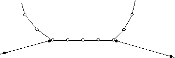

# 12.9 在Abaqus/Explicit中定义接触

Abaqus/Explicit提供了两种用于模拟接触相互作用的算法。通用（"自动"）接触算法允许非常简单地定义接触，对所涉及表面的类型几乎没有限制（参见《Abaqus分析用户手册》第36.4.1节"在Abaqus/Explicit中定义通用接触相互作用"）。接触对算法对所涉及表面的类型有更多限制，通常需要更仔细地定义接触；但是，它允许一些目前通用接触算法不支持的相互作用行为（参见《Abaqus分析用户手册》第36.5.1节"在Abaqus/Explicit中定义接触对"）。通用接触相互作用通常通过为Abaqus/Explicit自动定义的默认基于元素的表面指定自接触来定义，该表面包含模型中的所有实体。为了细化接触区域，可以包含或排除特定的表面对。接触对相互作用通过指定每个可能相互作用的单独表面对来定义。

## 12.9.1 Abaqus/Explicit接触公式

Abaqus/Explicit中的接触公式包括约束施加方法、接触面权重分配和滑动公式。

**约束施加方法**

对于通用接触，Abaqus/Explicit使用罚接触方法施加接触约束，该方法在当前构型中搜索节点-面穿透和边-边穿透。接触力与穿透距离之间的罚刚度由Abaqus/Explicit自动选择，以使对时间增量的影响最小，同时穿透不明显。

接触对算法默认使用运动学接触公式，该公式使用预测/校正方法精确满足接触条件。增量首先在假设不发生接触的情况下进行。如果在增量结束时存在过盈接触，则修改加速度以获得满足接触约束的校正构型。运动学接触使用的预测/校正方法在《Abaqus分析用户手册》第38.2.3节"Abaqus/Explicit中的接触约束施加方法"中有更详细的讨论；该方法的一些局限性在《Abaqus分析用户手册》第39.2.2节"使用接触对进行接触建模的常见困难"中讨论。

接触对的法向接触约束可以选择使用罚接触方法施加，该方法可以模拟运动学方法无法处理的一些接触类型。例如，罚方法允许模拟两个刚性表面之间的接触（当两个表面都是解析刚性表面时除外）。当使用罚接触公式时，在穿透点对主从节点施加大小等于罚刚度乘以穿透距离的相等且相反的接触力。罚刚度由Abaqus/Explicit自动选择，类似于通用接触算法使用的罚刚度。可以通过指定罚比例因子或"软化"接触关系来覆盖面对面接触相互作用的罚刚度。

**接触面权重分配**

在纯主从方法中，一个表面是主表面，另一个是从表面。当两个实体发生接触时，检测穿透，并根据约束施加方法（运动学或罚）施加接触约束。纯主从权重分配（无论约束施加方法如何）只会阻止从节点穿透主面。主节点穿透从表面可能会未被检测到（如图12-52所示），除非从表面上的网格足够细化。

**图12-52** 纯主从接触中主节点穿透从表面。

平衡主从接触简单地应用纯主从方法两次，在第二次传递时反转表面。以表面1作为从表面获得一组接触约束，以表面2作为从表面获得另一组约束。加速度校正或力通过取两个计算的加权平均值获得。对于运动学平衡主从接触，进行第二次校正以解决任何剩余的穿透，如《Abaqus分析用户手册》第38.2.2节"接触对在Abaqus/Explicit中的接触公式"中所述。当使用运动学顺应性时的平衡主从接触约束如图12-53所示。

**图12-53** 使用运动学顺应性的平衡主从接触约束。

平衡方法最大程度地减少接触实体的穿透，因此在大多数情况下提供更准确的结果。

通用接触算法尽可能使用平衡主从权重分配；纯主从权重分配用于涉及基于节点表面的通用接触相互作用，这些表面只能作为纯从表面。对于接触对算法，Abaqus/Explicit将根据所涉及的两个表面的性质和所使用的约束施加方法决定给定接触对使用哪种权重分配类型。

**滑动公式**

当定义面对面接触相互作用时，必须决定相对滑动的大小是小还是有限。默认（也是通用接触相互作用的唯一选项）是更通用的有限滑动公式。如果两个表面的相对运动小于单元面特征长度的一小部分，则小滑动公式是合适的。在适用时使用小滑动公式可以提高分析效率。
