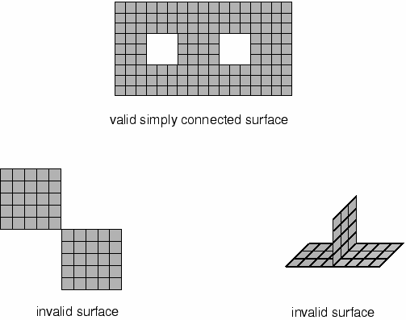
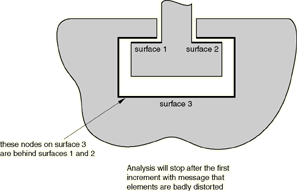
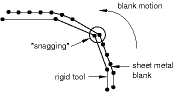
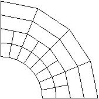

# 12.10 Abaqus/Explicit 中的建模注意事项

我们将讨论以下建模注意事项：表面的正确定义、过度约束、网格细化以及初始过盈。

## 12.10.1 正确的表面定义

在为每种接触算法定义表面时，必须遵循某些规则。通用接触算法对可参与接触的表面类型限制较少；但是，二维表面和基于节点的表面只能与接触对算法一起使用。

**连续表面**

通用接触算法使用的表面可以跨越多个未连接的主体。多个表面面元可以共享一条公共边。相比之下，接触对算法使用的所有表面必须是连续且单连通的。连续性要求对接触对算法的有效或无效表面定义有以下含义：

- 在二维中，表面必须是具有两个终端的简单非相交曲线或闭合环。图12-54显示了在二维中有效和无效表面的示例。

  **图12-54** 接触对算法中有效和无效的二维表面。

  

- 在三维中，属于有效表面的单元面的边可以位于表面的周长上，也可以与其他面共享一条边。形成接触表面的两个单元面不能在仅在共享节点处连接；它们必须沿公共单元边连接。一个单元边不能被多个表面面元共享。图12-55说明了在三维中有效和无效的表面。

  **图12-55** 接触对算法中有效和无效的三维表面。

  

- 此外，还可以定义三维双侧表面。在这种情况下，壳单元、膜单元或刚性单元的两侧都包含在同一表面定义中，如图12-56所示。

  **图12-56** 有效的双侧表面。

  

**扩展表面**

Abaqus/Explicit不会自动将表面扩展到用户定义的表面周长之外。如果一个表面的节点与另一个表面接触，并且沿表面滑动直到到达边缘，它可能会"从边缘掉落"。这种行为可能特别麻烦，因为节点稍后可能从表面背面重新进入，从而违反运动约束并导致该节点产生较大的加速度跳跃。因此，良好的建模做法是将表面略微扩展到实际会接触的区域之外。一般来说，我们建议完全覆盖每个接触体上的表面；额外的计算开销很小。

图12-57显示了两个由砖单元构成的简单箱体。

**图12-57** 表面周长。

上面的箱体仅在箱体顶面定义了接触表面。虽然这是Abaqus/Explicit中允许的表面定义，但"原始边缘"之外没有扩展可能会产生问题。在下面的箱体中，表面绕过侧壁一定距离，从而超出平面上表面。如果接触仅发生在箱体顶面，这种扩展的表面定义可以通过使任何接触节点远离接触表面背面来最大程度地减少接触问题。

**网格接缝**

具有相同坐标的两个节点（双节点）会在看似连续的有效表面中产生接缝或裂缝，如图12-58所示。沿表面滑动的节点可能穿过此裂缝并滑到接触表面后面。一旦检测到穿透，可能会产生较大的非物理加速度修正。在Abaqus/CAE中定义的表面永远不会有两个节点位于相同坐标处；但是，导入的网格可能具有双节点。可以通过在可视化模块中绘制模型的自由边来检测网格接缝。任何不属于所需周长的接缝都可能是双节点区域。

**图12-58** 双节点网格示例。

**完整的表面定义**

图12-59显示了两个部件之间简单连接的三维模型。图中所示的接触定义不足以对该连接进行建模，因为表面不能完整地描述几何体。在分析开始时，表面3上的一些节点发现它们位于表面1和2的"背面"。图12-60显示了该连接的适当表面定义。表面是连续的，描述了接触体的完整几何形状。

**图12-59** 表面定义错误示例。

**图12-60** 正确的表面定义。

**高度翘曲的表面**

通用接触算法不需要对翘曲面进行特殊处理。但是，当与接触对算法一起使用的表面包含高度翘曲的面元时，必须使用比表面不包含高度翘曲面元时更昂贵的跟踪方法。为了尽可能保持解决方案的效率，Abaqus会监控表面的翘曲程度，并在表面变得过于翘曲时发出警告；如果相邻面元的法线方向相差超过20度，Abaqus会发出警告消息。一旦表面被认为是高度翘曲的，Abaqus会从更有效的接触搜索方法切换到更精确的搜索方法，以应对高度翘曲表面带来的困难。

为提高效率，Abaqus不会在每个增量中检查高度翘曲的表面。刚性表面仅在步骤开始时检查高翘曲，因为刚性表面在分析过程中不会改变形状。可变形表面默认每20个增量检查一次高翘曲；但是，某些分析可能具有快速增加翘曲的表面，使得默认的20增量频率检查不足。可以将翘曲检查的频率更改为所需的增量数。一些表面翘曲小于20度的分析也可能需要与高度翘曲表面相关的更精确的接触搜索方法。可以重新定义表示高翘曲的角度。

**刚性单元离散化**

复杂的刚性表面几何形状可以使用刚性单元进行建模。Abaqus/Explicit中的刚性单元不平滑；它们按用户定义的方式保持精确的棱面。未经平滑处理的表面的优点是用户定义的表面与Abaqus使用的表面完全相同；缺点是棱面表面需要更高的网格细化精度才能准确表示平滑体。一般来说，使用大量刚性单元来定义刚性表面不会显著增加CPU成本。但是，大量刚性单元确实会显著增加内存开销。

用户必须确保刚性体上任何曲线几何形状的离散化是足够的。如果刚性体离散化过于粗糙，可变形体上接触的节点可能会"挂住"，导致错误的结果，如图12-61所示。

**图12-61** 粗糙刚性体离散化的潜在影响。

挂在尖锐角落的节点可能在沿刚性表面继续滑动之前被困住一段时间。一旦有足够的能量释放以滑过尖锐角落，节点将动态弹回然后接触相邻面元。这种运动会导致解算结果有噪声。刚性表面细化程度越高，接触从属节点的运动就越平滑。通用接触算法包含一些数值特征修圆功能，可以防止节点挂住成为离散刚性表面问题。此外，接触约束的罚函数 enforcement会减少挂住发生的趋势。对于形状为拉伸轮廓或旋转表面的刚性体，通常应将解析刚性表面与接触对算法一起使用。

## 12.10.2 模型的过度约束

正如不应在同一节点定义多个相互冲突的边界条件一样，通常也不应在同一点定义多点约束和用运动学方法强制执行的接触条件，因为它们可能产生相互冲突的运动学约束。除非约束完全相互正交，否则模型将被过度约束；结果解算将有相当大的噪声，因为Abaqus/Explicit试图满足相互冲突的约束。在同一节点上起作用的罚函数接触约束和多点约束不会产生冲突，因为罚函数约束的执行不像多点约束那样严格。

## 12.10.3 网格细化

对于接触以及所有其他类型的分析，随着网格的细化，解决方案会得到改善。对于使用纯主从方法的接触分析，确保从属表面有足够的细化尤为重要，这样主表面面元就不会过度穿透从属表面。平衡主从方法不需要在从属表面有高网格细化就能获得适当的接触柔顺性。网格细化通常在变形体与刚性体之间的纯主从接触中最重要；在这种情况下，变形体始终是纯从属表面，因此必须细化到足以与刚性体上的任何特征相互作用。图12-62显示了一个示例，说明了当从属表面的离散化相对于主表面特征的尺寸较差时可能发生的穿透。如果变形表面更加细化，刚性表面的穿透将不那么严重。

**图12-62** 从属表面离散化不充分的示例。

**绑定约束**

绑定约束防止最初接触的表面相互穿透、分离或相对滑动。因此，它是网格细化的简单方法。由于两个表面之间存在的任何间隙（无论多小）都将导致节点未绑定到相对边界，因此必须调整节点以确保两个表面在分析开始时完全接触。

绑定约束公式约束平动自由度，并可选择约束转动自由度。当将绑定接触与结构单元一起使用时，必须确保任何未约束的转动不会引起问题。

## 12.10.4 初始接触过盈

Abaqus/Explicit会自动调整接触表面上节点的未变形坐标，以消除任何初始过盈。当使用平衡主从方法时，两个表面都会被调整；当使用纯主从方法时，仅调整从属表面。为消除过盈而调整表面所产生的位移不会在第一步中定义的接触产生任何初始应变或应力。当存在相互冲突的约束时，初始过盈可能无法通过重新定位节点完全解决。在这种情况下，当使用接触对算法时，分析开始时可能会产生严重的网格扭曲。通用接触算法将任何未解决的初始穿透存储为偏移量，以避免大的初始加速度。

在后续步骤中，消除初始过盈的任何节点调整都会产生应变，这些应变通常会导致严重的网格扭曲，因为整个节点调整发生在一个非常短暂的增量中。当使用运动学约束方法时尤其如此。例如，如果一个节点的过盈量为1.0×10⁻³米，增量时间为1.0×10⁻⁷秒，则为纠正过盈而施加在该节点上的加速度为2.0×10¹¹米/秒²。如此大的加速度施加在单个节点上通常会产生关于变形速度超过材料波速的警告，以及在几个增量后关于严重网格扭曲的警告，因为大加速度已经显著变形了相关单元。即使是非常轻微的初始过盈也可能对运动学接触引起极大的加速度。一般来说，在第二步及以后，您定义的任何新接触表面都不应有过盈是很重要的。

图12-63显示了两个接触表面的初始过盈的常见情况。接触表面上的所有节点恰好位于同一圆弧上；但是由于内表面的网格比外表面更细，并且单元边是线性的，内表面上的一些节点最初会穿透外表面。

**图12-63** 两个接触表面的原始过盈。

假设使用纯主从方法，图12-64显示了Abaqus/Explicit施加在从属表面节点上的初始无应变位移。在没有外部载荷的情况下，该几何形状是无应力的。如果使用默认的平衡主从方法，则会获得一组不同的初始位移，结果网格并非完全无应力。

**图12-64** 修正后的接触表面。

