# 12.11 Abaqus/Explicit实例：电路板跌落试验

---

**摘要**

在这个例子中，您将研究安装在可压碎泡沫包装中的电路板以一定角度跌落到刚性表面上的行为。您的目标是评估泡沫包装是否足以防止电路板在从1米高度跌落时损坏。您将使用Abaqus/Explicit中的通用接触功能来模拟不同组件之间的相互作用。[图12-65](#图-12-65)显示了电路板和泡沫包装的尺寸（毫米）以及材料属性。

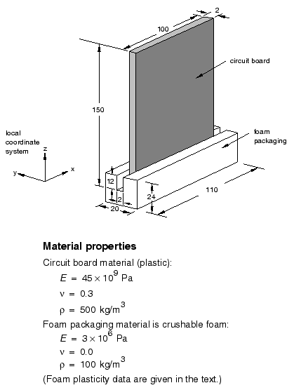

**图 12-65** 尺寸（毫米）和材料属性。

---

## 12.11.1 前处理——使用Abaqus/CAE创建模型

使用Abaqus/CAE为该模拟创建模型。Abaqus提供了复制此问题完整分析模型的脚本。如果您遇到跟随以下说明的困难，或者您想检查您的工作，请运行这些脚本。脚本位于以下位置：

- 此示例的Python脚本在["电路板跌落试验"部分A.14](#)中提供。如何获取脚本并在Abaqus/CAE中运行的说明在[附录A "示例文件"](#)中给出。
- 此示例的插件脚本位于Abaqus/CAE插件工具集中。要从Abaqus/CAE运行脚本，请选择**插件→Abaqus→入门**；高亮**电路板跌落试验**；然后点击**运行**。有关入门插件的更多信息，请参阅Abaqus/CAE用户指南的["运行Abaqus入门示例"部分82.1](#)。

如果您无法访问Abaqus/CAE或其他预处理器，可以手动创建此问题所需的输入文件，如[Abaqus/Explicit示例：电路板跌落试验 Getting Started with Abaqus：Keywords Edition第12.10节](#)中所讨论。

### 定义模型几何

您将创建三个分别代表包装、电路板和地板的零件。芯片将使用离散点质量表示。您还将创建许多基准点来帮助定位零件实例和点质量。

#### 定义包装几何

1. 包装是一个三维实体结构。创建一个三维、可变形零件，使用拉伸实体基特征来表示包装；将零件命名为`Packaging`。使用约`0.1`的零件大小，并绘制一个0.02 m × 0.024 m的矩形作为轮廓。将`0.11` m指定为拉伸深度。

2. 从主菜单栏中选择**形状→切割→拉伸**来创建包装中的切口，电路板将放置在其中。
   - 选择包装的左端作为拉伸切割的平面。选择包装轮廓上的一条垂直线作为草图平面上的垂直方向且在右侧。
   - 在草图器中，使用垂直构造线工具创建一条通过包装中心的垂直构造线。对构造线应用固定约束。
   - 绘制[图12-66](#图-12-66)所示的切口轮廓。使用**对称**约束将切口关于构造线居中，并编辑切口轮廓的尺寸，使其宽度为0.002 m，延伸到包装中0.012 m的距离。


**图 12-66** 包装中切割的轮廓（网格间距加倍）。

   - 在完成草图后出现的**编辑切割拉伸**对话框中，选择**贯穿全部**作为终止条件，并选择表示切入包装的箭头方向。

3. 在切割底部面的中心创建一个基准点，如[图12-67](#图-12-67)所示。此点将用于相对于包装定位电路板。


**图 12-67** 包装切割中心的基准点。

   - 从主菜单栏中选择**工具→基准**。
   - 出现**创建基准**对话框。接受**点**作为基准类型和**两点之间的中点**作为方法的默认选择。
   - 选择切割底部中心两端的两个点作为创建基准点的两个点。
   - Abaqus/CAE创建如[图12-67](#图-12-67)所示的基准点。

#### 定义电路板几何

1. 电路板可以建模为一个薄的平板，上面附有芯片。创建一个三维、可变形平面壳来表示电路板；将零件命名为`Board`。使用约`0.5`的零件大小，并绘制一个0.100 m × 0.150 m的矩形作为轮廓。

2. 创建[图12-68](#图-12-68)所示的三个基准点。这些点将用于定位电路板上的芯片。


**图 12-68** 用于相对于电路板定位芯片的基准点。括号中的数字是(x, y)坐标（米），基于电路板左下角的局部原点。

   - 从主菜单栏中选择**工具→基准**。
   - 出现**创建基准**对话框。接受**点**作为基准类型，并选择**从点偏移**作为方法。
   - 选择电路板的左下角作为偏移的点，并输入[图12-68](#图-12-68)所示其中一个点的坐标。
   - 重复步骤c创建其他两个基准点。

#### 定义地板

1. 电路板将撞击的表面实际上是刚性的。创建一个三维、离散刚性平面壳来表示地板；将零件命名为`Floor`。使用约`0.5`的零件大小。刚性表面应该足够大，以防止任何可变形物体从边缘掉落。

2. 绘制一个0.2 m × 0.2 m的正方形作为轮廓。为了简化模型 assembly中零件的定位，确保表面中心对应于草图器中的点(0, 0)。这也对应于全局坐标系的原点。

3. 在零件中心分配一个参考点。

### 定义材料和截面属性

电路板假定由PCB弹性材料制成，弹性模量为45 × 10⁹ Pa，泊松比为0.3。板的质心密度为500 kg/m³。定义一种名为`PCB`的材料，具有这些属性。

泡沫包装材料将使用可压碎泡沫塑性模型进行建模。包装的弹性性能包括3 × 10⁶ Pa的弹性模量和0.0的泊松比。包装的材料密度为100 kg/m³。定义一种名为`Foam`的材料，具有这些属性；不要关闭材料编辑器。

可压碎泡沫在p-q（压力应力-米泽斯等效应力）平面中的屈服面如[图12-69](#图-12-69)所示。

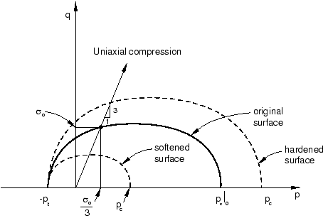

**图 12-69** 可压碎泡沫模型：p-q平面中的屈服面。

初始屈服行为由单轴压缩初始屈服应力与静水压缩初始屈服应力的比值控制，和静水拉伸屈服应力与静水压缩初始屈服应力的比值控制。在这个问题中，我们选择第一个数据项为1.1，第二个数据项（以正值给出）为0.1。

材料模型定义中也包括硬化效应。[表12-4](#表-12-4)总结了屈服应力-塑性应变数据。

**表 12-4** 可压碎泡沫模型的屈服应力-塑性应变数据。

| 单轴压缩屈服应力 (Pa) | 塑性应变 |
|---|---|
| 0.22000E6 | 0.0 |
| 0.24651E6 | 0.1 |
| 0.27294E6 | 0.2 |
| 0.29902E6 | 0.3 |
| 0.32455E6 | 0.4 |
| 0.34935E6 | 0.5 |
| 0.37326E6 | 0.6 |
| 0.39617E6 | 0.7 |
| 0.41801E6 | 0.8 |
| 0.43872E6 | 0.9 |
| 0.45827E6 | 1.0 |
| 0.49384E6 | 1.2 |
| 0.52484E6 | 1.4 |
| 0.55153E6 | 1.6 |
| 0.57431E6 | 1.8 |
| 0.59359E6 | 2.0 |
| 0.62936E6 | 2.5 |
| 0.65199E6 | 3.0 |
| 0.68334E6 | 5.0 |
| 0.68833E6 | 10.0 |

可压碎泡沫硬化模型遵循[图12-70](#图-12-70)所示的曲线。


**图 12-70** 泡沫硬化材料数据。

为了您的方便，硬化数据保存在名为`drop-test-foam.txt`的文本文件中。在操作系统提示符下输入以下命令，使用Abaqus `fetch`实用程序将文件复制到您的本地目录：

```
abaqus fetch job=drop*.txt
```

在材料编辑器中，选择**机械→塑性→可压碎泡沫**。输入上面给出的屈服应力比。点击**子选项**，并选择**泡沫硬化**。选择子选项编辑器中的第一个单元格，然后点击鼠标按钮3。从出现的菜单中选择**从文件读取**。选择名为`drop-test-foam.txt`的文件，读取[表12-4](#表-12-4)所示的硬化数据。

定义一个名为`BoardSection`的均匀壳截面，引用材料`PCB`。指定厚度为`0.002` m，并将此截面定义分配给零件`Board`。定义一个名为`FoamSection`的均匀实体截面，引用材料`Foam`。将此截面定义分配给零件`Packaging`。

对于电路板，在与板边缘对齐的纵向和横向方向上输出应力结果是最有意义的。因此，您需要为电路板网格指定一个局部材料方向。

#### 为电路板指定材料方向

1. 在模型树中，双击**零件**容器下的**Board**。

2. 定义用于定向的基准坐标系：
   - 从主菜单栏中选择**工具→基准**。
   - 选择**坐标系**作为类型，选择**2条线**作为方法。
   - 在出现的**创建基准坐标系**对话框中，选择矩形坐标系，点击**继续**。
   - 在视图区中，选择电路板的底部水平边缘作为局部x轴，选择电路板的右侧垂直边缘位于X-Y平面中。
   - 基准坐标系以黄色出现在视图区中。

3. 从**属性**模块的主菜单栏中，选择**分配→材料方向**。在视图区中选择电路板。选择基准坐标系作为坐标系。在材料方向编辑器中，选择**轴3**作为壳表面法线，选择**无**作为关于该轴的附加旋转。
   - 材料方向出现在视图区中的板上。

### 创建装配

在模型树中，双击**装配**容器下的**实例**，创建地板的依赖实例。

电路板将以一定角度跌落；最终模型装配如[图12-71](#图-12-71)所示。您将使用**装配**模块中的定位工具首先定位包装；然后相对于包装定位电路板。最后，您将在电路板的每个基准点位置创建一个参考点来代表芯片。

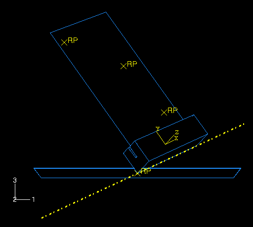

**图 12-71** 完整的电路板装配。

#### 定位包装

1. 从**装配**模块的主菜单栏中，选择**工具→基准**创建额外的基准点，帮助您定位包装。
   - 选择**点**作为类型，选择**输入坐标**作为方法。
   - 创建两个分别位于`(0, 0, 0)`和`(0.5, 0.707, 0.25)`的基准点。
   - 点击自动适应工具以在视图区中看到两个点。

2. 在**创建基准**对话框中，选择**轴**作为类型，选择**2点**作为方法。创建由前一步创建的两个基准点定义的基准轴，选择点(0.5, 0.707, 0.25)作为基准轴定义中的第一个点。

   > **提示：** 使用**选择**工具栏将您的选择限制为**基准**。

3. 实例化包装。

4. 约束包装，使底边与基准轴对齐。
   - 从主菜单栏中，选择**约束→边对边**。
   - 选择[图12-72](#图-12-72)所示的包装边缘作为可移动实例的直线边缘。

   > **提示：** 要获得模型的更好视图，从主菜单栏中选择**视图→指定**，并选择**视点**作为方法；为视点向量输入`(-1, -1, 1)`，为向上向量输入`(0, 0, 1)`。


**图 12-72** 在可移动实例上选择一条直线边缘。

   - 选择基准轴作为固定实例。
   - 如有必要，在提示区域点击**翻转**以反转包装上箭头的方向；当箭头指向相反方向时（如[图12-72](#图-12-72)所示），点击**确定**。

   > **提示：** 您可能需要缩小并旋转模型以查看基准轴上的箭头。此箭头的方向取决于您最初定义轴的方式；如果轴上的箭头指向与图中相反的方向，则包装上的箭头也应与图相反。

   Abaqus/CAE如[图12-73](#图-12-73)所示定位包装。


**图 12-73** 位置1：将包装的底边约束到沿基准轴。

   > **注意：** Abaqus/CAE将位置约束存储为装配的特征；如果您在定位装配时出错，可以删除位置约束。只需在模型树中**装配**容器下的**位置约束**项目列表中，在要删除的约束上点击鼠标按钮3，并从出现的菜单中选择**删除**。

5. 创建第三个基准点位于`(-0.5, 0.707, -0.5)`，并再次点击自动适应工具。

6. 在**创建基准**对话框中，选择**平面**作为类型，选择**线和点**作为方法。创建由早期创建的基准轴和上一步创建的基准点定义的基准平面。

7. 约束包装，使底面位于基准平面上。
   - 从主菜单栏中，选择**约束→面对齐**。
   - 选择[图12-74](#图-12-74)所示的包装面作为可移动实例的面。


**图 12-74** 在可移动实例上选择一个面。

   - 选择基准平面作为固定实例。
   - 如有必要，在提示区域点击**翻转**；当两个箭头指向相同方向时，点击**确定**。
   - 接受距固定平面的默认距离`0.0`。

8. 最后，约束包装使其中心与地板接触。
   - 从主菜单栏中，选择**约束→重合点**。
   - 选择包装的最低顶点作为可移动实例上的点，选择地板上的参考点作为固定实例上的点。
   - Abaqus/CAE如[图12-75](#图-12-75)所示定位包装。


**图 12-75** 包装相对于地板的最终位置。

9. 现在，将地板略微向下平移，以确保包装和地板之间没有初始过盈。
   - 将相对位置约束转换为绝对约束以避免冲突。从主菜单栏中，选择**实例→转换约束**。在视图区中选择包装，并在提示区域点击**完成**。
   - 从主菜单栏中，选择**实例→平移**。
   - 在视图区中选择地板。
   - 输入`(0.0, 0.0, 0.0)`作为平移向量的起点，输入`(0.0, 0.0, -0.0001)`作为平移向量的终点。
   - 点击**确定**接受新位置。

#### 定位电路板

1. 实例化电路板。在**创建实例**对话框中，勾选**从其他实例自动偏移**。

2. 从主菜单栏中，选择**约束→平行面**。选择板的面作为可移动实例上的面；选择包装长边上的面作为固定实例上的面。如有必要，点击**翻转**以确保两个面上的箭头指向[图12-76](#图-12-76)所示的方向；点击**确定**完成约束。

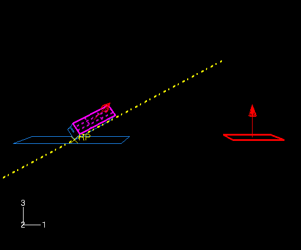

**图 12-76** 电路板的平行面约束。

3. 从主菜单栏中，选择**约束→平行边**。选择板的顶部边缘作为可移动实例上的边缘。选择沿包装长度的边缘作为固定实例上的边缘。如有必要，点击**翻转**以确保两个边缘上的箭头指向相同方向，如[图12-77](#图-12-77)所示；点击**确定**完成约束。

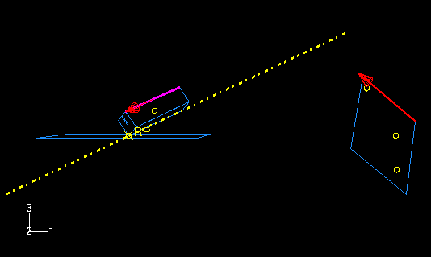

**图 12-77** 电路板的平行边约束。

4. 从主菜单栏中，选择**约束→重合点**。选择板底部的中点作为可移动实例上的点。选择包装切割中心的基准点作为固定实例上的点。

   > **提示：** 使用**选择**工具栏将您的选择限制为**基准**。

   [图12-78](#图-12-78)显示了电路板的最终位置。电路板和包装中的槽厚度相同（2 mm），因此两个物体之间配合紧密。

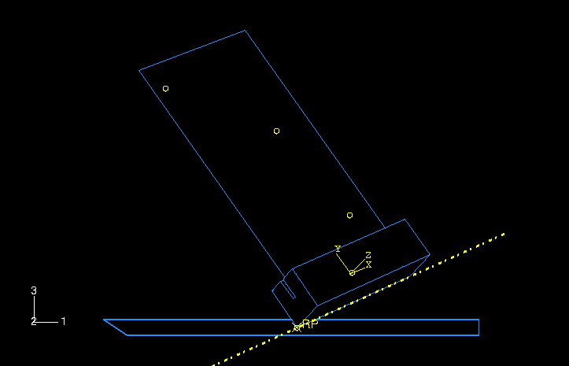

**图 12-78** 电路板的最终位置。

#### 创建芯片

在板的三个基准点位置中的每一个创建一个参考点来代表每个芯片。这些参考点中的每一个稍后将分配质量属性。要创建参考点，从**装配**模块的主菜单栏中选择**工具→参考点**。

一旦创建了参考点，装配就完成了。

在继续之前，创建以下几何集，您将使用它们来指定输出请求和质量属性：

- `TopChip` 用于顶部芯片的参考点
- `MidChip` 用于中间芯片的参考点
- `BotChip` 用于底部芯片的参考点
- `BotBoard` 用于板的底部边缘

### 定义步骤和请求输出

创建一个名为`Drop`的单一动态、显式步骤；将时间周期设置为`0.02` s。接受默认的历史和场输出请求。此外，为每个芯片请求每7 × 10⁻⁵ s的垂直位移（**U3**）、速度（**V3**）和加速度（**A3**）历史输出。

> **提示：** 为第一个芯片定义历史输出请求；使用**历史输出请求管理器**复制请求并编辑域以为其他芯片定义请求。

为集合`BotBoard`的顶面（第5截面点）的对数应变分量（`LE11`、`LE22`和`LE12`）以及主对数应变（LEP）每7 × 10⁻⁵ s请求历史输出。

### 定义接触

Abaqus/Explicit中的任何接触算法都可以用于此问题。然而，由于通用接触不同，接触对算法中涉及的表面不能跨越多个物体，使用接触对算法定义接触会更加麻烦。我们在此示例中使用通用接触算法来展示对于更复杂几何形状的接触定义的简单性。

定义名为`Fric`的接触相互作用属性。在**编辑接触属性**对话框中，选择**机械→切向行为**，选择**罚函数**作为摩擦公式，并在表中指定摩擦系数`0.3`。接受所有其他默认值。

在`Drop`步骤中创建名为`All`的**通用接触（显式）**相互作用。在**编辑相互作用**对话框中，接受**所有*与自身**作为**接触域**的默认选择，以指定由Abaqus/Explicit自动定义的默认全包含表面的自接触。此方法是针对整个模型在Abaqus/Explicit中定义接触的最简单方式。选择`Fric`作为**全局属性分配**，然后点击**确定**。

### 定义绑定约束

您将使用绑定约束将芯片附着到板上。首先为电路板定义一个名为`Board`的表面。选择提示区域中的**两侧**以指定表面是双侧的。在模型树中，双击**约束**容器；定义一个名为`TopChip`的绑定约束。选择`Board`作为主表面，`TopChip`作为从节点区域。在**编辑约束**对话框中关闭**绑定旋转自由度（如果适用）**，因为只考虑芯片质量的影响，然后点击**确定**。模型上出现黄色圆圈来表示约束。以类似方式为中间和底部芯片创建名为`MidChip`和`BotChip`的绑定约束。

### 为芯片分配质量属性

您将为每个芯片分配一个点质量。为此，在模型树中展开**装配**容器下的**工程特征**。在出现的列表中，双击**惯性**。在**创建惯性**对话框中，输入名称`MassTopChip`并点击**继续**。选择集合**TopChip**，并为其分配质量`0.005` kg。对剩余两个芯片重复此过程。

### 指定载荷和边界条件

约束地板上的参考点所有方向；例如，您可以规定**ENCASTRE**边界条件。

有两种方法可以模拟电路板从1米高度跌落。您可以将对电路板和泡沫建模在距地板1米的高度，并允许Abaqus/Explicit计算重力影响下的运动；然而，由于完成"自由落体"部分模拟所需的增量数量很大，这种方法不切实际。更有效的方法是将电路板和包装建模在非常接近地板表面的初始位置（如您在此问题中所做的那样），并指定初始速度4.43 m/s来模拟1米跌落。在初始步骤中创建一个预定义场，为板、芯片和包装指定初始速度**V3** = `-4.43` m/s。

### 网格划分模型和定义作业

在板的长度和高度上播种10个单元。按[图12-79](#图-12-79)所示为包装边缘播种。


**图 12-79** 包装网格的边缘种子。

包装网格在撞击角处太粗，无法提供高度准确的结果；然而，它足以进行低成本初步研究。使用扫掠网格技术（带中轴算法），使用C3D8R单元对包装进行网格划分，使用S4R单元对板进行网格划分（来自Abaqus/Explicit库）。对包装网格使用增强沙漏控制来控制沙漏效应。为地板指定1.0的全局种子，并使用一个Abaqus/Explicit R3D4单元对其进行网格划分。

> **注意：** 建议的网格密度超过了Abaqus学生版的模型大小限制。如果使用此产品，请沿泡沫包装的长度指定12个单元。

创建名为`Circuit`的作业，并给出以下描述：`Circuit board drop test`。应使用双精度以最小化解中的噪声。在作业编辑器的**精度**标签页面中，选择**双精度-仅分析**作为Abaqus/Explicit精度。将模型保存到模型数据库文件，并提交作业进行分析。监控求解进度；纠正检测到的任何建模错误，并调查任何警告消息的原因。

---

## 12.11.2 后处理

进入**可视化**模块，打开此作业创建的输出数据库文件（`Circuit.odb`）。

### 检查材料方向

可以从**可视化**模块中检查从方向定义获得的材料方向。

#### 绘制材料方向

1. 首先，将视图更改为更方便的设置。如果不可见，通过从主菜单栏中选择**视图→工具栏→视图**来显示**视图**工具栏。在**视图**工具栏中，选择X-Z设置。

2. 从主菜单栏中，选择**绘图→材料方向→在变形形状上**。

   电路板在模拟结束时的材料方向方向被显示。材料方向以不同颜色绘制。材料1方向为蓝色，材料2方向为黄色，3方向（如存在）为红色。

3. 要查看初始材料方向，选择**结果→步骤/帧**。在出现的**步骤/帧**对话框中，选择`Increment 0`。点击**应用**。

   Abaqus显示初始材料方向。

4. 要将显示恢复到分析结束时的结果，选择**步骤/帧**对话框中可用的最后一个增量；然后点击**确定**。

### 结果动画

您将创建变形的时间历史动画，以帮助您可视化撞击期间电路板和泡沫包装的运动和变形。

#### 创建时间历史动画

1. 在分析结束时绘制变形模型形状。

2. 从主菜单栏中，选择**动画→时间历史**。

   变形模型形状的动画开始。

3. 从主菜单栏中，选择**视图→平行**以关闭透视。

4. 在上下文栏中点击暂停按钮，在完成一个完整周期后暂停动画。

5. 在上下文栏中点击相机节点按钮，然后选择在泡沫包装角落附近的一个节点上（撞击地板的位置）。当您重新启动动画时，相机将跟随选定的节点。如果您放大该节点，它将在整个动画过程中保持在视图中。

   > **注意：** 要将相机重置为跟随全局坐标系，请在上下文栏中点击全局相机按钮。

在您观看跌落测试的变形历史时，注意泡沫何时与地板接触。您应该观察到撞击发生在分析的前4毫秒内。第二次撞击发生在约8毫秒到15毫秒之间。[图12-80](#图-12-80)显示了撞击后约4毫秒时泡沫和板的变形状态。

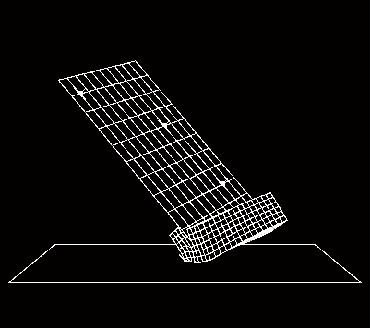

**图 12-80** 4毫秒时的变形网格。

### 绘制模型能量历史

绘制各种能量变量与时间的关系图。能量输出可以帮助您评估Abaqus/Explicit模拟是否预测了适当的响应。

#### 绘制能量历史

1. 在结果树中，在名为`Circuit.odb`的输出数据库的**历史输出**上点击鼠标按钮3。从出现的菜单中选择**筛选**。

2. 在筛选字段中，输入`*ALL*`以将历史输出限制为仅能量输出变量。

3. 选择`ALLAE`输出变量，并保存为**人工能量**。

4. 选择`ALLIE`输出变量，并保存为**内能**。

5. 选择`ALLKE`输出变量，并保存为**动能**。

6. 选择`ALLPD`输出变量，并保存为**塑性耗散**。

7. 选择`ALLSE`输出变量，并保存为**应变能**。

8. 在结果树中，展开**XYData**容器。

9. 选择所有五条曲线。点击鼠标按钮3，并从出现的菜单中选择**绘图**来查看X-Y图。

   接下来，您将自定义图表的外观；首先更改曲线的线型。

10. 打开**曲线选项**对话框。

11. 在此对话框中，为视图中显示的每条曲线应用不同的线型和厚度。

   接下来，重新定位图例，使其显示在图表内部。

12. 双击图例打开**图表图例选项**对话框。

13. 在此对话框中，切换到**区域**标签页面，并勾选**嵌入**。

14. 在视图区中，将图例拖到图表上。

   现在更改X轴标签的格式。

15. 在视图区中，双击X轴以访问**轴选项**对话框中的**X轴**选项。

16. 在此对话框中，切换到**轴**标签页面，并为X轴选择**工程**标签格式。

   能量历史如[图12-81](#图-12-81)所示。


**图 12-81** 能量结果与时间的关系。

首先考虑动能历史。在模拟开始时，组件处于自由落体状态，动能很大。初始撞击使泡沫包装变形，从而减少动能。然后组件反弹并围绕撞击角旋转，直到泡沫包装的对侧在约8毫秒时撞击地板，进一步减少动能。

泡沫包装在撞击期间的变形导致动能向泡沫包装和电路板中的内能转移。从[图12-81](#图-12-81)我们可以看到，内能随着动能的减少而增加。事实上，内能由弹性能和塑性耗散能组成，两者也在[图12-81](#图-12-81)中绘制。弹性能达到峰值然后回落，因为弹性变形恢复，但塑性耗散能继续上升，因为泡沫被永久变形。

另一个重要的能量输出变量是人工能量，它是此分析中内能的很大一部分（约15%）。到目前为止，您应该知道，如果人工能量能够减少到总内能的较小比例，解决方案的质量将会提高。

**是什么导致此问题中的人工应变能很高？**

单节点接触——如此例中的角落撞击——可能导致沙漏，特别是在粗网格中。减少人工应变能的两种常见策略是细化网格或圆化撞击角。然而，对于当前的练习，我们将继续使用原始网格，认识到改进网格将带来改进的解决方案。

### 评估芯片处的加速度历史

我们希望检查的下一个结果是附着在电路板上的芯片的加速度。撞击期间的过大加速度可能会损坏芯片。因此，为了评估泡沫包装的合需要性，我们需要绘制三个芯片的加速度历史。由于我们期望加速度在3方向最大，我们将绘制变量`A3`。

#### 绘制加速度历史

1. 在结果树中，按`*A3*`筛选**历史输出**容器，选择集合`TopChip`、`MidChip`和`BotChip`中节点的加速度`A3`；并绘制三个X-Y数据对象。

   X-Y图出现在视图区中。如前所述，自定义图表外观以获得类似于[图12-82](#图-12-82)的图表。

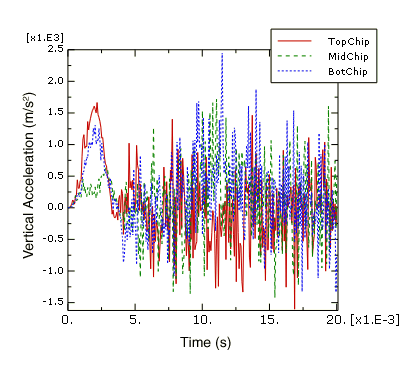

**图 12-82** 三个芯片在Z方向的加速度。

接下来，我们将评估底部芯片记录的加速度数据的合理性。为此，我们将对加速度数据进行积分以计算芯片速度和位移，并将结果与Abaqus/Explicit直接记录的速度和位移数据进行比较。

#### 积分底部芯片加速度历史

1. 在结果树中，按`*BOTCHIP*`筛选**历史输出**容器，选择集合`BotChip`中节点加速度`A3`；并将数据保存为`A3`。

2. 在结果树中，双击**XYData**；然后在**创建XY数据**对话框中选择**对XY数据操作**。点击**继续**。

3. 在**对XY数据操作**对话框中，对加速度`A3`积分以计算速度，并减去初始速度大小4.43 m/s。对话框顶部的表达式应显示为：

   ```
   integrate ( "A3" ) - 4.43
   ```

4. 点击**绘制表达式**来绘制计算的速度曲线。

5. 在结果树中，在集合`BotChip`中节点的速度`V3`历史输出上点击鼠标按钮3；并从出现的菜单中选择**添加到绘图**。

   X-Y图出现在视图区中。如前所述，自定义图表外观以获得类似于[图12-83](#图-12-83)的图表。您通过积分加速度数据产生的速度曲线可能与此处显示的不同。原因将在后面讨论。


**图 12-83** 底部芯片在Z方向的速度。

6. 在**对XY数据操作**对话框中，再次对加速度`A3`积分以计算芯片位移。对话框顶部的表达式应显示为：

   ```
   integrate ( integrate ( "A3" ) - 4.43 )
   ```

7. 点击**绘制表达式**来绘制计算的位移曲线。

   注意Y值类型是长度。为了使用与分析期间记录的位移输出相同的Y轴绘制计算的位移，我们必须保存X-Y数据并将Y值类型更改为位移。

8. 点击**另存为**将计算的位移曲线保存为`U3-from-A3`。

9. 在结果树的**XYData**容器中，在`U3-from-A3`上点击鼠标按钮3；并从出现的菜单中选择**编辑**。

10. 在**编辑XY数据**对话框中，选择**位移**作为Y值类型。

11. 在结果树中，双击`U3-from-A3`以使用位移Y值类型重新创建计算的位移图。

12. 在结果树中，在集合`BotChip`中节点的位移`U3`历史输出上点击鼠标按钮3；并从出现的菜单中选择**添加到绘图**。

   X-Y图出现在视图区中。如前所述，自定义图表外观以获得类似于[图12-84](#图-12-84)的图表。同样，您通过积分加速度数据产生的曲线可能与此处显示的不同。原因将在后面讨论。

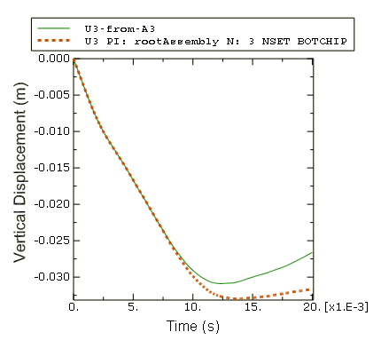

**图 12-84** 底部芯片在Z方向的位移。

**为什么通过积分加速度数据计算的速度和位移曲线与分析期间记录的速度和位移不同？**

在此示例中，加速度数据已被一种称为混叠的现象损坏。混叠是一种数据损坏形式，当信号（如分析结果）在一系列离散时间点被采样，但保存的数据点不足以正确描述信号时会发生。混叠现象可以通过数字信号处理（DSP）方法解决，其基本原则是奈奎斯特采样定理（也称为香农采样定理）。采样定理要求以大于信号最高频率两倍的速率对信号进行采样。因此，给定采样率可以描述的最高频率是该速率的一半（奈奎斯特频率）。以高于采样率奈奎斯特频率的大振幅振荡频率对信号进行采样（存储）可能会因混叠而产生显著失真的结果。在此示例中，芯片加速度每0.07毫秒采样一次，这是14.3 kHz的采样率（采样率是样本大小的倒数）。记录的混叠数据，因为芯片加速度响应具有高于7.2 kHz（采样率的一半）的频率内容。

### 正弦波的混叠

为了更好地理解混叠如何扭曲数据，考虑以各种采样率采样的1 kHz正弦波，如[图12-85](#图-12-85)所示。

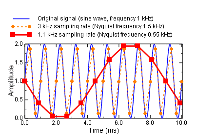

**图 12-85** 以1.1 kHz和3 kHz采样的1 kHz正弦波。

根据采样定理，必须以高于2 kHz的速率对该信号进行采样以避免混叠失真。我们将评估当采样率大于或小于此值时会发生什么。

考虑以1.1 kHz采样率记录的数据；此速率低于所需的2 kHz速率。生成的曲线表现出混叠失真，因为它是非常误导性的原始1 kHz正弦波表示。

现在考虑以3 kHz采样率记录的数据；此速率高于所需的2 kHz速率。原始信号的频率内容被捕获而没有混叠。然而，此采样率不足以非常准确地保证采样信号峰值被捕获。要保证记录的局部峰值值的95%准确性，采样率必须超过信号频率十倍或更多。

### 避免混叠

在前两个混叠示例（混叠芯片加速度和混叠正弦波）中，仅从混叠数据本身来看，混叠的发生并不明显。此外，无法从混叠数据中唯一地重建原始信号。因此，应注意避免分析结果混叠，特别是在最容易发生混叠的情况下。

对混叠的敏感性取决于多种因素，包括输出率、输出变量和模型特性。回想一下，具有高于采样率一半（奈奎斯特频率）的大振幅振荡的信号可能因混叠而显著失真。最可能具有大振幅高频内容的两个输出变量是加速度和反力。因此，这些变量最容易混叠。另一方面，位移本质上是低频的，因此不易混叠。其他结果变量，如应力和应变，介于这两个极端之间。任何降低解高频响应的模型特性都会降低分析对混叠的敏感性。例如，弹性主导的撞击问题将比包含吸能包装的电路板跌落试验更容易混叠。

确保混叠不是结果问题的最安全方法是请求每个增量的输出。当您这样做时，输出率由稳定时间增量决定，这是基于模型可能的最高频率响应。然而，请求每个增量输出通常不切实际，因为它会产生非常大的输出文件。此外，每个增量的输出通常比您需要的更多数据；当您真正感兴趣的是较低频率的结构响应时，捕获高频解噪声是没有必要的。避免混叠的另一种方法是请求较低率的输出，并使用Abaqus/Explicit实时滤波功能在实际写入输出数据库之前从结果中去除高频内容。此技术比请求每个增量输出使用更少的磁盘空间；但是，由您来确保您的输出率和滤波器选择是适当的（以避免混叠或其他与数字信号处理相关的失真）。

Abaqus/Explicit为场和历史数据提供滤波功能。滤波历史数据仅在此讨论。

---

## 12.11.3 使用输出滤波重新运行分析

在本节中，您将为电路板跌落试验分析添加实时滤波器到历史输出请求。虽然Abaqus/Explicit确实允许您基于您指定的标准创建用户定义的输出滤波器（巴特沃斯、切比雪夫I型和切比雪夫II型），但在此示例中我们将使用内置抗混叠滤波器。内置抗混叠滤波器旨在为您提供在指定输出率下记录的结果的最佳无混叠表示。为此，Abaqus/Explicit内部应用一个低通、二阶、巴特沃斯滤波器，截止频率设置为采样率的六分之一。有关更多信息，请参阅达索系统知识库中的["Abaqus历史输出滤波概述"](#)。有关定义您自己的实时滤波器的更多信息，请参阅[Abaqus分析用户指南的"输出到输出数据库"第4.1.3节中的"在Abaqus/Explicit中滤波输出和在输出上操作"](#)。

### 修改历史输出请求

当Abaqus将节点历史输出写入输出数据库时，它给每个数据对象一个名称，指示记录的输出变量、使用的滤波器（如果有）、零件实例名称、节点号和节点集。对于此练习，您将为底部芯片参考节点创建两个新集合。将其中一个命名为`BotChip-all`，另一个命名为`BotChip-largeInc`。

接下来，复制底部芯片的历史输出请求三次。编辑第一个副本以激活**抗混叠**滤波器；对此请求继续每7 × 10⁻⁵ s使用集合`BotChip`记录数据。编辑第二个副本以在每个时间增量记录数据；将此输出请求应用于集合`BotChip-all`。编辑第三个副本以每7 × 10⁻⁴ s记录数据；将此输出请求应用于集合`BotChip-largeInc`并激活**抗混叠**滤波器。完成后，底部芯片将有四个历史输出请求（原始请求和这里添加的三个）。

编辑集合`BotBoard`应变的历史输出请求，以激活**抗混叠**滤波器。

虽然我们不会在此讨论结果，但您可能希望为位移、速度和加速度的集合`MidChip`和`TopChip`的历史输出请求添加**抗混叠**滤波器。

保存您的模型数据库，并提交作业进行分析。

### 评估底部芯片的滤波加速度

当分析完成时，通过保存然后积分滤波加速度数据（集合`BotChip`的`A3_ANTIALIASING`）来测试底部芯片记录的加速度历史输出每0.07 ms使用内置抗混叠滤波器的合理性。执行此操作，方法与您之前对未滤波版本的结果所做的一样：将结果与记录的速度和位移数据进行比较。这次您应该发现，通过积分滤波加速度计算的速度和位移曲线与在分析期间写入输出数据库的速度和位移值非常相似。您可能还注意到，无论是否使用内置抗混叠滤波器，速度和位移结果都是相同的。这是因为节点速度和位移曲线的最高频率内容远低于采样率的一半。因此，当数据被记录而没有滤波时，没有发生混叠，当应用内置抗混叠滤波器时，它没有影响，因为没有高频响应可以去除。

接下来，比较每个增量记录的加速度`A3`历史输出与每0.07 ms记录的加速度`A3`历史曲线。首先绘制每个增量的数据，以便它不会掩盖其他结果。

#### 绘制加速度历史

1. 在结果树中，按`*A3*BOTCHIP*`筛选**历史输出**容器，并双击集合`BotChip-all`节点集的加速度`A3`历史输出。

2. 使用**Ctrl+点击**选择集合`BotChip`节点集的两个加速度`A3`历史输出对象（一个使用内置抗混叠滤波器滤波，另一个未滤波）；点击鼠标按钮3并从出现的菜单中选择**添加到绘图**。

   X-Y图出现在视图区中。放大以仅查看结果的前三分之一，并自定义图表外观以获得类似于[图12-86](#图-12-86)的图表。


**图 12-86** 有无滤波的加速度输出比较。

首先考虑每个增量记录的历史。此曲线包含大量数据，包括高频解噪声，其幅度大到掩盖了加速度的结构显著低频分量。当请求每个增量的输出时，输出时间增量与稳定时间增量相同（为确保稳定性）基于模型最高可能频率响应的保守估计。结构显著频率通常比模型最高频率低两到四个数量级。在此示例中，稳定时间增量范围为8.4 × 10⁻⁴ ms到8.8 × 10⁻⁴ ms（见状态文件`Circuit.sta`），对应约1 MHz的采样率；此采样率已为此讨论向下舍入，即使这意味着该值不是保守的。回想采样定理，给定采样率可以描述的最高频率是该速率的一半；因此，此模型的最高频率约为500 kHz，典型结构频率可能高达2-3 kHz（比模型最高频率低两个数量级以上）。虽然每个增量输出的记录包含大量不良解噪声在3到500 kHz范围内，但它保证是良好的（无混叠）数据，如果需要，可以稍后通过后处理操作进行滤波。

接下来考虑每0.07 ms记录的数据而没有任何滤波。回想一下，这是我们知道被混叠损坏的曲线。曲线通过直接包含每0.07 ms间隔后的原始加速度值从点跳到点。高频噪声的可变性质使得此混叠结果对解中微小的变化非常敏感（例如，由于计算机平台之间的差异），因此您每0.07 ms记录的结果可能与[图12-86](#图-12-86)中显示的结果显著不同。同样，我们通过积分混叠加速度数据产生的速度和位移曲线（[图12-83](#图-12-83)和[图12-84](#图-12-84)）对解噪声中的微小差异非常敏感。

当对每0.07 ms请求的输出应用内置抗混叠滤波器时，在写入输出数据库之前，过滤掉对于14.3 kHz采样率来说太高而无法捕获的频率内容。为此，Abaqus内部定义了一个低通、二阶、巴特沃斯滤波器。低通滤波器衰减高于指定截止频率的信号频率内容。理想的低通滤波器将完全消除截止频率以上的所有频率，而对截止频率以下的频率内容没有影响。实际上，在截止频率周围存在一个频率过渡带，部分被衰减。为了补偿这一点，内置抗混叠滤波器的截止频率是采样率的六分之一，低于采样率一半的奈奎斯特频率。在大多数情况下（包括此示例），此截止频率足以确保在数据写入输出数据库之前已去除所有高于奈奎斯特频率的频率内容。

Abaqus/Explicit不检查以确保指定的输出时间间隔为内置抗混叠滤波器提供适当的截止频率；例如，Abaqus不检查是否仅消除了信号噪声。当加速度数据每0.07 ms记录时，应用截止频率为2.4 kHz的内部抗混叠滤波器。此截止频率与我们之前确定的模型物理上有意义的最高频率大致相同（比稳定时间增量可以捕获的最高频率低两个数量级以上）。选择0.07 ms输出间隔是为了避免滤波物理上有意义的频率内容。接下来，我们将研究当抗混叠滤波器与过大的输出时间增量一起使用时的结果。

#### 绘制滤波加速度历史

1. 在结果树中，双击集合`BotChip-all`节点集的加速度`A3`历史输出。

2. 选择底部芯片的两个滤波加速度`A3_ANTIALIASING`历史输出对象；点击鼠标按钮3并从出现的菜单中选择**添加到绘图**。

   X-Y图出现在视图区中。缩小并自定义图表外观以获得类似于[图12-87](#图-12-87)的图表。


**图 12-87** 不同输出采样率的滤波加速度。

[图12-87](#图-12-87)清楚地说明了当内置抗混叠滤波器与过大的输出时间增量一起使用时可能出现的一些问题。首先，注意当以大时间增量记录加速度时，加速度输出中的许多振荡被滤除。在这个动态撞击问题中，很可能被去除的频率内容的很大一部分是物理上有意义的。之前，我们估计结构响应的频率可能高达2-3 kHz；但是，当样本间隔为0.7 ms时，以0.24 kHz的低截止频率进行滤波（0.7 ms的样本间隔对应1.43 kHz的采样率，其六分之一是0.24 kHz截止频率）。虽然每0.7 ms记录的结果可能无法捕获所有物理上有意义的频率内容，但它确实捕获了加速度数据而没有混叠引起的失真。请记住，滤波会降低峰值估计值，这是可取的，如果只有解噪声被过滤的话，但当物理上有意义的解变化被去除时，可能会产生误导。

另一个需要注意的问题是，每0.7 ms记录的加速度结果存在时间延迟。这种时间延迟（或相位偏移）影响所有实时滤波器。滤波器必须有一些输入才能产生输出；因此，滤波结果将包含一些时间延迟。虽然所有实时滤波都会引入一些时间延迟，但随着滤波器截止频率的降低，时间延迟变得更加明显；滤波器必须具有更长时间跨度的输入，以便去除较低频率的内容。增加滤波器阶数（如果您创建了用户定义的滤波器，而不是使用二阶内置抗混叠滤波器，这也是一个选项）也会导致输出时间延迟增加。

谨慎使用实时滤波功能。在此示例中，如果我们没有适当的比较数据，我们将无法识别严重滤波数据的问题。一般来说，最好在Abaqus/Explicit中使用最小量的滤波，这样输出数据库包含在合理数量的时间点（而不是每个增量）记录的丰富、无混叠的解表示。如果需要额外的滤波，可以在Abaqus/CAE中作为后处理操作进行。

### 在Abaqus/CAE中滤波加速度历史

在本节中，我们将使用Abaqus/CAE中的**可视化**模块来滤波写入输出数据库的加速度历史数据。在**可视化**模块中作为后处理操作进行滤波比在Abaqus/Explicit中可用的实时滤波有几个优点。在**可视化**模块中，您可以快速滤波X-Y数据并绘制结果。您可以轻松地将滤波结果与未滤波结果进行比较，以验证滤波产生了预期的效果。使用此技术，您可以快速迭代以找到合适的滤波器参数。此外，**可视化**模块的滤波不会遭受实时滤波不可避免的时间延迟。但是，请记住，后处理滤波无法弥补分析历史输出不佳；如果数据已被混叠或物理上有意义的频率已被去除，任何后处理操作都无法恢复丢失的内容。

为了演示在**可视化**模块和Abaqus/Explicit中滤波之间的差异，我们将在**可视化**模块中滤波底部芯片的加速度，并将结果与Abaqus/Explicit写入输出数据库的滤波数据进行比较。

#### 滤波加速度历史

1. 在结果树中，选择集合`BotChip-all`节点集的加速度`A3`历史输出，并保存为`A3-all`。

2. 在结果树中，双击**XYData**；然后在**创建XY数据**对话框中选择**对XY数据操作**。点击**继续**。

3. 在**对XY数据操作**对话框中，使用与当输出增量为0.7 ms时Abaqus/Explicit内置抗混叠滤波器应用的等效滤波器选项对`A3-all`进行滤波。回想内置抗混叠滤波器是二阶巴特沃斯滤波器，截止频率是输出采样率的六分之一；因此，对话框顶部的表达式应显示为

   ```
   butterworthFilter ( xyData="A3-all",
    cutoffFrequency=1/(6*0.0007) )
   ```

4. 点击**绘制表达式**来绘制滤波加速度曲线。

5. 在结果树中，在集合`BotChip-largeInc`节点集的滤波加速度`A3_ANTIALIASING`历史输出上点击鼠标按钮3；并从出现的菜单中选择**添加到绘图**。如果愿意，也可以添加集合`BotChip`节点集的滤波加速度历史。

   X-Y图出现在视图区中。如前所述，自定义图表外观以获得类似于[图12-88](#图-12-88)的图表。

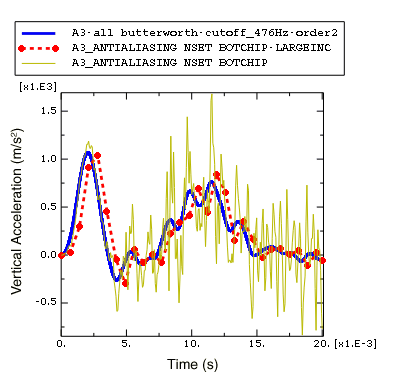

**图 12-88** Abaqus/Explicit和**可视化**模块中滤波的加速度比较。

在[图12-88](#图-12-88)中，可以清楚地看到Abaqus/CAE的**可视化**模块中的后处理滤波没有在分析运行时进行滤波时发生的时间延迟。这是因为**可视化**模块的滤波是双向的，这意味着滤波首先在前向 pass（引入一些时间延迟）中应用，然后在后向 pass（去除时间延迟）中应用。由于**可视化**模块中的双向滤波，滤波实际上应用了两次，这导致与单次滤波相比额外的信号衰减。这就是为什么在**可视化**模块中滤波的加速度曲线的局部峰值比Abaqus/Explicit滤波的曲线略低。

为了更好地理解**可视化**模块的滤波功能，返回**对XY数据操作**对话框，并使用其他滤波器选项对加速度数据进行滤波。例如，尝试不同的截止频率。

**你能确认与时间增量大小为0.07的内置抗混叠滤波器相关的2.4 kHz截止频率是合适的吗？将截止频率提高到6 kHz、7 kHz甚至10 kHz会产生显著不同的结果吗？**

你应该发现适度增加截止频率对结果没有显著影响，这意味着当我们以2.4 kHz的截止频率滤波时，我们可能没有遗漏物理上有意义的频率内容。

比较用巴特沃斯和切比雪夫I型滤波器滤波加速度数据的结果。切比雪夫滤波器需要一个纹波因子参数（`rippleFactor`），它表示您将允许多少振荡以换取改进的滤波器响应；有关更多信息，请参阅[Abaqus分析用户指南的"输出到输出数据库"第4.1.3节中的"在Abaqus/Explicit中滤波输出和在输出上操作"](#)。对于切比雪夫I型滤波器，纹波因子为0.071将导致非常平坦的通带，纹波仅为0.5%。

**当截止频率为5 kHz时，您可能不会注意到滤波器之间的太大差异，但截止频率为2 kHz时呢？当你增加切比雪夫I型滤波器的阶数时会发生什么？**

将您的结果与[图12-89](#图-12-89)中显示的结果进行比较。


**图 12-89** 用巴特沃斯和切比雪夫I型滤波器滤波的加速度比较。

> **注意：** Abaqus/CAE后处理滤波器默认是二阶的。要定义高阶滤波器，您可以将`filterOrder`参数与巴特沃斯滤波器和切比雪夫I型滤波器一起使用。例如，在**对XY数据操作**对话框中使用以下表达式对`A3-all`进行六阶切比雪夫I型滤波，截止频率为2 kHz，纹波因子为0.017。
>
> ```
> chebyshev1Filter ( xyData="A3-all" , cutoffFrequency=2000,
>  rippleFactor= 0.017, filterOrder=6)
> ```

纹波因子为0.071的二阶切比雪夫I型滤波器是一个相对较弱的滤波器，因此高于2 kHz截止频率的某些频率内容没有被过滤掉。当滤波器阶数增加时，滤波器响应得到改善，因此结果更类似于等效巴特沃斯滤波器。

### 在Abaqus/CAE中滤波应变历史

电路板芯片位置附近的应变是另一个可以帮助我们确定泡沫包装有效性的结果。如果芯片下方的应变超过极限值，将芯片固定在板上的焊点将失效。我们希望识别任何方向上的峰值应变。因此，主对数应变是我们感兴趣的应变。主应变是Abaqus结果中的一种，是从非线性算子导出的；在这种情况下，使用非线性函数从各个应变分量计算主应变。其他一些常见的从非线性算子导出的结果是主应力、米泽斯应力和等效塑性应变。在滤波从非线性算子导出的结果时需要小心，因为非线性算子（与线性算子不同）可以修改原始结果的频率。滤波这样的结果可能会产生不良后果；例如，如果您去除了由应用非线性算子引入的部分频率内容，滤波结果将是非线性导出量的失真表示。一般来说，您应该避免滤波从非线性算子导出的量，或者在计算导出量之前对基础量进行滤波。

此分析的历史应变输出每0.07 ms使用内置抗混叠滤波器记录。为了验证抗混叠滤波器没有扭曲主应变结果，我们将使用滤波应变分量计算主对数应变，并将结果与滤波主对数应变进行比较。

#### 计算主对数应变

1. 要识别集合`BotBoard`中最靠近底部芯片的元素（使用ODB显示选项显示质量元素），请绘制带有可见元素编号的未变形电路板。

2. 在结果树中，按`*LE*Element #*`筛选**历史输出**，其中`#`是集合`BotBoard`中靠近底部芯片的元素编号之一。选择元素`SPOS`表面上了对数应变分量`LE11`，并将数据保存为`LE11`。

3. 类似地，将相同元素的`LE12`和`LE22`应变分量分别保存为`LE12`和`LE22`。

4. 在结果树中，双击**XYData**；然后在**创建XY数据**对话框中选择**对XY数据操作**。点击**继续**。

5. 在**对XY数据操作**对话框中，使用保存的对数应变分量计算最大主对数应变。对话框顶部的表达式应显示为：

   ```
   (("LE11"+"LE22")/2) + sqrt( power(("LE11"-"LE22")/2,2)
    + power("LE12"/2,2) )
   ```

6. 点击**另存为**将计算的最大主对数应变保存为`LEP-Max`。

7. 在**对XY数据操作**对话框中编辑表达式以计算最小主对数应变。修改后的表达式应显示为：

   ```
   (("LE11"+"LE22")/2) - sqrt( power(("LE11"-"LE22")/2,2)
    + power("LE12"/2,2) )
   ```

8. 点击**另存为**将计算的最小主对数应变保存为`LEP-Min`。

   为了与分析期间记录的应变使用相同的Y轴绘制计算的主对数应变，将Y值类型更改为应变。

9. 在结果树的**XYData**容器中，在`LEP-Max`上点击鼠标按钮3；并从出现的菜单中选择**编辑**。

10. 在**编辑XY数据**对话框中，选择**应变**作为Y值类型。

11. 类似地，编辑`LEP-Min`并选择**应变**作为Y值类型。

12. 使用结果树，与集合`BotBoard`中相同元素的分析期间记录的主应变（`LEP1`和`LEP2`）一起绘制`LEP-Max`和`LEP-Min`。

    如前所述，自定义图表外观以获得类似于[图12-90](#图-12-90)的图表。实际图表将取决于您选择的元素。


**图 12-90** 主对数应变值与时间的关系。

在[图12-90](#图-12-90)中，我们看到分析期间记录的滤波主对数应变曲线与从滤波应变分量计算的主对数应变曲线无法区分。因此，抗混叠滤波器（截止频率2.4 kHz）没有去除在应用非线性算子从原始应变数据计算主应变时引入的任何频率内容。接下来，以500 Hz的较低截止频率对应变数据进行滤波。

#### 用500 Hz截止频率滤波主对数应变

1. 在结果树中，双击**XYData**；然后在**创建XY数据**对话框中选择**对XY数据操作**。点击**继续**。

2. 在**对XY数据操作**对话框中，使用截止频率为500 Hz的二阶巴特沃斯滤波器对最大主对数应变`LEP-Max`进行滤波。对话框顶部的表达式应显示为：

   ```
   butterworthFilter(xyData="LEP-Max", cutoffFrequency=500)
   ```

3. 点击**另存为**将计算的最大主对数应变保存为`LEP-Max-FilterAfterCalc-bw500`。

4. 类似地，使用相同截止频率为500 Hz的二阶巴特沃斯滤波器对数应变分量`LE11`、`LE12`和`LE22`进行滤波。将结果曲线分别保存为`LE11-bw500`、`LE12-bw500`和`LE22-bw500`。

5. 现在使用滤波对数应变分量计算最大主对数应变。**对XY数据操作**对话框顶部的表达式应显示为：

   ```
   (("LE11-bw500"+"LE22-bw500")/2) + sqrt(
    power(("LE11-bw500"-"LE22-bw500")/2,2) +
    power("LE12-bw500"/2,2) )
   ```

6. 点击**另存为**将计算的最大主对数应变保存为`LEP-Max-CalcAfterFilter-bw500`。

7. 在结果树的**XYData**容器中，在`LEP-Max-CalcAfterFilter-bw500`上点击鼠标按钮3；并从出现的菜单中选择**编辑**。

8. 在**编辑XY数据**对话框中，选择**应变**作为Y值类型。

9. 绘制`LEP-Max-CalcAfterFilter-bw500`和`LEP-Max-FilterAfterCalc-bw500`，如[图12-91](#图-12-91)所示。和之前一样，实际图表将取决于您选择的元素。

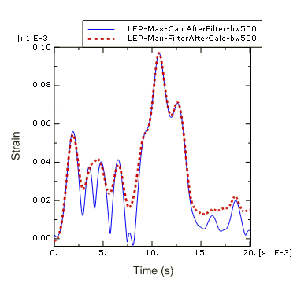

**图 12-91** 滤波前后计算的主对数应变（截止频率500 Hz）。

在[图12-91](#图-12-91)中，您可以看到在主应变计算之后和之前滤波的应变数据之间存在显著差异。在主应变计算之后滤波的曲线是失真的，因为应用非线性主应力算子引入的一些频率内容高于500 Hz滤波器截止频率。一般来说，你应该避免直接滤波从非线性算子导出的量；尽可能在计算所需导出量之前对基础分量进行滤波，然后将非线性算子应用于滤波后的分量。

### 记录和滤波Abaqus/Explicit历史输出的策略

在Abaqus/Explicit中为每个增量记录输出通常会产生比您需要的多得多的数据。实时滤波功能允许您以较低的频率请求历史输出，而不会因混叠而使结果失真。但是，您应该确保您的输出率和滤波选择没有去除物理上有意义的频率内容，也没有使结果失真（例如，引入大的时间延迟或去除由非线性算子引入的频率内容）。请记住，后处理滤波无法恢复分析期间滤波掉的频率内容，后处理滤波也无法从混叠数据中恢复原始信号。此外，如果没有额外的可用数据进行比较，可能无法明显发现结果被过度滤波或混叠。好的策略是选择相对较高的输出率，并使用Abaqus/Explicit滤波器来防止历史输出混叠，这样输出数据库中就会写入有效且丰富的结果。您可能希望为几个关键位置请求每个增量的输出。分析完成后，使用Abaqus/CAE中的后处理工具根据需要进行额外的滤波，快速迭代。
