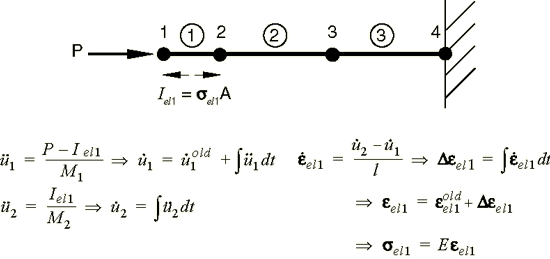

# 1.6 A quick review of the finite element method

This section reviews the basics of the finite element method. The first step of any finite element simulation is to *discretize* the actual geometry of the structure using a collection of *finite elements*. Each finite element represents a discrete portion of the physical structure. The finite elements are joined by shared *nodes*. The collection of nodes and finite elements is called the *mesh*. The number of elements per unit of length, area, or in a mesh is referred to as the *mesh density*. In a stress analysis the displacements of the nodes are the fundamental variables that Abaqus calculates. Once the nodal displacements are known, the stresses and strains in each finite element can be determined easily.

## 1.6.1 Obtaining nodal displacements using implicit methods

A simple example of a truss, constrained at one end and loaded at the other end as shown in [Figure 1–3](#gsa-truss), is used to introduce some terms and conventions used in this document.

**Figure 1–3** Truss problem.

The objective of the analysis is to find the displacement of the free end of the truss, the stress in the truss, and the reaction force at the constrained end of the truss.

In this case the rod shown in [Figure 1–3](#gsa-truss) will be modeled with two truss elements. In Abaqus truss elements can carry axial loads only. The discretized model is shown in [Figure 1–4](#gsa-discretized) together with the node and element labels.

**Figure 1–4** Discretized model of the truss problem.

Free-body diagrams for each node in the model are shown in [Figure 1–5](#gsa-free-body). In general each node will carry an external load applied to the model, *P*, and internal loads, *I*, caused by stresses in the elements attached to that node. For a model to be in static equilibrium, the net force acting on each node must be zero; i.e., the internal and external loads at each node must balance each other. For node *a* this equilibrium equation can be obtained as follows.

**Figure 1–5** Free-body diagram for each node.

Assuming that the change in length of the rod is small, the strain in element 1 is given by

where  and  are the displacements at nodes *a* and *b*, respectively, and *L* is the original length of the element.

Assuming that the material is elastic, the stress in the rod is given by the strain multiplied by the Young's modulus, *E*:

The axial force acting on the end node is equivalent to the stress in the rod multiplied by its cross-sectional area, *A*. Thus, a relationship between internal force, material properties, and displacements is obtained:

Equilibrium at node *a* can, therefore, be written as

Equilibrium at node *b* must take into account the internal forces acting from both elements joined at that node. The internal force from element 1 is now acting in the opposite direction and so becomes negative. The resulting equation is

For node *c* the equilibrium equation is

For implicit methods, the equilibrium equations need to be solved simultaneously to obtain the displacements of all the nodes. This requirement is best achieved by matrix techniques; therefore, write the internal and external force contributions as matrices. If the properties and dimensions of the two elements are the same, the equilibrium equations can be simplified as follows:

In general, it may be that the element stiffnesses, the  terms, are different from element to element; therefore, write the element stiffnesses as  and  for the two elements in the model. We are interested in obtaining the solution to the equilibrium equation in which the externally applied forces, *P*, are in equilibrium with the internally generated forces, *I*. When discussing this equation with reference to convergence and nonlinearity, we write it as

For the complete two-element, three-node structure we, therefore, modify the signs and rewrite the equilibrium equation as

In an implicit method, such as that used in Abaqus/Standard, this system of equations can then be solved to obtain values for the three unknown variables: , , and  ( is specified in the problem as 0.0). Once the displacements are known, we can go back and use them to calculate the stresses in the truss elements. Implicit finite element methods require that a system of equations is solved at the end of each solution increment.

In contrast to implicit methods, an explicit method, such as that used in Abaqus/Explicit, does not require the solving of a simultaneous system of equations or the calculation of a global stiffness matrix. Instead, the solution is advanced kinematically from one increment to the next. The extension of the finite element method to explicit dynamics is covered in the following section.

## 1.6.2 Stress wave propagation illustrated

This section attempts to provide some conceptual understanding of how forces propagate through a model when using the explicit dynamics method. In this illustrative example we consider the propagation of a stress wave along a rod modeled with three elements, as shown in [Figure 1–6](#gxi-initrodconfig). We will study the state of the rod as we increment through time.

**Figure 1–6** Initial configuration of a rod with a concentrated load, , at the free end.

In the first time increment node 1 has an acceleration, , as a result of the concentrated force, , applied to it. The acceleration causes node 1 to have a velocity, , which, in turn, causes a strain rate, , in element 1. The increment of strain, , in element 1 is obtained by integrating the strain rate through the time of increment 1. The total strain, , is the sum of the initial strain, , and the increment in strain. In this case the initial strain is zero. Once the element strain has been calculated, the element stress, , is obtained by applying the material constitutive model. For a linear elastic material the stress is simply the elastic modulus times the total strain. This process is shown in [Figure 1–7](#gxi-inc1-rod-config). Nodes 2 and 3 do not move in the first increment since no force is applied to them.

**Figure 1–7** Configuration at the end of increment 1 of a rod with a concentrated load, , at the free end.

In the second increment the stresses in element 1 apply internal, element forces to the nodes associated with element 1, as shown in [Figure 1–8](#gxi-inc2-rod-config). These element stresses are then used to calculate dynamic equilibrium at nodes 1 and 2.

**Figure 1–8** Configuration of the rod at the beginning of increment 2.

The process continues so that at the start of the third increment there are stresses in both elements 1 and 2, and there are forces at nodes 1, 2, and 3, as shown in [Figure 1–9](#gxi-inc3-rod-config). The process continues until the analysis reaches the desired total time.

**Figure 1–9** Configuration of the rod at the beginning of increment 3.

