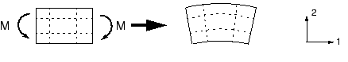
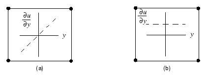
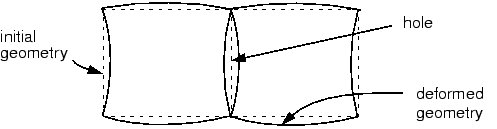

# 4.1 Element formulation and integration

The influence that the order of the element (linear or quadratic), the element formulation, and the level of integration have on the accuracy of a structural simulation will be demonstrated by considering a static analysis of the cantilever beam shown in [Figure 4-1](#gss-pointload). **Figure 4-1** Cantilever beam under a point load *P* at its free end.

This is a classic test used to assess the behavior of a given finite element. Since the beam is relatively slender, we would normally model it with beam elements. However, it is used here to help assess the effectiveness of various solid elements.

The beam is 150 mm long, 2.5 mm wide, and 5 mm deep; built-in at one end; and carrying a tip load of 5 N at the free end. The material has a Young's modulus, *E*, of 70 GPa and a Poisson's ratio of 0.0. Using beam theory, the static deflection of the tip of the beam for a load *P* is given as

where , *l* is the length, *b* is the width, and *d* is the depth of the beam.

For  5 N the tip deflection is 3.09 mm.

## 4.1.1 Full integration

The expression "full integration" refers to the number of Gauss points required to integrate the polynomial terms in an element's stiffness matrix exactly when the element has a regular shape. For hexahedral and quadrilateral elements a "regular shape" means that the edges are straight and meet at right angles and that any edge nodes are at the midpoint of the edge. Fully integrated, linear elements use two integration points in each direction. Thus, the three-dimensional element C3D8 uses a 2 × 2 × 2 array of integration points in the element. Fully integrated, quadratic elements (available only in Abaqus/Standard) use three integration points in each direction. The locations of the integration points in fully integrated, two-dimensional, quadrilateral elements are shown in [Figure 4-2](#gss-linear-quad).

**Figure 4-2** Integration points in fully integrated, two-dimensional, quadrilateral elements.

Several different finite element meshes were used in Abaqus/Standard simulations of the cantilever beam problem, as shown in [Figure 4-3](#gss-four-meshes). The simulations use either linear or quadratic, fully integrated elements and illustrate the effects of both the order of the element (first versus second) and the mesh density on the accuracy of the results.

**Figure 4-3** Meshes used for the cantilever beam simulations.

The ratios of the tip displacements for the various simulations to the beam-theory value of 3.09 mm are shown in [Table 4-1](#gss-continuum-table-beam).

**Table 4-1** Normalized tip displacements with fully-integrated elements.

| Element | Mesh Size (Depth × Length) | | | |
|---------|---------------------------|---|---|---|
| | 1 × 6 | 2 × 12 | 4 × 12 | 8 × 24 |
| CPS4 | 0.074 | 0.242 | 0.242 | 0.561 |
| CPS8 | 0.994 | 1.000 | 1.000 | 1.000 |
| C3D8 | 0.077 | 0.248 | 0.243 | 0.563 |
| C3D20 | 0.994 | 1.000 | 1.000 | 1.000 |

The linear elements CPS4 and C3D8 underpredict the deflection so badly that the results are unusable. The results are least accurate with coarse meshes, but even a fine mesh (8 × 24) still predicts a tip displacement that is only 56% of the theoretical value. Notice that for the linear, fully integrated elements it makes no difference how many elements there are through the thickness of the beam. The underprediction of tip deflection is caused by *shear locking*, which is a problem with all fully integrated, first-order, solid elements.

As we have seen, shear locking causes the elements to be too stiff in bending. It is explained as follows. Consider a small piece of material in a structure subject to pure bending. The material will distort as shown in [Figure 4-4](#gss-deform).

**Figure 4-4** Deformation of material subjected to bending moment *M*.

Lines initially parallel to the horizontal axis take on constant curvature, and lines through the thickness remain straight. The angle between the horizontal and vertical lines remains at 90°.

The edges of a linear element are unable to curve; therefore, if the small piece of material is modeled using a single element, its deformed shape is like that shown in [Figure 4-5](#gss-linear-elem).

**Figure 4-5** Deformation of a fully integrated, linear element subjected to bending moment *M*.

For visualization, dotted lines that pass through the integration points are plotted. It is apparent that the upper line has increased in length, indicating that the direct stress in the 1-direction, , is tensile. Similarly, the length of the lower dotted line has decreased, indicating that  is compressive. The length of the vertical dotted lines has not changed (assuming that displacements are small); therefore,  at all integration points is zero. All this is consistent with the expected state of stress of a small piece of material subjected to pure bending. However, at each integration point the angle between the vertical and horizontal lines, which was initially 90°, has changed. This indicates that the shear stress, , at these points is nonzero. This is incorrect: the shear stress in a piece of material under pure bending is zero.

This spurious shear stress arises because the edges of the element are unable to curve. Its presence means that strain energy is creating shearing deformation rather than the intended bending deformation, so the overall deflections are less: the element is too stiff.

Shear locking only affects the performance of fully integrated, linear elements subjected to bending loads. These elements function perfectly well under direct or shear loads. Shear locking is not a problem for quadratic elements since their edges are able to curve (see [Figure 4-6](#gss-quad-elem)). The predicted tip displacements for the quadratic elements shown in [Table 4-1](#gss-continuum-table-beam) are close to the theoretical value. However, quadratic elements will also exhibit some locking if they are distorted or if the bending stress has a gradient, both of which can occur in practical problems.

**Figure 4-6** Deformation of a fully integrated, quadratic element subjected to bending moment *M*.

Fully integrated, linear elements should be used only when you are fairly certain that the loads will produce minimal bending in your model. Use a different element type if you have doubts about the type of deformation the loading will create. Fully integrated, quadratic elements can also lock under complex states of stress; thus, you should check the results carefully if they are used exclusively in your model. However, they are very useful for modeling areas where there are local stress concentrations.

*Volumetric locking* is another form of overconstraint that occurs in fully integrated elements when the material behavior is (almost) incompressible. It causes overly stiff behavior for deformations that should cause no volume changes. It is discussed further in [Chapter 10, "Materials"](ch10.html).

## 4.1.2 Reduced integration

Only quadrilateral and hexahedral elements can use a reduced-integration scheme; all wedge, tetrahedral, and triangular solid elements use full integration, although they can be used in the same mesh with reduced-integration hexahedral or quadrilateral elements.

Reduced-integration elements use one fewer integration point in each direction than the fully integrated elements. Reduced-integration, linear elements have just a single integration point located at the element's centroid. (Actually, these first-order elements in Abaqus use the more accurate "uniform strain" formulation, where average values of the strain components are computed for the element. This distinction is not important for this discussion.) The locations of the integration points for reduced-integration, quadrilateral elements are shown in [Figure 4-7](#gss-reduced).

**Figure 4-7** Integration points in two-dimensional elements with reduced integration.

Abaqus simulations of the cantilever beam problem were performed using the reduced-integration versions of the same four elements utilized previously and using the four finite element meshes shown in [Figure 4-3](#gss-four-meshes). The results from these simulations are presented in [Table 4-2](#gss-continuum-table-mesh).

**Table 4-2** Normalized tip displacements with reduced-integration elements.

| Element | Mesh Size (Depth × Length) | | | |
|---------|---------------------------|---|---|---|
| | 1 × 6 | 2 × 12 | 4 × 12 | 8 × 24 |
| CPS4R | 20.3* | 1.308 | 1.051 | 1.012 |
| CPS8R | 1.000 | 1.000 | 1.000 | 1.000 |
| C3D8R | 70.1* | 1.323 | 1.063 | 1.015 |
| C3D20R | 0.999** | 1.000 | 1.000 | 1.000 |

* no stiffness to resist the applied load, ** two elements through width

Linear reduced-integration elements tend to be too flexible because they suffer from their own numerical problem called *hourglassing*. Again, consider a single reduced-integration element modeling a small piece of material subjected to pure bending (see [Figure 4-8](#gss-reduced-integration)).

**Figure 4-8** Deformation of a linear element with reduced integration subjected to bending moment *M*.

Neither of the dotted visualization lines has changed in length, and the angle between them is also unchanged, which means that all components of stress at the element's single integration point are zero. This bending mode of deformation is thus a zero-energy mode because no strain energy is generated by this element distortion. The element is unable to resist this type of deformation since it has no stiffness in this mode. In coarse meshes this zero-energy mode can propagate through the mesh, producing meaningless results.

In Abaqus a small amount of artificial "hourglass stiffness" is introduced in first-order reduced-integration elements to limit the propagation of hourglass modes. This stiffness is more effective at limiting the hourglass modes when more elements are used in the model, which means that linear reduced-integration elements can give acceptable results as long as a reasonably fine mesh is used. The errors seen with the finer meshes of linear reduced-integration elements (see [Table 4-2](#gss-continuum-table-mesh)) are within an acceptable range for many applications. The results suggest that at least four elements should be used through the thickness when modeling any structures carrying bending loads with this type of element. When a single linear reduced-integration element is used through the thickness of the beam, all the integration points lie on the neutral axis and the model is unable to resist bending loads. (These cases are marked with a * in [Table 4-2](#gss-continuum-table-mesh).)

Linear reduced-integration elements are very tolerant of distortion; therefore, use a fine mesh of these elements in any simulation where the distortion levels may be very high.

The quadratic reduced-integration elements available in Abaqus/Standard also have hourglass modes. However, the modes are almost impossible to propagate in a normal mesh and are rarely a problem if the mesh is sufficiently fine. The 1 × 6 mesh of C3D20R elements fails to converge because of hourglassing unless two elements are used through the width, but the more refined meshes do not fail even when only one element is used through the width. Quadratic reduced-integration elements are not susceptible to locking, even when subjected to complicated states of stress. Therefore, these elements are generally the best choice for most general stress/displacement simulations, except in large-displacement simulations involving very large strains and in some types of contact analyses.

## 4.1.3 Incompatible mode elements

The incompatible mode elements, available primarily in Abaqus/Standard, are an attempt to overcome the problems of shear locking in fully integrated, first-order elements. Since shear locking is caused by the inability of the element's displacement field to model the kinematics associated with bending, additional degrees of freedom, which enhance the element's deformation gradient, are introduced into the first-order element. These enhancements to the deformation gradient allow a first-order element to have a linear variation of the deformation gradient across the element's domain as shown in [Figure 4-9](#gss-deform-gradient)(a). The standard element formulation results in a constant deformation gradient across the element as shown in [Figure 4-9](#gss-deform-gradient)(b), resulting in the nonzero shear stress associated with shear locking.

**Figure 4-9** Variation of deformation gradient in (a) an incompatible mode (enhanced deformation gradient) element and (b) a first-order element using a standard formulation.

These enhancements to the deformation gradient are entirely internal to an element and are not associated with nodes positioned along the element edges. Unlike incompatible mode formulations that enhance the displacement field directly, the formulation used in Abaqus does not result in overlapping material or a hole along the boundary between two elements, as shown in [Figure 4-10](#gss-kinematic).

**Figure 4-10** Potential kinematic incompatibility between incompatible mode elements that use enhanced displacement fields rather than enhanced deformation gradients. Abaqus uses the latter formulation for its incompatible mode elements.

Furthermore, the formulation used in Abaqus is extended easily to nonlinear, finite-strain simulations, something which is not as easy with the enhanced displacement field elements.

Incompatible mode elements can produce results in bending problems that are comparable to quadratic elements but at significantly lower computational cost. However, they are sensitive to element distortions. [Figure 4-11](#gss-distort-mesh) shows the cantilever beam modeled with deliberately distorted incompatible mode elements: in one case with "parallel" distortion and in the other with "trapezoidal" distortion.

**Figure 4-11** Distorted meshes of incompatible mode elements.

[Figure 4-12](#gss-mode-elem) shows the tip displacements for the cantilever beam models. The tip displacements are normalized with respect to the analytical solution and plotted against the level of element distortion.

**Figure 4-12** Effect of parallel and trapezoidal distortion of incompatible mode elements.

Three types of plane stress elements in Abaqus/Standard are compared: the fully integrated, linear element; the reduced-integration, quadratic element; and the linear, incompatible mode element. The fully integrated, linear elements produce poor results in all cases, as expected. On the other hand, the reduced-integration, quadratic elements give very good results that do not deteriorate until the elements are badly distorted.

When the incompatible mode elements are rectangular, even a mesh with just one element through the thickness of the cantilever gives results that are very close to the theoretical value. However, even quite small levels of trapezoidal distortion make the elements much too stiff. Parallel distortion also reduces the accuracy of the element but to a lesser extent.

Incompatible mode elements are useful because they can provide high accuracy at a low cost if they are used appropriately. However, care must be taken to ensure that the element distortions are small, which may be difficult when meshing complex geometries; therefore, you should again consider using the reduced-integration, quadratic elements in models with such geometries because they show much less sensitivity to mesh distortion. In a severely distorted mesh, however, simply changing the element type will generally not produce accurate results. The mesh distortion should be minimized as much as possible to improve the accuracy of the results.

## 4.1.4 Hybrid elements

A hybrid element formulation is available for just about every type of continuum element in Abaqus/Standard, including all reduced-integration and incompatible mode elements. Hybrid elements are not available in Abaqus/Explicit. Elements using this formulation have the letter "H" in their names.

Hybrid elements are used when the material behavior is incompressible (Poisson's ratio = 0.5) or very close to incompressible (Poisson's ratio > 0.475). Rubber is an example of a material with incompressible material behavior. An incompressible material response cannot be modeled with regular elements (except in the case of plane stress) because the pressure stress in the element is indeterminate. Consider an element under uniform hydrostatic pressure ([Figure 4-13](#gss-hydrostatic)).

**Figure 4-13** Element under hydrostatic pressure.

If the material is incompressible, its volume cannot change under this loading. Therefore, the pressure stress cannot be computed from the displacements of the nodes; and, thus, a pure displacement formulation is inadequate for any element with incompressible material behavior.

Hybrid elements include an additional degree of freedom that determines the pressure stress in the element directly. The nodal displacements are used only to calculate the deviatoric (shear) strains and stresses.

A more detailed description of the analysis of rubber materials is given in [Chapter 10, "Materials"](ch10.html).
