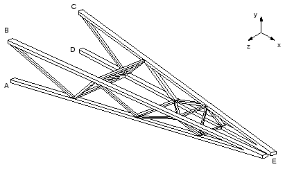
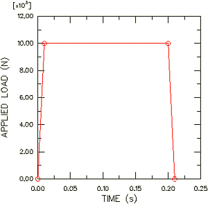

# 7.5 Example: cargo crane under dynamic loading


This example uses the same cargo crane that you analyzed in ["Example: cargo crane," Section 6.4](ch06s04.html), but you have now been asked to investigate what happens when a load of 10 kN is dropped onto the lifting hook for 0.2 seconds. The connections at points *A*, *B*, *C*, and *D* (see [Figure 7-5](#gss-cargo)) can only withstand a maximum pull-out force of 100 kN. You have to decide whether or not any of these connections will break.

**Figure 7-5** Cargo crane.



The short duration of the loading means that inertia effects are likely to be important, making dynamic analysis essential. You are not given any information regarding the damping of the structure. Since there are bolted connections between the trusses and the cross bracing, the energy absorption caused by frictional effects is likely to be significant. Based on experience, you therefore choose 5% of critical damping in each mode.

The magnitude of the applied load versus time is shown in [Figure 7-6](#gss-load-time-v).

**Figure 7-6** Load-time characteristic.



The steps that follow assumes that you have access to the full input file for this example. This input file, `dynamics.inp`, is provided in ["Cargo crane – dynamic loading," Section A.5](ap01s05.html). Instructions on how to fetch and run the script are given in [Appendix A, "Example Files"](ap01.html).

If you prefer to create this example interactively using Abaqus/CAE, refer to ["Example: cargo crane under dynamic loading," Section 7.5 of Getting Started with Abaqus: Interactive Edition](../gsa/gsa-link.htm#gsa-dyn-exacargodyn).

## 7.5.1 Modifications to the input file—the model data


The model data are the same as for the static analysis with the modifications described below. These modifications are most easily made using an editor, although you may change the model in a preprocessor if you prefer.

**Material**

In dynamic simulations the density of every material must be specified so that the mass matrix can be formed. The steel in the crane has a density of 7800 kg/m<sup>3</sup>. The beam element properties were defined using the `*BEAM GENERAL SECTION` option, so there are no material property definitions in this input file. The density must be specified using the `DENSITY` parameter on the `*BEAM GENERAL SECTION` option. For example:

```
*BEAM GENERAL SECTION, SECTION=BOX, ELSET=OUTA, DENSITY=7800.
44	0.10,0.05,0.005,0.005,0.005,0.005
45	-0.1118, 0.0, -0.9936 
46	200.E9,80.E9
```

The `DENSITY` parameter has been added to all the element property options.

If material data are defined using the `*MATERIAL` option, the density is included by using the `*DENSITY` option and giving the mass density on the data line. For example:

```
*MATERIAL, NAME=STEEL
*ELASTIC
<Young's modulus>,<Poisson's ratio>
*DENSITY
<density>,
```

**Initial conditions**

In this example the structure has no initial velocities or accelerations, which is the default. However, if you wanted to define initial velocities, you could do so using the following option:

```
*INITIAL CONDITIONS, TYPE=VELOCITY
```

The nodes (or node sets), the direction, and the magnitude of the velocity are specified on the data line, as follows:

```
<node or node set>,<dof>, <velocity>
```

For example:

```
*INITIAL CONDITIONS, TYPE=VELOCITY
51	NALL, 1, 10.0
```

would set the velocity in the 1-direction of all the nodes in node set `NALL` to 10 m/s.

**Time variation of load**

The magnitude of the load applied to the tip of the crane is time dependent as illustrated in [Figure 7-6](#gss-load-time-v). The time dependence of a load is defined using the `*AMPLITUDE` option. The `*AMPLITUDE` option must appear as part of the model data, even though the `*CLOAD` option referring to it is part of the history data.

Four pairs of time and magnitude data are given on each data line for the `*AMPLITUDE` option, and a name is assigned to the amplitude curve using the `NAME` parameter. For your simulation the option block defining the amplitude curve should look similar to the following:

```
*AMPLITUDE, NAME=BOUNCE, VALUE=RELATIVE, SMOOTH=0.25
52	0.0, 0.0, 0.01, 1.0, 0.2, 1.0, 0.21, 0.0
```

The name of the curve, `BOUNCE`, will be used to refer the loading option (`*CLOAD`) to this amplitude curve. The actual load applied will be the product of the magnitude on the loading option and the amplitude on the `BOUNCE` curve. The parameter `VALUE`=`RELATIVE` is used to indicate this approach. You can choose to define the absolute magnitude of the loading on the `*AMPLITUDE` option by using `VALUE`=`ABSOLUTE`.

## 7.5.2 Modifications to the input file—the history data


The history definition is substantially different from that in the static analysis. Therefore, delete the entire static step, and add a new history section as discussed below.

Two steps are required for this analysis. The first step calculates the natural frequencies and mode shapes of the structure. The second step then uses these data to calculate the transient dynamic response of the hoist. If you want to model any nonlinearities in this simulation, you must use the `*DYNAMIC` procedure. In this analysis we will assume that everything is linear.

**Step 1 – Modes and frequencies**

The `*FREQUENCY` procedure is used to calculate natural frequencies and mode shapes. Abaqus offers the Lanczos and the subspace iteration eigenvalue extraction methods. The Lanczos method is the default method; it is generally faster when a large number of eigenmodes is required for a system with many degrees of freedom. The subspace iteration method may be faster when only a few (less than 20) eigenmodes are needed.

We use the default Lanczos eigensolver in this analysis. The number of modes required is specified on the data line of the `*FREQUENCY` option. Alternatively, it is possible to specify the minimum and maximum frequencies of interest, so that the step will complete once Abaqus has found all of the eigenvalues inside the specified range. A shift point may also be specified so that eigenvalues nearest the shift point will be extracted. By default, no minimum or maximum frequency or shift is used. If the structure is not constrained against rigid body modes, the shift value should be set to a small negative value to remove numerical problems associated with rigid body motion.

The form of the `*FREQUENCY` option block is:

```
*FREQUENCY
<number of eigenvalues>,< min. frequency>,< max. frequency>,<shift point>
```

The step and procedure option blocks for this simulation are:

```
*STEP, PERTURBATION
Frequency extraction of the first 30 modes
*FREQUENCY
30,
```

In structural dynamic analysis the response is usually associated with the lower modes. However, enough modes should be extracted to provide a good representation of the dynamic response of the structure. One way of checking that a sufficient number of eigenvalues has been extracted is to look at the total effective mass in each degree of freedom, which indicates how much of the mass is active in each direction of the extracted modes. The effective masses are tabulated in the data file under the eigenvalue output. Ideally, the sum of the modal effective masses for each mode in each direction should be at least 90% of the total mass. This is discussed further in ["Effect of the number of modes," Section 7.6](ch07s06.html).

**Boundary conditions**

The boundary conditions are the same as in the static analysis.

**Output**

By default, Abaqus writes the mode shapes to the output database (`.odb`) file so that they can be plotted using Abaqus/Viewer. The nodal displacements for each mode shape are normalized so that the maximum displacement is unity. Therefore, these results, and the corresponding stresses and strains, are not physically meaningful: they should be used only for relative comparisons.

The step terminates with:

```
*END STEP
```

**Step 2 – Transient dynamics**

The `*MODAL DYNAMIC` procedure is used for transient modal dynamic analysis. The fixed time increment and the total step time are given on the data line for this option. The total time of the simulation is 0.5 seconds with a constant increment of 0.005 seconds. The format of this data line is basically the same as that for `*STATIC`. However, in this case we must be careful to ensure that we give real values of time; in dynamic analysis time is a real, physical quantity.

The form of the `*STEP` and `*MODAL DYNAMIC` option blocks for this simulation should be:

```
*STEP, PERTURBATION 
Crane Response to Dropped Load
*MODAL DYNAMIC
0.005, 0.5
```

**Damping**

5% of critical damping should be used in all 30 modes extracted in the first step. This input is specified in the following `*MODAL DAMPING` option block:

```
*MODAL DAMPING, VISCOUS=FRACTION OF CRITICAL DAMPING
1, 30, 0.05
```

**Selecting the eigenmodes**

The eigenmodes used in a mode-based dynamic procedure must be selected with the `*SELECT EIGENMODES` option if `*MODAL DAMPING` is used. For this example, the form of this option is:

```
*SELECT EIGENMODES, GENERATE
1, 30, 1
```

**Loading**

Apply the concentrated force to the tip of the crane at node 104 in the negative global 2-direction. The `*EQUATION` constraint between nodes 104 and 204 in degree of freedom 2 means that the load will be carried equally by both nodes and, thus, by both halves of the crane. The concentrated force is defined using the `*CLOAD` option. This example uses the parameter `AMPLITUDE`=BOUNCE to indicate that the amplitude curve named `BOUNCE` (previously defined as part of the model data) should be used to define the time varying magnitude of the load during the step:

```
*CLOAD, AMPLITUDE=BOUNCE
104, 2, -1.0E4
```

The actual magnitude of the load applied at any point in time is obtained by multiplying the magnitude given on the `*CLOAD` option (–10,000 N) and the value of the `BOUNCE` amplitude curve at that time.

**Boundary conditions**

The same boundary conditions that were applied in Step 1 are still in effect for this step. Since the boundary conditions cannot be changed between a `*FREQUENCY` step and any subsequent modal dynamic steps, no boundary conditions should be specified.

**Output**

Dynamic analyses usually require many more increments than static analyses to complete. As a consequence, the volume of output from dynamic analyses can be very large, and you should control the output requests to keep the output files to a reasonable size.

You can estimate the size of the restart file using the approximate sizes given near the bottom of the data file during a **datacheck** analysis.

In this example request output of the deformed shape to the output database file at the end of every fifth increment. There will be 100 increments in the step (0.5/0.005); therefore, there will be 20 frames of output.

```
*OUTPUT, FIELD, FREQUENCY=5, VARIABLE=PRESELECT
```

The displacements of the independent tip node, which is assigned to a node set named `TIP`, and the reaction forces at the fixed nodes, which are grouped into a node set named `ATTACH`, are written as history data to the output database file every increment so that a higher resolution of these data will be available. In dynamic analyses we are also concerned about the energy distribution in the model and what form the energy takes. Kinetic energy is present in the model as a result of the motion of the mass; strain energy is present as a result of the displacement of the structure; energy is also dissipated through damping. We can output the kinetic energy (`ALLKE`), strain energy (`ALLSE`), energy dissipated through damping (`ALLVD`), external work on the entire model (`ALLWK`), and the total energy balance in the model (`ETOTAL`). The history portion of the output request is written as follows:

```
*NSET, NSET=TIP
63	104,
*OUTPUT, HISTORY, FREQUENCY=1
*NODE OUTPUT, NSET=TIP
U,
*NODE OUTPUT, NSET=ATTACH
RF,
*ENERGY OUTPUT
ALLKE, ALLSE, ALLVD, ALLWK, ETOTAL
```

The step terminates with the following:

```
*END STEP
```

## 7.5.3 Running the analysis


The input file is called `dynamics.inp` (an example is listed in ["Cargo crane – dynamic loading," Section A.5](ap01s05.html)). Use the following command to run the analysis in the background:

```
abaqus job=dynamics
```

## 7.5.4 Results


Examine the status (`.sta`) file and printed output data (`.dat`) file to evaluate the analysis results.

**Status file**

Looking at the contents of the status file, `dynamics.sta`, we can see that the time increment associated with the single increment in Step 1 is very small. A `*FREQUENCY` step uses no time, because time is not relevant in a frequency extraction step. The contents of the status file are shown below.

```
 SUMMARY OF JOB INFORMATION:
 STEP  INC ATT SEVERE EQUIL TOTAL  TOTAL      STEP       INC OF       DOF    IF
               DISCON ITERS ITERS  TIME/    TIME/LPF    TIME/LPF    MONITOR RIKS
               ITERS               FREQ
   1     1   1     0     0     0  0.000      1.00e-036  1.000e-036
   2     1   1     0     0     0  0.000      0.00500    0.005000  
   2     2   1     0     0     0  0.000      0.0100     0.005000  
   2     3   1     0     0     0  0.000      0.0150     0.005000  
   2     4   1     0     0     0  0.000      0.0200     0.005000  
   2     5   1     0     0     0  0.000      0.0250     0.005000  
   2     6   1     0     0     0  0.000      0.0300     0.005000  
....
   2    94   1     0     0     0  0.000      0.470      0.005000  
   2    95   1     0     0     0  0.000      0.475      0.005000  
   2    96   1     0     0     0  0.000      0.480      0.005000  
   2    97   1     0     0     0  0.000      0.485      0.005000  
   2    98   1     0     0     0  0.000      0.490      0.005000  
   2    99   1     0     0     0  0.000      0.495      0.005000  
   2   100   1     0     0     0  0.000      0.500      0.005000  
```

The output in the status file for Step 2 shows that the time increment size is constant throughout the step and that each increment requires only one iteration. Since modal dynamic analysis involves the linear superposition of the mode shapes, no iterating is required. For the same reason, the message file contains no information about equilibrium or residuals.

**Data file**

The primary results for Step 1 are the extracted eigenvalues, participation factors, and effective mass, as shown below.

```
                              E I G E N V A L U E    O U T P U T     

 MODE NO    EIGENVALUE       FREQUENCY           GENERALIZED MASS  COMPOSITE MODAL DAMPING            
                        (RAD/TIME) (CYCLES/TIME)

       1       1773.4     42.112     6.7023       151.92           0.0000    
       2       7016.8     83.766     13.332       30.206           0.0000    
       3       7644.1     87.430     13.915       90.401           0.0000    
       4       22999.     151.65     24.136       250.63           0.0000    
       5       24714.     157.21     25.020       275.90           0.0000    
       6       34811.     186.58     29.695       493.16           0.0000    
       7       42748.     206.76     32.906       1107.1           0.0000    
....
      25    2.26885E+05   476.32     75.809       207.47           0.0000    
      26    2.42800E+05   492.75     78.423       127.02           0.0000    
      27    2.84057E+05   532.97     84.825       1240.8           0.0000    
      28    2.92452E+05   540.79     86.069       330.69           0.0000    
      29    3.13943E+05   560.31     89.175       272.41           0.0000    
      30    3.64774E+05   603.96     96.124       64.980           0.0000    
```

The highest frequency extracted is 96 Hz. The period associated with this frequency is 0.0104 seconds, which is comparable to the fixed time increment of 0.005 seconds. There is no point in extracting modes whose period is substantially smaller than the time increment used. Conversely, the time increment must be capable of resolving the highest frequencies of interest.

The column for generalized mass lists the mass of a single degree of freedom system associated with that mode.

The table of participation factors indicates the predominant degrees of freedom in which the modes act, as shown below.

```
          P A R T I C I P A T I O N   F A C T O R S

 MODE NO    X-COMPONENT    Y-COMPONENT    Z-COMPONENT    X-ROTATION     Y-ROTATION     Z-ROTATION 

       1     -6.11690E-04   -6.14531E-03     1.4284         1.4276        -6.0252       -3.34721E-02
       2      0.18470       -0.25678        8.31883E-04    2.09977E-03   -6.05062E-03    -1.7751    
       3     -0.17440         1.5515        4.88139E-03   -5.59953E-03    3.24483E-02     9.3618    
       4     -8.69482E-05   -9.61288E-03    8.23644E-02    0.25721         1.2335       -2.97485E-02
       5     -3.80669E-03    1.13896E-03   -3.04330E-02   -0.60741         1.7592       -2.01080E-02
       6      3.71619E-02   -0.35674        6.05207E-03   -1.37690E-02    6.71471E-03   -0.98290    
       7     -2.48375E-03   -1.58340E-03    6.19483E-02    8.18701E-02   -0.29885        5.73966E-04
 ....
      25     -8.25367E-02   -0.22220       -3.54513E-02    1.61838E-02   -2.18156E-02   -0.14563    
      26     -1.98899E-02   -0.35108        4.61344E-02    1.80975E-03   -1.27588E-02   -0.17942    
      27      1.71767E-02    2.51338E-02    2.26535E-02    1.06724E-03   -4.31578E-02    1.92991E-02
      28      4.73374E-02    2.79248E-02   -0.11861       -7.32078E-03    0.24177       -2.37795E-02
      29      9.83570E-03   -3.64867E-03    4.65417E-03   -8.45350E-04   -1.56687E-02   -7.74623E-03
      30      4.83653E-02    1.85437E-02    0.13423        4.49321E-02   -0.35873       -4.29368E-02
```

Mode 1 acts predominately in the 3-direction.

The table of effective mass indicates the amount of mass active in each degree of freedom for any one mode, as shown below. The total mass of the model is given earlier in the data file and is 414.34 kg.

```
                    E F F E C T I V E   M A S S

 MODE NO    X-COMPONENT    Y-COMPONENT    Z-COMPONENT    X-ROTATION     Y-ROTATION     Z-ROTATION 

       1      5.68446E-05    5.73740E-03     309.98         309.61         5515.3        0.17021    
       2       1.0304         1.9917        2.09036E-05    1.33181E-04    1.10585E-03     95.175    
       3       2.7495         217.62        2.15407E-03    2.83449E-03    9.51822E-02     7923.1    
       4      1.89478E-06    2.31603E-02     1.7003         16.582         381.34        0.22180    
       5      3.99800E-03    3.57904E-04    0.25553         101.79         853.85        0.11155    
       6      0.68105         62.760        1.80631E-02    9.34950E-02    2.22352E-02     476.44    
       7      6.82949E-03    2.77557E-03     4.2485         7.4203         98.873        3.64709E-04
....
      25       1.4134         10.244        0.26075        5.43401E-02    9.87406E-02     4.4000    
      26      5.02489E-02     15.656        0.27034        4.16008E-04    2.06766E-02     4.0887    
      27      0.36609        0.78385        0.63677        1.41330E-03     2.3112        0.46216    
      28      0.74103        0.25787         4.6522        1.77231E-02     19.329        0.18700    
      29      2.63530E-02    3.62651E-03    5.90071E-03    1.94668E-04    6.68780E-02    1.63456E-02
      30      0.15200        2.23444E-02     1.1708        0.13119         8.3622        0.11979    

 TOTAL         22.198         378.26         373.68         558.02         8348.4         8695.0    
```

To ensure that enough modes have been used, the total effective mass in each direction should be a large proportion of the mass of the model (say 90%). However, some of the mass of the model is associated with nodes that are constrained. This constrained mass is approximately one-quarter of the mass of all the elements attached to the constrained nodes, which, in this case, is approximately 28 kg. Therefore, the mass of the model that is able to move is 385 kg. The effective mass in the *x*-, *y*-, and *z*-directions is 6%, 98%, and 97%, respectively, of the mass that can move. The total effective mass in the 2- and 3-directions is well above the 90% recommended earlier; the total effective mass in the 1-direction is much lower. However, since the loading is applied in the 2-direction, the response in the 1-direction is not significant.

The data file does not contain any results for the modal dynamics step, because all of the data file output requests were turned off.

## 7.5.5 Postprocessing


When you are in the directory containing the output database file `dynamics.odb`, type the following command at the operating system prompt:

```
abaqus viewer odb=dynamics
```

**Plotting mode shapes**

You can visualize the deformation mode associated with a given natural frequency by plotting the mode shape associated with that frequency.

**To select a mode and plot the corresponding mode shape:**

1. In the context bar, click the frame selector tool.
   The **Frame Selector** dialog box appears. Drag the bottom corner of the dialog box to enlarge it so that both step names are clearly visible.

2. Drag the frame slider to select frame `1` in **Step-1**. This is the first eigenmode.

3. From the main menu bar, select **Plot** → **Deformed Shape**; or use the tool in the toolbox.
   Abaqus/Viewer displays the deformed model shape associated with the first vibration mode, as shown in [Figure 7-7](#gsk-mode-1-v).

   **Figure 7-7** Mode 1.

   

4. Select the third mode (frame `3` in **Step-1**) from the **Frame Selector** dialog box. Afterward, close the dialog box.
   Abaqus/Viewer displays the third mode shape shown in [Figure 7-8](#gsk-mode-3-v).

   **Figure 7-8** Mode 3.

   

   > **Note:** A complete list of the available frames is given in the **Step/Frame** dialog box (**Result** → **Step/Frame**). This dialog box offers an alternative means to switching between frames.

**Animation of results**

You will animate the analysis results. First create a scale factor animation of the third eigenmode. Then create a time-history animation of the transient results.

**To create a scale factor animation of an eigenmode:**

1. From the main menu bar, select **Animate** → **Scale Factor**; or use the tool in the toolbox.
   Abaqus/Viewer displays the third mode shape and steps through different deformation scale factors ranging from 0 to 1.
   Abaqus/Viewer also displays the movie player controls on the right side of the context bar.

2. In the context bar, click to pause the animation.

**To create a time-history animation of the transient results:**

1. From the main menu bar, select **Result** → **Active Steps/Frames** to select which frames will be active in the history animation.
   Abaqus/Viewer displays the **Active Steps/Frames** dialog box.

2. Toggle the step names so that only the second step (**Step-2**) is selected.

3. Click **OK** to accept the selection and to close the dialog box.

4. From the main menu bar, select **Animate** → **Time History**; or use the tool from the toolbox.
   Abaqus/Viewer steps through each available frame of the second step. The state block indicates the current step and increment throughout the animation. After the last increment of this step is reached, the animation process repeats itself.

5. You can customize the deformed shape plot while the animation is running.

   a. Display the **Common Plot Options** dialog box.

   b. Choose **Uniform** from the **Deformation Scale Factor** field.

   c. Enter `15.0` as the deformation scale factor value.

   d. Click **Apply** to apply your change.
   Abaqus/Viewer now steps through the frames in the second step with a deformation scale factor of `15.0`.

   e. Choose **Auto-compute** from the **Deformation Scale Factor** field.

   f. Click **OK** to apply your change and to close the **Common Plot Options** dialog box.
   Abaqus/Viewer now steps through the frames in the second step with a default deformation scale factor of `0.8`.

**Determining the peak pull-out force**

To find the peak pull-out force at the attachment points, create an *X–Y* plot of the reaction force in the 1-direction (variable `RF1`) at the attached nodes. This involves plotting multiple curves at the same time.

**To plot multiple curves:**

1. In the Results Tree, click mouse button 3 on **History Output** for the output database named `dynamics.odb`. From the menu that appears, select **Filter**.

2. In the filter field, enter `*RF1*` to restrict the history output to just the reaction force components in the 1-direction.

3. From the list of available history output, select the four curves (using **[Ctrl]**+Click) that have the following form:
   `Reaction Force: RF1 PI: TRUSS-1 Node *xxx* in NSET ATTACH`

4. Click mouse button 3, and select **Plot** from the menu that appears.
   Abaqus/Viewer displays the selected curves.

5. Click in the prompt area to cancel the current procedure.

**To position the grid:**

1. Double-click the plot to open the **Chart Options** dialog box.

2. In this dialog box, switch to the **Grid Area** tabbed page.

3. In the **Size** region of this page, select the **Square** option.

4. Use the slider to set the size to **75**.

5. In the **Position** region of this page, select the **Auto-align** option.

6. From the available alignment options, select the last one (position the grid in the lower right corner of the viewport).

7. Click **Dismiss**.

**To position the legend:**

1. Double-click the legend to open the **Chart Legend Options** dialog box.

2. In this dialog box, switch to the **Area** tabbed page.

3. In the **Position** region of this page, toggle on **Inset**.

4. To display the minimum and maximum values in the legend, switch to the **Contents** tabbed page of the dialog box. In the **Numbers** region of this page, toggle on **Show min/max**.

5. Click **Dismiss**.

6. Drag the legend in the viewport to reposition it.

The resulting plot (which has been customized) is shown in [Figure 7-9](#gss-react-force-v). The curves for the two nodes at the top of each truss (points B and C) are almost a reflection of those for the nodes on the bottom of each truss (points A and D).

> **Note:** To modify the curve styles, click in the Visualization toolbox to open the **Curve Options** dialog box.

**Figure 7-9** History of the reaction forces at the attached nodes.


At the attachment points at the top of each truss structure, the peak tensile force is around 80 kN, which is below the 100 kN capacity of the connection. Keep in mind that a negative reaction force in the 1-direction means that the member is being pulled away from the wall. The lower attachments are in compression (positive reaction force) while the load is applied but oscillate between tension and compression after the load has been removed. The peak tensile force is about 40 kN, well below the allowable value. To find this value, probe the *X–Y* plot.

**To query the X–Y plot:**

1. From the main menu bar, select **Tools** → **Query**.
   The **Query** dialog box appears.

2. Click **Probe values** in the **Visualization Module Queries** field.
   The **Probe Values** dialog box appears.

3. Select the point indicated in [Figure 7-9](#gss-react-force-v).
   The *Y*-coordinate of this point is –40.30 kN, which corresponds to the value of the reaction force in the 1-direction.
