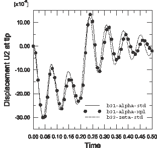

# 7.8 Comparison with direct time integration

Since this is a transient dynamic analysis, it is natural to consider how the results compare with those obtained using direct integration of the equations of motion. Direct integration can be performed with either implicit (Abaqus/Standard) or explicit (Abaqus/Explicit) methods. Here we extend the analysis to use the explicit dynamics procedure.

A direct comparison with the results presented earlier is not possible since the B33 element type and direct modal damping are not available in Abaqus/Explicit. Thus, in the Abaqus/Explicit analysis the element type is changed to B31 and Rayleigh damping is used in place of direct modal damping.

Save a copy of `dynamics.inp` as `dynamics_xpl.inp`. All subsequent changes should be made to `dynamics_xpl.inp`.

**To modify the model:**

1. Change the element type to B31 for all elements in the model. You can perform this change by modifying the `TYPE` parameter on the `*ELEMENT` option:

```
*ELEMENT, TYPE=B31
```

2. Add mass proportional damping to the bracing section properties. To do this, add the following `*DAMPING` option to the end of the material data option block for the bracing section:

```
*DAMPING, ALPHA=15.
```

This statement specifies a value of 15 for alpha damping and 0 for the remaining damping quantities.

These values produce a reasonable trade-off in the values of critical damping at low and high frequencies of the structure. For the three lowest natural frequencies, the effective value of  is greater than 0.05, but as was shown in [Figure 7-10](ch07s06.html#gss-numb-modes-v), the first two modes do not contribute significantly to the response. For the remaining modes, the value of  is less than 0.05. The variation of  as a function of natural frequency is shown in [Figure 7-12](#gsa-dyncrane-damping).

**Figure 7-12** Effect of damping on the results.


3. Repeat the previous step for the main member section properties.

4. Delete both analysis steps.

5. Create an single explicit dynamics step, and specify a time period of `0.5` s. In addition, edit the step to use linear geometry by setting `NLGEOM`=`NO` on the `*STEP` option (this will result in a linear analysis). For your simulation the option block defining the explicit dynamics step should look similar to the following:

```
*STEP, NLGEOM=NO
Direct integration transient dynamic analysis
*DYNAMIC, EXPLICIT
, 0.5
*BULK VISCOSITY
0.06, 1.2
```

6. Redefine the tip load.

The `*CLOAD` option block for this simulation is:

```
*CLOAD, AMPLITUDE=BOUNCE
104, 2, -1.0E4
```

7. Redefine node set `TIP` to include only node 104.

Create a default field output request and two history output requests. In the first, request displacement history for the set `TIP`; in the second, request reaction force history for the set `ATTACH`.

For your simulation, the option block defining the output requests should look similar to the following:

```
*NSET, NSET=TIP
104,
*OUTPUT, FIELD, VARIABLE=PRESELECT
*OUTPUT, HISTORY, VARIABLE=PRESELECT
*NODE OUTPUT, NSET=TIP
U,
*NODE OUTPUT, NSET=ATTACH
RF,
```

Terminate the step with

```
*END STEP
```

8. Save the input file as `dynamics_xpl.inp` and submit for analysis:

```
abaqus job=dynamics_xpl.inp
```

When the job completes, navigate to the directory containing the output database file `dynamics_xpl.odb` and type the command

```
abaqus viewer odb=dynamics_xpl
```

at the operating system prompt to examine the results in Abaqus/Viewer. In particular, compare the tip displacement history obtained earlier from Abaqus/Standard with that obtained from Abaqus/Explicit. As shown in [Figure 7-13](#gsa-dyncrane-compare), there are small differences in the response. These differences are due to the different element and damping types used for the modal dynamic analysis. In fact, if the Abaqus/Standard analysis is modified to use B31 elements and mass proportional damping, the results produced by the two analysis products are nearly indistinguishable (see [Figure 7-13](#gsa-dyncrane-compare)), which confirms the accuracy of the modal dynamic procedure.

**Figure 7-13** Comparison of tip displacements obtained from Abaqus/Standard and Abaqus/Explicit.


