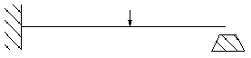
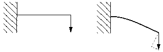
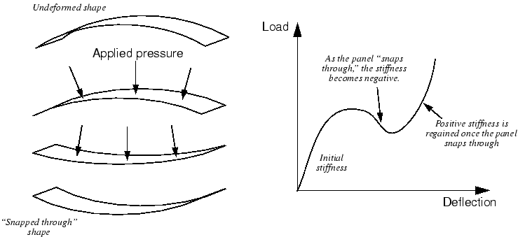

# 8.1 Sources of nonlinearity

There are three sources of nonlinearity in structural mechanics simulations:

- Material nonlinearity.
- Boundary nonlinearity.
- Geometric nonlinearity.

## 8.1.1 Material nonlinearity

This type of nonlinearity is probably the one that you are most familiar with and is covered in more depth in [Chapter 10, "Materials"](ch10.html). Most metals have a fairly linear stress/strain relationship at low strain values; but at higher strains the material yields, at which point the response becomes nonlinear and irreversible (see [Figure 8-2](#gss-elastplast)).

**Figure 8-2** Stress-strain curve for an elastic-plastic material under uniaxial tension.

Rubber materials can be approximated by a nonlinear, reversible (elastic) response (see [Figure 8-3](#gss-rubbertype)).

**Figure 8-3** Stress-strain curve for a rubber-type material.

Material nonlinearity may be related to factors other than strain. Strain-rate-dependent material data and material failure are both forms of material nonlinearity. Material properties can also be a function of temperature and other predefined fields.

## 8.1.2 Boundary nonlinearity

Boundary nonlinearity occurs if the boundary conditions change during the analysis. Consider the cantilever beam, shown in [Figure 8-4](#gss-cantilever), that deflects under an applied load until it hits a "stop."

**Figure 8-4** Cantilever beam hitting a stop.

The vertical deflection of the tip is linearly related to the load (if the deflection is small) until it contacts the stop. There is then a sudden change in the boundary condition at the tip of the beam, preventing any further vertical deflection, and so the response of the beam is no longer linear. Boundary nonlinearities are extremely discontinuous: when contact occurs during a simulation, there is a large and instantaneous change in the response of the structure.

Another example of boundary nonlinearity is blowing a sheet of material into a mold. The sheet expands relatively easily under the applied pressure until it begins to contact the mold. From then on the pressure must be increased to continue forming the sheet because of the change in boundary conditions.

Boundary nonlinearity is covered in [Chapter 12, "Contact"](ch12.html).

## 8.1.3 Geometric nonlinearity

The third source of nonlinearity is related to changes in the geometry of the structure during the analysis. Geometric nonlinearity occurs whenever the magnitude of the displacements affects the response of the structure. This may be caused by:

- Large deflections or rotations.
- "Snap through."
- Initial stresses or load stiffening.

For example, consider a cantilever beam loaded vertically at the tip (see [Figure 8-5](#gss-deflection)).

**Figure 8-5** Large deflection of a cantilever beam.

If the tip deflection is small, the analysis can be considered as being approximately linear. However, if the tip deflections are large, the shape of the structure and, hence, its stiffness changes. In addition, if the load does not remain perpendicular to the beam, the action of the load on the structure changes significantly. As the cantilever beam deflects, the load can be resolved into a component perpendicular to the beam and a component acting along the length of the beam. Both of these effects contribute to the nonlinear response of the cantilever beam (i.e., the changing of the beam's stiffness as the load it carries increases).

One would expect large deflections and rotations to have a significant effect on the way that structures carry loads. However, displacements do not necessarily have to be large relative to the dimensions of the structure for geometric nonlinearity to be important. Consider the "snap through" under applied pressure of a large panel with a shallow curve, as shown in [Figure 8-6](#gss-snap-through).

**Figure 8-6** Snap-through of a large shallow panel.

In this example there is a dramatic change in the stiffness of the panel as it deforms. As the panel "snaps through," the stiffness becomes negative. Thus, although the magnitude of the displacements, relative to the panel's dimensions, is quite small, there is significant geometric nonlinearity in the simulation, which must be taken into consideration.

An important difference between the analysis products should be noted here: by default, Abaqus/Standard assumes small deformations, while Abaqus/Explicit assumes large deformations.
