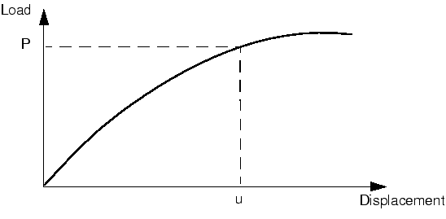
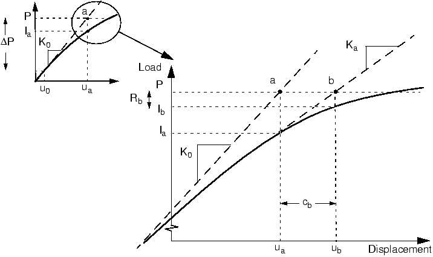

# 8.2 The solution of nonlinear problems


The nonlinear load-displacement curve for a structure is shown in [Figure 8-7](#gss-nonlinear).



**Figure 8-7** Nonlinear load-displacement curve.

The objective of the analysis is to determine this response. Consider the external forces, *P*, and the internal (nodal) forces, *I*, acting on a body (see [Figure 8-8](#gss-loads)(a) and [Figure 8-8](#gss-loads)(b), respectively).


**Figure 8-8** Internal and external loads on a body.

The internal loads acting on a node are caused by the stresses in the elements that contain that node.

For the body to be in static equilibrium, the net force acting at every node must be zero. Therefore, the basic statement of static equilibrium is that the internal forces, *I*, and the external forces, *P*, must balance each other:


Abaqus/Standard uses the Newton-Raphson method to obtain solutions for nonlinear problems. In a nonlinear analysis the solution usually cannot be calculated by solving a single system of equations, as would be done in a linear problem. Instead, the solution is found by applying the specified loads gradually and incrementally working toward the final solution. Therefore, Abaqus/Standard breaks the simulation into a number of *load increments* and finds the approximate equilibrium configuration at the end of each load increment. It often takes Abaqus/Standard several iterations to determine an acceptable solution to a given load increment. The sum of all of the incremental responses is the approximate solution for the nonlinear analysis. Thus, Abaqus/Standard combines incremental and iterative procedures for solving nonlinear problems.

Abaqus/Explicit determines a solution to the dynamic equilibrium equation  without iterating by explicitly advancing the kinematic state from the end of the previous increment. Solving a problem explicitly does not require the formation of tangent stiffness matrices. The explicit central-difference operator satisfies the dynamic equilibrium equations at the beginning of the increment, *t*; the accelerations calculated at time *t* are used to advance the velocity solution to time  and the displacement solution to time . For linear and nonlinear problems alike, explicit methods require a small time increment size that depends solely on the highest natural frequency of the model and is independent of the type and duration of loading. Simulations typically require a large number of increments; however, due to the fact that a global set of equations is not solved in each increment, the cost per increment of an explicit method is much smaller than that of an implicit method. The small increments characteristic of an explicit dynamic method make Abaqus/Explicit well suited for nonlinear analysis.

---

## 8.2.1 Steps, increments, and iterations


This section introduces some new vocabulary for describing the various parts of an analysis. It is important that you clearly understand the difference between an analysis *step*, a load *increment*, and an *iteration*.

- The load history for a simulation consists of one or more steps. You define the steps, which generally consist of an analysis procedure option, loading options, and output request options. Different loads, boundary conditions, analysis procedure options, and output requests can be used in each step. For example:

  - Step 1: Hold a plate between rigid jaws.
  - Step 2: Add loads to deform the plate.
  - Step 3: Find the natural frequencies of the deformed plate.

- An increment is part of a step. In nonlinear analyses the total load applied in a step is broken into smaller increments so that the nonlinear solution path can be followed.

  In Abaqus/Standard you suggest the size of the first increment, and Abaqus/Standard automatically chooses the size of the subsequent increments. In Abaqus/Explicit the default time incrementation is fully automatic and does not require user intervention. Because the explicit method is conditionally stable, there is a stability limit for the time increment. The stable time increment is discussed in [Chapter 9, "Nonlinear Explicit Dynamics"](ch09.html).

  At the end of each increment the structure is in (approximate) equilibrium and results are available for writing to the output database, restart, data, or results files. The increments at which you select results to be written to the output database file are called *frames*.

  The issues associated with time incrementation in Abaqus/Standard and Abaqus/Explicit analyses are quite different, since time increments are generally much smaller in Abaqus/Explicit.

- An iteration is an attempt at finding an equilibrium solution in an increment when solving with an implicit method. If the model is not in equilibrium at the end of the iteration, Abaqus/Standard tries another iteration. With every iteration the solution Abaqus/Standard obtains should be closer to equilibrium; sometimes Abaqus/Standard may need many iterations to obtain an equilibrium solution. When an equilibrium solution has been obtained, the increment is complete. Results can be requested only at the end of an increment.

  Abaqus/Explicit does not need to iterate to obtain the solution in an increment.

---

## 8.2.2 Equilibrium iterations and convergence in Abaqus/Standard


The nonlinear response of a structure to a small load increment, , is shown in [Figure 8-9](#gss-first-iteration). Abaqus/Standard uses the structure's initial stiffness, , which is based on its configuration at , and  to calculate a *displacement correction*, , for the structure. Using , the structure's configuration is updated to .


**Figure 8-9** First iteration in an increment.

### Convergence

Abaqus/Standard forms a new stiffness, , for the structure, based on its updated configuration, . Abaqus/Standard also calculates , in this updated configuration. The difference between the total applied load, *P*, and  can now be calculated as:


where  is the *force residual* for the iteration.

If  is zero at every degree of freedom in the model, point *a* in [Figure 8-9](#gss-first-iteration) would lie on the load-deflection curve, and the structure would be in equilibrium. In a nonlinear problem it is almost impossible to have  equal zero, so Abaqus/Standard compares it to a tolerance value. If  is less than this force residual tolerance, Abaqus/Standard accepts the structure's updated configuration as the equilibrium solution. By default, this tolerance value is set to 0.5% of an average force in the structure, averaged over time. Abaqus/Standard automatically calculates this spatially and time-averaged force throughout the simulation.

If  is less than the current tolerance value, *P* and  are in equilibrium, and  is a valid equilibrium configuration for the structure under the applied load. However, before Abaqus/Standard accepts the solution, it also checks that the displacement correction, , is small relative to the total incremental displacement, . If  is greater than 1% of the incremental displacement, Abaqus/Standard performs another iteration. Both convergence checks must be satisfied before a solution is said to have *converged* for that load increment. The exception to this rule is the case of a *linear* increment, which is defined as any increment in which the largest force residual is less than 10^-8 times the time-averaged force. Any case that passes such a stringent comparison of the largest force residual with the time-averaged force is considered linear and does not require further iteration. The solution is accepted without any check on the size of the displacement correction.

If the solution from an iteration is not converged, Abaqus/Standard performs another iteration to try to bring the internal and external forces into balance. This second iteration uses the stiffness, , calculated at the end of the previous iteration together with  to determine another displacement correction, , that brings the system closer to equilibrium (point *b* in [Figure 8-10](#gss-second-iteration)).



**Figure 8-10** Second iteration.

Abaqus/Standard calculates a new force residual, , using the internal forces from the structure's new configuration, . Again, the largest force residual at any degree of freedom, , is compared against the force residual tolerance, and the displacement correction for the second iteration, , is compared to the increment of displacement, . If necessary, Abaqus/Standard performs further iterations.

For each iteration in a nonlinear analysis Abaqus/Standard forms the model's stiffness matrix and solves a system of equations. This means that each iteration is equivalent, in computational cost, to conducting a complete linear analysis. It should now be clear that the computational expense of a nonlinear analysis in Abaqus/Standard can be many times greater than for a linear one.

It is possible with Abaqus/Standard to save results at each converged increment. Thus, the amount of output data available from a nonlinear simulation is many times that available from a linear analysis of the same geometry. Consider both of these factors and the types of nonlinear simulations that you want to perform when planning your computer resources.

---

## 8.2.3 Automatic incrementation control in Abaqus/Standard


Abaqus/Standard automatically adjusts the size of the load increments so that it solves nonlinear problems easily and efficiently. You only need to suggest the size of the first increment in each step of your simulation. Thereafter, Abaqus/Standard automatically adjusts the size of the increments. If you do not provide a suggested initial increment size, Abaqus/Standard will try to apply all of the loads defined in the step in the first increment. In highly nonlinear problems Abaqus/Standard will have to reduce the increment size repeatedly, resulting in wasted CPU time. Generally it is to your advantage to provide a reasonable initial increment size (see ["Modifications to the input file--the history data," Section 8.4.1](ch08s04.html#gsk-gen-nln-modhistory)), for an example); only in very mildly nonlinear problems can all of the loads in a step be applied in a single increment.

The number of iterations needed to find a converged solution for a load increment will vary depending on the degree of nonlinearity in the system. By default, if the solution appears to diverge, Abaqus/Standard abandons the increment and starts again with the increment size set to 25% of its previous value. An attempt is then made at finding a converged solution with this smaller load increment. If the increment still fails to converge, Abaqus/Standard reduces the increment size again. By default, Abaqus/Standard allows a maximum of five cutbacks of increment size in an increment before stopping the analysis.

In Abaqus/Standard you can also add the `INC` parameter to specify the maximum number of increments allowed during the step. Abaqus/Standard terminates the analysis with an error message if it needs more increments than this limit to complete the step. The default number of increments for a step is 100; if significant nonlinearity is present in the simulation, the analysis may require many more increments. The `INC` parameter specifies an upper limit on the number of increments that Abaqus/Standard can use, rather than the number of increments it must use. For example, a step involving nonlinear geometry with a maximum of 150 increments would be specified as:

```abaqus
*STEP, NLGEOM=YES, INC=150
```

In a nonlinear analysis a step takes place over a finite period of "time," although this "time" has no physical meaning unless inertial effects or rate-dependent behavior are present. In Abaqus/Standard you specify the initial time increment, , and the total step time,  on the data line of the procedure option used in the step. For example,


defines a static analysis that occurs over 1.0 units of time and has an initial increment of 0.1. The ratio of the initial time increment to the step time specifies the proportion of load applied in the first increment. The initial load increment is given by


The choice of initial time increment can be critical in certain nonlinear simulations in Abaqus/Standard, but for most analyses an initial increment size that is 5% to 10% of the total step time is usually sufficient. In static simulations the total step time is usually set to 1.0 for convenience, unless, for example, rate-dependent material effects or dashpots are included in the model. With a total step time of 1.0 the proportion of load applied is always equal to the current step time; i.e., 50% of the total load is applied when the step time is 0.5.

Although you must specify the initial increment size in Abaqus/Standard, Abaqus/Standard automatically controls the size of the subsequent increments. This automatic control of the increment size is suitable for the majority of nonlinear simulations performed with Abaqus/Standard, although further controls on the increment size are available. Abaqus/Standard will terminate an analysis if excessive cutbacks caused by convergence problems reduce the increment size below the minimum value. The default minimum allowable time increment, , is 10^-5 times the total step time. By default, Abaqus/Standard has no upper limit on the increment size, , other than the total step time. Depending on your Abaqus/Standard simulation, you may want to specify different minimum and/or maximum allowable increment sizes. For example, if you know that your simulation may have trouble obtaining a solution if too large a load increment is applied, perhaps because the model may undergo plastic deformation, you may want to decrease .

If the increment converges in fewer than five iterations, this indicates that the solution is being found fairly easily. Therefore, Abaqus/Standard automatically increases the increment size by 50% if two consecutive increments require fewer than five iterations to obtain a converged solution.

Details of the automatic load incrementation scheme are given in the message file, as shown in more detail in ["Results," Section 8.4.3](ch08s04.html#gsk-gen-nln-results).
