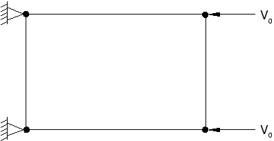

# 9.5 Damping of dynamic oscillations

There are two reasons for adding damping to a model: to limit numerical oscillations or to add physical damping to the system. Abaqus/Explicit provides several methods of introducing damping into the analysis.

## 9.5.1 Bulk viscosity

Bulk viscosity introduces damping associated with volumetric straining. Its purpose is to improve the modeling of high-speed dynamic events. Abaqus/Explicit contains linear and quadratic forms of bulk viscosity. You can set bulk viscosity to nondefault values from step to step by using the `*BULK VISCOSITY` option, although it is rarely necessary to do so. The bulk viscosity pressure is not included in the material point stresses because it is intended as a numerical effect only. As such, it is not considered part of the material's constitutive response.

**Linear bulk viscosity**

By default, linear bulk viscosity is always included to damp "ringing" in the highest element frequency. It generates a bulk viscosity pressure that is linear in the volumetric strain rate, according to the following equation:

where  is a damping coefficient, whose default value is 0.06,  is the current material density,  is the current dilatational wave speed,  is the element characteristic length, and  is the volumetric strain rate.

**Quadratic bulk viscosity**

Quadratic bulk viscosity is included only in continuum elements (except for the plane stress element, CPS4R) and is applied only if the volumetric strain rate is compressive. The bulk viscosity pressure is quadratic in the strain rate, according to the following equation:

where  is the damping coefficient, whose default value is 1.2.

The quadratic bulk viscosity smears a shock front across several elements and is introduced to prevent elements from collapsing under extremely high velocity gradients. Consider a simple one-element problem in which the nodes on one side of the element are fixed and the nodes on the other side have an initial velocity in the direction of the fixed nodes, as shown in Figure 9-11.

**Figure 9-11** Element with fixed nodes and prescribed velocities.

The stable time increment size is precisely the transit time of a dilatational wave across the element. Therefore, if the initial nodal velocity is equal to the dilatational wave speed of the material, the element collapses to zero volume in one time increment. The quadratic bulk viscosity pressure introduces a resisting pressure that prevents the element from collapsing.

**Fraction of critical damping due to bulk viscosity**

The bulk viscosity pressures are based on only the dilatational modes of each element. The fraction of critical damping in the highest element mode is given by the following equation:

where  is the fraction of critical damping. The linear term alone represents 6% of critical damping, whereas the quadratic term is usually much smaller.

## 9.5.2 Viscous pressure

Viscous pressure loads are commonly used in structural problems and quasi-static problems to damp out the low-frequency dynamic effects, thus allowing static equilibrium to be reached in a minimal number of increments. These loads are applied as distributed loads (`*DLOAD`) defined by the following formula:

where  is the pressure applied to the body;  is the viscosity, given on the data line as the magnitude of the load;  is the velocity vector of the point on the surface where the viscous pressure is being applied; and  is the unit outward normal vector to the surface at the same point. For typical structural problems it is not desirable to absorb all of the energy. Typically,  is set equal to a small percentage—perhaps 1 or 2 percent—of the quantity  as an effective way of minimizing ongoing dynamic effects.

## 9.5.3 Material damping

The material model itself may provide damping in the form of plastic dissipation or viscoelasticity. For many applications such damping may be adequate. Another option is to use Rayleigh damping defined using the `*DAMPING` option, which is part of the `*MATERIAL` option block. There are two damping factors associated with Rayleigh damping:  for mass proportional damping and  for stiffness proportional damping.

**Mass proportional damping**

The  factor defines a damping contribution proportional to the mass matrix for an element. The damping forces that are introduced are caused by the absolute velocities of nodes in the model. The resulting effect can be likened to the model moving through a viscous fluid so that any motion of any point in the model triggers damping forces. Reasonable mass proportional damping does not reduce the stability limit significantly.

**Stiffness proportional damping**

The  factor defines damping proportional to the elastic material stiffness. A "damping stress," , proportional to the total strain rate is introduced, using the following formula:

where  is the strain rate. For hyperelastic and hyperfoam materials  is defined as the initial elastic stiffness. For all other materials  is the material's current elastic stiffness. This damping stress is added to the stress caused by the constitutive response at the integration point when the dynamic equilibrium equations are formed, but it is not included in the stress output. Damping can be introduced for any nonlinear analysis and provides standard Rayleigh damping for linear analyses. For a linear analysis stiffness proportional damping is exactly the same as defining a damping matrix equal to  times the stiffness matrix. Stiffness proportional damping must be used with caution because it may significantly reduce the stability limit. To avoid a dramatic drop in the stable time increment, the stiffness proportional damping factor, , should be less than or of the same order of magnitude as the initial stable time increment without damping.

## 9.5.4 Discrete dashpots

Yet another option is to define individual dashpot elements. Each dashpot element provides a damping force proportional to the relative velocity of its two nodes. The advantage of this approach is that it enables you to apply damping only at points where you decide it is necessary. Dashpots always should be used in parallel with other elements, such as springs or trusses, so that they do not cause a significant reduction in the stability limit.
