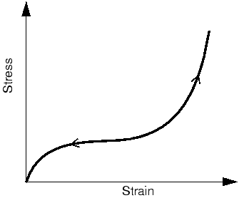
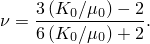
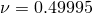
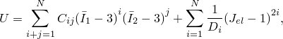
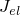
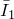

# 10.6 Hyperelasticity

We now turn our attention to another class of material nonlinearity, namely, the nonlinear elastic response exhibited by rubber materials.

## 10.6.1 Introduction

The stress-strain behavior of typical rubber materials, shown in [Figure 10–46](#gss-rubber), is elastic but highly nonlinear.

**Figure 10–46** Typical stress-strain curve for rubber.

This type of material behavior is called *hyperelasticity*. The deformation of hyperelastic materials, such as rubber, remains elastic up to large strain values (often well over 100%).

Abaqus makes the following assumptions when modeling a hyperelastic material:

* The material behavior is elastic.
* The material behavior is isotropic.
* The simulation will include nonlinear geometric effects.

In addition, Abaqus/Standard assumes the hyperelastic material is incompressible by default. Abaqus/Explicit assumes the material is nearly incompressible (Poisson's ratio is 0.475 by default).

Elastomeric foams are another class of highly nonlinear, elastic materials. They differ from rubber materials in that they have very compressible behavior when subjected to compressive loads. They are modeled with a separate material model in Abaqus and are not discussed in detail in this guide.

## 10.6.2 Compressibility

Most solid rubber materials have very little compressibility compared to their shear flexibility. This behavior is not a problem with plane stress, shell, or membrane elements. However, it can be a problem when using other elements, such as plane strain, axisymmetric, and three-dimensional solid elements. For example, in applications where the material is not highly confined, it would be quite satisfactory to assume that the material is fully incompressible: the volume of the material cannot change except for thermal expansion. In cases where the material is highly confined (such as an O-ring used as a seal), the compressibility must be modeled correctly to obtain accurate results.

Abaqus/Standard has a special family of "hybrid" elements that must be used to model the fully incompressible behavior seen in hyperelastic materials. These "hybrid" elements are identified by the letter `H` in their name; for example, the hybrid form of the 8-node brick, C3D8, is called C3D8H.

Except for plane stress and uniaxial cases, it is not possible to assume that the material is fully incompressible in Abaqus/Explicit because the program has no mechanism for imposing such a constraint at each material calculation point. An incompressible material also has an infinite wave speed, resulting in a time increment of zero. Therefore, we must provide some compressibility. The difficulty is that, in many cases, the actual material behavior provides too little compressibility for the algorithms to work efficiently. Thus, except for plane stress and uniaxial cases, the user must provide enough compressibility for the code to work, knowing that this makes the bulk behavior of the model softer than that of the actual material. Some judgment is, therefore, required to decide whether or not the solution is sufficiently accurate, or whether the problem can be modeled at all with Abaqus/Explicit because of this numerical limitation. We can assess the relative compressibility of a material by the ratio of its initial bulk modulus, , to its initial shear modulus, . Poisson's ratio, , also provides a measure of compressibility since it is defined as

[Table 10–4](#gxi-chp-material-table2) provides some representative values.

**Table 10–4** Relationship between compressibility and Poisson's ratio.

|  | Poisson's ratio |
|---|---|
| 10 | 0.452 |
| 20 | 0.475 |
| 50 | 0.490 |
| 100 | 0.495 |
| 1,000 | 0.4995 |
| 10,000 | 0.49995 |

If no value is given for the material compressibility, by default Abaqus/Explicit assumes , corresponding to Poisson's ratio of 0.475. Since typical unfilled elastomers have  ratios in the range of 1,000 to 10,000 ( to ) and filled elastomers have  ratios in the range of 50 to 200 ( to ), this default provides much more compressibility than is available in most elastomers. However, if the elastomer is relatively unconfined, this softer modeling of the material's bulk behavior usually provides quite accurate results. Unfortunately, in cases where the material is highly confined—such as when it is in contact with stiff, metal parts and has a very small amount of free surface, especially when the loading is highly compressive—it may not be feasible to obtain accurate results with Abaqus/Explicit.

If you are defining the compressibility rather than accepting the default value in Abaqus/Explicit, an upper limit of 100 is suggested for the ratio of . Larger ratios introduce high frequency noise into the dynamic solution and require the use of excessively small time increments.

## 10.6.3 Strain energy potential

Abaqus uses a *strain energy potential* (*U*), rather than a Young's modulus and Poisson's ratio, to relate stresses to strains in hyperelastic materials. Several different strain energy potentials are available: a polynomial model, the Ogden model, the Arruda-Boyce model, the Marlow model, and the van der Waals model. Simpler forms of the polynomial model are also available, including the Mooney-Rivlin, neo-Hookean, reduced polynomial, and Yeoh models.

The polynomial form of the strain energy potential is one that is commonly used. Its form is

where *U* is the strain energy potential;  is the elastic volume ratio;  and  are measures of the distortion in the material; and *N*, , and  are material parameters, which may be functions of temperature. The  parameters describe the shear behavior of the material, and the  parameters introduce compressibility. If the material is fully incompressible (a condition not allowed in Abaqus/Explicit), all the values of  are set to zero and the second part of the equation shown above can be ignored. If the number of terms, *N*, is one, the initial shear modulus, , and bulk modulus, , are given by

and

If the material is also incompressible, the equation for the strain energy density is

This expression is commonly referred to as the *Mooney-Rivlin* material model. If  is also zero, the material is called *neo-Hookean*.

The other hyperelastic models are similar in concept and are described in ["Hyperelasticity," Section 22.5 of the Abaqus Analysis User's Guide](../usb/usb-link.htm#usbhyperelast).

You must provide Abaqus with the relevant material parameters to use a hyperelastic material. For the polynomial form these are  and . It is possible that you will be supplied with these parameters when modeling hyperelastic materials; however, more likely you will be given test data for the materials that you must model. Fortunately, Abaqus can accept test data directly and calculate the material parameters for you (using a least squares fit).

## 10.6.4 Defining hyperelastic behavior using test data

A convenient way of defining a hyperelastic material is to supply Abaqus with experimental test data. Abaqus then calculates the constants using a least squares method. Abaqus can fit data for the following experimental tests:

* Uniaxial tension and compression
* Equibiaxial tension and compression
* Planar tension and compression (pure shear)
* Volumetric tension and compression

The deformation modes seen in these tests are shown in [Figure 10–47](#gss-hyperelastic).

**Figure 10–47** Deformation modes for the various experimental tests for defining hyperelastic material behavior.

Unlike plasticity data, the test data for hyperelastic materials must be given to Abaqus as nominal stress and nominal strain values.

Volumetric compression data only need to be given if the material's compressibility is important. Normally in Abaqus/Standard it is not important, and the default fully incompressible behavior is used. As noted earlier, Abaqus/Explicit assumes a small amount of compressibility if no volumetric test data are given.

**Obtaining the best material model from your data**

The quality of the results from a simulation using hyperelastic materials strongly depends on the material test data that you provide Abaqus. Typical tests are shown in [Figure 10–47](#gss-hyperelastic). There are several things that you can do to help Abaqus calculate the best possible material parameters.

Wherever possible, try to obtain experimental test data from more than one deformation state—this allows Abaqus to form a more accurate and stable material model. However, some of the tests shown in [Figure 10–47](#gss-hyperelastic) produce equivalent deformation modes for incompressible materials. The following are equivalent tests for incompressible materials:

* Uniaxial tension equibiaxial compression
* Uniaxial compression equibiaxial tension
* Planar tension planar compression

You do not need to include data from a particular test if you already have data from another test that models a particular deformation mode.

In addition, the following may improve your hyperelastic material model:

* Obtain test data for the deformation modes that are likely to occur in your simulation. For example, if your component is loaded in compression, make sure that your test data include compressive, rather than tensile, loading.
* Both tension and compression data are allowed, with compressive stresses and strains entered as negative values. If possible, use compression or tension data depending on the application, since the fit of a single material model to both tensile and compressive data will normally be less accurate than for each individual test.
* Try to include test data from the planar test. This test measures shear behavior, which can be very important.
* Provide more data at the strain magnitudes that you expect the material will be subjected to during the simulation. For example, if the material will only have small tensile strains, say under 50%, do not provide much, if any, test data at high strain values (over 100%).
* Use the material evaluation functionality in Abaqus/CAE to perform simulations of the experimental tests and to compare the results Abaqus calculates to the experimental data. If the computational results are poor for a particular deformation mode that is important to you, try to obtain more experimental data for that deformation mode. The technique is illustrated as part of the example discussed in ["Example: axisymmetric mount," Section 10.7](ch10s07.html). Please consult the [Abaqus/CAE User's Guide](../usi/usi-link.htm#usi) for further details.

**Stability of the material model**

It is common for the hyperelastic material model determined from the test data to be unstable at certain strain magnitudes. Abaqus performs a stability check to determine the strain magnitudes where unstable behavior will occur and prints a warning message in the data (`.dat`) file. The same information is printed in the **Material Parameters and Stability Limit Information** dialog box that appears when the material evaluation capability is used in Abaqus/CAE. You should check this information carefully since your simulation may not be realistic if any part of the model experiences strains beyond the stability limits. The stability checks are done for specific deformations, so it is possible for the material to be unstable below the strain levels indicated if the deformation is more complex. In Abaqus/Standard your simulation may not converge if a part of the model exceeds the stability limits.

See ["Hyperelastic behavior of rubberlike materials," Section 22.5.1 of the Abaqus Analysis User's Guide](../usb/usb-link.htm#usb-mat-chyperelastic), for suggestions on improving the accuracy and stability of the test data fit.
