# 10.7 Example: axisymmetric mount

You have been asked to find the axial stiffness of the rubber mount shown in Figure 10–48 and to identify any areas of high maximum principal stress that might limit the fatigue life of the mount. The mount is bonded at both ends to steel plates. It will experience axial loads up to 5.5 kN distributed uniformly across the plates. The cross-section geometry and dimensions are given in Figure 10–48.

**Figure 10–48** Axisymmetric mount.

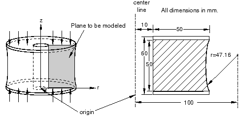

You can use axisymmetric elements for this simulation since both the geometry of the structure and the loading are axisymmetric. Therefore, you only need to model a plane through the component: each element represents a complete 360° ring. You will examine the static response of the mount; therefore, you will use Abaqus/Standard for your analysis.

## 10.7.1 Symmetry

You do not need to model the whole section of this axisymmetric component because the problem is symmetric about a horizontal line through the center of the mount. By modeling only half of the section, you can use half as many elements and, hence, approximately half the number of degrees of freedom. This significantly reduces the run time and storage requirements for the analysis or, alternatively, allows you to use a more refined mesh.

Many problems contain some degree of symmetry. For example, mirror symmetry, cyclic symmetry, axisymmetry, or repetitive symmetry (shown in Figure 10–49) are common. More than one type of symmetry may be present in the structure or component that you want to model.

**Figure 10–49** Various forms of symmetry.

When modeling just a portion of a symmetric component, you have to add boundary conditions to make the model behave as if the whole component were being modeled. You may also have to adjust the applied loads to reflect the portion of the structure actually being modeled. Consider the portal frame in Figure 10–50.

**Figure 10–50** Symmetric portal frame.

The frame is symmetric about the vertical line shown in the figure. To maintain symmetry in the model, any nodes on the symmetry line must be constrained from translating in the 1-direction and from rotating about the 2- or 3-axes.

In the frame problem the load is applied along the model's symmetry plane; therefore, only half of the total value should be applied to the portion you are modeling.

In axisymmetric analyses using axisymmetric elements, such as this rubber mount example, we need model only the cross-section of the component. The element formulation automatically includes the effects of axial symmetry.

## 10.7.2 Preprocessing—creating the model with Abaqus/CAE

Use Abaqus/CAE to create the model. Abaqus provides scripts that replicate the complete analysis model for this problem. Run one of these scripts if you encounter difficulties following the instructions given below or if you wish to check your work. Scripts are available in the following locations:

* A Python script for this example is provided in "Axisymmetric mount," Section A.10. Instructions on how to fetch the script and run it within Abaqus/CAE are given in Appendix A, "Example Files."
* A plug-in script for this example is available in the Abaqus/CAE Plug-in toolset. To run the script from Abaqus/CAE, select **Plug-ins** → **Abaqus** → **Getting Started**; highlight **Axisymmetric mount**; and click **Run**. For more information about the Getting Started plug-ins, see "Running the Getting Started with Abaqus examples," Section 82.1 of the Abaqus/CAE User's Guide.

If you do not have access to Abaqus/CAE or another preprocessor, the input file required for this problem can be created manually, as discussed in "Example: axisymmetric mount," Section 10.7 of Getting Started with Abaqus: Keywords Edition.

### Part definition

Create an axisymmetric, deformable, shell part. Name the part `Mount`, and specify an approximate part size of `0.3`. Because of symmetry considerations, only the bottom half of the mount will be modeled. You can use the following suggested approach to create the part geometry. When you first enter the sketcher, the axis of revolution is displayed as a green dashed line with a fixed position constraint; your sketch cannot cross this axis.

**To sketch the mount geometry:**

1. Draw an arbitrary rectangle to the right of the axis of symmetry. Dimension it as follows:
   a. Set the horizontal distance between the axis of symmetry and the left edge of the rectangle to 0.01 m.
   b. Set the vertical height of the rectangle to 0.030 m and its horizontal span to 0.050 m.
2. Sketch a circle using the **Create Circle: Center and Perimeter** tool . Select any point to the right of the rectangle as the center, and snap the perimeter point to any point along the right edge of the rectangle. Dimension the circle as follows:
   a. Set the horizontal distance between the axis of symmetry and the center of the circle to 0.1 m.
   b. Set the vertical distance between the center of the circle and the top-right vertex of the rectangle to 0 m.
   c. Set the vertical distance between the perimeter point (where the circle snaps to the rectangle) and the bottom-right vertex of the rectangle to 0.005 m.

   The sketch appears as shown in Figure 10–51.

   **Figure 10–51** Construction geometry used to create the part (with grid spacing doubled).

   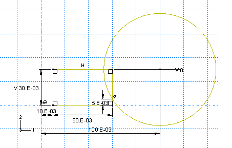

3. Use the **Auto-Trim** tool  to remove the excess portions of the sketch as shown in Figure 10–52.

   **Figure 10–52** Final part geometry (with grid spacing doubled).

   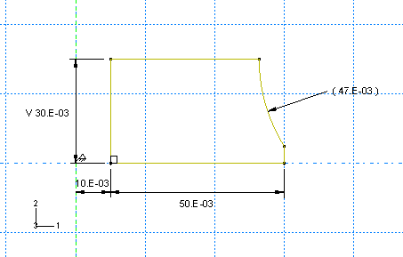

### Material properties: hyperelastic model for the rubber

You have been given some experimental test data for the rubber material used in the mount. Three different sets of test data—a uniaxial test, a biaxial test, and a planar (shear) test—are available. The data (shown in Figure 10–53 and tabulated in Table 10–5, Table 10–6, and Table 10–7) are given in terms of nominal stress and corresponding nominal strain.

> **Note:** Volumetric test data are not required when the material is incompressible (as is the case in this example).

**Figure 10–53** Material test data for the rubber material.

**Table 10–5** Uniaxial test data.

| Stress (Pa) | Strain |
|-------------|--------|
| 0.054E6     | 0.0380 |
| 0.152E6     | 0.1338 |
| 0.254E6     | 0.2210 |
| 0.362E6     | 0.3450 |
| 0.459E6     | 0.4600 |
| 0.583E6     | 0.6242 |
| 0.656E6     | 0.8510 |
| 0.730E6     | 1.4268 |

**Table 10–6** Biaxial test data.

| Stress (Pa) | Strain |
|-------------|--------|
| 0.089E6     | 0.0200 |
| 0.255E6     | 0.1400 |
| 0.503E6     | 0.4200 |
| 0.958E6     | 1.4900 |
| 1.703E6     | 2.7500 |
| 2.413E6     | 3.4500 |

**Table 10–7** Planar test data.

| Stress (Pa) | Strain |
|-------------|--------|
| 0.055E6     | 0.0690 |
| 0.324E6     | 0.2828 |
| 0.758E6     | 1.3862 |
| 1.269E6     | 3.0345 |
| 1.779E6     | 4.0621 |

When you define a hyperelastic material using experimental data, you also specify the strain energy potential that you want to apply to the data. Abaqus uses the experimental data to calculate the coefficients necessary for the specified strain energy potential. However, it is important to verify that an acceptable correlation exists between the behavior predicted by the material definition and the experimental data.

You can use the material evaluation option available in Abaqus/CAE to simulate one or more standard tests with the experimental data using the strain energy potential that you specify in the material definition.

**To define and evaluate hyperelastic material behavior:**

1. Create a hyperelastic material named `Rubber`. In this example a first-order, polynomial strain energy function is used to model the rubber material; thus, select **Polynomial** from the **Strain energy potential** list in the material editor. Enter the test data given above using the **Test Data** menu items in the material editor.

   To visualize the experimental data, click mouse button 3 on the table for any of the test data and select **Create X–Y Data** from the menu that appears. You can then plot the data in the Visualization module.

   > **Note:** In general, you may be unsure of which strain energy potential to specify. In this case, you could select **Unknown** from the **Strain energy potential** list in the material editor. You could then use the **Evaluate** option to guide your selection by performing standard tests with the experimental data using multiple strain energy potentials.

2. In the Model Tree, click mouse button 3 on **Rubber** underneath the **Materials** container. Select **Evaluate** from the menu that appears to perform the standard unit-element tests (uniaxial, biaxial, and planar). Specify a minimum strain of `0` and a maximum strain of `1.75` for each test. Evaluate only the first-order polynomial strain energy function. This form of the hyperelasticity model is known as the Mooney-Rivlin material model.

   When the evaluation is complete, Abaqus/CAE enters the Visualization module. A dialog box appears containing material parameter and stability information. In addition, an *X–Y* plot that displays a nominal stress–nominal strain curve for the material as well as a plot of the experimental data appears for each test.

The computational and experimental results for the various types of tests are compared in Figure 10–54, Figure 10–55, and Figure 10–56 (for clarity, some of the computational data points are not shown). The Abaqus/Standard and experimental results for the biaxial tension test match very well. The computational and experimental results for the uniaxial tension and planar tests match well at strains less than 100%. The hyperelastic material model created from these material test data is probably not suitable for use in general simulations where the strains may be larger than 100%. However, the model will be adequate for this simulation if the principal strains remain within the strain magnitudes where the data and the hyperelastic model fit well.

**Figure 10–54** Comparison of experimental data (solid line) and Abaqus/Standard results (dashed line): biaxial tension.

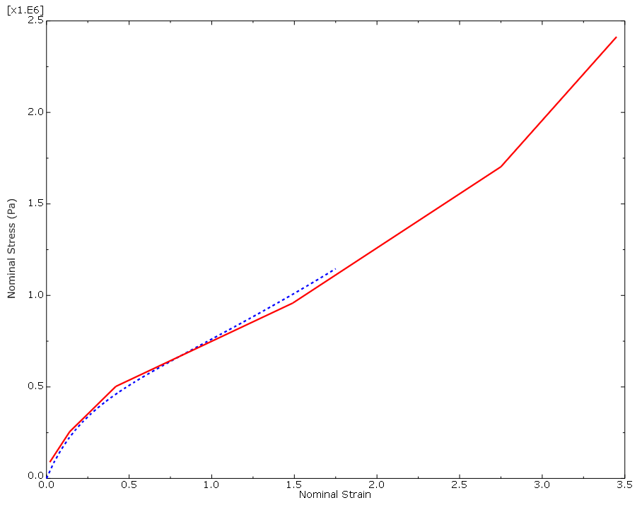

**Figure 10–55** Comparison of experimental data (solid line) and Abaqus/Standard results (dashed line): uniaxial tension.

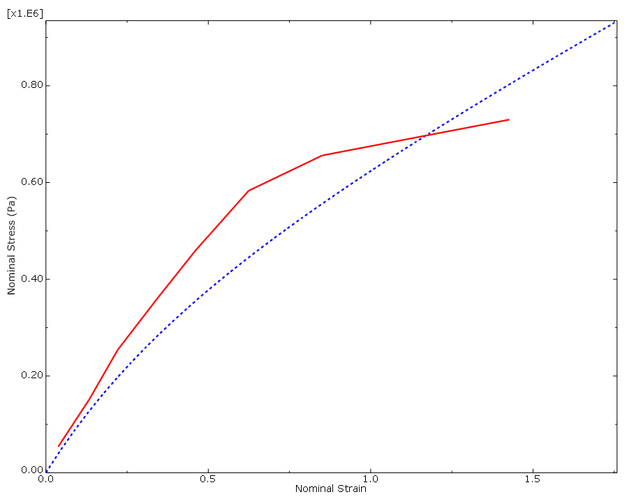

**Figure 10–56** Comparison of experimental data (solid line) and Abaqus/Standard results (dashed line): planar shear.

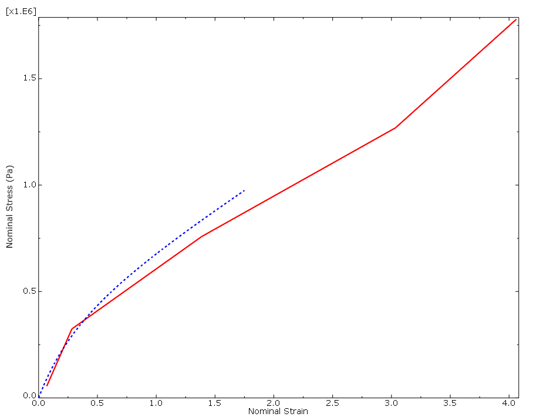

If you find that the results are beyond these magnitudes or if you are asked to perform a different simulation, you will have to insist on getting better material data. Otherwise, you will not be able to have much confidence in your results.

#### The hyperelastic material parameters

In this simulation the material is assumed to be incompressible ( = 0). To achieve this, no volumetric test data were provided. To simulate compressible behavior, you must provide volumetric test data in addition to the other test data.

The hyperelastic material coefficients—, , and —that Abaqus calculates from the material test data appear in the **Material Parameters and Stability Limit Information** dialog box, shown in Figure 10–57. The material model is stable at all strains with these material test data and this strain energy function.

**Figure 10–57** Material parameters and stability limits for the first-order polynomial strain energy function.

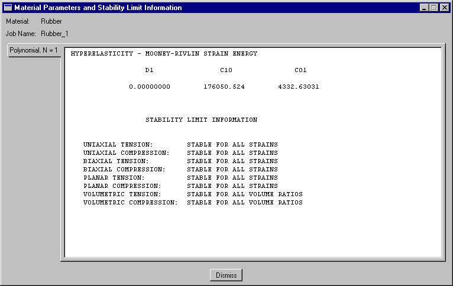

However, if you specified that a second-order (N=2) polynomial strain energy function be used, you would see the warnings shown in Figure 10–58. If you had only uniaxial test data for this problem, you would find that the Mooney-Rivlin material model Abaqus creates would have unstable material behavior above certain strain magnitudes.

**Figure 10–58** Material parameters and stability limits for the second-order polynomial strain energy function.

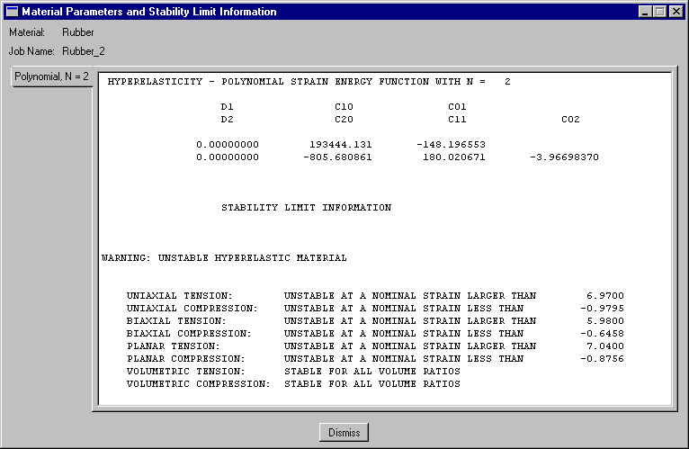

### Completing the material and section definitions and assigning section properties

The steel is modeled with linear elastic properties only ( = 200 × 10^9 Pa,  = 0.3) because the loads should not be large enough to cause inelastic deformations. Create a material named `Steel` with these properties. In addition, create two homogeneous solid section definitions: one named `RubberSection` that refers to the rubber material and one named `SteelSection` that refers to the steel material.

Before assigning section properties, partition the part into the two regions shown in Figure 10–59 using the **Partition Face: Sketch** tool.

**Figure 10–59** Partition used to divide the part into two regions.

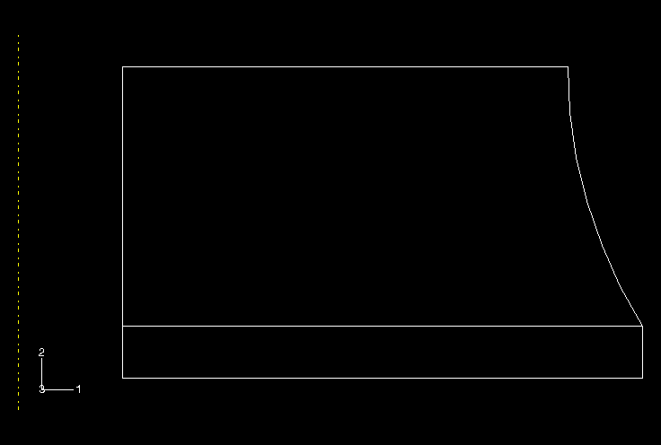

In the Sketcher, draw a horizontal line extending from the point where the circular arc intersects the right edge to any point past the left edge of the sketch.

The upper region represents the rubber mount, while the lower region represents the steel plate. Assign the appropriate section definitions to each region.

### Creating an assembly and a step definition

Create a dependent instance of the part. In this simulation you can accept the default *r–z* (1–2) axisymmetric coordinate system. Then, define a single static, general step named `Compress mount`. When hyperelastic materials are used in a model, Abaqus assumes that the model may undergo large deformations; but large deformations and other nonlinear geometric effects are not included by default in Abaqus/Standard. Therefore, you must include them in this simulation by toggling on **Nlgeom**; otherwise, Abaqus/Standard will terminate the analysis with an input error. Set the time period to `1.0` and the initial time increment to `0.01` (i.e., 1% of the total step time).

For the purpose of restricting output, create a geometry set named `Out` at the vertex located at the lower-left corner of the steel plate region.

Write the preselected variables and nominal strains as field output to the output database file every increment. In addition, write the displacements at a single point on the bottom of the steel plate to the output database file as history data so that the stiffness of the mount can be calculated. Use the geometry set `Out` for this purpose.

### Applying loads and boundary conditions

Specify boundary conditions for the region on the symmetry plane (U2 = 0 is shown in Figure 10–60; however, YSYMM would be equivalent in this case).

**Figure 10–60** Boundary conditions on the rubber mount; pressure loading on the steel plate.

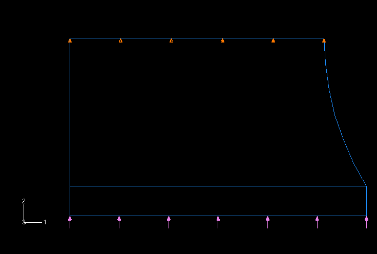

No boundary constraints are needed in the radial direction (global 1-direction) because the axisymmetric nature of the model does not allow the structure to move as a rigid body in the radial direction. Abaqus will allow nodes to move in the radial direction, even those initially on the axis of symmetry (i.e., those with a radial coordinate of 0.0), if no boundary conditions are applied to their radial displacements (degree of freedom 1). Since you want to let the mount deform radially in this analysis, do not apply any boundary conditions; again, Abaqus will prevent rigid body motions automatically.

The mount must carry a maximum axial load of 5.5 kN, spread uniformly over the steel plates. Therefore, apply a distributed load to the bottom of the steel plate, as shown in Figure 10–60. The magnitude of the pressure is given by

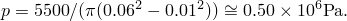

### Creating the mesh and the job

Use first-order, axisymmetric, hybrid solid elements (CAX4H) for the rubber mount. You must use hybrid elements because the material is fully incompressible. The elements are not expected to be subjected to bending, so shear locking in these fully integrated elements should not be a concern. Model the steel plates with a single layer of incompatible mode elements (CAX4I) because it is possible that the plates may bend as the rubber underneath them deforms.

Create a quadrilateral mesh. Seed the part by specifying the number of elements along the edges (by selecting **Seed** → **Edges** or the 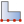 tool). Specify `30` elements along each horizontal edge, `14` elements along the vertical and curved edges of the rubber, and `1` element along the vertical edges of the steel. The mesh is shown in Figure 10–61.

**Figure 10–61** Mesh for the rubber mount.

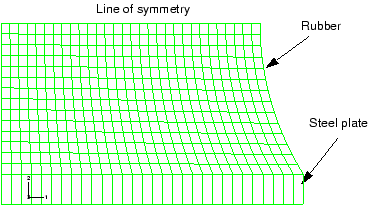

Create a job named `Mount`. Give the job the following description: `Axisymmetric mount analysis under axial loading`.

Save your model in a model database file, and submit the job for analysis. Monitor the solution progress; correct any modeling errors that are detected, and investigate and correct as necessary the cause of any warning messages.

## 10.7.3 Postprocessing

Enter the Visualization module, and open the file `Mount.odb`.

### Calculating the stiffness of the mount

Determine the stiffness of the mount by creating an *X–Y* plot of the displacement of the steel plate as a function of the applied load. You will first create a plot of the vertical displacement of the node on the steel plate for which you wrote data to the output database file. Data were written for the node in set `Out` in this model.

**To create a history curve of vertical displacement and swap the *X*- and *Y*-axes:**

1. In the Results Tree, expand the **History Output** container underneath the output database named `Mount.odb`.
2. Locate and select the vertical displacement `U2` at the node in set `Out`.
3. Click mouse button 3, and select **Save As** from the menu that appears to save the *X–Y* data.

   The **Save XY Data As** dialog box appears.
4. In the **Save XY Data As** dialog box, name the curve `SWAPPED` and select **swap(XY)** as the save operation; click **OK**.

   The plot of time-displacement appears in the viewport.

You now have a curve of time-displacement. What you need is a curve showing force-displacement. This is easy to create because in this simulation the force applied to the mount is directly proportional to the total time in the analysis. All you have to do to plot a force-displacement curve is multiply the curve `SWAPPED` by the magnitude of the load (5.5 kN).

**To multiply a curve by a constant value:**

1. In the Results Tree, double-click **XYData**.

   The **Create XY Data** dialog box appears.
2. Select **Operate on XY data**, and click **Continue**.

   The **Operate on XY Data** dialog box appears.
3. In the **XY Data** field, double-click `SWAPPED`.

   The expression `"SWAPPED"` appears in the text field at the top of the dialog box. Your cursor should be at the end of the text field.
4. Multiply the data object in the text field by the magnitude of the applied load by entering `*5500`.
5. Save the multiplied data object by clicking **Save As** at the bottom of the dialog box.

   The **Save XY Data As** dialog box appears.
6. In the **Name** text field, type `FORCEDEF`; and click **OK** to close the dialog box.
7. To view the force-displacement plot, click **Plot Expression** at the bottom of the **Operate on XY Data** dialog box.

You have now created a curve with the force-deflection characteristic of the mount (the axis labels do not reflect this since you did not change the actual variable plotted). To get the stiffness, you need to differentiate the curve `FORCEDEF`. You can do this by using the `differentiate( )` operator in the **Operate on XY Data** dialog box.

**To obtain the stiffness:**

1. In the **Operate on XY Data** dialog box, clear the current expression.
2. From the **Operators** listed, click **differentiate(X)**.

   `differentiate( )` appears in the text field at the top of the dialog box.
3. In the **XY Data** field, double-click `FORCEDEF`.

   The expression `differentiate( "FORCEDEF" )` appears in the text field.
4. Save the differentiated data object by clicking **Save As** at the bottom of the dialog box.

   The **Save XY Data As** dialog box appears.
5. In the **Name** text field, type `STIFF`; and click **OK** to close the dialog box.
6. To plot the stiffness-displacement curve, click **Plot Expression** at the bottom of the **Operate on XY Data** dialog box.
7. Click **Cancel** to close the dialog box.
8. Open the **Axis Options** dialog box, and switch to the **Title** tabbed page.
9. Customize the axis titles so they appear as shown in Figure 10–62.

   **Figure 10–62** Stiffness characteristic of the mount.

   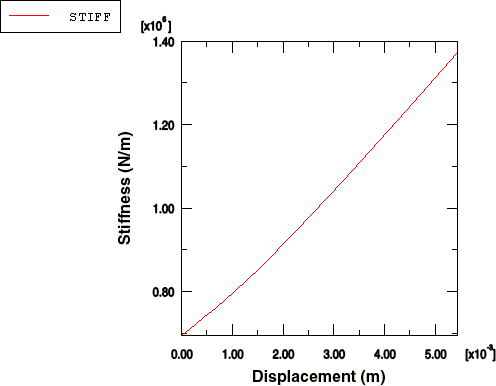

10. Click **Dismiss** to close the **Axis Options** dialog box.

The stiffness of the mount increases by almost 100% as the mount deforms. This is a result of the nonlinear nature of the rubber and the change in shape of the mount as it deforms. Alternatively, you could have created the stiffness-displacement curve directly by combining all the operators above into one expression.

**To define the stiffness curve directly:**

1. In the Results Tree, double-click **XYData**.

   The **Create XY Data** dialog box appears.
2. Select **Operate on XY data**, and click **Continue**.

   The **Operate on XY Data** dialog box appears.
3. From the **Operators** listed, click **differentiate(X)**.

   `differentiate( )` appears in the text field at the top of the dialog box.
4. In the **XY Data** field, double-click `SWAPPED`.

   The expression `differentiate( "SWAPPED" )` appears in the text field.
5. Place the cursor in the text field directly after the `"SWAPPED"` data object, and type `*5500` to multiply the swapped data by the constant total force value.

   `differentiate(  "SWAPPED"*5500  )` appears in the text field.
6. Save the differentiated data object by clicking **Save As** at the bottom of the dialog box.

   The **Save XY Data As** dialog box appears.
7. In the **Name** text field, type `STIFFNESS`; and click **OK** to close the dialog box.
8. Click **Cancel** to close the **Operate on XY Data** dialog box.
9. Customize the *X*- and *Y*-axis labels as they appear in Figure 10–62 if you have not already done so.
10. In the Results Tree, click mouse button 3 on `STIFFNESS` underneath the **XYData** container and select **Plot** from the menu that appears to view the plot in Figure 10–62 that shows the variation of the mount's axial stiffness as the mount deforms.

### Model shape plots

You will begin by plotting the undeformed model shape of the mount.

**To plot the undeformed model shape:**

From the main menu bar, select **Plot** → **Undeformed Shape**; or use the  tool in the Visualization module toolbox to plot the undeformed model shape (see Figure 10–63).

**Figure 10–63** Undeformed model shape of the rubber mount.

If the figure obscures the plot title, you can move the plot by clicking the  tool and holding down mouse button 1 to pan the deformed shape to the desired location. Alternatively, you can turn the plot title off (**Viewport** → **Viewport Annotation Options**).

In this figure the axisymmetric model is displayed as a planar, two-dimensional shape. You can producing a three-dimensional visual effect by sweeping the model through a specified angle. In addition, you can also mirror results about selected planes (such as symmetry planes) to render results on a full three-dimensional representation of the model. These are visualization aids only. Any numerical representation of the results, such as the contour legend, indicates only the portion of the model that was analyzed. Since in this problem the symmetry plane does not necessarily coincide with one of the global coordinate system planes, a local system will be defined to facilitate the mirroring operation.

**To define a local coordinate system for postprocessing:**

1. From the main menu bar, select **Tools** → **Coordinate System** → **Create**.
2. In the **Create Coordinate System** dialog box, enter `rectangular` as the name and click **Continue**.
3. Select the node at the top-left corner of the model as the origin, the node at the top-right corner as the point on the *X*-axis, and the node at the bottom-left corner as the point in the *X–Y* plane.

**To mirror and sweep the cross-section:**

1. From the main menu bar, select **View** → **ODB Display Options**.
2. In the **ODB Display Options** dialog box, click the **Mirror/Pattern** tab.
3. Select **rectangular** from the **Mirror CSYS** list.
4. Select **XZ** as the mirror plane.
5. Click **Apply**.

   The mirrored image appears.
6. Click the **Sweep/Extrude** tab.
7. Toggle on **Sweep elements** and set the sweep range from `0` to `270` degrees. Set the number of segments to `45`.
8. Click **OK**.

   The swept image appears. To more clearly distinguish between the rubber and the steel, color code the model based on section assignment.

You will now plot the deformed model shape of the mount. This will allow you to evaluate the quality of the deformed mesh and to assess the need for mesh refinement.

**To plot the deformed model shape:**

From the main menu bar, select **Plot** → **Deformed Shape**, or use the  tool to plot the deformed model shape of the mount (see Figure 10–64).

**Figure 10–64** Deformed model shape of the rubber under an applied load of 5500 N (mirrored/swept image).

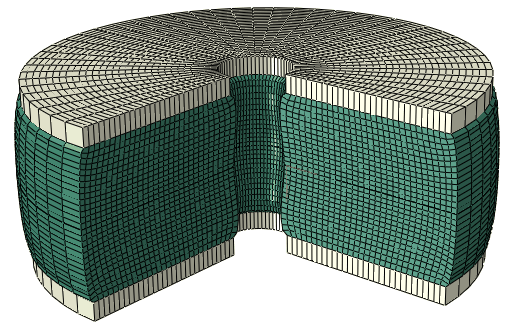

The plate has been pushed up, causing the rubber to bulge at the sides. Zoom in on the bottom left corner of the mesh using the  tool from the **View Manipulation** toolbar. Click mouse button 1, and hold it down to define the first corner of the new view; move the mouse to create a box enclosing the viewing area that you want (Figure 10–65); and release the mouse button. Alternatively, you can zoom and pan the plot by selecting **View** → **Specify** from the main menu bar.

You should have a plot similar to the one shown in Figure 10–65 (in this and the images that follow, the sweep and mirroring operations applied earlier have been suppressed).

**Figure 10–65** Distortion at the left-hand corner of the rubber mount model.

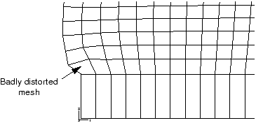

Some elements in this corner of the model are becoming badly distorted because the mesh design in this area was inadequate for the type of deformation that occurs there. Although the shape of the elements is fine at the start of the analysis, they become badly distorted as the rubber bulges outward, especially the element in the corner. If the loading were increased further, the element distortion may become so excessive that the analysis may abort. "Mesh design for large distortions," Section 10.8, discusses how to improve the mesh design for this problem.

The keystoning pattern exhibited by the distorted elements in the bottom right-hand corner of the model indicates that they are locking. A contour plot of the hydrostatic pressure stress in these elements (without averaging across elements sharing common nodes) shows rapid variation in the pressure stress between adjacent elements. This indicates that these elements are suffering from volumetric locking, which was discussed earlier in "Selecting elements for elastic-plastic problems," Section 10.3, in the context of plastic incompressibility. Volumetric locking arises in this problem from overconstraint. The steel is very stiff compared to the rubber. Thus, along the bond line the rubber elements cannot deform laterally. Since these elements must also satisfy incompressibility requirements, they are highly constrained and locking occurs. Analysis techniques that address volumetric locking are discussed in "Techniques for reducing volumetric locking," Section 10.9.

### Contouring the maximum principal stress

Plot the maximum in-plane principal stress in the model. Follow the procedure given below to create a filled contour plot on the actual deformed shape of the mount with the plot title suppressed.

**To contour the maximum principal stress:**

1. By default, Abaqus/CAE displays **S**, **Mises** as the primary field output variable. In the **Field Output** toolbar, select **Max. Principal** as the invariant.

   Abaqus/CAE automatically changes the current plot state to display a contour plot of the maximum in-plane principal stresses on the deformed model shape.
2. Open the **Contour Plot Options** dialog box.
3. Drag the uniform contour intervals slider to `8`.
4. Click **OK** to view the contour plot and to close the dialog box.

   Create a display group showing only the elements in the rubber mount.
5. In the Results Tree, expand the **Materials** container underneath the output database file named `Mount.odb`.
6. Click mouse button 3 on **RUBBER**, and select **Replace** from the menu that appears to replace the current display with the selected elements.
7. The viewport display changes and displays only the rubber mount elements, as shown in Figure 10–66.

   **Figure 10–66** Contours of maximum principal stress in the rubber mount.

   

The maximum principal stress in the model, reported in the contour legend, is 136 kPa. Although the mesh in this model is fairly refined and, thus, the extrapolation error should be minimal, you may want to use the query tool  to determine the more accurate integration point values of the maximum principal stress.

When you look at the integration point values, you will discover that the peak value of maximum principal stress occurs in one of the distorted elements in the bottom right-hand part of the model. This value is likely to be unreliable because of the levels of element distortion and volumetric locking. If this value is ignored, there is an area near the plane of symmetry where the maximum principal stress is around 88.2 kPa.

The easiest way to check the range of the principal strains in the model is to display the maximum and minimum values in the contour legend.

**To check the principal nominal strain magnitude:**

1. From the main menu bar, select **Viewport** → **Viewport Annotation Options**.

   The **Viewport Annotation Options** dialog box appears.
2. Click the **Legend** tab, and toggle on **Show min/max values**.
3. Click **OK**.

   The maximum and minimum values appear at the bottom of the contour legend in the viewport.
4. In the **Field Output** toolbar, select **Primary** as the variable type if it is not already selected.

   Abaqus/CAE automatically changes the current plot state to display a contour plot of the maximum in-plane principal stresses on the deformed model shape.
5. From the list of output variables, select **NE**.
6. From the list of invariants in the **Field Output** toolbar, select **Max. Principal** if it is not already selected.

   The contour plot changes to display values for maximum principal nominal strain. Note the value of the maximum principal nominal strain from the contour legend.
7. From the list of invariants, select **Min. Principal**.

   The contour plot changes to display values for minimum principal nominal strain. Note the value of the minimum principal nominal strain from the contour legend.

The maximum and minimum principal nominal strain values indicate that the maximum tensile nominal strain in the model is about 100% and the maximum compressive nominal strain is about 56%. Because the nominal strains in the model remained within the range where the Abaqus hyperelasticity model has a good fit to the material data, you can be fairly confident that the response predicted by the mount is reasonable from a material modeling viewpoint.
