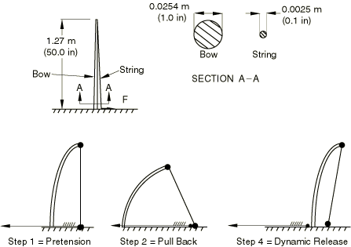

# 11.2 Linear perturbation analysis

---

*Linear perturbation analysis steps are available only in Abaqus/Standard.*

The starting point for a linear perturbation step is called the base state of the model. If the first step in a simulation is a linear perturbation step, the base state is the state of the model specified using initial conditions. Otherwise, the base state is the state of the simulation at the end of the last general step prior to the linear perturbation step. Although the response of the structure during the perturbation step is by definition linear, the model may have a nonlinear response in previous general steps. For models with a nonlinear response in the prior general steps, Abaqus/Standard uses the current elastic modulus as the linear stiffness for perturbation procedures. This modulus is the initial elastic modulus for elastic-plastic materials and the tangent modulus for hyperelastic materials (see [Figure 11–2](#gss-tangentmod)); the moduli used for other material models are described in ["General and linear perturbation procedures," Section 6.1.3 of the Abaqus Analysis User's Guide](../usb/usb-link.htm#usb-anl-alinearnonlinear).

**Figure 11–2** For hyperelastic materials the tangent modulus is used as the stiffness in linear perturbation steps that occur after general, nonlinear steps.

The loads in the perturbation step should be sufficiently small that the model's response would not deviate much from that predicted with the tangent modulus. If the simulation includes contact, the contact state between two surfaces does not change during a perturbation step: points that were closed in the base state remain closed, and points that were open remain open.

## 11.2.1 Time in linear perturbation steps

If another general step follows a perturbation step, Abaqus/Standard uses the state of the model at the end of the last general step as its starting point, not the state of the model at the end of the perturbation step. Thus, the response from a linear perturbation step has no permanent effect on the simulation. Therefore, Abaqus/Standard does not include the step time of linear perturbation steps in the total time for the analysis. In fact, what Abaqus/Standard actually does is to define the step time of a perturbation step to be very small (10^‑36) so that it has no effect when it is added to the total accumulated time. The exception to this rule is the modal dynamics procedure.

## 11.2.2 Specifying loads in linear perturbation steps

Loads and prescribed boundary conditions given in linear perturbation steps are always local to that step. The load magnitudes (including the magnitudes of prescribed boundary conditions) given in a linear perturbation step are always the perturbation (increment) of the load, not the total magnitude. Likewise, the value of any solution variable is output as the perturbation value only—the value of the variable in the base state is not included.

As an example of a simple load history that includes a mixture of general and perturbation steps, consider the bow and arrow shown in [Figure 11–3](#iusing-bow-arrow). **Figure 11–3** Simple bow and arrow.

Step 1 might be to string the bow—to pretension the bowstring. Step 2 would then follow this by pulling back the string with an arrow, thus storing more strain energy in the system. Step 3 might then be a linear perturbation analysis step: an eigenvalue frequency analysis to investigate the natural frequencies of the loaded system. Such a step might also have been included between Steps 1 and 2, to find the natural frequencies of the bow and string just after the string is pretensioned but before it is pulled back to shoot. Step 4 is then a nonlinear dynamic analysis, in which the bowstring is released, so that the strain energy that was stored in the system by pulling back the bowstring in Step 2 imparts kinetic energy to the arrow and causes it to leave the bow. This step thus continues to develop the nonlinear response of the system, but now with dynamic effects included.

In this case it is obvious that each nonlinear general analysis step must use the state at the end of the previous nonlinear general analysis step as its initial condition. For example, the dynamic part of the history has no loading—the dynamic response is caused by the release of some of the strain energy stored in the static steps. This effect introduces a natural order dependency in the model: nonlinear general analysis steps follow one another, in the order in which the events they define occur, with linear perturbation analysis steps inserted at the appropriate times in this sequence to investigate the linear behavior of the system at those times.

A more complex load history is illustrated in [Figure 11–4](#gss-sink), which shows a schematic representation of the steps in the manufacture and use of a stainless steel sink. **Figure 11–4** Steps in the manufacture and use of a sink.

The sink is formed from sheet steel using a punch, a die, and a blank holder. This forming simulation will consist of a number of general steps. Typically, the first step may involve the application of blank holder pressure, and the punching operation will be simulated in the second step. The third step will involve the removal of the tooling, allowing the sink to spring back into its final shape. Each of these steps is a general step since together they model a sequential load history, where the starting condition for each step is the ending condition from the previous step. These steps obviously include many nonlinear effects (plasticity, contact, large deformations). At the end of the third step, the sink will contain residual stresses and inelastic strains caused by the forming process. Its thickness will also vary as a direct result of the manufacturing process.

The sink is then installed: boundary conditions would be applied around the edge of the sink where it is attached to the worktop. The response of the sink to a number of different loading conditions may be of interest and has to be simulated. For example, a simulation may need to be performed to ensure that the sink does not break if someone stands on it. Step 4 would, therefore, be a linear perturbation step analyzing the static response of the sink to a local pressure load. Remember that the results from Step 4 will be perturbations from the state of the sink after the forming process; do not be surprised, for example, if the displacement of the center of the sink in this step is say only 2 mm, but you know that the sink deformed much more than that since the start of the forming simulation. This hypothetical 2 mm deflection is just the additional deformation from the sink's final configuration after the forming process (i.e., the end of Step 3) caused by the weight of the person. The total deflection, measured from the undeformed sheet's configuration, is the sum of this 2 mm and the deflection at the end of Step 3.

The sink may also be fitted with a waste disposal unit, so its steady-state dynamic response to a harmonic load at certain frequencies must be simulated. Step 5 would, therefore, be a second linear perturbation step using the direct steady-state dynamics procedure with a load applied at the point of attachment of the disposal unit. The base state for this step is the state at the end of the previous general step—that is, at the end of the forming process (Step 3). The response in the previous perturbation step (Step 4) is ignored. The two perturbation steps are, therefore, separate, independent simulations of the sink's response to loads applied to the base state of the model.

If another general step is included in the analysis, the condition of the structure at the start of the step is that at the end of the previous general step (Step 3). Step 6 could, therefore, be a general step with loads modeling the sink being filled with water. The response in this step may be linear or nonlinear. Following this general step, Step 7 could be a simulation repeating the analysis performed in Step 4. However, in this case the base state (the state of the structure at the end of the previous general step) is the state of the model at the end of Step 6. Therefore, the response will be that of a full sink, rather than an empty one. Performing another steady-state dynamics simulation would produce inaccurate results because the mass of the water, which would change the response considerably, would not be considered in the analysis.

The following procedures in Abaqus/Standard are always linear perturbation steps:

* linear eigenvalue buckling,
* frequency extraction,
* transient modal dynamics,
* random response,
* response spectrum, and
* steady-state dynamics.

The static procedure can be either a general or linear perturbation procedure.
