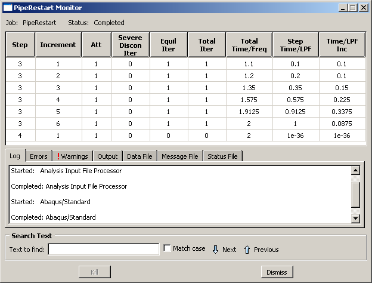
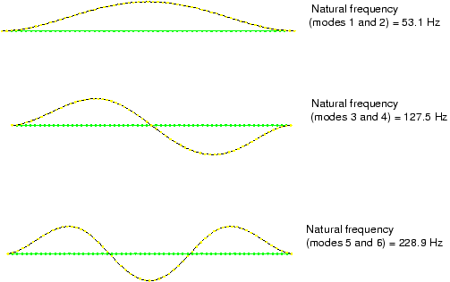
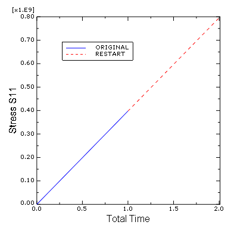

# 11.5 Example: restarting the pipe vibration analysis

To demonstrate how to restart an analysis, take the pipe section example in ["Example: vibration of a piping system," Section 11.3](ch11s03.html), and restart the simulation, adding two additional steps of load history. The first simulation predicted that the piping section would be vulnerable to resonance when extended axially; you must now determine how much additional axial load will increase the pipe's lowest vibrational frequency to an acceptable level.

Step 3 will be a general step that increases the axial load on the pipe to 8 MN, and Step 4 will calculate the eigenmodes and eigenfrequencies again.

## 11.5.1 Creating a restart analysis model

Open the model database file `Pipe.cae` (if it is not already open). Copy the model named `Original` to a model named `Restart`. The modifications to this model are discussed next. If you do not have access to Abaqus/CAE or another preprocessor, the input file required for this problem can be created manually, as discussed in ["Example: restarting the pipe vibration analysis," Section 11.5 of Getting Started with Abaqus: Keywords Edition](../gsk/gsk-link.htm#gsk-gen-stp-exapipevibanal).

**Model attributes**

To perform a restart analysis, the model's attributes must be changed to indicate that the model should reuse data from a previous analysis. In the Model Tree, double-click the **Restart** model underneath the **Models** container. In the **Edit Model Attributes** dialog box that appears, specify that restart data will be read from the job `Pipe` and that the restart location will be the end of step `Frequency I`.

**Step definitions**

You will now create two new analysis steps. The first new step is a general static step; name the step `Pull II`, and insert it immediately after the step `Frequency I`. Give the step the following description: `Apply axial tensile load of 8.0 MN`; and set the time period for the step to `1.0` and the initial time increment to `0.1`.

The second new step is a frequency extraction step; name the step `Frequency II`, and insert it immediately after the step `Pull II`. Give the step the following description: `Extract modes and frequencies`; and use the Lanczos eigensolver to extract the first `8` natural modes and frequencies of the pipe.

**Output requests**

For the step `Pull II`, write data to the restart file every 10 increments.

Accept all other default output data requests.

**Load definition**

Modify the load definition so that the tensile load that is applied to the pipe is doubled in the second general static step (`Pull II`). To do this, expand the **Force** item underneath the **Loads** container in the Model Tree. In the list that appears, expand the **States** item. Double-click the step named **Pull II**, and change the value of the applied force to `8.0E+06` in this step.

**Job definition**

Create a job named `PipeRestart` with the following description: `Restart analysis of a 5 meter long pipe under tensile load`. Set the job type to **Restart** if it is not already. (If the job type is not set to **Restart**, Abaqus/CAE ignores the model's restart attributes.)

Save your model in a model database file, and submit the job for analysis. Monitor the solution progress; correct any modeling errors and investigate the source of any warning messages, taking corrective action as necessary.

## 11.5.2 Monitoring the job

Again, check the **Job Monitor** as the job is running. When the analysis completes, its contents will look similar to [Figure 11-10](#gsi-pipe-restart-monitor).

**Figure 11-10** **Job Monitor**: restart pipe vibration analysis.

This analysis starts at Step 3 since Steps 1 and 2 were completed in the previous analysis. There are now two output database (`.odb`) files associated with this simulation. Data for Steps 1 and 2 are in the file `Pipe.odb`; data for Steps 3 and 4 are in the file `PipeRestart.odb`. When plotting results, you need to remember which results are stored in each file, and you need to ensure that Abaqus/CAE is using the correct output database file.

## 11.5.3 Postprocessing the restart analysis results

Switch to the Visualization module, and open the output database file from the restart analysis, `PipeRestart.odb`.

**Plotting the eigenmodes of the pipe**

Plot the same six eigenmode shapes of the pipe section for this simulation as were plotted in the previous analysis. The eigenmode shapes can be plotted using the procedures described for the original analysis. These eigenmodes and their natural frequencies are shown in [Figure 11-11](#gss-internalpress); again, the corresponding mode shapes lie in planes orthogonal to each other.

**Figure 11-11** Shapes and frequencies of eigenmodes 1 through 6 with 8 MN tensile load.

Under 8 MN of axial load, the lowest mode is now at 53.1 Hz, which is greater than the required minimum of 50 Hz. If you want to find the exact load at which the lowest mode is just above 50 Hz, you can repeat this restart analysis and change the value of the applied load.

**Plotting X-Y graphs from field data for selected steps**

Use the field data stored in the output database files, `Pipe.odb` and `PipeRestart.odb`, to plot the history of the axial stress in the pipe for the whole simulation.

**To generate a history plot of the axial stress in the pipe for the restart analysis:**

1. In the Results Tree, double-click **XYData**.

   The **Create XY Data** dialog box appears.

2. Select **ODB field output** from this dialog box, and click **Continue** to proceed.

   The **XY Data from ODB Field Output** dialog box appears.

3. In the **Variables** tabbed page of this dialog box, accept the default selection of `Integration Point` for the variable position and select **S11** from the list of available stress components.

4. At the bottom of the dialog box, toggle **Select** for the section point and click **Settings** to choose a section point.

5. In the **Field Report Section Point Settings** dialog box that appears, select the category `beam` and choose any of the available section points for the pipe cross-section. Click **OK** to exit this dialog box.

6. In the **Elements/Nodes** tabbed page of the **XY Data from ODB Field Output** dialog box, select **Element labels** as the selection **Method**. There are 30 elements in the model, and they are numbered consecutively from 1 to 30. Enter any element number (for example, `25`) in the **Element labels** text field that appears on the right side of the dialog box.

7. Click **Active Steps/Frames**, and select `Pull II` as the only step from which to extract data.

8. At the bottom of the **XY Data from ODB Field Output** dialog box, click **Plot** to see the history of axial stress in the element.

The plot traces the axial stress history at each integration point of the element in the restart analysis. Since the restart is a continuation of an earlier job, it is often useful to view the results from the entire (original and restarted) analysis.

**To generate a history plot of the axial stress in the pipe for the entire analysis:**

1. Save the current plot by clicking **Save** at the bottom of the **XY Data from ODB Field Output** dialog box. Two curves are saved (one for each integration point), and default names are given to the curves.

2. Rename either curve `RESTART`, and delete the other curve.

3. From the main menu bar, select **File** → **Open**; or use the  tool in the **File** toolbar to open the file `Pipe.odb`.

4. Following the procedure outlined above, save the plot of the axial stress history for the same element and integration/section point used above. Name this plot `ORIGINAL`.

5. In the Results Tree, expand the **XYData** container.

   The `ORIGINAL` and `RESTART` curves are listed underneath.

6. Select both plots with **[Ctrl]+Click**. Click mouse button 3, and select **Plot** from the menu that appears to create a plot of axial stress history in the pipe for the entire simulation.

7. To change the style of the line, open the **Curve Options** dialog box.

8. For the `RESTART` curve, select a dotted line style.

9. Click **Dismiss** to close the dialog box.

10. To change the axis titles, open the **Axis Options** dialog box.

    In this dialog box, switch to the **Title** tabbed page.

11. Change the *X*-axis title to `TOTAL TIME`, and change the *Y*-axis title to `STRESS S11`.

12. Click **Dismiss** to close the dialog box.

The plot created by these commands is shown in [Figure 11-12](#gss-history-v). The axial stress history of the same element during Step 3 can be plotted by itself by selecting only the `RESTART` curve (see [Figure 11-13](#gss-hist-step3-v)).

**Figure 11-12** History of axial stress in the pipe.

**Figure 11-13** History of axial stress in the pipe during Step 3.

