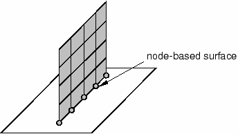
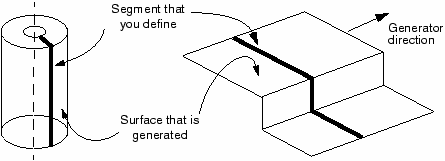

# 12.2 Defining surfaces

Surfaces are created from the element faces of the underlying material. The discussion that follows assumes that the surfaces will be defined in Abaqus/CAE. Restrictions on the types of surfaces that can be created in Abaqus are discussed in "Surface definition," Section 2.3 of the Abaqus Analysis User's Guide; please read them before beginning a contact simulation.

### Surfaces on continuum elements

For two- and three-dimensional solid continuum elements you specify which regions of a part form the contact surface by selecting the regions of a part instance in the viewport.

### Surfaces on structural, surface, and rigid elements

There are four ways to define surfaces on structural, surface, and rigid elements: using single-sided surfaces, double-sided surfaces, edge-based surfaces, and node-based surfaces.

Using single-sided surfaces, you specify which side of the element forms the contact surface. The side in the direction of the positive element normal is called **SPOS**, while the side in the direction of the negative element normal is called **SNEG**, as shown in Figure 12-1. The connectivity of an element defines the positive element normal, as discussed in Chapter 5, "Using Shell Elements." The positive element normals can be viewed in Abaqus/CAE.

**Figure 12-1** Surfaces on a two-dimensional shell or rigid element.

Double-sided contact surfaces are more general because both the SPOS and SNEG faces and all free edges are included automatically as part of the contact surface. Contact can occur on either face or on the edges of the elements forming the double-sided surface. For example, a slave node can start on one side of a double-sided surface and then travel around the perimeter to the other side during the course of an analysis. Currently, double-sided surfaces can be defined only on three-dimensional shell, membrane, surface, and rigid elements. In Abaqus/Explicit the general contact algorithm and self-contact in the contact pair algorithm enforce contact on both sides of all shell, membrane, surface, and rigid surface facets, even if they are defined as single-sided. Double-sided contact surfaces cannot be used with the default contact formulation in Abaqus/Standard, but they can be used with certain optional contact formulations; see "Defining contact pairs in Abaqus/Standard," Section 36.3.1 of the Abaqus Analysis User's Guide, for more information.

Edge-based surfaces consider contact on the perimeter edges of the model. They can be used to model contact on a shell edge, for example. Alternatively, node-based surfaces, which define contact between a set of nodes and a surface, can be used to achieve the same effect, as shown in Figure 12-2.

**Figure 12-2** Node-based region for contact on a shell edge.

### Rigid surfaces

Rigid surfaces are the surfaces of rigid bodies. They can be defined as an analytical shape, or they can be based on the underlying surfaces of elements associated with the rigid body.

Analytical rigid surfaces have three basic forms. In two dimensions the specific form of an analytical rigid surface is a two-dimensional, segmented rigid surface. The cross-section of the surface is defined in the two-dimensional plane of the model using straight lines, circular arcs, and parabolic arcs. The cross-section of a three-dimensional rigid surface is defined in a user-specified plane in the same manner used for two-dimensional surfaces. Then, this cross-section is swept around an axis to form a surface of revolution or extruded along a vector to form a long three-dimensional surface as shown in Figure 12-3.

**Figure 12-3** Analytical rigid surfaces.

The benefit of analytical rigid surfaces is that they are defined by only a small number of geometric points and are computationally efficient. However, in three dimensions the range of shapes that can be created with them is limited.

Discretized rigid surfaces are based on the underlying elements that make up a rigid body; thus, they can be more geometrically complex than analytical rigid surfaces. Discretized rigid surfaces are defined in exactly the same manner as surfaces on deformable bodies.
