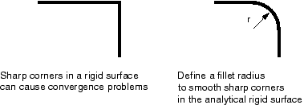
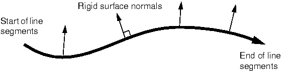

**12.5 Modeling issues for rigid surfaces in Abaqus/Standard**

There are a number of issues that you should consider when modeling contact problems in Abaqus/Standard that involve rigid surfaces. These issues are discussed in detail in "Common difficulties associated with contact modeling in Abaqus/Standard," Section 39.1.2 of the Abaqus Analysis User's Guide; but some of the more important issues are described here.

* The rigid surface is always the master surface in a contact interaction.
* The rigid surface should be large enough to ensure that slave nodes do not slide off and "fall behind" the surface. If this happens, the solution usually will fail to converge. Extending the rigid surface or including corners along the perimeter (see Figure 12-10) will prevent slave nodes from falling behind the master surface.

**Figure 12-10** Extending rigid surfaces to prevent convergence problems.

* The deformable mesh must be refined enough to interact with any feature on the rigid surface. There is no point in having a 10 mm wide feature on the rigid surface if the deformable elements that will contact it are 20 mm across: the rigid feature will just penetrate into the deformable surface as shown in Figure 12-11.

**Figure 12-11** Modeling small features on the rigid surface.

With a sufficiently refined mesh on the deformable surface, Abaqus/Standard will prevent the rigid surface from penetrating the slave surface.

* The contact algorithm in Abaqus/Standard requires the master surface of a contact interaction to be smooth. Rigid surfaces are always the master surface and so should always be smoothed. Abaqus/Standard does not smooth discrete rigid surfaces. The level of refinement controls the smoothness of a discrete rigid surface. Analytical rigid surfaces can be smoothed by defining a fillet radius that is used to smooth any sharp corners in the rigid surface definition (see Figure 12-12).

**Figure 12-12** Smoothing an analytical rigid surface.

* The rigid surface normal must always point toward the deformable surface with which it will interact. If it does not, Abaqus/Standard will detect severe overclosures at all of the nodes on the deformable surface; the simulation will probably terminate due to convergence difficulties.

The normals for an analytical rigid surface are defined as the directions obtained by the 90° counterclockwise rotation of the vectors from the beginning to the end of each line and circular segment forming the surface (see Figure 12-13).

**Figure 12-13** Normals for an analytical rigid surface.

The normals for a rigid surface created from rigid elements are defined by the faces specified when creating the surface.
