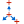

# 12.6 Abaqus/Standard 2D example: forming a channel

This simulation of the forming of a channel in a long metal sheet illustrates the use of rigid surfaces and some of the more complex techniques often required for a successful contact analysis in Abaqus/Standard.

The problem consists of a strip of deformable material, called the blank, and the tools—the punch, die, and blank holder—that contact the blank. The tools are modeled as (analytical) rigid surfaces because they are much stiffer than the blank. Figure 12–14 shows the basic arrangement of the components.

**Figure 12–14** Forming analysis.

The blank is 1 mm thick and is squeezed between the blank holder and the die. The blank holder force is 440 kN. This force, in conjunction with the friction between the blank and blank holder and the blank and die, controls how the blank material is drawn into the die during the forming process. You have been asked to determine the forces acting on the punch during the forming process. You also must assess how well the channel is formed with these particular settings for the blank holder force and the coefficient of friction between the tools and blank.

A two-dimensional, plane strain model will be used. The assumption that there is no strain in the out-of-plane direction of the model is valid if the structure is long in this direction. Only half of the channel needs to be modeled because the forming process is symmetric about a plane along the center of the channel.

The model will use contact pairs rather than general contact, since general contact is not available for analytical rigid surfaces in Abaqus/Standard.

The dimensions of the various components are shown in Figure 12–15.

**Figure 12–15** Dimensions, in m, of the components in the forming simulation.

## 12.6.1 Preprocessing—creating the model with Abaqus/CAE

Use Abaqus/CAE to create the model. Abaqus provides scripts that replicate the complete analysis model for this problem. Run one of these scripts if you encounter difficulties following the instructions given below or if you wish to check your work. Scripts are available in the following locations:

- A Python script for this example is provided in "Forming a channel," Section A.12. Instructions on how to fetch the script and run it within Abaqus/CAE are given in Appendix A, "Example Files."
- A plug-in script for this example is available in the Abaqus/CAE Plug-in toolset. To run the script from Abaqus/CAE, select **Plug-ins** → **Abaqus** → **Getting Started**; highlight **Forming a channel**; and click **Run**. For more information about the Getting Started plug-ins, see "Running the Getting Started with Abaqus examples," Section 82.1 of the Abaqus/CAE User's Guide.

If you do not have access to Abaqus/CAE or another preprocessor, the input file required for this problem can be created manually, as discussed in "Abaqus/Standard 2D example: forming a channel," Section 12.5 of Getting Started with Abaqus: Keywords Edition.

### Part definition

Start Abaqus/CAE (if you are not already running it). You will have to create four parts: a deformable part representing the blank and three rigid parts representing the tools.

#### Deformable blank

Create a two-dimensional, deformable solid part with a planar shell base feature to represent the deformable blank. Use an approximate part size of `0.25`, and name the part `Blank`. To define the geometry, sketch a rectangle of arbitrary dimensions using the connected lines tool. Then, dimension the horizontal and vertical lengths of the rectangle, and edit the dimensions to define the part geometry precisely. The final sketch is shown in Figure 12–16.

**Figure 12–16** Sketch of the deformable blank (with grid spacing doubled).

#### Rigid tools

You must create a separate part for each rigid tool. Each of these parts will be created using very similar techniques so it is sufficient to consider the creation of only one of them (for example, the punch) in detail. Create a two-dimensional planar, analytical rigid part with a wire base feature to represent the rigid punch. Use an approximate part size of `0.25`, and name the part `Punch`. Using the **Create Lines** and **Create Fillet** tools, sketch the geometry of the part. Create and edit the dimensions as necessary to define the geometry precisely. The final sketch is shown in Figure 12–17.

**Figure 12–17** Sketch of the rigid punch (with grid spacing doubled).

A rigid body reference point must be created. Exit the Sketcher when you are finished defining the part geometry to return to the Part module. From the main menu bar, select **Tools** → **Reference Point**. In the viewport, select the point at the center of the arc as the rigid body reference point.

Next, create two additional analytical rigid parts named `Holder` and `Die`, representing the blank holder and rigid die, respectively. Since the parts are mirror images of each other, the easiest way to define the geometry of the new parts is to rotate the sketch created for the punch. (The **Copy Part** tool cannot be used to mirror analytical rigid parts.) For example, edit the punch feature section sketch, and save this sketch with the name `Punch`. Then, create a part named `Holder`, and add the `Punch` sketch to the part definition. Mirror the sketch about the vertical edge. Finally, create a part named `Die`, and add the `Punch` sketch to the part definition. In this case mirror the sketch twice: first about the vertical edge and then about the horizontal edge. Be sure to create a reference point at the center of the arc on each part.

### Material and section properties

The blank is made from a high-strength steel (elastic modulus of 210.0 × 10^9 Pa, ν = 0.3). Its inelastic stress-strain behavior is tabulated in Table 12–1 and shown in Figure 12–18. The material undergoes considerable work hardening as it deforms plastically. It is likely that plastic strains will be large in this analysis; therefore, hardening data are provided up to 50% plastic strain.

**Table 12–1** Yield stress–plastic strain data.

| Yield stress (Pa) | Plastic strain |
|-------------------|----------------|
| 400.0E6           | 0.0            |
| 420.0E6           | 2.0E-2         |
| 500.0E6           | 20.0E-2        |
| 600.0E6           | 50.0E-2        |

**Figure 12–18** Yield stress vs. plastic strain.

Create a material named `Steel` with these properties. Create a homogeneous solid section named `BlankSection` that refers to the material `Steel`. Assign the section to the blank.

The blank is going to undergo significant rotation as it deforms. Reporting the values of stress and strain in a coordinate system that rotates with the blank's motion will make it much easier to interpret the results. Therefore, a local material coordinate system that is aligned initially with the global coordinate system but moves with the elements as they deform should be created. To do this, create a rectangular datum coordinate system using the **Create Datum CSYS: 3 Points**  tool. From the main menu bar of the Property module, select **Assign** → **Material Orientation**. Select the blank as the region to which the local material orientation will be assigned, and pick the datum coordinate system in the viewport as the **CSYS** (select **Axis 3** and accept **None** for the additional rotation options).

### Assembling the parts

You will now create an assembly of part instances to define the analysis model. Begin by instancing the blank. Then, instance and position the rigid tools using the techniques described below.

**To instance and position the punch:**

1. In the Model Tree, double-click **Instances** underneath the **Assembly** container and select `Punch` as the part to instance.

   Two-dimensional plane strain models must be defined in the global 1–2 plane. Therefore, do not rotate the parts after they have been instanced. You may, however, place the origin of the model at any convenient location. The 1-direction will be normal to the symmetry plane.

2. The bottom of the punch initially rests on top of the blank, as indicated in Figure 12–15. From the main menu bar, select **Constraint** → **Edge to Edge** to position the punch vertically with respect to the blank.

3. Choose the horizontal edge of the punch as the straight edge of the movable instance and the edge on the top of the blank as the straight edge of the fixed instance.

   Arrows appear on both instances. The punch will be moved so that its arrow points in the same direction as the arrow on the blank.

4. If necessary, click **Flip** in the prompt area to reverse the direction of the arrow on the punch so that both arrows point in the same direction; otherwise, the punch will be flipped. When both arrows point in the same direction, click **OK**.

5. Enter a distance of `0.0` m to specify the separation between the instances.

   The punch is moved in the viewport to the specified location. Click the **Auto-fit** tool  so that the entire assembly is rescaled to fit in the viewport.

6. The vertical edge of the punch is 0.05 m from the left edge of the blank, as shown in Figure 12–15. Define another **Edge to Edge** constraint to position the punch horizontally with respect to the blank.

   Select the vertical edge of the punch as the straight edge of the movable instance and the left edge of the blank as the straight edge of the fixed instance. Flip the arrow on the punch if necessary so that both arrows point in the same direction. Enter a distance of −0.05 m to specify the separation between the edges. (A negative distance is used since the offset is applied in the direction of the edge normal. The edge normal points away from the edge of the blank.)

   Now that you have positioned the punch relative to the blank, check to make sure that the left end of the punch extends beyond the left edge of the blank. This is necessary to prevent any nodes associated with the blank from "falling off" the rigid surface associated with the punch during the contact calculations. If necessary, return to the Part module and edit the part definition to satisfy this requirement.

#### To instance and position the blank holder:

The procedure for instancing and positioning the holder is very similar to that used to instance and position the punch. Referring to Figure 12–15, we see that the holder is initially positioned so that its horizontal edge is offset a distance of 0.0 m from the top edge of the blank and its vertical edge is offset a distance of 0.001 m from the vertical edge of the punch. Define the necessary **Edge to Edge** constraints to position the blank holder. Remember to flip the directions of the arrows as necessary, and make sure the right end of the holder extends beyond the right edge of the blank. If necessary, return to the Part module and edit the part definition.

#### To instance and position the die:

The procedure for instancing and positioning the die is very similar to that used to instance and position the other tools. Referring to Figure 12–15, we see that the die is initially positioned so that its horizontal edge is offset a distance of 0.0 m from the bottom edge of the blank and its vertical edge is offset a distance of 0.0 m from the vertical edge of the holder. Define the necessary **Edge to Edge** constraints to position the die. Remember to flip the directions of the arrows as necessary, and make sure the right end of the die extends beyond the right edge of the blank. If necessary, return to the Part module and edit the part definition.

The final assembly is shown in Figure 12–19.

**Figure 12–19** Model assembly.

### Geometry sets

At this point it is convenient to create the geometry sets that will be used to specify loads and boundary conditions and to restrict data output. Four sets should be created: one at each rigid body reference point, and one at the symmetry plane of the blank.

**To create geometry sets:**

1. Double-click the **Sets** item underneath the **Assembly** container to create the following geometry sets:
   - `RefPunch` at the punch rigid body reference point.
   - `RefHolder` at the holder rigid body reference point.
   - `RefDie` at the die rigid body reference point.
   - `Center` at the left vertical edge (symmetry plane) of the blank.

### Defining steps and output requests

There are two major sources of difficulty in Abaqus/Standard contact analyses: rigid body motion of the components before contact conditions constrain them and sudden changes in contact conditions, which lead to severe discontinuity iterations as Abaqus/Standard tries to establish the correct condition of all contact surfaces. Therefore, wherever possible, take precautions to avoid these situations.

Removing rigid body motion is not particularly difficult. Simply ensure that there are enough constraints to prevent all rigid body motions of all the components in the model. This may mean using boundary conditions initially to get the components into contact, instead of applying loads directly. Using this approach may require more steps than originally anticipated, but the solution of the problem should proceed more smoothly.

Alternatively, contact controls can be used to stabilize rigid body motion automatically. With this approach Abaqus/Standard applies viscous damping to the slave nodes of the contact pair. Care must be taken, however, to ensure that the viscous damping does not significantly alter the physics of the problem, as will be the case if the dissipated stabilization energy and contact damping stresses are sufficiently small.

The channel-forming simulation will consist of two steps. Since the simulation involves material, geometric, and boundary nonlinearities, general steps must be used. In addition, the forming process is quasi-static; thus, we can ignore inertia effects throughout the simulation. Rather than use additional steps to establish firm contact, contact stabilization as described above will be used. A brief summary of each step (including the details of its purpose, definition, and associated output requests) is given below. However, the details concerning how the loads and boundary conditions are applied are discussed later.

#### Step 1

The magnitude of the blank holder force is a controlling factor in many forming processes; therefore, it needs to be introduced as a variable load in the analysis. In this step the blank holder force will be applied.

Given the quasi-static nature of the problem and the fact that nonlinear response will be considered, create a static, general step named `Holder force` after the `Initial` step. Enter the following description for the step, `Apply holder force`; and include the effects of geometric nonlinearity. Set the initial time increment to `0.05` and the total time period to `1.0`. Specify that the preselected field output be written every 20 increments for this step. In addition, request that the vertical reaction force and displacement (**RF2** and **U2**) at the punch reference point (geometry set `RefPunch`) be written every increment as history data. In addition, write contact diagnostics to the message file (**Output** → **Diagnostic Print**).

#### Step 2

In the second and final step the punch will be moved down to complete the forming operation.

Create a static, general step named `Move punch`, and insert it after the `Holder force` step. Enter the following description for the step: `Apply punch stroke`. Because of the frictional sliding, the changing contact conditions, and the inelastic material behavior, there is significant nonlinearity in this step; therefore, set the maximum number of increments to a large value (for example, `1000`). Set the initial time increment to `0.05` and the total time period to `1.0`. Your output requests from the previous step will be propagated to this step. In addition, request that the restart file be written every `200` increments for this step.

### Monitoring the value of a degree of freedom

You can request that Abaqus monitor the value of a degree of freedom at one selected point. The value of the degree of freedom is shown in the **Job Monitor** and is written at every increment to the status (`.sta`) file and at specific increments during the course of an analysis to the message (`.msg`) file. In addition, a plot of the degree of freedom value over time appears in a new viewport that is generated automatically when you submit the analysis. You can use this information to monitor the progress of the solution.

In this model you will monitor the vertical displacement (degree of freedom 2) of the punch's reference node throughout each step. Before proceeding, make the first analysis step (`Holder force`) active by selecting it from the **Step** list located in the context bar. The monitor definition applied for this step will be propagated automatically to the subsequent step.

**To select a degree of freedom to monitor:**

1. From the main menu bar of the Step module, select **Output** → **DOF Monitor**.

   The **DOF Monitor** dialog box appears.

2. Toggle on **Monitor a degree of freedom throughout the analysis**.

3. Click  to select the region. In the prompt area, click **Points**. In the **Region Selection** dialog box that appears, select **RefPunch**; and click **Continue**.

4. In the **Degree of freedom** text field, enter `2`.

5. Accept the default frequency (every increment) at which this information will be written to the message file.

6. Click **OK** to exit the **DOF Monitor** dialog box.

### Defining contact interactions

Contact must be defined between the top of the blank and the punch, the top of the blank and the blank holder, and the bottom of the blank and the die. The rigid surface must be the master surface in each of these contact interactions. Each contact interaction must refer to a contact interaction property that governs the interaction behavior.

In this example we assume that the friction coefficient is zero between the blank and the punch. The friction coefficient between the blank and the other two tools is assumed to be 0.1. Therefore, two contact interaction properties must be defined: one with friction and one without.

Define the following surfaces: `BlankTop` on the top edge of the blank; `BlankBot` on the bottom edge of the blank; `DieSurf` on the side of the die that faces the blank; `HolderSurf` on the side of the holder that faces the blank; and `PunchSurf` on the side of the punch that faces the blank.

> **Tip:** To facilitate your selections, you can selectively hide part instances using the Model Tree: expand the **Instances** container, highlight the part instances that you want to hide, and click mouse button 3. From the menu that appears, select **Hide**. To restore the visibility of the part instances, repeat the procedure, and select **Show** from the menu.

Now define two contact interaction properties. (In the Model Tree, double-click the **Interaction Properties** container to create a contact property.) Name the first one `NoFric`; since frictionless contact is the default in Abaqus, accept the default property settings for the tangential behavior (select **Mechanical** → **Tangential Behavior** in the **Edit Contact Property** dialog box). The second property should be named `Fric`. For this property use the **Penalty** friction formulation with a friction coefficient of `0.1`.

To alleviate convergence difficulties that may arise due to the changing contact states (in particular for contact between the punch and the blank), create contact controls to invoke automatic contact stabilization. Scale down the default damping factor by a factor of 1,000 to minimize the effects of stabilization on the solution. The procedure is described next.

**To define contact controls:**

1. In the Model Tree, double-click the **Contact Controls** container to define the contact controls.

   The **Create Contact Controls** dialog box appears.

2. Name the control `stabilize`. Select **Abaqus/Standard contact controls**, and click **Continue**.

3. In the **Stabilization** tabbed page of the **Edit Contact Controls** dialog box, toggle on **Automatic stabilization** and set the **Factor** to `0.001`.

4. Click **OK** to exit the **Edit Contact Controls** dialog box.

Finally, define the interactions between the surfaces and refer to the appropriate contact interaction property for each definition. (In the Model Tree, double-click the **Interactions** container to define a contact interaction.) In all cases define the interactions in the `Initial` step and use the **Surface-to-surface contact (Standard)** type. When defining the interactions, use the default finite-sliding formulation. The following interactions should be defined:

- `Die-Blank` between surfaces `DieSurf` (master) and `BlankBot` (slave) referring to the `Fric` contact interaction property. Accept the default contact controls.
- `Holder-Blank` between surfaces `HolderSurf` (master) and `BlankTop` (slave) referring to the `Fric` contact interaction property. Accept the default contact controls.
- `Punch-Blank` between surfaces `PunchSurf` (master) and `BlankTop` (slave) referring to the `NoFric` contact interaction property. Using the **Interaction Manager**, edit this interaction to assign the nondefault contact controls defined earlier (`stabilize`) in the second analysis step (`Move punch`).

### Boundary conditions and loading for Step 1

In this step contact will be established between the blank holder and the blank while the punch and die are held fixed.

Constrain the blank holder in degrees of freedom 1 and 6, where degree of freedom 6 is the rotation in the plane of the model; constrain the punch and die completely. All of the boundary conditions for the rigid surfaces are applied to their respective rigid body reference nodes. Apply symmetric boundary constraints on the region of the blank lying on the symmetry plane (geometry set `Center`).

Table 12–2 summarizes the boundary conditions applied in this step.

**Table 12–2** Summary of boundary conditions applied in Step 1.

| BC Name        | Geometry Set | BCs                  |
|----------------|--------------|----------------------|
| CenterBC       | Center       | XSYMM                |
| RefDieBC       | RefDie       | U1 = U2 = UR3 = 0.0  |
| RefHolderBC    | RefHolder    | U1 = UR3 = 0.0       |
| RefPunchBC     | RefPunch     | U1 = U2 = UR3 = 0.0  |

To apply the blank holder force, create a mechanical concentrated force named `RefHolderForce`. Recall that in this simulation the required blank holder force is 440 kN. Thus, apply the load to set `RefHolder`, and specify a magnitude of −440.E3 for **CF2**.

### Boundary conditions for Step 2

In this step move the punch down to complete the forming operation. Using the **Boundary Condition Manager**, edit the **RefPunchBC** boundary condition to specify a value of −0.030 for **U2**, which represents the total displacement of the punch.

Before continuing, change the name of your model to `Standard`.

### Mesh creation and job definition

You should consider the type of element you will use before you design your mesh. When choosing an element type, you must consider several aspects of your model such as the model's geometry, the type of deformation that will be seen, the loads being applied, etc. The following points are important to consider in this simulation:

- The contact between surfaces. Whenever possible, first-order elements (with the exception of tetrahedral elements) should be used for contact simulations. When using tetrahedral elements, second-order tetrahedral elements should be used for contact simulations (use either the regular or modified form for the surface-to-surface discretization, and use the modified form for the node-to-surface discretization).
- Significant bending of the blank is expected under the applied loading. Fully integrated first-order elements exhibit shear locking when subjected to bending deformation. Therefore, either reduced-integration or incompatible mode elements should be used.

Either incompatible mode or reduced-integration elements are suitable for this analysis. In this analysis you will use reduced-integration elements with enhanced hourglass control. Reduced-integration elements help decrease the analysis time, and enhanced hourglass control reduces the possibility of hourglassing in the model. Mesh the blank with CPE4R elements using enhanced hourglass control (see Figure 12–20).

**Figure 12–20** Mesh for the channel forming analysis.

Seed the edges of the blank by specifying the number of elements along each edge. Specify `100` elements along the horizontal edges of the blank and `4` elements along each vertical edge of the blank. The tools have been modeled with analytical rigid surfaces so they need not be meshed. However, if the tools had been modeled with discrete rigid elements, the mesh would have to be sufficiently refined to avoid contact convergence difficulties. For example, if the die were modeled with R2D2 elements, the curved corner should be modeled with at least 20 elements. This would create a sufficiently smooth surface that would capture the corner geometry accurately. Always use a sufficient number of elements to model such curves when using discrete rigid elements.

Create a job named `Channel`. Give the job the following description: `Analysis of the forming of a channel`. Save your model to a model database file, and submit the job for analysis. Monitor the solution progress, correct any modeling errors that are detected, and investigate the cause of any warning messages.

Once the analysis is underway, an *X–Y* plot of the values of the degree of freedom that you selected to monitor (the punch's vertical displacement) appears in a separate viewport. From the main menu bar, select **Viewport** → **Job Monitor: Channel** to follow the progression of the punch's displacement in the 2-direction over time as the analysis runs.

## 12.6.2 Job monitoring

This analysis should take approximately 180 increments to complete. The top of the **Job Monitor** is shown in Figure 12–21.

**Figure 12–21** Top of the **Job Monitor**: channel forming analysis.

The value of the punch displacement appears in the **Output** tabbed page. This simulation contains many severe discontinuity iterations. Abaqus/Standard has a difficult time determining the contact state in the first increment of Step 2. It needs three attempts before it finds the proper configuration of the `PunchSurf` and `BlankTop` surfaces and achieves equilibrium. After this difficult start, Abaqus/Standard quickly increases the increment size to a more reasonable value. The end of the **Job Monitor** is shown in Figure 12–22.

**Figure 12–22** Bottom of the **Job Monitor**: channel forming analysis.

## 12.6.3 Troubleshooting Abaqus/Standard contact analyses

Contact analyses are generally more difficult to complete than just about any other type of simulation in Abaqus/Standard. Therefore, it is important to understand all of the options available to help you with contact analyses.

If a contact analysis runs into difficulty, the first thing to check is whether the contact surfaces are defined correctly. The easiest way to do this is to run a **datacheck** analysis and plot the surface normals in the Visualization module. You can plot all of the normals, for both surfaces and structural elements, on either the deformed or the undeformed plots. Use the **Normals** options in the **Common Plot Options** dialog box to do this, and confirm that the surface normals are in the correct directions.

Abaqus/Standard may still have some problems with contact simulations, even when the contact surfaces are all defined correctly. One reason for these problems may be the default convergence tolerances and limits on the number of iterations: they are quite rigorous. In contact analyses it is sometimes better to allow Abaqus/Standard to iterate a few more times rather than abandon the increment and try again. This is why Abaqus/Standard makes the distinction between severe discontinuity iterations and equilibrium iterations during the simulation.

The diagnostic contact information is essential for almost every contact analysis. This information can be vital for spotting mistakes or problems. For example, chattering can be spotted because the same slave node will be seen to be involved in all of the severe discontinuity iterations. If you see this, you will have to modify the mesh in the region around that node or add constraints to the model. Contact diagnostic information can also identify regions where only a single slave node is interacting with a surface. This is a very unstable situation and can cause convergence problems. Again, you should modify the model to increase the number of elements in such regions.

### Contact diagnostics

To illustrate how to interpret the contact diagnostic information in Abaqus/CAE, consider the iterations in the seventh increment of the second step. This increment is one in which severe discontinuity iterations are required. Abaqus/Standard requires three iterations to establish the correct contact conditions in the model; i.e., whether or not the punch was contacting the blank. The fourth and fifth iterations do not produce any changes in the model's contact state but do not achieve equilibrium. One additional iteration is required to converge on static equilibrium. Thus, once Abaqus/Standard determines the correct contact state, it can easily find the equilibrium solution.

To further investigate the behavior of the model in this increment, look at the visual diagnostic information available in Abaqus/CAE. The diagnostic information written to the output database file provides detailed information about the changes in the model's contact conditions. For example, the node number and location in the model of every slave node whose contact status changes in a severe discontinuity iteration, as well as the contact interaction to which it belongs, can be obtained using the visual diagnostics tool.

Enter the Visualization module, and open the file `Channel.odb` to look at the contact diagnostics information. In the first severe discontinuity iteration of the second step (increment 7, attempt 1), four nodes on the blank experience contact openings, indicating that their assumed contact state is incompatible. This incompatibility can be seen in the **Contact** tabbed page of the **Job Diagnostics** dialog box (see Figure 12–23). To see where the nodes are located on the model, toggle on **Highlight selections in viewport**.

**Figure 12–23** Contact openings in the first severe discontinuity iteration.

Since neither the contact state nor the equilibrium checks pass in this iteration, Abaqus/Standard removes the contact constraints from these nodes and performs another iteration. After two additional iterations Abaqus/Standard detects no changes in the contact state. The solution in the fourth and fifth iterations do not satisfy the force residual tolerance check, so another iteration is performed. This time, not only is the contact state converged, but the force residual tolerance check is satisfied and the displacement correction is acceptable relative to the largest displacement increment, as shown in Figure 12–24. Thus, the third equilibrium iteration produces a converged solution for this increment.

**Figure 12–24** Converged equilibrium iteration.

## 12.6.4 Postprocessing

In the Visualization module, examine the deformation of the blank.

### Deformed model shape and contour plots

The basic result of this simulation is the deformation of the blank and the plastic strain caused by the forming process. We can plot the deformed model shape and the plastic strain, as described below.

**To plot the deformed model shape:**

1. Plot the deformed model shape. You can remove the die and the punch from the display and visualize just the blank.

2. In the Results Tree, expand the **Instances** container underneath the output database file named `Channel.odb`.

3. From the list of available part instances, select **BLANK-1**. Click mouse button 3, and select **Replace** from the menu that appears to replace the current display group with the selected elements. Click , if necessary, to fit the model in the viewport.

   The resulting plot is shown in Figure 12–25.

   **Figure 12–25** Deformed shape of blank at the end of Step 2.

   

**To plot the contours of equivalent plastic strain:**

1. From the main menu bar, select **Plot** → **Contours** → **On Deformed Shape**; or click the  tool from the toolbox to display contours of Mises stress.

2. Open the **Contour Plot Options** dialog box.

3. Drag the **Contour Intervals** slider to change the number of contour intervals to **7**.

4. Click **OK** to apply these settings.

5. Select **Primary** from the list of variable types on the left side of the **Field Output** toolbar, and select **PEEQ** from the list of output variables.

   PEEQ is an integrated measure of plastic strain. A nonintegrated measure of plastic strain is PEMAG. PEEQ and PEMAG are equal for proportional loading.

6. Use the  tool to zoom into any region of interest in the blank, as shown in Figure 12–26.

   **Figure 12–26** Contours of the scalar plastic strain variable `PEEQ` in one corner of the blank.

   

The maximum plastic strain is approximately 21%. Compare this with the failure strain of the material to determine if the material will tear during the forming process.

### History plots of the reaction forces on the blank and punch

The solid line in Figure 12–27 shows the variation of the reaction force `RF2` at the punch's rigid body reference node.

**Figure 12–27** Force on punch.

**To create a history plot of the reaction force:**

1. In the Results Tree, expand the **History Output** container. Double-click `Reaction force: RF1 PI: PUNCH–1 Node xxx in NSET REFPUNCH`.

   A history plot of the reaction force in the 1-direction appears.

2. Open the **Axis Options** dialog box to label the axes.

3. Switch to the **Title** tabbed page.

4. Specify `Reaction Force - RF2` as the *Y*-axis label, and `Total Time` as the *X*-axis label.

5. Click **Dismiss** to close the dialog box.

The punch force, shown in Figure 12–27, rapidly increases to about 160 kN during Step 2, which runs from a total time of 1.0 to 2.0.

### History plot of the stabilization and internal energies

It is important to verify that the presence of contact stabilization does not significantly alter the physics of the problem. One way to assess this requirement is to compare the energy dissipation due to stabilization (`ALLSD`) against the internal energy of the structure (`ALLIE`). Ideally the amount of stabilization energy should be a small fraction of the internal energy. Figure 12–28 shows the variation of the stabilization and internal energies. It is clear that the dissipated stabilization energy is indeed small.

**Figure 12–28** Stabilization and internal energies.

### Plotting contours on surfaces

Abaqus/CAE includes a number of features designed specifically for postprocessing contact analyses. Within the Visualization module, the **Display Group** feature can be used to collect surfaces into display groups, similar to element and node sets.

**To display contact surface normal vectors:**

1. Plot the undeformed model shape.

2. In the Results Tree, expand the **Surface Sets** container. Select the surfaces named `BLANKTOP` and `PUNCH-1.PUNCHSURF`. Click mouse button 3, and select **Replace** from the menu that appears.

3. Using the **Common Plot Options** dialog box, turn on the display of the normal vectors (**On surfaces**) and set the length of the vector arrows to **Short**.

4. Use the  tool, if necessary, to zoom into any region of interest, as shown in Figure 12–29.

   **Figure 12–29** Surface normals.

   

**To contour the contact pressure:**

1. Plot the contours of plastic strain again.

2. From the list of variable types on the left side of the **Field Output** toolbar, select **Primary**, if it is not already selected.

3. From the list of output variables in the center of the toolbar, select `CPRESS`.

4. Remove the `PUNCH-1.PUNCHSURF` surface from your display group.

   To visualize contours of surface-based variables better in two-dimensional models, you can extrude the plane strain elements to construct the equivalent three-dimensional view. You can sweep axisymmetric elements in a similar fashion.

5. From the main menu bar, select **View** → **ODB Display Options**.

   The **ODB Display Options** dialog box appears.

6. Select the **Sweep/Extrude** tab to access the **Sweep/Extrude** options.

7. In the **Extrude** region of the dialog box, toggle on **Extrude elements**; and set the **Depth** to `0.05` to extrude the model for the purpose of displaying contours.

8. Click **OK** to apply these settings.

   Rotate the model using the  tool to display the model from a suitable view, such as the one shown in Figure 12–30.

   **Figure 12–30** Contact pressure.

   
